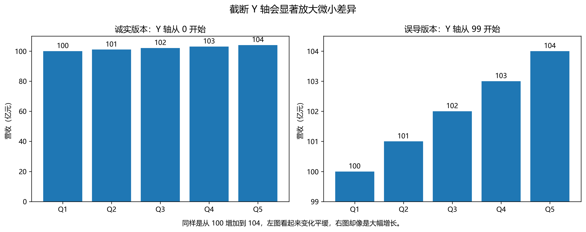
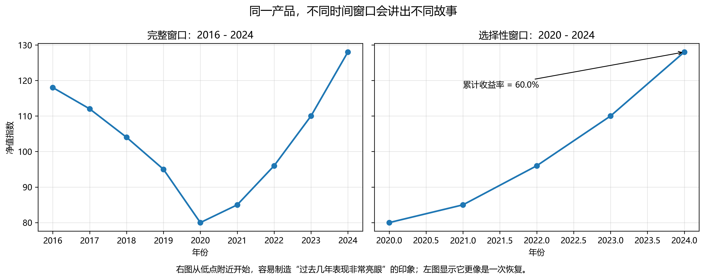
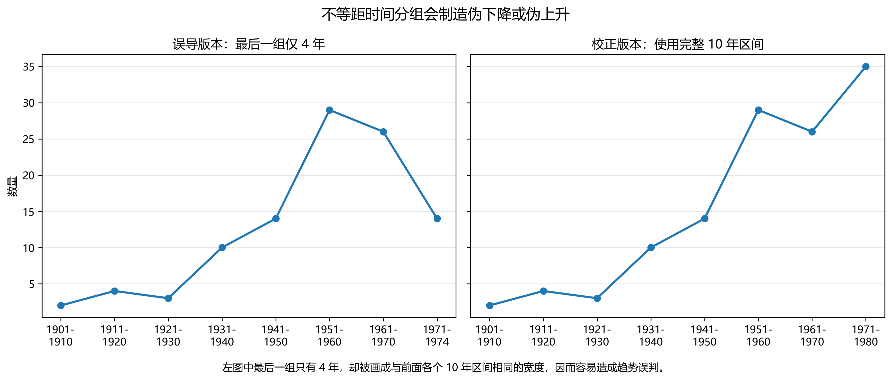
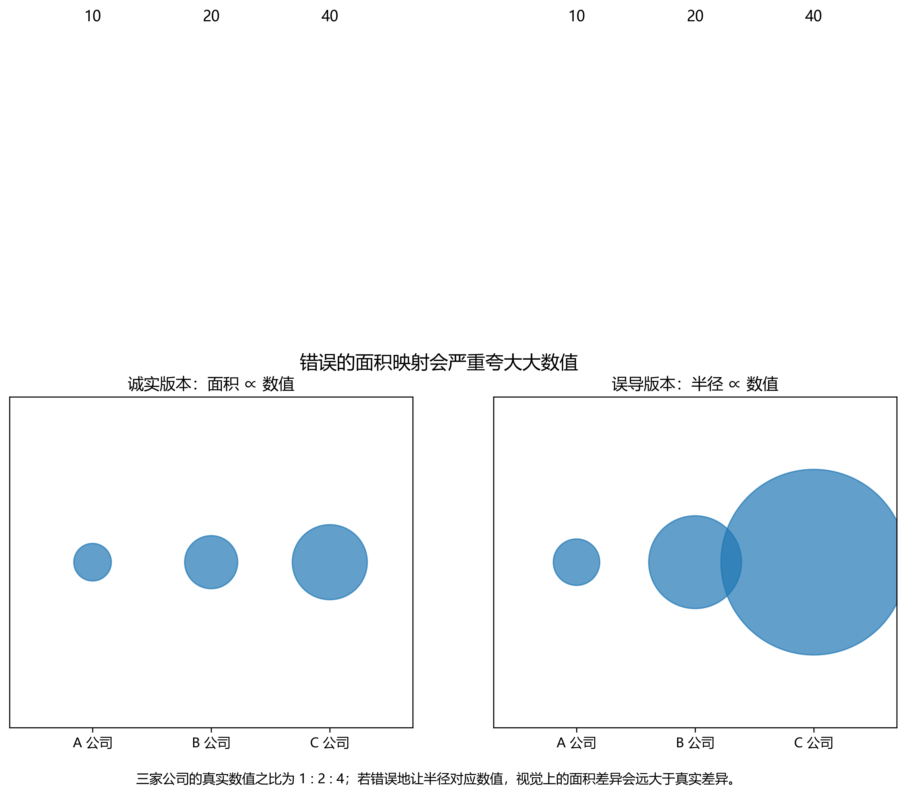
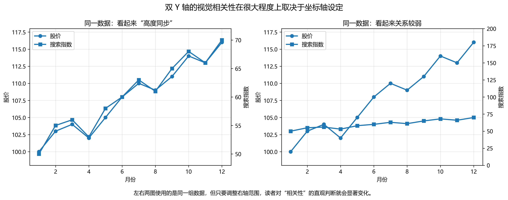
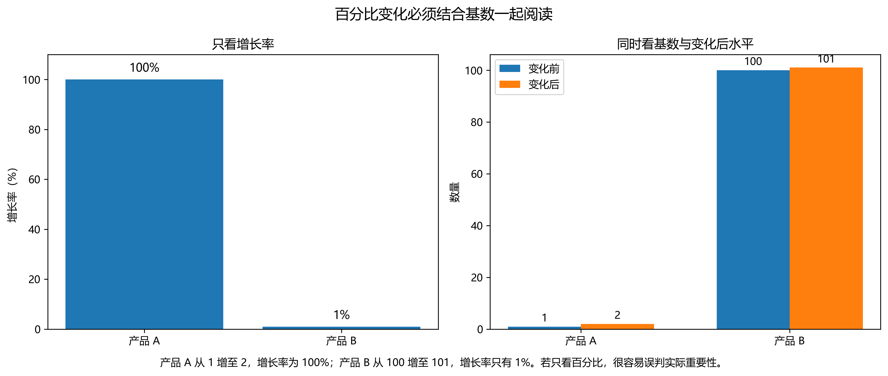

# 数据可视化：一些基本原则

::: {.callout-tip}
### 参考资料

- Luis Moneda, Data VisualizationPractices and examples. [Slides](https://lgmoneda.github.io/resources/presentations/Data%20Visualization.pdf).
  - 作者提供了一些 Good Examples 和 Bad Examples 的对比，帮助我们理解什么样的图形设计是有效的，什么样的设计会误导读者。
- [Data Viz Project](https://datavizproject.com/)
  - 提供各种数据可视化类型的示例和最佳实践，帮助选择合适的图形类型。
- [Best Python Chart Examples](https://python-graph-gallery.com/best-python-chart-examples/)
  - 各类漂亮的 Python 图形示例，涵盖了各种图形类型和应用场景，可以作为我们设计图形时的灵感来源。
- [Information is Beautiful](https://informationisbeautiful.net/)
  - 提供大量信息可视化的案例和工具，帮助理解如何将复杂数据转化为易于理解的图形。
- 张蛟蛟, 2025, [从“能看”到“好懂”：科研图表设计的原则和建议](https://www.lianxh.cn/details/1572.html).
- 肖蕊, 2022, [Stata可视化：能用图形就不用表格](https://www.lianxh.cn/details/977.html).
:::

---

## 可视化的基本原则

> **本节目标**：建立"好图"的审美标准和判断框架。不追求代码细节，而是理解**为什么这样画**——这是让 AI 帮你生成高质量图形代码的前提。

---

### 图形 vs 表格：什么时候用哪个

图形和表格是数据呈现的两种基本形式，选择哪种取决于**你想传递什么信息**，而不是习惯或偏好。

**适合用表格的场景**

- 读者需要查询精确数值（如回归系数、标准误）
- 需要同时呈现多个维度的精确对比
- 数据量少，关系简单，不需要视觉辅助

**适合用图形的场景**

- 展示趋势（上升、下降、周期性）
- 展示分布形态（偏态、肥尾、双峰）
- 展示变量之间的关系（正相关、非线性）
- 识别离群值

**金融场景举例：回归结果用表还是图？**

传统做法是把回归系数整理成表格。但当解释变量较多、或需要比较多个模型时，**系数图（coefficient plot）** 往往更直观——把系数估计值和置信区间画成点+误差棒，读者一眼就能看出哪些变量显著、效应方向和大小。

> 📌 **原则**：如果读者需要"读数"，用表格；如果读者需要"看趋势/模式"，用图形。


学术论文中越来越多的学者开始使用图形来展示回归结果、分布特征和相关结构，甚至直接用图形替代传统的表格。这不仅提升了论文的可读性，也让研究发现更直观、更有说服力。

{width="90%"}

{width="90%"}


::: {.callout-tip}
#### 示例提示词

```md
我有一个 OLS 回归结果，包含 8 个解释变量的系数和标准误。
请帮我用 matplotlib 画一个系数图（coefficient plot）：

- 横轴为系数估计值，纵轴为变量名
- 用水平误差棒表示 95% 置信区间
- 在 x=0 处画一条垂直虚线作为参考线
- 显著（p<0.05）的变量用深色，不显著的用浅灰色
- 去掉上边框和右边框，整体风格简洁
```
:::

---

### 图形类型的选择：按分析目的匹配

**最常见的错误**：拿到数据先想"我要画什么图"，而不是先问"我想回答什么问题"。

图形类型应由**分析目的**决定：

| 分析目的 | 推荐图形 | 避免 |
|----------|----------|------|
| 单变量分布 | 直方图、KDE、箱线图、小提琴图 | 折线图 |
| 两变量关系 | 散点图（+回归线） | 折线图（除非是时序） |
| 分组比较 | 分组箱线图、分组柱状图 | 饼图 |
| 时间趋势 | 折线图 | 柱状图（时间点多时） |
| 构成比例 | 堆叠柱状图、面积图 | 饼图（类别>4时） |
| 相关结构 | 热力图（相关矩阵）、散点图矩阵 | 多条折线堆叠 |

**能用图就不用表格**：

{width="90%"}

{width="90%"}


> Source: 肖蕊, 2022, [Stata可视化：能用图形就不用表格](https://www.lianxh.cn/details/977.html).

**关于饼图**：饼图在经济/金融研究中几乎没有好的使用场景。人眼对角度的判断远不如对长度的判断准确，当类别超过 3–4 个时，读者根本无法比较各扇形的大小。绝大多数饼图都可以用**横向柱状图**替代，且信息传递更清晰。

{width="90%"}

> Source: [Introduction to Modern Statistics (2e)](https://openintrostat.github.io/ims), [chapter 4](https://openintrostat.github.io/ims/explore-categorical.html)

**关于 3D 图形**：3D 效果几乎从不增加信息量，反而会造成视觉扭曲——靠近观察者的柱体看起来更高，远处的更低，读者无法准确读取数值。永远不要用 3D 柱状图或 3D 饼图。

{width="90%"}

{width="90%"}


>Source: 张蛟蛟, 2025, [从“能看”到“好懂”：科研图表设计的原则和建议](https://www.lianxh.cn/details/1572.html).


**金融场景举例**

- 想展示沪深 300 过去 10 年的走势 → **折线图**（时间序列）
- 想比较不同行业股票的收益率分布 → **分组箱线图或小提琴图**
- 想看多个资产之间的相关性 → **热力图**
- 想看某只股票日收益率是否接近正态分布 → **直方图 + KDE**

{width="100%"}

>Source: [Chap 上证指数的时序特征](https://lianxhcn.github.io/dsfin/Lecture/data_get_data/data_03_TS_SZ_index.html)

{width="90%"}

>Source: [Chap 上证指数的时序特征](https://lianxhcn.github.io/dsfin/Lecture/data_get_data/data_03_TS_SZ_index.html)

### 提示词


> 参考：[data-to-viz.com](https://www.data-to-viz.com/#explore) 提供了最全面的"数据类型 → 图形类型"决策树，遇到不确定的情况可以查阅。

::: {.callout-tip}
#### 示例提示词

我想比较 A 股市场中金融、消费、科技三个行业在 2020–2024 年间
月收益率的分布差异。请推荐最合适的图形类型，并说明理由。
然后用 Python (seaborn) 帮我画出来，使用模拟数据作为示例。

要求：去掉上边框和右边框，添加合适的中文标题和坐标轴标签。

:::

---

### 数据墨水比：简洁即美

爱德华·塔夫特（Edward Tufte）在《[定量信息的视觉呈现](https://www.edwardtufte.com/tufte/books_vdqi)》中提出了 **数据墨水比（Data-Ink Ratio）** 的概念：

$$
\text{数据墨水比} = \frac{\text{用于呈现数据的墨水量}}{\text{图形使用的全部墨水量}}
$$

**核心思想**：去除一切不传递数据信息的视觉元素，让每一滴"墨水"都在做有效的工作。

**常见的冗余元素**（应当删除或弱化）

- **3D 效果**：没有第三个数据维度，却用了三维空间
- **渐变填充和阴影**：视觉噪音，不传递任何数据信息
- **过密的网格线**：轻淡的辅助线即可，深色粗网格线干扰数据
- **多余的边框**：通常只需要左轴和下轴，去掉上边框和右边框
- **重复的数据标签**：坐标轴已经提供了数值信息，柱体上再标一遍是冗余
- **默认图例框**：能直接在图上标注的，不需要图例

{width="90%"}

> [Sources](https://lgmoneda.github.io/resources/presentations/Data%20Visualization.pdf)


**Before / After 对比**

原始图（低数据墨水比）往往具有：蓝色背景、粗黑边框、深色网格线、3D 效果、渐变色填充。

改进后的图：白色背景、去掉上/右边框、浅灰色辅助线（或无网格线）、单色填充、直接标注。

在 Python 中，`sns.despine()` 一行代码就能去掉上边框和右边框，是提升数据墨水比最简单的操作。

::: {.callout-tip}
#### 示例提示词

```
请帮我画一个简洁风格的柱状图，展示 5 个行业的平均市盈率（PE）。
要求遵循高数据墨水比原则：

- 白色背景，去掉上边框和右边框
- 使用浅灰色水平辅助线（而非网格线）
- 柱体使用单一颜色（不要渐变），按数值从大到小排序
- 柱体顶部直接标注数值，不需要纵轴刻度
- 使用 matplotlib，图形尺寸 (8, 5)
```
:::

---

### 颜色：功能、配色方案与色盲友好

颜色是可视化中最容易被滥用的元素。使用颜色之前，先问：**这个颜色在传递什么信息？**

**颜色的三种功能**

| 功能 | 含义 | 示例场景 | 推荐配色类型 |
|------|------|----------|--------------|
| **分类** | 区分不同类别 | 不同行业、不同资产 | 定性调色板（Qualitative） |
| **顺序** | 表示数值大小 | 相关系数热力图、地图密度 | 顺序调色板（Sequential） |
| **强调** | 突出特定数据点 | 高亮某个离群点、某个时期 | 单色 + 强调色 |

**实用配色建议**

- **定性**：`Set2`、`tab10`（seaborn/matplotlib 内置），颜色区分度高且美观
- **顺序**：`viridis`、`Blues`——避免使用彩虹色（`jet`），彩虹色在灰度打印时完全失效
- **发散**：`RdBu`、`coolwarm`——适合有正负含义的数据（如超额收益、温度异常）

**色盲友好**

约 8% 的男性存在红绿色盲，无法区分红色和绿色。检验方法：将图形转为灰度，如果仍然可读，色盲友好度较高。Seaborn 的 `colorblind` 调色板是专门为色觉缺陷设计的，在学术论文中推荐使用。

**金融惯例的特殊性**

中国 A 股市场使用**红涨绿跌**的惯例，与国际市场（红跌绿涨）相反。在面向国际读者的论文中，应使用国际惯例或用文字说明，避免误读。

**黑白打印兼容性**

学术期刊论文在印刷时往往是黑白的。如果图形只靠颜色区分类别，打印后将完全无法区分。解决方案：同时使用颜色 + 线型/标记形状（如实线、虚线、点线）进行双重编码。

::: {.callout-tip}
#### 示例提示词

```md
我想画一张折线图，比较沪深300、中证500、创业板指三个指数
在 2019–2024 年的累计收益率走势。
要求：

- 使用色盲友好的配色（seaborn colorblind palette）
- 同时用不同线型区分三条线（实线、虚线、点划线），确保黑白打印可读
- 图例直接标注在每条线的末端，而非放在图例框中
- 中文标题和标签，去掉上/右边框
```
:::

---

### 文字元素：标题、标签、标注与图例

文字元素是图形的"说明书"，设计得好能让图形自己说话，设计得差会让读者在图形和说明文字之间来回跳转。

#### 标题：描述性 vs 结论性

**描述性标题**：告诉读者图里有什么数据。
> "2010–2023 年中国 GDP 增速"

**结论性标题**：告诉读者图里的核心发现。
> "金融危机后 GDP 增速系统性低于危机前水平"

对于学术论文和研究报告，**结论性标题**通常更有力——它让读者在看图之前就知道该关注什么。探索性分析阶段用描述性标题即可。

#### 坐标轴标签：单位不能省

坐标轴标签必须包含**变量名**和**单位**，缺一不可。

- ❌ `"GDP"`
- ✅ `"GDP（万亿元，2015年不变价）"`
- ❌ `"Return"`
- ✅ `"日收益率（%）"`

#### 标注：直接标在图上

能直接在图上标注的信息，不要放进图例。直接标注（direct labeling）有两个优点：读者不需要在图形和图例之间来回对应；标注的位置本身就传递信息（靠近数据点）。

适合直接标注的情形：折线图末端直接写系列名称；散点图中标注关键数据点的名称；柱状图柱体顶端标注数值。

#### 字体与字号的层级感

一张图中，文字元素应有清晰的视觉层级：

| 元素 | 建议字号 | 建议样式 |
|------|----------|----------|
| 图形标题 | 13–14pt | 加粗 |
| 坐标轴标签 | 11–12pt | 正常 |
| 刻度标签 | 9–10pt | 正常 |
| 图内标注 | 9–10pt | 正常或斜体 |
| 图注（caption） | 9–10pt | 正常 |

字号差异制造视觉层次感，让读者的视线自然地从标题→坐标轴→数据→标注依次移动。

::: {.callout-tip}
#### 示例提示词

```
请帮我改进一张折线图的文字元素：

- 将标题改为结论性标题："新冠疫情冲击后，A股波动率持续高于疫情前水平"
- 纵轴标签改为"日收益率波动率（%，20日滚动标准差）"
- 去掉图例框，在每条线的右端直接标注名称
- 标题字号 13，加粗；坐标轴标签字号 11；刻度标签字号 9
- 在 2020 年 2 月处添加一条垂直虚线，标注文字"新冠疫情冲击"
```
:::

---

### 坐标轴与可比性

坐标轴的设置直接决定读者对数据的感知，是最容易造成误导的技术细节。

#### Y 轴是否从零开始

**柱状图必须从零开始**。柱体的高度代表数值的绝对大小，截断 Y 轴会严重夸大差异。例如，两个分别为 520 和 500 的数值，Y 轴从 490 开始时看起来差异巨大，实际上只有 4% 的差距。

{width="90%"}

> [Sources](https://lgmoneda.github.io/resources/presentations/Data%20Visualization.pdf)

**折线图不必须从零**。折线图关注的是趋势和变化，适当截断 Y 轴可以让趋势更清晰。但应该在图中说明 Y 轴范围，让读者自行判断变化幅度。

#### 对数坐标轴的适用场景

当数据跨越多个数量级，或关注的是**百分比变化**（而非绝对变化）时，对数坐标轴更合适：

- **股价长期走势**：线性坐标轴下，早期的波动几乎看不见；对数坐标轴下，相同的百分比涨跌在任何时期都占相同的视觉空间
- **跨量级比较**：同时展示大盘股和小盘股的市值
- **经济增长率比较**：不同基数的国家之间

对数坐标轴的**注意事项**：数值不能为零或负数；需要在图中明确标注"对数坐标"，避免读者误读。

#### 多图并排时的一致性

当多张图并排对比时（如不同时期、不同国家），**坐标轴范围必须一致**。否则，即使数值相近，图形呈现出来的视觉差异也会截然不同，读者会被误导。

#### 双 Y 轴的规范使用

双 Y 轴（twinx）是一个有争议的设计——它让两个量级不同的变量共享同一张图，但读者很难判断两条线的相对变化是否真实。

**合理使用场景**：两个变量在概念上密切相关，且读者对两者的单独走势都感兴趣（如股价与成交量）。

**应避免的场景**：用双 Y 轴制造虚假的视觉相关性——通过调整其中一个 Y 轴的范围，可以让两条任意的时间序列看起来高度同步。

{width="90%"}

>[Source](https://flowingdata.com/2017/02/09/how-to-spot-visualization-lies/)

::: {.callout-tip}
#### 示例提示词

```
我想画两张并排的折线图，分别展示 A 股和港股
在 2020–2024 年的年化波动率，用于直接对比。
要求：

- 两张子图的 Y 轴范围必须一致（手动设置为相同的 ylim）
- 在两张图的标题下方各加一行副标题，注明数据来源和计算方式
- 图形尺寸 (12, 5)，左右子图间距适当
```
:::

---

### 诚实性：财经媒体中的常见误导陷阱

数据可视化并不是一个“中性容器”。同一组数据，经过不同的坐标轴设定、时间窗口选择、比例映射方式和图形布局处理后，读者看到的“结论”可能完全不同。很多误导图形并没有篡改原始数据，但它们改变了数据到视觉元素之间的映射关系，从而影响了读者的判断。

从形式上看，图表就是把数值 $x$ 映射为位置、长度、面积、角度、颜色或体积等视觉对象；如果这种映射关系不再保持可比性，那么图表即使“数据真实”，也可能“表达失真”。

$$
\text{visual impression} \neq \text{data magnitude}
$$

因此，阅读财经媒体、研究报告、券商研报和上市公司公告时，不能只看“图形长什么样”，还要看“图形是怎么画出来的”。

####  截断 Y 轴夸大差异

这是最常见的一类误导。比如，某公司净利润从 100 亿元增长到 103 亿元，真实增长率只有 3%。如果柱状图的纵轴从 98 而不是从 0 开始，那么柱体高度差会被明显放大，视觉上仿佛出现了“跳升”。

这一问题的核心在于：柱状图所表达的主要信息是“长度差异”，而长度的比较通常默认以零点为基准。当零点被人为抬高后，视觉比例就被扭曲了。

判断方法很简单：先看 Y 轴是否从 0 开始，然后问自己一句话：**如果纵轴从 0 开始，这个差异还会显得如此巨大吗？**

建议配图文件：



#### 选择性时间窗口，制造“趋势”

同一条时间序列，只要起点和终点选得不同，叙事就可能完全改变。某产品如果恰好从低点开始计算，便很容易得到“过去三年累计收益率 60%”这样的醒目结论；但如果把时间窗口向前延长几年，读者就会发现，这可能只是一次从前期大跌中的恢复，而不是持续稳定的高回报。

这一类误导并不一定来自虚构数据，而是来自**选择对自己有利的样本区间**。因此，时间序列图不能只看斜率和终点，更要看它的起点是如何被选定的。

判断方法包括两条：

* 把时间窗口适当拉长，看“漂亮结论”是否仍然成立；
* 用多个起始点重复计算累计收益率、增长率或变化率，检查结论是否稳健。

建议配图文件：



#### 不等距时间刻度，制造伪趋势

这类误导比截断 Y 轴更隐蔽。图上的横轴看起来像是按时间顺序均匀展开的，但实际上各区间长度并不相同，却被画成了相同宽度。这样一来，读者会自然地把最后一段的高低变化理解为与前面各段完全可比的趋势变化。

你给出的 Nobel Prize 例子正属于这一类。前面若干区间都是 10 年，而最后一个区间只有 4 年，但图上却占据了和前面相同的宽度，于是读者会误以为最近一期出现了显著下降。问题不在于最后一个数据点一定错误，而在于**它与前面的区间并不可直接比较**。

因此，时间序列图除了要求“有年份标签”之外，还要求“时间分组可比”。如果每个组的时间跨度不同，那么图上的斜率、拐点和跌幅都可能带有误导性。

你提供的图片可以保留在这里，图注建议改为：

> 图：不等距时间分组会制造虚假的趋势变化。左图将仅有 4 年的数据区间画成与前面多个 10 年区间相同的宽度，从而造成明显下降的视觉错觉；右图改为完整且可比的时间区间后，趋势判断随之改变。

建议配图文件：



#### 面积或体积误用

当图中用圆、球、图标大小来代表数值时，最容易出现的错误是：设计者让**半径**直接对应数值，而读者实际感受到的却是**面积**甚至**体积**。这样一来，大值会被严重夸大。

如果用圆面积表示数值 $v$，那么正确关系应满足

$$
A \propto v
$$

而圆面积满足

$$
A = \pi r^2
$$

因此半径应当满足

$$
r \propto \sqrt{v}
$$

如果错误地令 $r \propto v$，那么就会导致

$$
A \propto v^2
$$

也就是说，数值翻倍，面积会变成 4 倍；数值变为 4 倍，面积会膨胀为 16 倍。很多“气泡图很震撼”的来源，其实不是数据本身，而是比例映射出了问题。

建议配图文件：



#### 用双 Y 轴制造虚假相关性

双 Y 轴图形的危险之处在于：两个变量虽然单位不同，但通过分别调整左轴和右轴的上下界，可以让两条曲线看起来“高度同步”，也可以让它们看起来“几乎无关”。也就是说，视觉相关性在很大程度上取决于坐标轴设定，而不完全取决于数据本身。

设两个序列分别为 $x_t$ 和 $y_t$。图形绘制时，常常实际展示的是它们经过线性变换后的结果：

$$
x_t^\ast = a_1 + b_1 x_t,\qquad
y_t^\ast = a_2 + b_2 y_t
$$

只要适当选择 $a_1, b_1, a_2, b_2$，两条线的视觉形状就可能明显靠拢，或者被人为拉开。于是，读者很容易从“走势接近”推断出“存在强相关甚至因果关系”，这在实证分析中是非常危险的。

更稳妥的做法包括：

* 把两个序列统一转换为指数形式，例如都以起点记为 100；
* 或者分别作图；
* 或者直接报告相关系数、回归结果，而不是只依赖视觉印象。

建议配图文件：



## 6. 忽略基数，只强调百分比变化

财经媒体中经常出现“同比增长 100%”“环比翻倍”之类的说法，但如果不同时报告基数，这类表述很容易误导。因为增长率定义为

$$
g = \frac{y_1 - y_0}{y_0}\times 100%
$$

当 $y_0$ 很小时，即使绝对变化极小，也可能得到惊人的增长率。

例如，从 1 增加到 2，增长率是 100%；而从 100 增加到 101，增长率只有 1%。但前者的绝对增量只有 1，后者的绝对增量同样也是 1。只看百分比，不看基数，就会让读者把“小基数上的正常波动”误认为“重大增长”。

因此，涉及增长率、同比、环比、收益率时，最好同时呈现：

* 初始水平；
* 变化后的水平；
* 绝对增量；
* 相对增幅。

建议配图文件：



## 7. 阅读财经图表时的基本检查清单

面对一张图表，至少应依次检查以下问题：

* 坐标轴的起点是否合理，尤其是柱状图的 Y 轴是否被截断；

* 时间窗口是如何选择的，是否只截取了对结论有利的区间；

* 横轴分组是否等距，时间跨度是否可比；

* 面积、体积、气泡大小是否与数据保持正确比例；

* 双 Y 轴是否被用来强化某种“同步性”叙事；

* 百分比变化是否同时报告了对应的基数和绝对量。

很多图形的问题不在于“数据造假”，而在于“视觉编码不诚实”。对数据分析者而言，关键不只是会画图，更是能够判断一张图是否忠实地表达了数据。


---

### 叙事性：让图说话

一张好的图形应该能独立传递一个清晰的信息，不依赖大段文字解释。这需要**叙事设计**：在画图之前，先想清楚"这张图的核心结论是什么"，然后围绕这个结论做所有设计决策。

#### 一张图，一个核心结论

如果一张图试图同时说明三件事，读者通常什么都记不住。把复杂信息拆成多张图，每张聚焦一个核心发现。

**如何围绕核心结论设计图形**

- **标题**：直接写出结论
- **颜色**：用强调色突出支持结论的数据，其余数据用灰色淡化
- **标注**：在关键数据点、关键时间节点直接标注文字说明
- **坐标轴范围**：让最重要的变化在视觉上占据足够空间

#### 图形在报告/论文中的位置逻辑

- 图形应紧跟相关文字，而非集中放在文末
- 正文中要引用图形编号，并用一两句话说明读者应该从图中注意什么
- 图注（caption）应该让图形能独立被理解，包含数据来源、样本范围、必要的计算说明

::: {.callout-tip}
#### 示例提示词

```md
我想用一张图说明这个结论：
"2015年股灾期间，小盘股的跌幅显著大于大盘股"

请帮我设计这张图：

- 数据：用模拟数据，两条时间序列分别代表大盘股指数和小盘股指数，
  在某个时间段内小盘股跌幅更大
- 小盘股用深红色实线，大盘股用浅灰色实线
- 在跌幅最大的时间点标注两者的跌幅数值
- 在股灾期间（约 3 个月）加灰色背景色块
- 结论性标题："股灾期间小盘股跌幅约为大盘股的 2 倍"
- 图例直接标在线条末端
```
:::

---

### 小结

| 原则 | 核心问题 | 一句话记忆 |
|------|----------|------------|
| 图 vs 表 | 读者需要读数还是看模式？ | 查数用表，看趋势用图 |
| 图形选择 | 我想回答什么问题？ | 目的决定图形，而非数据决定图形 |
| 数据墨水比 | 这个元素在传递数据信息吗？ | 删掉一切不做贡献的元素 |
| 颜色 | 这个颜色在说什么？ | 颜色有功能，不是装饰 |
| 文字元素 | 读者能独立理解这张图吗？ | 结论性标题 + 直接标注 |
| 坐标轴 | 视觉比例是否反映真实比例？ | 柱图从零，折线看趋势，多图轴一致 |
| 诚实性 | 有没有视觉上夸大或缩小差异？ | 先看坐标轴，再看数据 |
| 叙事性 | 这张图的核心结论是什么？ | 一张图，一个结论 |

---

### 延伸阅读

- Schwabish, J. A. (2014). An Economist's Guide to Visualizing Data. *Journal of Economic Perspectives*, 28(1), 209–234. [Link](https://www.aeaweb.org/articles?id=10.1257/jep.28.1.209), [PDF](https://www.aeaweb.org/articles/pdf/10.1257/jep.28.1.209)
- Tufte, E. R. (2001). *The Visual Display of Quantitative Information*. [Link](https://www.edwardtufte.com/tufte/books_vdqi).
- 张蛟蛟 (2025). 从"能看"到"好懂"：科研图表设计的原则和建议. 连享会. [Link](https://www.lianxh.cn/details/1572.html)
- [data-to-viz.com](https://www.data-to-viz.com/#explore) — 图形类型决策树
- [ColorBrewer 2.0](https://colorbrewer2.org) — 配色方案工具

---

## 双变量与多变量关系的可视化

> **本节数据**：使用 `codes_data_china.ipynb` 中的 `ret_wide`（五只股票日收益率宽表）

### 散点图与回归线

散点图是探索两个连续变量之间关系的最基本工具。单独的散点图只能"看到"数据点的分布，加上回归线后才能量化关系的方向和强度。

**散点图的三个层次**：

| 层次 | 内容 | 工具 |
|------|------|------|
| 基础 | 散点 + OLS 回归线 | `sns.regplot()` |
| 进阶 | 散点 + 局部加权回归（LOWESS） | `sns.regplot(lowess=True)` |
| 完整 | 散点 + 回归线 + 边际分布 | `sns.jointplot()` |

**何时用 LOWESS 而非 OLS 直线？** 当你不确定关系是否线性时，先用 LOWESS（局部加权散点平滑）探索，如果 LOWESS 曲线接近直线，再用 OLS；如果呈明显弯曲，说明存在非线性关系，直接用 OLS 会误导。

**金融场景**：个股收益率 vs 市场收益率（$\beta$ 系数的直觉来源）。

::: {.callout-tip}
#### 示例提示词

```
我有两列数据：个股日收益率（y）和市场指数日收益率（x）。
请帮我用 seaborn 画一张散点图：

- 散点颜色用密度着色（越密集的区域颜色越深）
- 叠加 OLS 回归线和 95% 置信带
- 在图内标注回归方程和 R²
- 添加 x=0 和 y=0 的参考线
- 坐标轴单位为 %，标题说明这是 CAPM Beta 的直觉展示
```
:::

### 相关矩阵热力图

当变量数量超过 2 个时，散点图矩阵变得拥挤，相关矩阵热力图是更紧凑的替代方案。

**设计要点**：

- 使用**发散型配色**（如 `RdBu_r`）：正相关为红，负相关为蓝，零相关为白
- 只显示**下三角**（上下三角对称，显示全部是冗余）
- 在每个格子中**直接标注相关系数数值**，不要让读者猜
- 将色阶固定为 `vmin=-1, vmax=1`，而非自适应——否则当所有相关系数都是正数时，最小的正相关会显示为蓝色，造成误读

**金融场景**：多资产组合构建时，低相关资产的识别是分散化的基础。

::: {.callout-tip}
#### 示例提示词

```
我有 5 只股票的日收益率数据（DataFrame，列为股票名称）。
请帮我画一张相关矩阵热力图：

- 只显示下三角（上三角和对角线用白色遮盖）
- 使用 RdBu_r 配色，vmin=-1, vmax=1
- 每个格子内标注相关系数（保留 2 位小数）
- 标题说明股票名称和时间范围，图形尺寸 (7, 6)
```
:::

### 散点图矩阵（Pairs Plot）

散点图矩阵同时展示所有变量的两两关系：**对角线**显示每个变量的分布（直方图或 KDE），**非对角线**显示两两散点图。

适用场景：变量数量在 3–7 个之间，需要同时探索分布和关系。变量过多时图形会过于拥挤，建议换用相关矩阵热力图。

`seaborn.pairplot()` 的关键参数：`hue` 按类别变量着色；`corner=True` 只显示下三角；`diag_kind='kde'` 对角线用 KDE 替代直方图。

::: {.callout-tip}
#### 示例提示词

```md
我有 5 只股票的日收益率数据，请用 seaborn.pairplot 画散点图矩阵：

- 只显示下三角（corner=True）
- 对角线显示 KDE 曲线
- 非对角线的散点半透明（alpha=0.3），加 OLS 回归线
- 颜色使用 colorblind palette，图形整体尺寸约 (10, 10)
```
:::

### 综合案例：多资产收益率的联动关系

::: {.callout-tip}
#### 示例提示词

```md
使用 codes_data_china.ipynb 中的 ret_wide 数据（五只A股股票日收益率），
完成以下分析并用一张多子图展示：

- 左图：相关矩阵热力图（下三角，RdBu_r 配色）
- 右图：贵州茅台 vs 宁德时代的散点图（两者行业差异大），
  叠加 OLS 回归线，图内标注相关系数和 Beta 值
- 总标题："消费与新能源龙头股收益率相关性较低，适合组合配置"
```
:::

---

## 时间序列的可视化

> **本节数据**：`index_close` / `index_norm`（四大指数）、`cpi_df` / `gdp_df`（宏观数据）

时间序列是金融数据最常见的形态。除了基本的折线图，金融时序可视化有几个独特的设计元素。

### 折线图的规范画法

时序折线图的几个容易忽略的规范：

- **X 轴刻度**：使用 `matplotlib.dates` 格式化，避免出现 `2020-01-01 00:00:00` 这样的冗余时间戳
- **多条线的区分**：颜色 + 线型双重编码（参见颜色一节）
- **直接标注**：将系列名称标在线条末端，而非放在图例框中
- **Y 轴起点**：折线图不需要从零开始，但要在轴标签中注明数值含义

### 事件标注：政策时间线与危机区间

金融时序图中，**事件标注**往往比数据本身更有叙事价值。

**竖线 + 文字**（`ax.axvline` + `ax.text`）：适合标注单一时间点，如政策发布日、上市日期。

**背景色块**（`ax.axvspan`）：适合标注持续一段时间的事件区间，如经济衰退期、疫情管控期。

A 股常用事件节点：

| 事件 | 时间 | 标注建议 |
|------|------|----------|
| 2015 年股灾 | 2015-06 ~ 2015-09 | 背景色块（红色，低透明度） |
| 去杠杆 | 2018-01 ~ 2018-12 | 背景色块 |
| 新冠冲击 | 2020-01 ~ 2020-03 | 背景色块 |
| 注册制改革 | 2019-07-22 | 竖线 |
| 北交所开市 | 2021-11-15 | 竖线 |

### 对数坐标轴

**典型应用**：展示沪深 300 自 2005 年以来的长期走势。线性坐标下，2007 年和 2015 年的牛市在早期几乎看不出波动；对数坐标下，早期的涨跌与近期的涨跌在视觉比例上保持一致。

### 多资产对比与不确定性

**滚动统计**：金融时序中经常需要展示滚动均值、滚动标准差（波动率）。`pandas` 的 `.rolling(window).mean()` 和 `.rolling(window).std()` 提供简洁的实现。

**置信带**：`ax.fill_between(x, y_lower, y_upper)` 绘制置信区间或预测区间的阴影带。

::: {.callout-tip}
#### 示例提示词

```md
使用 index_norm 数据（四大指数归一化走势），画一张完整的时序对比图：

- 四条线，颜色+线型双重编码，线条末端直接标注指数名称
- 在以下时间节点加事件标注：
  - 2015-06 ~ 2015-09：红色色块，标注"2015股灾"
  - 2020-01 ~ 2020-03：灰色色块，标注"新冠冲击"
  - 2018-01 ~ 2018-12：橙色色块，标注"去杠杆"
- Y 轴用对数刻度（semilogy），标注"归一化指数（对数刻度，基期=100）"
- 结论性标题："创业板指长期弹性最大，但经历了更剧烈的波动"
- 图形尺寸 (12, 5)
```
:::

### K 线图（mplfinance）

K 线图（蜡烛图）是股票技术分析的标准图形，由**开盘价、收盘价、最高价、最低价**四个数值构成。

**K 线的基本规则**（中国 A 股惯例）：

- 收盘价 > 开盘价 → **红色实心**柱（阳线，上涨）
- 收盘价 < 开盘价 → **蓝色空心**柱（阴线，下跌）
- 上下影线代表当日最高价和最低价

**`mplfinance` 常用叠加指标**：移动均线（`make_addplot()`）、成交量（`volume=True`）、布林带（手动叠加）。

> ⚠️ **注意**：`mplfinance` 要求 DataFrame 的索引必须是 `DatetimeIndex`，列名必须包含 `Open`、`High`、`Low`、`Close`（首字母大写），否则会报错。

::: {.callout-tip}
#### 示例提示词

```md
使用 kline_df 数据（贵州茅台日K线，含 open/high/low/close/volume），
用 mplfinance 画一张专业K线图：

- 取最近 60 个交易日
- 颜色：红涨（#d7191c）蓝跌（#2166ac），符合A股惯例
- 叠加 MA20（橙色实线）和 MA60（蓝色虚线）
- 下方显示成交量柱状图，白色背景，去掉多余边框
- 图形标题包含股票名称和时间范围

注意：mplfinance 需要列名为 Open/High/Low/Close/Volume（首字母大写）
```
:::

---

## 回归结果的可视化

> **衔接说明**：本节是可视化与计量分析的接口。本章只讲"怎么画"，回归本身的理论在后续计量章节中展开。

### 系数图（Coefficient Plot）

当需要比较多个模型的同一系数时（如加入不同控制变量后系数的稳健性），可以将多组系数并排绘制：每个变量对应一行，不同模型用不同颜色/形状的点表示。

这种图在实证论文中被称为**稳健性检验图**，比在文中写"系数在加入控制变量后基本不变"更直观。

::: {.callout-tip}
#### 示例提示词

```
我有三个 OLS 回归模型，解释变量相同但控制变量不同（模型1无控制变量，
模型2加入行业固定效应，模型3加入时间和行业双固定效应）。
请帮我画一张多模型系数对比图：

- 纵轴为变量名，每个变量画 3 个点（对应三个模型）
- 三个模型用不同颜色和形状区分（圆、方、三角）
- 每个点配 95% 置信区间误差棒，x=0 处画垂直虚线
- 图例说明三个模型的区别，图形尺寸 (8, 6)，使用模拟数据演示
```
:::

### 残差诊断图

OLS 回归有四个核心假设，每个假设对应一种诊断图：

| 假设 | 诊断图 | 理想状态 |
|------|--------|----------|
| 线性性 | 残差 vs 拟合值图 | 散点随机分布在 y=0 两侧，无系统性弯曲 |
| 正态性 | 残差 QQ 图 | 散点落在对角参考线上 |
| 同方差性 | 标准化残差 vs 拟合值 | 散点的垂直扩散范围一致，无漏斗形 |
| 无强影响点 | Cook's 距离图 | 无超过阈值（通常 4/n）的点 |

这四张图通常**2×2 排列**，构成"标准残差诊断面板"。R 语言的 `plot(lm_model)` 直接输出这四张图；Python 中需要手动实现，但逻辑完全相同。

::: {.callout-tip}
#### 示例提示词

```
我用 statsmodels OLS 跑了一个回归，结果存储在变量 model_result 中。
请帮我画标准的 2×2 残差诊断面板：

- 左上：残差 vs 拟合值（散点 + y=0 参考线 + LOWESS 平滑线）
- 右上：残差 QQ 图（散点 + 参考线）
- 左下：标准化残差的平方根 vs 拟合值（检验同方差）
- 右下：Cook's 距离柱状图（标出超过 4/n 阈值的点）
- 每张子图有结论性标题，说明该图检验什么假设
- 使用模拟数据演示（N=200，有轻微异方差）
```
:::

### 边际效应图与预测区间

回归系数是线性模型的"全局"斜率，但在非线性模型（Logit、Probit、含交互项的 OLS）中，**边际效应**随其他变量的取值而变化，必须用图形展示。

- **含交互项的 OLS**：$y = \beta_0 + \beta_1 x_1 + \beta_2 x_2 + \beta_3 x_1 x_2$，$x_1$ 对 $y$ 的边际效应为 $\beta_1 + \beta_3 x_2$，随 $x_2$ 变化
- **Logit/Probit**：边际效应在概率的中间值处最大，在两端趋近于零

::: {.callout-tip}
#### 示例提示词

```
我有一个含交互项的 OLS 回归：y = β0 + β1*x1 + β2*x2 + β3*x1*x2 + ε
请帮我画一张边际效应图，展示 x1 对 y 的边际效应如何随 x2 变化：

- 横轴为 x2 的取值范围（从 p5 到 p95 分位数）
- 纵轴为 x1 的边际效应（β1 + β3*x2），叠加 95% 置信带
- 在 x2 均值处标注一个点，注明边际效应数值
- y=0 处加参考线（区分正/负边际效应区间）
- 使用模拟数据，N=500，seed=42
```
:::

---

## 完整案例：CAPM Beta 的可视化估计

**模型**：$r_i - r_f = \alpha + \beta (r_m - r_f) + \varepsilon$

用个股超额收益率对市场超额收益率回归，$\beta$ 衡量系统性风险。可视化流程：散点图（个股 vs 市场超额收益率）→ OLS 回归线 + 置信带 → 图内标注 $\hat{\alpha}$、$\hat{\beta}$、$R^2$ → 残差 QQ 图（检验正态性）。

::: {.callout-tip}
#### 示例提示词

```
使用 ret_wide 数据中的「宁德时代」和「沪深300指数」日收益率，
完成 CAPM 回归的完整可视化：

步骤1：画散点图
- 横轴：沪深300日收益率（市场收益率）
- 纵轴：宁德时代日收益率
- 散点半透明（alpha=0.3），使用密度着色（颜色越深表示数据点越密集）

步骤2：叠加回归结果
- 用 statsmodels OLS 估计 Alpha 和 Beta
- 在图上绘制回归线 + 95% 置信带（fill_between）
- 在图内右上角标注：Alpha=xx%, Beta=xx, R²=xx%（含显著性星号）

步骤3：右侧子图画残差 QQ 图
- 验证残差正态性，标注 Jarque-Bera 检验的 p 值

整体布局 1 行 2 列，图形尺寸 (12, 5)
结论性总标题："宁德时代 Beta 显著大于1，系统性风险高于市场"
```
:::

---

## 图形导出与报告整合

### 格式与分辨率

| 用途 | 格式 | 分辨率 | 代码 |
|------|------|--------|------|
| PPT / Word 嵌入 | PNG | 150–200 dpi | `dpi=150` |
| 论文投稿 | PDF 或 EPS | 矢量（无损） | `format='pdf'` |
| 网页 / 邮件 | PNG | 96–120 dpi | `dpi=96` |
| 海报 | PNG | 300 dpi | `dpi=300` |

PDF 是论文投稿的首选：矢量格式，无论放大多少倍都不模糊；文件体积也通常小于高分辨率 PNG。

```python
fig.savefig('fig.pdf', bbox_inches='tight', facecolor='white')
```

> 📌 `bbox_inches='tight'` 是必须加的参数，否则图形边缘容易被裁切。`facecolor='white'` 防止透明背景在某些 PDF 阅读器中显示为黑色。

### 图注的写法规范

学术论文中，**图注（Figure Caption）**必须让图形能独立于正文被理解。规范写法包含：图形编号、标题、数据说明（样本范围、时间区间、数据来源）、变量定义、统计显著性标记说明。

**示例**：
> **图 3** 五只 A 股股票日收益率的分布比较（2020–2024 年）。箱体上下边缘分别为 25% 和 75% 分位数，中线为中位数，须为 1.5 倍 IQR 范围，超出范围的点为离群值。收益率为前复权日对数收益率（%）。数据来源：akshare，原始数据来自上交所和深交所。

::: {.callout-tip}
### 示例提示词

```md
我完成了一张图形（多股票收益率分布的分组箱线图），
请帮我写一段规范的学术图注（中英文各一版），包含：

- 图形编号（Figure 1 / 图1）、描述性标题
- 数据说明：5只A股股票，2020-2024年，前复权日对数收益率
- 变量定义：箱线图的各元素含义，数据来源：akshare
字数控制在 80 字以内（中文）/ 120 words 以内（英文）
```
:::
