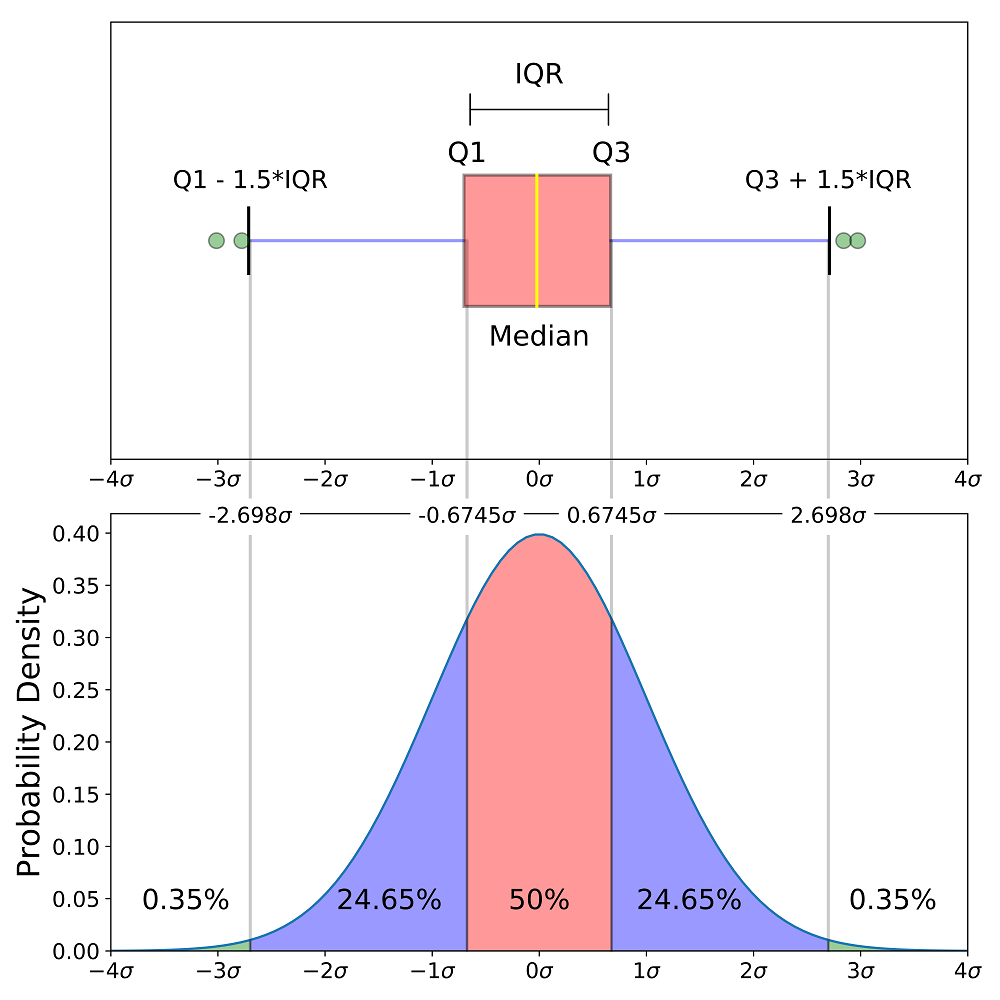

# 可视化分析：分布图

> 本章介绍金融数据分析中最常用的三类分布可视化工具：直方图、核密度函数图和箱线图/小提琴图。三者各有侧重，又相互补充——直方图是起点，核密度估计是其自然延伸，箱线图与小提琴图则以更紧凑的方式呈现分布的关键统计特征。

---

## 1. 直方图

### 1.1 什么是直方图

直方图（Histogram）是展示数据分布最直观的工具。其基本思路是：将数据划分为若干等宽区间（bins），统计每个区间内的数据点数量，并以矩形的高度加以表示。

以一个简单例子开始。某学习小组有 10 名学生，年龄分布如下：

| 年龄 | 16 | 18 | 19 | 26 |
|------|----|----|----|----|
| 人数 | 1  | 4  | 4  | 1  |

在制作上述表格的过程中，我们已经不自觉地在做「分布统计」了——将原始数据分组，统计每组的频数。直方图不过是将这个过程用图形呈现出来。


### 1.2 频数、频率与密度

绘制直方图时，纵轴有三种常见表示方式，它们本质上传达的是同一组信息，只是「度量衡」不同。

设第 $k$ 个区间内有 $n_k$ 个观测值，总观测值为 $n$，区间宽度为 $h$：

- **频数**（Frequency）：纵轴高度为 $n_k$，直接反映各区间的观测数量。
- **频率**（Relative Frequency）：纵轴高度为 $p_k = n_k / n$，表示该区间占总体的比例，所有矩形面积之和为 1。
- **密度**（Density）：纵轴高度为 $f_k = p_k / h = n_k / (n \cdot h)$，表示「单位区间内的频率」。与频率不同，密度的纵轴取值不受 $[0,1]$ 的限制。

三者的直方图**形状完全相同**，只是纵轴数值不同。密度的优势在于：无论区间宽度 $h$ 如何变化，密度直方图始终满足「面积之和为 1」，这一性质使其与后文的概率密度函数（PDF）自然衔接。

```python
import numpy as np
import pandas as pd

ages = np.array([16] + [18]*4 + [19]*4 + [26])
K = 4
h = (ages.max() - ages.min()) / K

unique, counts = np.unique(ages, return_counts=True)
frequencies = counts / counts.sum()
density = frequencies / h

tabulated = pd.DataFrame({
    "频数": counts,
    "频率": frequencies.round(3),
    "密度": density.round(4)
}, index=unique)
print(tabulated)
```

### 1.3 区间数量的选择

绘制直方图的关键决策是选择合适的区间数量 $K$（或等价地，区间宽度 $h$）。

$$h = \frac{\max(x) - \min(x)}{K}$$

**$K$ 太小**：信息被过度简化，看不出分布的细节；  
**$K$ 太大**：每个区间内的数据点稀少，图形支离破碎，「只见树木，不见森林」。

常用的自动选择规则：

- **Sturges 法则**：$K = \lceil \log_2 N + 1 \rceil$，适合对称分布。
- **Freedman-Diaconis 法则**：$h = 2 \cdot \text{IQR} \cdot N^{-1/3}$，对异常值更稳健。
- **Rice 法则**（Stata 默认）：$K = \min\{\sqrt{N},\ 10\ln(N)/\ln(10)\}$。

实践中，直接使用 `plt.hist()` 的自动选择通常即可，必要时手动调整 `bins` 参数。

```python
import matplotlib.pyplot as plt
import numpy as np

np.random.seed(1234)
age = np.random.normal(loc=21, scale=7, size=100).astype(int)
age = age[(age >= 16) & (age <= 35)]

fig, axes = plt.subplots(1, 3, figsize=(6, 2))
for i, K in enumerate([4, 10, 20]):
    axes[i].hist(age, bins=K, edgecolor='black', alpha=0.7)
    axes[i].set_title(f'K={K}')
    axes[i].set_yticks(range(0, 32, 5))
plt.tight_layout()
plt.show()
```

> **比较多个直方图的技巧**：若需要对比两个直方图，建议将其**垂直排列**（一上一下），而非水平并排。垂直排列时，横轴刻度对齐，差异一目了然；水平排列则因横向偏移而难以辨别。

### 1.4 `plt.hist()` 常用参数

```python
plt.hist(x, 
         bins=None,        # 区间数或区间边界列表，如 bins=20 或 bins=[-0.1, 0, 0.1]
         density=False,    # True 时纵轴为密度（面积=1）
         cumulative=False, # 是否绘制累积直方图
         histtype='bar',   # 'bar', 'step', 'stepfilled'
         color=None,       # 填充颜色
         edgecolor=None,   # 边框颜色
         alpha=None)       # 透明度 (0~1)
```

---

## 2. 核密度函数图

### 2.1 从直方图到核密度估计：一步步过渡

直方图有一个明显缺陷：结果依赖于区间的起点（$t_0$）。相同数据、相同宽度，只因起点不同，图形可能大相径庭。

**解决方向**：与其固定区间划分，不如让每个数据点「自带」一个贡献，在其附近平滑地分配权重，最后把所有贡献叠加起来。这正是核密度估计的基本思路。

#### 2.1.1 移动直方图

一种自然的改进是采用「移动窗口」：对每个估计点 $x$，将 $x$ 放在窗口中心，统计落在 $[x - h/2,\ x + h/2]$ 内的数据点，计算密度估计值。

$$\hat{f}(x) = \frac{1}{nh} \sum_{i=1}^{n} \mathbf{1}\left\{|X_i - x| \leq \frac{h}{2}\right\}$$

在窗口内的所有点享有相同的权重（$1/n$），不在窗口内的点权重为零。这已经是核密度估计的雏形，只不过权重分配过于「硬」——边界处权重从 1 骤降为 0。

#### 2.1.2 引入核函数：用平滑权重替代硬边界

更优雅的做法是用一个光滑的函数来替代硬边界，根据数据点 $X_i$ 与估计点 $x$ 之间的**距离**来分配权重——距离越近，权重越大；距离越远，权重越小，而不是突然截断为零。

这个分配权重的函数就是**核函数**（Kernel Function），记为 $K(\cdot)$。

核密度估计量定义为：

$$\hat{f}_h(x) = \frac{1}{nh} \sum_{i=1}^{n} K\!\left(\frac{x - X_i}{h}\right)$$

其中 $h > 0$ 是**带宽**（bandwidth），控制着每个数据点的「影响范围」。

核函数需要满足以下基本性质：非负、对称、面积为 1，即 $K(u) \geq 0$，$K(u) = K(-u)$，$\int K(u)\,du = 1$。这些性质保证了 $\hat{f}_h(x)$ 本身也是一个合法的密度函数。

### 2.2 常见核函数

不同核函数对应不同的权重分配方式：

| 核函数 | 表达式 | 特点 |
|--------|--------|------|
| Uniform | $\frac{1}{2}\mathbf{1}\{|u|\leq 1\}$ | 等权重，不平滑，用于教学演示 |
| Triangle | $(1-|u|)\mathbf{1}\{|u|\leq 1\}$ | 线性衰减，连续但不光滑 |
| Epanechnikov | $\frac{3}{4}(1-u^2)\mathbf{1}\{|u|\leq 1\}$ | 抛物线型，均方误差最小 |
| Gaussian | $\frac{1}{\sqrt{2\pi}}e^{-u^2/2}$ | 正态分布型，所有点均有权重，最为常用 |


> 图：四种核函数的权重分配机制对比。Uniform 核（左）在边界处权重骤降，而 Gaussian 核（右）对所有数据点均分配非零权重。

**实践中的选择**：核函数的选择对最终结果影响相对较小，带宽 $h$ 的选择才是关键。Gaussian 核因其良好的数学性质而被大多数统计软件默认采用（包括 Python 的 seaborn）。

### 2.3 带宽的影响

带宽 $h$ 的含义：
- **$h$ 过小**：每个数据点的影响范围很窄，估计曲线过于「锯齿状」，对噪声过于敏感（过拟合）。
- **$h$ 过大**：影响范围太宽，细节被过度平滑，可能掩盖真实的多峰结构（欠拟合）。

最优带宽通过最小化均方误差（偏差-方差权衡）确定。Silverman（1986）提出的经验公式是最常用的默认选择：

$$h^* = 1.06 \cdot \hat{\sigma} \cdot n^{-1/5}$$

Python 的 `seaborn.kdeplot()` 和 `scipy.stats.gaussian_kde()` 均默认使用此类自动带宽选择方法，通常无需手动调整。

### 2.4 Python 实操

#### 单变量核密度函数图

```python
import numpy as np
import seaborn as sns
import matplotlib.pyplot as plt

np.random.seed(142)
N = 1000
x = np.random.normal(loc=10, scale=3, size=N)
lnx = np.log(x[x > 0])

plt.figure(figsize=(8, 4))

plt.subplot(1, 2, 1)
sns.kdeplot(x, label='x ~ N(10, 3)')
plt.title('KDE of x')
plt.xlabel('x'); plt.ylabel('Density')
plt.legend()

plt.subplot(1, 2, 2)
sns.kdeplot(lnx, label='ln(x)', color='orange')
plt.title('KDE of ln(x)')
plt.xlabel('ln(x)'); plt.ylabel('Density')
plt.legend()

plt.tight_layout()
plt.show()
```

#### 多组别叠加密度图

```python
import matplotlib.pyplot as plt
import seaborn as sns

# 以 nlsw88 数据为例：比较 White 与 Black 女性的工资分布
# df 为包含 race（1=White, 2=Black）和 wage 列的 DataFrame

plt.figure(figsize=(5, 3))
sns.kdeplot(df.loc[df['race'] == 1, 'wage'], 
            label='White', color='blue', alpha=0.8)
sns.kdeplot(df.loc[df['race'] == 2, 'wage'], 
            label='Black', color='red', alpha=0.8, linestyle='--')
plt.title('工资分布：White vs Black', fontsize=12)
plt.xlabel('Wage'); plt.ylabel('Density')
plt.legend(fontsize=10)
plt.tight_layout()
plt.show()
```

#### 山脊图：多只股票收益率分布

山脊图（Ridge Plot / Joy Plot）是一种优雅地展示多组分布的方式，尤其适合比较多个资产或多个时期的收益率分布形态。

```python
# 提示词（供大模型生成代码时参考）
# 使用 akshare 下载 2024 年 A 股日度数据，计算对数收益率，
# 用 joypy 绘制多只股票收益率分布的山脊图。
# 股票：中国移动(sh600941)、贵州茅台(sh600519)、
#       万科A(sz000002)、比亚迪(sz002594)
#       宁德时代(sz300750)、南方航空(sh600029)、格力电器(sz000651)

import akshare as ak
import pandas as pd
import matplotlib.pyplot as plt
import numpy as np
import joypy

plt.rcParams['font.sans-serif'] = ['Arial Unicode MS']
plt.rcParams['axes.unicode_minus'] = False

stock_dict = {
    '中国移动': 'sh600941', '贵州茅台': 'sh600519',
    '万科A': 'sz000002',   '比亚迪': 'sz002594',
    '宁德时代': 'sz300750', '南方航空': 'sh600029', '格力电器': 'sz000651'
}
year = 2024
returns_list = []

for name, code in stock_dict.items():
    try:
        df_s = ak.stock_zh_a_daily(symbol=code,
                                   start_date=f'{year}0101',
                                   end_date=f'{year}1231')
        df_s['log_ret'] = np.log(df_s['close'].astype(float)).diff()
        df_s['stock'] = name
        returns_list.append(df_s[['log_ret', 'stock']])
    except Exception as e:
        print(f"跳过 {name}：{e}")

returns_df = pd.concat(returns_list).dropna(subset=['log_ret'])

joypy.joyplot(returns_df[['stock', 'log_ret']], by='stock', column='log_ret',
              figsize=(10, 7), bins=50, overlap=1, fade=True, linewidth=1)
plt.title(f'{year} 年多只股票日收益率分布山脊图', fontsize=16)
plt.xlabel('日对数收益率')
plt.tight_layout()
plt.show()
```

#### 进阶：散点图 + 边际核密度（jointplot）

当关注两个变量的**联合分布**时，可以将散点图与两个变量各自的核密度估计合并在一张图中。

```python
import seaborn as sns

penguins = sns.load_dataset("penguins")
sns.jointplot(
    data=penguins,
    x="flipper_length_mm",
    y="bill_length_mm",
    hue="species",
    height=6
)
```

> 该图同时展示了两变量的二维关系（散点图）和各自的边际分布（核密度曲线）。从图中不难判断：Adelie 是「短嘴短翅」，Chinstrap 是「长嘴短翅」，Gentoo 是「长嘴长翅」——仅凭密度曲线，我们已能描绘出三种企鹅的体型轮廓。

#### 进阶：多变量配对图（pairplot）

```python
vlist = ["flipper_length_mm", "bill_length_mm", "body_mass_g"]
sns.pairplot(data=penguins, vars=vlist, hue="species", corner=True)
```

#### 进阶：密度图 + 条形码（rugplot）

在密度曲线下方叠加条形码（rug），可以同时看到整体分布和每个实际观测值的位置。

```python
tips = sns.load_dataset("tips")
sns.kdeplot(data=tips, x="total_bill")
sns.rugplot(data=tips, x="total_bill")
plt.show()
```

---

## 3. 箱线图与小提琴图

均值和标准差只是数据的「摘要」，无法反映分布的形态、偏态和极端值情况。箱线图和小提琴图能更全面地呈现数据的分布特征。

### 3.1 箱线图（Boxplot）


箱线图由三个部分组成：

**箱体**：
- 上边缘 = $Q_3$（第 75 百分位数）
- 下边缘 = $Q_1$（第 25 百分位数）
- 中间横线 = 中位数（$Q_2$）
- 高度 = 四分位距 $\text{IQR} = Q_3 - Q_1$

**胡须**：
- 上胡须延伸至 $Q_3 + 1.5 \times \text{IQR}$（不超过数据最大值）
- 下胡须延伸至 $Q_1 - 1.5 \times \text{IQR}$（不低于数据最小值）

**离群点**：超出胡须范围的观测值，以圆点标记。

> 为什么是 $1.5 \times \text{IQR}$？以标准正态分布为例，$Q_1 \approx -0.674\sigma$，$Q_3 \approx 0.674\sigma$，胡须上限约为 $2.698\sigma$，此范围之外的概率仅约 0.7%。因此，落在胡须之外的点确实是「统计意义上的极端值」。



### 3.2 小提琴图（Violin Plot）

小提琴图是箱线图的延伸，在箱线图的基础上叠加了两侧的核密度估计曲线。「小提琴」的宽度代表密度——某处越宽，说明数据在该值附近越密集。

|  | 箱线图 | 小提琴图 |
|--|--------|----------|
| 展示内容 | 中位数、IQR、极值 | 以上 + 完整密度分布 |
| 适用场景 | 快速比较多组数据 | 分布形态差异显著时 |
| 信息密度 | 低 | 高 |
| 数据量需求 | 较少即可 | 数据量越大越准确 |

### 3.3 模拟对比：四种典型分布

```python
import numpy as np
import pandas as pd
import seaborn as sns
import matplotlib.pyplot as plt
from scipy.stats import skew, kurtosis
import warnings
warnings.filterwarnings("ignore")

np.random.seed(42)
N = 200
data = {
    "正态": np.random.normal(0, 1, N),
    "右偏+离群": np.concatenate([np.random.exponential(1, N-10),
                                  np.random.normal(-3, 0.5, 10)]),
    "左偏+离群": np.concatenate([np.random.exponential(1, N-10)*-1,
                                  np.random.normal(3, 0.5, 10)]),
    "对称+大量离群": np.concatenate([np.random.normal(0, 1, N-30),
                                       np.random.normal(0, 5, 30)])
}

# 统计摘要
stats = {name: {
    "均值": np.mean(v), "标准差": np.std(v),
    "P25": np.percentile(v, 25), "P50": np.percentile(v, 50),
    "P75": np.percentile(v, 75),
    "偏度": skew(v), "峰度": kurtosis(v)
} for name, v in data.items()}
print(pd.DataFrame(stats).T.round(2))

# 箱线图
fig, axes = plt.subplots(1, 4, figsize=(8, 3))
for ax, (label, values) in zip(axes, data.items()):
    sns.boxplot(y=values, ax=ax, color='steelblue')
    ax.set_title(label, fontsize=9)
    ax.yaxis.set_major_locator(plt.MaxNLocator(integer=True))
plt.tight_layout()
plt.show()

# 小提琴图
fig, axes = plt.subplots(1, 4, figsize=(8, 3))
for ax, (label, values) in zip(axes, data.items()):
    sns.violinplot(y=values, ax=ax, color='steelblue')
    ax.set_title(label, fontsize=9)
    ax.yaxis.set_major_locator(plt.MaxNLocator(integer=True))
plt.tight_layout()
plt.show()
```

### 3.4 应用实例：上证综合指数年度收益率分布

箱线图特别适合对比同一变量在**不同时期**的分布特征。下例展示了几个典型年份的上证指数日收益率分布。

```python
import akshare as ak
import pandas as pd
import matplotlib.pyplot as plt
import seaborn as sns

# 获取上证指数历史数据
sz_index = ak.stock_zh_index_daily(symbol="sh000001")
sz_index['day'] = pd.to_datetime(sz_index['date'])
sz_index['daily_return'] = sz_index['close'].pct_change()
sz_index['year'] = sz_index['day'].dt.year

# 筛选特定年份
selected_years = [1997, 2005, 2006, 2007, 2014, 2015, 2021, 2024]
filtered = sz_index[sz_index['year'].isin(selected_years)]

plt.figure(figsize=(8, 4))
sns.boxplot(x='year', y='daily_return', data=filtered, palette='Set3')
plt.grid(axis='y', linestyle='--', alpha=0.7)
plt.xlabel('年份'); plt.ylabel('日收益率')
plt.tight_layout()
plt.show()
```

**读图要点**：

从**中位数**（箱体中线）可判断当年整体涨跌走势：2006、2007 年中位数明显高于零，说明大部分交易日为正收益（牛市）；2005 年中位数低于零，市场整体疲弱。

从**箱体高度**（IQR）可判断波动集中程度：2007、2015 年箱体高、胡须长，日收益率离散度大；2021 年箱体极窄，说明该年市场整体震荡幅度很小。

从**离群点**可识别极端交易日：1997 年前后无涨跌停板限制，离群点多且分散；2024 年箱体极窄但两侧离群点仍存在，折射出概念股轮动下指数表面平稳、内部分化的特点。

```python
# 叠加小提琴图以观察密度分布
plt.figure(figsize=(8, 4))
sns.violinplot(x='year', y='daily_return', data=filtered, palette='Set3')
plt.grid(axis='y', linestyle='--', alpha=0.7)
plt.tight_layout()
plt.show()
```

### 3.5 带散点的箱线图（Jitter Plot）

当样本量适中时，可在箱线图上叠加每个实际观测点（加入随机抖动以避免重叠），兼顾汇总信息与个体数据。

```python
import seaborn as sns
import pandas as pd
import numpy as np

# 构建示例数据
groups = pd.concat([
    pd.DataFrame({'group': 'A', 'value': np.random.normal(10, 5, 500)}),
    pd.DataFrame({'group': 'B', 'value': np.random.normal(13, 1.2, 500)}),
    pd.DataFrame({'group': 'C', 'value': np.random.normal(25, 4, 20)}),
])

ax = sns.boxplot(x='group', y='value', data=groups)
ax = sns.stripplot(x='group', y='value', data=groups,
                   color='orange', jitter=0.2, size=2.5)
plt.title("Boxplot with Jitter")
plt.show()
```

---

## 4. 三种图形的比较与选用

| 图形 | 优势 | 局限 | 典型用途 |
|------|------|------|----------|
| 直方图 | 直观展示频数/密度分布；适合单变量 | 形状依赖 $K$ 的选择；不易叠加多组 | 探索单变量分布形态 |
| 核密度图 | 连续平滑；便于多组叠加比较 | 需选择带宽；边界处可能失真 | 比较多组分布、联合分布分析 |
| 箱线图 | 紧凑显示关键分位数；便于多组横向比较 | 丢失密度信息；多峰结构不可见 | 多组/多时期的简洁对比 |
| 小提琴图 | 兼顾箱线图与密度信息 | 视觉复杂；小样本时密度估计不可靠 | 分布形态差异显著的多组比较 |

一个常用的实践策略是：先用直方图或核密度图做探索性分析，理解数据分布形态；再用箱线图或小提琴图做多组比较，进行简洁的可视化呈现。

---

## 参考资料

- García-Portugués, E. (2024). [*Nonparametric Statistics*](https://egarpod.github.io/NP-UC3M/)，第 2 章。直方图到核密度估计的过渡讲解清晰，推荐阅读。
- Wasserman, L. (2006). *All of Nonparametric Statistics*，第 6.2 节。
- [matplotlib: Histogram normalization](https://matplotlib.org/stable/gallery/statistics/histogram_normalization.html)
- [seaborn: Visualizing distributions of data](https://seaborn.pydata.org/tutorial/distributions.html)
- [Python Graph Gallery: Histogram with annotations](https://python-graph-gallery.com/web-histogram-with-annotations/)
- 连享会相关资料：
  - 万莉（2020），[Stata：读懂直方图](https://www.lianxh.cn/details/479.html)，连享会 No.479。
  - 孙晓艺（2024），[Stata 绘图大礼包：27 个常用可视化范例](https://www.lianxh.cn/details/1372.html)，连享会 No.1372。
