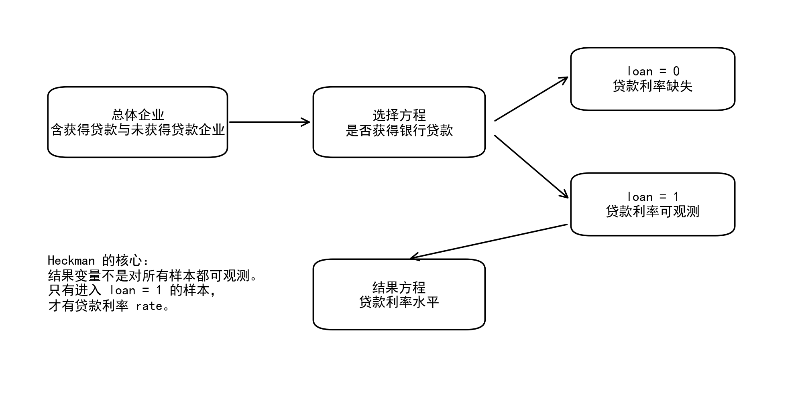
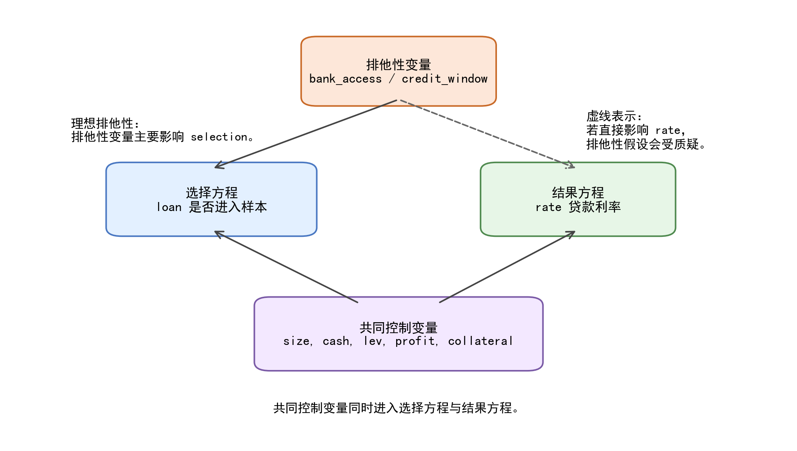
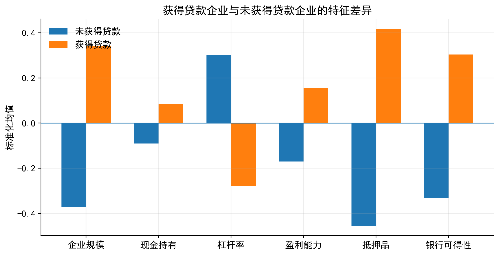
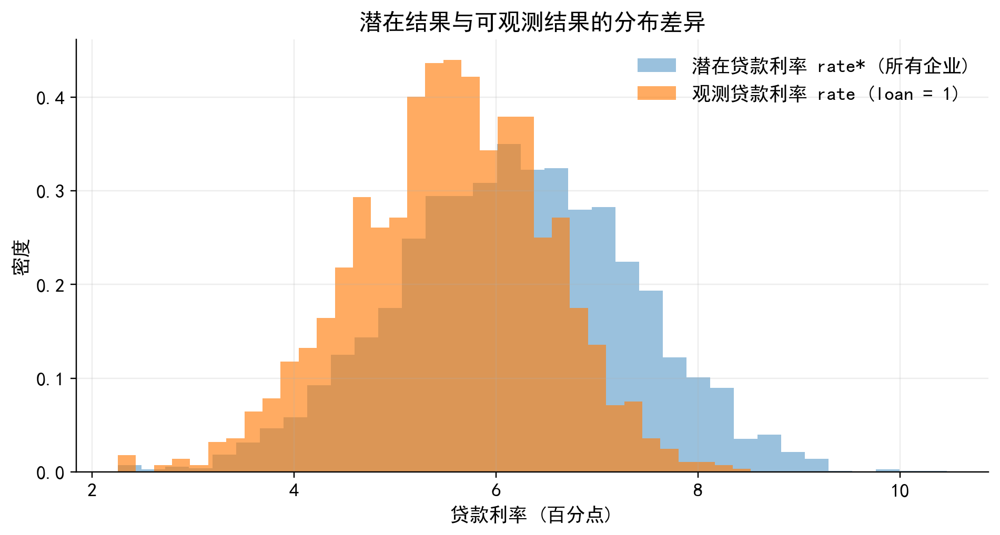
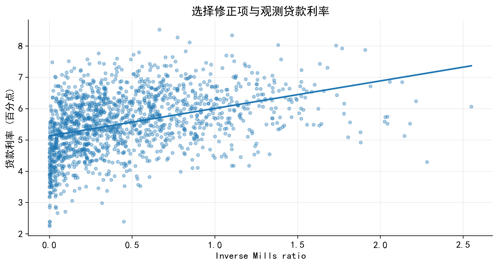
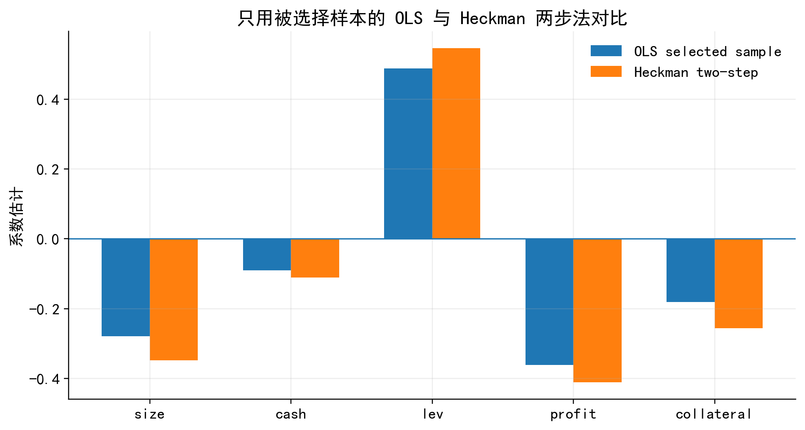

<!-- _class: title -->

# Heckman 选择模型

<div class="subtitle">样本选择偏误、两阶段估计与排他性变量</div>

<div class="small">金融数据分析与建模</div>

---

## 本章主线

- 为什么“只在可观测样本上回归”可能产生偏误
- 如何区分 selection equation 与 outcome equation
- inverse Mills ratio 修正了什么
- 如何从政策背景和样本产生机制寻找排他性变量
- 企业银行贷款利率案例：从模型设定到结果解释

---

## 从银行贷款利率样本说起

研究问题：企业特征如何影响银行贷款利率？

<div class="formula">

$$
rate_i = x_i'\beta + u_i
$$

</div>

问题在于，$rate_i$ 并非对所有企业都可观测：

- 企业需要先获得银行贷款
- 数据中需要披露贷款合同或利息支出信息
- 未获得贷款企业没有可观测贷款利率

---

## 一个两阶段的经济过程

银行贷款利率样本通常经历两个过程：

- **选择过程**：银行先决定是否发放贷款，企业是否进入贷款利率样本
- **结果过程**：在获得贷款企业中，银行与企业形成贷款利率

<div class="formula">

$$
\text{firm characteristics} \rightarrow loan_i \rightarrow rate_i
$$

</div>

若获得贷款不是随机事件，只在获得贷款企业中做 OLS，本质上是在一个经过筛选的样本中估计结果方程。

---

## 选择机制与结果观测

<div class="imgbox">



</div>

---

## Heckman 与 Tobit 的区别

<div class="note">
Tobit 模型中，未超过阈值的结果通常仍以边界值形式进入数据，例如 $y_i=0$。Heckman 选择模型中，未被选择样本的结果变量并不是 0，而是根本不可观测。
</div>

贷款案例中，没有获得贷款的企业不是贷款利率为 0，而是没有可观测贷款利率。

---

## 从政策背景理解 selection 方程

银行贷款不是简单的市场交易结果，而是带有信息筛选、风险评估和制度约束的审批过程。

贷款利率样本可能来自以下筛选机制：

- 企业是否提出融资申请
- 银行是否愿意进入授信审查流程
- 企业是否拥有抵押品或担保
- 所在地区是否有银行网点或政银企对接窗口
- 企业是否披露贷款合同或利息支出明细

---

## 排他性变量来自样本产生过程

本地银行网点密度、园区金融服务站、政银企对接平台、信用担保服务覆盖等变量，可能显著影响企业是否获得贷款。

若这些变量主要影响“能否获得贷款”，但在控制企业风险和财务特征后不直接决定贷款合同利率，就可以作为选择方程中的排他性变量候选。

<div class="important">
排他性变量不能事后硬凑。它应来自样本选择过程本身。
</div>

---

## 从因果推断角度理解 Heckman

普通 OLS 试图识别：

<div class="formula">

$$
E(y_i\mid x_i)
$$

</div>

但存在样本选择时，研究者实际看到的是：

<div class="formula">

$$
E(y_i\mid x_i,s_i=1)
$$

</div>

其中，$s_i=1$ 表示结果变量被观测到。

---

## 选择导致的遗漏变量偏误

如果进入样本本身与结果方程的未观测因素相关：

<div class="formula">

$$
s_i \not\perp u_i \mid x_i
$$

</div>

选择变量 $s_i$ 就携带了未观测信息。直接在 $s_i=1$ 的样本中回归，便存在遗漏变量偏误。

<div class="note">
Heckman 模型可以理解为处理 selection-induced confounding 的一种参数化方法。
</div>

---

## Heckman 模型的基本设定

潜在结果方程：

<div class="formula">

$$
y_i^* = x_i'\beta + u_i
$$

</div>

选择方程：

<div class="formula">

$$
s_i^* = z_i'\gamma + v_i
$$

</div>

实际选择结果：

<div class="formula">

$$
s_i=\begin{cases}
1, & s_i^*>0 \\
0, & s_i^*\leq 0
\end{cases}
$$

</div>

---

## 结果变量的观测规则

<div class="formula">

$$
y_i =
\begin{cases}
y_i^*, & s_i=1 \\
\text{missing}, & s_i=0
\end{cases}
$$

</div>

标准 Heckman 模型假设：

<div class="formula">

$$
\begin{pmatrix}u_i\\v_i\end{pmatrix}
\sim N\left[
\begin{pmatrix}0\\0\end{pmatrix},
\begin{pmatrix}
\sigma_u^2 & \rho\sigma_u\\
\rho\sigma_u & 1
\end{pmatrix}
\right]
$$

</div>

若 $\rho\neq 0$，样本选择偏误就会出现。

---

## 贷款利率案例：结果方程

本章把贷款利率视为 outcome，把是否获得贷款视为 selection。

<div class="formula">

$$
rate_i^* =
\beta_0+\beta_1 size_i+\beta_2 cash_i+\beta_3 lev_i
+\beta_4 profit_i+\beta_5 collateral_i+u_i
$$

</div>

结果方程解释的是：在进入贷款样本后，企业特征如何影响贷款利率。

---

## 贷款利率案例：选择方程

<div class="formula">

$$
loan_i^* =
\gamma_0+\gamma_1 size_i+\gamma_2 cash_i+\gamma_3 lev_i
+\gamma_4 profit_i+\gamma_5 collateral_i
+\gamma_6 bankaccess_i+\gamma_7 creditwindow_i+v_i
$$

</div>

- `bank_access`：本地银行服务可得性
- `credit_window`：政银企对接窗口覆盖
- 二者作为排他性变量候选

---

## 排他性变量的设定逻辑

<div class="imgbox">



</div>

---

## 变量进入哪个方程？

| 变量 | 含义 | 进入方程 |
|---|---|---|
| `rate` | 银行贷款利率 | 结果变量 |
| `loan` | 是否获得银行贷款 | 选择变量 |
| `size`, `cash`, `lev`, `profit` | 企业财务特征 | 两个方程 |
| `collateral` | 抵押品充足程度 | 两个方程 |
| `bank_access` | 本地银行服务可得性 | 选择方程 |
| `credit_window` | 政银企对接窗口覆盖 | 选择方程 |

---

## 经典文献的设定思路

<div class="note">
Heckman (1979) 将样本选择偏误表述为 specification error。关键不是“样本变少了”，而是被观测样本的误差项条件均值不再为 0。
</div>

Mroz (1987) 的劳动供给研究提供了经典应用：工资只对就业女性可观测，因此选择方程解释是否就业，结果方程解释工资水平。

---

## 被选择与未被选择样本差异

<div class="imgbox">



</div>

---

## 潜在贷款利率与观测贷款利率

<div class="imgbox">



</div>

---

## inverse Mills ratio 的来源

在获得贷款样本中观察到：

<div class="formula">

$$
y_i = x_i'\beta + u_i, \quad s_i=1
$$

</div>

但 $s_i=1$ 等价于：

<div class="formula">

$$
s_i^*=z_i'\gamma+v_i>0
$$

$$
v_i>-z_i'\gamma
$$

</div>

因此，被选择样本中的误差项不再具有零条件均值。

---

## IMR 修正项

在联合正态假设下：

<div class="formula">

$$
E(u_i\mid v_i>-z_i'\gamma)
=\rho\sigma_u\lambda(z_i'\gamma)
$$

$$
\lambda(z_i'\gamma)=\frac{\phi(z_i'\gamma)}{\Phi(z_i'\gamma)}
$$

</div>

于是：

<div class="formula">

$$
E(y_i\mid x_i,z_i,s_i=1)=x_i'\beta+\rho\sigma_u\lambda(z_i'\gamma)
$$

</div>

---

## 第二阶段回归

令 $\theta=\rho\sigma_u$，第二阶段可写为：

<div class="formula">

$$
y_i=x_i'\beta+\theta\lambda_i+\varepsilon_i,\quad s_i=1
$$

</div>

$\lambda_i$ 就是 inverse Mills ratio。

<div class="note">
IMR 不是普通控制变量，而是由选择方程推导出来的选择修正项。其含义是：在给定可观测变量后，一个观测值进入可观测样本的非随机程度。
</div>

---

## IMR 的解释边界

<div class="important">
IMR 显著通常说明选择过程与结果方程误差项存在相关性，但它不能自动证明排他性变量有效。
</div>

排他性变量是否合理，仍取决于：

- 制度背景
- 经济机制
- 变量定义
- 控制变量设定
- 稳健性分析

---

## Heckman 两步法

1. **第一步**：估计选择方程 Probit

<div class="formula">

$$
P(s_i=1\mid z_i)=\Phi(z_i'\gamma)
$$

</div>

2. **计算 IMR**：

<div class="formula">

$$
\hat\lambda_i=\frac{\phi(z_i'\hat\gamma)}{\Phi(z_i'\hat\gamma)}
$$

</div>

3. **第二步**：在 $s_i=1$ 样本中，把 $\hat\lambda_i$ 加入结果方程。

---

## Python 手动两步法

```python
# 第一阶段：Probit 选择方程
Z = sm.add_constant(df[[
    "size", "cash", "lev", "profit", "collateral",
    "bank_access", "credit_window"
]])
probit_res = sm.Probit(df["loan"], Z).fit()

# 计算 inverse Mills ratio
xb = probit_res.predict(linear=True)
df["imr"] = norm.pdf(xb) / norm.cdf(xb)

# 第二阶段：仅在被选择样本中估计结果方程
df_s = df.loc[df["loan"] == 1].copy()
X = sm.add_constant(df_s[[
    "size", "cash", "lev", "profit", "collateral", "imr"
]])
ols_res = sm.OLS(df_s["rate"], X).fit(cov_type="HC1")
```

---

## IMR 与估计结果可视化

<div class="cols">

<div class="imgbox">



</div>

<div class="imgbox">



</div>

</div>

---

## Stata：读取数据与基准 OLS

```stata
* 读取模拟数据
clear all
set more off
import delimited "./data/heckman_loan_sim.csv", clear

* 基准 OLS：只在获得贷款企业中估计贷款利率
reg rate size cash lev profit collateral if loan == 1, ///
    vce(robust)
estimates store OLS_selected
```

---

## Stata：手动两步法

```stata
* 第一阶段 Probit
probit loan size cash lev profit collateral ///
    bank_access credit_window
predict xb_select, xb

* 计算 inverse Mills ratio
gen imr_manual = normalden(xb_select) / normal(xb_select)

* 第二阶段加入 IMR
reg rate size cash lev profit collateral imr_manual ///
    if loan == 1, vce(robust)
estimates store Manual_2step
```

---

## Stata：官方 Heckman 估计

```stata
* Heckman 两阶段估计
heckman rate size cash lev profit collateral, ///
    select(loan = size cash lev profit collateral ///
        bank_access credit_window) ///
    twostep first mills(imr_official)
estimates store Heckman_2step

* Heckman 极大似然估计
heckman rate size cash lev profit collateral, ///
    select(loan = size cash lev profit collateral ///
        bank_access credit_window) ///
    mle first vce(robust)
estimates store Heckman_ML
```

---

## Python 中的直接估计路径

Python 中可以估计 Heckman / Heckit 模型，但生态不如 Stata 的 `heckman` 稳定统一。

可按以下顺序选择工具：

- 课堂演示：`statsmodels` 的 Probit + OLS 手动两步法
- 专门实现：尝试 `py4etrics` 的 Heckit 功能
- 论文核对：使用 Stata `heckman` 复核
- 复杂结构：考虑 Stata 扩展命令或贝叶斯建模

---

## 提示词：生成 Heckman 估计代码

<div class="tip">
我正在分析一个 Heckman 选择模型。结果变量是 `结果变量名`，只有在 `选择变量名=1` 时才可观测。结果方程解释变量包括 `结果方程变量列表`，选择方程解释变量包括 `选择方程变量列表`，其中 `排他性变量名` 只进入选择方程。请帮我生成 Python 代码，完成 Probit 第一阶段、inverse Mills ratio 计算、第二阶段 OLS 回归、结果表整理和基本解释。代码需要包含中文注释。
</div>

---

## 提示词：检查排他性变量

<div class="tip">
我正在为 Heckman 选择模型设计排他性变量。研究问题是 `研究问题`，结果变量是 `结果变量`，选择变量是 `选择变量`，候选排他性变量是 `变量名`。请从经济机制、制度背景、可能的直接效应、需要加入的控制变量和稳健性检验五个角度，评估这个变量是否适合作为选择方程中的排他性变量。
</div>

---

## Stata 扩展命令

| 场景 | Stata 命令 | 说明 |
|---|---|---|
| 连续结果变量存在样本选择 | `heckman` | 标准 Heckman selection model |
| 二元结果变量存在样本选择 | `heckprobit` | outcome 为 Probit |
| 有序结果变量存在样本选择 | `heckoprobit` | outcome 为 ordered probit |
| 计数结果变量存在样本选择 | `heckpoisson` | outcome 为 Poisson |
| 内生切换回归 | `movestay` | 不同 regime 下结果方程不同 |
| 多方程混合模型 | `cmp` | 用户扩展命令 |

---

## 实证解释的写作顺序

- 第一阶段 Probit：哪些因素影响企业进入贷款利率样本
- 排他性变量：是否显著影响贷款可得性
- 第二阶段结果方程：企业特征如何影响贷款利率
- IMR 系数：选择修正项是否重要
- OLS 与 Heckman 对比：选择修正是否改变核心结论

<div class="note">
第一阶段不是附属回归，而是在刻画样本如何产生。
</div>

---

## 与其他受限因变量模型的区别

| 模型 | 观测机制 | 典型问题 | 关键设定 |
|---|---|---|---|
| Tobit | 潜在结果被删失，边界值仍可观测 | 研发投入大量为 0 | 一个潜在结果方程 |
| Truncated regression | 某些样本根本不进入数据 | 只观察高收入样本 | 截断后的结果方程 |
| Two-part model | 是否参与和正值强度分开 | 是否捐赠与捐赠金额 | 参与方程 + 正值方程 |
| Heckman selection | 结果变量只在被选择样本中可观测 | 只有获得贷款企业有贷款利率 | 选择方程 + 结果方程 |

---

## Heckman 不是 Tobit 的替代品

<div class="important">
如果未选择样本的结果变量被记录为 0，问题可能更接近 Tobit 或 Two-part model；如果未选择样本的结果变量根本不可观测，问题才更接近 Heckman selection model。
</div>

关键不是数据中有没有 0，而是结果变量的观测机制。

---

## 本章小结

- Heckman 模型处理的是结果变量只在被选择样本中可观测的问题
- selection 方程应来自样本产生机制，而不是机械加变量
- outcome 方程解释的是进入样本后的结果形成机制
- IMR 将选择过程中的非随机成分带入结果方程
- 排他性变量的合理性决定模型说服力

---

## 参考文献

- Heckman, J. J. (1979). Sample selection bias as a specification error. *Econometrica*, 47(1), 153–161. DOI: 10.2307/1912352.
- Mroz, T. A. (1987). The sensitivity of an empirical model of married women’s hours of work to economic and statistical assumptions. *Econometrica*, 55(4), 765–799. DOI: 10.2307/1911029.
- Stiglitz, J. E., & Weiss, A. (1981). Credit rationing in markets with imperfect information. *American Economic Review*, 71(3), 393–410.
- Petersen, M. A., & Rajan, R. G. (1994). The benefits of lending relationships. *Journal of Finance*, 49(1), 3–37. DOI: 10.1111/j.1540-6261.1994.tb04418.x.
