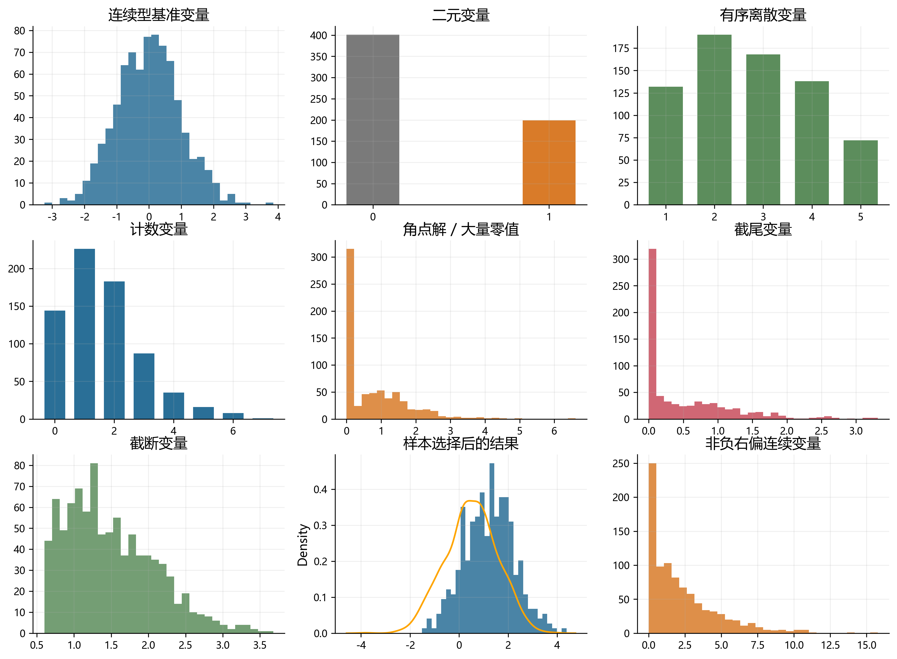
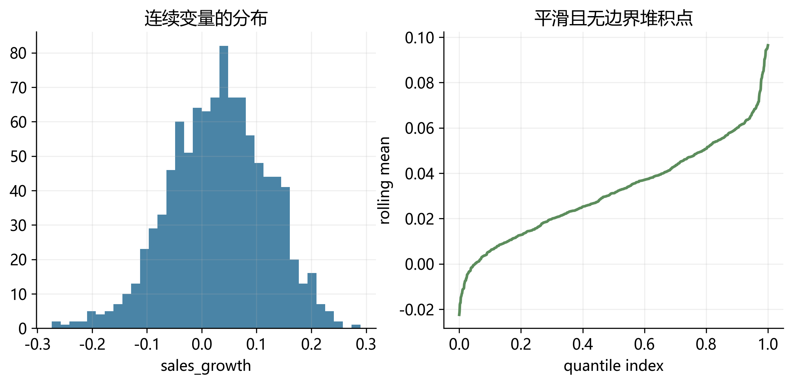
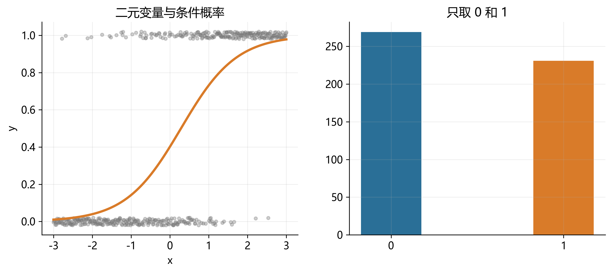
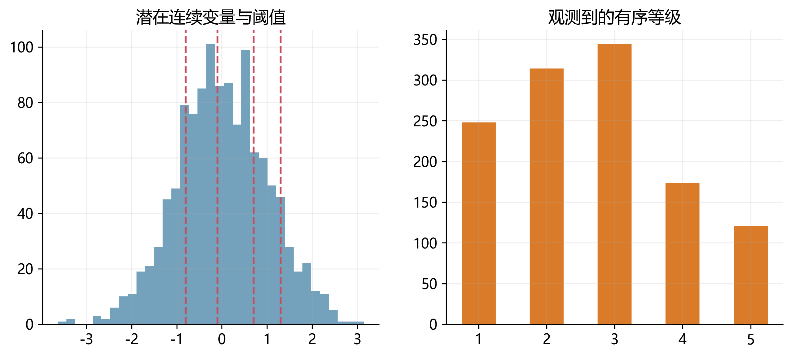
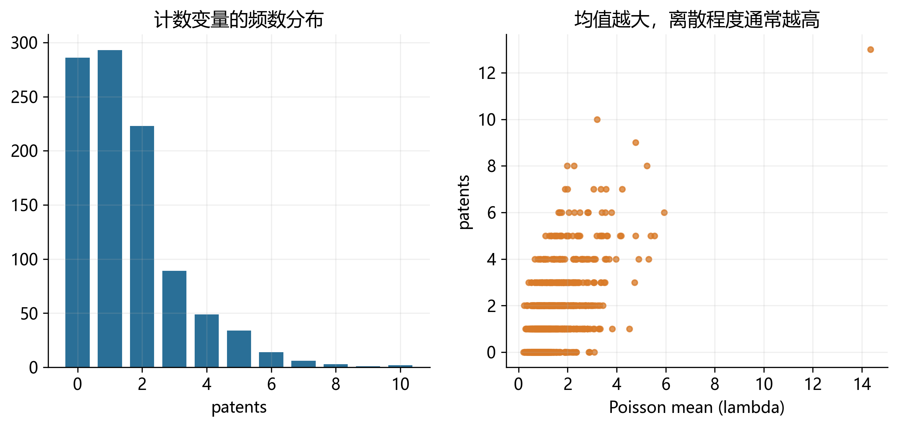
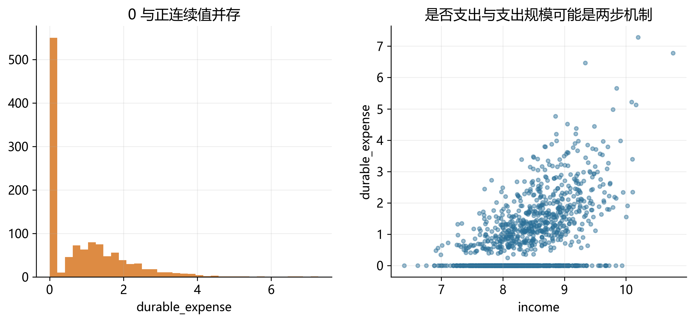
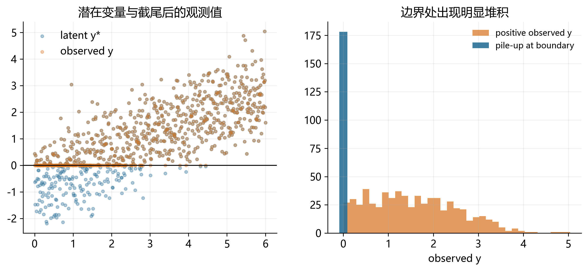
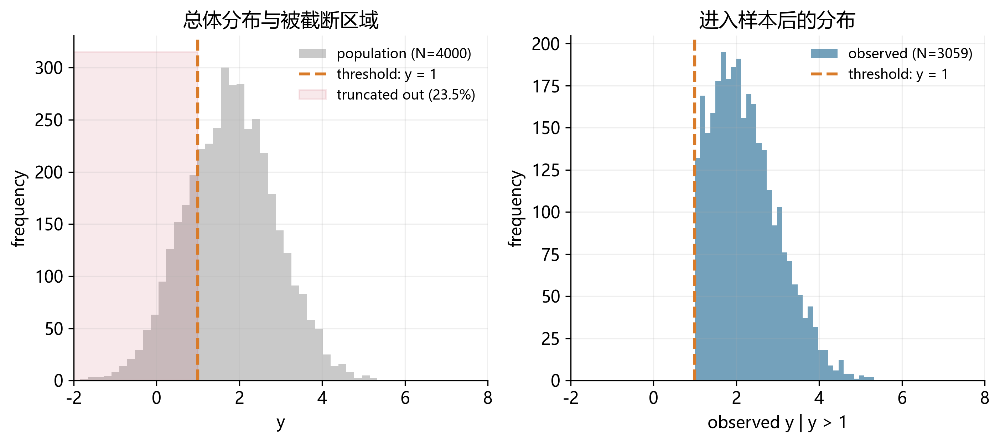
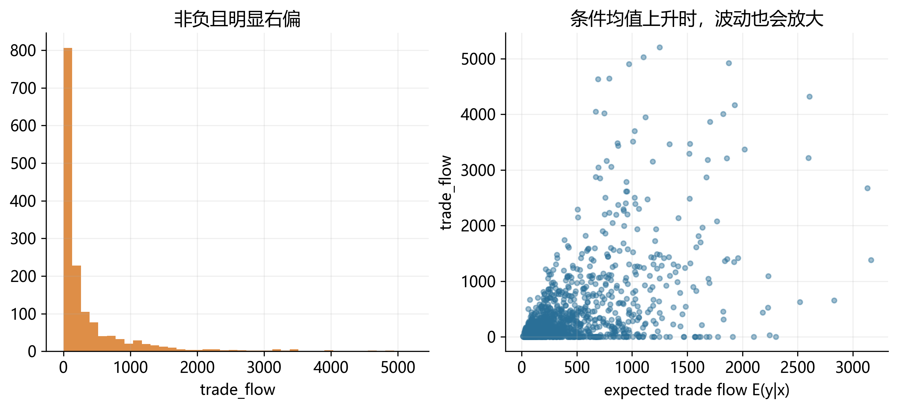

# 离散变量和受限因变量：导论 {#chap-limitdep-overview}

::: {.callout-warning}
### 本章目标

建立一张关于离散变量和受限因变量模型的地图。读完本章后，你应该能回答三个问题：

- 第一，什么样的因变量已经不适合直接套用线性回归；
- 第二，这些数据形态各自对应什么样的统计分布和计量模型；
- 第三，本书后续各章为什么要分别讨论 Logit/Probit、Tobit、Two-part、Hurdle、Heckman、Count model 与 PPMLHDFE。
:::

---

## 引言：为什么“因变量的形态”如此重要？ {#sec-limitdep-motivation}

统计和计量的一个核心任务，是基于 observed data 推断总体的分布和特征。但在很多经验研究中，我们真正观察到的因变量并不是“标准的、近似正态的连续变量”，而是带有各种限制：只能取 0 和 1，只能取非负整数，只在超过某个门槛时才被记录，或者只有一部分样本的结果变量可见。

这类问题的共同点是：**因变量的支持集（support）受到了限制**。一旦支持集被限制，线性模型的几个默认前提就会失效。例如：

1. 线性预测值可能落在不合法的区间外。
2. 误差项的分布通常不再对称，也不再同方差。
3. 条件期望函数无法完整描述数据生成机制。
4. 同一个“零值”可能来自完全不同的经济机制。

因此，受限因变量模型的第一步，不是急于选择估计量，而是先识别：**你看到的数据形态，到底是哪一类？**

---

## 从线性回归到概率模型 {#sec-limitdep-why-model}

在线性回归中，我们通常从条件期望函数出发：

$$
E(y_i \mid x_i) = x_i'\beta.
$$

这套框架对很多连续变量是有效的。例如工资、收益率、资产规模、温度或降雨量，只要变量近似连续、取值范围不受强约束，OLS 通常都能给出一个不错的起点。

但当 $y_i$ 只能取 $0/1$、$0,1,2,\ldots$，或存在明显的堆积点、大量零值、样本选择与截断时，单纯建模 $E(y_i \mid x_i)$ 往往不够。更自然的思路是：

$$
P(y_i \mid x_i) = f(y_i \mid x_i; \theta_i), \qquad \theta_i = G(x_i'\beta),
$$

也就是直接对 $y_i$ 的条件分布建模。后续各章虽然模型名称不同，但基本逻辑都可以归结为四步：

1. 识别因变量的支持集与分布形态。
2. 选择与该支持集相匹配的分布函数。
3. 用链接函数把分布参数写成协变量的函数。
4. 用极大似然或拟似然方法进行估计与解释。

---

## 一张总览图：本章覆盖哪些数据形态？ {#sec-limitdep-map}

本章将依次介绍 9 类最常见的数据形态。@fig-limitdep-map 给出它们的分布外观：有些是离散的，有些是连续但带有边界，有些则是“看起来像连续变量”，但背后的观测机制已经改变。

{#fig-limitdep-map width="100%"}

为了便于建立整体印象，@tbl-limitdep-roadmap 先给出一个路线图。

| 数据形态 | 常见取值 | 核心特征 | 典型模型 | 本书后续章节 |
|---|---|---|---|---|
| 连续型基准变量 | 任意实数 | 近似连续、无明显边界 | OLS | 本章仅作对照 |
| 二元变量 | 0, 1 | 事件是否发生 | Logit / Probit | 二元选择模型 |
| 有序离散变量 | 1, 2, 3, 4 | 等级有顺序 | Ordered Logit / Probit | 本章点到为止 |
| 计数变量 | 0, 1, 2, ... | 非负整数、常有偏态 | Poisson / NB | Count data |
| 角点解变量 | 0 与正连续值 | 零值很多，正值连续 | Tobit / Two-part / Hurdle | Tobit 等 |
| 截尾变量 | 低于阈值记为阈值 | 部分观测被“压平” | Tobit | Tobit |
| 截断变量 | 超出阈值不进样本 | 样本选择进入机制 | Truncated regression | 本章点到为止 |
| 样本选择变量 | 结果变量部分缺失 | 是否被观察并非随机 | Heckman selection | Heckman |
| 非负右偏连续变量 | 0 及以上 | 条件均值和异方差都重要 | PPML / PPMLHDFE | PPMLHDFE |

: 受限因变量模型路线图 {#tbl-limitdep-roadmap}

---

## 连续型基准变量：为什么它只是“对照组”？ {#sec-limitdep-continuous}

我们先从最熟悉的情况出发。假设因变量是企业年度销售增长率，取值可以为正、为负，分布大体连续，没有明显的堆积点或边界。此时，把条件均值写成协变量的线性函数通常是一个自然起点。

下面的小样本表展示了这类变量的直观特征：数值连续变化，没有“只能取某几个值”的限制。

| firm | leverage | size | sales_growth |
|---:|---:|---:|---:|
| 1 | 0.32 | 8.1 | 0.084 |
| 2 | 0.47 | 7.6 | -0.031 |
| 3 | 0.28 | 8.9 | 0.126 |
| 4 | 0.51 | 7.1 | -0.055 |
| 5 | 0.36 | 8.4 | 0.042 |
| 6 | 0.41 | 7.8 | 0.018 |

这类情形的重要性，不在于它本身复杂，而在于它为后文提供了一个 benchmark：一旦数据显著偏离 @fig-limitdep-continuous 所展示的形态，我们就需要更谨慎地建模。

{#fig-limitdep-continuous width="82%"}

---

## 二元变量：事件是否发生 {#sec-limitdep-binary}

最常见的离散变量，是只能取 0 和 1 的二元变量。例如：企业是否违约、居民是否参保、借款申请是否获批、客户是否流失。

| firm | roa | leverage | default |
|---:|---:|---:|---:|
| 1 | 0.041 | 0.31 | 0 |
| 2 | -0.026 | 0.73 | 1 |
| 3 | 0.018 | 0.52 | 0 |
| 4 | -0.011 | 0.69 | 1 |
| 5 | 0.037 | 0.27 | 0 |
| 6 | -0.008 | 0.61 | 1 |

对这类变量，OLS 的线性预测值可能超出 $[0,1]$，并且边际效应被强行设定为常数。这时更自然的做法，是直接对事件发生概率建模。

{#fig-limitdep-binary width="100%"}

这一类变量将在下一章系统展开，对应的主力模型是 **Logit** 和 **Probit**。

---

## 有序离散变量：不是连续，但也不是纯分类 {#sec-limitdep-ordered}

有些变量虽然只能取有限个整数值，但这些值之间存在明确顺序。例如信用评级、顾客满意度、分析师建议等级、风险预警等级。

| bond | spread | leverage | rating |
|---:|---:|---:|---:|
| 1 | 112 | 0.34 | 1 |
| 2 | 185 | 0.46 | 2 |
| 3 | 241 | 0.58 | 3 |
| 4 | 317 | 0.67 | 4 |
| 5 | 146 | 0.39 | 2 |
| 6 | 279 | 0.61 | 3 |

把这类变量当作连续变量处理，有时是一个近似；但严格地说，相邻等级之间的“距离”未必相等。评级从 1 到 2 与从 3 到 4，不一定有相同的经济含义。

{#fig-limitdep-ordered width="80%"}

本书后续不会单列一章展开 ordered logit/probit，但在导论里先把这种形态与普通分类变量区分开，是必要的。

---

## 计数变量：0, 1, 2, ... {#sec-limitdep-count}

计数变量的取值是非负整数，例如专利数、事故次数、欺诈事件数、并购次数、董事会会议次数。

| firm | size | rd_ratio | patents |
|---:|---:|---:|---:|
| 1 | 7.2 | 0.031 | 0 |
| 2 | 8.4 | 0.057 | 2 |
| 3 | 8.8 | 0.066 | 4 |
| 4 | 7.9 | 0.041 | 1 |
| 5 | 8.1 | 0.052 | 3 |
| 6 | 7.4 | 0.028 | 0 |

这类变量通常右偏，且方差往往随均值一起上升。OLS 不仅可能给出负预测值，也很难处理“0 次、1 次、2 次”的离散概率结构。

{#fig-limitdep-count width="82%"}

后续 count data model 会从 Poisson 出发，再讨论过度离散与更一般的扩展。

---

## 角点解、截尾与“两类零值”问题 {#sec-limitdep-corner}

很多应用里，因变量表面上看是“连续变量”，但实际上在 0 点有一大堆观测，同时正值部分又是连续分布。例如家庭在某类商品上的支出、企业研发支出、居民捐赠金额、双边贸易额。

| hh | income | children | durable_expense |
|---:|---:|---:|---:|
| 1 | 8.1 | 0 | 0.0 |
| 2 | 8.4 | 2 | 1.6 |
| 3 | 7.9 | 1 | 0.0 |
| 4 | 8.8 | 3 | 2.9 |
| 5 | 8.0 | 0 | 0.0 |
| 6 | 8.6 | 2 | 1.3 |

这类数据最容易引出一个关键问题：**零值究竟意味着“想消费但最优解刚好为 0”，还是“根本没有进入消费这一决策阶段”？** 不同答案，对应不同模型。

{#fig-limitdep-corner width="88%"}

一个粗略的区分是：

1. 如果 0 是连续最优解的一部分，可以先考虑 **Tobit**。
2. 如果“是否为正”与“正值有多大”是两套机制，可以考虑 **Two-part model**。
3. 如果必须先跨过一个门槛才可能出现正值，可以考虑 **Hurdle model**。

后续专章会进一步讨论这三类模型各自适合什么情形。

---

## 截尾变量：被阈值“压平”的观测值 {#sec-limitdep-censoring}

截尾（censoring）意味着：样本中的每个个体都被观察到，但当潜在结果低于或高于某个阈值时，研究者只能看到一个被压平后的值。例如：

1. 收入调查把“低于 1000 元”统一记为 1000。
2. 环境指标低于检测限时统一记为 0。
3. 信贷损失率低于某门槛时被记作 0。

| obs | x | latent_y* | observed_y |
|---:|---:|---:|---:|
| 1 | 1.2 | -0.8 | 0.0 |
| 2 | 2.4 | -0.3 | 0.0 |
| 3 | 3.1 | 0.6 | 0.6 |
| 4 | 3.7 | 1.2 | 1.2 |
| 5 | 4.6 | 2.0 | 2.0 |
| 6 | 5.1 | -0.1 | 0.0 |

{#fig-limitdep-censored width="100%"}

它与前面的角点解变量看起来很像，但概念上并不完全相同。**截尾强调“观测规则把一部分潜在值压成边界值”，角点解则强调“经济决策本身允许最优解停在边界”。** 这也是 Tobit 模型既有吸引力、也容易被误用的原因。

---

## 截断变量：有些样本根本不在数据里 {#sec-limitdep-truncation}

截断（truncation）与截尾不同。截尾是“样本在，但值被压平”；截断则是“超出某个区间的个体完全不进入样本”。

例如，如果你的数据库只记录营业收入超过 500 万的企业，那么低于门槛的企业根本不会出现。你看到的并不是总体分布，而是一个被选择过的子样本。

| firm | true_sales | in_sample |
|---:|---:|---:|
| 1 | 320 | 0 |
| 2 | 450 | 0 |
| 3 | 520 | 1 |
| 4 | 610 | 1 |
| 5 | 730 | 1 |
| 6 | 480 | 0 |

{#fig-limitdep-truncated width="90%"}

截断问题提醒我们：样本并不总是“先抽到，再记录数值”，很多时候样本能否出现，本身就是数据生成过程的一部分。

---

## 样本选择变量：结果变量只对部分人可见 {#sec-limitdep-selection}

样本选择模型与截断问题关系密切，但更具经济学解释。经典例子是工资方程：工资只对“已经就业的人”可见；未就业者并不是工资等于 0，而是工资这一结果变量根本未被观察到。

| person | education | married | employed | wage |
|---:|---:|---:|---:|---:|
| 1 | 12 | 0 | 1 | 8.5 |
| 2 | 16 | 1 | 1 | 14.2 |
| 3 | 10 | 1 | 0 | . |
| 4 | 14 | 0 | 1 | 11.6 |
| 5 | 11 | 1 | 0 | . |
| 6 | 15 | 0 | 1 | 13.4 |

如果“是否就业”与“潜在工资”受到共同因素影响，那么只在已就业样本上做 OLS 会产生样本选择偏误。更进一步，样本选择不仅可能改变均值，也可能改变我们在样本中看到的斜率关系：@fig-limitdep-selection 左图就直观展示了 selected sample 中 `wage ~ education` 的拟合斜率可能明显不同于总体样本。

{#fig-limitdep-selection width="100%"}

后续的 Heckman selection model 将正式处理这一问题。

---

## 非负右偏连续变量：为什么 PPML 不是“只给计数数据用”？ {#sec-limitdep-ppml}

最后一类数据，容易被误解。很多经验研究中的因变量虽然不是计数，但它们具有三个共同特征：

1. 因变量非负；
2. 分布明显右偏；
3. 方差通常随着条件均值一起变化。

双边贸易额、专利引用、交易额、医疗支出、索赔金额，都可能呈现这种形态。即便变量不是整数，Poisson pseudo-maximum likelihood 仍然可以用来建模条件均值，只要我们关心的是：

$$
E(y_i \mid x_i) = \exp(x_i'\beta).
$$

| pair | distance | gdp_pair | trade_flow |
|---:|---:|---:|---:|
| 1 | 3.1 | 21.8 | 0.0 |
| 2 | 2.4 | 23.5 | 4.7 |
| 3 | 4.8 | 20.9 | 0.9 |
| 4 | 1.7 | 24.2 | 8.6 |
| 5 | 5.2 | 21.1 | 0.0 |
| 6 | 2.9 | 22.8 | 3.1 |

{#fig-limitdep-ppml width="88%"}

后续的 PPMLHDFE 章节会解释：为什么它既能自然处理零值，又能在异方差环境下保持较好的稳健性。

---

## 本章小结：先识别数据，再谈模型 {#sec-limitdep-summary}

这一章最想传递的，不是某个模型的细节，而是一种工作顺序：

1. **先看因变量的支持集**：它能取哪些值？
2. **再看零值和边界的来源**：是观测规则、样本进入机制，还是经济决策本身？
3. **最后再选模型**：让模型去贴合数据的形态，而不是让数据迁就一个熟悉的估计器。

如果说线性回归的核心对象是条件期望函数，那么受限因变量模型的核心对象，就是**条件分布本身**。从这个角度看，后续各章不是彼此割裂的技巧清单，而是在解决同一个问题：当因变量的支持集受到限制时，如何把概率结构、经济机制与经验估计统一起来。

接下来的章节将从最简单的二元选择模型开始，逐步进入截尾、两部分决策、样本选择、计数模型与 PPMLHDFE。