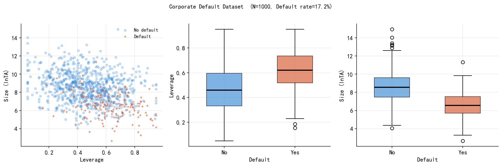
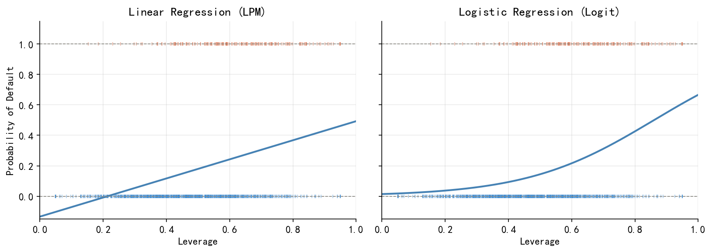
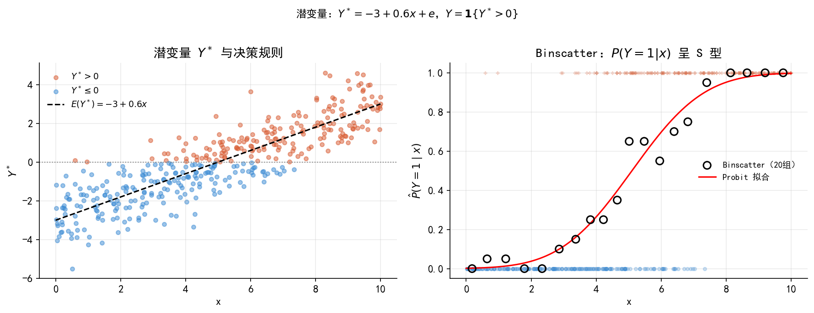
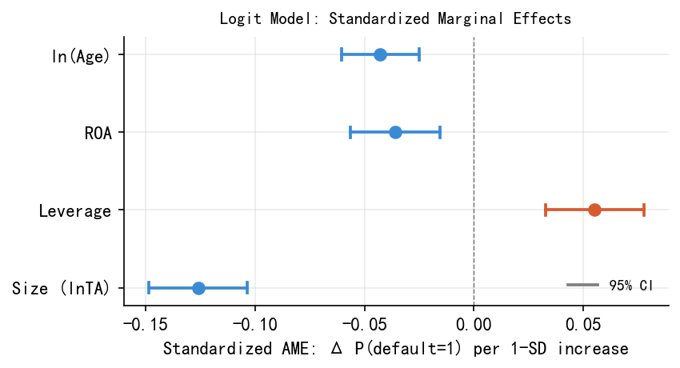
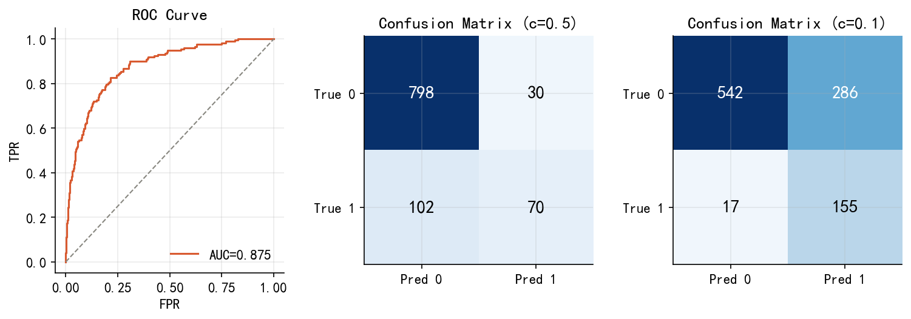
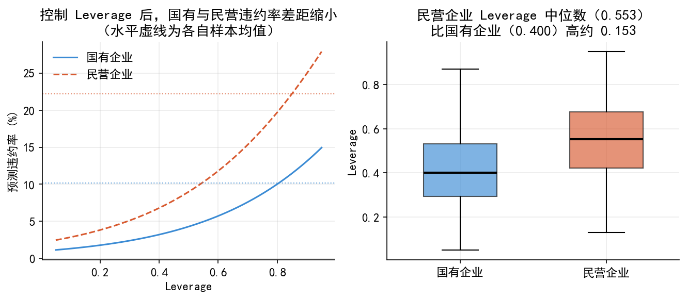

# 二元选择模型 {#chap-binary}

> **本章目标**：建立"条件概率 → 链接函数 → MLE → 边际效应"这条完整的建模逻辑，以上市公司违约预测为贯穿案例，理解 Logit/Probit 模型的原理、估计与解释，并在 Python 中完整实现。

---

## 引言：一个金融预测问题 {#sec-binary-intro}

假设你是一家商业银行的信贷风控分析师。银行每年向数千家上市公司提供贷款，而你的任务是：**在贷款发放之前，预测这家公司未来一年是否会发生债务违约**。

你手头有每家公司的年度财务数据：

| 变量 | 说明 | 类型 |
|------|------|------|
| **Size** (lnTA) | 总资产的自然对数，反映公司规模 | 连续 |
| **Leverage** | 资产负债率，$= \text{总负债}/\text{总资产}$ | 连续 |
| **ROA** | 资产收益率，$= \text{净利润}/\text{总资产}$ | 连续 |
| **ln(Age)** | 上市年限的对数，反映公司成熟度 | 连续 |
| **Industry** | 所属行业（制造/地产/金融/科技） | 类别 |
| **Ownership** | 所有制（国有/民营） | 类别 |
| **default** | 是否违约（1=违约，0=未违约）| 因变量 |

::: {.callout-note}
### 为什么用 ln(Age) 而非 Age？

上市年限对违约风险的影响很可能是**递减的**：从第 1 年到第 5 年，公司积累管理经验、建立信用记录，风险快速下降；但从第 20 年到第 25 年，边际下降就很小了。对数变换正好捕捉这种非线性关系，同时在模型拟合上也表现更好（AIC 低 5.5 个单位）。
:::

@fig-binary-intro 展示了样本数据的基本面貌（N = 1000，违约率 17.2%）：违约公司（橙色）集中在**规模小、杠杆高**的区域；箱线图进一步揭示，违约公司的 Leverage 均值（0.622）显著高于未违约公司（0.460），Size 则相反（6.56 vs 8.59）。

{#fig-binary-intro width="100%"}

---

## 建模框架：从条件期望到条件概率 {#sec-binary-framework}

### 条件期望函数（CEF）的局限

标准线性回归建模的是**条件期望**：

$$\mathrm{E}(y_i \mid \mathbf{x}_i) = \mathbf{x}_i'\beta$$

当 $y_i \in \{0,1\}$ 时，线性回归可直接解释为**线性概率模型（LPM）**：

$$P(y_i=1 \mid \mathbf{x}_i) = \mathbf{x}_i'\beta$$ {#eq-lpm}

LPM 的两个根本性缺陷：其一，拟合值可能超出 $[0,1]$；其二，边际效应 $\beta_j$ 是常数，意味着 Leverage 从 0.1 增加到 0.2，与从 0.8 增加到 0.9 对违约概率的影响完全相同——这与直觉不符（见 @fig-binary-lpm-vs-logit）。

### 条件概率函数（CPF）与四步建模框架

更一般的思路是直接对**条件概率函数（CPF）**建模：

$$P(y_i \mid \mathbf{x}_i) = f(y_i \mid \mathbf{x}_i;\, \theta)$$ {#eq-cpf}

**CPF 建模的完整步骤**，同时也是本章及后续 Tobit、Heckman、Poisson 各章**统一的建模语言**：

1. **设定分布函数**：选择能完整刻画 $y_i$ 取值的概率分布（0/1 变量 → Bernoulli 分布）
2. **设定链接函数**：将分布参数表示为 $\mathbf{x}_i$ 的函数，$\theta_i = G(\mathbf{x}_i'\beta)$，以反映个体异质性
3. **MLE 估计**：写出对数似然函数，通过数值优化求 $\hat\beta$
4. **边际效应分析**：因链接函数非线性，系数 $\hat\beta$ 不能直接解释，需计算边际效应

::: {.callout-note}
### 为什么 CPF 比 CEF 包含更多信息？

一旦知道 $y_i$ 的完整概率分布 $P(y_i \mid \mathbf{x}_i)$，期望值就完全确定了；反之则不成立。**概率分布是比期望值更丰富的信息**——这是从 CEF/OLS 转向 CPF/MLE 的根本动因。
:::

---

## 为什么需要链接函数？ {#sec-binary-link}

我们需要函数 $G(\cdot)$ 把 $\mathbf{x}_i'\beta \in (-\infty,+\infty)$ 映射到 $(0,1)$：

$$P(y_i=1 \mid \mathbf{x}_i) = G(\mathbf{x}_i'\beta), \qquad G:\mathbb{R}\to(0,1)$$

**线性概率模型（LPM）**：$G(u)=u$。OLS 直接估计，可加入高维固定效应，但拟合值可能超出 $[0,1]$。

**Logit 模型**：

$$G(u) = \Lambda(u) = \frac{e^u}{1+e^u}$$ {#eq-logit-link}

**Probit 模型**：

$$G(u) = \Phi(u) = \int_{-\infty}^{u}\phi(t)\,dt$$ {#eq-probit-link}

@fig-binary-link-functions 对比了三种链接函数：Logit 和 Probit 在概率 0.2–0.8 之间几乎重合，差异集中在尾部，这解释了为何两者的边际效应在大多数应用中非常接近。

![三种链接函数对比：LPM（虚线）在尾部超出 [0,1]；Logit（点线）和 Probit（实线）严格约束在 0 和 1 之间](./figs/fig03_link_functions.png){#fig-binary-link-functions width="75%"}

{#fig-binary-lpm-vs-logit width="90%"}

---

## 从潜变量角度理解二元选择 {#sec-binary-latent}

### 一个具体的决策模型

公司 $i$ 的"违约净收益"是潜变量 $y_i^*$：

$$y_i^* = \underbrace{\mathbf{x}_i'\beta}_{\text{可观测部分}} + \underbrace{e_i}_{\text{不可观测冲击}}$$

我们观察不到 $y_i^*$，只能观察到决策结果：

$$y_i = \mathbf{1}\{y_i^*>0\} = \begin{cases}1 & \text{（违约）}\\0 & \text{（未违约）}\end{cases}$$

### 从决策模型到概率模型

$$P(y_i=1\mid\mathbf{x}_i) = P(e_i>-\mathbf{x}_i'\beta) = 1-G(-\mathbf{x}_i'\beta) = G(\mathbf{x}_i'\beta)$$

**链接函数 $G(\cdot)$ 正是干扰项 $e_i$ 的 CDF**：$e_i\sim N(0,1)$ → Probit；$e_i$ 服从逻辑分布 → Logit。

@fig-binary-latent 展示了潜变量与观测变量的关系：

{#fig-binary-latent width="100%"}

::: {.callout-note}
### 潜变量框架的重要性

这个结构是后续复杂模型的基础：**Tobit** 中 $y_i=\max(0,y_i^*)$（截断）；**Heckman** 有两个方程，选择方程用潜变量决定"是否进入样本"；**有序 Probit/Logit** 对应潜变量落入不同区间。理解了这里，后续模型的逻辑就是顺水推舟。
:::

### 参数不可分别识别

令 $e_i=\sigma\varepsilon_i$，则只能识别 $\beta^*=\beta/\sigma$。Probit 规范化 $\sigma=1$，Logit 规范化 $\sigma=\pi/\sqrt{3}\approx 1.8$，故 Logit 系数通常是 Probit 系数的 1.6–1.8 倍——两者是不同规范化下的同一个 $\beta^*$。

---

## MLE 估计 {#sec-binary-mle}

### 对数似然函数

$y_i\sim\text{Bernoulli}(p_i)$，$p_i=G(\mathbf{x}_i'\beta)$，对数似然为：

$$\ln L(\beta) = \sum_{i=1}^{n}\left[y_i\ln G(\mathbf{x}_i'\beta)+(1-y_i)\ln(1-G(\mathbf{x}_i'\beta))\right]$$ {#eq-binary-loglik}

**直觉**：对真实违约的公司（$y_i=1$），希望 $p_i$ 大；对未违约的公司，希望 $p_i$ 小。MLE 找出让"数据最有可能出现"的 $\hat\beta$，通过数值优化（Newton-Raphson 或 BFGS）求解。

### 估计结果

@tbl-binary-logit-results 报告了完整 Logit 模型的估计结果。

| 变量 | 系数 $\hat\beta$ | 标准误 | z | p 值 | |
|------|:---:|:---:|:---:|:---:|:---:|
| 截距 | 3.664 | 0.751 | 4.88 | <0.001 | *** |
| Size (lnTA) | **−0.752** | 0.081 | −9.27 | <0.001 | *** |
| Leverage | **3.037** | 0.655 | 4.64 | <0.001 | *** |
| ROA | **−6.400** | 1.893 | −3.38 | <0.001 | *** |
| **ln(Age)** | **−0.485** | 0.106 | −4.56 | <0.001 | *** |
| 地产（vs 制造） | 0.433 | 0.279 | 1.55 | 0.120 | |
| 金融（vs 制造） | −0.112 | 0.295 | −0.38 | 0.706 | |
| 科技（vs 制造） | 0.264 | 0.275 | 0.96 | 0.339 | |
| 国有（vs 民营） | **−0.791** | 0.241 | −3.29 | 0.001 | ** |

: Logit 模型估计结果（N = 1000，违约率 17.2%，McFadden $R^2$ = 0.333，AIC = 630.4） {#tbl-binary-logit-results}

系数本身是 log odds 尺度，不直观。以 ln(Age) 为例：系数 $-0.485$ 意味着上市年限翻倍，违约比（odds）乘以 $e^{-0.485}\approx 0.62$，降低约 38%。更直观的解释见边际效应部分。

---

## 边际效应 {#sec-binary-me}

### 通用公式

$$\mathrm{MPE}_l = \frac{\partial P(y_i=1\mid\mathbf{x}_i)}{\partial x_l} = g(\mathbf{x}_i'\hat\beta)\cdot\hat\beta_l$$ {#eq-mpe}

其中 $g=G'$：Logit 中 $g(u)=\Lambda(u)[1-\Lambda(u)]$；Probit 中 $g(u)=\phi(u)$；LPM 中 $g(u)=1$（常数）。

边际效应**依赖于 $\mathbf{x}_i$ 的取值**，不是常数。即使模型中没有显式交乘项，非线性结构也使得：

$$\frac{\partial^2 P}{\partial x_l\partial x_m} = G''(\mathbf{x}_i'\beta)\hat\beta_l\hat\beta_m \neq 0$$

### 两种报告方式

**首选 AME**（平均边际效应）：

$$\widehat{\mathrm{AME}}_l = \frac{1}{n}\sum_{i=1}^n g(\mathbf{x}_i'\hat\beta)\cdot\hat\beta_l$$

MEM（均值处边际效应）对虚拟变量无意义，AME 保留样本真实分布信息，且与 LPM 系数高度接近。

### 三种模型的 AME 对比

@tbl-binary-me 展示了四个核心连续变量的 AME，三种方法高度一致：

| 变量 | LPM 系数 | Logit AME | Probit AME |
|------|:---:|:---:|:---:|
| Size (lnTA) | −0.067 | **−0.071** | −0.070 |
| Leverage | 0.289 | **0.288** | 0.282 |
| ROA | −0.609 | **−0.607** | −0.584 |
| ln(Age) | −0.052 | **−0.046** | −0.045 |

: 三种模型的 AME 对比 {#tbl-binary-me}

**各变量 AME 解读**：

- **Size**：lnTA 每增加 1 个单位，违约概率平均下降 **7.1pp**
- **Leverage**：资产负债率每提高 0.1，违约概率平均上升 **2.9pp**
- **ROA**：ROA 每提高 1pp（0.01），违约概率平均下降 **0.6pp**
- **ln(Age)**：上市年限**翻倍**（5→10 年或 10→20 年），违约概率平均下降约 **3.2pp**

::: {.callout-tip}
### 经验换算法则

粗略地：$\hat\beta_{Logit}\approx 4.5\times\hat\beta_{LPM}$，$\hat\beta_{Probit}\approx 2.5\times\hat\beta_{LPM}$，$\hat\beta_{Logit}\approx 1.7\times\hat\beta_{Probit}$。三组系数本身不可比，但 AME 几乎相同。
:::

### 标准化 AME：跨变量重要性比较

原始 AME 受变量单位影响，难以直接比较各变量的重要性。**标准化 AME**（AME $\times\,\sigma$）回答的是：*该变量增加一个标准差，违约概率平均变化多少？*

$$\widetilde{\mathrm{AME}}_l = \widehat{\mathrm{AME}}_l\times\sigma_l$$

@tbl-binary-stdame 和 @fig-binary-ame 展示了标准化 AME 的结果：

| 变量 | $\sigma$ | AME | **标准化 AME** | 95% CI |
|------|:---:|:---:|:---:|:---:|
| Size (lnTA) | 1.768 | −0.071 | **−0.126** | [−0.149, −0.104] |
| Leverage | 0.192 | 0.288 | **+0.055** | [+0.033, +0.078] |
| ROA | 0.059 | −0.607 | **−0.036** | [−0.056, −0.016] |
| ln(Age) | 0.932 | −0.046 | **−0.043** | [−0.061, −0.025] |

: 标准化 AME（Logit 模型） {#tbl-binary-stdame}

**Size 是影响最大的变量**（标准化 AME = −0.126），其幅度是 ROA 的 3.5 倍。Leverage、ROA、ln(Age) 三者量级相近（0.036–0.055）。

{#fig-binary-ame width="78%"}

---

## 预测概率与分类决策 {#sec-binary-predict}

### 计算预测概率

$$\hat{p}_i = \Lambda(\mathbf{x}_i'\hat\beta) = \frac{e^{\mathbf{x}_i'\hat\beta}}{1+e^{\mathbf{x}_i'\hat\beta}}$$

**两家公司的对比计算**：

| 公司 | Size | Leverage | ROA | Age | 行业 | 所有制 | **预测违约概率** |
|------|:----:|:--------:|:---:|:---:|:----:|:------:|:---:|
| A（高风险）| 6.5 | 0.75 | 0.02 | 5 | 地产 | 民营 | **64.0%** |
| B（低风险）| 9.0 | 0.35 | 0.08 | 15 | 制造 | 国有 | **0.9%** |

公司 A 的违约概率是公司 B 的 **68 倍**，由规模小、杠杆高、盈利弱、资历浅四重因素共同驱动。

### 分类决策与阈值选择

分类规则：当 $\hat{p}_i>c$ 时预测违约。**阈值 $c$ 是业务决策，而非统计决策**：

- $c=0.5$：最小化错误总数（适合类别均衡场景）
- $c=0.1$：保守风控，减少坏账（适合银行——漏报坏账的损失 $\gg$ 误拒好贷款的机会成本）

**ROC 曲线**（@fig-binary-roc）可视化所有阈值下的权衡，**AUC = 0.875** 是与阈值无关的综合评分。

{#fig-binary-roc width="95%"}

::: {.callout-warning}
### 类别不平衡时，准确率是陷阱

本数据集违约率约 17%。即使"永远预测不违约"的哑模型，准确率也达 83%！对不平衡数据，应优先关注 AUC，而非准确率。关于混淆矩阵、精确率/召回率、F1 等指标的详细介绍，见第 X 章（机器学习分类方法）。
:::

---

## 混淆变量与模型比较 {#sec-binary-confounding}

以所有制（Ownership）为例：

- **单变量 Logit**（只含 Ownership）：民营企业违约率 22.2%，国有企业 10.1%，前者是后者的 2.2 倍，系数正且显著
- **多变量 Logit**（控制财务特征后）：国有企业系数 = $-0.791$，**显著为负**——相同财务特征下，国有企业违约概率反而更低

@fig-binary-confounding 揭示了原因：民营企业 Leverage 中位数（0.553）比国有企业（0.400）高约 0.15，其较高的无条件违约率本质上是由杠杆差异驱动的，而非所有制本身的直接影响。

{#fig-binary-confounding width="95%"}

在做因果推断时，控制充分的财务特征变量至关重要，否则容易把遗漏变量（杠杆差异）引发的表面相关误认为所有制的直接效应。

---

## 简要总结 {#sec-binary-summary}

$$
\underbrace{y_i\in\{0,1\}}_{\text{Bernoulli 分布}}
\xrightarrow{\text{链接函数}}
\underbrace{P(y_i=1|\mathbf{x}_i)=G(\mathbf{x}_i'\beta)}_{\text{CPM}}
\xrightarrow{\text{MLE}}
\hat\beta
\xrightarrow{\text{边际效应}}
\text{AME / 标准化 AME}
$$

**三个核心选择**

1. **链接函数**：LPM（因果分析 + 固定效应）vs Logit/Probit（概率预测）——AME 几乎相同
2. **边际效应报告**：AME 用于解释单变量效应；标准化 AME 用于跨变量重要性比较
3. **分类阈值**：业务决策，非统计最优化问题

**潜变量框架的价值**不只是解释 Logit/Probit，更是为 Tobit、Heckman 等后续模型提供统一的理解基础。

---

## 延伸阅读

- James et al. (2023). *An Introduction to Statistical Learning*, Chapter 4.
- Wooldridge (2010). *Econometric Analysis of Cross Section and Panel Data*, Chapter 15.
- Hansen (2021). *Econometrics*, Chapter 25. [[PDF](https://www.ssc.wisc.edu/~bhansen/econometrics/)]
- Cameron & Trivedi (2005). *Microeconometrics*, Chapter 14.
