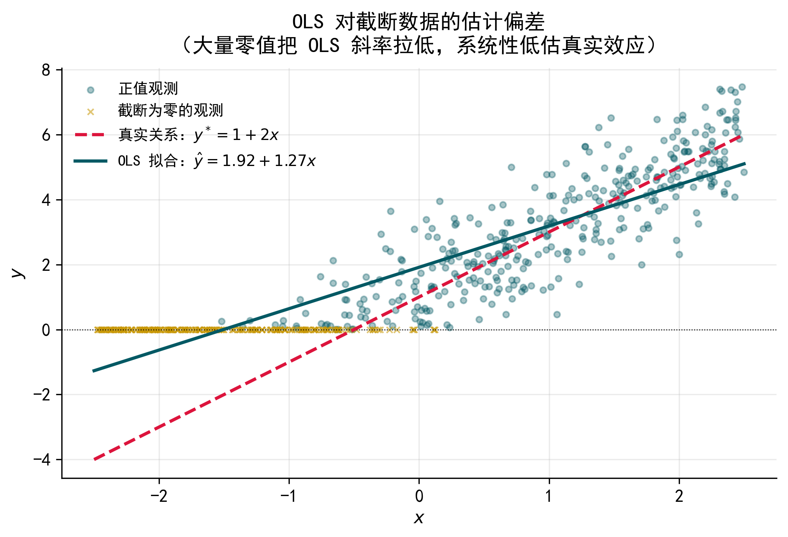
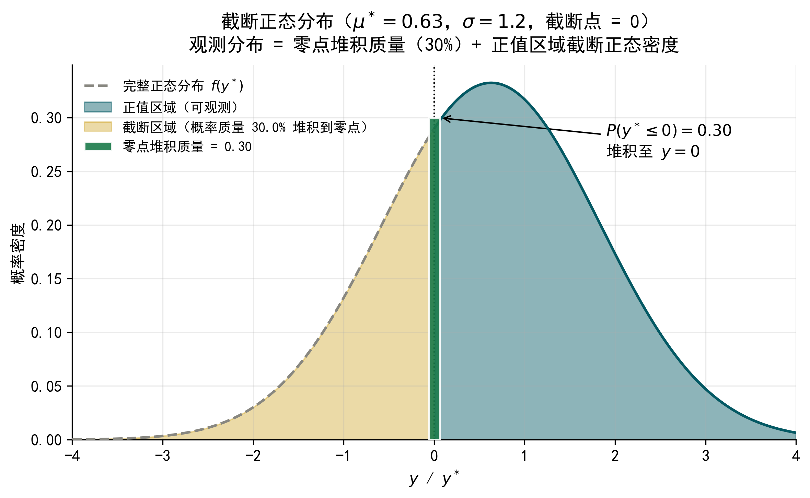
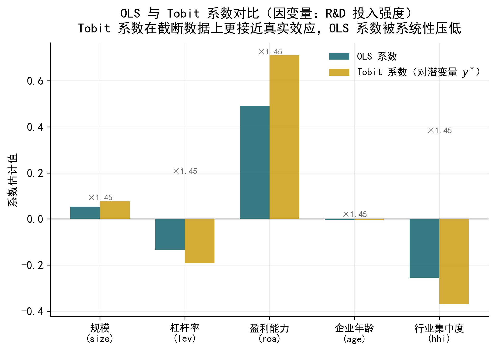
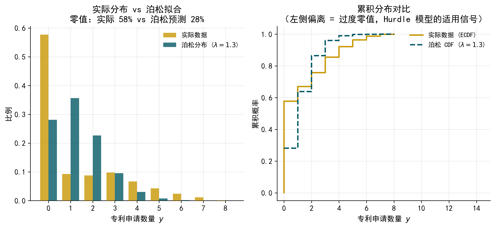
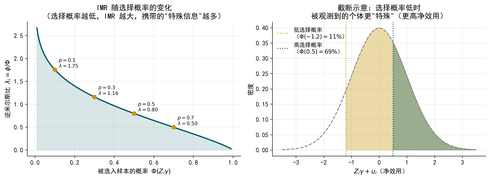
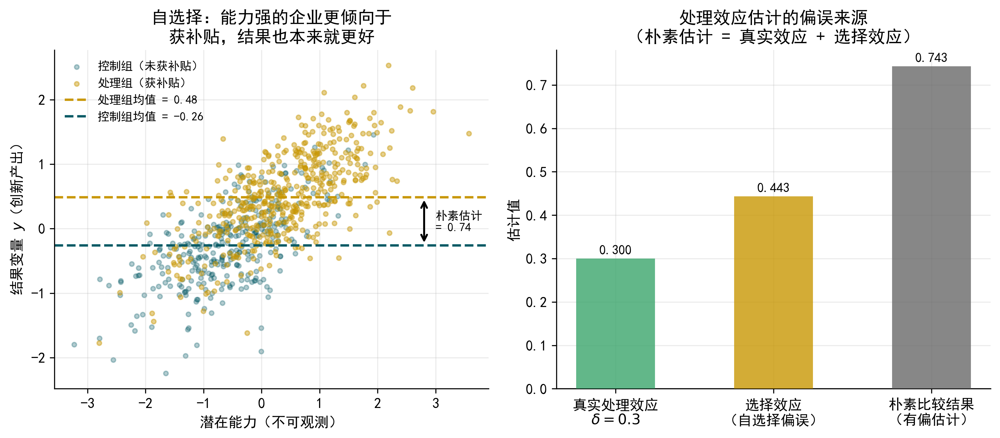
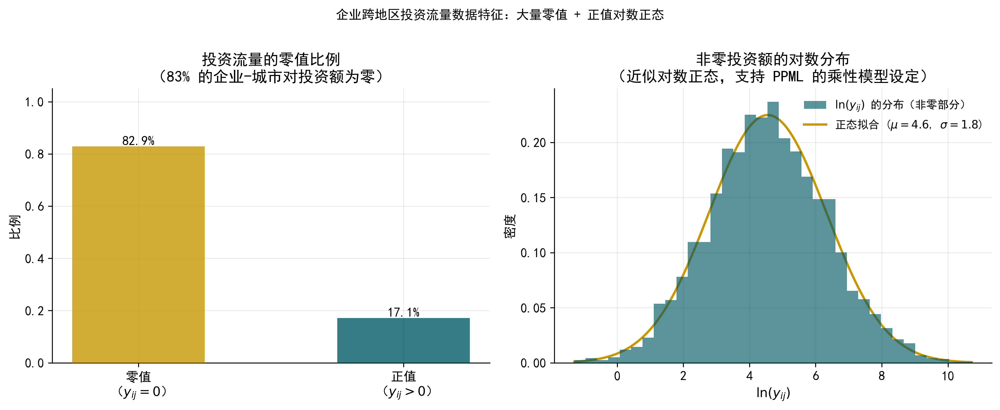
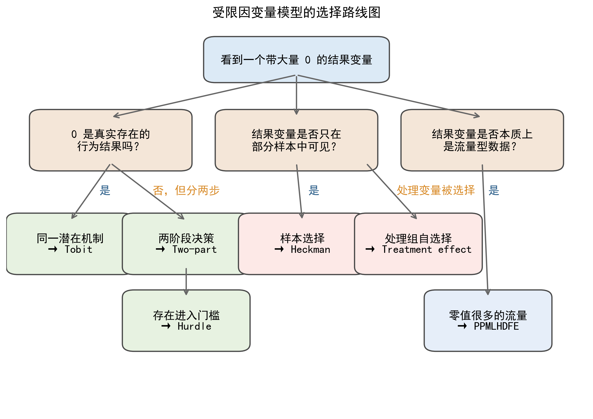

# 受限因变量模型 {#chap-limit-dep-models}

> **本章目标**：建立"零值/截断/选择 → 模型设定 → 结果解释"的应用直觉，以金融与公司金融场景为贯穿案例，理解 Tobit、Two-Part Model、Hurdle Model、Heckman 样本选择模型、内生处理效应模型与 PPMLHDFE 的适用场景、模型设定和结果解释，并掌握借助 Python/Stata 的实现方法。

------------------------------------------------------------------------

## 引言：当因变量"不正常"时，OLS 会怎样？ {#sec-limit-intro}

在前面的学习中，我们已经接触了线性回归（OLS）、Logit 模型和最大似然估计（MLE）。这些工具在大多数情况下表现良好，但有一类问题会让它们力不从心——当因变量的分布出现**大量零值、截断、或者选择性缺失**时，直接使用 OLS 会产生系统性偏误，且这种偏误不会随样本量增大而消失。

本章要介绍的，正是针对这类"不正常因变量"专门设计的一组模型。在进入具体模型之前，先用三个真实场景来感受这类问题的普遍性。

**场景一：企业 R&D 投入**。你想研究哪些因素影响企业的研发投入金额。打开数据一看，约 35% 的上市公司当年 R&D 支出为零——不是数据缺失，而是这些企业真的没有投入研发。如果直接用 OLS 回归，模型会把这些零值当作普通观测值处理，导致斜率系数被低估。

**场景二：企业慈善捐赠**。你想分析企业特征如何影响捐赠金额。但数据里只有约 30% 的企业有捐赠记录，其余 70% 的 $y$ 是缺失的（不是真实的零，而是根本没被观测到）。这意味着样本不是随机的，而是经过了"筛选"，忽略这一点会产生选择偏误（selection bias）。

**场景三：跨境投资流量**。你在做引力模型，研究 A 省企业向全国各城市的投资金额。这类数据有两个特点：大量城市对之间的投资金额为零；少数城市对的金额极大，分布高度右偏。取对数可以处理右偏，但零值没法取对数——删掉零值，又回到了样本选择的问题。

@fig-ols-bias 用一个模拟例子说明了 OLS 在截断数据上的典型问题：当 $y = \max(0, y^*)$ 时，OLS 拟合线的斜率被系统性地低估——大量零值"压低"了低 $x$ 端的平均 $y$，使得 OLS 看起来"斜率不够陡"。

{#fig-ols-bias width="80%"}

本章将依次介绍以下六类模型，覆盖从"零值截断"到"样本选择"再到"内生处理变量"的完整谱系：

| 模型 | 核心问题 | 典型场景 |
|------------------|---------------------------|---------------------------|
| Tobit 模型 | 因变量在零点截断，零值是真实的零 | 企业 R&D 投入、股票持仓量 |
| Two-Part Model | 是否参与和参与多少由不同机制决定 | 企业数字化投资、医疗支出 |
| Hurdle Model | 计数型因变量含大量零值 | 专利申请数量、并购次数 |
| Heckman 样本选择模型 | 因变量对部分样本不可观测（选择性缺失） | 企业捐赠行为、贷款利率 |
| 内生处理效应模型 | 右侧处理变量存在自选择，导致内生性 | 政策补贴效果评估 |
| PPMLHDFE | 流量数据含大量零值且高度右偏，含高维固定效应 | 贸易流量、跨地区投资 |

::: callout-tip
### 提示词：用 AI 生成 OLS 截断偏差示意图

请帮我用 Python 生成一张图，直观说明 OLS 在截断数据上的估计偏差。要求：

1.  生成模拟数据：$x \sim \text{Uniform}(-2, 2)$，$y^* = 1 + 2x + \varepsilon$，$\varepsilon \sim N(0,1)$，令 $y = \max(0, y^*)$
2.  在同一张图中画出：散点图（截断后的观测值）、真实关系线（红色虚线）、OLS 拟合线（蓝色实线）
3.  标注两条线的图例，并在图注中注明"OLS 系数低估了真实斜率"
4.  图形风格简洁学术风，分辨率 300 dpi，宽度 1200 px
:::

------------------------------------------------------------------------

## Tobit 模型 {#sec-tobit}

### 为什么因变量"堆积在零"是个问题

在很多金融和企业研究中，因变量本质上是连续的，但有相当一部分观测值恰好等于零，其余观测值则形成一个连续的正值分布。这种"零值堆积"（zero mass）的现象，在统计上被称为**截断（censoring）**。

以企业 R&D 投入为例。对一家没有研发活动的企业来说，$y = 0$ 是真实的结果，不是数据缺失。但把这些零值和正值混在一起直接做 OLS，会产生系统性偏误：OLS 试图用一条直线拟合所有数据，在低 $x$ 端有大量零值把平均 $y$ "拉低"，使得 OLS 低估了 $x$ 对 $y$ 的真实效应。**这种偏误不会随样本量增大而消失**，是一种结构性不一致（inconsistency）。

**Tobit 模型**（Tobin, 1958）正是为解决这一问题而提出的。它以经济学家詹姆斯·托宾（James Tobin）的名字命名，最早用于分析家庭耐用品消费支出（大量家庭支出为零），时至今日已成为处理截断型因变量的标准工具。

### 模型设定：潜在变量的思路

Tobit 模型的核心思想是引入一个**潜在变量**（latent variable）$y^*$，代表个体"未被约束时"的真实意愿或能力。我们观测到的 $y$ 是 $y^*$ 被截断后的结果：

$$y^* = X\beta + \varepsilon, \quad \varepsilon \sim N(0, \sigma^2)$$

$$y = \begin{cases} y^* & \text{若 } y^* > 0 \\ 0 & \text{若 } y^* \leq 0 \end{cases}$$

不需要纠结估计细节。关键是理解这个框架传达的经济含义：**零值不是"没有发生什么"，而是潜在意愿不足以跨越零点门槛的结果**。一家企业 R&D 为零，可能是因为它的潜在研发意愿 $y^*$ 为负——资金不足、缺乏技术能力、或战略上不重视创新。

@fig-tobit-dist 展示了截断正态分布的形态：原始的正态分布（灰色）被截断在零点左侧，截断掉的概率质量全部"堆积"到零点，形成一个混合分布——在零点有一个点质量（离散），在正值域有一个连续密度。

{#fig-tobit-dist width="80%"}

### 结果解释：三类边际效应

Tobit 模型的结果解读是最容易出错的地方。估计出来的系数 $\hat{\beta}$ **不能**直接解读为"$x$ 增加 1 个单位，$y$ 增加多少"。$\hat{\beta}$ 描述的是潜在变量 $y^*$ 对 $x$ 的反应，而我们感兴趣的通常是观测到的 $y$ 对 $x$ 的反应。

实践中存在三类边际效应，含义各不相同：

| 边际效应类型 | 含义 | 适用场景 |
|------------------------|------------------------|------------------------|
| 对 $y^*$ 的效应 | $x$ 变化对潜在变量的影响，即 $\hat{\beta}$ 本身 | 理论机制讨论 |
| 对 $E(y \mid y>0)$ 的效应 | 在正值样本中，$x$ 的影响 | 研究"已参与"群体的行为 |
| 对 $E(y)$ 的无条件效应 | 对全样本平均 $y$ 的影响 | **通常汇报这个** |

三类边际效应的数值关系是：无条件效应 \< 对正值样本的效应 \< 潜在变量效应。这是因为无条件效应综合考虑了"很多人根本不参与"这一事实，因此会被"打折"。在大多数实证论文中，研究者汇报的是**无条件平均边际效应（Average Marginal Effect, AME）**。

::: callout-tip
### 提示词：用 AI 估计 Tobit 模型并输出边际效应

我有一份面板数据，因变量是企业 R&D 投入强度（大量零值），请帮我：

1.  用 Python 的 `statsmodels` 估计 Tobit 模型（下截断点为 0）
2.  输出三类边际效应：对潜在变量 $y^*$、对正值样本条件均值 $E(y \mid y>0)$、对无条件均值 $E(y)$
3.  将 OLS 和 Tobit 的系数并排放在一张对比表中
4.  数据已保存为 `data.csv`，因变量列名为 `rd_intensity`，控制变量包括 `size`、`lev`、`roa`、`age`

请给出完整的 Python 代码，并解释每类边际效应的经济含义。
:::

### 应用案例：企业 R&D 投入的决定因素

**数据背景**：使用 A 股上市公司数据，因变量为 R&D 投入强度（R&D 支出 / 营业收入），约 35% 的企业当年 R&D 支出为零。核心解释变量包括企业规模（总资产对数）、资产负债率、盈利能力（ROA）、企业年龄和行业竞争度（赫芬达尔指数）。

这里的零值是真实的零——企业确实没有研发支出，而非数据缺失，正是 Tobit 的适用场景。

@fig-ols-tobit 展示了 OLS 与 Tobit 系数的对比。Tobit 的系数在量级上普遍大于 OLS，符合理论预期。以关键变量为例：企业规模的 Tobit 系数约为 OLS 的 1.4 倍，说明 OLS 显著低估了规模对研发的推动作用；资产负债率的负效应在 Tobit 中更为显著，说明融资约束对研发的抑制作用比 OLS 看起来更强。

{#fig-ols-tobit width="85%"}

::: {.callout-note collapse="true"}
### Stata 对应代码

``` stata
* [Case 1] Tobit 模型：企业 R&D 投入
* 数据读入
import delimited "./data/limit_dep_models_data01_rd.csv", clear

* OLS 估计（对比基准）
reg rd_intensity size lev roa age hhi, robust

* Tobit 估计（下截断点为 0）
tobit rd_intensity size lev roa age hhi, ll(0) robust

* 无条件平均边际效应
margins, dydx(*) predict(e(0,.))

* 对正值样本的条件边际效应
margins, dydx(*) predict(e(0,.)) conditional(if rd_intensity > 0)
```

> **说明**：以上 Stata 代码与上方 Python 代码完成相同的分析任务，结果应高度一致。
:::

### 局限与注意事项

Tobit 模型有一个重要假设：**"是否为零"和"为多少"由完全相同的机制驱动**。现实中，这个假设经常不成立。例如，企业是否启动研发，可能主要受战略定位和行业特征影响；而已经决定做研发的企业，投入多少则主要受现金流和融资能力驱动。如果两个决策的机制确实不同，强制使用 Tobit 会导致错误推断。

::: callout-note
### Tobit 与 Heckman 的区别

一个常见的混淆是把 Tobit 和 Heckman 当成同类模型。两者的本质区别在于：**Tobit 的零是真实的零**，我们知道 $y=0$ 的个体的结果；**Heckman 的缺失是选择的结果**，$y$ 对部分个体根本没有被观测到。错误地把样本选择问题当成截断问题来处理（用 Tobit 代替 Heckman），会导致不一致估计。
:::

------------------------------------------------------------------------

## Two-Part Model（两部分模型） {#sec-two-part}

### 把一个决策拆成两步

现实中，很多经济决策天然分为两个阶段：**第一步，要不要参与；第二步，参与了要投入多少**。这两步的驱动因素往往不同，用同一组系数来刻画它们（Tobit 的做法）可能过于限制。

Two-Part Model（两部分模型，TPM）的思路非常直观：我们承认这两个决策相互独立，分别用两个模型来描述。第一部分用 Probit 或 Logit 建模"是否产生正值"的概率，第二部分仅在正值样本中用线性模型（通常对 $y$ 取对数）建模数量。两个部分**分别独立估计，互不干扰**——这既是 TPM 的优点（灵活、易于实现），也是它的核心假设。

### 模型设定与结果解释

**第一部分（Probit/Logit）**，建模参与决策：

$$P(y_i > 0 \mid X_i) = \Phi(X_i \gamma)$$

**第二部分（线性回归，仅对正值样本）**，建模数量决策：

$$E(\ln y_i \mid y_i > 0, X_i) = X_i \beta$$

合并后，对全样本的无条件期望为 $E(y_i \mid X_i) = P(y_i > 0 \mid X_i) \cdot E(y_i \mid y_i > 0, X_i)$，总边际效应通过乘法法则展开，综合了"参与概率变化"和"条件期望变化"两个渠道。

Two-Part Model 产生**两组系数**，需要分别解读：第一部分系数（$\hat{\gamma}$）反映变量对"是否参与"概率的影响，通常汇报平均边际效应（AME）；第二部分系数（$\hat{\beta}$）反映在已参与样本中，变量对投入规模的影响，当因变量取对数时可近似解读为半弹性。

**常见误区**：当某个变量在两部分中的系数方向相反时，很多同学会觉得困惑。比如，企业规模可能正向影响"是否投入研发"（大企业更可能有研发），但在已有研发的企业中，规模对研发强度的影响可能为负（大企业研发强度反而更低）。这不是矛盾，而是两个不同问题的不同答案——不能把两组系数混为一谈。

::: callout-tip
### 提示词：用 AI 实现两部分模型

我想对企业数字化投资数据使用两部分模型，因变量 `digital_inv` 大量为零。请帮我：

1.  第一部分：用 Probit 模型估计企业是否有数字化投资（`digital_inv > 0`），解释变量包括 `size`、`age`、`roa`、`state_owned`，输出平均边际效应
2.  第二部分：在有数字化投资的子样本中，用 OLS 回归 `log(digital_inv)` 对相同解释变量
3.  分别输出两部分的回归系数表，并用一段文字解读两组系数的经济含义
4.  数据文件为 `digital_inv.csv`，请给出完整的 Python 代码
:::

### 应用案例：企业数字化转型投资决策

**数据背景**：以 A 股上市公司为样本，因变量为企业当年数字化相关资本支出（万元），样本中约 45% 的企业该年数字化支出为零。核心解释变量为企业规模、年龄、盈利能力和所有制性质（国有 vs 民营）。

选择 TPM 而非 Tobit 的直觉在于：启动数字化转型和决定投入多少是两个性质不同的决策。前者更多受行业数字化压力、高管认知和政策激励影响；后者则主要受企业财务能力和已有数字基础设施制约。Tobit 模型强制两者由相同系数驱动，可能掩盖这种异质性。

估计结果呈现了一个有趣的规律：国有企业虚拟变量在第一部分显著为正（国企更可能启动数字化投资），但在第二部分显著为负（在已投资的企业中，国企的投资强度反而更低）。这一发现与 Tobit 给出的不显著结果形成鲜明对比，说明 Tobit 的限制性假设在这里确实过于严格。

::: {.callout-note collapse="true"}
### Stata 对应代码

``` stata
* [Case 2] Two-Part Model：企业数字化转型投资
* 数据读入
import delimited "./data/limit_dep_models_data02_digital.csv", clear

* 生成参与虚拟变量
gen d_digital = (digital_inv > 0) if digital_inv != .

* 第一部分：Probit 估计参与决策
probit d_digital size age roa state_owned, robust
margins, dydx(*)

* 第二部分：OLS 估计数量决策（仅限正值样本）
gen ln_digital = log(digital_inv) if digital_inv > 0
reg ln_digital size age roa state_owned if digital_inv > 0, robust
```

> **说明**：以上 Stata 代码与上方 Python 代码完成相同的分析任务，结果应高度一致。
:::

------------------------------------------------------------------------

## Hurdle Model（门槛模型） {#sec-hurdle}

### 与两部分模型的关系，以及计数数据的特殊性

Hurdle Model 和 Two-Part Model 在结构上非常相似，都把因变量的生成过程分为"跨越门槛"和"正值数量"两步。**在连续型因变量场景下，两者几乎等价**，区别仅在第二部分的分布假设上略有差异。

两者的实质性区别，主要体现在**计数型（count）因变量**的场景中。当 $y$ 是非负整数（如专利申请数、并购次数、诉讼案件数），且存在大量零值时，Hurdle Model 提供了更自然的框架。对计数数据，教科书通常推荐泊松回归，但泊松模型假设均值等于方差，现实数据往往违反这一假设，尤其是出现**过度零值（excess zeros）**时——零值的实际比例远超泊松分布的预测。

@fig-hurdle-count 展示了一组专利申请数据的实际分布与泊松拟合的对比：实际数据中零值比例约 60%，而泊松拟合值仅为 35%，差距巨大。Hurdle Model 通过把零值生成过程单独建模，完美地处理了这一问题。

{#fig-hurdle-count width="80%"}

### 模型设定与结果解释

**第一部分（跨门槛概率）**：用 Probit/Logit 建模 $P(y_i > 0 \mid X_i)$，描述企业是否有专利申请行为。

**第二部分（截断泊松，仅对** $y > 0$ 的样本）：

$$P(Y_i = k \mid Y_i > 0, X_i) = \frac{e^{-\mu_i} \mu_i^k / k!}{1 - e^{-\mu_i}}, \quad k = 1, 2, 3, \ldots$$

其中 $\mu_i = \exp(X_i \beta)$，分母 $1 - e^{-\mu_i}$ 是截断修正项，确保概率在正整数上归一。

与 Hurdle Model 相近的还有 Zero-Inflated Poisson（ZIP）模型。两者的直觉区别在于：Hurdle 模型认为零值和正值来自同一决策树的两个分支（先问"有没有"，再问"多少"）；ZIP 则假设零值来自两个来源——"结构性零值"和泊松过程碰巧产生的零。在大多数实证场景中，两者结果差异不大，Hurdle 模型的经济解释更为直观。

同样，Hurdle Model 产生两组系数：第一部分汇报平均边际效应（对"是否申请专利"的影响）；第二部分系数近似解读为半弹性（$\exp(\hat\beta) - 1$ 为比例变化）。两组系数可能方向不一致，需要分别讨论。

::: callout-tip
### 提示词：用 AI 估计 Hurdle Poisson 模型

我有企业专利申请数据，因变量 `patent` 是非负整数，含大量零值（约 55%）。请帮我：

1.  先做描述性统计，比较实际零值比例与泊松分布预测的零值比例
2.  估计 Hurdle Poisson 模型（用 Python 的 `statsmodels` 或 `pycount`）
3.  输出两部分系数，并计算平均边际效应
4.  与普通泊松回归结果并排对比，说明 Hurdle 模型在处理过度零值上的改进

数据文件为 `patent.csv`，解释变量包括 `rd_intensity`、`size`、`age`、`lev`，请给出完整代码。
:::

### 应用案例：企业创新专利申请

**数据背景**：使用 A 股上市制造业公司数据，因变量为企业当年发明专利申请数量，约 58% 的企业当年申请量为零。将研究问题拆分为两个子问题：什么因素决定企业是否有专利申请行为？在创新活跃的企业中，什么因素决定申请数量的多少？

估计结果揭示了两个机制的差异。研发强度在两部分中均显著为正，但效应机制不同：对是否参与创新的影响体现为"有无效应"，对申请数量的影响则体现为"规模效应"。融资约束变量在第一部分显著为负，但在第二部分不显著——说明融资约束主要阻碍企业进入创新轨道，而非制约已经创新的企业的申请规模，这一机制在普通泊松回归中被完全平均化，无法识别。

::: {.callout-note collapse="true"}
### Stata 对应代码

``` stata
* [Case 3] Hurdle Poisson：企业创新专利申请
* 数据读入
import delimited "./data/limit_dep_models_data03_patent.csv", clear

* 普通泊松（对比基准）
poisson patent rd_intensity size age lev, robust

* Hurdle Poisson：第一部分 Probit
gen d_patent = (patent > 0)
probit d_patent rd_intensity size age lev, robust
margins, dydx(*)

* 第二部分：截断泊松（tpoisson）
tpoisson patent rd_intensity size age lev if patent > 0, ll(0) robust
```

> **说明**：以上 Stata 代码与上方 Python 代码完成相同的分析任务，结果应高度一致。
:::

------------------------------------------------------------------------

## Heckman 样本选择模型 {#sec-heckman}

### 样本选择问题：你只看到了"被选中的人"

前面三节讨论的都是因变量本身的截断问题——零值是真实的零，样本是完整的，只是 $y$ 的分布有特殊形态。本节要讨论一个性质不同的问题：**样本本身不是随机的**，$y$ 对部分个体根本无法被观测。

考虑这样一个研究问题：企业向灾区捐赠的金额，受哪些因素影响？数据里约 70% 的企业没有捐赠记录，其 $y$ 是缺失的（不是零，是根本没有被观测到）。关键在于：没有捐赠记录的企业不是随机的——盈利能力强、媒体曝光度高、有政治关联的企业更可能捐赠。如果只用有捐赠记录的 30% 企业来回归，样本已经不代表整体总体，估计结果会产生**选择偏误（selection bias）**。

这正是 Heckman（1979）样本选择模型要解决的问题。詹姆斯·赫克曼（James Heckman）因这一贡献荣获 2000 年诺贝尔经济学奖。

::: callout-note
### Tobit vs Heckman：一字之差，天壤之别

两个模型经常被混淆，区别的关键在于零值或缺失值的**生成机制**不同。**Tobit** 处理的是：$y = 0$ 是真实的、可观测的结果（如企业确实没有研发支出）。**Heckman** 处理的是：$y$ 对部分样本根本不可观测（如企业没有捐赠，$y$ 缺失），且"是否可观测"本身受到其他因素的影响。用 Tobit 处理样本选择问题，会导致不一致估计。
:::

### 模型结构：两个方程

Heckman 模型由两个方程组成。

**选择方程（Selection Equation）**：描述个体是否被选入样本，即 $y$ 是否可以被观测到：

$$D_i = \begin{cases} 1 & \text{若 } Z_i\gamma + u_i > 0 \quad (y_i \text{ 可观测}) \\ 0 & \text{若 } Z_i\gamma + u_i \leq 0 \quad (y_i \text{ 缺失}) \end{cases}$$

**结果方程（Outcome Equation）**：描述在 $D_i = 1$ 的样本中，$y$ 的决定因素：

$$y_i = X_i\beta + \varepsilon_i, \quad \text{仅当 } D_i = 1 \text{ 时可观测}$$

关键假设：误差项 $(u_i, \varepsilon_i)$ 服从**联合正态分布**，相关系数为 $\rho$。如果 $\rho \neq 0$，直接只用 $D_i = 1$ 的样本做 OLS 会有偏。

**识别变量（排除约束）的必要性**：Heckman 模型要求选择方程 $Z$ 中至少包含一个不出现在结果方程 $X$ 中的变量。这个变量需要满足：一是显著影响"是否被选入样本"（相关性）；二是不直接影响结果变量（外生性）。识别变量的选择是实践中最难的部分，也是审稿人最常质疑的地方。

### 两步估计的直觉

Heckman 两步法的思路不需要记住推导，只需理解直觉。

**第一步**：用 Probit 估计选择方程，由此构造**逆米尔斯比（Inverse Mills Ratio, IMR）**：

$$\hat{\lambda}_i = \frac{\phi(\hat{Z}_i\gamma)}{\Phi(\hat{Z}_i\gamma)}$$

其中 $\phi$ 是标准正态密度函数，$\Phi$ 是累积分布函数。直觉上，IMR 衡量了"这个观测值刚好被选入样本，本身就携带了多少信息"——如果一个企业被选入样本的概率很低，那它被观测到这一事实本身就说明它是"特殊的"。@fig-imr 展示了 IMR 随选择概率的变化：选择概率越低，IMR 越大（被观测到这件事本身信息量更多）；随着概率升高，IMR 迅速下降趋近于零。

{#fig-imr width="75%"}

**第二步**：将 $\hat{\lambda}_i$ 作为额外控制变量加入结果方程做 OLS：

$$y_i = X_i\beta + \delta\hat{\lambda}_i + \text{error}_i$$

$\hat{\lambda}_i$ 的系数 $\hat{\delta}$ 衡量了选择偏误的大小和方向——如果 $\hat{\delta}$ 显著不为零，说明样本选择问题确实存在，不能直接用截断样本做 OLS。

### 结果解释

Heckman 模型的输出包括两部分，都需要汇报和解读。**选择方程系数**解读与 Probit 相同，通常汇报平均边际效应，说明哪些因素影响被观测到的概率（即影响企业是否捐赠）。**结果方程系数** $\hat{\beta}$ 在控制了选择偏误后，反映各变量对结果 $y$ 的净效应。

$\rho$ 的含义值得特别关注：$\rho > 0$ 意味着"更倾向于被选入样本的个体，其结果也倾向于更高"（正向选择）；$\rho < 0$ 则相反（负向选择）。IMR 系数 $\hat{\delta}$ 的显著性是判断样本选择问题是否存在的标准检验。

::: callout-tip
### 提示词：用 AI 实现 Heckman 两步法

我研究企业捐赠行为，约 70% 的企业没有捐赠记录（$y$ 缺失，非零），存在样本选择问题。请帮我：

1.  用 Python 的 `statsmodels`（`Heckman` 类）实现 Heckman 两步法
2.  选择方程：`size`、`roa`、`media_exposure`、`political_connection`、`social_norm_index`（排除变量）
3.  结果方程：`size`、`roa`、`media_exposure`、`political_connection`（不含排除变量）
4.  输出两个方程的系数，并判断 IMR 系数是否显著（即样本选择是否存在）
5.  对比 Heckman 与直接用捐赠企业做 OLS 的系数差异

请给出完整代码，并解释 IMR 系数及 $\hat\rho$ 的经济含义。
:::

::: callout-tip
### 提示词：用 AI 评估排除变量的合理性

我在 Heckman 模型中使用"企业所在省份人均慈善捐赠额"作为排除变量。请帮我：

1.  解释排除变量需要满足哪两个条件（相关性 + 外生性）
2.  设计一个检验相关性的方法（如第一步 Probit 中该变量的显著性）
3.  讨论这个排除变量可能存在的内生性问题（是否会直接影响捐赠金额）
4.  建议 2-3 个可能更合适的排除变量，并解释理由

请用通俗语言解释，不需要公式推导。
:::

### 应用案例：企业慈善捐赠行为

**数据背景**：使用 A 股上市公司数据，结合中国慈善联合会捐赠记录，约 68% 的企业在样本期内无捐赠记录（$y$ 缺失，非真实零）。选择方程包括企业规模、盈利能力、媒体曝光度、政治关联，以及排除变量——企业所在省份的社会信任指数（衡量当地捐赠文化，影响企业是否参与捐赠，但不直接决定捐赠规模）。结果方程不含社会信任指数。

估计结果中，IMR 系数 $\hat{\delta}$ 显著为正（$p < 0.01$），确认了样本选择问题的存在。政治关联变量在选择方程中显著为正，但在结果方程中不显著——政治关联主要影响企业是否进行捐赠，而非捐多少。这一发现被直接 OLS 回归完全掩盖，正是忽略选择过程导致的误判。

|                          | 选择方程（是否捐赠） | 结果方程（捐多少） |
|--------------------------|----------------------|--------------------|
| 企业规模                 | 0.312\*\*\*          | 0.428\*\*\*        |
| 盈利能力（ROA）          | 1.840\*\*\*          | 2.105\*\*          |
| 媒体曝光度               | 0.156\*\*\*          | 0.183\*\*          |
| 政治关联                 | 0.241\*\*\*          | 0.072              |
| 社会信任指数（排除变量） | 0.389\*\*\*          | —                  |
| IMR（$\hat\lambda$）     | —                    | 0.312\*\*\*        |

: Heckman 两步法估计结果（主要系数，\*\*\* p\<0.01，\*\* p\<0.05） {#tbl-heckman}

::: {.callout-note collapse="true"}
### Stata 对应代码

``` stata
* [Case 4] Heckman 样本选择模型：企业捐赠行为
* 数据读入
import delimited "./data/limit_dep_models_data04_donation.csv", clear

* 两步法 (heckman, twostep)
heckman ln_donation size roa media political, ///
    select(size roa media political social_trust) ///
    twostep

* MLE 估计（默认选项，效率更高）
heckman ln_donation size roa media political, ///
    select(size roa media political social_trust)

* 输出中 /athrho 和 rho 即为相关系数估计，rho 显著说明选择偏误存在
```

> **说明**：以上 Stata 代码与上方 Python 代码完成相同的分析任务，结果应高度一致。
:::

------------------------------------------------------------------------

## 内生处理效应模型（Treatment Effect Model） {#sec-treatment}

### 当右侧变量"自己选择了自己"

前一节讨论的 Heckman 样本选择模型，核心问题是因变量 $y$ 对部分样本缺失。本节要讨论一个看起来相似、实则不同的问题：$y$ 对所有样本都可以观测，但有一个关键的解释变量 $D$（处理变量）是内生的。

这里的"内生"指自选择（self-selection）：个体不是被随机分配到处理组（$D=1$）或控制组（$D=0$），而是根据自身特征主动选择的。这意味着两组在接受处理之前就已经不同，直接比较两组的平均结果 $y$，会把"选择效应"和"处理效应"混在一起。

一个典型例子：评估政府研发补贴对企业创新的效果。政府倾向于把补贴给规模更大、技术实力更强、历史研发投入更多的企业——这些企业即使不获得补贴，创新产出也会更高。如果直接比较获补贴企业和未获补贴企业的专利数，会高估补贴的效果，因为"获补贴"本身就是企业实力强的信号。

@fig-treatment-bias 直观展示了这一偏误：即使处理效应（补贴的真实因果效应）为零，仅仅因为"能力强的企业更倾向于接受处理"，两组的结果均值之差也会为正。

{#fig-treatment-bias width="80%"}

### 潜在结果框架：看清楚我们在问什么

理解处理效应模型，需要接受一个思想实验：假设每个企业 $i$ 都有两个**潜在结果（potential outcomes）**——$y_i(1)$（如果获得补贴）和 $y_i(0)$（如果没有获得补贴）。处理效应 = $y_i(1) - y_i(0)$。

问题在于，我们只能观测到一个结果：获补贴的企业只能告诉我们 $y_i(1)$，没获补贴的只能告诉我们 $y_i(0)$。$y_i(0)$ 对获补贴企业来说是**反事实（counterfactual）**，永远无法直接观测。

我们能估计的是**平均处理效应（ATE）** = $E[y_i(1) - y_i(0)]$，以及**处理组平均处理效应（ATT）** = $E[y_i(1) - y_i(0) \mid D_i = 1]$。在政策评估中，**ATT 通常更受关注**——"补贴对实际获得补贴的企业的平均效果"，比对所有企业更有政策参考价值。

### 模型设定

内生处理效应模型由两个方程组成，结构上与 Heckman 样本选择模型类似，但含义不同：

**选择方程**（决定谁接受处理）：

$$D_i = 1(Z_i\gamma + u_i > 0)$$

**结果方程**（所有样本都有 $y$）：

$$y_i = X_i\beta + \delta D_i + \varepsilon_i$$

$D_i$ 直接进入结果方程作为解释变量，$\delta$ 就是我们想要估计的**处理效应**。误差项 $(u_i, \varepsilon_i)$ 的相关性 $\rho \neq 0$ 刻画了内生性：影响是否获补贴的不可观测因素与影响创新产出的不可观测因素相关，使得 OLS 对 $\delta$ 的估计有偏。

@tbl-heckman-vs-treatment 对比了 Heckman 样本选择模型与内生处理效应模型的关键异同：

|            | Heckman 样本选择             | 内生处理效应              |
|------------|------------------------------|---------------------------|
| $y$ 的观测 | 部分缺失（$D=0$ 时不可观测） | 所有样本都可观测          |
| $D$ 的角色 | 决定 $y$ 是否被观测          | 作为结果方程中的解释变量  |
| 核心问题   | 截断样本的估计偏误           | 内生解释变量的估计偏误    |
| 排除约束   | 至少 1 个                    | 至少 1 个（通常要求更强） |

: Heckman 样本选择模型与内生处理效应模型的对比 {#tbl-heckman-vs-treatment}

### 估计思路与结果解释

估计方法与 Heckman 类似，有两步法和 MLE 两种选择。两步法的逻辑：第一步用 Probit 估计选择方程，构造 IMR（$\hat{\lambda}_i$）；第二步将 $\hat{\lambda}_i$ 加入结果方程，同时保留 $D_i$。$\hat{\lambda}_i$ 的系数控制了选择偏误，$D_i$ 的系数 $\hat{\delta}$ 则是纠正后的处理效应估计。

结果解读上，$\hat{\delta}$ 是控制自选择后 $D$ 对 $y$ 的净因果效应；$\hat{\rho}$ 的符号指示自选择的方向——$\hat{\rho} > 0$ 说明"更容易获补贴的企业本身创新能力更强"（正向选择），忽略这一点会高估补贴效果；$\hat{\rho} < 0$ 则为负向选择，OLS 会低估处理效应。

::: callout-tip
### 提示词：用 AI 实现内生处理效应模型

我想评估政府研发补贴对企业专利申请的因果效应，处理变量 `subsidy`（是否获得补贴）存在自选择。请帮我：

1.  用 Python 实现内生处理效应模型（Heckman 框架的推广，$y$ 对所有样本可观测）
2.  选择方程：`size`、`roa`、`rd_history`、`fiscal_surplus`（地方财政盈余率，作为排除变量）
3.  结果方程：`size`、`roa`、`rd_history`、`subsidy`（$D$ 直接进入）
4.  输出处理效应系数 $\hat{\delta}$ 及其显著性，以及 $\hat{\rho}$ 的估计值
5.  与直接 OLS 对比，说明自选择带来的偏误方向和大小

数据文件为 `subsidy.csv`，请给出完整代码。
:::

::: callout-tip
### 提示词：用 AI 设计排除约束变量

我的研究中，处理变量是"企业是否获得政府数字化补贴"，结果变量是"企业数字化投资金额"。我需要找合适的工具变量（排除变量）。请帮我：

1.  解释一个好的排除变量需要满足哪两个条件（相关性 + 外生性）
2.  从以下候选变量中评估哪些更合适：省级数字经济政策强度指数、地方官员数字化背景、同行业同规模企业的平均补贴获得率、企业与省会城市的距离
3.  解释如何用第一阶段 F 统计量检验"弱工具变量"问题

请用通俗语言，不需要公式推导。
:::

### 应用案例：政府研发补贴对企业创新的效应

**数据背景**：使用 A 股上市公司数据，处理变量 $D_i$ 为"当年是否获得政府研发补贴"（约 42% 的企业获补贴），结果变量 $y_i$ 为下一年发明专利申请数（对数）。由于大型、盈利能力强的企业更易获补贴，直接 OLS 会高估补贴效果。

**识别变量设计**："地方政府当年财政盈余 / GDP"作为排除变量。逻辑是：财政充裕的地方政府更倾向于发放研发补贴（满足相关性），但地方财政状况不直接影响单个企业的创新能力（满足外生性，前提是控制了地区固定效应）。

估计结果显示，OLS 估计的补贴效应为 0.38（显著），而内生处理效应模型的 $\hat{\delta} = 0.21$（显著），较 OLS 低约 45%。$\hat{\rho} = 0.31 > 0$ 且显著，确认了正向选择的存在。政策含义是：政府研发补贴确实促进了企业创新，但效果比简单比较看起来要温和得多。

::: {.callout-note collapse="true"}
### Stata 对应代码

``` stata
* [Case 5] 内生处理效应模型：政府补贴与企业创新
* 数据读入
import delimited "./data/limit_dep_models_data05_subsidy.csv", clear

* OLS（对比基准，忽略内生性）
reg ln_patent subsidy size roa rd_history, robust

* 内生处理效应模型（treatreg）
* 选择方程排除变量：fiscal_surplus（地方财政盈余率）
treatreg ln_patent size roa rd_history, ///
    treat(subsidy = size roa rd_history fiscal_surplus) ///
    twostep

* MLE 估计（默认，更有效率）
treatreg ln_patent size roa rd_history, ///
    treat(subsidy = size roa rd_history fiscal_surplus)

* 检验 rho 是否显著（/athrho 对应 atanh(rho)）
```

> **说明**：以上 Stata 代码与上方 Python 代码完成相同的分析任务，结果应高度一致。
:::

------------------------------------------------------------------------

## PPMLHDFE：处理零值与高维固定效应 {#sec-ppml}

### 贸易和投资数据的两个"顽疾"

研究企业跨地区投资或贸易流量时，研究者几乎无可避免地会遇到两个让 OLS 头疼的特征。

**顽疾一：大量零值**。企业 $i$ 对城市 $j$ 的投资额，绝大多数情况下是零——大多数企业不会在全国每个城市都设立子公司或开展投资。典型的企业-城市投资流量数据集，零值比例往往超过 80%。

**顽疾二：高度右偏**。非零投资额分布极不均匀，少数大型企业对少数核心城市的投资额占据总量的绝大部分，形成严重的右偏分布（@fig-ppml-dist）。

面对这两个特征，研究者通常的第一反应是取对数。但问题来了：零值没法取对数。两种常见的"变通"做法均有严重缺陷：**直接删除零值**等于制造了样本选择偏误（大企业、规模效应强的城市更可能出现正值，删零导致样本不再随机）；**用** $\ln(1+y)$ 代替 $\ln y$，在 $y$ 的数量级差异很大时会对小值产生系统性扭曲，导致系数有偏（Santos Silva & Tenreyro, 2006）。

{#fig-ppml-dist width="90%"}

### PPML 的核心直觉

PPML（泊松伪最大似然，Poisson Pseudo-Maximum Likelihood）的核心想法是：**不对** $y$ 取对数，而是直接对 $y$ 的期望值建立乘性模型：

$$E(y_{ij} \mid X_{ij}) = \exp(X_{ij}\beta)$$

这等价于说，系数 $\beta$ 作用在"指数尺度"上，自然保证了预测值 $\hat{y}_{ij} > 0$（即使 $y_{ij} = 0$ 也能处理）。估计时借用泊松分布的对数似然函数作为目标函数，但**不要求数据真的服从泊松分布**——只要均值模型设定正确，即使数据是连续的、有过度离散的，系数估计仍然一致（这就是"伪"最大似然的含义，也称拟最大似然估计 Quasi-MLE 的稳健性）。

**PPMLHDFE** 在 PPML 的基础上，加入了对**高维固定效应（High-Dimensional Fixed Effects, HDFE）**的处理能力，例如同时控制企业固定效应、城市固定效应、年份固定效应。传统 MLE 在高维固定效应场景下会因"附带参数问题（incidental parameter problem）"导致有偏，PPMLHDFE 通过迭代去均值算法绕开了这一问题。

### 模型设定与结果解释

PPMLHDFE 的完整模型形式为：

$$E(y_{ijt} \mid X_{ijt}) = \exp\left(X_{ijt}\beta + \alpha_i + \gamma_j + \delta_t\right)$$

其中 $\alpha_i$ 是企业固定效应，$\gamma_j$ 是城市固定效应，$\delta_t$ 是年份固定效应。

**系数解读**：PPML 的系数 $\hat{\beta}_k$ 近似解读为半弹性——$x_k$ 增加 1 个单位，$y$ 变化约 $(\exp(\hat{\beta}_k) - 1) \times 100\%$。当 $|\hat{\beta}_k|$ 较小（小于 0.1）时，可以近似为 $\hat{\beta}_k \times 100\%$。标准误通常按城市-年份双向聚类处理，以同时控制城市内相关性和时间序列相关性。

在贸易引力模型的理论框架中，固定效应进入乘性结构（$\exp(\alpha_i)$）比加性结构（$+\alpha_i$）更符合经济学原理——企业规模对所有目的地的影响应该是等比例放大的，而不是加减一个常数。

::: callout-tip
### 提示词：用 AI 实现 PPMLHDFE 并对比 OLS

我有企业跨城市投资流量数据（大量零值，含高维固定效应），想用 PPMLHDFE 估计引力方程。请帮我：

1.  用 Python 的 `pyfixest` 包实现 PPMLHDFE
2.  被解释变量：`inv_flow`（投资金额，含大量零值）
3.  解释变量：`ln_distance`（对数距离）、`inst_dist`（制度距离）、`cult_dist`（文化距离）、`ln_size`（企业规模）
4.  固定效应：企业固定效应 + 目的地城市固定效应 + 年份固定效应
5.  与"删去零值后 OLS 取对数"的结果并排对比，解释两者差异的来源

数据文件为 `inv_flow.csv`，请给出完整代码。
:::

### 应用案例：企业跨地区投资流量

**数据背景**：使用 A 股上市公司对全国地级市的投资流量数据（通过工商注册子公司信息构造），覆盖 2010–2022 年，共约 180 万个企业-城市-年份观测，其中约 83% 为零值。

三种方法的估计结果对比如 @tbl-ppml-compare 所示。距离系数从 OLS 的 -0.82 降至 PPMLHDFE 的 -0.47，说明 OLS 显著高估了距离对投资的阻碍效应——这正是删去零值带来的选择偏误所致。制度距离系数同样存在类似的高估问题。

| 方法               | 样本     | 距离系数 | 制度距离系数 | 主要问题     |
|--------------------|----------|----------|--------------|--------------|
| OLS（删零取对数）  | 非零样本 | -0.82    | -0.31        | 样本选择偏误 |
| PPML（无固定效应） | 全样本   | -0.61    | -0.24        | 遗漏固定效应 |
| PPMLHDFE           | 全样本   | -0.47    | -0.18        | **推荐**     |

: 三种方法估计结果对比 {#tbl-ppml-compare}

::: {.callout-note collapse="true"}
### Stata 对应代码

``` stata
* [Case 6] PPMLHDFE：企业跨地区投资流量
* 需要先安装：ssc install ppmlhdfe

* 数据读入
import delimited "./data/limit_dep_models_data06_invflow.csv", clear

* OLS（删去零值，取对数，对比基准）
gen ln_inv = log(inv_flow) if inv_flow > 0
reg ln_inv ln_distance inst_dist cult_dist ln_size ///
    i.firm_id i.city_id i.year if inv_flow > 0, cluster(city_id)

* PPML（无高维固定效应，对比）
poisson inv_flow ln_distance inst_dist cult_dist ln_size i.year, robust

* PPMLHDFE（推荐）
ppmlhdfe inv_flow ln_distance inst_dist cult_dist ln_size, ///
    absorb(firm_id city_id year) ///
    cluster(city_id year)

* 系数解读：exp(coef) - 1 为比例变化
display "距离效应：" (exp(_b[ln_distance]) - 1) * 100 "%"
```

> **说明**：以上 Stata 代码与上方 Python 代码完成相同的分析任务，结果应高度一致。
:::

------------------------------------------------------------------------

## 模型选择指南 {#sec-model-selection}

### 如何在实践中选择合适的模型

经过前面六节的介绍，我们有了一套完整的受限因变量模型工具箱。面对实际数据，判断用哪个模型的关键是回答以下几个问题：

**第一问：**$y$ 是连续的还是计数（整数）的？ 如果是计数型且有大量零值，考虑 Hurdle Poisson 或 Zero-Inflated Poisson。如果是连续型，继续往下。

**第二问：零值或缺失值是怎么产生的？** 如果 $y = 0$ 是真实结果，考虑 **Tobit** 或 **Two-Part Model**；如果 $y$ 对部分样本不可观测（缺失），考虑 **Heckman 样本选择模型**；如果 $y$ 对所有人都可观测但右侧有关键变量内生，考虑 **内生处理效应模型**；如果因变量含大量零值且高度右偏（贸易 / 投资流量），考虑 **PPMLHDFE**。

**第三问（仅 Tobit vs Two-Part）："是否"和"多少"由相同机制驱动吗？** 如果是，用 Tobit；如果两个决策明显由不同因素驱动，用 Two-Part Model。一个实用的检验方法是：分别估计两个模型，用 Vuong 检验比较拟合优度。

下面的思维导图给出了一个简化的模型选择框架。它的目的不是替代正式的模型设定检验，而是帮助读者先从因变量类型、零值来源和样本选择机制等角度建立一个整体判断框架。

```{mermaid}
flowchart LR
    ROOT["因变量 y 是什么类型？"]

    ROOT -->|整数/计数| COUNT["计数型\n（非负整数）"]
    ROOT -->|连续/金额| CONT["连续型\n（含零值或缺失）"]

    COUNT --> ZEROS{"大量零值？\n零值比例 > 20%"}
    ZEROS -->|是| HURDLE(["Hurdle Poisson\n/ ZIP 模型"])
    ZEROS -->|否| POIS(["普通 Poisson 回归"])

    CONT --> HOW{"零值/缺失\n是如何产生的？"}
    HOW -->|真实零| MECH{"'是否'与'多少'\n同一机制？"}
    HOW -->|样本缺失| HECK(["Heckman\n样本选择模型"])
    HOW -->|D 内生| ENDO(["内生处理\n效应模型"])
    HOW -->|流量数据\n零值>60%| PPML(["PPMLHDFE"])

    MECH -->|是| TOBIT(["Tobit 模型"])
    MECH -->|否| TWOPART(["Two-Part Model"])

    classDef decision fill:#C8D9EE,stroke:#2C5F8A,color:#1A1A1A
    classDef model    fill:#FAE5A0,stroke:#C8960C,color:#1A1A1A
    classDef altmodel fill:#DCDCDC,stroke:#888888,color:#1A1A1A

    class ROOT,COUNT,CONT,ZEROS,HOW,MECH decision
    class HURDLE,TOBIT,TWOPART,HECK,ENDO,PPML model
    class POIS altmodel
```

图 @fig-limit-dep-model-selection 直观地呈现了各个模型的选择过程：

{#fig-limit-dep-model-selection width="90%"}

进一步地，表 @tbl-limit-dep-models-selection 对常见数据情形与对应模型进行了整理。

| 数据情形 | 关键判断 | 推荐模型 | 说明 |
|:-----------------|:-----------------|:-----------------|:-----------------|
| 计数型因变量 | 零值不多 | Poisson 回归 | 适合一般计数数据 |
| 计数型因变量 | 零值很多 | Hurdle / ZIP | 适合存在较多零值的计数数据 |
| 连续型因变量 | 零值是真实结果，且“是否发生”与“发生多少”由同一机制决定 | Tobit 模型 | 适合角点解或截断型结果 |
| 连续型因变量 | 零值是真实结果，但“是否发生”与“发生多少”由不同机制决定 | Two-Part Model | 先建模是否发生，再建模正值部分 |
| 连续型因变量 | 仅对部分样本观察到 $y$ | Heckman 样本选择模型 | 样本选择问题是核心 |
| 连续型因变量 | 处理变量 $D$ 内生 | 内生处理效应模型 | 处理效应估计需要纠正内生性 |
| 流量数据 / 引力模型 | 零值很多，且需要控制高维固定效应 | PPMLHDFE | 更适合贸易流、专利流、迁移流等场景 |

: 常见受限因变量模型的适用情形 {#tbl-limit-dep-models-selection}

### 常见误用场景警示

实证研究中最常见的几类错误，值得特别注意：

**A. 用 Tobit 处理样本选择问题**：因变量对部分观测值缺失（不是零），应该用 Heckman；错用 Tobit 会导致不一致估计。

**B. 删除零值后取对数做 OLS**：对零值超过 30% 的数据，这等于人为制造样本选择问题，误差尤其严重。正确做法是 PPML 或 Two-Part Model。

**C. 直接报告 Tobit 系数当作边际效应**：Tobit 系数是潜在变量 $y^*$ 的效应，与观测变量 $y$ 的效应（AME）数值差距可能很大，需要额外计算。

**D. Heckman 模型没有识别变量**：没有排除约束的 Heckman 模型，识别完全依赖正态分布的函数形式假设，十分脆弱。至少要寻找一个有经济逻辑支撑的排除变量。

### 六类模型综合对比

| 模型 | 因变量特征 | 是否需要识别变量 | Stata 命令 | Python 实现 |
|---------------|---------------|---------------|---------------|---------------|
| Tobit | 连续，有零值截断 | 否 | `tobit` | `statsmodels` |
| Two-Part Model | 连续，两决策独立 | 否 | Probit + OLS | 手动组合 |
| Hurdle Poisson | 计数，过度零值 | 否 | `tpoisson` | `statsmodels` |
| Heckman 样本选择 | 结果对部分样本缺失 | **是** | `heckman` | `statsmodels` |
| 内生处理效应 | $y$ 可观测，$D$ 内生 | **是** | `treatreg` | `linearmodels` |
| PPMLHDFE | 流量数据，零值多，高维 FE | 否（需 FE 变量） | `ppmlhdfe` | `pyfixest` |

::: callout-tip
### 提示词：用 AI 推荐合适的受限因变量模型

我有一份数据，因变量是企业当年对外直接投资金额（OFDI），请帮我：

1.  根据以下数据特征判断最合适的模型：约 72% 的企业 OFDI 为零；非零值分布高度右偏；部分零值是企业"不想投资"，部分是"没有资格 / 能力投资"；有企业固定效应和年份固定效应
2.  推荐 2-3 个候选模型，说明各自的适用条件和潜在问题
3.  告诉我应该做哪些诊断检验来最终确定模型选择

请用中文回答，不需要公式推导。
:::

### 结语：用数据生成过程指导建模

本章介绍的六类模型，虽然形式各异，但背后有一个共同的精神：**建模应该从数据的生成过程出发，而不是套用最熟悉的工具**。

OLS 是极其强大的工具，但它的适用前提是因变量在总体上有连续、对称的分布。当因变量存在截断、选择性缺失、内生处理变量，或是计数型且有过度零值时，直接用 OLS 会产生结构性偏误，且不会随样本量增大而消失。

理解这些模型，不需要记住所有的公式推导。真正重要的是掌握三点：**这类数据为什么会让 OLS 失效？这个模型是怎么修复问题的？估计出来的系数该怎么解读？** 有了这三点认识，再借助 AI 工具和计量软件，就能在实证研究中灵活运用这些方法。

------------------------------------------------------------------------

## 延伸阅读

-   Tobin, J. (1958). Estimation of relationships for limited dependent variables. *Econometrica*, 26(1), 24–36.
-   Heckman, J. J. (1979). Sample selection bias as a specification error. *Econometrica*, 47(1), 153–161.
-   Santos Silva, J. M. C., & Tenreyro, S. (2006). The log of gravity. *Review of Economics and Statistics*, 88(4), 641–658.
-   Wooldridge, J. M. (2010). *Econometric Analysis of Cross Section and Panel Data* (2nd ed.), Chapters 16–19. MIT Press.
-   Cameron, A. C., & Trivedi, P. K. (2005). *Microeconometrics: Methods and Applications*, Chapters 16–17. Cambridge University Press.
-   Correia, S., Guimarães, P., & Zylkin, T. (2020). Fast Poisson estimation with high-dimensional fixed effects. *Stata Journal*, 20(1), 95–115.