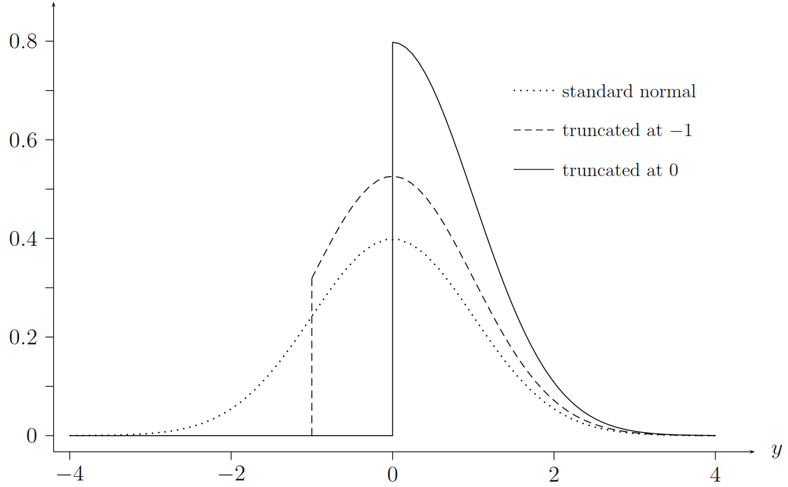
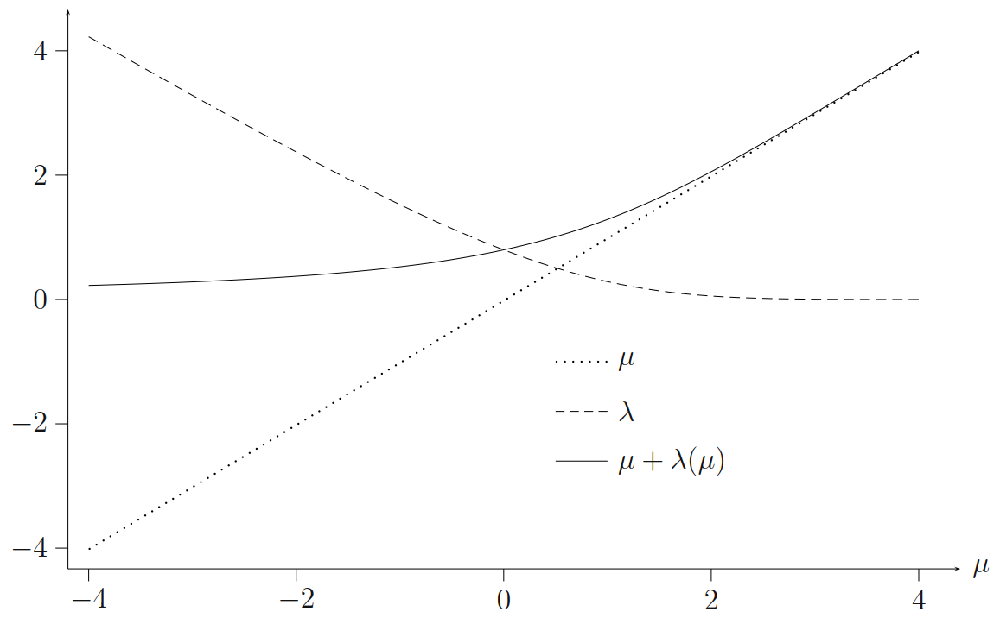
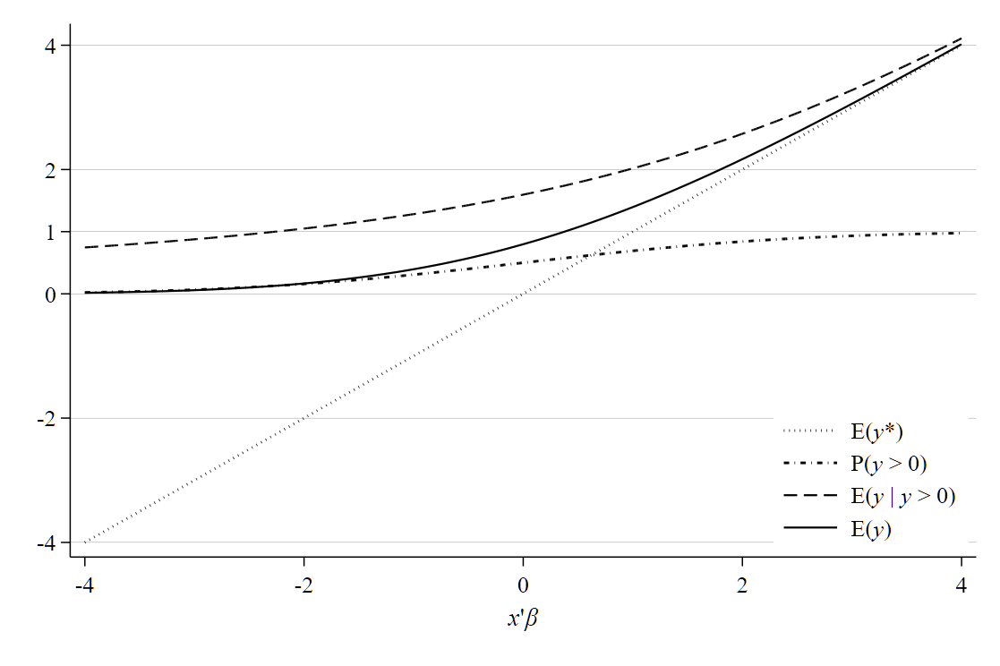

# 受限因变量模型 {#chap-limited-dep}

多数情况下，我们会假设样本 (sample) 是从总体中 (population) 随机抽取的，因此，可以基于样本的估计值来推断总体特征。当该假设无法满足时，手头的样本便无法代表母体特征，导致常规的 OLS 参数估计有偏或不一致。这也是实证分析中内生性问题的一个主要来源，本质上其实都可以归结为缺失值问题或遗漏变量问题。

本章介绍两类密切相关的主题：一是因变量只能被部分观测；二是样本并非从总体中随机抽取的，此时，虽然因变量可以被完全观测到，但它却无法完全反应总体的特征。涵盖的模型包括：Tobit 模型、自选择模型、处理效应模型、两部模型和双栏模型。主要参考资料包括：Maddala (1983)、Amemiya (1985)、Gourieroux (2000)、Sun (2004)、Cameron 和 Trivedi (2005), Winkelmann and Boes (2006)、Wooldridge (2010)，以及 Hansen (2021) 等。[^1]

## 简介 {#sec-limited-dep-intro}

我们先用一个简单的例子来说明受限因变量的特征和产生机制。比如，我们想要研究收入如何影响家庭的「购车支出」，即收入对耐用品消费行为的影响。你会发现，数据中会有很多取值为"$0$"的观察值，其占比达 $30\%$ 或更高。表面上来看，对这类数据直接进行 OLS 回归似乎没什么问题，因为确实有很多家庭在某些年度上的汽车消费支出为 $0$。细想一下，这似乎有悖于 OLS 的一些基本假设。比如，我们通常会假设 $\mathrm{E}(y_i | x_i)$ 服从正态分布 (至少其分布应该是连续的)，这意味着 $y_i$ 的取值不应该在某处 (此例中为 $0$)"扎堆"出现。同时，对于汽车消费而言，模型的拟合值也不应该为负数(购车支出额不可能小于零)。

从数据结构角度来看，「汽车消费支出」变量可以视为「离散数值」和「连续数值」的混合体。该变量的数据生成过程可以拆解为两个购买决策：一是「是否买车？」即 $y_i$ 是否等于 $0$；二是如果买车，那么「花多少钱买车？」，即 $\mathrm{E}(y_i |y_i>0, x_i)$。前者可以视为「参与决策」，后者视为「数量决策」。

**几种典型的数据结构：**

- 边角解 上面提到的汽车消费支出的例子中，$y_i=0$ 可以视为这部分消费者基于效用最大化的决策结果：他们买车的边际收益小于其边际成本。因此，$y_i=0$ 是真实发生、真实存在的数据。

- 归并数据 换个角度理解 $y_i=0$ 的观察值。一种可能是有些消费者当年卖掉了自己的旧车但还没有买新车，此时 $y_i<0$，但在数据收集过程中，我们把这些观察值统一记录为 0 值，或曰"归并"为 0 值。这类数据称为「归并数据 (censoring data)」。[^2]

- 截断数据 若我们的样本中只包含 $y_i>0$ 的观察值，相当于那些没有买车的人的数据都被"删除"了，则称为「截断数据」。

后续要介绍各类模型，选择的依据一方面基于假设检验，另一方面也取决于我们如何看待数据生成过程：

- $y$ 的数据没有缺失，但有相当比例的观察值为零

    - 如果「是否买车」与「花多少钱买车」这两个行为都受同一组因素影响，如可支配收入，则对应的模型为 Tobit I 模型，Stata 命令为 `tobit`；

    - 如果「是否买车」与「花多少钱买车」这两个行为有不同的因素驱动，如前者主要由"是否拥有本市户口"(购车资格)决定，而后者则主要受可支配收入影响，则对应的模型为「两部模型(Two-part model)」，Stata 命令为 `twopm` 或 `cmp`；

- 如果我们只能看到 $y_i>0$ 部分的观察值，但 $x_i$ 可以全部观察到，则数据类型为「截断数据」。此时又可以分成两种情形：

    - 其一，若"购买决策" ($y_i>0$)与"支出决策"受同一组因素的影响，则模型为「截断回归模型」，使用 `truncreg` 即可；

    - 其二，若"购买决策" ($y_i>0$)与"支出决策"受不同因素的影响，便会产生「样本选择」(拥有本市户口的人才有资格买车)或「自选择」(住所离公司远的人更倾向于买车) 偏误，此时要使用 Heckman 选择模型，Stata 命令为 `heckman`。

## 数据特征：截堵与截断

按照回归分析的惯例，用 $y$ 表示被解释变量的观察值。$y$ 是潜变量 $y^{*}$ 的不完全观测值，观测规则为

$$
y=g\left(y^{*}\right)
$$


根据分析的需要，我们会将 $g(\cdot)$ 设定成不同的函数形式，比如 $g(\cdot) = x^\prime \beta + e$。

### 边角解结果变量

在耐用品消费研究中，在特定的时间段内，有一部分人的消费支出为零，即不购买任何耐用品；而另一部分人的消费支出则大于零。对应的数据特征为：一定比例的观察值为零，其他观察值连续取值且大于零。又如，若我们关注上市公司的捐赠行为，即每个会计年度的捐赠金额，也会看到类似的现象：大约 30% 的公司的捐赠额为零，其他公司则有数额不等的捐赠额。类似的例子还包括：劳动力供给行为 (每周工作的小时数)；交通违规行为 (每年的交通罚款金额) 等等。这里例子的共同特征在于，其背后的数据生成过程 (DGP) 均可以视为个体或公司在特定约束条件下的效用最大化问题：当某种选择的边际收益大于边际成本时，个体/公司便会选择参与某种行为，对应的结果变量为大于零的连续数；反之，则不参与该行为，此时结果变量取值为零。换言之，我们关注的被解释变量 $y$ 具有混合分布：离散分布 ($y=0$ 的部分) + 连续分布 ($y \geq 0$ 的部分)。Wooldrige (2002) 将这类被解释变量称为「边角解结果变量」(corner solution outcomes)。

有两点需要特别说明：(1) 此类数据中不存在缺失值问题；(2) 样本中的"零值"是真实存在的，并未经过人为合并或二次更改。

若 $y$ 中小于或大于某个临界值的观察值都无法观察到，则称为「截断」；若小于临界值 $c$ 的观察值都被合并为一个数值，则称为「归并」。无论是截断数据还是归并数据，若截断或归并过程是内生的 (非随机缺失或归并)，则称为「样本选择」模型。

### 归并 (Censoring)

在截堵数据中，解释变量 $x$ 可以被完全观测到，但被解释变量 $y$ 则只能被部分观察到。

若是从下方 (或曰左侧) 截堵，则

$$
y= \begin{cases}
     y^{*} & \text { if } y^{*}>L \\ 
     L & \text { if } y^{*} \leq L
   \end{cases}
$$


如前所言，在耐用品消费研究中，对于样本区间内没有买车的消费者，我们只能观察到其消费支出为 0 ($y^{*} \leq 0$)，而其他人的消费支出则可以被完全观测 ($y^{*}>0$)。[^3]

若从上方 (或) 右侧截堵，则我们可以观察到

$$
y= \begin{cases}y^{*} & \text { if } y^{*}<U \\ U & \text { if } y^{*} \geq U\end{cases}
$$


例如，在年度收入调查数据中，$U=\$ 100,000$。在生存分析中，此类截堵被称为「第一类截堵」。为了便于表述，$y^{*}$ 中无法被完全观测的部分通常记为 $L$ 或 $U$。更一般化地，可以将 $y^{*}$ 中无法观测部分视为缺失值，但解释变量 $\mathbf{x}$ 仍然可以被完全观测到。

### 截断 (Truncation)

截断会导致更多的的信息缺失，因为边界处的所有观测数据都缺失了。若从下面/左边截断，我们观察到的数据形态为：

$$
y= \begin{cases}
     y^{*} & \text { if } y^{*}>L  \\ 
     . & \text { if } y^{*} \leq L
   \end{cases}
$$

例如，只有购买耐用品的消费者才可以被观测到 $(L=0)$。

若从上面/右边截断，则我们只观察到

$$
y=y^{*} \quad \text { if } y^{*}<U
$$


例如，在收入调查中，年收入超过 200 万的家庭出于隐私考虑，不愿意参与问卷填写，他们的数据处于缺失状态。

截断还可以进一步细分成两种情形：一种是只有因变量的数据缺失，而解释变量的数据是可以完全观测的；另一种是因变量和自变量都缺失。

而缺失的成因又可以分成两种：

一种是不存在样本选择问题，即

$$
y^*=x\beta + u, \quad \text{且} \quad y=y^{*}\  (\text{if}\ y^{*}<U)
$$


另一种是存在样本选择偏误，即

$$
y^*=x\beta + u, \quad \text{但} \quad y=y^{*}\ (\text{if}\ z\gamma + v<0), \quad \text{且} \quad \operatorname{corr}(u,v)\neq 0
$$


### 区间数据 (Interval Data)

区间数据也称为间隔数据，是以区间标记的方式记录的数据。信用卡申请表中往往会采用这种方式收集个人收入信息。问题通常表述为：「您的年收入是 (万元)：A. 0-10；B. 10-30；C. 30-100；D. 100 以上」。好处在于，可以保护申请人的隐私，同时也能够了解其收入的大致范围。从数据结构上来看，区间数据可以视为在多点截堵的数据，观察到的数据 $y$ 是未观察到的 $y^{*}$ 所在的特定区间。

Stata 手册中 ( [[R] intreg, p.4](https://www.stata.com/manuals/rintreg.pdf)) 的 **womenwage2.dta** 数据直观地呈现了这类数据的结构。被访妇女需要报告其年收入范围：

1. $\$ 5,000$ 或以下

2. $\$ 5,001-\$ 10,000$

3. $\$ 10,001-\$ 25,000$

4. $\$ 25,001-\$ 30,000$

5. $\$ 30,001-\$ 40,000$

6. $\$ 40,001-\$ 50,000$

7. $\$ 50,000$ 或以上

工资类别的下限和上限会被记录在变量 **wage1** 和 **wage2**中，下面列出了其中的一部分观察值：[^4]

```stata
. webuse "womenwage2.dta", clear 
(Wages of women, fictional data)

. list wage1 wage2  wage tenure nev_mar in 1/10

     +-------------------------------------------+
     | wage1   wage2   wage     tenure   nev_mar |
     |-------------------------------------------|
  1. |     .       5      5         .5         1 |
  2. |     5      10     10   1.666667         1 |
  3. |     5      10      8   .0833333         0 |
  4. |    10      15     13         .5         1 |
  5. |    15      20     18   .1666667         1 |
     |-------------------------------------------|
  6. |    20      25     24        .75         0 |
  7. |    25      30     26   .0833333         1 |
  8. |    30      40     32      12.25         1 |
  9. |    40      50     46   14.66667         0 |
 10. |    50       .     55   5.416667         0 |
     +-------------------------------------------+
```

### 区分：边角解数据、归并和截断

- 归并样本具有总体代表性，因为其包含了所有的观察对象，只是部分观察对象的数据被「压缩」了。截断样本不能代表总体，因为有一部分观察对象完全未被纳入。

- 相对于归并样本，截断样本损失了更多的信息。在归并数据中，没有购车或购车支出小于零 (卖车) 的消费者的汽车消费记为 $0$，我们明确地知道 $y^*<0$。而对于截断数据，我们完全观察不到当年未购车的消费者的相关数据 (包括 $y$ 和 $x$)。
- 相比之下截断样本比归并样本的观察值要少，其均值相对较高。

## Tobit 模型 {#sec-limited-dep-tobit}

### 简介

假设我们想要分析每个家庭在过去一年中的「境外旅游支出」，或企业在过去一年中获得的「政府补贴」。这类数据都具有如下两个特征：

1. 它们的取值都是非负数
2. 有相当数量的观察值聚集于"零"处

因此，我们设定的模型要赋予样本中的「零值」一个大于零的概率，同时要保证模型的拟合值不能小于零。显然，普通线性回归模型并不满足上述条件。同时，普通线性模型假设解释变量的边际效应为常数，然而，对于因变量的受限的模型而言，这一假设并不合理 (参见 @sec-limited-dep-Tobit-ME 小节)。[^5]。

线性回归模型的主要局限在于，它无法用于分析此类「角点解模型 (corner solution models)」中的一些关键统计特征。在普通的回归分析中，我们重点关注的是 $\mathrm{E}(y | x)$，但在「角点解模型」中，我们还想分析如下问题：其一，不到境外旅游的人口比例 (支出为零的概率)，即 $P(y=0 \mid x)=1-P(y>0 | x)$ ；其二，若到境外旅游，其期望消费支出是多少？即 $\mathrm{E}(y | y>0, x)$。

根据迭代期望定律 (law of iterated expectations)，[^6]

$$
\begin{aligned}
        \mathrm{E}(y | x) &=P(y=0 \mid x) \times 0+P(y>0 | x) \times \mathrm{E}(y | y>0, x) \\
        &=P(y>0 | x) \times \mathrm{E}(y | y>0, x)
    \end{aligned}
$$ {#eq-limdep-Winkel-7-1}


可见，模型设定中要同时考虑两个部分：二元选择部分，以保证 $0 \leq P(y>0 | x) \leq 1$；正值回归部分，确保 $\mathrm{E}(y | y>0, x)>0$。例如，我们可以将前者设定为 Probit 模型，后者设定为对数线性模型，并允许二者的决定因素不同，从而形成所谓的「两部模型 (two-part models)」 (参见 Duan et al., 1983; Belotti et al. (2015))。

需要特别说明的是：这类数据中取值为"0"的观察值是真实存在的，而非抽样或数据采集过程中的归并登记问题(比如，把小于零的观察值都记录为零)。[^7] 同时，抽样过程也不存在「样本选择」或「自我选择问题」。

### Tobit 模型的设定 {#sec-limited-dep-tobit-est}

经典的 Tobit 模型是 Tobin (1958) 在分析家庭耐用品的支出时对 Probit 模型的一种拓展[^8] (Tobit一词源自 Tobin's Probit)，其后衍生出多种扩展版本。该模型假设 $P(y>0 | x)$ 和 $\mathrm{E}(y | y>0, x)$ 都源于同一个潜变量 (Latent variable) —— $y^{*}$。

$$
y^{*}=x^{\prime} \beta+u, \quad u | x\sim {N}\left(0, \sigma^{2}\right)
$$ {#eq-limdep-Winkel-7-2}


引入潜变量 $y^{*}$ 只是为了便于分析，我们关注的是具有「离散-连续」混合分布特征的 $y$，定义如下：

$$
y=\max \left(0, y^{*}\right)
$$ {#eq-limdep-Winkel-7-3}

等价于：

$$
y_{i}=\left\{
    \begin{aligned}
        0         & \quad \text { if } y_{i}^{*} \leq 0 \\
        y_{i}^{*} & \quad \text { otherwise }
    \end{aligned}\right.
$$

即当 $y^{*} \leq 0$ 时，只能观察到 $y=0$；而当 $y^{*}>0$ 时，则可以完整地观察到 $y=y^{*}$ 的数据。方程 (@eq-limdep-Winkel-7-2) 和 (@eq-limdep-Winkel-7-3) 很好地概括了 Tobit 模型的特征，由此引申出各类变种。

接下来，我们首先介绍 Tobit 模型的估计方法，然后分析其系数含义，最后对比 Tobit, Probit 与 OLS 的异同。

### MLE 估计

如前所述，$y$ 的取值包括两个部分：一定比例的「零值」和其余取值为正的连续数值。前者可以视为离散变量，需要写出 $y$ 在零处的概率函数 (probability function)；而后者则是连续变量，需要写出其概率密度函数 (density function)，并据此确定其条件期望函数。在正态分布假设下，便可写出似然函数，用 MLE 估计参数。

零值的概率由下式给出：

$$
P(y=0 \mid x)=P\left(y^{*} \leq 0 \mid x\right)=P\left(\frac{u}{\sigma} \leq-\frac{x^{\prime} \beta}{\sigma} \mid x\right)=1-\Phi\left(\frac{x^{\prime} \beta}{\sigma}\right)
$$ {#eq-limdep-Winkel-7-4}


对于大于零的观察值，其密度函数为：

$$
f(y, y>0 | x ; \beta, \sigma)=\frac{1}{\sqrt{2 \pi} \sigma} \exp \left[-\frac{1}{2}\left(\frac{y-x^{\prime} \beta}{\sigma}\right)^{2}\right]=\frac{1}{\sigma} \phi\left(\frac{y-x^{\prime} \beta}{\sigma}\right)
$$ {#eq-limdep-Winkel-7-5}


其中，$\Phi(\cdot)$ 和 $\phi(\cdot)$ 分别表示标准正态分布的累计分布函数和密度函数。假设样本中的观察值彼此独立，并定义虚拟变量 $d_i$：

$$
d_i= \begin{cases}
       0 & \text { if } y_i=0 \\
       1 & \text { if } y_i>0
     \end{cases}
$$

我们可以用最大似然法估计参数 $\sigma$ 和 $\beta$，似然函数为：

$$
\begin{aligned}
        L(\beta, \sigma ; y, x) &=\prod_{i=1}^{n} P(y=0)^{1-d_i} f\left(y_{i}, y_{i}>0\right)^{d_i} \\
        &=\prod_{i=1}^{n}\left[1-\Phi\left(x_{i}^{\prime} \beta / \sigma\right)\right]^{1-d_i}\left[\frac{1}{\sigma} \phi\left(\frac{y_{i}-x_{i}^{\prime} \beta}{\sigma}\right)\right]^{d_i}
    \end{aligned}
$$ {#eq-limdep-Winkel-7-6}

对数似然函数为：

$$
\ln L(\beta, \sigma ; y, x) 
  = \sum_{i=1}^{N}\left\{
    \left(1-d_{i}\right) \ln \left[1-\Phi\left(x_{i}^{\prime} \beta / \sigma\right)\right]
    +
    d_{i}\ln \left[\frac{1}{\sigma} \phi\left(\frac{y_{i}-x_{i}^{\prime} \beta}{\sigma}\right)\right] \right\}
$$


Tobit 模型对数似然函数是全局凹的 (Olsen, 1978)，即具有全局最优解。极大似然估计值是渐近正态分布的，方差矩阵的估算方法参见 Maddala (1983, 155) 和 Amemiya (1985, p.373)。

需要特别说明的是，上述结论依赖于一些严格的假设条件，包括：潜变量 $y^*$ 服从正态分布，且同方差；不存在模型设定偏误等，否则 MLE 不再是一致估计，详见第@sec-limited-dep-tobit-spec 小节。

### 截断正态分布

在深入分析 Tobit 模型的性质之前，我们先了解一下截断正态分布的统计特征。在随后介绍样本选择模型和处理效应模型时都需要用到这些性质。

假设随机变量 $y$ 的密度函数为 $f(y)$，若 $y$ 从左侧在 $c$ 处被截断，则截断后的密度函数 $f(y|y>c)$ 可以通过对原始密度函数 $f(y)$ 进行缩放得到：

$$
f(y | y>c)=\frac{f(y)}{P(y>c)}=\frac{f(y)}{1-F(c)}
$$ {#eq-limdep-Winkel-7-7}

其中，$F(c)$ 是 $y$ 在 $c$ 处的累积分布函数。因此，如果 $y \sim N(\mu,\sigma^{2})$，则其截断后的密度函数为：

$$
f(y | y>c)=
    \frac{\frac{1}{\sigma} \phi\left(\frac{y-\mu}{\sigma}\right)}    
         {\left[1-\Phi\left(\frac{c-\mu}{\sigma}\right)\right]}
$$ {#eq-limdep-Winkel-7-8}


其中，$\Phi(\cdot)$ 和 $\phi(\cdot)$ 分别表示标准正态分布的累计分布函数和密度函数。 图 @fig-Fig-Limited-truncNormal-density-Winkelmann-7-1 显示了三个密度函数：标准正态分布和自左侧分别在 $c=-1$ 和 $c=0$处截断的两个截断正态分布。

{#fig-Fig-Limited-truncNormal-density-Winkelmann-7-1 width="80%"}

#### 截断型 $N(0,1)$ 变量的期望值 {.unnumbered}

在后续的分析中，我们会频繁地用到截断型正态分布的期望值。为了便于理解，我们先从标准正态分布入手。设 $u \sim N(0,1)$，则对于任意 $c$

$$
\begin{aligned}
        \mathrm{E}(u \mid u>c) &=\int_{c}^{\infty} u f(u \mid u>c) d u \\
        &=\frac{1}{1-\Phi(c)} \int_{c}^{\infty} u \phi(u) d u=\frac{\phi(c)}{1-\Phi(c)}
    \end{aligned}
$$ {#eq-limdep-Winkel-7-9}

最后一个等式源于

$$
\phi^{\prime}(u)=\frac{d}{d u}\left(\frac{1}{\sqrt{2 \pi}} e^{-\frac{1}{2} u^{2}}\right)=-u \phi(u)
$$ {#eq-limdep-Winkel-7-9a}


因此，

$$
\int_{c}^{\infty} u \phi(u) d u=-\left.\phi(u)\right|_{c} ^{\infty}=-\phi(\infty)-(-\phi(c))=\phi(c)
$$ {#eq-limdep-Winkel-7-9b}


之所以能将条件期望表示为密度函数 $\phi(c)$ 与互补累积密度函数 $1-\Phi(c)$ 的比值，主要源于正态分布假设。若 $y$ 不服从正态分布，则其条件期望通常不会有如此简洁的形式。

### 逆米尔斯比率及其性质

逆米尔斯比率 (Inverse Mills ratio，**IMR**)，定义为标准正态分布的密度与累积密度之比：

$$
\text{IMR} = \lambda(\delta)=\frac{\phi(\delta)}{\Phi(\delta)}
$$


其中，$\delta \in(-\infty, \infty)$。在受限因变量以及自选择模型中，$\lambda(\delta)$ 都扮演着非常重要的角色。本例中，由于 $\phi(c) /[1-\Phi(c)]=$ $\phi(-c) / \Phi(-c)$，则 (@eq-limdep-Winkel-7-9) 式可以表示为：

$$
\mathrm{E}(u \mid u>c)=\lambda(-c)
$$ {#eq-limdep-Winkel-7-10}


IMR 的基本性质如下： 其一，IMR 不会小于 $0$。因为其分子分母均为非负数。其二，IMR 也不会小于 $-\delta$。这是因为 $\lambda(\delta)=\mathrm{E}(u \mid u>-\delta)$，其中，$u \sim N(0,1)$，显然，$u$ 的期望值必然大等于其最小值，即 $-\delta$。综合上述两个特征可知，对于任意取值的 $\delta$ (可以为正，亦可为负)，其 IMR 的下限为：

$$
\lambda(\delta) \geq \max (0,-\delta)
$$ {#eq-limdep-Winkel-7-11}

这意味着 $\lambda(\delta)+\delta>0$。对 $\lambda(\delta)$ 求偏导可得

$$
\lambda^{\prime}(\delta)=-\lambda(\delta)[\lambda(\delta)+\delta] < 0
$$ {#eq-limdep-Winkel-7-12}


这表明 IMR 是 $\delta$ 的单调递减函数。 事实上，对于任何连续的单变量分布 $F(\delta)$ 都可以计算其密度函数和分布函数的比值。由于逆米尔斯比是对数分布函数的一阶导数，[^9] 所以只要 $\log [F(\delta)]$ 是凹的，IMR 就会随着 $\delta$ 的增大而减小。[^10]在本例中，$\delta=-c$，意味着 $\mathrm{E}(u \mid u>c)$ 随着 $c$ 单调递增。

#### 截断型 $N((\mu, \sigma^{2})$ 变量的期望值 {.unnumbered}

上述结果可以扩展到普通正态分布 $N \sim \left(\mu, \sigma^{2}\right)$。若 $u \sim N(0,1)$，则 $y=\mu+\sigma u \sim N \left(\mu, \sigma^{2}\right)$。若 $y$ 在 $c$ 的左侧截断，则其条件期望为：

$$
\begin{aligned}
        \mathrm{E}(y | y>c) &=\mathrm{E}(\mu+\sigma u \mid \mu+\sigma u>c) \\
        &=\mu+\sigma \mathrm{E}\left(u \mid u>\frac{c-\mu}{\sigma}\right) \\
        &=\mu+\sigma \frac{\phi(\alpha)}{1-\Phi(\alpha)}
    \end{aligned}
$$ {#eq-limdep-Winkel-7-13}

其中，$\alpha=(c-\mu) / \sigma$。若从 $0$ 的左侧截断，即 $c=0$，则

$$
\begin{aligned}
        \mathrm{E}(y | y>0) &=\mu+\sigma \frac{\phi(-\mu / \sigma)}{1-\Phi(-\mu / \sigma)} \\
        &=\mu+\sigma \frac{\phi(\mu / \sigma)}{\Phi(\mu / \sigma)} \\
        &=\mu+\sigma \lambda(\mu / \sigma)
    \end{aligned}
$$ {#eq-limdep-Winkel-7-14}


图 @fig-Fig-Limited-dep-7-2 呈现了当 $\sigma=1, c=0$ 时，式 (@eq-limdep-Winkel-7-14) 中 $y$ 和 $\mu$ 的变化关系。作为对比，图中也呈现了 $\mathrm{E}(y^*)=\mu$ (对角的直虚线)和逆米尔斯比率 $\lambda(\mu)$ 与 $\mu$ 之间的关系。对于 $\mathrm{E}(y | y>0)=\mu+\lambda(\mu)$，它始终都不会小于零，即使当 $\mu$ 为负也是如此，当 $\mu$ 取值为正，且不断增大时，$\mathrm{E}(y | y>0)$ 与 $\mathrm{E}(y^*$ 越来越接近。显然，左侧截断越严重，即均值 $\mu$ 相对于截断点 (此例中为 $c=0$)，$\mathrm{E}(y | y>0)$ 与 $\mathrm{E}(y^*)$ 之间的偏差就越大。[^11]

{#fig-Fig-Limited-dep-7-2 width="80%"}

以上我们分析了从从下方/左侧截断的情形，从上方/右侧截断的分析过程也很相似。采用 (@eq-limdep-Winkel-7-9) 的推导思路，很容易推导出如下结果：

$$
\mathrm{E}(y | y<c)=\mu-\sigma \frac{\phi(\alpha)}{\Phi(\alpha)} = \mu-\sigma \lambda(\alpha)
$$ {#eq-limdep-Winkel-7-15}


截断显然也会影响分布的高阶矩。例如，若 $y \sim N\left(\mu, \sigma^{2}\right)$，则[^12]

$$
\operatorname{Var}(y | y>c)=\sigma^{2}(1-\lambda(\alpha)(\lambda(\alpha)-\alpha))
$$ {#eq-limdep-Winkel-7-16}


其中，$\alpha=(c-\mu) / \sigma$，$\lambda(\alpha)=\phi(\alpha) / \Phi(\alpha)$。因此，截断正态分布先天具有异方差特征，其方差依赖于 $\mu$，即便是其潜在母体分布是同方差的。

### 解读 Tobit 模型 {#sec-limited-dep-inter-Tobit}

我们重点关注 $y$ 的条件期望和边际效应。作为辅助分析的工具，潜变量的期望值似乎没有太多值得关注的，因为 $\mathrm{E}\left(y^{*} \mid x\right)$ 与 $\beta$ 之间是简单的线性关系。如下是我们重点关注的：

1. $P(y=0 \mid x)$ 或 $P(y>0 | x)$

2. $\mathrm{E}(y | x)$

3. $\mathrm{E}(y | x, y>0)$

分析的侧重点取决于分析目的，例如，若要分析女性劳动力供给，会重点关注教育如何影响劳动参与率 (A)。同样，人们可以研究参公女性的预期工作时长 (C) 或所有女性的预期工作时长 (B) 如何随着教育水平的提高而变化。这些问题往往存在内在关联。首先，根据概率基本定律，可以看出 A 中两个概率的关系：$P(y=0 \mid x)=1-P(y>0 | x)$；而 B 和 C 的关系则为：$\mathrm{E}(y|x) = P(y>0 | x) \mathrm{E}(y|x, y>0)$。其次，它们都依赖于相同的基本两个参数 $\beta$ 和 $\sigma^{2}$。

由 Tobit 的模型设定可知，

$$
\begin{aligned}
P(y>0 \mid x) &=&\Phi\left(x^{\prime} \beta / \sigma\right) \\
\mathrm{E}(y \mid y>0, x) &=&x^{\prime} \beta+\sigma \lambda\left(x^{\prime} \beta / \sigma\right) \\
\mathrm{E}(y \mid x) &=&\Phi\left(x^{\prime} \beta / \sigma\right)\left[x^{\prime} \beta+\sigma \lambda\left(x^{\prime} \beta / \sigma\right)\right]
\end{aligned}
$$ {#eq-limdep-Winkel-7-17}

图 @fig-Fig-Limited-truncNormal-Expectation-Winkelmann-7-3 直观地呈现了式 (@eq-limdep-Winkel-7-17) - (@eq-limdep-Winkel-7-19)。[^13]可以看出 $\mathrm{E}(y | y>0, x)>\mathrm{E}(y|x)> \mathrm{E}\left(y^{*}|x\right)$。我们可以借助图形对斜率和边际效应做一些初步判断。假设 $\mu$ 增加，例如 $\Delta \mu=\beta_{l} \Delta x_{l}$，其中， $\beta_{l}>0$ 且 $\Delta x_{l}>0$，则

$$
\Delta \mathrm{E}(y | y>0, x)<\Delta \mathrm{E}(y | x)<\Delta \mathrm{E}\left(y^{*} \mid x\right)=\Delta \mu
$$


若 $\mu$ 减少，则上述不等式关系会反转。下面，我们正式分析边际效应。

{#fig-Fig-Limited-truncNormal-Expectation-Winkelmann-7-3 width="80%"}

#### 边际效应 (Marginal Effects) {.unnumbered} {#sec-limited-dep-Tobit-ME}

第 $l$ 个解释变量对 $y$ 取边角解的概率的边际效应为：

$$
\frac{\partial P(y=0 \mid x)}{\partial x_{l}}=-\phi\left(x^{\prime} \beta / \sigma\right) \beta_{l}
$$ {#eq-limdep-Winkel-7-20}


求取 Tobit 模型中条件期望值的一阶偏导数需要用到逆米尔斯比率的一阶偏导数 (@eq-limdep-Winkel-7-12)，因此，

$$
\frac{\partial \mathrm{E}(y | y>0, x)}{\partial x_{l}}=\beta_{l}\left\{1-\lambda\left(x^{\prime} \beta / \sigma\right)\left[x^{\prime} \beta / \sigma+\lambda\left(x^{\prime} \beta / \sigma\right)\right]\right\}
$$ {#eq-limdep-Winkel-7-21}


由于非条件期望为 $\mathrm{E}(y | x)=$ $P(y>0 | x) \mathrm{E}(y | y>0, x)$，整体的边际效应 $\partial \mathrm{E}(y | x) / \partial x_{l}$ 可以表述为

$$
\frac{\partial \mathrm{E}(y | x)}{\partial x_{l}}
    =\frac{\partial P(y>0 | x)}{\partial x_{l}} \mathrm{E}(y | y>0, x) 
    + P(y>0 | x) \frac{\partial \mathrm{E}(y | y>0, x)}{\partial x_{l}}
$$ {#eq-limdep-Winkel-7-22}


上式的经济含义很有趣。总的边际效应有两部分组成：

1. **extensive margin** (e.g., 教育水平提高引起的参工率的变化($\frac{\partial P(y>0 | x)}{\partial x_{l}}$) 乘以平均工作时数($\mathrm{E}(y | y>0, x)$)。

2. **intensive margin** (e.g., 教育水平提高引起的平均工作时数的变化($\frac{\partial \mathrm{E}(y | y>0, x)}{\partial x_{l}}$)乘以参工率 ($P(y>0 | x)$)

换个角度来看，Tobit 模型中非条件期望值的边际效应其实也很简单。我们可以把 (@eq-limdep-Winkel-7-20) 和 (@eq-limdep-Winkel-7-21)，以及 (@eq-limdep-Winkel-7-17) 和 (@eq-limdep-Winkel-7-18) 带入 (@eq-limdep-Winkel-7-22)，整理得：

$$
\frac{\partial \mathrm{E}(y | x)}{\partial x_{l}}=\beta_{l} \Phi\left(x^{\prime} \beta / \sigma\right)
$$ {#eq-limdep-Winkel-7-23}


由此看来，边际效应只是 $\beta_{l}$ 的缩放版本。需要注意的是，由于 $\Phi\left(x^{\prime} \beta / \sigma\right)$ 会随着 $x$ 的取值而发生非线性变化，所以 ${\partial \mathrm{E}(y | x)}/{\partial x_{l}}$ 不再是常数；同时，由于 $\Phi\left(x^{\prime} \beta / \sigma\right)$ 的取值介于 0 和 1 之间，这意味着 $\beta_{l} \Phi\left(x^{\prime} \beta / \sigma\right) \leq \beta_{l}$。这是 Tobit 模型与普通线性回归的最大区别。

同时，我们还可以发现，变量 $x_{l}$ 和 $x_{m}$ 的相对边际效应为常数：

$$
\frac{\partial \mathrm{E}(y | x) / \partial x_{l}}{\partial \mathrm{E}(y | x) / \partial x_{m}}=\frac{\beta_{l}}{\beta_{m}}
$$ {#eq-limdep-Winkel-7-24}


此外，可以看出，随着 $x^{\prime} \beta$ 的增大，$\Phi\left(x^{\prime} \beta / \sigma\right)$ 也不断增大(并最终趋近于 $1$)，$y$ 取零值的概率不断减小。在这个过程中，$y$ 和 $y^{*}$ 越来越相似，它们的条件期望和边际效应也越来越接近。换言之，随着我们远离边角(cornor outcome)，Tobit 模型逐渐收敛为普通线性模型。

### Tobit 和 OLS 的对比

在实操过程中，若直接使用 OLS 估计具有边角解特征的数据，通常有两种做法：

1. 丢弃 $y_{i}=0$ 的观察值，仅包含非受限部分的样本，例如 `reg y x if y>0`

2. 忽略观察值受限问题，直接针对所有样本进行估计，例如 `reg y x`

然而，这两种方法得到的估计结果都是有偏的，因为二者都存在遗漏变量问题。具体而言，对于第一种情形「丢弃 $y_{i}=0$ 的观察」，由 (@eq-limdep-Winkel-7-18)可知，$\mathrm{E}(y | y>0, x)=x^{\prime} \beta+\sigma \lambda\left(x^{\prime} \beta / \sigma\right)$，正确的模型设定形式为：

$$
y = x^{\prime}\beta + \sigma\lambda\left(x^{\prime}\beta/\sigma\right) + u, \quad u \sim \mathrm{N}(0,\sigma^2)
$$ {#eq-limdep-Winkel-7-27}


若仅针对 $y>0$ 部分的观察值做 OLS 回归，即执行 Stata 命令 `reg y x if y>0`，则对应的实证模型为：

$$
y = x^{\prime}{\gamma} + v , \quad
      v = \sigma \lambda\left(x^{\prime} \beta / \sigma\right)+u
$$ {#eq-limdep-Winkel-7-27a}


显然，$\mathrm{corr}(x,v)\neq 0$，这意味着 $\gamma$ 的 OLS 估计是有偏的，即 $\mathrm{E}(\hat{\gamma}_{OLS}) \neq \beta$。偏差的方向取决于 $x$ 和 $\lambda$ 的相关系数的符号。由图 @fig-Fig-Limited-dep-7-2 可知，$\lambda$ 随着参数 $\mu$ 的增大而减小。因此，若 $\beta_{l}>0$，则 $\mathrm{corr}(x, v)<0$，此时 OLS 估计的偏差向下，即 $E(\hat{\gamma}_{OLS}) < \beta$。反之，若 $\beta_{l}<0$，则偏差向上。

要获取 (@eq-limdep-Winkel-7-27) 中 $\beta$ 的无偏估计，可以采用@sec-limited-dep-tobit-est 小节介绍的 MLE 估计[^14]；也可以采用非线性最小二乘法进行估计 (参见 @app-limited-dep-NLScodes 小节)。

同理，对于第二种情形「忽略观察值受限问题」，OLS 估计也是有偏的。

对 (@eq-limdep-Winkel-7-21) 和 (@eq-limdep-Winkel-7-23) 式稍作分析，即可得到如下结论：

$$
\left|\frac{\partial \mathrm{E}(y | y>0, x)}{\partial x_{l}}\right|<\left|\beta_{l}\right|
$$ {#eq-limdep-Winkel-7-25}


和

$$
\left|\frac{\partial \mathrm{E}(y | x)}{\partial x_{l}}\right|<\left|\beta_{l}\right|
$$ {#eq-limdep-Winkel-7-26}


OLS 的偏误源于未考虑边际效应的非线性特征。换个角度来看，也可以认为 OLS 估计存在遗漏变量偏误。

### OLS, Probit 和 Tobit 的关联

由 (@eq-limdep-Winkel-7-6) 式可知：\ Tobit 模型的似然函数为：

$$
L(\beta, \sigma ; y, x) =\prod_{i=1}^{n} P(y=0)^{1-d_i} f\left(y_{i}, y_{i}>0\right)^{d_i}
$$


Probit 模型的似然函数定义为：

$$
L(\beta, \sigma ; y, x) =\prod_{i=1}^{n} P(y=0)^{1-d_i} P(y=1)^{d_i}
$$


普通线性模型的似然函数定义为：

$$
L(\beta, \sigma ; y, x)  = \prod_{i=1}^{n} f\left(y_{i}\right)=\prod_{i=1}^{n} f\left(y_{i}, y_{i}\leq 0\right)^{1-d_i} f\left(y_{i}, y_{i}>0\right)^{d_i}
$$


如此以来，我们很容易看出三者之间的关系：

- OLS 是单纯地针对连续变量 (数量决策)；

- Probit 则是单纯地针对 0/1 变量 (参与决策)；

- Tobit 则兼而有之

换个角度来看，若以 OLS 为基准，则 Tobit 主要应对部分样本的归并问题(单侧或双侧)，而 Probit 模型则可以视为一种极端归并：所有的观察值被归并两个数值 ------ 0 或 1。

### 有关模型设定的几点说明 {#sec-limited-dep-tobit-spec}

上述分析都依赖于两个重要的假设：

一是干扰项服从正态分布；

二是干扰项具有同方差 (不存在异方差)。

否则，此前设定的似然函数便是错误的，非条件期望 $\mathrm{E}(y | x)$ 和条件期望 $\mathrm{E}(y | y>0, x )$ 也都是错的，相应的估计量也不再具有一致性。此时，OLS 反而更加稳健，因为其无偏性只需要满足均值独立 $\mathrm{E}(\varepsilon|x=0)$ 即可，并不依赖于干扰项的分布假设。

Tobit 模型还存在一个重要的局限：该模型假设「是否购买耐用品？」与「花多少钱购买耐用品？」这两个决策受同一组变量的影响，即 (@eq-limdep-Winkel-7-20) 式中的 $P(y=0 \mid x)$ 和 (@eq-limdep-Winkel-7-21) 式中的 $\mathrm{E}(y | y>0, x)$ 都是以 $x$ 为条件的。我们可以找出很多反例。比如，"丈夫的收入水平"会影响妻子参工的概率 $1-P(wage=0 \mid x)$，但却无法直接影响妻子在职场中获得工资收入水平 $\mathrm{E}(wage | wage>0, x)$，因为雇主不太会因为"她"的丈夫的收入高而给这位女性支付相对高的工资。又如，在有些情况下，同一个变量对 $P(y=0 \mid x)$ 和 $\mathrm{E}(y | y>0, x)$ 的影响可能截然相反。比如，我们想研究人寿保险金额与一个人的年龄之间的关系。由于年轻人购买人寿保险的意愿低，因此 $y>0$ 的概率通常会随着年龄的增长而增加。对于已经购买了人寿保险的人而言，保单的价值可能会随着年龄的增长而下降，因为随着人们接近生命的尽头，人寿保险的重要性会不断降低。这种情况是无法反映在 Tobit 模型的设定中的。上述违反 Tobit 模型设定的情形，需要使用 Heckman 选择模型或双栏模型进行分析，将在后文中介绍。

换个角度来看 Tobit 模型：它其实描述了两个决策 ------ 「参与决策」 ($y$ 是否为零？即 $P(y=0 \mid x)$) 和「消费决策」 ($\mathrm{E}(y|y>0)$ 是多少？)。按此思路，我们可以通过估计一个简单的 Probit 模型来评估 Tobit 模型是否适用。具体而言，定义虚拟变量 $D=\mathbf{1}(y>0)$，然后估计 Probit 模型 $\mathrm{Pr}(D=1 \mid x) = P(y>0 \mid x)=\Phi\left(x^{\prime} \gamma\right)$，即 `probit D x`。由 (@eq-limdep-Winkel-7-17)式可知，$\gamma=\beta / \sigma$。因此，我们可以对比由 probit 模型估得的 $\hat{\gamma}$ 与基于 Tobit 模型估得的 $\hat{\beta} / \hat{\sigma}$。虽然二者不会完全相同，但如果由 (@eq-limdep-Winkel-7-2) 和 (@eq-limdep-Winkel-7-3) 式确定的 Tobit 模型设定无误，则二者会非常接近(至少在一个数量级上)。显然，若二者的符号不同，则意味着 Tobit 模型存在误设的可能。

在这种情况下，可以使用由 Cragg (1971) 提出的两部模型。他建议分别估计 $P(y=0 \mid x)$ 的二元模型和 $\mathrm{E}(y | y>0, x)$ 的截断零模型。该方法可以视为对传统 Tobit 模型的扩展，且二者是嵌套关系。因此它所隐含的约束条件可以通过简单的似然比检验来验证。

### Tobit：在 c 处截断

#### 模型设定 {.unnumbered}

假设 $\left\{y_{i}^{*}, x_{i}\right\}$ 独立同分布 (iid)，且

$$
y_{i}^{*}=x_{i} \beta+\varepsilon_{i}, \quad \varepsilon_{i} \mid x_{i} \sim N\left(0, \sigma^{2}\right)
$$


只有当 $y_{i}^{*}>c$ 时才能观察到 $y_{i}^{*}$，其中 $c$ 是一个未知的常数，即

$$
y_{i}=\left\{\begin{array}{cc}
y_{i}^{*} & \text { if } y_{i}^{*}>c \\
\text { 没有观测值 } & \text { if } y_{i}^{*} \leq c
\end{array}\right.
$$

此时，

$$
\begin{aligned}
E\left(y_{i} \mid y_{i}>c\right) &=x_{i} \beta+E\left(\varepsilon_{i} \mid x_{i} \beta+\varepsilon_{i}>c\right) \\
&=x_{i} \beta+E\left(\varepsilon_{i} \mid \varepsilon_{i}>c-x_{i} \beta\right) \\
&=x_{i} \beta+\lambda\left[\left(x_{i} \beta-c\right) / \sigma\right]
\end{aligned}
$$

以及

$$
\begin{aligned}
& \operatorname{var}\left(y_{i} \mid y_{i}>c\right)=\operatorname{var}\left(\varepsilon_{i} \mid \varepsilon_{i}>c-x_{i} \beta\right) \\
=& \sigma^{2}\left[1-\frac{\phi\left[\left(c-x_{i} \beta\right) / \sigma\right]}{1-\Phi\left[\left(c-x_{i} \beta\right) / \sigma\right]}\left(\frac{\phi\left[\left(c-x_{i} \beta\right) / \sigma\right]}{1-\Phi\left[\left(c-x_{i} \beta\right) / \sigma\right]}-\frac{c-x_{i} \beta}{\sigma}\right)\right]
\end{aligned}
$$ {#eq-limitdep-01}


上述公式表明 OLS 估计不一致，因为 $(6.9)$ 中的第二项与 $x_{i}$ 相关。由于这一项的函数形式是已知的，我们可以通过使用 NLS 来避免样本选择偏差，但 MLE 是首选，因为它是渐近有效的。

顺便说一下，我们注意到如果选择是基于回归变量而不是因变量，则不会出现样本选择偏差。

## 附录 B: 部分 Stata 代码

### B1. 图 @fig-Fig-Limited-dep-7-2 的 Stata 代码 {#app-limited-dep-B1}

```stata
* 截断型正态分布的期望值和逆米尔斯比率
  #d ;
   cap net install gr0002_3.pkg;   // install graph scheme -lean2-
   graph set window fontface "Times New Roman";
   local sigma = 1;
   local lamda "normalden(x/`sigma')/normal(x/`sigma')";
   local range "range(-4 +4)";
   twoway 
      (function y = x          , `range' lpattern(dot) lw(*1.3))
      (function y =     `lamda', `range' lpattern(dash))
      (function y = x + `lamda', `range' lpattern(solid))
      ,
      ytitle("") ylabel(-4(2)4, angle(0))  //ysize(2) xsize(2)
      xtitle("{it:{&mu}}")
      scheme(lean2) // scheme(s1mono) 
      legend(order(1 "{it:{&mu}}" 
                   2 "{it:{&lambda}}" 
                   3 "{it:{&mu}} + {it:{&lambda}}({it:{&mu}})")
             ring(0) position(4) col(1) nobox)    ;
  #d cr    
```

### B2. 图 @fig-Fig-Limited-truncNormal-Expectation-Winkelmann-7-3 的 Stata 代码

```stata
#d ;
  cap net install gr0002_3.pkg;   // install graph scheme -lean2-
  graph set window fontface       "Times New Roman";
  graph set window fontfacesymbol "Times New Roman";
  local xb "1.0*x";
  local sigma = 2;
  local lamda "normalden(`xb'/`sigma')/normal(`xb'/`sigma')";
  local range "range(-4 +4)";
  twoway 
     (function y_star = x                     , `range' lp(dot) lw(*1.3))
     (function Py_pos = normal(`xb'/`sigma')  , `range' lp(shortdash_dot) lw(*1.3))
     (function Ey_pos = `xb' + `sigma'*`lamda', `range' lp(dash))
     (function Ey     = normal(`xb'/`sigma')*[`xb' + `sigma'*`lamda'], `range' lpattern(solid))
     ,
     ytitle("") ylabel(-4(2)0 1 2 4, angle(0))
     xtitle("{it:x}'{it:{&beta}}")
     scheme(lean2) // scheme(s1mono) 
     legend(order(1 "E({it:y}*)" 
                  2 "P({it:y} {&gt} 0)"
                  3 "E({it:y} | {it:y} {&gt} 0)" 
                  4 "E({it:y})")
            ring(0) position(4) col(1) nobox) ;
#d cr    
```

### B3. Tobit 模型的 NLS 估计 {#app-limited-dep-NLScodes}
(@eq-limdep-Winkel-7-18) 和 (@eq-limdep-Winkel-7-19) 式的 NLS 估计：

$$
\mathrm{E}(y | y>0, x)=x^{\prime} \beta+\sigma \lambda\left(x^{\prime} \beta / \sigma\right)
$$ {#eq-limdep-Winkel-7-18}


$$
\mathrm{E}(y | x)=\Phi\left(x^{\prime} \beta / \sigma\right)\left[x^{\prime} \beta+\sigma \lambda\left(x^{\prime} \beta / \sigma\right)\right]
$$ {#eq-limdep-Winkel-7-19}


数据生成过程为 (Stata 中的种子值为 `1234`) ：

$$
\begin{aligned}
        y   &= \mathrm{max}(0, y^*) \\
        y^* &= -30 + 3.5x + e \\
        x   &\sim \mathrm{N}(10,4^2) \quad  e \sim \mathrm{N}(0,5^2)
    \end{aligned}
$$


```stata
*-------------------------------------------
*-DGP
  #d ;
    clear;  set obs 10000;   set seed 1234;
    gen x = rnormal(10,4);   gen e = rnormal(0,5);
    gen y0= -30 + 3.5*x + e; gen y = max(0, y0);
    save "Tobit_simLarge.dta", replace; 
  #d cr

*-NLS  
   use "Tobit_simLarge.dta", clear 
   gen cons = 1

   *  E(y|x,y>0) = mu + sigma*lambda(mu/sigma)  ,  
   *               mu = xb, 
   *               lambda(mu/sigma)= phi(mu/sigma) / PHI(mu/sigma)
   nl (y = {xb:cons x} + {sigma=5}*normalden({xb:cons x}/{sigma})/normal({xb:cons x}/{sigma}))

   *- E(y) = PHI(mu/sigma)mu + sigma*phi(mu/sigma)
   nl (y = normal({xb:cons x}/{sigma})*{xb:cons x} + {sigma=5}*normalden({xb:cons x}/{sigma}))  
   * {xb:x1 x2} <==> {xb_1}*x1 + {xb_2}*x2

*-MLE - test NLS 
   tobit y x, ll(0) nolog   // test MLE
```

## 参考文献

Alfonso Sánchez-Peñalver, 2019, Estimation methods in the presence of corner solutions, Stata Journal, 19(1): 87--111. [PDF](https://sci-hub.ren/10.1177/1536867X19830893)

Belotti, F., P. Deb, W. G. Manning, E. C. Norton. 2015. \"twopm: Two-part models\". Stata Journal, 15 (1): 3-20. [Link](https://academic.microsoft.com/paper/263154455/citedby), [PDF](https://journals.sagepub.com/doi/pdf/10.1177/1536867X1501500102)

Cameron, A.C. and Trivedi, P.K. (2005), Microeconometrics: Methods and Applications. Cambridge University Press, Cambridge, UK.

Chernozhukov, V. and Hong, H. (2002), Three-Step Censored Quantile Regression and Extramarital Affairs, Journal of American Statistical Association, 97, 872-882.

Cragg, J. G. 1971 . Some statistical models for limited dependent variables with application to the demand for durable goods. Econometrica 39: 829-844.

Fiebig, D.G. (2007), 'Review of Microeconometrics: Methods and Applications, by A. Colin Cameron and Pravin K. Trivedi', Economic Record, 83, 112-113.

Heckman, J. J. 1976. The common structure of statistical models of truncation, sample selection, and limited dependent variables and a simple estimator for such models. Annals of Economic and Social Measurement 5: 120-137.

Heckman, J. J. 1979. Sample selection bias as a specification error. Econometrica 47: 153-161.

Tobin, J. 1958. Estimation of relationships for limited dependent variables. Econometrica 26: 24-36.

Mroz, T.A. (1987), 'The Sensitivity of an Empirical Model of Married Women's Hours of Work to Economic and Statistical Assumptions', Econometrica, 55: 765-99.

Powell, J. L. (1986), Symmetrically Trimmed Least Squares Estimation for Tobit Models, Econometrica, 54, 1235-1460.

Santos Silva, J.M.C. (2001), Influence Diagnostics and Estimation Algorithms for Powell's SCLS, Journal of Business and Economics Statistics, 19, 55-62.

Sun, Yixiao, Introduction to Microeconometrics Lecture Notes for Econ 220C, Department of Economics, University of California, San Diego Spring 2004.

Tobin, J. 1958. \"Estimation of relationships for limited dependent variables\". Econometrica, 26 (1): 24-36. [PDF](http://sci-hub.ren/10.2307/1907382).

Winkelmann, R., S. Boes. Analysis of Microdata\[M\]. Springer, 2006.

Wooldridge, J. M. 2010. Econometric Analysis of Cross Section and Panel Data. 2nd ed. Cambridge, MA: MIT Press.

[^1]: 说明：(1) 本章还没有写完，仅供本次培训使用，请勿散布于网络。(2) 第 2.4-2.6 小节的内容源自 Hansen (2021) 书稿第 27 章，是学生做的中文译稿，仅供授课用途。

[^2]: "cersoring"一词有多种中文翻译，包括：删失和截堵。

[^3]: 需要注意的是，在截堵数据中，未购车者的 $y$ 取值为 $0$，而不是完全缺失，后者属于截断数据。

[^4]: 需要说明的是，在实际获得的数据中是不存在 `wage` 这个变量的。

[^5]: 对被解释变量做对数转换可以确保 $y$ 的拟合值非负，且边际效应不为常数，但在此处却无法奏效，因为样本中包含了许多取值为零的观察值。

[^6]: 简单起见，在后文中在不至于引起混淆的情况下，我们将省去下标 $i$。

[^7]: Wooldrige (2019, 7th) 特别指出这个问题，并把这类问题称为「边角解(Cornor solution)」问题。

[^8]: 若将居民分成两类：耐用品支出为零 ($D=0$) 和 耐用品支出大于零($D=1$)，并以 $D$ 为被解释变量，则可以进行 Probit 回归。换言之，若只是定性研究「是否购买耐用品」这一消费行为，使用 Probit 模型即可。相比之下，Tobit 模型还进一步关心 $D=1$ 这一组的具体消费支出受哪些因素的影响。

[^9]: $\lambda(\delta) = \partial\log [F(\delta)]/\partial\delta = F^{\prime}(\delta)/F(\delta) = f(\delta)/F(\delta)$。

[^10]: 此性质称为「对数凹性 (log-concavity)」(Heckman 和 Honoré， 1990)。累积密度函数具有对数凹性的充分条件是密度本身具有对数凹性。易于证明，标准正态分布满足这一条件($\ln \phi(z)$ 的二阶导数是 $-1$)。这是另一种证明逆米尔斯比率 $\lambda(\delta)$ 随 $\delta$ 减少的方法。

[^11]: 生成图 @fig-Fig-Limited-dep-7-2 的 Stata 代码见@app-limited-dep-B1，你可以尝试修改其中的参数，以便了解截断正态分布的特征。

[^12]: 假设 $z \sim N(0,1)$，则

$$
\begin{aligned}
      E\left(z^{2} \mid z>c\right) &=\int_{c}^{\infty} z^{2} \frac{\phi(z)}{1-\Phi(c)} d z=\frac{1}{\sqrt{2 \pi}} \int_{c}^{\infty} \frac{z^{2} \exp \left(-z^{2} / 2\right)}{1-\Phi(c)} d z \\
      &=-\frac{1}{\sqrt{2 \pi}} \frac{1}{1-\Phi(c)} \int_{c}^{\infty} z d \exp \left(-z^{2} / 2\right) \\
      &=\frac{1}{\sqrt{2 \pi}} \frac{1}{1-\Phi(c)} c \exp \left(-c^{2} / 2\right)+\frac{1}{\sqrt{2 \pi}} \frac{1}{1-\Phi(c)} \int_{c}^{\infty} \exp \left(-z^{2} / 2\right) d z \\
      &=\frac{c \phi(c)}{1-\Phi(c)}+1=1+c \lambda(-c)
      \end{aligned}
$$

可得

$$
\begin{aligned}
      \operatorname{var}(z \mid z>c) &=\frac{c \phi(c)}{1-\Phi(c)}+1-\left(\frac{\phi(c)}{1-\Phi(c)}\right)^{2} \\
      &=1-\frac{\phi(c)}{1-\Phi(c)}\left(\frac{\phi(c)}{1-\Phi(c)}-c\right) \\
      &=1-\lambda(-c)[\lambda(-c)-c]
      \end{aligned}
$$

因此，若 $u \sim N\left(0, \sigma^{2}\right)$，则

$$
\begin{aligned}
      \operatorname{var}(u \mid u&>c)=\sigma^{2} \operatorname{var}\left(\frac{u}{\sigma} \mid \frac{u}{\sigma}>\frac{c}{\sigma}\right) \\
      &=\sigma^{2}\left[1-\frac{\phi(c / \sigma)}{1-\Phi(c / \sigma)}\left(\frac{\phi(c / \sigma)}{1-\Phi(c / \sigma)}-\frac{c}{\sigma}\right)\right] \\
      &=\sigma^{2}-\sigma^{2} \lambda\left(-\frac{c}{\sigma}\right)\left[\lambda\left(-\frac{c}{\sigma}\right)-\frac{c}{\sigma}\right]
      \end{aligned}
$$

[^13]: 图@fig-Fig-Limited-truncNormal-Expectation-Winkelmann-7-3 的数据生成过程为：$y=\mathrm{max}(0,y^*)$, $y^*=0+x+u$, $u\sim N(0,2^2)$, $x\sim U(-4,+4)$。

[^14]: 对应的似然函数为(@eq-limdep-Winkel-7-6) 式。

## 未解析项目

- 外部日志文件未提供：`sjlog/limit-intreg-01.log.tex`
