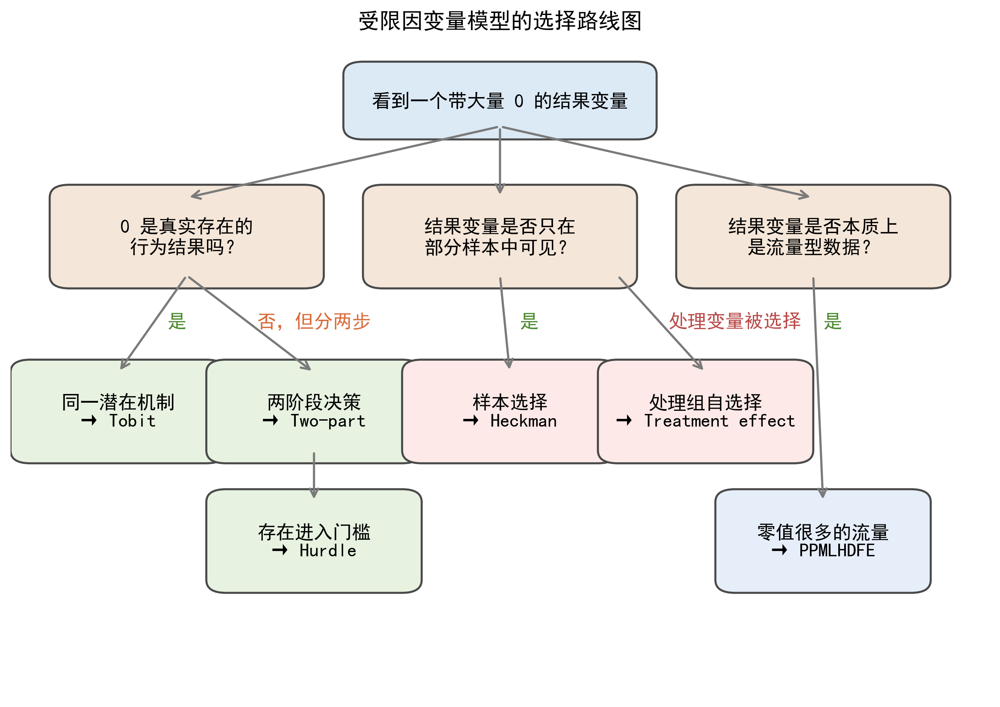
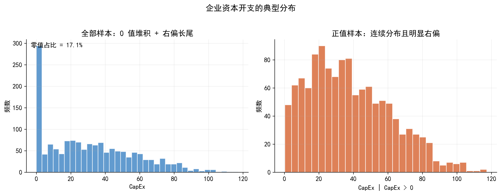
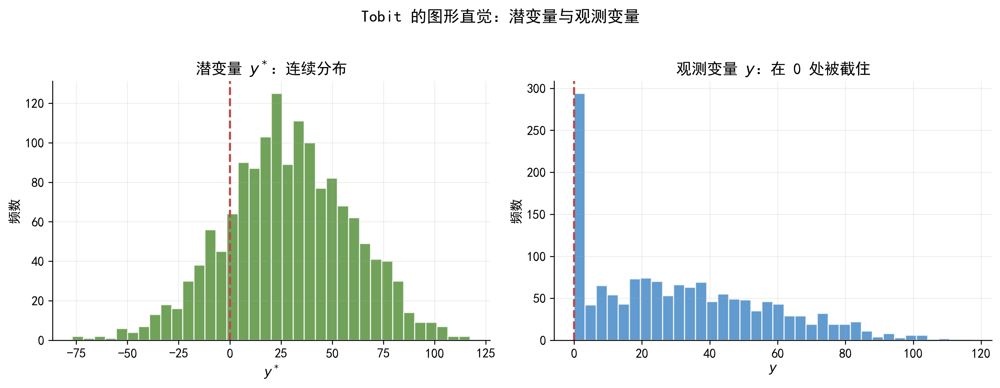
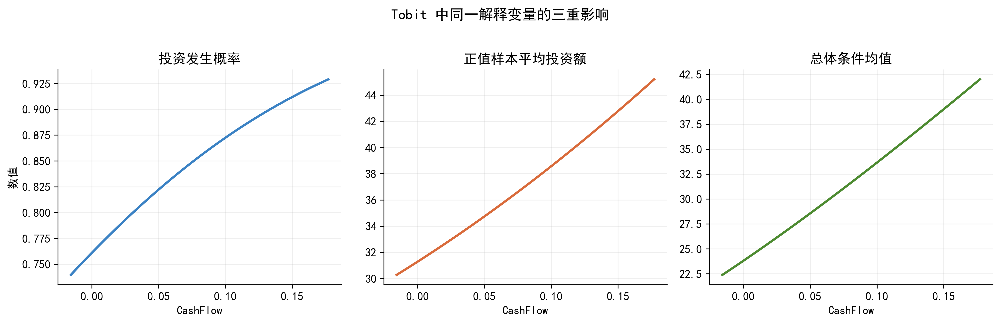
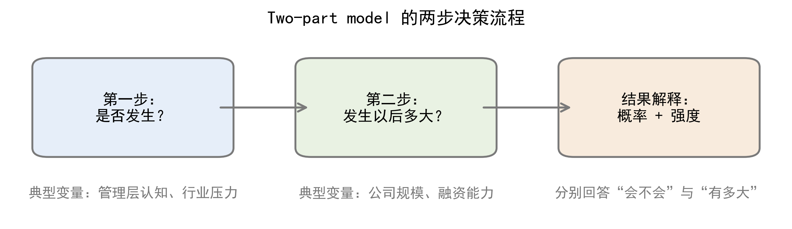
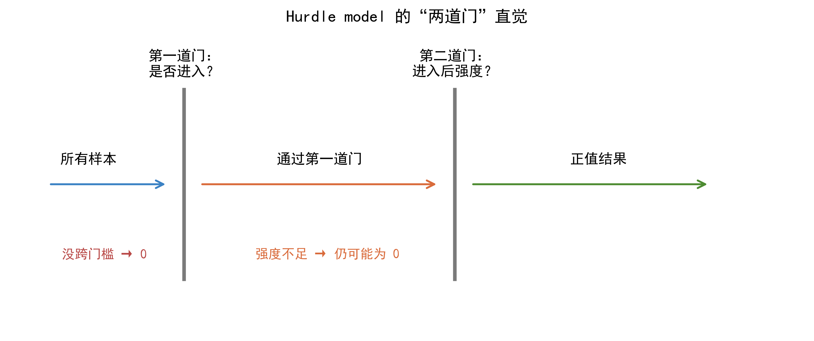
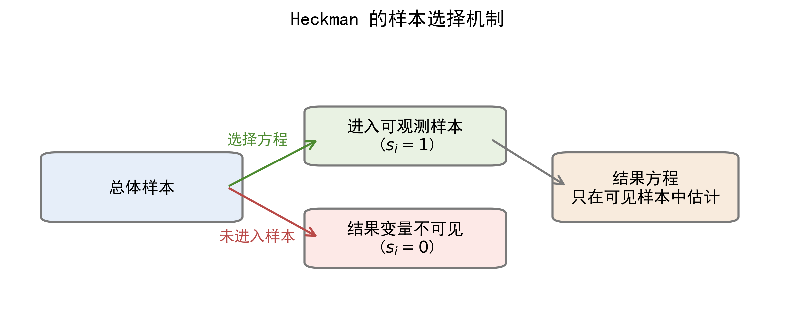
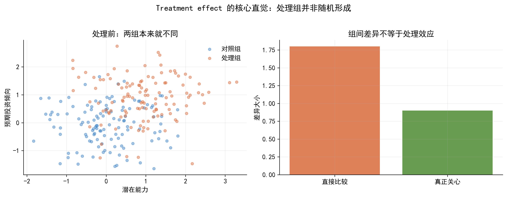
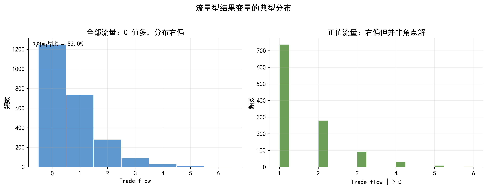
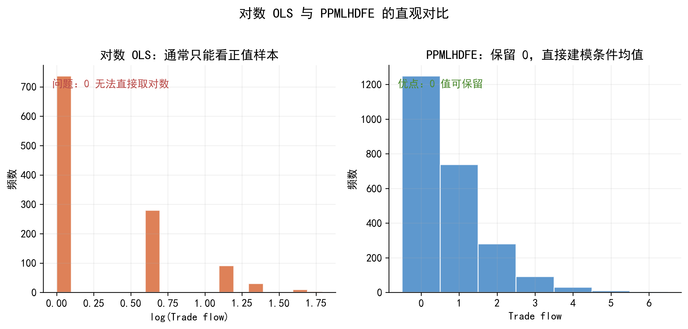

# 受限因变量模型：从零值、样本选择到流量型结果 {#chap-limit-dep-models}

> **本章目标**：建立“数据形态识别 → 模型设定 → 参数解释 → 应用边界”这条完整的分析链条，以上市公司投资行为为贯穿案例，理解 Tobit、Two-part、Hurdle、Heckman、Treatment effect 与 PPMLHDFE 的适用场景、核心结构与结果解释。

---

## 引言：一个公司金融中的常见现象 {#sec-limitdep-intro}

假设你正在研究上市公司的资本开支（capital expenditure, CapEx）。你把几千家企业的年度数据整理出来后，会很快发现一个现象：**很多企业本期投资额等于 0，而少数企业投资额非常大。**

直觉上，这似乎只是“非负变量 + 大量零值”的普通问题；但若进一步分析，就会发现至少有四种完全不同的可能性：

1.  企业确实没有投资，这是真实零值；
2.  企业先决定“投不投”，再决定“投多少”，零值来自第一步没通过；
3.  只有部分企业披露了投资信息，我们根本看不到其他企业的结果变量；
4.  如果研究对象换成企业对外投资流量，那么 0 可能只是“本期没有发生流量”。

同样是 0，背后的经济机制完全不同。也正因为如此，模型选择不能只看变量是否非负，更不能只看零值占比高不高，而要先判断 **数据生成过程（DGP, data generating process）**。

| 变量              | 说明                           | 类型     |
|-------------------|--------------------------------|----------|
| **CapEx**         | 企业年度资本开支，单位：百万元 | 因变量   |
| **CashFlow**      | 内部现金流，衡量内部融资能力   | 连续     |
| **Leverage**      | 资产负债率，衡量债务负担       | 连续     |
| **Growth**        | 销售增长率，反映投资机会       | 连续     |
| **DigitalPolicy** | 是否受到数字化政策激励         | 二元     |
| **Disclosure**    | 是否披露专项投资信息           | 二元     |
| **TradeFlow**     | 企业对某地区的投资或贸易流量   | 非负流量 |

上表中的变量会在本章反复出现。你可以把它们理解为同一组企业在不同研究问题下的不同切面：有时我们关心投资额本身，有时关心是否进入投资状态，有时关心谁的结果变量能被观察到，有时又关心企业之间的投资流量。

::: callout-warning
### 本章要回答的三个问题

-   第一，这个结果变量里的 0 到底代表什么？
-   第二，行为过程是一阶段，还是“先参与、后定量”的两阶段？
-   第三，模型中的系数、概率、边际效应和处理效应分别该如何解释？
:::

### 从线性回归到受限因变量模型 {#sec-limitdep-from-ols}

在线性回归里，我们通常从条件期望函数出发：

$$
E(y_i \mid x_i) = x_i'\beta.
$$

当 $y_i$ 是近似连续、分布平滑、没有明显边界的变量时，这样的设定往往是不错的起点。但当 $y_i$ 只能取非负值、在 0 处大量堆积、只在部分样本上被观察到，或本质上是流量变量时，单纯建模条件期望往往不够。更自然的思路是先判断：

$$
y_i = g(y_i^*),
$$

也就是观测到的结果变量 $y_i$ 是否只是某个潜变量 $y_i^*$ 的不完全表现。这里的 $g(\cdot)$ 可以表示截断、门槛、样本选择或其他观测规则。这个视角是本章各模型的共同出发点。

### 一张路线图：本章几种模型分别处理什么？ {#sec-limitdep-map}

本章的模型可以粗略分成三组：

-   第一组是 Tobit、Two-part 与 Hurdle，它们主要处理 “0 与正值并存” 的角点解或两阶段决策问题；
-   第二组是 Heckman 与 Treatment effect，它们主要处理“选择”问题，只不过一个选择发生在结果变量能否被看到上，另一个选择发生在处理变量是否被分配上；
-   第三组是 PPMLHDFE，它面对的是零值很多的流量型结果变量。

换句话说，本章真正想训练的不是“背模型名”，而是学会从数据形态走向模型出口。

@fig-limitdep-map 建议作为本章第一张总览图。它的作用不是展示技术细节，而是帮助读者先建立一张“模型地图”：真实零值、两阶段决策、样本选择、处理变量自选择和流量型零值，分别会把我们带向哪一类模型。

{#fig-limitdep-map width="100%"}

如果希望再配一张更贴近主案例的图，@fig-limitdep-capex-dist 可以画成企业资本开支在 0 处明显堆积、正值部分右偏且带长尾的分布图。这样学生一眼就能看出：这类变量已经明显偏离了 OLS 最舒服的那类连续型结果变量。

{#fig-limitdep-capex-dist width="88%"}

::: callout-tip
### 提示词：识别受限因变量的数据形态

请根据下面的研究问题，判断结果变量更接近角点解、两阶段决策、样本选择、处理变量自选择，还是零值很多的流量型数据。请先说明每一种可能的经济含义，再推荐模型，并解释为什么普通 OLS 不够用。
:::

---

## Tobit 模型：当是否投资与投资多少由同一潜在机制驱动 {#sec-limitdep-tobit}

Tobit 是理解受限因变量模型最自然的起点。它适合这样一种情形：企业“是否投资”和“投资多少”并不是两个彼此独立的过程，而只是同一个潜在投资意愿在不同区间上的表现。当潜在意愿不足时，我们看到的是 0；当潜在意愿足够强时，我们才观察到正的投资额。

### 一个直观例子：企业的“潜在投资意愿” {#sec-limitdep-tobit-intuition}

可以把每家企业想象成在做一个隐含的成本收益比较。若投资的预期收益足够高，企业就会启动资本开支；若预期收益不够高，企业就选择不投资。这个“预期净收益”通常无法被直接观察，但它可以被理解为一个潜变量。

在这个框架里，零值不再是“奇怪的数据点”，而是一个正常的最优决策结果。也就是说，Tobit 的出发点不是修补 OLS，而是为“零值 + 正连续值”的混合结果变量提供一个统一的行为解释。

### 核心设定公式 {#sec-limitdep-tobit-formula}

经典 Tobit 模型写作：

$$
y_i^* = x_i'\beta + u_i, \qquad u_i \mid x_i \sim N(0,\sigma^2)
$$

$$
y_i = \max(0, y_i^*).
$$

上式也可以表达为更直观的形式：

$$
y_i =
\begin{cases}
0, & \text{当 } y_i^* \leq 0 \\
y_i^*, & \text{当 } y_i^* > 0
\end{cases}
$$

其中：

-   $y_i^*$ 是**潜在结果变量**，这里可以理解为企业的潜在投资意愿或潜在净收益；
-   $y_i$ 是**真正观测到的投资额**；
-   $x_i$ 是解释变量向量，例如现金流、杠杆率、成长性、企业规模；
-   $\beta$ 衡量各解释变量对潜在投资意愿的影响方向和强度；
-   $u_i$ 是不可观测冲击，例如管理者偏好、未观测投资机会；
-   $\sigma$ 是误差项的标准差，反映潜在投资意愿的离散程度。

这个设定有两个关键含义。第一，Tobit 假定零值和正值来自同一个潜在机制。第二，模型并不直接对“是否投资”和“投资金额”分别建模，而是通过一个统一的潜变量同时解释两者。

@fig-tobit-latent-observed 最适合放在这里。左图可以画潜变量 $y_i^*$ 的连续分布，右图画观测变量 $y_i$ 在 0 处被截住后的分布。这样学生会更容易把“潜变量连续变化”和“观测变量在 0 处堆积”这两件事联系起来。

{#fig-tobit-latent-observed width="100%"}

### Tobit 到底在解释什么？ {#sec-limitdep-tobit-interpretation}

Tobit 的结果最容易被误读。因为系数 $\beta_j$ 首先作用在潜变量 $y_i^*$ 上，而不是直接等于观测变量 $y_i$ 的边际效应。一个解释变量的变化，通常会同时影响三个层面：

1.  企业发生投资的概率 $P(y_i>0\mid x_i)$；
2.  已投资企业的平均投资规模 $E(y_i\mid y_i>0, x_i)$；
3.  总体条件均值 $E(y_i\mid x_i)$。

例如，若现金流的系数为正，更准确的解读是：现金流改善会提高潜在投资意愿，从而既提高企业发生投资的概率，也提高已投资企业的资本开支水平。它不是简单的一句“现金流每增加 1 单位，投资额增加多少”。

这里再配一张边际效应示意图会很有帮助。@fig-tobit-effects 可以把同一个解释变量变化后，对投资发生概率、正值样本平均投资额和总体条件均值的影响分成三个面板来展示。这样更容易说明：一个 Tobit 系数并不能直接当作 OLS 系数来解读。

{#fig-tobit-effects width="96%"}

### 为什么 Tobit 有时不够？ {#sec-limitdep-tobit-boundary}

Tobit 的力量来自统一，但它的局限也恰恰来自统一。若现实中的行为过程明显分成两步，例如先决定“进不进入”，再决定“投入多少”，那么把二者压缩到同一个潜变量里，就可能过于粗糙。

同样地，如果零值本身来源复杂，例如一部分企业根本没有资格进入，另一部分企业只是暂时没有进入，那么单一 Tobit 往往无法把这些差异清楚表达出来。此时，更自然的选择就是 Two-part 或 Hurdle。

::: callout-tip
### 提示词：生成 Tobit 模拟数据与图形

请用 Python 生成一个 Tobit 模型的模拟数据集：因变量为非负连续变量，在 0 处有明显堆积；解释变量包括现金流、杠杆率和成长性。请同时画出潜变量与观测变量的关系图，以及总体分布图，并保存为高分辨率 PNG。
:::

---

## Two-part 与 Hurdle：当“做不做”和“做多少”是两步决策 {#sec-limitdep-twopart-hurdle}

Two-part 与 Hurdle 都是在对 Tobit 做放松。它们提醒我们：很多企业行为并不是“一条潜变量自然跨过 0”，而是明显分成两个阶段。先决定是否进入，再决定进入后的强度。只要这一点成立，把问题拆开通常就比单一 Tobit 更符合经济直觉。

### 一个常见场景：数字化投入为什么是两步决策？ {#sec-limitdep-twopart-intuition}

设想一家企业是否推进数字化转型。第一步往往是一个战略决策，受管理层认知、政策压力、行业竞争和组织氛围影响；第二步才是资源配置问题，更多取决于现金流、融资能力和企业规模。很明显，这两步虽然相关，但并不是同一回事。

这也解释了为什么在很多应用研究里，“是否发生”和“发生多少”应该分开讨论。一个模型如果能同时给出这两个问题的答案，往往比单一总系数更有解释力。

### Two-part model 的核心结构 {#sec-limitdep-twopart-formula}

Two-part model 可以写成两部分：

$$
P(y_i>0 \mid z_i) = F(z_i'\gamma)
$$

$$
E(y_i \mid y_i>0, x_i) = h(x_i'\beta).
$$

其中：

-   第一部分的 $F(\cdot)$ 通常是 Logit 或 Probit 链接函数，用来刻画**参与概率**；
-   第二部分的 $h(\cdot)$ 描述正值样本中的**强度方程**，常见设定可以是线性、对数线性或 Gamma 型均值函数；
-   $z_i$ 与 $x_i$ 可以相同，也可以不同；
-   $\gamma$ 衡量变量对“是否参与”的影响；
-   $\beta$ 衡量变量对“参与后强度”的影响。

Two-part 的最大优点，是它允许学生分别回答两个问题：谁更可能参与？参与者中谁投入更多？

如果用一句更课堂化的话来解释，上面这两个式子其实就是：**第一步先问“会不会发生”，第二步再问“发生以后会有多大”。** 例如，在数字化投入的例子中，政策激励和管理层观念可能主要影响第一步，而现金流和融资能力可能主要影响第二步。把这两步拆开后，学生会更容易理解为什么同一个变量在两部分中的作用可以完全不同。

{#fig-twopart-flow width="92%"}

### Hurdle model 的核心结构 {#sec-limitdep-hurdle-formula}

Hurdle model 也分成两步，但它更强调“门槛”这件事。一个简化写法是：

$$
d_i^* = z_i'\gamma + u_i, \qquad d_i = 1(d_i^*>0)
$$

$$
y_i^{**} = x_i'\beta + v_i, \qquad y_i = d_i \cdot \max(0, y_i^{**}).
$$

若写成更容易讲解的分段形式，则可以表示为：

$$
d_i =
\begin{cases}
1, & \text{当 } d_i^* > 0 \\
0, & \text{当 } d_i^* \leq 0
\end{cases}
$$

$$
y_i =
\begin{cases}
0, & \text{当 } d_i = 0 \text{ 或 } y_i^{**} \leq 0 \\
y_i^{**}, & \text{当 } d_i = 1 \text{ 且 } y_i^{**} > 0
\end{cases}
$$

这里：

-   $d_i^*$ 是是否跨过门槛的潜变量；
-   $d_i$ 是是否进入正值状态的指标变量；
-   $y_i^{**}$ 是进入后的潜在强度；
-   $\gamma$ 描述门槛方程；
-   $\beta$ 描述强度方程。

与 Two-part 相比，Hurdle 更强调零值中存在结构性的“不进入”。因此，在创新活动、捐赠行为、某些消费行为中，它往往更有经济学味道。

若配合图形来理解，最直观的方式是把 Hurdle 画成“两道门”。第一道门表示“能不能进入这个行为”；第二道门之后才是“进入以后有多大强度”。这样更容易看出：Hurdle 不是简单地把零值和正值分开，而是在说，有些零值来自第一道门根本没跨过去。

{#fig-hurdle-gates width="92%"}

### Tobit、Two-part 与 Hurdle 的边界 {#sec-limitdep-compare}

三者的差别可以浓缩成一句话：Tobit 认为零值和正值背后基本是同一个潜变量；Two-part 认为“参与”和“强度”是两步决策；Hurdle 则进一步强调进入正值状态前存在一道明确门槛。

在课堂上，真正重要的不是背定义，而是学会反问：我的零值是“暂时没有发生”，还是“根本没过门槛”？如果这个问题能回答清楚，模型选择通常就顺了。

::: callout-tip
### 提示词：为 Two-part 或 Hurdle 选择模型

请根据以下研究场景判断应该优先考虑 Tobit、Two-part 还是 Hurdle。请从零值的经济含义、决策过程是否分阶段、解释变量是否可能在两部分不同这三个角度给出判断理由，并补充 Python 与 Stata 的估计建议。
:::

---

## Heckman 样本选择模型：当结果变量只在部分样本中可见 {#sec-limitdep-heckman}

前面几节的重点仍然是零值。Heckman 讨论的则是另一类更棘手的问题：很多时候我们观察到的不是 $y=0$，而是**压根看不到一部分样本的结果变量**。如果谁能进入样本不是随机的，那么只在可见样本中做回归，就可能产生系统偏误。

### 一个直观例子：只有披露样本才有捐赠金额 {#sec-limitdep-heckman-intuition}

设想你想研究企业捐赠支出的决定因素，但只有披露 CSR 报告的企业才有捐赠金额记录。此时，那些未披露企业的结果变量并不是“捐赠额等于 0”，而是“捐赠额不可见”。

更麻烦的是，是否披露本身往往与企业治理水平、外部压力、声誉需求相关。这意味着进入样本的企业本来就和未进入样本的企业系统不同。结果方程与样本进入机制纠缠在一起，这就是样本选择偏误的直觉来源。

### Heckman 的核心设定公式 {#sec-limitdep-heckman-formula}

Heckman 模型通常写成两个方程：

$$
s_i^* = z_i'\gamma + u_i, \qquad s_i = 1(s_i^*>0)
$$

$$
y_i^* = x_i'\beta + \varepsilon_i, \qquad y_i = y_i^* \text{ if } s_i=1
$$

把它改写成条件语句后，会更容易说明“谁能进入样本”：

$$
s_i =
\begin{cases}
1, & \text{当 } s_i^* > 0 \text{，即样本进入可观测集合} \\
0, & \text{当 } s_i^* \leq 0 \text{，即结果变量不可见}
\end{cases}
$$

$$
y_i =
\begin{cases}
y_i^*, & \text{当 } s_i = 1 \\
.\ , & \text{当 } s_i = 0
\end{cases}
$$

并且假定：

$$
    ext{corr}(u_i, \varepsilon_i) = \rho.
$$

其中：

-   $s_i^*$ 是**进入样本的潜在倾向**；
-   $s_i$ 表示结果变量是否被观察到；
-   $y_i^*$ 是真正关心的潜在结果方程；
-   $z_i$ 是选择方程的解释变量；
-   $x_i$ 是结果方程的解释变量；
-   $\gamma$ 描述谁更可能进入样本；
-   $\beta$ 描述结果变量如何变化；
-   $\rho$ 则衡量样本进入机制与结果方程误差项之间的相关性。

若 $\rho \neq 0$，就意味着进入样本不是中性的，只在可见样本上回归会有偏。

这里的 $\rho$ 可以理解成一个“选择偏误温度计”。如果 $\rho=0$，说明进入样本这件事和结果方程中那些看不见的因素没有系统关系；如果 $\rho$ 明显偏离 0，就说明样本进入机制和结果变量背后的未观测因素是纠缠在一起的，此时简单 OLS 往往会把“谁更容易被看到”误当成“谁的结果更高”。

{#fig-heckman-selection width="96%"}

### 排斥限制为什么关键？ {#sec-limitdep-heckman-exclusion}

Heckman 最难、也最关键的地方，不是命令，而是识别。理想的排斥限制变量应当影响“是否进入样本”，但不应直接影响结果变量本身。比如披露制度、地区信息环境、接触渠道、项目入库资格等，常常更适合作为选择方程变量，而不是结果方程变量。

这也解释了为什么不能把任何“第一阶段显著”的变量都拿来做排斥限制。一个变量若同时直接影响结果方程，就会削弱模型的说服力。对学生而言，真正理解这一点，比会敲 `heckman` 命令更重要。

### Heckman 到底修正了什么？ {#sec-limitdep-heckman-interpretation}

Heckman 的核心不是“补缺失值”，而是修正“进入样本这件事携带的额外信息”。在两步法中，这个信息通常通过逆米尔斯比率进入结果方程。教学上无需展开推导，但要让学生理解：它是在控制样本进入机制带来的系统差异，而不是在做一般意义上的插补。

::: callout-tip
### 提示词：检查 Heckman 的排斥限制变量

下面是一个 Heckman 研究设计。请判断其中哪些变量可以作为排斥限制变量，哪些不合适。请分别从相关性和外生性两个角度说明理由，并指出结果报告时必须补充哪些检验或说明。
:::

---

## Treatment effect 模型：当“是否进入处理组”本身就是选择结果 {#sec-limitdep-treatment}

Heckman 关注的是谁被观察到，Treatment effect 关注的则是谁进入处理组。现实中的很多政策、融资或干预都不是随机分配的。例如，哪些企业获得政府补贴、哪些企业获得外部融资、哪些企业启动数字化改造，往往都带有明显的选择性。

### 一个常见场景：补贴企业为什么本来就不一样？ {#sec-limitdep-treatment-intuition}

若更有成长性、更有资源、更规范的企业更容易获得政策补贴，那么补贴组企业投资更高，本身并不足以说明补贴真的提高了投资。因为即使没有补贴，这些企业也可能本来就比其他企业更愿意投资。

这就是 Treatment effect 与普通回归的分界：我们关心的不再只是“谁更高”，而是“进入处理状态之后，结果变量究竟发生了什么变化”。

### 一个简化的处理效应设定 {#sec-limitdep-treatment-formula}

可把处理选择和结果方程简化写成：

$$
D_i^* = z_i'\pi + v_i, \qquad D_i = 1(D_i^*>0)
$$

$$
y_i = \alpha + \tau D_i + x_i'\beta + \varepsilon_i.
$$

若改成更直观的分段写法，则处理状态可以写成：

$$
D_i =
\begin{cases}
1, & \text{当 } D_i^* > 0 \text{，即企业进入处理组} \\
0, & \text{当 } D_i^* \leq 0 \text{，即企业未进入处理组}
\end{cases}
$$

其中：

-   $D_i^*$ 是进入处理组的潜在倾向；
-   $D_i$ 是实际处理状态，例如是否获得补贴；
-   $\tau$ 是我们最关心的**处理效应参数**；
-   $\pi$ 描述哪些企业更容易进入处理组；
-   $\beta$ 描述其他控制变量对结果变量的影响。

如果 $D_i$ 与 $\varepsilon_i$ 相关，也就是处理组形成带有自选择，那么普通 OLS 对 $\tau$ 的估计就不再能被直接解释为因果效应。

$\tau$ 更适合直接解释成“进入处理状态以后，结果变量平均改变了多少”。这样更不容易把它和普通回归里的“组间均值差异”混为一谈。换句话说，Treatment effect 真正要回答的，不是“补贴企业是不是投得更多”，而是“如果同一家企业获得补贴，它会不会比没获得补贴时投得更多”。

{#fig-treatment-selection width="96%"}

### 它和 Heckman、PSM、IV 的边界 {#sec-limitdep-treatment-boundary}

这类模型与 Heckman 的共通点是都在处理选择问题，但选择发生的位置不同。Heckman 关注的是“谁被看见”，Treatment effect 关注的是“谁进入处理组”。如果研究问题更进一步要求更强的因果识别，后续还可能需要借助 PSM、IV 或其他方法。

::: callout-tip
### 提示词：判断该用 Heckman 还是 Treatment effect

请根据下面的研究问题，判断核心挑战是样本选择、处理变量自选择，还是两者兼有。请说明为什么不能只做普通回归，并给出更合适的模型路线图。
:::

---

## PPMLHDFE：当因变量是流量数据，而且 0 值很多 {#sec-limitdep-ppml}

前面的模型大多围绕“行为是否发生”“结果是否可见”或“处理是否被选择”展开。PPMLHDFE 处理的则是另一类常见情形：结果变量本质上是流量，如贸易流量、投资流量、项目数量、成交量等。这些变量非负、右偏、包含大量 0，但这些 0 通常并不意味着角点解或样本选择。

### 为什么不宜直接对流量变量取对数？ {#sec-limitdep-ppml-why}

面对流量型数据，一个很自然的想法是对因变量取对数再做 OLS。但这条路很快会遇到三个问题：$\log(0)$ 无法定义；删掉 0 会改变样本；异方差会让对数线性 OLS 的解释变得脆弱。因此，“很多 0”在这里并不自动把我们带向 Tobit 或 Heckman，而往往把我们带向 PPMLHDFE。

### PPMLHDFE 的核心设定 {#sec-limitdep-ppml-formula}

PPMLHDFE 的条件均值通常写作：

$$
E(y_i \mid x_i, \alpha_i, \delta_t, \eta_g) = \exp(x_i'\beta + \alpha_i + \delta_t + \eta_g).
$$

其中：

-   $y_i$ 是非负流量变量，例如贸易流或投资流；
-   $x_i$ 是核心解释变量；
-   $\beta$ 描述解释变量对条件均值的影响；
-   $\alpha_i$、$\delta_t$、$\eta_g$ 分别表示个体、时间、行业或地区等**高维固定效应**。

这个公式的关键优点有两个。第一，它允许 $y_i=0$；第二，它可以自然吸收多维固定效应。因此，在企业-地区、企业-年份、行业-年份等场景下，它往往比对数线性 OLS 更稳妥。

从图形直觉看，PPMLHDFE 最适合搭配一张“右偏分布 + 大量零值”的流量变量直方图。图上你会看到，大多数观测值堆在 0 附近，右边拖着一条很长的尾巴。这类变量如果强行取对数，往往会让课堂重点跑偏到“怎么处理 0”上；而 PPMLHDFE 的优点恰恰是让我们保留这些 0，并直接讨论条件均值如何随解释变量变化。

{#fig-flow-distribution width="88%"}

### PPMLHDFE 的系数如何解释？ {#sec-limitdep-ppml-interpretation}

在指数均值函数下，$\beta_j$ 可以近似解释为半弹性：当 $x_{ij}$ 增加 1 个单位时，条件均值大约变化 $100\times\beta_j\%$；若系数较大，则更准确的解释是 $100\times[\exp(\beta_j)-1]\%$。教学上，这一点非常重要，因为它提醒学生：PPMLHDFE 并不是“不能解释”，而是解释对象从水平差异转向了条件均值的比例变化。

更直白地说，PPMLHDFE 的系数通常更像“比例变化”或“百分比变化”的故事，而不是“水平值增加多少”的故事。例如，当某个政策变量的系数为 0.12 时，一个自然的解释就是：在其他条件不变时，这个变量会让平均流量提高大约 12% 左右。

{#fig-ppml-vs-logols width="100%"}

::: callout-tip
### 提示词：为流量型数据选择 PPMLHDFE

请根据下面的贸易流量或投资流量研究问题，说明为什么不宜直接对因变量取对数后做 OLS，并给出使用 PPMLHDFE 的理由、固定效应设定建议，以及结果解释的语言模板。
:::

---

## 总结：如何从数据形态走到模型选择 {#sec-limitdep-summary}

本章真正希望学生带走的，不是六个模型的名称，而是一套顺序化的判断框架。看到一个带有大量 0 或缺失值的结果变量时，不要先问“该用什么命令”，而应先问：这些 0 到底代表什么？结果变量是不是对所有样本都可见？参与与强度是一回事还是两回事？处理组是不是随机形成？结果变量本质上是水平变量还是流量变量？

一旦这些问题被理顺，模型选择就会从“查工具箱”变成“沿着数据生成过程做判断”。

### 一张总表回顾本章模型 {#sec-limitdep-summary-table}

| 模型 | 关键数据特征 | 核心设定 | 主要解释对象 | 典型应用 |
|---------------|---------------|---------------|---------------|---------------|
| Tobit | 0 与正连续值并存 | $y=\max(0,y^*)$ | 概率、强度、总体均值 | 投资额、支出 |
| Two-part | 先参与后定量 | 两个方程分开建模 | 参与概率与正值条件均值 | 数字化投入 |
| Hurdle | 存在进入门槛 | 门槛方程 + 强度方程 | 跨门槛概率与强度 | 创新活动 |
| Heckman | 结果变量部分不可见 | 选择方程 + 结果方程 | 样本选择修正后的结果方程 | 捐赠披露 |
| Treatment effect | 处理状态非随机 | 处理选择 + 结果方程 | 处理效应 | 补贴、融资 |
| PPMLHDFE | 流量变量，0 多且右偏 | 指数条件均值 + 高维固定效应 | 条件均值的比例变化 | 贸易流、投资流 |

: 本章模型选择总表 {#tbl-limitdep-summary}

### 一个实务判断清单 {#sec-limitdep-checklist}

1.  零值是真实行为结果，还是记录规则或样本缺失的表现？
2.  所有样本都能观察到结果变量吗？
3.  参与和强度是否由不同机制驱动？
4.  处理状态是否由非随机过程形成？
5.  因变量本质上是水平变量，还是流量变量？

若这五个问题回答清楚，模型选择通常就不会偏得太远。

### 本章后的延伸方向 {#sec-limitdep-next}

前面章节已经介绍过二元选择模型与极大似然的基础思想。本章进一步处理了若干常见的受限因变量与选择问题。后续章节中，你还会继续接触更系统的因果识别工具、更复杂的固定效应处理，以及更广义的非线性模型。到那时，再回头看本章，会更容易理解为什么“先识别数据形态”比“先背命令”更重要。