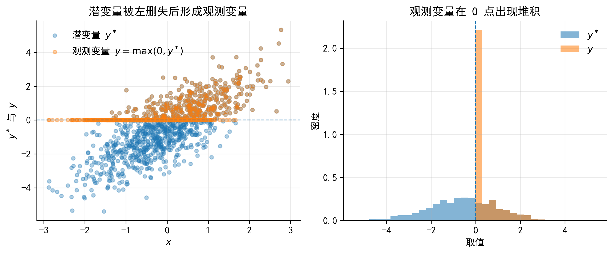
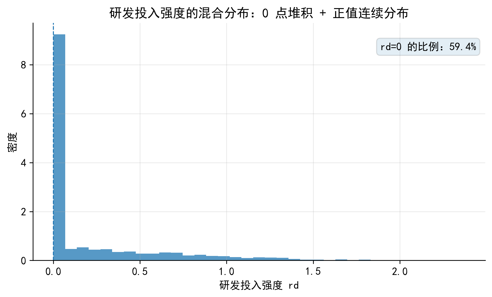
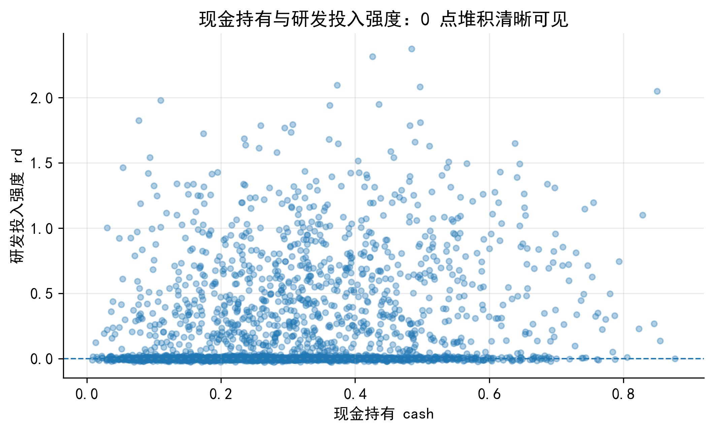
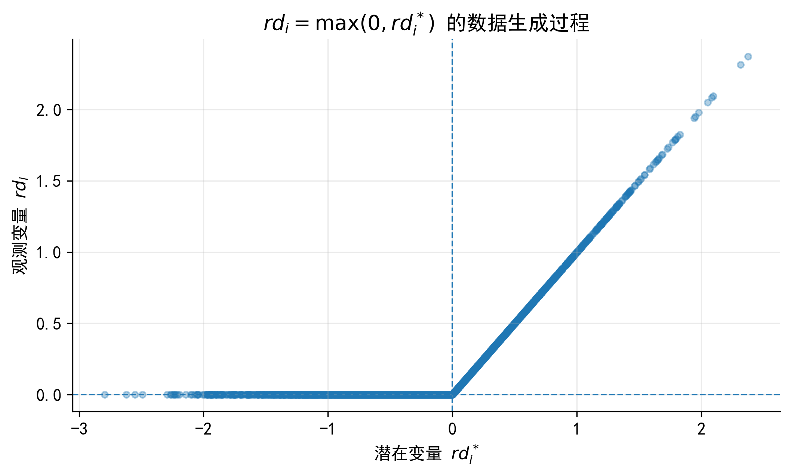
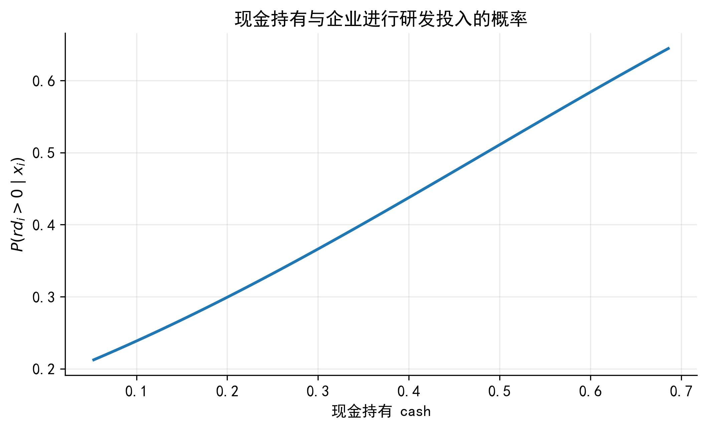
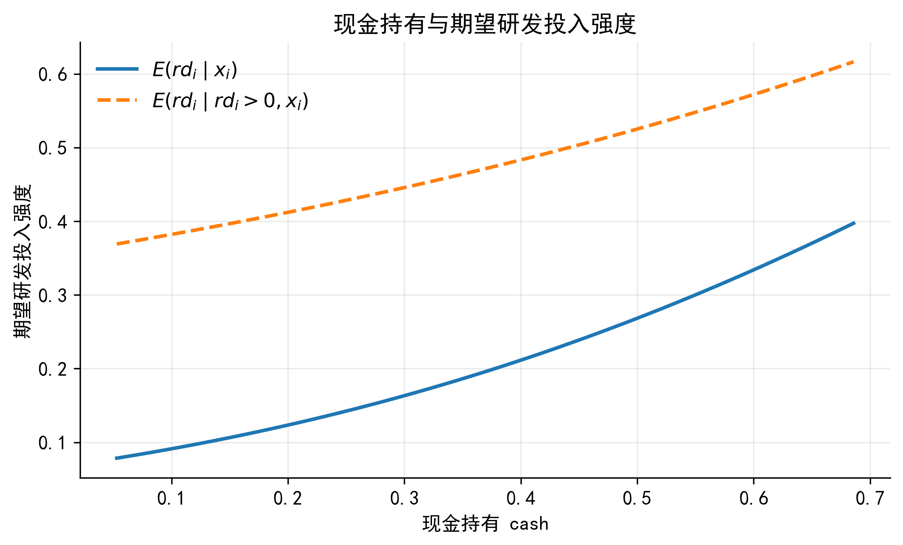
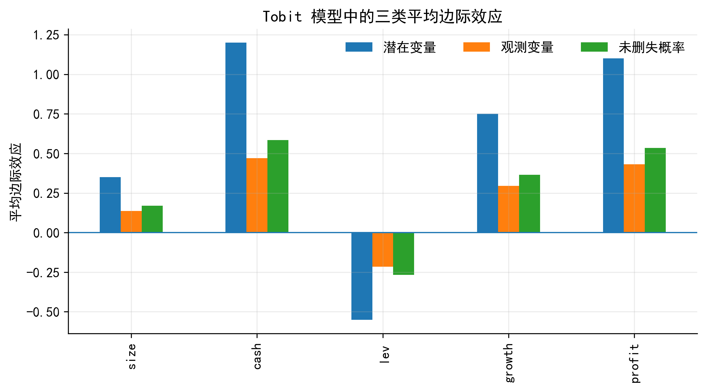

<!-- _class: title -->

# Tobit 模型

<div class="subtitle">受限因变量、潜变量与边际效应</div>

<div class="small">金融数据分析与建模</div>

---

## 本章主线

- 为什么大量 0 或边界值会让 OLS 出问题
- 如何从潜变量角度理解 Tobit 的 DGP
- Tobit 如何同时利用“是否被删失”和“正值大小”两类信息
- Tobit 系数与边际效应如何解释
- 企业研发投入强度案例：从模型设定到结果解释

---

## 金融数据中的受限结果变量

在企业和金融数据中，很多变量存在明显边界：

- 企业研发投入强度
- 环保投资、慈善捐赠、政府补贴
- 家庭股票投资额
- 贷款金额、保险赔付、交易金额

<div class="important">
关键不在于变量是否有很多 0，而在于这些 0 的经济含义是什么。
</div>

---

## OLS 的直觉问题

设潜在变量模型为：

<div class="formula">

$$
y_i^* = x_i'\beta + u_i,\quad u_i\sim N(0,\sigma^2)
$$

</div>

实际观测到的是：

<div class="formula">

$$
y_i=\max(0,y_i^*)
$$

</div>

---

## `max()` 的分段写法

为便于理解，$y_i=\max(0,y_i^*)$ 也可以写成：

<div class="formula">

$$
y_i =
\begin{cases}
0, & y_i^* \leq 0 \\
y_i^*, & y_i^* > 0
\end{cases}
$$

</div>

- 当 $y_i^*\leq 0$ 时，只能观察到 $y_i=0$
- 当 $y_i^*>0$ 时，才能观察到完整的连续取值
- $y_i=0$ 不是普通的连续观测值

---

## 潜变量与观测变量

<div class="imgbox">



</div>

---

## 从潜在净收益理解 Tobit

以企业研发投入为例，企业是否投入研发取决于潜在净收益：

<div class="formula">

$$
NetU_i = MR_i - MC_i
$$

$$
rd_i^* = NetU_i = x_i'\beta + u_i
$$

</div>

- $MR_i$：研发投入的预期边际收益
- $MC_i$：研发投入的边际成本
- $rd_i^*$：潜在研发投入净收益或潜在投入强度

---

## Tobit 的 DGP

<div class="formula">

$$
rd_i =
\begin{cases}
0, & rd_i^* \leq 0 \\
rd_i^*, & rd_i^* > 0
\end{cases}
$$

</div>

可以概括为：

<div class="formula">

$$
x_i \rightarrow rd_i^* \rightarrow rd_i
$$

</div>

解释变量先影响潜在变量 $rd_i^*$，删失机制再把 $rd_i^*$ 转化为观测变量 $rd_i$。

---

## 概念辨析：Tobit 不是“有 0 就用”

<div class="note">
Tobit 适合的情形是：存在一个潜在连续变量 $y_i^*$，但由于下限或上限约束，只能观察到被删失后的 $y_i$。
</div>

如果 $y_i=0$ 本身是企业主动选择的结果，而不是潜在变量被压到边界后的观测值，Two-part model 或 Hurdle model 往往更自然。

---

## 标准左删失 Tobit

<div class="formula">

$$
y_i^* = x_i'\beta + u_i,\quad u_i\mid x_i\sim N(0,\sigma^2)
$$

$$
y_i =
\begin{cases}
0, & y_i^* \leq 0 \\
y_i^*, & y_i^* > 0
\end{cases}
$$

</div>

Tobit 不是把 $y_i=0$ 的样本删掉，而是把它们作为“被删失样本”纳入似然函数。

---

## 删失、截断、样本选择

| 情形 | 样本是否在数据中 | 结果变量是否可观测 | 典型模型 |
|---|---:|---:|---|
| 删失 | 是 | 被压到边界 | Tobit |
| 截断 | 否 | 不进入样本 | Truncated regression |
| 样本选择 | 是或否 | 只在选择后观测 | Heckman selection |

<div class="important">
判断模型前，应先判断数据生成机制，而不是只看因变量是否有 0。
</div>

---

## 似然函数的直觉

Tobit 同时利用两类信息：

- $y_i=0$：说明 $y_i^*\leq 0$
- $y_i>0$：既知道未被删失，也知道连续取值大小

因此，样本的似然贡献分为两部分：

<div class="formula">

$$
P(y_i=0\mid x_i),\quad f(y_i\mid x_i,y_i>0)
$$

</div>

---

## 被删失样本的概率贡献

当 $y_i=0$ 时：

<div class="formula">

$$
P(y_i=0\mid x_i)
= P(y_i^*\leq 0\mid x_i)
$$

$$
= P(x_i'\beta+u_i\leq 0\mid x_i)
= P(u_i\leq -x_i'\beta\mid x_i)
$$

$$
= \Phi\left(-\frac{x_i'\beta}{\sigma}\right)
$$

</div>

这里 $\Phi(\cdot)$ 是标准正态分布函数。

---

## 未删失样本的密度贡献

当 $y_i>0$ 时，观察到 $y_i=y_i^*$。由于：

<div class="formula">

$$
y_i^*\mid x_i \sim N(x_i'\beta,\sigma^2)
$$

</div>

所以：

<div class="formula">

$$
f(y_i\mid x_i)
=
\frac{1}{\sigma}
\phi\left(\frac{y_i-x_i'\beta}{\sigma}\right)
$$

</div>

---

## Tobit 的对数似然

<div class="formula">

$$
\ell(\beta,\sigma)
=
\sum_{y_i=0}
\log\Phi\left(-\frac{x_i'\beta}{\sigma}\right)
+
\sum_{y_i>0}
\left[
-\log\sigma+
\log\phi\left(\frac{y_i-x_i'\beta}{\sigma}\right)
\right]
$$

</div>

第一部分来自“被删失概率”，第二部分来自“未删失样本的连续密度”。

---

## Python 中的直接估计路径

| 路径 | 定位 | 使用建议 |
|---|---|---|
| `py4etrics` | Tobit / Truncated / Heckit | 公式接口，适合应用 |
| `tobit-reg` | Type I Tobit | 可作为备选 |
| `PyMC` | 贝叶斯删失模型 | 复杂设定 |
| 自定义 MLE | 可控、透明 | 适合教学和核对 |

<div class="important">
Python 中没有像 Stata `tobit` 那样统一、稳定、广泛使用的官方主命令。
</div>

---

## Python 示例：估计接口思路

```python
# 如果安装了 py4etrics，可尝试公式接口
# pip install py4etrics

from py4etrics.tobit import Tobit

model = Tobit.from_formula(
    "rd ~ size + cash + lev + growth + profit",
    data=df,
    left=0
)
res = model.fit()
print(res.summary())
```

若本地包不可用，可以使用讲义中封装的 `fit_tobit()` 作为兜底方案。

---

## Stata 示例：基础 Tobit

```stata
* 左删失 Tobit，删失点为 0
tobit rd size cash lev growth profit, ll(0) vce(robust)

* 平均边际效应：对观测结果 E(y|x) 的影响
margins, dydx(*) predict(ystar(0,.))

* 未删失概率的边际效应
margins, dydx(*) predict(pr(0,.))
```

Stata 的 `tobit` 命令仍然是估计和核对 Tobit 结果的稳健选择。

---

## Tobit 系数首先解释潜在变量

Tobit 回归表中的 $\beta_j$ 对应的是：

<div class="formula">

$$
\frac{\partial E(y_i^*\mid x_i)}{\partial x_{ij}}
= \beta_j
$$

</div>

它解释的是 $x_{ij}$ 对潜在变量 $y_i^*$ 的影响，而不是直接对观测变量 $y_i$ 的影响。

---

## 边际效应一：对潜在变量的影响

<div class="formula">

$$
ME_j^{latent}
=
\frac{\partial E(y_i^*\mid x_i)}{\partial x_{ij}}
=
\beta_j
$$

</div>

适合回答的问题：

- 企业规模是否提高潜在研发投入动机
- 现金持有是否提高企业潜在投入能力
- 某个变量是否改变企业“想投入”的程度

---

## 边际效应二：对观测变量的影响

观测变量的条件期望为：

<div class="formula">

$$
E(y_i\mid x_i)=\Phi(z_i)x_i'\beta+\sigma\phi(z_i),
\quad z_i=\frac{x_i'\beta}{\sigma}
$$

</div>

对应边际效应：

<div class="formula">

$$
ME_j^{observed}
=
\frac{\partial E(y_i\mid x_i)}{\partial x_{ij}}
=
\Phi(z_i)\beta_j
$$

</div>

---

## 观测变量边际效应的含义

$ME_j^{observed}$ 同时包含两部分影响：

- 让企业从 $y_i=0$ 变成 $y_i>0$ 的概率变化
- 对已经越过边界的样本，其正值大小的变化

<div class="tip">
如果论文关心“实际观测到的因变量平均变化”，通常应重点报告这一类平均边际效应。
</div>

---

## 边际效应三：对未删失概率的影响

未删失概率为：

<div class="formula">

$$
P(y_i>0\mid x_i)=\Phi(z_i)
$$

</div>

对应边际效应：

<div class="formula">

$$
ME_j^{prob}
=
\frac{\partial P(y_i>0\mid x_i)}{\partial x_{ij}}
=
\phi(z_i)\frac{\beta_j}{\sigma}
$$

</div>

适合解释“是否跨过边界”。

---

## 正值样本条件期望

还可以关注：

<div class="formula">

$$
E(y_i\mid y_i>0,x_i)
=
x_i'\beta+
\sigma\lambda(z_i)
$$

$$
\lambda(z_i)=\frac{\phi(z_i)}{\Phi(z_i)}
$$

</div>

它回答的是：在已经越过边界的样本中，正值结果的条件均值如何变化。

---

## 实证中重点报告什么

| 研究问题 | 建议报告 |
|---|---|
| 潜在机制或理论变量 | $\beta_j$ |
| 实际观测结果的平均影响 | $ME_j^{observed}$ |
| 是否超过边界 | $ME_j^{prob}$ |
| 正值样本内部强度 | $E(y_i\mid y_i>0,x_i)$ 的边际效应 |

<div class="important">
不要只报告 Tobit 系数后，直接解释为对观测变量的影响。
</div>

---

## Tobit、OLS 与 Probit

| 模型 | 如何处理 $y_i=0$ | 适合回答的问题 |
|---|---|---|
| OLS | 当作普通连续值 | 平均线性关系 |
| Probit | 归并为 0/1 类别 | 是否为正 |
| Tobit | 潜变量被删失后的观测 | 是否为正 + 正值大小 |

如果只关心 $P(y_i>0\mid x_i)$，Probit 可能已经足够；如果还关心正值部分大小，才需要 Tobit 或 Two-part model。

---

## 何时适合 Tobit

- 存在潜在连续变量 $y_i^*$
- 因变量在下限或上限处被删失
- 同一套变量同时影响“是否超过删失点”和“超过后的取值大小”
- 正值部分基本符合正态误差和同方差假设
- 研究者关心潜在过程与观测结果之间的关系

---

## 何时不宜直接用 Tobit

- 0 值是企业主动选择，而不是删失
- 参与决策和投入强度由不同机制决定
- 正值部分高度偏态
- 因变量是计数变量
- 数据中存在大量结构性 0
- 异方差严重
- 样本进入数据本身存在选择偏误

---

## Tobit 的替代模型

| 研究问题 | 更合适的模型 |
|---|---|
| 是否参与和参与强度是两个过程 | Two-part model |
| 先跨过门槛，再决定正值大小 | Hurdle model |
| 因变量是比例，位于 $[0,1]$ | Fractional response model |
| 因变量是计数 | Poisson / PPML |
| 样本进入数据存在选择 | Heckman selection |
| 样本被截断而不是删失 | Truncated regression |

---

## 案例：企业研发投入强度

研究问题：企业规模、现金持有、负债率、成长性和盈利能力如何影响研发投入强度？

<div class="formula">

$$
rd_i^*=
\beta_0+
\beta_1 size_i+
\beta_2 cash_i+
\beta_3 lev_i+
\beta_4 growth_i+
\beta_5 profit_i+u_i
$$

$$
rd_i=\max(0,rd_i^*)
$$

</div>

---

## 研发投入强度分布

<div class="imgbox">



</div>

---

## 删失点附近的数据特征

<div class="imgbox">



</div>

---

## 潜在研发强度与观测研发强度

<div class="imgbox">



</div>

---

## 案例中的模型比较

建议依次估计：

- OLS：忽略删失机制的基准模型
- Tobit (1)：只包含核心变量
- Tobit (2)：加入财务控制变量
- Tobit (3)：加入更完整的控制变量

<div class="important">
OLS 在这里不是最终模型，而是用于说明忽略删失机制会如何影响结果解释。
</div>

---

## Python 输出回归表的思路

```python
# OLS 与 Tobit 结果可能来自不同对象
# 用 pandas 统一整理更稳妥

result_table = pd.DataFrame({
    "OLS": ols_coef,
    "Tobit (1)": tobit1_coef,
    "Tobit (2)": tobit2_coef,
    "Tobit (3)": tobit3_coef,
})

result_table.round(3)
```

若只处理标准模型，可考虑 `summary_col`、`pystout` 或 `pyfixest.etable()`。

---

## Stata 输出回归表

```stata
* OLS 基准模型
reg rd size cash lev growth profit, vce(robust)
estimates store OLS

* Tobit 模型
tobit rd size cash lev growth profit, ll(0) vce(robust)
estimates store Tobit

* 输出回归表
esttab OLS Tobit, ///
    b(%9.3f) se(%9.3f) ///
    star(* 0.10 ** 0.05 *** 0.01) ///
    stats(N, labels("Observations")) ///
    compress
```

---

## 现金持有与未删失概率

<div class="imgbox">



</div>

---

## 现金持有与期望研发投入强度

<div class="imgbox">



</div>

---

## 平均边际效应对比

<div class="imgbox">



</div>

---

## 案例小结

- OLS 会把边界值当作普通连续值，容易混淆删失机制下的关系
- Tobit 更适合描述潜在投入强度被下限删失的数据生成过程
- `size` 和 `cash` 的影响既可能体现在研发投入概率上，也可能体现在实际投入强度上
- 结果解释应同时报告 Tobit 系数和平均边际效应

---

## 附录：手写 MLE 的作用

手写 MLE 不一定是实际应用的首选方式，但有助于理解：

- $y_i=0$ 的样本提供的是概率信息
- $y_i>0$ 的样本提供的是连续密度信息
- Tobit 并没有丢掉 0 值样本
- Tobit 也没有把 0 值样本当成普通连续观测

---

## 课堂小结

- Tobit 适用于潜在连续变量被删失的情形
- 关键是解释 $y_i=0$ 或边界值的经济含义
- Tobit 系数首先对应潜变量 $y_i^*$
- 实证论文通常应重点报告平均边际效应
- 如果 0 是真实选择、样本截断或选择进入，应考虑替代模型

---

## 参考文献

- Tobin, J. (1958). Estimation of relationships for limited dependent variables. *Econometrica*, 26(1), 24–36. DOI: 10.2307/1907382.
- Amemiya, T. (1984). Tobit models: A survey. *Journal of Econometrics*, 24(1–2), 3–61. DOI: 10.1016/0304-4076(84)90074-5.
- McDonald, J. F., & Moffitt, R. A. (1980). The uses of Tobit analysis. *The Review of Economics and Statistics*, 62(2), 318–321. DOI: 10.2307/1924766.
- Cragg, J. G. (1971). Some statistical models for limited dependent variables. *Econometrica*, 39(5), 829–844. DOI: 10.2307/1909582.
