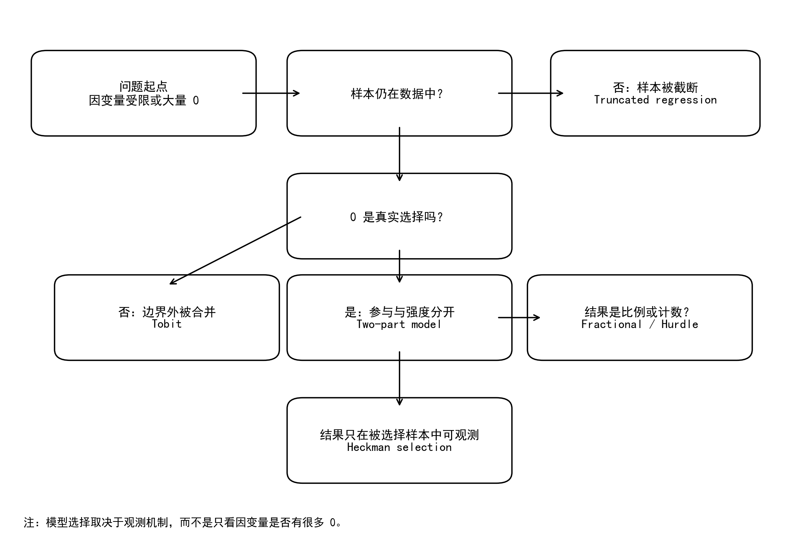
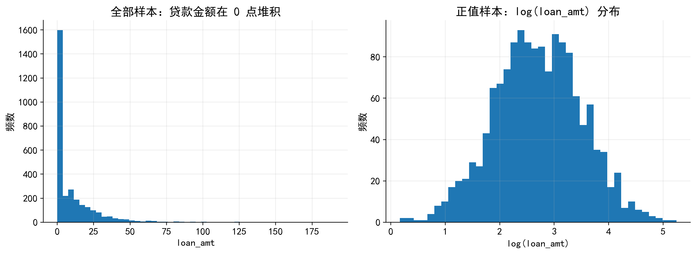
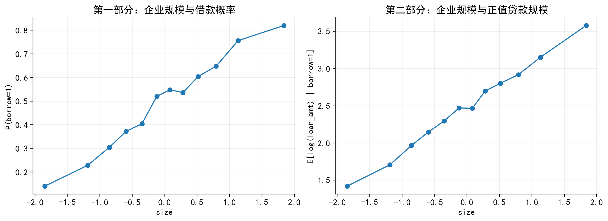
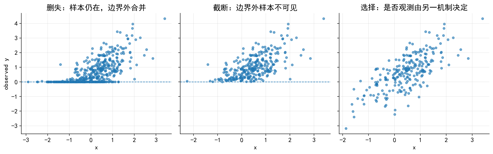
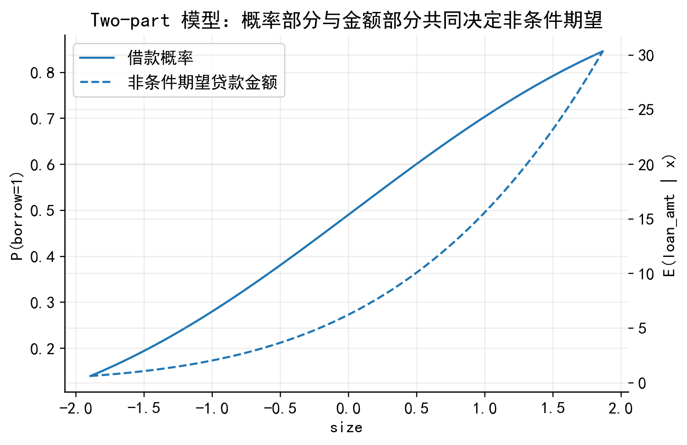
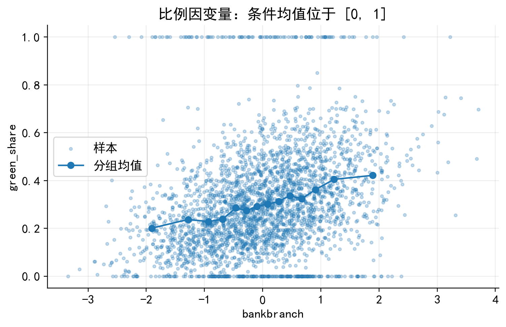

<style>
section {
  font-family: "Microsoft YaHei", "SimHei", "Noto Sans CJK SC", Arial, sans-serif;
  font-size: 24pt;
  line-height: 1.35;
  padding: 46px 58px;
}
h1 {
  color: #111827;
  font-size: 44pt;
  line-height: 1.18;
}
h2 {
  color: #136f63;
  font-size: 34pt;
  margin-bottom: 18px;
}
h3 {
  color: #1f3a8a;
  font-size: 26pt;
}
strong {
  color: #7c2d12;
}
blockquote {
  border-left: 8px solid #136f63;
  color: #374151;
  padding-left: 18px;
}
.small {
  font-size: 18pt;
}
.tiny {
  font-size: 14pt;
}
.center {
  text-align: center;
}
.cols {
  display: grid;
  grid-template-columns: 1fr 1fr;
  gap: 30px;
  align-items: start;
}
.cols-45-55 {
  display: grid;
  grid-template-columns: 0.45fr 0.55fr;
  gap: 30px;
  align-items: center;
}
.cols-55-45 {
  display: grid;
  grid-template-columns: 0.55fr 0.45fr;
  gap: 30px;
  align-items: center;
}
.note {
  background: #f0fdf4;
  border-left: 8px solid #16a34a;
  padding: 14px 18px;
  border-radius: 8px;
}
.warn {
  background: #fff7ed;
  border-left: 8px solid #ea580c;
  padding: 14px 18px;
  border-radius: 8px;
}
.tip {
  background: #eff6ff;
  border-left: 8px solid #2563eb;
  padding: 14px 18px;
  border-radius: 8px;
}
table {
  font-size: 18pt;
}
code {
  font-family: Consolas, "Courier New", monospace;
}
pre {
  font-size: 16pt;
  line-height: 1.25;
}
</style>

# 05 Tobit 之后：截断、两部模型与比例因变量

金融数据分析与建模

> 关键问题：当 Tobit 不是最合适选择时，如何根据数据生成机制选择替代模型？

---

## 本章要解决的问题

Tobit 模型适合处理 **潜在连续变量被删失** 的情形。

但在公司金融和金融市场数据中，很多变量虽然有大量 0 或边界值，其机制并不一定是删失。

本章重点讨论三类替代模型：

- **Truncated regression**：样本被截断，部分样本根本没有进入数据；
- **Two-part model**：是否发生和发生多少由两个过程决定；
- **Fractional response model**：因变量是位于 $[0,1]$ 的比例变量。

---

## 先看模型地图



---

## 选择模型时，先问五个问题

- 样本是否全部进入数据？
- 因变量是否被完整观测？
- 0 是真实经济选择，还是边界外取值被合并后的结果？
- 是否参与和参与后的强度是否由同一机制决定？
- 结果变量是连续变量、比例变量，还是计数变量？

<div class="warn">

**不要把“很多 0”自动等同于 Tobit。**

Tobit 的核心不是“有很多 0”，而是“潜在连续变量在某个边界处被删失”。

</div>

---

## 主案例：企业银行贷款金额

考虑一个公司金融问题：

> 哪些企业能够获得银行贷款？在获得贷款后，企业的贷款金额由哪些因素决定？

设企业 $i$ 的贷款金额为 $loan_i$。数据中经常看到：

$$
loan_i=0
$$

但这个 0 至少可能来自两种机制：

- **删失机制**：潜在贷款需求 $loan_i^*$ 小于等于 0，被记录为 0；
- **两阶段机制**：企业没有借款，或没有通过银行审批，因此真实贷款金额就是 0。

---

## 为什么贷款金额案例通常不是 Tobit？

<div class="cols">

<div>

### Tobit 的想法

$$
loan_i^*=x_i'\beta+u_i
$$

$$
loan_i =
\begin{cases}
0, & loan_i^*\leq 0\\
loan_i^*, & loan_i^*>0
\end{cases}
$$

0 是潜在连续变量被压到边界后的记录值。

</div>

<div>

### Two-part 的想法

$$
borrow_i =
\begin{cases}
1, & \text{obtains a bank loan}\\
0, & \text{otherwise}
\end{cases}
$$

$$
loan_i =
\begin{cases}
0, & borrow_i=0\\
loan_i^+, & borrow_i=1
\end{cases}
$$

0 是企业没有进入正值金额阶段的真实结果。

</div>

</div>

---

## 金融直觉：是否借款与借款多少不是一回事

<div class="cols">

<div>

**第一阶段：是否借款**

- 银行审批
- 抵押品
- 银企关系
- 地区银行网点密度
- 政策性金融服务窗口

</div>

<div>

**第二阶段：借款多少**

- 企业资金需求
- 投资项目规模
- 资产负债表约束
- 银行授信额度
- 抵押品价值

</div>

</div>

<div class="note">

Two-part model 的优势在于：允许这两个阶段由不同机制、不同解释变量决定。

</div>

---

## Two-part 数据生成过程

第一部分是是否借款：

$$
borrow_i^* = z_i'\gamma + v_i
$$

$$
borrow_i =
\begin{cases}
1, & borrow_i^*>0\\
0, & borrow_i^*\leq 0
\end{cases}
$$

第二部分是在借款企业中的贷款金额：

$$
\log(loan_i)=x_i'\beta+u_i,\quad borrow_i=1
$$

最终观测到：

$$
loan_i =
\begin{cases}
0, & borrow_i=0\\
\exp(x_i'\beta+u_i), & borrow_i=1
\end{cases}
$$

---

## 贷款金额的分布特征



<div class="tip">

图形中的 0 不应被机械理解为“被删失到 0”。在贷款场景中，它更可能表示企业没有获得贷款或没有借款。

</div>

---

## Two-part 机制图



---

## Truncated regression：样本被截断

截断 (truncation) 和删失 (censoring) 容易混淆，但二者的观测机制不同。

- **删失**：边界外样本仍在数据中，只是因变量被记录为边界值；
- **截断**：边界外样本根本没有进入数据。

设潜在结果变量为：

$$
y_i^*=x_i'\beta+u_i,\quad u_i\sim N(0,\sigma^2)
$$

如果只有 $y_i^*>c$ 的样本进入数据，则：

$$
y_i=y_i^*\quad \text{only if } y_i^*>c
$$

---

## 删失、截断与选择：观测机制不同



---

## 截断回归的似然函数

当样本只包含 $y_i>c$ 的观测时，正确的条件密度是截断正态分布：

$$
f(y_i\mid y_i>c,x_i)
=
\frac{
\frac{1}{\sigma}
\phi\left(
\frac{y_i-x_i'\beta}{\sigma}
\right)
}{
1-\Phi\left(
\frac{c-x_i'\beta}{\sigma}
\right)
}
,\quad y_i>c
$$

<div class="warn">

只保留 $y_i>0$ 的样本做 OLS，并不等于截断回归。截断回归需要显式使用 $y_i>c$ 这一进入样本条件修正条件密度。

</div>

---

## Stata：截断回归示例

```stata
*------------------------------------------------------------
* 读取模拟数据
*------------------------------------------------------------
import delimited "./data/limitdep_alt_sim.csv", clear

*------------------------------------------------------------
* 截断回归示例：
* contract_observed 只有在超过报告门槛时才可观测
* ll(1.25) 表示左截断点为 1.25
*------------------------------------------------------------
truncreg contract_observed size lev collateral, ///
    ll(1.25) vce(robust)

margins, dydx(size lev collateral)
```

---

## Two-part model：模型设定

Two-part model 将结果变量的生成过程拆成两个部分。

第一部分解释是否为正：

$$
P(loan_i>0\mid z_i)=F(z_i'\gamma)
$$

第二部分解释正值样本中的结果大小：

$$
E(loan_i\mid loan_i>0,x_i)=g(x_i'\beta)
$$

如果正值贷款金额明显右偏，常见做法是：

$$
\log(loan_i)=x_i'\beta+u_i,\quad loan_i>0
$$

---

## Two-part model：非条件期望

Two-part model 的核心是把两个部分合并为非条件期望：

$$
E(loan_i\mid x_i,z_i)
=
P(loan_i>0\mid z_i)
\times
E(loan_i\mid loan_i>0,x_i)
$$

这意味着，一个变量对全样本贷款金额的影响可能来自两个渠道：

- 提高企业进入正值贷款金额状态的概率；
- 改变已经借款企业的贷款规模。

---

## Two-part model 不等于 Heckman

<div class="cols">

<div>

### Two-part model

- 0 是真实结果；
- 第一部分解释是否为正；
- 第二部分解释正值大小；
- 适合贷款金额、捐赠金额、研发支出等。

</div>

<div>

### Heckman selection

- 未被选择样本的结果变量不可观测；
- 选择方程决定结果变量是否被观察到；
- 适合贷款利率、工资、分析师预测误差等。

</div>

</div>

<div class="note">

贷款金额为 0 可以合理记录为 0；但未借款企业没有贷款利率，不能把贷款利率记录为 0。

</div>

---

## Stata：手动估计 Two-part model

```stata
*------------------------------------------------------------
* 第一部分：是否取得银行贷款
*------------------------------------------------------------
probit borrow size cash lev profit collateral ///
    bankbranch policy_window, vce(robust)

margins, dydx(size cash lev profit collateral ///
    bankbranch policy_window)

predict phat_borrow, pr

*------------------------------------------------------------
* 第二部分：正值贷款金额
*------------------------------------------------------------
regress ln_loan_amt size cash lev profit collateral ///
    bankbranch if borrow == 1, vce(robust)

predict xb_ln_amt if e(sample), xb
```

---

## Stata：使用 twopm 命令

```stata
*------------------------------------------------------------
* 安装用户命令
*------------------------------------------------------------
ssc install twopm, replace

*------------------------------------------------------------
* Two-part model：
* 第一部分 Probit，第二部分 Gamma GLM + log link
*------------------------------------------------------------
twopm loan_amt size cash lev profit collateral bankbranch, ///
    firstpart(probit) ///
    secondpart(glm, family(gamma) link(log)) ///
    vce(robust)

margins, dydx(size cash lev profit collateral bankbranch)
```

<div class="tip">

`twopm` 语法紧凑，便于计算整体边际效应。但教学中建议先手动估计两部分，帮助学生理解每一部分的含义。

</div>

---

## Two-part 模型结果如何解释？

- `OLS 全样本` 把 0 和正值贷款金额混在一个线性模型中，容易掩盖机制差异；
- `Probit 借款` 解释的是企业进入正值贷款金额状态的概率；
- `Log OLS 正值` 解释的是借款企业内部的贷款规模；
- 非条件影响需要把两部分合并起来解释。

<div class="note">

一个变量既可能提高借款概率，也可能影响正值贷款金额。只看第二部分，容易低估它对全样本贷款金额的影响。

</div>

---

## Two-part 非条件预测



<div class="tip">

该图展示企业规模变化时，第一阶段概率和第二阶段条件金额共同决定的非条件贷款金额预测。

</div>

---

## Hurdle model 与 zero-inflated count model

当结果变量是计数变量时，例如企业专利数量、绿色专利数量、并购次数、违规处罚次数，大量 0 往往需要使用计数模型。

<div class="cols">

<div>

### Hurdle model

- 第一部分：是否跨过 0 这个门槛；
- 第二部分：正值计数如何分布；
- 0 与正值被严格分开。

</div>

<div>

### Zero-inflated model

- 0 来自两个来源；
- 一部分是结构性 0；
- 另一部分是计数过程自然产生的 0。

</div>

</div>

---

## Stata：计数变量中的大量 0

```stata
*------------------------------------------------------------
* Poisson 基准模型
*------------------------------------------------------------
poisson green_patents size cash lev profit, ///
    vce(robust)

*------------------------------------------------------------
* 零膨胀 Poisson：inflate() 中放入解释结构性 0 的变量
*------------------------------------------------------------
zip green_patents size cash lev profit, ///
    inflate(size cash collateral bankbranch) ///
    vce(robust)

*------------------------------------------------------------
* 零膨胀负二项：适合过度离散更明显的计数数据
*------------------------------------------------------------
zinb green_patents size cash lev profit, ///
    inflate(size cash collateral bankbranch) ///
    vce(robust)
```

---

## Fractional response model：比例因变量

很多金融变量天然位于 $[0,1]$ 区间：

- 现金持有率；
- 资产负债率；
- 机构投资者持股比例；
- 股权质押比例；
- 绿色贷款占比；
- 出口收入占比；
- ESG 披露得分标准化后的比例。

若 0 和 1 是比例变量的自然边界，它们不必然是删失结果。

---

## Fractional response：条件均值设定

Fractional response model 直接建模比例变量的条件均值：

$$
E(y_i\mid x_i)=G(x_i'\beta)
$$

其中 $G(\cdot)$ 通常取 logit 函数：

$$
G(x_i'\beta)
=
\frac{\exp(x_i'\beta)}{1+\exp(x_i'\beta)}
$$

这样可以保证预测值始终位于 $[0,1]$ 区间内。

---

## 比例因变量与 fractional response



---

## Stata：fracreg logit

```stata
*------------------------------------------------------------
* Fractional logit：比例因变量位于 [0, 1]
*------------------------------------------------------------
fracreg logit green_share size cash lev profit bankbranch, ///
    vce(robust)

*------------------------------------------------------------
* 平均边际效应
*------------------------------------------------------------
margins, dydx(size cash lev profit bankbranch)

*------------------------------------------------------------
* 条件预测值
*------------------------------------------------------------
predict green_share_hat, mu
```

<div class="warn">

比例变量的目标通常是估计 $E(y_i\mid x_i)$，而不是恢复某个未观测的潜在连续变量。

</div>

---

## 模型选择指南

| 数据特征 | 观测机制 | 更合适的模型 |
|---|---|---|
| 潜在连续变量被压到边界 | 删失 | Tobit |
| 边界外样本根本看不到 | 截断 | Truncated regression |
| 0 是真实选择，正值大小另由一套机制决定 | 两阶段决策 | Two-part model |
| 计数变量有大量 0 | 门槛或结构性 0 | Hurdle / zero-inflated count model |
| 比例变量位于 $[0,1]$ | 条件均值受限 | Fractional response |
| 结果变量只在被选择样本中可观测 | 样本选择 | Heckman selection |

---

## 五步判断流程

 1. **Step 1**: 判断结果变量类型：连续型、比例型，还是计数型。
 2. **Step 2**: 判断 0 或边界值的经济含义：真实选择，还是删失后的边界记录。
 3. **Step 3**: 判断样本是否完整进入数据：边界外样本是否仍然存在。
 4. **Step 4**: 判断是否参与和参与后的强度是否由同一机制决定。
 5. **Step 5**: 判断结果变量是否只在被选择样本中可观测。

---

## 与下一章的衔接

本章的贷款金额案例中：

$$
loan_i=0
$$

可以解释为企业没有借款，因此 Two-part model 是自然选择。

下一章如果研究贷款利率：

$$
rate_i \text{ is observed only if } borrow_i=1
$$

未借款企业没有贷款利率，结果变量不是 0，而是不可观测。

<div class="note">

这时问题转化为样本选择偏误，需要使用 Heckman selection model。

</div>

---

## 本章小结

- Tobit 不是受限因变量的默认答案。看到大量 0，首先要判断 0 是删失结果，还是真实经济选择。
- Two-part model 适合“是否发生”和“发生多少”由不同机制决定的金融问题。
- 比例变量和计数变量有各自更自然的模型：fractional response model、Hurdle model 和 zero-inflated count model。
- 模型不是由因变量表面形态决定的，而是由观测机制和研究问题决定的。

---

## 参考文献

<div class="tiny">

- Cragg, J. G. (1971). Some statistical models for limited dependent variables with application to the demand for durable goods. *Econometrica*, 39(5), 829–844. [Link](https://doi.org/10.2307/1909582), [PDF](http://sci-hub.ren/10.2307/1909582), [Google](https://scholar.google.com/scholar?q=Some+statistical+models+for+limited+dependent+variables+with+application+to+the+demand+for+durable+goods).
- Duan, N., Manning, W. G., Morris, C. N., & Newhouse, J. P. (1983). A comparison of alternative models for the demand for medical care. *Journal of Business & Economic Statistics*, 1(2), 115–126. [Link](https://doi.org/10.1080/07350015.1983.10509330), [PDF](http://sci-hub.ren/10.1080/07350015.1983.10509330), [Google](https://scholar.google.com/scholar?q=A+comparison+of+alternative+models+for+the+demand+for+medical+care).
- Mullahy, J. (1986). Specification and testing of some modified count data models. *Journal of Econometrics*, 33(3), 341–365. [Link](https://doi.org/10.1016/0304-4076(86)90002-3), [PDF](http://sci-hub.ren/10.1016/0304-4076(86)90002-3), [Google](https://scholar.google.com/scholar?q=Specification+and+testing+of+some+modified+count+data+models).
- Papke, L. E., & Wooldridge, J. M. (1996). Econometric methods for fractional response variables with an application to 401(k) plan participation rates. *Journal of Applied Econometrics*, 11(6), 619–632. [Link](https://doi.org/10.1002/(SICI)1099-1255(199611)11:6%3C619::AID-JAE418%3E3.0.CO;2-1), [PDF](http://sci-hub.ren/10.1002/(SICI)1099-1255(199611)11:6%3C619::AID-JAE418%3E3.0.CO;2-1), [Google](https://scholar.google.com/scholar?q=Econometric+methods+for+fractional+response+variables+with+an+application+to+401(k)+plan+participation+rates).
- Belotti, F., Deb, P., Manning, W. G., & Norton, E. C. (2015). twopm: Two-part models. *The Stata Journal*, 15(1), 3–20. [Link](https://doi.org/10.1177/1536867X1501500102), [PDF](http://sci-hub.ren/10.1177/1536867X1501500102), [Google](https://scholar.google.com/scholar?q=twopm+Two-part+models).

</div>
