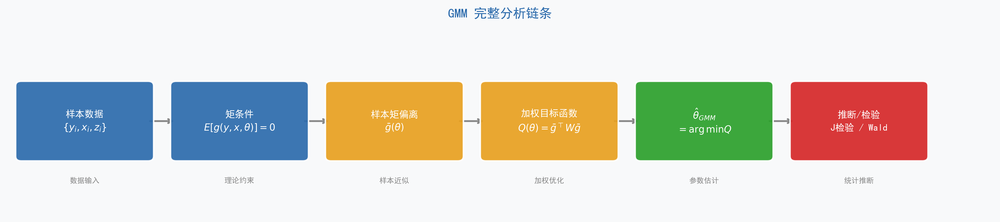
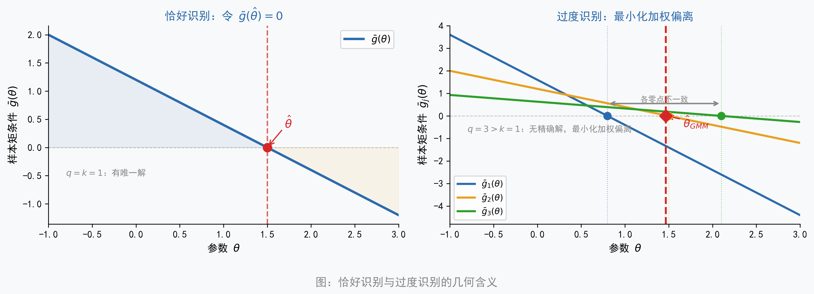
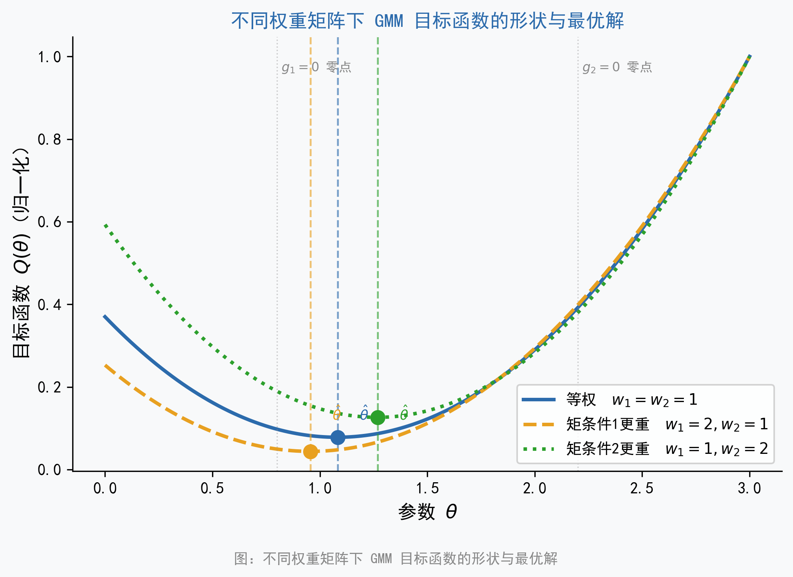
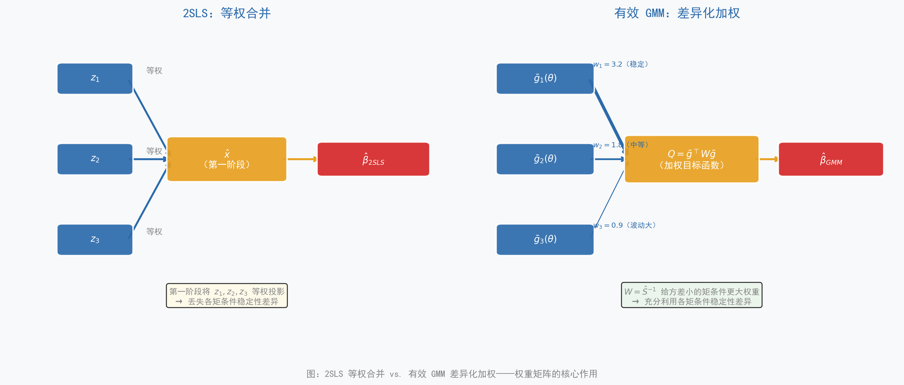

## 导言

学过线性回归的读者都熟悉这样一个核心条件：解释变量与误差项不相关，即 $E(x_i \varepsilon_i) = 0$。这个条件保证了普通最小二乘法（Ordinary Least Squares, OLS）能一致地估计参数 $\beta$。当 $x_i$ 是内生变量（endogenous variable）、这个条件不再成立时，我们转而寻找工具变量（Instrumental Variable, IV）$z_i$，并依赖新的正交条件 $E(z_i \varepsilon_i) = 0$ 来识别参数。

这两个表达式——$E(x_i \varepsilon_i) = 0$ 和 $E(z_i \varepsilon_i) = 0$——有一个共同的名字：**矩条件**（moment conditions）。它们都在说同一件事：如果模型设定正确、参数取真值，那么某个函数的期望值应当等于零。换句话说，你在学 OLS 和 IV 的时候，其实已经在用矩条件了，只是当时没有用这个名字。

当矩条件数量恰好等于参数数量时（**恰好识别**，just-identified），可以直接令样本矩条件等于零求解，这是普通矩估计（Method of Moments, MM）。当矩条件数量多于参数数量时（**过度识别**，over-identified），没有参数能让所有矩条件同时精确为零，只能找到「最接近满足全部矩条件」的解——这就是广义矩估计（Generalized Method of Moments, GMM）要做的事。GMM 进一步通过权重矩阵（weighting matrix）$W$ 给「更稳定的矩条件」更大的权重，这是它优于两阶段最小二乘法（Two-Stage Least Squares, 2SLS）的根本所在。

还有一个值得预告的洞察：OLS、IV、2SLS 其实都是 GMM 在特定矩条件和特定权重矩阵下的特例。理解了 GMM，就理解了这些方法共同的骨架。在后续应用场景一节中，我们还会看到 GMM 如何处理更复杂的非线性约束——比如消费-资产定价的 Euler 方程，这类场景在无法或不愿指定完整联合分布时，MLE 并不自然，而 GMM 更有优势。

**全章核心主线：**

$$
\text{矩条件（理论）} \;\rightarrow\; \text{样本矩偏离} \;\rightarrow\; \text{加权最小化} \;\rightarrow\; \hat{\theta}_{GMM} \;\rightarrow\; \text{推断与检验}
$$

引用核心主线流程图（@fig-GMM-flowchart），并呼应第一句总纲式表述：

> GMM 的核心思想是——用「经济理论或统计假设告诉我们应当成立的矩条件」约束参数估计，找出使样本矩条件偏离最小的那组参数值。

**本章与 MLE 章节的关系**

本章与前面章节的最大似然估计（MLE）构成 Part III「估计方法」的两种框架：MLE 从「分布」出发，GMM 从「矩条件」出发。两者的分工和比较将在本章末尾的小结中给出。

建议顺序阅读第 1—7 节；第 8 节是应用场景，可选择性深入；第 9、10 节分别是踩坑指南和总结。

::: {.callout-note}
### 本章学完后你能做什么

- 理解「GMM 只需要矩条件，不需要分布假设」意味着什么
- 看懂论文和软件输出中的 Hansen J 统计量、Sargan 统计量、两步 GMM 等术语
- 理解 2SLS 与有效 GMM 的本质区别，知道什么时候需要用 GMM 而非 2SLS
- 对非线性 GMM（如 Euler 方程估计）和多方程 GMM（如资产定价检验）有基本认识
:::

{#fig-GMM-flowchart}

---

## 第 1 节：为什么需要 GMM？

### OLS 和 MLE 的共同前提

OLS 的一致性依赖两个核心假设：解释变量与误差项正交（$E[x_i\varepsilon_i] = 0$），以及误差同方差（homoskedasticity）。MLE 走得更远，需要完整指定因变量的条件分布——正态、泊松、逻辑斯谛……缺少这个分布假设，似然函数就无从写下。两者都依赖对数据生成过程（data generating process, DGP）的较强先验知识。

### 金融数据的三个典型挑战

金融数据的特征使上述假设常常可疑：

- **厚尾与非正态**：股票收益率、波动率等具有明显的超额峰度（excess kurtosis），正态假设在实证研究中极易失当。
- **异方差与序列相关**（serial correlation）：金融时间序列几乎必然存在这两个问题，影响 OLS 和简单 IV 估计的效率。
- **非线性理论约束**：资产定价理论给出的是效用最大化一阶条件（如 Euler 方程），本质上是非线性的，无法直接套用 OLS/MLE 的标准框架处理。

### 工具变量过度识别时的信息利用问题

这是引出 GMM 最直接的动机。假设有 1 个内生变量 $x$ 和 3 个工具变量 $z_1, z_2, z_3$：

2SLS 的做法是「提取信息」：把三个工具变量合并为一个拟合值 $\hat{x}$（第一阶段投影），再用 $\hat{x}$ 做第二阶段回归。三个矩条件 $E[z_1'\varepsilon]=0$，$E[z_2'\varepsilon]=0$，$E[z_3'\varepsilon]=0$ 被隐式地等权合并进了第一阶段投影中，没有显式区分不同工具变量对应矩条件的稳定性差异。

GMM 的做法是「加权偏离」：保留三个样本矩条件 $\bar{g}_1$、$\bar{g}_2$、$\bar{g}_3$ 的独立性，通过权重矩阵 $W$ 给方差更小、协方差结构更稳定的矩条件更高权重。这样就能系统地利用全部约束信息，而不是把它们「压扁」成一个投影。

### GMM 的三类核心应用场景

| 应用场景 | 典型例子 | GMM 相对其他方法的优势 |
|:--------|:--------|:--------------------|
| 过度识别 IV 估计 | 多个工具变量的内生性回归 | 系统利用全部矩条件，异方差下仍有效 |
| 非线性理论约束 | Euler 方程、资产定价一阶条件 | 不需要分布假设，直接用经济理论构造矩条件 |
| 多方程联合估计 | 横截面资产定价检验 | 利用方程间误差相关性，比逐方程 OLS 更有效 |

: GMM 的三类核心应用场景 {#tbl-gmm-scenarios}

::: {.callout-tip}
### 本章学习目标

本章不要求推导 GMM 的渐近分布，也不要求自己构造权重矩阵。核心目标是理解「GMM 在做什么」以及「为什么要用权重矩阵」，能够读懂软件输出并判断何时应使用 GMM 而非 2SLS。
:::

---

## 第 2 节：矩条件——GMM 的语言

### 什么是矩条件

「矩条件」的本质，是一句关于总体的声明：「如果模型设定正确、参数取真值，那么某个函数的期望值应该等于零。」

这个概念比它听起来要亲切得多。你已经熟悉的几个例子：当 OLS 假设误差与解释变量正交时，它在说 $E[x_i\varepsilon_i]=0$；当 IV 假设工具变量外生时，它在说 $E[z_i\varepsilon_i]=0$。这两句话都是矩条件——只是你之前用另一种语言描述它们。

用正式语言：设参数真值为 $\theta_0$，矩条件写作：

$$
E[g(y_i, x_i, \theta_0)] = 0
$$ {#eq-moment-condition}

其中 $g(\cdot)$ 是我们根据理论或假设构造的函数，其维度（矩条件个数）记为 $q$，参数个数记为 $k$。

### 矩条件的三类来源

这是全章最重要的「认知地图」，后续所有例子都能在这张表中找到位置：

| 来源类型 | 典型形式 | 具体例子 | 可检验性 |
|:--------|:--------|:--------|:--------|
| **正交性条件** | $E[z_i \varepsilon_i(\theta)] = 0$ | 工具变量外生性 | J 检验（过度识别时）|
| **经济理论一阶条件** | $E[\beta \cdot MRS_{t+1} \cdot R_{t+1} - 1 \mid z_t] = 0$ | Euler 方程、资产定价 | J 检验 |
| **高阶矩约束** | $E[(x_i^*)^k \cdot \varepsilon_i] = 0$（$k \geq 2$）| 测量误差识别（Erickson-Whited）| 模型设定检验 |
| **面板滞后约束** | $E[y_{i,t-s} \cdot \Delta\varepsilon_{i,t}] = 0$（$s \geq 2$）| 动态面板（AB 估计）| Sargan/Hansen |

: 矩条件的三类来源 {#tbl-moment-sources}

矩条件不是凭空设定的，而是经济理论或统计假设的直接「翻译」。矩条件的可信度取决于其背后假设的可信度；过度识别检验（J/Sargan 检验）可以帮助检验矩条件的联合有效性，但无法指出哪一个具体矩条件出了问题。

### 从总体矩条件到样本矩偏离

总体矩条件是关于期望的声明，在有限样本中，我们用**样本均值**来近似期望，定义样本矩条件（sample moment condition）：

$$
\bar{g}(\theta) = \frac{1}{n} \sum_{i=1}^n g(y_i, x_i, \theta)
$$ {#eq-sample-moment}

当参数个数 $k$ 等于矩条件数 $q$ 时（**恰好识别**），可以直接令 $\bar{g}(\hat{\theta}) = 0$ 求解——这就是普通矩估计（MM）。当 $q > k$ 时（**过度识别**），不存在能让所有 $\bar{g}_j(\hat{\theta}) = 0$ 同时成立的参数值，只能退而求其次：找到使「总体偏离」尽量小的参数——**这就是 GMM**。

### 恰好识别与过度识别的直觉

用方程组的直觉来理解：恰好识别相当于「用 $k$ 个方程解 $k$ 个未知数」，有唯一解；过度识别相当于「用 $q > k$ 个方程解 $k$ 个未知数」，方程组通常无精确解，只能找「最接近满足所有方程」的参数。这个「最接近」的度量方式，就是权重矩阵 $W$ 的作用。参见 @fig-GMM-moment-conditions。

{#fig-GMM-moment-conditions}

::: {.callout-warning}
### 矩条件的个数不等于约束越多越好

矩条件数量越多，理论上提供的信息越多，估计效率越高。但矩条件越多，权重矩阵 $\hat{S}$ 的维度越大，在有限样本中估计误差也越大，可能导致 GMM 估计量严重偏误。这个「信息量 vs. 估计精度」的权衡，是 GMM 在实践中最重要的设计选择之一，将在后续章节详细讨论。
:::

---

## 第 3 节：从矩条件到 GMM 估计量

### GMM 目标函数

先用自然语言说清楚「我们在最小化什么」：

> GMM 把 $q$ 个样本矩偏离 $\bar{g}_1(\theta), \bar{g}_2(\theta), \ldots, \bar{g}_q(\theta)$ 看作一个向量，然后最小化这个向量的「加权长度」。权重由矩阵 $W$ 决定。

形式化表达：

$$
\hat{\theta}_{GMM} = \arg\min_\theta \; Q(\theta), \quad Q(\theta) = \bar{g}(\theta)^\top W \bar{g}(\theta)
$$ {#eq-gmm-objective}

其中 $W$ 是 $q \times q$ 的正定对称矩阵（positive definite symmetric matrix）。$W$ 的对角元素 $W_{jj}$ 是第 $j$ 个矩条件的权重，$W_{jk}$ 捕捉了矩条件 $j$ 和 $k$ 之间的相互关系。不同的权重矩阵选择，对应不同的估计量。

参见 @fig-GMM-objective，直观展示了不同权重矩阵 $W$ 下目标函数形状与最优解位置的变化。

{#fig-GMM-objective}

### 线性模型的一阶条件

仅针对线性模型 $y_i = x_i^\top\beta + \varepsilon_i$ 给出一阶条件，帮助建立直觉。这里 $\mathbf{x}_i$ 是 $k \times 1$ 列向量，包含所有解释变量，这一个向量方程等价于 $k$ 个标量方程。

在给出矩阵表达式之前，先用文字说清楚它的含义：2SLS 估计量的构造分两步——第一步用工具变量对内生变量做回归，提取外生信息；第二步用这一「净化过的」拟合值替换原内生变量做 OLS。GMM 在此基础上进一步允许每个工具变量（矩条件）有不同的权重。

$$
\hat{\theta}_{GMM} = \left(\mathbf{X}^\top \mathbf{Z} W \mathbf{Z}^\top \mathbf{X}\right)^{-1} \mathbf{X}^\top \mathbf{Z} W \mathbf{Z}^\top \mathbf{y}
$$ {#eq-gmm-linear}

括号里的 $\mathbf{X}^\top \mathbf{Z}$ 本质上是在度量内生变量和工具变量之间的相关性强度；$W$ 决定了在汇总这种相关性时，各矩条件的相对权重。当 $W = (\mathbf{Z}^\top \mathbf{Z}/n)^{-1}$ 时，这个公式退化为 2SLS 估计量。

### 单步 GMM 与两步 GMM

这是实践中最常见的混淆点：

**A. 单步 GMM**：选定某个固定的 $W$（通常 $W = I$ 或 $W = (\mathbf{Z}^\top \mathbf{Z}/n)^{-1}$），直接求解 @eq-gmm-objective。简单，但 $W$ 可能不是最优的，估计效率未必达到理论下界。

**B. 两步 GMM（Two-Step GMM）**：

- 第一步：用 $W^{(1)} = I$ 得到初步估计 $\hat{\theta}^{(1)}$
- 第二步：用 $\hat{\theta}^{(1)}$ 计算残差，估计最优权重矩阵 $\hat{S}$，再以 $W^{(2)} = \hat{S}^{-1}$ 重新估计，得到渐近有效的 $\hat{\theta}^{(2)}$
- 渐近意义下，两步 GMM 是有效的（达到效率下界）

::: {.callout-note}
### 两步 GMM 的有限样本问题

两步 GMM 在大样本下渐近最优，但在有限样本中，第二步权重矩阵 $\hat{S}$ 的估计误差会传递到参数估计中，可能导致比单步 GMM 更大的有限样本偏误和扭曲的置信区间。在矩条件数量较多时（相对于样本量），这个问题尤为突出。

实践建议：报告两步 GMM 的系数，但同时用 CUE 或 LIML 做稳健性检验。
:::

---

## 第 4 节：2SLS 与 GMM：「提取信息」vs.「加权偏离」

### 引入场景

设模型：$y_i = x_i \beta + \varepsilon_i$，$x_i$ 内生，有三个工具变量 $z_1, z_2, z_3$（过度识别）。这是两种估计方法在应用场景上最常见的对比。本节重点是**权重机制的差异**。

### 2SLS 的逻辑：「提取信息」

2SLS 的思路是投影（projection）。第一阶段：把内生变量 $x$ 投影到工具变量空间，这一步把 $x$ 中「可以被三个工具变量解释」的外生部分提取出来，得到拟合值 $\hat{x} = \mathbf{Z}(\mathbf{Z}^\top \mathbf{Z})^{-1}\mathbf{Z}^\top x$。这里 $\mathbf{Z}$ 是以 $z_1, z_2, z_3$ 为列的矩阵，括号里的 $\mathbf{Z}^\top \mathbf{Z}$ 衡量了工具变量彼此之间以及与内生变量的相关结构。第二阶段：用 $\hat{x}$ 替换 $x$ 做 OLS 回归，得到一致的参数估计。

2SLS 对三个矩条件的处理方式：虽然它假设 $E[z_j'\varepsilon]=0$（$j=1,2,3$），但在第一阶段的投影中，三个工具变量被**等权**合并成一个 $\hat{x}$。从权重矩阵的角度看，2SLS 相当于选择 $W = (\mathbf{Z}^\top \mathbf{Z}/n)^{-1}$，这只有在误差同方差时才是最优的。

### GMM 的逻辑：「加权偏离」

GMM 保留三个矩条件的独立性：

$$
\bar{g}_j(\theta) = \frac{1}{n}\sum_{i=1}^n z_{ij} \varepsilon_i(\theta), \quad j = 1, 2, 3
$$

构造向量 $\bar{g} = (\bar{g}_1, \bar{g}_2, \bar{g}_3)^\top$，目标函数 $Q(\theta) = \bar{g}^\top W \bar{g}$。最优权重矩阵 $W = \hat{S}^{-1}$ 的构造（异方差稳健版本）：

$$
\hat{S} = \frac{1}{n}\sum_{i=1}^n g_i g_i^\top
$$

$\hat{S}$ 的对角元素 $\hat{S}_{jj}$ 是第 $j$ 个矩条件 $\bar{g}_j$ 的方差估计。**方差越小，说明这个矩条件越稳定，在 $W = \hat{S}^{-1}$ 中对应的权重通常越大。** 参见 @fig-GMM-2sls-vs-gmm。

{#fig-GMM-2sls-vs-gmm}

::: {.callout-important}
### GMM 权重矩阵的精髓

最优权重矩阵 $W = \hat{S}^{-1}$ 的含义是：**方差更小、协方差结构更稳定的矩条件，权重通常更大；越不稳定（方差越大）的矩条件，权重通常更小。**

这是 GMM 相对 2SLS 的根本优势：2SLS 对工具变量等权处理（对应 $W = (\mathbf{Z}^\top \mathbf{Z}/n)^{-1}$），而有效 GMM 则根据矩条件的方差-协方差结构来分配识别权重。
:::

### 异方差下的差异

当误差项存在异方差（heteroskedasticity）时，2SLS 仍然一致，但**不是有效的**（efficiency bound 未达到）。有效 GMM 通过 $W = \hat{S}^{-1}$（异方差稳健的 $\hat{S}$）达到有效性下界。

**形式化结论**：2SLS 等价于使用 $W = (\mathbf{Z}^\top \mathbf{Z}/n)^{-1}$ 的 GMM，这只是在同方差条件下才与最优权重矩阵一致。

::: {.callout-note}
### 什么时候 2SLS = 有效 GMM？

当且仅当误差项**同方差且无序列相关**时，$W_{2SLS} = (\mathbf{Z}^\top \mathbf{Z}/n)^{-1}$ 与最优 $\hat{S}^{-1}$ 等价，两者给出相同的参数估计量和标准误。在金融数据中（几乎必然存在异方差），这个条件通常不成立，若研究目标是追求更高效率并统一处理矩条件结构，可进一步考虑两步 GMM。
:::

::: {.callout-tip}
### 提示词：理解 2SLS 与 GMM 的差异

> 我有一个内生变量 x 和三个工具变量 z1、z2、z3。请用直觉语言解释：2SLS 如何使用这三个工具变量？有效 GMM 如何使用它们？两者的本质区别是什么？在什么情况下必须用 GMM 而不能用 2SLS？
:::

---

## 第 5 节：OLS、IV、2SLS 都是 GMM 的特例

### 统一框架表

先给表格，后给文字说明——表格是这一节结构层面的核心：

| 估计量 | 矩条件 $g_i(\theta)$ | 识别状态 | 权重矩阵 $W$ | 等价条件 |
|:------|:-------------------|:--------|:-----------|:--------|
| OLS | $\mathbf{x}_i (y_i - \mathbf{x}_i^\top \beta)$ | 恰好识别（$q=k$）| 退化（无需） | $\mathbf{x}_i$ 外生 |
| IV（恰好识别）| $z_i (y_i - x_i^\top \beta)$ | 恰好识别（$q=k$）| 退化（无需）| $z_i$ 外生且相关 |
| 2SLS | $\mathbf{z}_i (y_i - \mathbf{x}_i^\top \beta)$ | 过度识别（$q>k$）| $(\mathbf{Z}^\top \mathbf{Z}/n)^{-1}$ | 误差同方差 |
| 有效 GMM | $\mathbf{z}_i (y_i - \mathbf{x}_i^\top \beta)$ | 过度识别（$q>k$）| $\hat{S}^{-1}$ | 无额外假设 |

: OLS、IV、2SLS 与 GMM 的统一框架 {#tbl-unified-framework}

这里 $\mathbf{x}_i$ 是 $k \times 1$ 列向量，包含所有解释变量；这一个向量方程等价于 $k$ 个标量方程。$\mathbf{z}_i$ 是 $q \times 1$ 工具变量向量，$q \geq k$。

### 恰好识别时的退化

当 $q=k$ 时，GMM 目标函数可以精确为零，权重矩阵不影响估计结果——因为无论 $W$ 取何值，使 $\bar{g}(\hat{\theta})=0$ 的解唯一（只要模型可识别）。因此 OLS 和恰好识别的 IV，都是 GMM 的特例，权重矩阵的选择无关紧要。这一点说明：GMM 框架的「新东西」全部体现在过度识别的情形中。

### 2SLS 是 GMM 的特例（但不是有效 GMM）

过度识别时，权重矩阵的选择影响估计效率。2SLS 选用的 $W = (\mathbf{Z}^\top \mathbf{Z}/n)^{-1}$，只在同方差条件下与最优权重等价。因此，2SLS 是 GMM 的一个特例，但在一般情形下不是有效（最优）的 GMM。

::: {.callout-important}
### 核心结论：OLS/IV/2SLS 都是 GMM 特例

OLS、IV、2SLS 都是 GMM 在特定矩条件和特定权重矩阵下的特例。GMM 是更一般的框架：通过选择不同的矩条件函数 $g(\cdot)$ 和权重矩阵 $W$，可以「生成」出各种不同的经典估计量。OLS、IV、2SLS 都是 GMM 在特定矩条件和特定权重矩阵下的特例；理解了权重矩阵的构造逻辑，就理解了 GMM 相对 2SLS 的根本优势所在。
:::

::: {.callout-tip}
### 提示词：验证 OLS 是 GMM 特例

> 请用 Python 生成一组简单线性回归数据（n=200，无内生性问题），分别用 OLS 和以 $W=I$ 的 GMM（矩条件为 $E[x_i \varepsilon_i]=0$）估计参数，验证两者给出相同的系数估计值。
:::

---

## 第 6 节：最优权重矩阵与有效性

### 为什么权重矩阵影响效率

类比加权最小二乘法（Weighted Least Squares, WLS）：WLS 给「精度更高的观测」更大权重，从而比 OLS 更有效。GMM 的最优权重矩阵做的是类似的事：给「更稳定（方差更小）的矩条件」更大权重，使最终参数估计量的方差达到理论下界。参见 @fig-GMM-efficiency，通过蒙特卡洛模拟展示了异方差场景下各估计量的有限样本分布差异。

{#fig-GMM-efficiency}

### 最优权重矩阵的定义

$\hat{S}$ 是矩条件的**长期方差矩阵**（long-run variance matrix）的一致估计量。这里 $S$ 是一个 $q \times q$ 矩阵，它的 $(j, k)$ 元素捕捉了矩条件 $j$ 和矩条件 $k$ 之间的协方差结构（包括序列相关）：

$$
S = \lim_{n\to\infty} n \cdot \text{Var}[\bar{g}(\theta_0)] = \sum_{j=-\infty}^{\infty} E\left[g_i g_{i-j}^\top\right]
$$ {#eq-S-matrix}

直觉上：$S$ 是所有矩条件的「噪声」度量，$S^{-1}$ 是最优权重矩阵——噪声越小（方差越小）的矩条件，得到越大的权重。

### 三种场景下的 $\hat{S}$ 估计

| 误差假设 | $\hat{S}$ 的估计方式 | Python/Stata 对应 |
|:--------|:------------------|:-----------------|
| 同方差、无序列相关 | $\hat{S} = \hat{\sigma}^2 (\mathbf{Z}^\top \mathbf{Z} / n)$ | 默认选项，2SLS 等价 |
| 异方差、无序列相关 | $\hat{S} = \frac{1}{n}\sum_i \hat{\varepsilon}_i^2 z_i z_i^\top$（White）| `cov_type='robust'` |
| 异方差 + 序列相关 | Newey-West HAC 估计量（截断滞后 $M$）| `cov_type='HAC'`，`nlags=M` |

: 三种场景下的最优权重矩阵估计 {#tbl-S-estimation}

::: {.callout-warning}
### 矩条件不是越多越好

随着矩条件数量 $q$ 增加，有效 GMM 的渐近效率提高，但有限样本偏误也急剧增大——因为 $q \times q$ 的权重矩阵 $\hat{S}$ 需要更多数据才能估计准确。经验规则：矩条件数量与样本量之比 $q/n$ 不宜超过 0.1。当工具变量数量较多时，可考虑使用 LIML 或 Fuller 估计量作为替代，它们对过多工具变量的有限样本偏误更鲁棒。
:::

### 矩选择（简要提及）

Andrews (1999) 提出了类似信息准则的矩选择准则（GMM Moment Selection Criteria），用于在候选矩条件中选择最优子集。在 Stata 中可通过 `ivreg2` 结合 `endog()` 选项实现部分功能；Python 的 `linearmodels` 暂无内置实现，但可手动构造。

---

## 第 7 节：推断：Sargan 检验、Hansen J 检验与参数检验

### 过度识别检验的直觉

先建立直觉，再给公式：如果所有矩条件都是正确设定的（所有工具变量都是外生的），那么在大样本中，样本矩偏离 $\bar{g}(\hat{\theta}_{GMM})$ 应当接近于零。如果 $\bar{g}$ 在统计意义上显著不为零，说明某些矩条件可能不成立——也就是说，某些「工具变量」可能并不真正外生。

两种检验统计量的形式相同：

$$
J = n \cdot \bar{g}(\hat{\theta})^\top \hat{W} \bar{g}(\hat{\theta}) \sim \chi^2(q - k) \quad \text{（零假设下）}
$$ {#eq-J-stat}

自由度 $q-k$ = 矩条件数 $-$ 参数数 = 过度识别数量（degrees of overidentification）。

### Sargan 检验与 Hansen J 检验对照

| 检验名称 | 权重矩阵假设 | 推荐适用场景 | 主要缺陷 |
|:--------|:----------|:-----------|:--------|
| **Sargan 检验** | $\hat{W} = \hat{\sigma}^2 (\mathbf{Z}^\top \mathbf{Z} / n)^{-1}$（同方差）| 误差项同方差、无序列相关 | 异方差下**过度拒绝**，检验扭曲 |
| **Hansen J 检验** | $\hat{W} = \hat{S}^{-1}$（HAC 稳健）| 异方差、序列相关均适用 | 弱工具变量时检验**力不足**（过于宽容）|

: Sargan 检验与 Hansen J 检验对照 {#tbl-sargan-hansen}

**经验法则（有文献依据）：**

- 凡使用异方差稳健标准误（`robust`），必须配套 Hansen J，Sargan 统计量在此场景下失去意义（Baum, Schaffer & Stillman, 2003）。
- 矩条件数量过多时，Hansen J 检验力会显著下降（Roodman, 2009）。
- Difference-in-Sargan（C 检验）可用于检验额外矩条件子集的有效性：$D = J_{\text{限制}} - J_{\text{非限制}} \sim \chi^2(r)$。
- 若 Sargan 和 Hansen J 给出截然相反的结论，通常意味着误差项存在异方差，应以 Hansen J 为准。

::: {.callout-warning}
### Sargan 检验在异方差下不可靠

若误差项存在异方差（金融数据中几乎必然如此），Sargan 检验会**过度拒绝**原假设——即使矩条件（工具变量外生性）是正确的，也会频繁给出「拒绝」的结论，这是检验的尺寸扭曲（size distortion）问题。

**实践建议**：在报告异方差稳健标准误时，必须配套使用 Hansen J 检验，而不是 Sargan 检验。
:::

::: {.callout-note}
### 动态面板中的 Sargan/Hansen（与 xtabond2 的关系）

Stata 的 `xtabond2` 命令同时报告两类统计量：不加 `robust` 选项时报告 Sargan 统计量（假设同方差）；加 `robust` 选项时报告 Hansen J 统计量（异方差稳健）。在动态面板估计中，几乎总应使用 `robust` 选项，因此应当关注 Hansen J 而非 Sargan。

注意：Hansen J 检验的「宽容性」在矩条件数量很多时尤为突出——过多的工具变量会使 J 检验几乎无法拒绝，这是动态面板研究中工具变量数量需要被严格限制的重要原因之一（Roodman, 2009）。
:::

### J 检验的局限性

J 检验只能检验矩条件的**联合**有效性，无法指出哪个矩条件出了问题。差分 Sargan 检验（Difference-in-Sargan / C 检验）可以补充：通过比较两个嵌套的 GMM 估计（使用不同矩条件子集），检验额外矩条件的有效性，统计量 $D = J_{\text{限制}} - J_{\text{非限制}} \sim \chi^2(r)$，$r$ 为额外矩条件数。

### 参数的 Wald 检验

GMM 参数估计量的渐近分布为正态，因此可以构造标准的 Wald 检验（Wald test）：

$$
W = (\hat{\theta} - \theta_0)^\top [\text{Var}(\hat{\theta})]^{-1} (\hat{\theta} - \theta_0) \sim \chi^2(k)
$$ {#eq-Wald}

这对应 MLE 框架中的似然比检验（LR test），是 GMM 框架下的参数显著性检验标准工具。

### Python 软件输出示例

以下是 `linearmodels.IVGMM` 的典型输出，括号内为逐行解读：

```
                      IV-GMM Estimation Summary
==================================================================
Dep. Variable:                  y   R-squared:              0.312
Estimator:                 IV-GMM   Adj. R-squared:         0.310
No. Observations:             500   F-statistic:           112.34
Date:                      ...      P-value (F-stat)       0.0000
Cov. Estimator:            robust
------------------------------------------------------------------
                       Parameter Estimates
==================================================================
          Parameter  Std. Err.   T-stat   P-value  Lower CI  Upper CI
const        1.0234     0.0891   11.487   0.0000    0.8488    1.1980
x1           1.9876     0.1102   18.036   0.0000    1.7716    2.2036
x2          -0.4923     0.0897   -5.488   0.0000   -0.6681   -0.3165
==================================================================
                       Instrument Tests
==================================================================
Hansen J-statistic:  2.1034  (p-value: 0.3491)   ← 过度识别检验（不拒绝）
Sargan statistic:    3.2218  (p-value: 0.1994)   ← 同方差版本（参考）
Durbin-Wu-Hausman:   8.9721  (p-value: 0.0113)   ← 内生性检验（拒绝外生）
==================================================================
```

解读要点：**Hansen J（p = 0.35）**不拒绝「所有矩条件联合有效」，工具变量外生性通过联合检验；**Sargan（p = 0.20）**结论一致，但若存在异方差，应优先参考 Hansen J；**Durbin-Wu-Hausman（p = 0.011）**拒绝「$x_1$ 外生」，证实内生性问题存在，使用 IV/GMM 是必要的。

::: {.callout-note collapse="true"}
### Stata 对应代码

```stata
* 2SLS（经典标准误）
ivreg2 y (x1 x2 = z1 z2 z3 z4)

* 2SLS（异方差稳健标准误）
ivreg2 y (x1 x2 = z1 z2 z3 z4), robust

* 两步有效 GMM（异方差稳健，推荐）
ivreg2 y (x1 x2 = z1 z2 z3 z4), gmm2s robust
* 输出自动包含 Hansen J 统计量（robust 模式下）
```

> **说明**：`ivreg2` 的 `gmm2s robust` 选项对应 Python `linearmodels.IVGMM` 的两步 GMM（`weight_type='robust'`）。Stata 在 `robust` 模式下自动报告 Hansen J，而非 Sargan。
:::

::: {.callout-note}
### 参考文献：Sargan/Hansen 检验的实践指南

- Baum, C. F., Schaffer, M. E., & Stillman, S. (2003). Instrumental variables and GMM: Estimation and testing. *Stata Journal*, 3(1), 1–31.
- Roodman, D. (2009). A note on the theme of too many instruments. *Oxford Bulletin of Economics and Statistics*, 71(1), 135–158.
- Hayashi, F. (2000). *Econometrics*. Princeton University Press. Ch. 3.
:::

---

## 第 8 节：GMM 的核心应用场景

### 8.1 过度识别 IV + 异方差：有效 GMM vs. 2SLS

当存在多个工具变量且误差项异方差时，经典 2SLS 与有效 GMM 的效率会出现差异。即便使用异方差稳健 2SLS 推断，GMM 仍可能在效率上更优。直觉上：异方差使不同矩条件的「信噪比」出现差异，只有通过最优权重矩阵才能充分利用这种差异。

典型结果：三种方法系数接近（均一致），但标准误有系统差异——异方差下，2SLS 的经典标准误偏小（低估），2SLS-robust 标准误扩大，有效 GMM 的标准误与 2SLS-robust 接近但通常更有效（更小）。配套的案例实现见 `GMM_case.ipynb` Case 1（数据：`method_GMM_data01_iv_hetero.csv`）。

### 8.2 Euler 方程：非线性 GMM

设想这样一个研究困境：你在研究投资者的跨期消费决策是否符合理性预期。理论模型告诉你，均衡时效用函数的一阶条件必须成立——这是一个关于消费增长率和资产收益率的非线性方程。你想用数据估计效用函数的参数（贴现因子 $\beta$ 和风险厌恶系数 $\gamma$），但你不知道消费增长率服从什么分布，更不知道它与收益率的联合分布。在无法或不愿指定完整联合分布时，MLE 并不自然，更难以实施。怎么办？

答案是：你不需要知道完整的分布，只需要知道一件事——如果模型成立，Euler 方程的期望值应当等于零。这就是一个矩条件。

在标准消费-储蓄模型中，理性代理人的最优选择满足：今天多消费一单位的边际效用，等于明天消费对应的折现边际效用乘以投资收益率。这个条件写成期望的形式就是：

$$
E_t\left[\beta \left(\frac{c_{t+1}}{c_t}\right)^{-\gamma} R_{t+1} - 1 \;\middle|\; z_t\right] = 0
$$ {#eq-euler}

其中 $\beta$ 是主观贴现因子（subjective discount factor），$\gamma$ 是相对风险厌恶系数（coefficient of relative risk aversion），$R_{t+1}$ 是资产总收益率，$z_t$ 是信息集中的任意工具变量。

用这个方程乘以工具变量 $z_t$，得到 $q$ 个矩条件，通过 GMM 的加权最小化即可估计 $(\beta, \gamma)$，而无需假设消费增长率的分布——这是 GMM 相对 MLE 最能体现独特优势的场景。配套案例见 `GMM_case.ipynb` Case 2a（模拟数据，$\beta_0 = 0.98$，$\gamma_0 = 2.0$）和 Case 2b（FRED 真实数据，可选）。

### 8.3 多方程矩条件：横截面资产定价检验

横截面资产定价检验场景：有 $N$ 支资产，每支资产都提供一个时间序列矩条件（超额收益与因子收益之间的正交条件）。如果逐方程 OLS 估计，忽略了方程间误差项的相关性；GMM 通过权重矩阵利用方程间的协方差结构，可以得到更有效的因子风险溢价（risk premium）估计，并通过 J 检验同时检验所有资产的定价误差是否联合为零。

在 CAPM 框架下，每支资产 $i$ 的矩条件为 $E[(R_{it} - R_{ft}) - \beta_i(R_{mt} - R_{ft})] = 0$，合并 $N$ 支资产就得到 $N$ 个联立矩条件。Fama-MacBeth 两步法忽略了截面误差相关性，GMM 多方程估计明确利用了这个信息，通常标准误更小。配套案例见 `GMM_case.ipynb` Case 3（可选）。

### 8.4 高阶矩与测量误差：Erickson-Whited 方法 {.unnumbered}

::: {.callout-note}
### 本节为压缩版介绍

重点是适用场景与软件命令，不展开方法推导。有兴趣深入的读者可参考末尾参考文献。
:::

**适用场景**：当有内生性或测量误差、但找不到合适外部工具变量时。典型场景是企业投资-Q 关系研究中，Tobin's Q 作为投资机会的代理变量存在严重的经典测量误差（classical measurement error），而外部工具变量难以找到。

**核心思路**：若真实变量 $x^*$ 存在经典测量误差 $x = x^* + \nu$（$\nu$ 与 $x^*$ 独立），则 $x^*$ 的**高阶矩**（三阶矩、四阶矩）与误差项之间存在天然的正交性条件。这些正交性可以构造额外的矩条件，从而在**不需要外部工具变量**的情况下识别参数。关键假设：测量误差 $\nu$ 与真实变量 $x^*$ 相互独立（经典测量误差假设）。

**软件命令**：

Stata 的 `ewreg` 命令（Erickson-Whited regression），可从 SSC 安装：

```stata
ssc install ewreg
ewreg y x_mismeasured controls, order(3)   // order() 指定矩条件阶数
```

Python 目前无成熟现成包，可借助 `scipy.optimize.minimize` 手动构造高阶矩条件求解 GMM 目标函数；亦可参考 Erickson et al.（2014）附录代码。

**局限性**：高阶矩对非正态性和厚尾分布较敏感；矩阶数越高，有限样本偏误越大。建议作为稳健性检验而非主要估计方法。

::: {.callout-note}
### 参考文献

- Erickson, T., & Whited, T. M. (2000). Measurement error and the relationship between investment and q. *Journal of Political Economy*, 108(5), 1027–1057.
- Erickson, T., Jiang, C. H., & Whited, T. M. (2014). Minimum distance estimation of the errors-in-variables model using linear cumulant equations. *Journal of Econometrics*, 183(2), 211–221.
- Whited, T. M. (2001). Is it inefficient investment that causes the diversification discount? *Journal of Finance*, 56(5), 1667–1691.（应用示例）
:::

---

## 第 9 节：使用 GMM 时的常见问题

### 9.1 弱工具变量（最重要）

弱工具变量（weak instruments）指工具变量与内生变量的相关性很弱，导致 GMM（和 2SLS）估计量方差急剧增大，且渐近正态近似失效——即使样本量很大，置信区间也会严重偏离标称覆盖率。

**诊断**：一阶段 F 统计量（经验阈值：$F < 10$ 表示可能存在弱工具变量问题）；Cragg-Donald 统计量（多个内生变量时）；Stock-Yogo 临界值。

**处理**：使用有弱工具变量稳健推断的方法（Anderson-Rubin 检验、条件似然比检验）；考虑 LIML 估计量（对弱工具变量的有限样本偏误比 2SLS/GMM 更小）。

### 9.2 矩条件数量过多（过多工具变量）

矩条件数量 $q$ 相对于样本量 $n$ 过大时，权重矩阵 $\hat{S}$ 估计不精确，两步 GMM 会出现严重的有限样本偏误（系数朝 OLS 方向偏移）。经验规则：$q/n < 0.1$。若工具变量数量多，考虑对工具变量做主成分降维，或改用 LIML/CUE（连续更新估计，continuously updated estimator）等对过多矩条件更鲁棒的估计量。

### 9.3 J 检验通过 ≠ 工具变量有效

Hansen J 检验只检验矩条件的**联合**有效性。更重要的是：J 检验通过仅意味着矩条件在数据中看起来是相容的，但并不能证明工具变量是外生的——弱工具变量往往会使 J 检验「宽容」（检验力低），即使某些矩条件不成立也难以拒绝。

### 9.4 异方差下 Sargan vs. Hansen 的混淆

实践中最常见的错误之一：在异方差场景下使用 Sargan 检验，导致过度拒绝原假设。凡使用异方差稳健标准误（`robust`）时，必须同步使用 Hansen J 而非 Sargan。Stata 的 `ivreg2, robust` 自动报告正确的统计量；Python 的 `linearmodels.IVGMM` 设置 `cov_type='robust'` 后同样报告 Hansen J。

### 9.5 两步 GMM 的有限样本扭曲

两步 GMM 在理论上渐近有效，但第二步权重矩阵估计的误差会引入额外的有限样本偏误，使得参数估计值和标准误都出现系统性扭曲（通常是低估标准误、过度拒绝）。处理：同时报告 CUE 或 LIML 作为稳健性检验；在小样本中（$n < 200$）尤需谨慎。

### 9.6 收敛失败（非线性 GMM）

非线性 GMM（如 Euler 方程估计）依赖数值优化，面临与 MLE 类似的收敛问题：多个局部极小值、初值敏感性、目标函数在参数空间某些区域极为平坦。处理：从多组初始值出发，比较收敛结果；使用基于轮廓（profile）的参数可信区间，而非 Wald 型置信区间；考虑对参数进行变量替换（如估计 $\log\beta$ 而非 $\beta$）改善优化地形。

---

## 第 10 节：小结——GMM 作为统一估计框架

### 回顾核心主线

本章从一个读者已经熟悉的场景出发——OLS 的正交条件 $E[x_i\varepsilon_i] = 0$——逐步展示了这个条件本质上就是一个矩条件；当矩条件数量超过参数数量时，就自然引出了 GMM 的加权最小化框架（@fig-GMM-flowchart）。

**两句总纲的呼应**：GMM 的核心思想是——用「经济理论或统计假设告诉我们应当成立的矩条件」约束参数估计，找出使样本矩条件偏离最小的那组参数值。OLS、IV、2SLS 都是 GMM 在特定矩条件和权重矩阵下的特例；理解了权重矩阵的构造逻辑，就理解了 GMM 相对 2SLS 的根本优势所在。

### GMM 统一框架总表

| 估计量/方法 | 矩条件来源 | 识别状态 | 权重矩阵 | 关键假设 | 常见场景 |
|:-----------|:---------|:--------|:--------|:--------|:--------|
| OLS | 正交性 | 恰好识别 | 退化 | 解释变量外生 | 无内生性的线性回归 |
| IV（恰好识别）| 正交性 | 恰好识别 | 退化 | 工具变量外生+相关 | 单工具变量 IV |
| 2SLS | 正交性 | 过度识别 | $(\mathbf{Z}^\top \mathbf{Z})^{-1}$ | +同方差 | 多工具变量，同方差 |
| 有效 GMM | 正交性 | 过度识别 | $\hat{S}^{-1}$ | 无额外 | 多工具变量，异方差 |
| Euler 方程 GMM | 经济理论 FOC | 过度识别 | $\hat{S}^{-1}$ | 无分布假设 | 资产定价、消费模型 |
| 多方程 GMM | 多方程正交性 | 过度识别 | 块对角 $\hat{S}^{-1}$ | 方程间误差相关 | 资产定价横截面检验 |
| EW 高阶矩 GMM | 高阶矩约束 | 过度识别 | $\hat{S}^{-1}$ | 经典测量误差 | Tobin's Q 等代理变量 |

: GMM 统一框架总表 {#tbl-gmm-unified}

### GMM 与 MLE 的分工

| 情形 | 推荐方法 | 理由 |
|:-----|:--------|:-----|
| 知道分布假设、有限样本精度重要 | MLE | 充分利用分布信息，渐近有效性最优 |
| 只知道矩条件、分布未知或不可信 | GMM | 不需要分布假设，对设定错误更鲁棒 |
| 非线性模型 + 分布假设可疑 | GMM | Euler 方程等场景，MLE 需要联合分布 |
| 过度识别 IV + 异方差/序列相关 | GMM | 2SLS 非最优，需最优权重矩阵 |
| 有限样本很小（$n < 50$）| MLE（若能指定分布）| GMM 渐近性质在小样本可能很差 |

: GMM 与 MLE 的分工 {#tbl-gmm-vs-mle}

### 与后续章节的衔接

GMM 的另一个重要应用——动态面板的 Arellano-Bond（AB）估计和 System GMM——将在后续面板数据章节中详细介绍。那一章将直接建立在本章矩条件概念的基础上，届时核心新内容是「如何从面板结构中系统地构造工具变量」，而估计原则与本章完全相同。理解了本章的 GMM 框架，动态面板的 AB 估计器将是一个自然的延伸而非全新知识点。

::: {.callout-tip}
### 延伸阅读

**奠基论文：**

- Hansen, L. P. (1982). Large sample properties of generalized method of moments estimators. *Econometrica*, 50(4), 1029–1054.
- Hansen, L. P., & Singleton, K. J. (1982). Generalized instrumental variables estimation of nonlinear rational expectations models. *Econometrica*, 50(5), 1269–1286.

**教材：**

- Greene, W. H. (2012). *Econometric Analysis* (7th ed.). Pearson. Ch. 13.
- Cameron, A. C., & Trivedi, P. K. (2005). *Microeconometrics*. Cambridge. Ch. 6.
- Hall, A. R. (2005). *Generalized Method of Moments*. Oxford University Press.

**在线资源：**

- Baum, C. F., Schaffer, M. E., & Stillman, S. (2003). Instrumental variables and GMM: Estimation and testing. *Stata Journal*, 3(1), 1–31.
- 课程主页：<https://lianxhcn.github.io/dsfin/>
:::
