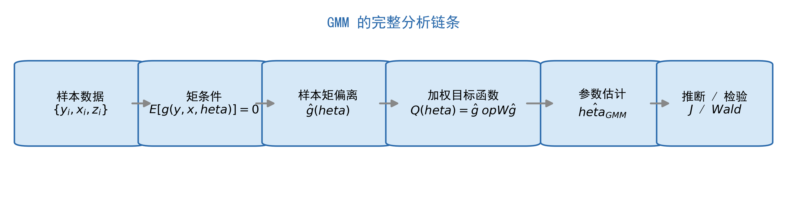
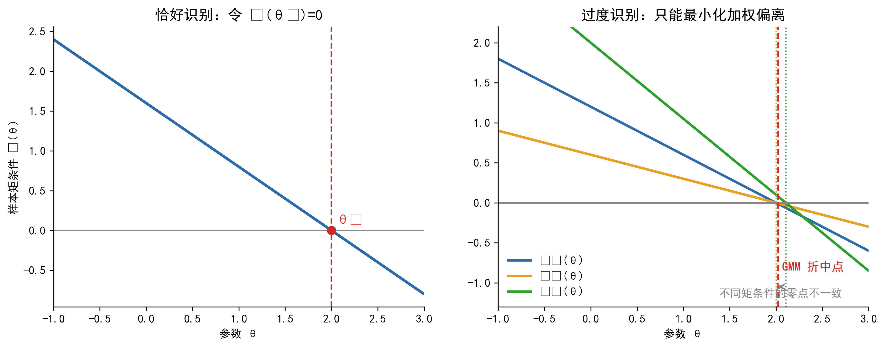
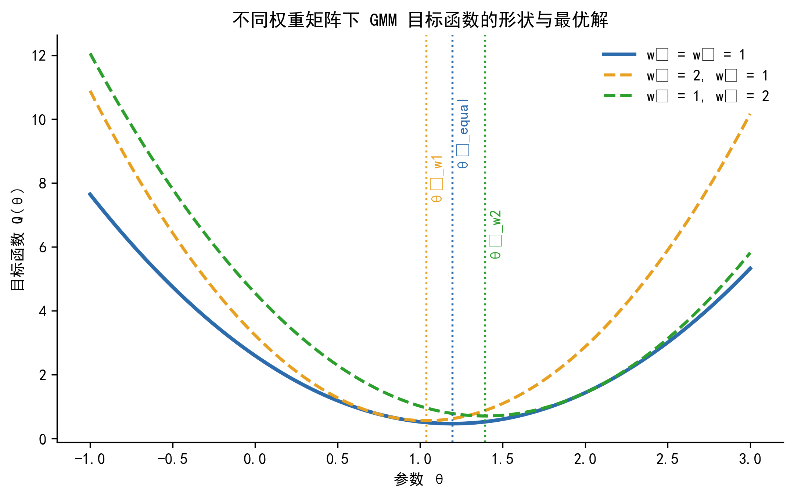

## 导言

在前一章里，我们是从分布假设出发理解估计问题的。只要写出 $y_i \mid x_i$ 的条件分布，似然函数就随之确定，MLE 便成为一个很自然的估计框架。GMM 的起点不一样。它不要求我们把数据的联合分布写完整，而是退回到一个更节制、也更常见的层面：只要理论或统计假设能够告诉我们某个期望应当为零，我们就已经拥有了可以估计参数的信息。

一个最熟悉的例子就是线性回归。OLS 能够一致地估计 $\beta$，依赖的不是正态性，而是更基础的正交条件 $E(x_i \varepsilon_i)=0$。当 $x_i$ 内生时，这个条件不再成立，我们转而寻找工具变量，并依赖新的条件 $E(z_i \varepsilon_i)=0$ 来识别参数。你在学习 OLS 和 IV 时，其实已经在使用矩条件，只是当时没有显式把它们统一到同一个框架里。

当矩条件数量恰好等于参数数量时，我们往往可以直接令样本矩等于零求解，这对应普通矩估计。当矩条件数量多于参数数量时，所有样本矩通常无法同时精确为零，于是问题变成：如何在多条约束之间做一个有原则的折中，找到“最接近满足全部矩条件”的那组参数值。这正是 GMM 要解决的问题。

{#fig-GMM-flowchart fig-alt="GMM 总流程图"}

GMM 的基本思想可以概括为一句话：用经济理论或统计假设告诉我们的矩条件来约束参数估计，找出使样本矩条件偏离最小的那组参数值。沿着这个逻辑继续向前走，读者还会看到第二个更重要的认识：OLS、IV、2SLS 都可以被看作 GMM 在不同矩条件和不同权重矩阵下的特例。理解了这个统一框架，再回头看经典估计量，许多看似分散的方法就会显得更整齐。

本章建议按顺序阅读前 7 节。第 8 节通过案例展示 GMM 的实际价值，第 9 节总结常见误区，第 10 节回到全章主线并与 MLE 做分工比较。

::: callout-note
### 本章学完后你能做什么

-   理解“GMM 只需要矩条件，而不必完整指定分布”意味着什么
-   看懂论文和软件输出中的 Hansen J、Sargan、两步 GMM、HAC 等术语
-   明白 2SLS 与有效 GMM 的差别不只在标准误，而在于权重矩阵如何利用矩条件的方差-协方差结构
-   对非线性 GMM、多方程 GMM 和动态面板中的 GMM 有一个统一认识
:::

## 为什么需要 GMM？

从教材顺序看，GMM 常常出现在 OLS、IV、MLE 之后；但从逻辑上看，它并不是“又一个新估计量”，而是一种更一般的组织方式。它把不同模型里看似分散的约束，统一写成“某个函数的期望应当等于零”，于是很多方法都能放到同一个语言体系下理解。

这一节不急于给出正式定义，而是先回答一个更实际的问题：在已经学过 OLS、IV 和 MLE 的前提下，为什么还需要 GMM？

### OLS 和 MLE 的共同前提

OLS 常被视为“弱假设”的代表，但这只是相对于完全参数化方法而言。它依赖的关键条件仍然相当具体：解释变量必须与误差项正交，而在经典推断里还常附带同方差或球形误差的设定。MLE 的要求更进一步。它不仅要求识别条件成立，还要求研究者完整指定 $y_i \mid x_i$ 的条件分布。

这意味着两种方法都在对数据生成过程作出比较强的判断。只是在很多应用中，我们对“分布长什么样”并没有足够信心，却仍然对某些均值、协方差或一阶条件有把握。GMM 恰好适用于这种“知道应当满足什么，但不愿过度承诺分布”的场景。

### 当这些前提不稳固时

在金融与宏观数据里，最常见的困难不是模型完全不可写，而是经典设定并不自然。收益率序列常呈厚尾与非正态，误差项常伴随异方差与序列相关，而理论模型给出的往往是一阶条件而不是完整分布。例如消费-资产定价模型告诉我们 Euler 方程应当成立，但并没有直接给出消费增长率与收益率的联合密度函数。

如果这时仍然坚持从完整分布出发，模型很快会变得脆弱。分布一旦写错，MLE 的效率优势未必能兑现，解释也会变得依赖设定。GMM 的思路则更节制：只提取理论里最关键、最可信的那部分约束来估计参数。

### 工具变量过度识别带来的信息组织问题

GMM 最直接的动机来自工具变量回归。设模型中只有一个内生变量，却有多个工具变量。此时我们实际上拥有多条正交条件，例如 $E(z_{1i}\varepsilon_i)=0$、$E(z_{2i}\varepsilon_i)=0$、$E(z_{3i}\varepsilon_i)=0$。这些条件都与参数有关，但它们的稳定性并不一定相同。

2SLS 的做法是先把工具变量空间投影为一个拟合值，再进入第二阶段回归。这样做当然是正确且一致的，但它并没有显式区分不同矩条件的方差大小与协方差关系。GMM 则把这些样本矩条件保留下来，直接最小化它们的加权偏离，于是“哪些约束更稳定、哪些约束更噪声大”可以通过权重矩阵进入估计过程。

### GMM 适合的三类典型任务

| 应用场景 | 典型例子 | GMM 相对其他方法的意义 |
|:-----------------------|:-----------------------|:-----------------------|
| 过度识别 IV 估计 | 多个工具变量对应一个或多个内生变量 | 系统利用全部矩条件，并可自然引入异方差或 HAC 权重 |
| 非线性理论约束 | Euler 方程、随机贴现因子约束 | 不必指定完整分布，直接用经济理论的一阶条件估计 |
| 多方程联合估计 | 横截面资产定价检验、动态面板 | 在统一框架下利用方程间的协方差结构，提高效率 |

::: callout-tip
### 本章学习目标

本章不要求你推导 GMM 的全部渐近理论，也不要求你手工证明最优性结论。更实际的目标是：看懂 GMM 在做什么，知道权重矩阵为什么重要，以及读懂软件输出中的核心统计量。
:::

## 矩条件：GMM 的语言

如果说似然函数是 MLE 的工作语言，那么矩条件就是 GMM 的工作语言。只要把模型中的关键假设写成“某个函数的期望等于零”，GMM 的入口就打开了。

这一节最重要的任务有三件：第一，说明矩条件究竟是什么；第二，说明矩条件从哪里来；第三，说明为什么过度识别时需要从“解方程”转向“最小化加权偏离”。

### 什么是矩条件

用最朴素的话说，矩条件是一句关于总体的声明：如果模型设定正确，并且参数取真值，那么某个函数的平均值应该为零。把这句话写成形式化表达，就是

$$
E[g(y_i, x_i, \theta_0)] = 0
$$ {#eq-moment-condition}

这里，$g(\cdot)$ 是根据理论或统计假设构造出来的函数，$\theta_0$ 是参数真值。这个表达式本身很一般。它既能容纳 OLS 中的 $E(x_i\varepsilon_i)=0$，也能容纳 IV 中的 $E(z_i\varepsilon_i)=0$，还可以容纳非线性模型里的 Euler 方程。

在直觉性叙述里，写成标量形式最容易理解。例如 $E(x_i\varepsilon_i)=0$ 强调的是“解释变量与误差项不相关”，而 $E(z_i\varepsilon_i)=0$ 强调的是“工具变量与结构误差项正交”。当进入向量形式时，我们再写成 $E(\mathbf{z}_i \varepsilon_i)=\mathbf{0}$，并明确说明这一个向量方程其实等价于若干个标量方程。

### 矩条件从哪里来

矩条件不是凭空指定的，它通常来自三类来源。第一类是正交性条件，也就是外生性或工具变量有效性这类假设。第二类是经济理论的一阶条件，例如最优化问题导出的 Euler 方程。第三类是更特殊的高阶矩或动态约束，例如测量误差模型里的高阶矩条件，或动态面板中滞后变量与差分误差项的正交关系。

| 来源类型 | 典型形式 | 例子 | 可检验性 |
|:-----------------|:-----------------|:-----------------|:-----------------|
| 正交性条件 | $E[z_i\varepsilon_i(\theta)] = 0$ | 工具变量外生性 | 过度识别时可做 J 检验 |
| 经济理论一阶条件 | $E[m(y_i, x_i, \theta)] = 0$ | Euler 方程、资产定价约束 | 过度识别时可做 J 检验 |
| 高阶矩约束 | $E[h(w_i,\theta)] = 0$ | Erickson-Whited 类测量误差识别 | 可做模型设定检验 |
| 动态滞后约束 | $E[y_{i,t-s}\Delta \varepsilon_{it}] = 0$ | Arellano-Bond 风格矩条件 | 常配合 Sargan 或 Hansen 检验 |

同一条矩条件是否可信，根本上取决于其背后的经济含义是否可信。J 检验可以帮助我们判断这些约束在总体上是否与数据相容，但它无法替我们识别“究竟哪一条工具变量不外生”，更不能替代对制度背景与识别逻辑的讨论。

### 样本矩与样本偏离

总体期望不可见，有限样本里只能用样本平均来近似。于是，我们把矩条件写成样本形式：

$$
\bar{g}(\theta) = \frac{1}{n}\sum_{i=1}^n g(y_i, x_i, \theta)
$$ {#eq-sample-moment}

当矩条件个数 $q$ 与参数个数 $k$ 相等时，只要模型可识别，往往可以直接解方程 $\bar{g}(\hat{\theta})=\mathbf{0}$。这时问题更像是“联立方程求解”。但当 $q>k$ 时，样本矩通常无法同时精确为零，因为样本噪声会让不同约束对参数提出略有冲突的要求。

{#fig-GMM-moments fig-alt="恰好识别与过度识别示意图"}

从几何上看，恰好识别更像“用 $k$ 个方程解 $k$ 个未知数”，而过度识别更像“用 $q$ 个方程去逼近 $k$ 个未知数”。后者通常没有精确解，因此必须先定义什么叫“离全部方程都尽量近”，这就把我们带到了 GMM 目标函数。

::: callout-warning
### 矩条件的个数不等于“越多越好”

更多的矩条件意味着潜在信息更多，但也意味着需要估计更高维的方差-协方差矩阵。样本量有限时，权重矩阵本身会带来额外噪声。因此，矩条件数量增加并不必然改善有限样本表现。
:::

## 从矩条件到 GMM 估计量

到这里为止，我们已经把“理论约束”转化为“样本矩偏离”。下一步要做的，是把一个向量形式的偏离压缩成一个可以优化的标量目标函数。这个目标函数既要反映所有矩条件，又要允许不同矩条件拥有不同的重要性。

GMM 的形式很简洁，但背后的含义并不只是一条公式。公式之前要先抓住一个直觉：GMM 不是在最小化单个误差，而是在最小化“多条约束共同的加权偏离”。

### GMM 目标函数

设 $\bar{g}(\theta)$ 是 $q \times 1$ 的样本矩均值向量。GMM 把它的加权平方长度定义为

$$
Q(\theta) = \bar{g}(\theta)^\top W \bar{g}(\theta)
$$ {#eq-gmm-objective}

于是，GMM 估计量被定义为

$$
\hat{\theta}_{GMM} = \arg\min_{\theta} \; Q(\theta)
$$

这里的 $W$ 是一个 $q \times q$ 的正定对称矩阵。它不是单纯的技术细节，而是在回答一个经济上很自然的问题：当不同矩条件彼此冲突时，我们更愿意向哪一类矩条件靠拢？如果某些矩条件波动特别大，它们就不宜在目标函数里占据过高权重；反过来，如果某些矩条件比较稳定，它们应当拥有更强的“拉力”。

### 目标函数的几何直觉

在二维情形下，$\bar{g}(\theta)$ 可以看作平面上的一个点。目标函数 $Q(\theta)$ 则相当于这个点到原点的加权距离平方。若 $W=I$，等高线是标准圆；若 $W$ 改变，等高线会被拉伸成不同方向的椭圆。于是，即便样本矩向量本身不变，最优参数也会因为权重矩阵不同而变化。

{#fig-GMM-objective fig-alt="不同权重下的 GMM 目标函数"}

这个图形背后的含义很重要。等权重时，GMM 对所有样本矩偏离一视同仁；最优权重时，稳定的矩条件会在优化中占据更大作用。因此，权重矩阵既影响效率，也帮助我们理解 GMM 与 2SLS 的实质差别。

### 线性 IV 模型中的 GMM 解

在线性模型里，若结构方程为 $y=X\theta+\varepsilon$，工具变量矩阵为 $Z$，那么样本矩向量可以写作 $\bar{g}(\theta)=Z^\top (y-X\theta)/n$。代入目标函数并对参数求导，可以得到线性 GMM 的闭式解：

$$
\hat{\theta}_{GMM} = (X^\top Z W Z^\top X)^{-1} X^\top Z W Z^\top y
$$ {#eq-gmm-linear}

这条公式最值得关注的不是“矩阵长得多复杂”，而是其中三个成分的分工。$X^\top Z$ 反映解释变量与工具变量之间的相关性，$W$ 决定这些相关性如何被加权整合，而整个逆矩阵部分则把这些信息转化为参数估计。对初学者而言，先抓住这三者各自扮演什么角色，比死记矩阵形式更重要。

### 一步 GMM 与两步 GMM

实践中最常见的是两类实现。一类是给定某个固定权重矩阵后直接估计，这通常被称为一步 GMM。另一类是先用一个简单的权重矩阵得到初步估计，再用该估计量构造更合理的方差-协方差矩阵，进而得到第二步估计，这就是两步 GMM。

两步 GMM 的流程可以写成：

1.  先取 $W^{(1)}$，常见选择是单位矩阵或与 $Z^\top Z/n$ 相关的简单矩阵，得到初步估计 $\hat{\theta}^{(1)}$。
2.  用 $\hat{\theta}^{(1)}$ 计算残差与每个观测的矩条件值，估计长期方差矩阵 $\hat{S}$。
3.  令 $W^{(2)}=\hat{S}^{-1}$，再次最小化目标函数，得到两步估计 $\hat{\theta}^{(2)}$。

::: callout-note
### 两步 GMM 的有限样本问题

两步 GMM 在渐近理论里具有最优性，但在有限样本中，第二步权重矩阵的估计误差会反过来污染参数估计和标准误。当矩条件数量偏多时，这个问题尤其明显。因此，经验研究里常把两步 GMM 与 CUE、LIML 或工具变量缩减方案一起报告。
:::

## 2SLS 与 GMM：「提取信息」vs.「加权偏离」

这一节的目的不是重复 IV 基础，而是把 2SLS 与 GMM 放到同一张图纸上比较。很多学生第一次接触 GMM 时，会把它理解为“带 robust 标准误的 2SLS”。这种理解太窄了。两者的共同点是都建立在工具变量正交条件上，但它们处理过度识别信息的方式并不相同。

更准确地说，2SLS 的直觉重点是“先用工具变量提取解释变量中的外生成分”，而 GMM 的直觉重点是“直接对多条矩条件的偏离做加权最小化”。

### 2SLS 的逻辑：先投影，再回归

考虑一个简单场景：$y_i = x_i\beta + \varepsilon_i$，其中 $x_i$ 内生，我们手里有三个工具变量 $z_{1i}, z_{2i}, z_{3i}$。2SLS 先做第一阶段回归，把 $x$ 投影到工具变量空间，构造拟合值

$$
\hat{x} = Z(Z^\top Z)^{-1}Z^\top x
$$

然后第二阶段用 $\hat{x}$ 替代原始的 $x$ 做回归。这个思路非常清楚：工具变量用于清洗掉 $x$ 中与结构误差相关的内生部分，只保留能够由外生工具解释的那部分变异。

这样做的好处是实现简单、解释直接，而且在同方差条件下与有效 GMM 一致。但它没有显式把每条矩条件单独保留下来，更没有直接对矩条件之间的方差与协方差结构进行加权。

### GMM 的逻辑：保留矩条件，再做加权

在同一个场景下，GMM 会把三条矩条件写成

$$
\bar{g}_j(\theta)=\frac{1}{n}\sum_{i=1}^n z_{ji}\varepsilon_i(\theta), \qquad j=1,2,3
$$

再把它们堆叠成一个向量 $\bar{g}(\theta)$，并最小化 $Q(\theta)=\bar{g}(\theta)^\top W \bar{g}(\theta)$。这里的差别在于，GMM 并不先把工具变量合成为一个拟合值，而是把每条矩条件都留下来，通过 $W$ 决定它们对最终估计量的影响大小。

{#fig-GMM-2sls fig-alt="2SLS 与 GMM 权重机制对比"}

### 权重矩阵究竟在做什么

在异方差稳健版本下，权重矩阵通常取为样本长期方差矩阵的逆，即 $W=\hat{S}^{-1}$。其中

$$
\hat{S} = \frac{1}{n}\sum_{i=1}^n g_i g_i^\top
$$

是基于观测层面的矩条件向量 $g_i$ 构造出来的方差-协方差矩阵。它的对角元素度量每个矩条件自身的波动，非对角元素度量不同矩条件之间的协动。

::: callout-important
### GMM 权重矩阵的精髓

权重矩阵的含义不是“GMM 会自动识别哪个工具变量更外生”，而是：方差较小、协方差结构更稳定的矩条件，在优化时通常会得到更高权重；波动很大的矩条件，其影响则会被压低。GMM 调整的是统计上的稳定性，而不是经济上的有效性判断。
:::

### 什么时候 2SLS 与有效 GMM 相同

当误差项同方差且无序列相关时，2SLS 所对应的权重矩阵与最优权重矩阵在渐近意义下等价。此时，2SLS 与有效 GMM 会给出相同的系数估计和相同的标准误。

但这个条件在金融和宏观数据中往往并不自然。误差项一旦存在异方差或序列相关，2SLS 仍然是一致的，可是未必有效。此时，GMM 的优势主要体现在效率与统一框架上，而不只是“把标准误改 robust”这么简单。

::: callout-tip
### 提示词：理解 2SLS 与 GMM 的区别

> 我有一个内生变量和四个工具变量。请用直觉语言解释：2SLS 如何利用这些工具变量？有效 GMM 又如何利用它们？为什么两者在异方差场景下会给出不同的标准误和不同的过度识别检验结论？
:::

## OLS、IV、2SLS 都是 GMM 的特例

前一节强调的是 2SLS 与 GMM 的差别，但如果只停在差别上，读者容易误以为 GMM 与经典方法是彼此割裂的。更完整的认识是：GMM 不是 2SLS 的竞争对手，而是一个更一般的外层框架。它既能容纳 OLS，也能容纳恰好识别的 IV 和过度识别的 2SLS。

一旦理解这一点，很多方法之间的关系就会变得更清楚：差别并不在“是否属于 GMM”，而在“用了什么矩条件”和“用了什么权重矩阵”。

### 统一框架表

| 估计量 | 矩条件 $g_i(\theta)$ | 识别状态 | 权重矩阵 $W$ | 等价条件 |
|:--------------|:--------------|:--------------|:--------------|:--------------|
| OLS | $x_i(y_i-x_i^\top\beta)$ | 恰好识别 | 不重要 | 解释变量外生 |
| IV（恰好识别） | $z_i(y_i-x_i^\top\beta)$ | 恰好识别 | 不重要 | 工具变量外生且相关 |
| 2SLS | $z_i(y_i-x_i^\top\beta)$ | 过度识别 | $(Z^\top Z/n)^{-1}$ | 同方差时与有效 GMM 等价 |
| 有效 GMM | $z_i(y_i-x_i^\top\beta)$ | 过度识别 | $\hat{S}^{-1}$ | 无需额外分布假设 |

### 恰好识别时为什么权重不重要

当 $q=k$ 时，如果存在唯一解使得 $\bar{g}(\hat{\theta})=\mathbf{0}$，那么无论权重矩阵如何选择，目标函数在该点都达到零。因此，恰好识别时权重矩阵并不改变估计结果。OLS 与恰好识别 IV 之所以能被看作 GMM 特例，关键就在这里。

这也解释了为什么很多初学者在刚接触 GMM 时会觉得“看起来和 IV 没什么不同”。因为在恰好识别的场景下，GMM 的一般性暂时没有完全显露出来。真正需要关心权重矩阵的，是过度识别而非恰好识别。

### 2SLS 是 GMM 特例，但不是“有效 GMM”的同义词

过度识别时，事情开始变化。此时目标函数不可能在所有矩条件上都精确为零，权重矩阵就会影响最优折中点。2SLS 相当于在线性 IV 模型里选用了一个特定的权重矩阵；有效 GMM 则进一步把矩条件的方差-协方差结构纳入进去。

::: callout-important
### 核心结论

OLS、IV、2SLS 都可以被写成 GMM。GMM 的一般性不在于“又多了一种估计量”，而在于它通过统一的矩条件与权重矩阵语言，把很多经典估计量组织到同一个框架里。理解这一点，比单独记住任何一条公式都更重要。
:::

::: callout-tip
### 提示词：验证 OLS 是 GMM 特例

> 请用 Python 生成一个没有内生性的简单线性回归样本，分别用 OLS 和以 $E[x_i(y_i-x_i^\top\beta)]=0$ 为矩条件的 GMM 估计参数，并比较两者的估计结果。为什么在这个场景下权重矩阵不会改变答案？
:::

## 最优权重矩阵与有效性

到目前为止，我们已经知道权重矩阵会影响过度识别场景下的估计结果。接下来的问题是：什么样的权重矩阵才是“好的”？为什么文献里会反复强调 $W=\hat{S}^{-1}$ 是最优选择？

这一节不追求完整证明，而是强调两个直觉。第一，权重矩阵是在模仿加权最小二乘的思想；第二，最优权重来自样本矩均值的方差-协方差结构，而不是来自某种主观判断。

### 为什么权重矩阵会影响效率

加权最小二乘的经验告诉我们：如果不同观测的噪声程度不同，让更精确的观测拥有更大权重，估计量通常会更有效。GMM 的情形与此非常相似，只不过“被加权的对象”不是观测值，而是矩条件本身。

若某个矩条件波动很大，它对参数的约束就不够稳定；若某些矩条件彼此高度相关，简单叠加它们会把相同信息重复计算。最优权重矩阵的作用，就是在这两方面做校正。

### 长期方差矩阵的定义

样本矩均值的长期方差矩阵记为 $S$。它可以写成

$$
S = \lim_{n\to\infty} n \cdot \operatorname{Var}[\bar{g}(\theta_0)]
  = \sum_{j=-\infty}^{\infty} E[g_i g_{i-j}^\top]
$$ {#eq-S-matrix}

这个表达式看上去比前面的公式更抽象，但含义并不复杂。它度量的是：当样本量增大时，样本矩均值向量还会保留多大的随机波动。其中不只包含各矩条件自身的方差，也包含不同矩条件之间的协方差，以及时间序列场景下的序列相关。

### 三类常见设定下的 $\hat{S}$

| 误差结构 | $\hat{S}$ 的常见估计 | 典型软件设定 |
|:-----------------------|:-----------------------|:-----------------------|
| 同方差、无序列相关 | $\hat{\sigma}^2 (Z^\top Z / n)$ | 与经典 2SLS 对应 |
| 异方差、无序列相关 | $\frac{1}{n}\sum_i \hat{\varepsilon}_i^2 z_i z_i^\top$ | `robust` 或 White 设定 |
| 异方差且有序列相关 | HAC / Newey-West 型估计 | `cov_type='kernel'` 或 HAC 选项 |

在横截面 IV 回归里，最常用的是异方差稳健版本；在时间序列和资产定价问题里，则常需要 HAC 版本，以便把序列相关纳入权重矩阵。

### 矩条件数量与有限样本精度的权衡

一个经常被忽略的问题是：最优权重矩阵本身也要靠样本估计。矩条件越多，$\hat{S}$ 越高维，逆矩阵越不稳定。在大样本下，这不是根本障碍；但在有限样本里，它可能明显恶化表现。

{#fig-GMM-efficiency fig-alt="不同估计量的有限样本分布对比"}

因此，研究者并不是“工具变量越多越好”。如果工具变量数量过多，或者矩条件过于冗余，第二步权重矩阵估计误差会迅速放大，进而把有限样本偏误推高。

::: callout-warning
### 矩条件不是越多越好

更多矩条件在渐近意义下可能提高效率，但在有限样本里也会让 $\hat{S}^{-1}$ 的估计变得更困难。经验研究里，过多工具变量往往会让两步 GMM 朝 OLS 方向偏移，并削弱 Hansen J 检验的识别能力。
:::

### 关于矩条件选择

更进一步的问题是：如果手里有一大组候选矩条件，是否应该全部放进去？答案通常是否定的。矩条件选择本身就是一个设计问题。文献中有 Andrews 风格的信息准则，也有更直接的经验策略，例如缩减工具变量维度、合并滞后项、或改用 LIML 与 Fuller 这类对工具变量增殖更稳健的方法。

::: callout-tip
### 提示词：理解“最优”不等于“无限多”

> 请解释为什么 GMM 的最优权重矩阵并不意味着应该把所有可能的矩条件都放进模型。矩条件数量增加时，效率提升与有限样本偏误之间存在哪种权衡？
:::

## 推断：Sargan 检验、Hansen J 检验与参数检验

很多学生第一次看到 GMM 输出时，最困惑的不是系数本身，而是一长串检验统计量：Sargan、Hansen J、Durbin-Wu-Hausman、Wald、C 检验。它们都与“矩条件是否合理”有关，但关注点并不完全相同。

这一节的目标很实际：让你看到软件输出时，知道每个统计量在回答什么问题，以及在什么场景下该优先看哪一个。

### 过度识别检验的直觉

如果所有矩条件都成立，那么在真参数附近，样本矩均值 $\bar{g}(\hat{\theta})$ 应当足够接近零。反过来，如果在估计后的参数处，这些样本矩仍然系统性偏离零，那么就说明至少有一部分矩条件与数据不相容。

基于这个思路，过度识别检验通常写成

$$
J = n \cdot \bar{g}(\hat{\theta})^\top \hat{W}\bar{g}(\hat{\theta})
\sim \chi^2(q-k)
$$ {#eq-J-stat}

其中，自由度 $q-k$ 就是“矩条件数减去参数数”，也即过度识别约束的个数。这个统计量本质上是在问：估计完参数以后，剩余的样本矩偏离是否大到不能被抽样误差解释？

### Sargan 与 Hansen J 的区别

二者形式相似，但适用场景不同。最简单的记忆方法是：Sargan 假定同方差，Hansen J 允许异方差与更一般的稳健设定。

| 检验名称 | 权重或协方差设定 | 推荐场景 | 主要问题 |
|:-----------------|:-----------------|:-----------------|:-----------------|
| Sargan 检验 | 基于同方差设定 | 误差项近似同方差时 | 异方差下容易尺寸扭曲 |
| Hansen J 检验 | 基于稳健或 HAC 权重 | 异方差、序列相关场景 | 弱工具变量或过多工具变量时可能检验力不足 |

若回归中已经使用了异方差稳健标准误，那么逻辑上也应当使用与之配套的 Hansen J，而不是继续依赖 Sargan。二者若给出截然不同的结论，往往恰恰说明同方差假设并不可信。

::: callout-warning
### Sargan 检验在异方差下不可靠

在异方差场景下，Sargan 检验常出现过度拒绝。也就是说，即便工具变量总体上有效，它也可能因为错误的同方差设定而给出过强的拒绝信号。经验研究里，一旦报告 `robust` 标准误，通常就应优先解读 Hansen J。
:::

::: callout-note
### 动态面板中的 Sargan 与 Hansen

在 `xtabond2` 一类动态面板输出中，Sargan 与 Hansen J 常同时出现。若使用了 `robust` 选项，应主要关注 Hansen J；同时还要警惕工具变量数量过多导致 Hansen 检验“过于宽松”的问题。
:::

### J 检验能做什么，不能做什么

J 检验检验的是矩条件的联合有效性，而不是逐条定位。若拒绝原假设，只能说明“至少有一部分矩条件有问题”，却不能直接告诉你是哪一条工具变量不外生。若不拒绝原假设，也不能反向证明工具变量一定有效，因为弱工具变量与过多工具变量都会降低检验力。

在需要比较额外一组矩条件是否合理时，可以考虑 Difference-in-Sargan 或 C 检验。它通过比较受限模型与非受限模型的 J 统计量差值，来检验“新增的那部分矩条件是否站得住脚”。

### 参数的 Wald 检验

GMM 的参数估计量在标准正则条件下具有渐近正态性，因此参数显著性检验仍然可以用 Wald 统计量来完成：

$$
W = (\hat{\theta}-\theta_0)^\top [\operatorname{Var}(\hat{\theta})]^{-1} (\hat{\theta}-\theta_0)
\sim \chi^2(k)
$$ {#eq-Wald}

它回答的是“参数本身是否等于某个给定值”，与 J 检验回答的“矩条件整体是否相容”不是一个层面的问题。前者检验参数限制，后者检验识别约束。

### 软件输出示例与解读

下面是一段典型的 IV-GMM 输出示意：

``` text
                          IV-GMM Estimation Summary
==============================================================================
Dep. Variable:                      y   R-squared:                      0.312
Estimator:                     IV-GMM   Adj. R-squared:                 0.310
No. Observations:                 500   F-statistic:                   112.34
Cov. Estimator:                 robust

                              Parameter Estimates
==============================================================================
            Parameter  Std. Err.     T-stat    P-value    Lower CI    Upper CI
------------------------------------------------------------------------------
const          1.0234     0.0891    11.4870     0.0000      0.8488      1.1980
x1             1.9876     0.1102    18.0360     0.0000      1.7716      2.2036
x2            -0.4923     0.0897    -5.4883     0.0000     -0.6681     -0.3165
==============================================================================

Instrument Tests
==============================================================================
Hansen J-statistic:        2.1034  (p-value: 0.3491)
Sargan statistic:          3.2218  (p-value: 0.1994)
Durbin-Wu-Hausman:         8.9721  (p-value: 0.0113)
==============================================================================
```

解读时可以分三步。第一，看系数与稳健标准误，这是参数层面的结论。第二，看 Hansen J，它告诉我们过度识别约束是否总体上与数据相容。第三，看 Durbin-Wu-Hausman，它在比较“将变量视为外生”与“将变量视为内生”两种设定是否有系统差异；若显著，说明使用 IV 或 GMM 是有必要的。

::: {.callout-note collapse="true"}
### Stata 输出对照（ivreg2）

``` stata
. ivreg2 y (x1 x2 = z1 z2 z3 z4), gmm2s robust

Hansen J statistic (overidentification test of all instruments):  2.103
                                                Chi-sq(2) P-val =  0.3492

-endog- option:
Endogeneity test of endogenous regressors:       8.972
                                            Chi-sq(2) P-val =  0.0113
```

> **说明**：`ivreg2, gmm2s robust` 对应异方差稳健的两步 GMM。此时应优先解读 Hansen J，而非 Sargan。
:::

## GMM 的核心应用场景

前面的各节主要在讲方法本身。这一节则把视角转向应用：到底在哪些问题里，GMM 的框架优势会真正显现出来？这里不追求面面俱到，而是抓住三类最有代表性的任务。

这些场景分别对应本章的三条主线：过度识别信息如何组织，非线性理论约束如何估计，以及多方程信息如何联合利用。

### 过度识别 IV 与异方差：有效 GMM vs. 2SLS

这是最贴近应用计量课程的入口。设一个内生变量有多于一个的工具变量，同时误差项存在异方差。此时，2SLS 与有效 GMM 的系数往往接近，因为两者都一致；但标准误和过度识别检验可能明显不同。

在这样的案例里，GMM 的意义不在于“把点估计变得天翻地覆”，而在于更系统地利用矩条件结构，使推断更稳健、效率更高。配套 notebook 的 Case 1 就围绕这个场景展开，读者可以直接比较 2SLS、2SLS-robust 与两步 GMM 的系数、标准误以及 Sargan 与 Hansen J 的差别。

### Euler 方程：非线性 GMM 的自然舞台

很多金融与宏观理论不会直接告诉我们因变量服从什么分布，却会告诉我们一阶最优条件必须成立。CRRA 效用下的消费 Euler 方程就是最典型的例子。它可以写成

$$
E_t\left[\beta \left(\frac{c_{t+1}}{c_t}\right)^{-\gamma} R_{t+1} - 1 \,\middle|\, z_t\right] = 0
$$ {#eq-euler}

这里，$\beta$ 是贴现因子，$\gamma$ 是相对风险厌恶系数，$R_{t+1}$ 是总收益率，$z_t$ 是信息集中的工具变量。这个方程天然就是一个矩条件。只要我们相信最优化条件近似成立，就可以直接据此构造 GMM 估计，而不必进一步指定 $\Delta c_t$ 与 $R_t$ 的联合分布。

这正是 GMM 相对 MLE 特别自然的地方：当“理论约束很强、分布设定很弱”时，GMM 往往比完整参数化方法更合适。Case 2a 与 Case 2b 分别用模拟数据和真实数据演示这一点。

### 多方程资产定价检验

在横截面资产定价中，我们通常面对的不止一条方程，而是一组资产组合共同生成的矩条件。若逐资产单独回归，然后再做第二步横截面回归，很多信息会被拆散；而 GMM 可以直接把多资产的矩条件堆叠起来，并利用误差项之间的截面相关性构造更合理的权重矩阵。

在这种意义上，GMM 不只是“估计一个系数”，而是在统一框架里组织多方程信息。Case 3 的目的，就是帮助读者理解为什么 Fama-MacBeth 与多方程 GMM 虽然都在估计风险溢价，但它们对误差协方差结构的利用程度并不相同。

### 高阶矩与测量误差：Erickson-Whited 路线

还有一类很有启发性的场景，是外部工具变量难找，但研究者又怀疑关键解释变量存在经典测量误差。例如投资-Q 关系中，Tobin's Q 常只是投资机会的噪声代理。此时可以借助高阶矩或高阶累积量构造额外矩条件，在不引入外部工具变量的前提下识别参数。

这一路线的核心不在本章展开推导，而在于让读者意识到：GMM 的“矩条件”并不局限于一阶正交性。只要理论或统计结构能稳定地产生某种均值为零的约束，GMM 就有可能成为估计工具。

::: callout-note
### Erickson-Whited 路线的关键词

-   适用场景：关键解释变量存在经典测量误差，且缺少可信的外部工具变量
-   思路：利用高阶矩或高阶累积量构造额外识别约束
-   局限：依赖非正态性，高阶矩对厚尾分布与有限样本更敏感
-   常见实现：Stata 中可参考 `ewreg`，Python 侧通常需要手工构造目标函数
:::

## 使用 GMM 时的常见问题

学会写出 GMM 目标函数并不等于真正会用 GMM。经验研究里，很多问题并不是由公式本身造成的，而是由工具变量强度、矩条件数量、有限样本规模和检验解释不当带来的。

这一节不再给出大段推导，而是用“症状—原因—处理思路”的方式，总结最常见的几个陷阱。

### 弱工具变量

如果工具变量与内生变量相关性很弱，那么无论是 2SLS 还是 GMM，都会遭遇大方差与糟糕的有限样本近似。此时，点估计可能明显不稳定，Wald 型推断也会失真。经验上，一阶段 F 统计量、Cragg-Donald 统计量与 Stock-Yogo 临界值仍然是基本诊断工具。

处理思路通常不是“继续堆工具变量”，而是改进识别设计，或改用对弱工具变量更稳健的推断方法，例如 Anderson-Rubin 检验、CLR 检验，以及 LIML、Fuller 这类替代估计量。

### 过多工具变量或过多矩条件

这与弱工具变量是另一种常见病。即便每个工具变量都不是很弱，只要数量太多，第二步 GMM 估计权重矩阵时就会变得不稳定，结果是系数向 OLS 方向偏移，Hansen J 检验也可能变得异常宽松。

在动态面板里，这个问题尤其突出，因为滞后项工具变量会指数式膨胀。经验上，与其盲目追求更多矩条件，不如通过折叠工具变量、限制滞后阶数或做维度缩减来控制复杂度。

### J 检验通过并不等于工具变量有效

很多实证写作里会把“未拒绝 Hansen J”写成“证明工具变量有效”。这种表述太强。J 检验只能说明样本并未提供足够证据拒绝矩条件的联合有效性，它不能替代制度背景与经济机制的论证，更不能在弱工具变量环境下提供强有力保证。

因此，J 检验更像一个必要但不充分的辅助诊断，而不是识别有效性的终局判决。

### 混淆 Sargan 与 Hansen

如果回归里已经使用了异方差稳健标准误，却仍然只报告 Sargan 而不报告 Hansen J，那么结论很可能不完整。反过来，如果 Hansen 与 Sargan 明显冲突，研究者更应该先检查误差结构是否违背了同方差假设，而不是简单地在两者之间“挑一个喜欢的”。

### 两步 GMM 的有限样本扭曲

两步 GMM 的渐近性质很好，但小样本里不一定稳定。常见表现是标准误偏小、过度拒绝、对矩条件数量很敏感。此时，报告一步 GMM、CUE、LIML 或者做工具变量压缩，往往比机械地坚持“两步最优”更有意义。

### 非线性 GMM 的数值收敛问题

在非线性 GMM 里，估计通常要依赖数值优化。若目标函数表面较平坦，或参数空间存在多个局部极小值，结果就会对初始值敏感。处理方法包括：使用多组起点、对参数做合理重参数化、画出目标函数轮廓图观察识别强弱，并在必要时报告数值优化的稳健性检查。

## 小结：GMM 作为统一估计框架

经过前面各节，我们可以回到最初那条主线：理论先给出矩条件，样本把它们转化为样本矩偏离，研究者再通过权重矩阵把多条约束压缩为一个目标函数，最终得到参数估计并完成检验与推断。GMM 的一般性，就体现在这条链条能够容纳许多看似不同的方法。

换句话说，GMM 的核心思想仍然是：用经济理论或统计假设告诉我们的矩条件来约束参数估计，找出使样本矩条件偏离最小的那组参数值。而 OLS、IV、2SLS 都可以被放进这个统一框架里；理解了权重矩阵的构造逻辑，也就理解了 GMM 相对 2SLS 的关键增益。

{#fig-GMM-flowchart-2 fig-alt="GMM 总流程图再次引用"}

### 统一框架表

| 方法 | 矩条件来源 | 识别状态 | 权重矩阵 | 典型场景 |
|:--------------|:--------------|:--------------|:--------------|:--------------|
| OLS | 解释变量外生性 | 恰好识别 | 不重要 | 无内生性的线性回归 |
| IV | 工具变量正交性 | 恰好识别 | 不重要 | 单工具变量识别 |
| 2SLS | 工具变量正交性 | 过度识别 | $(Z^\top Z/n)^{-1}$ | 多工具变量且误差近似同方差 |
| 有效 GMM | 工具变量正交性 | 过度识别 | $\hat{S}^{-1}$ | 多工具变量、异方差或 HAC 场景 |
| 非线性 GMM | 理论一阶条件 | 过度识别 | $\hat{S}^{-1}$ | Euler 方程、随机贴现因子估计 |
| 多方程 GMM | 多资产或多方程正交性 | 过度识别 | 由联合协方差结构决定 | 资产定价、动态面板 |

### GMM 与 MLE 的分工

| 情形 | 更自然的框架 | 原因 |
|:-----------------------|:-----------------------|:-----------------------|
| 条件分布可可信地完整指定，且有限样本效率很重要 | MLE | 分布信息可以被充分利用 |
| 只知道若干均值、协方差或一阶条件，不愿强加完整分布 | GMM | 只依赖矩条件，更节制也更稳健 |
| 非线性模型，但理论只给出 FOC 或正交条件 | GMM | 不必额外指定联合分布 |
| 多工具变量且存在异方差或序列相关 | GMM | 可用稳健或 HAC 权重组织矩条件 |
| 样本很小，且参数化分布可信 | MLE 往往更有吸引力 | GMM 的渐近近似可能偏慢 |

本章之后，GMM 的另一个重要应用会出现在动态面板章节。那时，新的难点不再是“什么叫矩条件”，而是“如何从面板结构中系统构造可用的工具变量”。一旦这一步完成，后续估计与检验的逻辑，与本章其实是一致的。

## 参考资料

### 奠基论文

-   Hansen, L. P. (1982). *Large sample properties of generalized method of moments estimators*. Econometrica, 50(4), 1029–1054. [Link](https://doi.org/10.2307/1912775), [Google](https://scholar.google.com/scholar?q=Large+sample+properties+of+generalized+method+of+moments+estimators).\
-   Hansen, L. P., & Singleton, K. J. (1982). *Generalized instrumental variables estimation of nonlinear rational expectations models*. Econometrica, 50(5), 1269–1286. [Link](https://doi.org/10.2307/1911873), [Google](https://scholar.google.com/scholar?q=Generalized+instrumental+variables+estimation+of+nonlinear+rational+expectations+models).

### 测量误差与高阶矩

-   Erickson, T., & Whited, T. M. (2000). *Measurement error and the relationship between investment and q*. Journal of Political Economy, 108(5), 1027–1057. [Link](https://doi.org/10.1086/317670), [PDF](https://www.journals.uchicago.edu/doi/pdf/10.1086/317670), [Google](https://scholar.google.com/scholar?q=Measurement+error+and+the+relationship+between+investment+and+q).\
-   Erickson, T., Jiang, C. H., & Whited, T. M. (2014). *Minimum distance estimation of the errors-in-variables model using linear cumulant equations*. Journal of Econometrics, 183(2), 211–221. [Link](https://doi.org/10.1016/j.jeconom.2014.05.011), [Google](https://scholar.google.com/scholar?q=Minimum+distance+estimation+of+the+errors-in-variables+model+using+linear+cumulant+equations).

### 软件与实现

-   Baum, C. F., Schaffer, M. E., & Stillman, S. (2003). *Instrumental variables and GMM: Estimation and testing*. Stata Journal, 3(1), 1–31. [Link](https://doi.org/10.1177/1536867X0300300101), [PDF](https://journals.sagepub.com/doi/pdf/10.1177/1536867X0300300101), [Google](https://scholar.google.com/scholar?q=Instrumental+variables+and+GMM%3A+Estimation+and+testing).\
-   Roodman, D. (2009). *A note on the theme of too many instruments*. Oxford Bulletin of Economics and Statistics, 71(1), 135–158. [Link](https://doi.org/10.1111/j.1468-0084.2008.00542.x), [PDF](https://onlinelibrary.wiley.com/doi/pdf/10.1111/j.1468-0084.2008.00542.x), [Google](https://scholar.google.com/scholar?q=A+note+on+the+theme+of+too+many+instruments).

### 教材

-   Hall, A. R. (2005). *Generalized Method of Moments*. Oxford University Press. [Google](https://scholar.google.com/scholar?q=Generalized+Method+of+Moments+Hall).\
-   Greene, W. H. (2012). *Econometric Analysis* (7th ed.). Pearson. [Google](https://scholar.google.com/scholar?q=Greene+Econometric+Analysis+7th+edition).\
-   Cameron, A. C., & Trivedi, P. K. (2005). *Microeconometrics: Methods and Applications*. Cambridge University Press. [Google](https://scholar.google.com/scholar?q=Microeconometrics+Methods+and+Applications+Cameron+Trivedi).