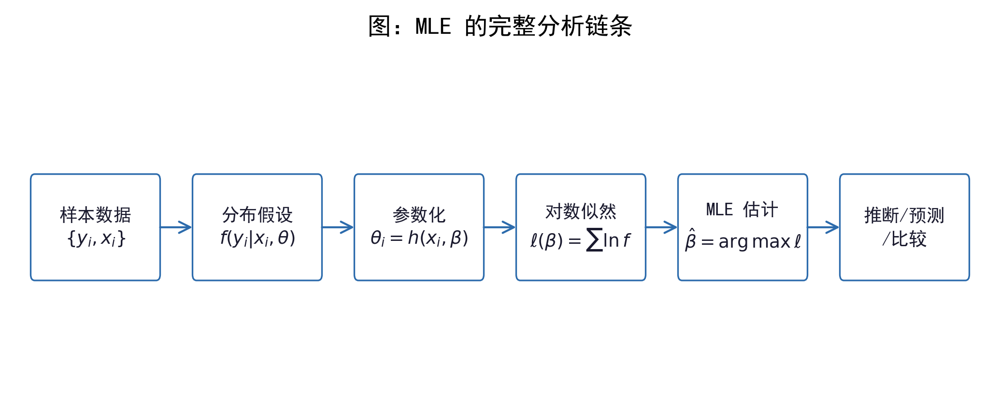
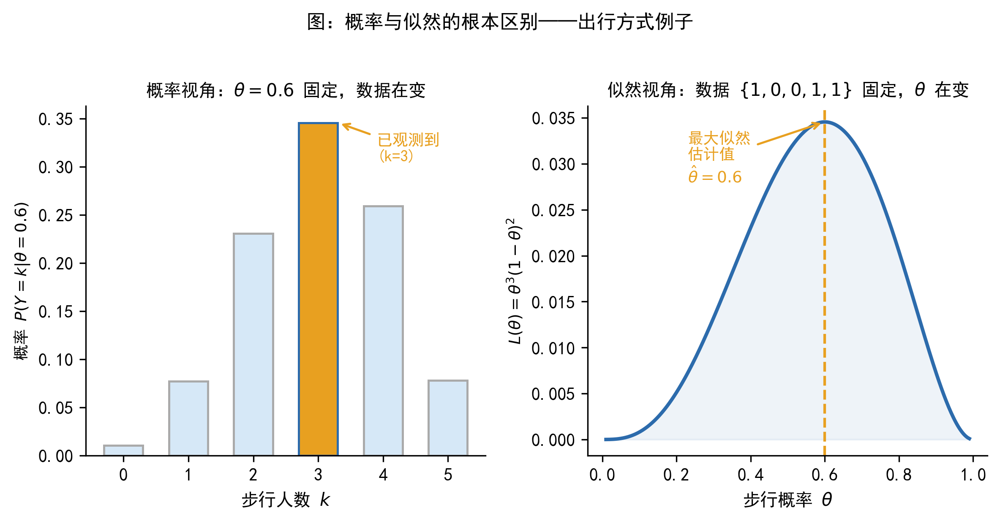
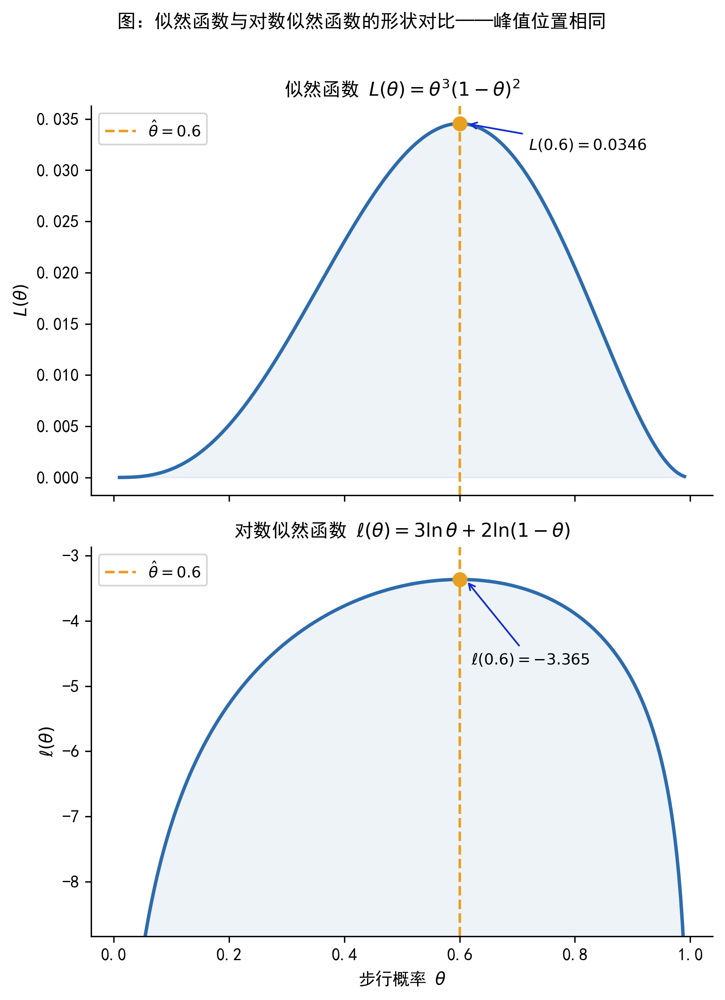
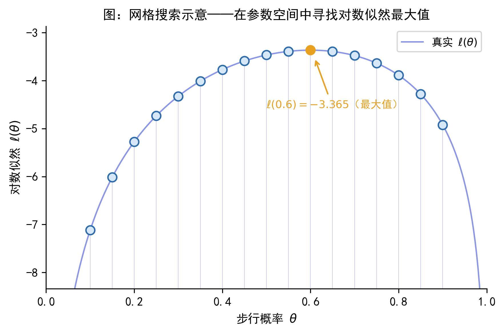
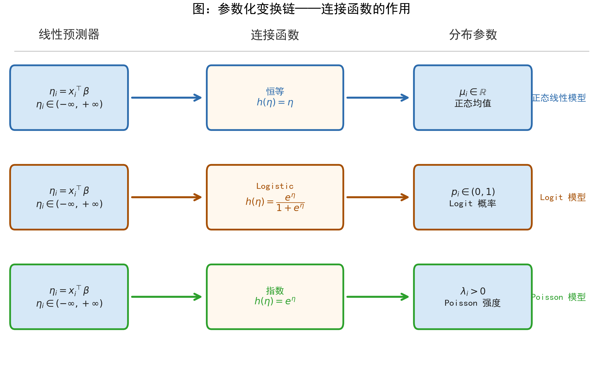
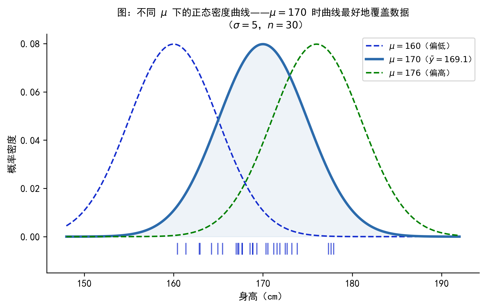
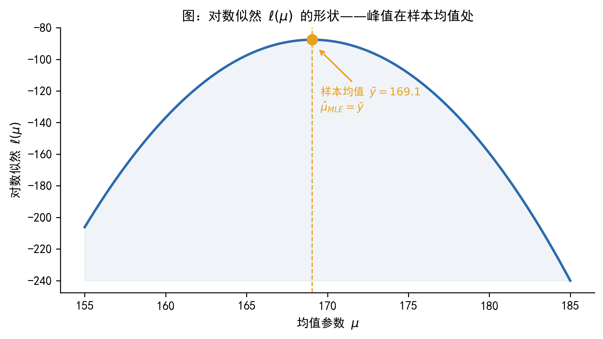
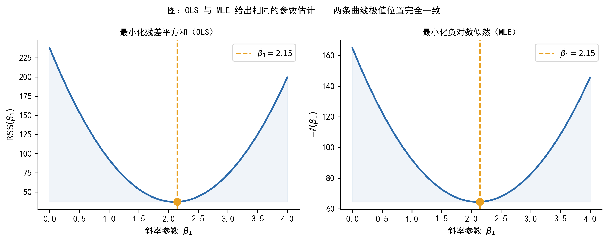

# 最大似然估计 (MLE)

## 导言

学过线性回归的同学可能都有这样的经历：拿到一份数据，建好模型，用 OLS 一敲，系数就出来了。这套流程非常顺畅，以至于我们很少停下来思考一个问题——如果因变量不是连续的，OLS 还适用吗？

比如，你想预测某位客户是否会违约（结果只有「是」和「否」两种），或者想分析某支股票在一个月内被分析师发布研报的次数（结果是 0、1、2、3……这样的整数）。把 OLS 硬套上去，给出的预测值可能是 1.3 或者 -0.2——这显然不是合格的「概率」，也不是合法的「次数」。

这类问题在金融和经济学研究中极为常见。而解决它们的核心工具，几乎都指向同一种估计方法：**最大似然估计**（Maximum Likelihood Estimation，MLE）。

本章的目标不是带大家推导公式，也不是要大家自己编程实现 MLE。我们的目标是建立一条完整的分析链条：

$$
\text{样本数据} \;\rightarrow\; \text{分布假设} \;\rightarrow\; \text{参数化} \;\rightarrow\; \text{似然函数} \;\rightarrow\; \hat{\theta}_{MLE} \;\rightarrow\; \text{推断与预测}
$$

读完这一章，你应当能够理解「Logit 模型用 MLE 估计」这句话背后的逻辑，能够看懂软件输出中的 `Log-Likelihood`、`LR chi2`、`AIC` 等指标，也能对后续将要学习的 Probit、Tobit、Poisson、Heckman 等模型有一个统一的认识框架。

本章按「动机 → 概念 → 例子 → 流程 → 读懂输出 → 注意事项」逐步推进，建议顺序阅读前六节；第七、八节在遇到实际软件操作时按需查阅。

::: callout-note
### 本章学完后你能做什么

-   理解「Logit 模型用 MLE 估计」是什么意思
-   看懂 Python/Stata 输出中的 `Log-Likelihood`、`LR chi2`、`AIC`
-   理解边际效应（marginal effect）和预测概率（predicted probability）是从哪里来的
-   为后续 Probit、Tobit、Poisson、Heckman 等模型的学习做好准备
:::

------------------------------------------------------------------------

## 为什么需要最大似然估计

### OLS 的舒适区与局限

线性回归是大多数人接触计量经济学的第一站。它的基本形式是：

$$
y_i = x_i^\top\beta + \varepsilon_i
$$

目标是估计条件均值 $E(y_i \mid x_i) = x_i^\top\beta$，使用的估计方法是最小化残差平方和（OLS）。在因变量连续、误差项大致满足正态分布的场景下，OLS 给我们一条「最优直线」，并且具备很好的统计性质。

然而，OLS 的适用范围是有边界的。下表列出了三类在金融和经济学研究中非常常见的因变量类型，以及 OLS 在这些情形下遭遇的问题：

| 因变量类型 | 金融/经济中的典型例子 | OLS 的问题 |
|:-------------------|:--------------------------------|:-------------------|
| 二元 0/1 | 是否违约、是否购买理财产品 | 预测值可能超出 $[0,1]$，无法解释为概率 |
| 非负计数 | 月度交易次数、年内发债次数 | 预测值可能为负，不符合数据的物理性质 |
| 截断/删失 | 只观测到审批通过的贷款金额 | 忽略截断机制会导致系数估计偏误 |

问题的根源在于：OLS 背后隐含着「因变量连续、误差正态」的假设。一旦这个假设不成立，用残差平方和作为优化目标就失去了统计依据，估计结果也就失去了可靠性。

这时候，我们需要一个更通用的估计框架——一种不依赖「因变量必须连续」的方法。这就是 MLE 的出发点。

### MLE 的角色

MLE 的核心思想只有一句话：**给数据选一个合适的分布，然后找出最能解释这份数据的参数。**

这句话看起来很简单，但它意味着：只要我们能为因变量设定一个合理的概率分布，就能用 MLE 来估计模型参数——无论因变量是 0/1 的二元变量、非负整数，还是存在截断的连续变量。

正是因为这种通用性，后续将要学习的 Logit、Probit、Tobit、Poisson、Heckman 等模型，本质上只是**分布设定不同**，但估计原则都是 MLE。理解了 MLE，就理解了这些模型的「共同语言」。

下图展示了 MLE 分析的完整链条，也是本章的「导航图」：

{#fig-MLE-flowchart width="100%"}

::: callout-tip
### 本章学习目标

本章不要求手推 MLE 的一阶条件，也不要求自己编程实现。核心目标是理解「MLE 在做什么」，以及为什么后续各类模型都离不开它。
:::

------------------------------------------------------------------------

## MLE 的基本思想：概率、似然与参数评分

这一节是全章概念上最重要的内容。很多人第一次接触 MLE 时，会把「似然」和「概率」混为一谈，这会导致对后续所有内容的理解都出现偏差。我们需要把这个区分讲清楚。

### 从出行方式例子出发

先从一个非常具体的场景出发。

> 某城市居民只有两种出行方式：步行（$y=1$）和开车（$y=0$）。设步行的概率为 $\theta$。

现在，基于完全相同的场景，我们可以提出两种截然不同的问题：

**A. 概率视角的问题**：我已经知道步行概率是 $\theta = 0.6$，随机询问 5 个人，请问「恰好 3 人选择步行」的可能性有多大？

这个问题中，参数 $\theta = 0.6$ 是固定的，我们在问：在这个固定参数下，各种可能的数据出现的概率是多少。答案是 $P(Y=3 \mid \theta=0.6) = \binom{5}{3}(0.6)^3(0.4)^2 \approx 0.346$。

**B. 似然视角的问题**：我已经做完了调查——5 个人中有 3 人选择步行，2 人选择开车。现在我想问：哪个 $\theta$ 值最能解释这份数据？$\theta=0.3$ 更合理，还是 $\theta=0.6$，还是 $\theta=0.9$？

这个问题中，数据 $\{1,0,0,1,1\}$ 是固定的，我们在问：在这份固定数据下，各种可能的参数值哪个更合理。

这个「**提问方向的反转**」，就是概率（probability）与似然（likelihood）最根本的区别：

|            | 概率（Probability）      | 似然（Likelihood）         |
|:-----------|:-------------------------|:---------------------------|
| 固定的     | 参数 $\theta$            | 数据 $\{y_i\}$             |
| 变化的     | 数据（在数据空间上变化） | 参数（在参数空间上变化）   |
| 回答的问题 | 给定参数，数据多常见？   | 给定数据，哪个参数更合理？ |

下图从图形角度展示了这两种视角的对比：

{#fig-MLE-prob-vs-lik width="100%"}

::: callout-warning
### 常见误解：似然不是概率

似然函数的值**不是概率**。它是一个「参数评分规则」——用来比较不同参数值对观测数据的解释能力。似然值可以大于 1，也不需要对参数空间积分等于 1。它唯一的作用是：**哪个** $\theta$ 对应的似然值更大，那个 $\theta$ 就更能解释数据。

对于连续变量，似然函数中出现的 $f(y_i \mid \theta)$ 是概率**密度**值，不是概率。密度值可以大于 1，这与「似然不是概率」的结论完全一致。
:::

### 似然函数的构造

理解了「似然」的含义后，下一步是写出似然函数的数学表达式。

在大多数模型中，我们假设各个观测是**条件独立**（i.i.d.）的：每个人的出行选择是独立做出的，不受他人影响。这个假设使得 $n$ 个人同时出现某种结果的联合概率，等于各自概率的乘积：

-   **离散变量**：$L(\theta) = \prod_{i=1}^n P(y_i \mid \theta)$
-   **连续变量**：$L(\theta) = \prod_{i=1}^n f(y_i \mid \theta)$

这就是**似然函数**（likelihood function）。它以参数 $\theta$ 为自变量，以「在该参数下观测到当前样本的可能程度」为因变量。

### 为什么取对数

直接使用似然函数 $L(\theta)$ 有两个实际困难：第一，$n$ 个概率值（都在 0 到 1 之间）连续相乘，乘积会极其接近零，计算机处理这类「数值下溢」时容易出错；第二，乘积形式的函数求导比较麻烦。

取自然对数后，乘积变为加总，这两个问题都迎刃而解：

$$
\ell(\theta) = \ln L(\theta) = \sum_{i=1}^n \ln f(y_i \mid \theta)
$$ {#eq-loglik}

这就是**对数似然函数**（log-likelihood function）。由于对数函数单调递增，$\ell(\theta)$ 和 $L(\theta)$ 在同一个 $\theta$ 处取得最大值——因此，最大化对数似然与最大化似然完全等价，但前者在数学和数值计算上都更方便。

{#fig-MLE-bernoulli-lik width="90%"}

@fig-MLE-bernoulli-lik 将在后面的 Bernoulli 例子中详细讨论，这里先留下一个印象：$L(\theta)$ 和 $\ell(\theta)$ 的峰值位置完全一致，但对数形式更规整，便于分析。

::: callout-note
### 与机器学习语言的对应

机器学习中经常把「最大化对数似然」等价地写成「最小化负对数似然损失」（Negative Log-Likelihood Loss）。两者完全等价——加上负号，最大化问题变成最小化问题而已。

因此，你在深度学习框架中看到的**交叉熵损失**（Cross-Entropy Loss），本质上就是 Bernoulli 分布的负对数似然。统计学、计量经济学和机器学习在这里用的是同一套逻辑，只是叫法不同。
:::

::: callout-tip
### 提示词：理解似然函数

向 AI 助手（如 ChatGPT、Claude）提问时，可以用如下提示词帮助自己深化理解：

> 请用「出行方式选择」这个例子，解释「概率」和「似然」的区别。5 个人中 3 人步行，参数 $\theta$ 代表步行概率。请分别写出概率视角和似然视角的提问方式，并画出似然函数 $L(\theta) = \theta^3(1-\theta)^2$ 的大致形状。
:::

------------------------------------------------------------------------

## 一个最简单的例子：Bernoulli 模型

抽象的定义总是不如一个具体的例子来得直观。本节用出行方式的例子，完整走一遍 MLE 的三个步骤，让大家第一次真正「看到」似然函数是如何工作的。

### 设定与数据

继续出行方式的场景。随机询问 5 个人，得到如下结果：

$$
\{y_1, y_2, y_3, y_4, y_5\} = \{1, 0, 0, 1, 1\}
$$

其中 1 代表「步行」，0 代表「开车」。假设每个人的选择是独立的，且步行概率均为 $\theta$（未知）。我们的目标是用 MLE 估计 $\theta$。

### 构造似然函数

每个人的出行方式服从伯努利分布（Bernoulli distribution）：步行（$y=1$）的概率为 $\theta$，开车（$y=0$）的概率为 $1-\theta$。

写出 5 个人的联合似然函数：

$$
L(\theta) = \theta \cdot (1-\theta) \cdot (1-\theta) \cdot \theta \cdot \theta = \theta^3(1-\theta)^2
$$ {#eq-bernoulli-lik}

对应地，对数似然函数为：

$$
\ell(\theta) = \ln L(\theta) = 3\ln\theta + 2\ln(1-\theta)
$$ {#eq-bernoulli-loglik}

### 求最大值：解析解与网格搜索

**A. 解析解**：对 @eq-bernoulli-loglik 求导，令导数为零：

$$
\frac{d\ell}{d\theta} = \frac{3}{\theta} - \frac{2}{1-\theta} = 0 \quad\Longrightarrow\quad \hat{\theta}_{MLE} = \frac{3}{5} = 0.6
$$

验证这确实是极大值：二阶导数 $d^2\ell/d\theta^2 = -3\theta^{-2} - 2(1-\theta)^{-2} < 0$，确认是极大值点。

::: callout-note
### 结果有点出乎意料吗？

$\hat{\theta} = 3/5$ 正好等于样本中「步行」的比例，也就是样本均值 $\bar{y} = 3/5$。这不是巧合——对于 Bernoulli 分布，MLE 估计量恰好等于样本频率。这给了我们一个很好的直觉：**MLE 在做的事情，就是找到「和样本最像」的参数值。**
:::

**B. 网格搜索**：当模型没有解析解时，软件会在参数空间上系统地搜索最大值。下图展示了这个思路的简单形式：在 $\theta$ 的若干个候选值上，分别计算 $\ell(\theta)$，找出最大值对应的点。

{#fig-MLE-loglik-shape width="90%"}

{#fig-MLE-grid width="80%"}

从 @fig-MLE-loglik-shape 和 @fig-MLE-grid 可以看出：$L(\theta)$ 和 $\ell(\theta)$ 在 $\hat{\theta}=0.6$ 处同时取得最大值，与解析解完全一致。网格越密，搜索结果就越接近真实最大值点——这就是数值优化算法的基本思路，后续章节会详细介绍。

### MLE 的三个基本步骤

::: callout-tip
### MLE 的三个基本步骤（以本例为示范）

**Step 1**：设定随机变量的分布。本例中 $y_i \sim \text{Bernoulli}(\theta)$，即每次观测服从参数为 $\theta$ 的伯努利分布。

**Step 2**：写出联合对数似然函数： $$\ell(\theta) = \sum_{i=1}^n \ln f(y_i \mid \theta)$$

**Step 3**：极大化 $\ell(\theta)$，得到参数估计值 $\hat{\theta}_{MLE}$。若存在解析解则直接求解，否则交给数值优化算法。
:::

这三步构成了 MLE 的核心框架，无论后续遇到什么样的分布假设，流程都是一样的。

::: callout-tip
### 提示词：生成 Bernoulli 似然函数图

> 请用 Python 绘制以下图形：横轴为 $\theta \in (0,1)$，分别绘制 $L(\theta) = \theta^3(1-\theta)^2$（上图）和 $\ell(\theta) = 3\ln\theta + 2\ln(1-\theta)$（下图），用竖虚线标注 $\hat{\theta}=0.6$ 处的最大值，并在图中注明两者峰值位置相同。
:::

------------------------------------------------------------------------

## 从单参数到回归模型：参数如何与数据连接

前面的例子中，参数 $\theta$ 是一个常数——所有人的步行概率都相同。但现实中，步行概率显然因人而异：住得近的人更可能步行，收入更高的人可能更愿意开车。这就带来了一个关键问题：**如何把个体差异引入分布参数？**

这一节回答这个问题，它是理解 Logit、Probit、Poisson 等全部后续模型的理论基础。

### 一个具体的跨越：从常数参数到条件参数

我们用一个违约预测的例子来演示这个跨越。

设客户 $i$ 的违约概率 $p_i$ 与其月收入 $\text{income}_i$ 和年龄 $\text{age}_i$ 有关，参数化为：

$$
p_i = \Lambda\!\left(-1 + 0.8 \cdot \text{income}_i - 0.5 \cdot \text{age}_i\right)
$$

其中 $\Lambda(\cdot)$ 是 Logistic 函数，$\Lambda(z) = e^z/(1+e^z)$，其作用是把实数线上的值压缩到 $(0,1)$ 之间，从而保证 $p_i$ 是合法的概率。

这个设定里藏着三层含义，值得逐一理清：

**第一层：个体差异**。每位客户的违约概率 $p_i$ 不同，因为每个人的 income 和 age 不同。这和前面「所有人 $\theta$ 相同」的假设本质上不同。

**第二层：降维**。$n$ 位客户对应 $n$ 个不同的 $p_i$，但这 $n$ 个概率全部由 3 个共同参数 $(-1, 0.8, -0.5)$ 生成。把 $n$ 个参数降维为 3 个参数，才让估计成为可能。

**第三层：可解释**。系数 $0.8$ 说明收入越高，违约概率（通过 Logistic 函数）越大；系数 $-0.5$ 说明年龄越大，违约概率越低。

::: callout-important
### 参数化的本质

我们不是直接估计每个人的违约概率 $p_i$，而是估计一组共同参数 $\beta$，再由这组参数生成每个人的概率。**这组共同参数，就是 MLE 要估计的对象。** 这一点理解了，后续所有非线性模型的逻辑就都通了。
:::

### 正态分布中的参数化

以连续变量 $y_i \sim N(\mu_i, \sigma^2)$ 为例，展示参数化的两种典型形式：

**均值方程**：通过 $\mu_i = x_i^\top\beta$ 刻画条件期望。这里 $\mu_i$ 随个体变化，但所有 $\mu_i$ 都由同一个参数向量 $\beta$ 生成——从 $n$ 个参数降维为 $p$ 个参数。

**方差方程**（允许异方差时）：通过 $\sigma_i^2 = \exp(z_i^\top\gamma)$ 刻画条件方差。使用 $\exp(\cdot)$ 是为了保证方差始终为正。

### 连接函数的统一视角

不同的模型之所以「长得不一样」，本质上只是**分布假设**和**连接函数**不同，而参数化的逻辑完全相同。下表展示了从「常数参数」到「条件参数」的进化过程，这也是后续各章模型的「骨架」：

| 模型 | 分布假设 | 参数化方式 | 连接函数 | 参数约束 |
|:--------------|:--------------|:--------------|:--------------|:--------------|
| Bernoulli（简单） | $y_i \sim \text{Bern}(\theta)$ | $\theta$ 为常数 | — | $\theta \in (0,1)$ |
| Logit | $y_i \sim \text{Bern}(p_i)$ | $p_i = \Lambda(x_i^\top\beta)$ | Logistic | $p_i \in (0,1)$ |
| 正态线性 | $y_i \sim N(\mu_i, \sigma^2)$ | $\mu_i = x_i^\top\beta$ | 恒等 | 无 |
| Poisson | $y_i \sim \text{Pois}(\lambda_i)$ | $\lambda_i = \exp(x_i^\top\beta)$ | 指数 | $\lambda_i > 0$ |

**连接函数**（link function）的作用是保证参数化后的分布参数满足其数学约束：概率必须在 $[0,1]$ 内，期望计数必须为正。不同的约束对应不同的连接函数。

下图直观展示了这条变换链：

{#fig-MLE-parameterization width="90%"}

::: callout-note
### 关于独立性假设

本章的似然函数均假设观测之间**条件独立**（conditionally independent），即在给定 $x_i$ 的条件下，$y_i$ 与 $y_j$（$i \neq j$）相互独立。这个假设在横截面数据中通常成立。若数据存在时间序列相关、面板相关或聚类相关，似然函数和推断方式需要相应调整，相关内容将在后续章节中讨论。
:::

::: callout-tip
### 提示词：理解参数化与连接函数

> 请解释以下内容：在 Logit 模型中，为什么要使用 Logistic 函数 $\Lambda(z) = e^z/(1+e^z)$ 作为连接函数，而不是直接用线性函数 $p_i = x_i^\top\beta$？请结合「违约概率必须在 $[0,1]$ 之间」这个约束来说明。
:::

------------------------------------------------------------------------

## 正态模型、线性回归与 OLS 的关系

前面几节介绍了 MLE 作为「新工具」的概念框架。这一节要说明一件可能出乎意料的事：**你其实早就用过 MLE 了**。在正态误差假设下，线性回归的 OLS 估计等价于 MLE 估计——OLS 是 MLE 框架下的一个特例。

### 正态均值模型的 MLE

先从最简单的情形开始。设 $n$ 个观测值独立地来自同一个正态分布：

$$
y_i \sim N(\mu, \sigma^2), \quad i = 1, 2, \ldots, n
$$

假设 $\sigma^2$ 已知，目标是估计均值 $\mu$。

样本的对数似然函数为：

$$
\ell(\mu) = -\frac{n}{2}\ln(2\pi\sigma^2) - \frac{1}{2\sigma^2}\sum_{i=1}^n(y_i - \mu)^2
$$ {#eq-normal-loglik}

由于第一项与 $\mu$ 无关，最大化 $\ell(\mu)$ 等价于最小化 $\sum_{i=1}^n(y_i - \mu)^2$，其解为：

$$
\hat{\mu}_{MLE} = \bar{y} = \frac{1}{n}\sum_{i=1}^n y_i
$$

也就是样本均值——这与直觉完全一致。下图直观展示了这个结论：

{#fig-MLE-normal-fit width="90%"}

{#fig-MLE-loglik-mu width="80%"}

@fig-MLE-normal-fit 展示了一批身高数据（来自 $N(170, 25)$），以及三条分别以 $\mu=160$、$\mu=170$、$\mu=180$ 为中心的正态密度曲线。显然，$\mu=170$ 的曲线最好地覆盖了数据。@fig-MLE-loglik-mu 则从对数似然的角度验证了同样的结论：$\ell(\mu)$ 在 $\bar{y}$ 处取得最大值。

### 正态线性模型与 OLS 的等价性

现在把 $\mu_i = x_i^\top\beta$ 代入（即引入解释变量），变成我们熟悉的线性回归模型：

$$
y_i \mid x_i \sim N(x_i^\top\beta, \sigma^2)
$$

对数似然为：

$$
\ell(\beta, \sigma^2) = -\frac{n}{2}\ln(2\pi\sigma^2) - \frac{1}{2\sigma^2}\sum_{i=1}^n(y_i - x_i^\top\beta)^2
$$ {#eq-normal-linear-loglik}

关于 $\beta$ 最大化 @eq-normal-linear-loglik，等价于最小化：

$$
\sum_{i=1}^n(y_i - x_i^\top\beta)^2 \quad\text{（残差平方和，RSS）}
$$

这正是 OLS 的目标函数！

::: callout-important
### OLS 是 MLE 的特例

在**正态误差 + 同方差**假设下，OLS 估计量等价于 MLE 估计量。

换句话说：你每次做线性回归，其实已经在用 MLE 的逻辑了——只是正态假设使得「极大化似然」与「最小化残差平方和」碰巧给出了同样的结果。

OLS 之所以看起来「简单」，不是因为它和 MLE 无关，恰恰相反——是因为在正态同方差假设下，MLE 恰好化简成了最小二乘。
:::

下图从图形角度验证这一等价性：

{#fig-MLE-ols-mle width="90%"}

### 为什么 Logit 不能用 OLS

明白了「OLS 是 MLE 特例」之后，自然会问：对于 0/1 因变量，为什么不能直接用 OLS？

原因有两层。第一层（浅）：强行用 OLS 做二元因变量的回归（即线性概率模型），给出的预测值可能超出 $[0,1]$，这在概率解释上是不合理的。第二层（深）：Bernoulli 分布的对数似然函数和正态分布的完全不同，极大化 Bernoulli 似然不等价于最小化残差平方和。因此，Logit/Probit 模型必须用 MLE，而不是 OLS。

------------------------------------------------------------------------

## MLE 的一般工作流程

有了前几节的铺垫，现在可以把 MLE 的完整步骤整理成一个通用的「菜谱」。无论后续遇到什么模型，只要它用 MLE 估计，都可以按以下步骤来理解。

### 五步工作流程

**Step 1：识别因变量类型，选择分布假设**

因变量的类型直接决定了分布假设的选择：

| 因变量类型         | 分布假设候选     | 常见模型        |
|:-------------------|:-----------------|:----------------|
| 连续型（近似对称） | 正态分布         | 线性回归        |
| 二元 0/1           | 伯努利分布       | Logit、Probit   |
| 有序多类别         | 有序分布         | 有序 Logit      |
| 无序多类别         | 多项分布         | 多项 Logit      |
| 非负计数           | 泊松、负二项分布 | Poisson、NegBin |
| 截断/删失连续      | 截断正态         | Tobit           |
| 存在样本选择       | 二元正态         | Heckman         |

**Step 2：设定条件分布** $f(y_i \mid x_i, \theta)$

选定分布族后，写出每个观测 $y_i$ 在给定 $x_i$ 下的条件分布。这是建模中最重要的假设——分布设定错误，参数估计就可能存在严重偏误。

**Step 3：参数化——将分布参数写成** $x_i$ 的函数

选择合适的连接函数，把分布参数（如 $\mu_i$、$p_i$、$\lambda_i$）与解释变量 $x_i$ 连接起来。这一步决定了模型的具体结构。

**Step 4：写出对数似然函数**

$$
\ell(\theta) = \sum_{i=1}^n \ln f(y_i \mid x_i, \theta)
$$ {#eq-loglik-general}

**Step 5：极大化，进行推断**

-   若存在解析解：令一阶条件为零，解出 $\hat{\theta}$
-   若无解析解（大多数非线性模型）：由软件的数值优化算法迭代求解
-   输出：参数估计值 $\hat{\theta}$、标准误、置信区间、检验统计量

::: callout-note
### 关于数值优化

Logit、Probit、Tobit 等模型的对数似然函数通常没有解析解。软件（Python 的 `statsmodels`、Stata）背后运行的是迭代优化算法（如 Newton-Raphson、BFGS 等），通过反复更新参数猜测值，直到找到使对数似然最大的参数。这些算法的细节将在「最优化方法」一章中详细介绍。

收敛成功（`converged: True`）意味着算法找到了极值点。如果软件报告「did not converge」，则结果不可信，需要排查原因。
:::

::: callout-tip
### 遇到「某模型用 MLE 估计」时，问自己这三个问题

1.  **因变量是什么类型？** → 决定分布假设
2.  **假定了什么条件分布？** → 决定似然函数的形式
3.  **分布参数是如何写成** $x_i$ 的函数的？ → 决定模型的具体结构

能回答这三个问题，你就真正理解了这个模型的估计逻辑。
:::

::: callout-tip
### 提示词：生成 MLE 工作流程图

> 请用 Python 的 `matplotlib` 绘制一张 MLE 工作流程图，包含以下六个步骤（用圆角矩形节点和箭头连接）：① 样本数据 {y_i, x_i} → ② 分布假设 f(y_i\|x_i,θ) → ③ 参数化 θ_i = h(x_i, β) → ④ 对数似然 ℓ(β) = Σ ln f → ⑤ MLE: β̂ = argmax ℓ → ⑥ 推断/预测/比较。节点用淡蓝色填充，箭头用深蓝色。
:::

------------------------------------------------------------------------

## 如何解读软件输出中的似然指标

估计完模型，软件会输出一大堆数字。本节以 Logit 模型为例，逐一解读这些指标的含义，帮助大家把「看懂输出」这件事变成习惯。

### Python 输出示例（statsmodels）

以下是用 `statsmodels.Logit` 估计一个包含两个解释变量的违约模型时，典型的输出格式：

```         
Optimization terminated successfully.
         Current function value: 0.523104       ← 收敛时的负对数似然/n

                           Logit Regression Results
==============================================================================
Dep. Variable:                default   No. Observations:                 1000
Model:                          Logit   Df Residuals:                      997
Method:                           MLE   Df Model:                            2
Date:                        ...       Pseudo R-squ.:                  0.0754  ← McFadden R²
Time:                        ...       Log-Likelihood:                -523.10  ← 对数似然值
converged:                       True   LL-Null:                       -565.67  ← 零模型对数似然
Covariance Type:            nonrobust   LLR p-value:                 1.23e-19  ← 似然比检验 p 值
==============================================================================
                 coef    std err          z      P>|z|      [0.025      0.975]
------------------------------------------------------------------------------
const         -7.2341      0.821     -8.811      0.000      -8.843      -5.625
income         1.3752      0.159      8.648      0.000       1.063       1.687
age_std       -0.8203      0.097     -8.449      0.000      -1.011      -0.630
==============================================================================
```

下面逐一解读这些关键指标。

### Log-Likelihood（对数似然值）

`Log-Likelihood: -523.10` 是 MLE 迭代收敛后，对数似然函数在 $\hat{\theta}$ 处的取值。

几个要点：

-   对数似然值通常是负数（因为每个 $\ln f(y_i \mid \hat{\theta}) \leq 0$，求和后为负）
-   对于**同一数据集**，对数似然越大（绝对值越小），说明模型拟合越好
-   不同数据集之间的对数似然**不可比较**，因为数据规模不同

### 似然比检验（LR Test）

`LLR p-value: 1.23e-19` 是**似然比检验**（Likelihood Ratio Test）的 p 值。

LR 检验是 MLE 框架下「是否加入这组变量显著改善模型」的标准检验，类比 OLS 中的 F 检验。其检验统计量为：

$$
LR = -2\left[\ell(\hat{\theta}_R) - \ell(\hat{\theta}_U)\right] \sim \chi^2(q)
$$ {#eq-LRT}

其中 $\hat{\theta}_R$ 是约束模型（如只含截距的零模型）的参数估计，$\hat{\theta}_U$ 是非约束模型的参数估计，$q$ 是约束数量（即被检验参数的个数）。

Python 输出中的 `LL-Null: -565.67` 就是零模型（只含截距）的对数似然。因此：

$$
LR = -2 \times (-565.67 - (-523.10)) = -2 \times (-42.57) = 85.14, \quad \chi^2(2) \text{ 下 p 值极小}
$$

这说明 income 和 age_std 两个变量联合显著。

### AIC 与 BIC（信息准则）

$$
AIC = -2\ell(\hat{\theta}) + 2k, \qquad BIC = -2\ell(\hat{\theta}) + k\ln n
$$ {#eq-AIC-BIC}

其中 $k$ 是参数个数，$n$ 是样本量，**值越小越好**。

AIC 和 BIC 的用途：

-   **比较嵌套模型**：虽然可以用 LR 检验，但 AIC/BIC 也常用
-   **比较非嵌套模型**（如 Logit vs. Probit）：LR 检验此时无法使用，只能用 AIC/BIC
-   BIC 对参数数量的惩罚比 AIC 更重（$k\ln n$ vs. $2k$），在大样本下更倾向选择简单模型

### Pseudo R²（McFadden $R^2$）

$$
R^2_{McFadden} = 1 - \frac{\ell(\hat{\theta})}{\ell(\hat{\theta}_0)}
$$ {#eq-pseudo-R2}

其中 $\ell(\hat{\theta}_0)$ 是零模型（只含截距）的对数似然。取值范围为 $[0,1)$。

**重要提醒**：Pseudo $R^2$ **不能**像 OLS 的 $R^2$ 那样解释为「方差解释比例」，两者的含义和量级都不同。它只是一个辅助参考指标，不宜过度解读。

### 系数解释与边际效应

在 OLS 回归中，$\hat{\beta}_j$ 可以直接解释为「$x_j$ 增加一个单位，$y$ 的平均变化量」。

但在 Logit、Poisson 等非线性模型中，$\hat{\beta}_j$ **不能**直接当作「单位变化效应」来读——因为连接函数是非线性的。例如，Logit 的系数 $\hat{\beta}_j = 1.375$ 并不意味着「收入增加 1 万元，违约概率增加 1.375 个百分点」。需要通过进一步计算（**边际效应**或**预测概率**）才能得到可解释的效应量。这部分内容将在后续 Logit/Probit 章节详细展开。

::: {.callout-note collapse="true"}
### Stata 输出对照

``` stata
. logit default income age_std

Logistic regression                             Number of obs   =       1000
                                                LR chi2(2)      =      85.14
                                                Prob > chi2     =     0.0000
Log likelihood = -523.104                       Pseudo R2       =     0.0751
------------------------------------------------------------------------------
     default |      Coef.   Std. Err.       z    P>|z|   [95% Conf. Interval]
-------------+----------------------------------------------------------------
      income |   1.375204   .1590619     8.65   0.000    1.063448    1.686959
     age_std |  -.8202597   .0971019    -8.45   0.000   -1.010576   -.6299432
       _cons |  -7.234052   .8209012    -8.81   0.000   -8.842989   -5.625115
------------------------------------------------------------------------------
```

Stata 中的 `LR chi2(2)` 对应 Python 的 `LLR p-value` 所依据的 $\chi^2$ 统计量（自由度 = 2）；`Pseudo R2` 与 Python 的 `Pseudo R-squ.` 含义相同；`Log likelihood` 与 Python 的 `Log-Likelihood` 对应。
:::

::: callout-tip
### 提示词：解读软件输出

> 我用 Python 的 statsmodels 估计了一个 Logit 模型，输出中包含 Log-Likelihood、LL-Null、LLR p-value、Pseudo R-squ. 等指标。请逐一解释这些指标的含义，并说明如何利用它们来判断模型的拟合质量和统计显著性。
:::

------------------------------------------------------------------------

## 使用 MLE 时的常见问题

在实际操作中，MLE 不总是一帆风顺的。本节列出五类常见问题，帮助大家提前了解「踩坑」风险。

### 模型设定偏误（最重要）

MLE 的估计结果高度依赖分布假设。若所假定的分布与真实数据生成过程不符，参数估计可能严重偏误——软件不会自动告诉你「分布选错了」，它只会按照你给定的分布函数忠实地最大化似然。

**典型例子**：对交易次数（非负整数）强行使用正态分布假设，忽略了计数变量不能为负的性质，模型可能给出负的预测值，参数估计也会失真。正确做法是使用 Poisson 或负二项分布。

### 小样本偏误

MLE 的优良统计性质（一致性、渐近正态性、有效性）均为**大样本渐近**结论。在样本量较小（通常 $n < 100$）时，MLE 可能存在偏误，置信区间的覆盖率也可能不准确。遇到小样本，需要格外谨慎解读结果。

### 完全分离（Complete Separation）

这是 Logit/Probit 中的一个特殊问题：若某个自变量（或几个变量的某种组合）能**完美区分** $y=0$ 和 $y=1$ 的所有观测，似然函数在参数空间的边界处没有有限的最大值，MLE 不存在。

**症状**：软件给出异常大的系数估计（如 $\hat{\beta} = 100$）和异常大的标准误，或发出不收敛警告。

**处理**：检查各变量与因变量的关系，看是否存在完美预测的情况；若有，删除该变量或对数据进行合并分组。

### 收敛失败

软件报告「`did not converge`」或「`Hessian is not positive definite`」，说明数值优化算法未能找到极值点，结果不可信。

**常见原因**：变量之间存在多重共线性；各变量的量纲差异过大（如一个变量在 0-1 之间，另一个在 0-1000000 之间），导致梯度方向不一致；初始值选择不当。

**处理思路**：对变量进行标准化（均值为 0、标准差为 1）；检查多重共线性；尝试从多个不同初始值出发重新估计，比较结果是否一致。

### 局部极大值

复杂模型（如混合模型、含随机效应的模型）的对数似然函数可能存在多个局部极大值，数值优化算法可能只找到其中一个，而不一定是全局最大值。

**处理**：从多组不同的初始值出发分别优化，比较各次收敛结果。若各次结果高度一致，则可以对全局最优有较大信心；若结果差异较大，则说明似然函数地形复杂，需要更仔细的分析。

------------------------------------------------------------------------

## 小结：MLE 为后续各类模型提供统一语言

本章从 OLS 的局限性出发，逐步建立了 MLE 的概念框架。现在可以回过头来总结这条分析链条：

$$
\text{样本数据} \;\rightarrow\; \text{分布假设} \;\rightarrow\; \text{参数化} \;\rightarrow\; \text{似然函数} \;\rightarrow\; \hat{\theta}_{MLE} \;\rightarrow\; \text{推断与预测}
$$

有两句话值得特别记住：

**第一**：MLE 的核心不在于求导本身，而在于**先设定** $y_i \mid x_i$ 的分布，再用参数化方式把分布参数与 $x_i$ 连接起来。分布选对了，连接函数选对了，参数估计的逻辑就自然成立。

**第二**：后续许多看起来彼此不同的模型，其实共享同一套估计逻辑——**分布设定不同，参数化方式不同，但估计原则仍然是极大化对数似然**。

下表是本章的核心成果，也是后续各章的「索引」：

| 模型 | 因变量类型 | 分布假设 | 参数化方式 | 连接函数 | 待讲章节 |
|:-----------|:-----------|:-----------|:-----------|:-----------|:-----------|
| 线性回归（OLS） | 连续型 | 正态 $N(\mu_i, \sigma^2)$ | $\mu_i = x_i^\top\beta$ | 恒等 | 已讲 |
| Logit | 二元 0/1 | 伯努利 $\text{Bern}(p_i)$ | $p_i = \Lambda(x_i^\top\beta)$ | Logistic | 后续章节 |
| Probit | 二元 0/1 | 伯努利 $\text{Bern}(p_i)$ | $p_i = \Phi(x_i^\top\beta)$ | 正态 CDF | 后续章节 |
| Tobit | 截断连续 | 截断正态 | $y_i^* = x_i^\top\beta + \varepsilon_i$ | 恒等（带截断） | 后续章节 |
| Poisson | 非负计数 | 泊松 $\text{Pois}(\lambda_i)$ | $\lambda_i = \exp(x_i^\top\beta)$ | 指数 | 后续章节 |
| Heckman | 有选择偏误 | 二元正态 | 两方程联立 | 两阶段 | 后续章节 |

**分布不同 → 似然函数不同 → 估计结果不同；但「极大化对数似然」这一步，对所有模型都是一样的。**

再次回到我们在第一节提出的那张图——

{#fig-MLE-flowchart-end width="100%"}

::: callout-tip
### 延伸阅读

**教材**：

-   Greene, W. H. (2012). *Econometric Analysis* (7th ed.). Pearson. Ch. 14.
-   Cameron, A. C., & Trivedi, P. K. (2005). *Microeconometrics: Methods and Applications*. Cambridge University Press. Ch. 5.

**在线资源**：

-   DataCamp: [What is Maximum Likelihood Estimation (MLE)?](https://www.datacamp.com/tutorial/maximum-likelihood-estimation-mle)
-   YouTube (StatQuest): [Maximum Likelihood, clearly explained!!!](https://www.youtube.com/watch?v=XepXtl9YKwc)
-   课程主页：<https://lianxhcn.github.io/dsfin/>
:::