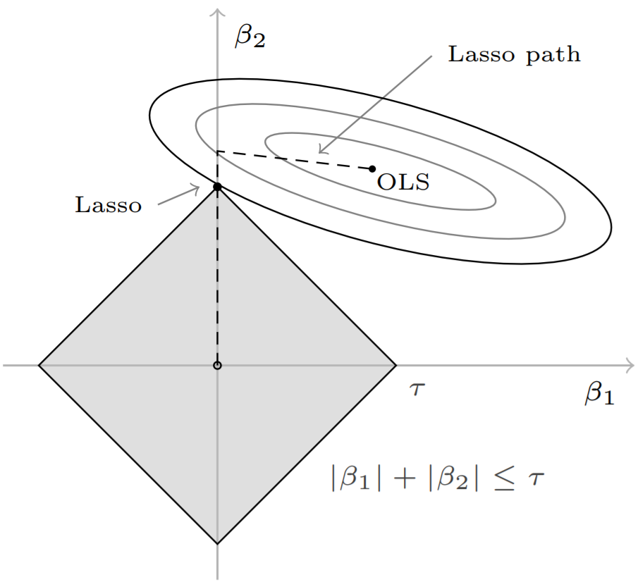
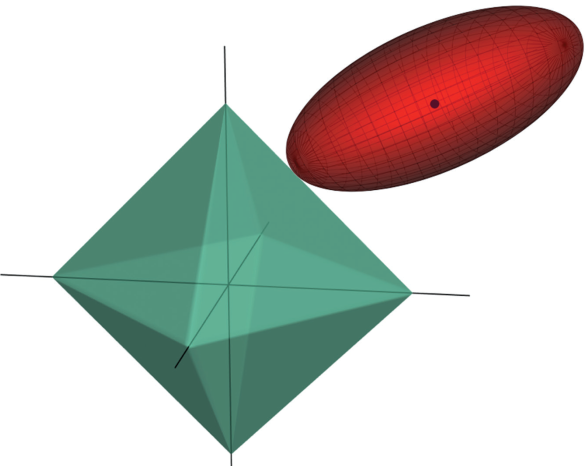
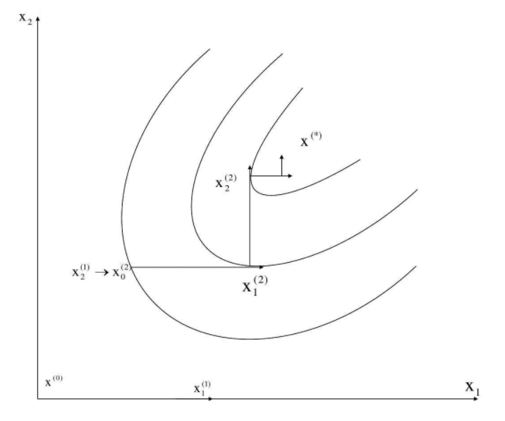
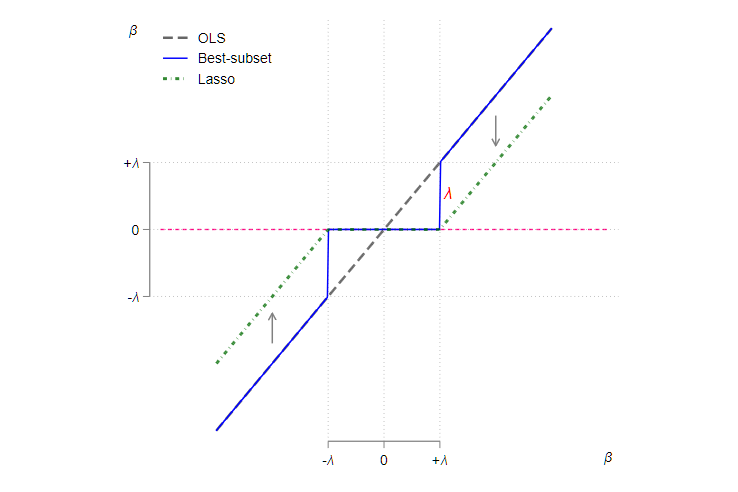
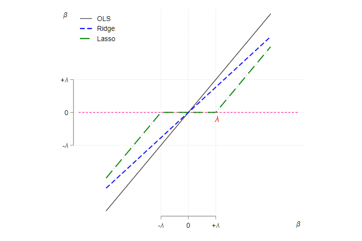
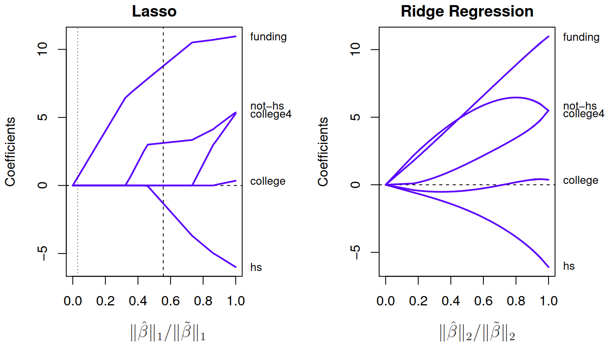
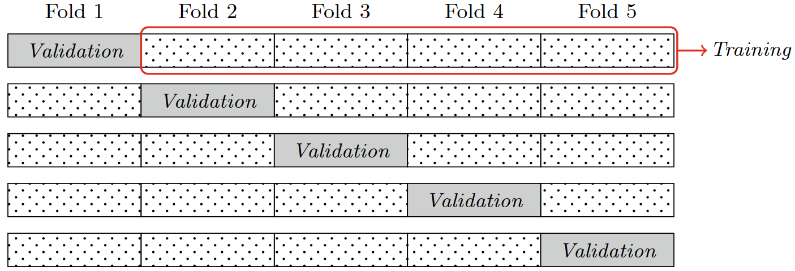
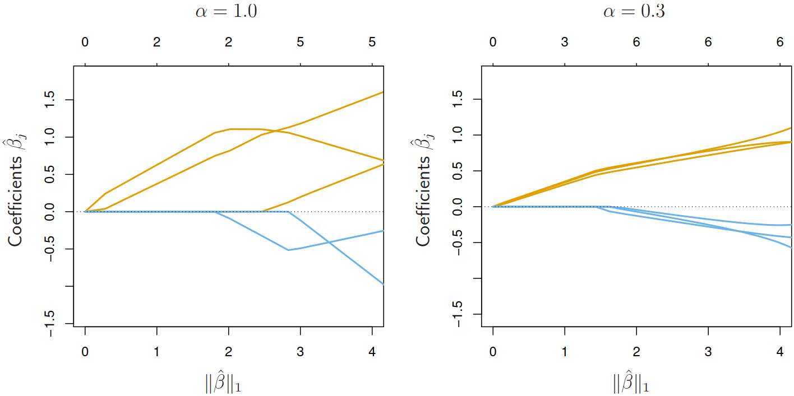
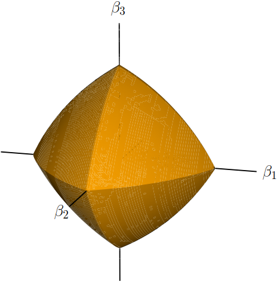
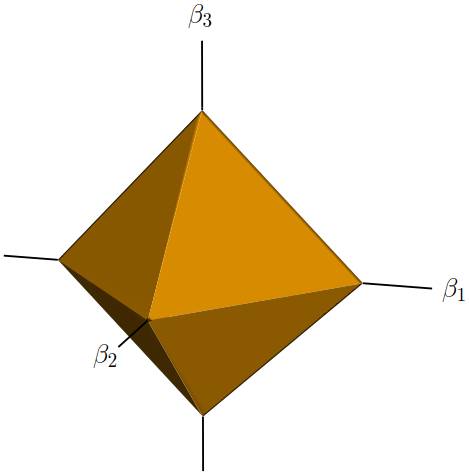

# Lasso

## 简介

<!-- label: sec:lassointro -->

#### 何谓 Lasso ?

Lasso 是“Least Absolute Shrinkage and Selection Operator” 的简称，由 Tibshirani (1996) 提出，主要用于预测 (prediction) 和模型筛选 (model selection)。其核心思想是在传统的回归分析中施加约束条件 (惩罚项)，以便滤除那些不重要变量 (使其系数强制为零)，最终筛选出相对精简的模型。若配合交叉验证等手段来选择参数，则 Lasso 得到的模型具有较强的样本外预测能力 (亦称“泛化能力”)。
以 Lasso 为首的一系列方法被通称为“惩罚回归” (Penalized Regressions)。

Lasso 的一个主要用途是解决「高维数据问题」，
主要包括两种情形：

其一，数据本身便包含很多个变量，以至于变量的个数可能超过样本数，如家庭金融数据库、劳动力动态调查数据库中都会包括数百个反映个体特征的变量。

其二，虽然样本中的基础变量个数不多，但由于模型的具体形式未知，我们需要将变量的各种转换、高阶项、交叉项等 (称为衍生变量) 放入模型，并在由原变量和衍生变量构成的潜在模型集合中选出最优模型。当衍生变量数目众多，甚至超过样本数时，传统估计方法不再适用。此时，一个更为重要的目的是变量筛选，即从众多变量中筛选出有用的变量，剔除无用变量。Hsiao et al. (2012) 以及 Hisao and Zhou (2019) 提出的「回归控制法 (RCM)」便是一个典型的实例。为了获取最佳的样本外预测能力，可以采用交叉验证法测试现有的 $k$ 个解释变量的各种组合，确定最佳的模型设定形式。

在经济金融领域，Lasso 主要应用于第二种情形。以因果推断中最为常用的「反事实框架」为例，我们需要估计 (预测) 出实验个体在假想其不受政策干预的情况下的反事实结果 $y_0$，才能估计出政策效果 $\tau = y_1 - y_0$。借助 Lasso，我们可以筛选出具有最佳样本外预测能力的模型，从而得到反事实结果 $y_0$ 的估计值 $\widehat{y}_0$，进而得到 $\widehat{\tau}$。
又如，Lasso 也可以借助其变量筛选功能克服遗漏变量问题和弱工具变量问题，从而引申出了 Lasso-IV，双重机器学习 (DML) 等方法，详情参见 \ref{sec:lasso-IV} 和 \ref{sec:lasso-DML} 小节。

#### 几个基本概念

其一，「数据挖掘 (data mining)」。其目的在于合理控制混杂因素的影响，以便对模型参数做出尽可能准确的统计推断。此时，应以基于样本外预测能力来评判模型优劣，而不是简单地关注样本内拟合情况 (这会导致过拟合和错误的统计推断)。惩罚回归符合奥卡姆剃刀原理 (Occam's razor)：在所有备选模型中，同等条件下，应优先选择尽可能简单的模型。

其二，「稀疏性假设」。多数情况下，虽然数据中有很多变量，但真正有用 (有助于样本外预测) 的变量却非常有限。这就是所谓的稀疏性，即模型中具有非零系数的变量只占很小的比例。我们的任务就是通过各种方法找出这些「有用」的变量。这个过程也称为「降维」。
对于高维数据，通常假设其满足稀疏性假设。更为宽松的是「近似稀疏性假设」：部分 $\beta_{j}$ 系数近似于零 (不一定等于零)，并且近似误差足够“小”。

其三，「正则化」和「惩罚回归」。所谓正则化，按照英文单词 regularization 的字面意思是“the condition of having been made regular (or more regular)”，也就说把“不正常的”模型向“正常的”或“比较正常的”状态调整。“不正常”的典型表现就是当模型中的变量高度共线性或 $p>n$ 时，$\X'\X$ 呈现病态 (如不可逆)，致使 OLS 估计很不稳定。修正的基本思路是对 OLS 的系数施加约束，使其估计结果趋于稳定，以便预测和外推。施加约束的过程可以视为对原有估计量的惩罚，这也是把 Lasso 回归和岭回归等统称为「惩罚回归 (penalized regression)」的原因。惩罚回归的结果通常都是有偏估计，这是我们为了降低估计的方差 (提高估计的准确性) 而必须付出的代价。

简言之，当模型中的参数 (远) 大于样本数时 ($p>n$)，最小二乘估计量 $\widehat{\beta}_{\text {ols }}$ 没有唯一解。对于 $p<n$ 但解释变量很多且存在严重共线性时，$\widehat{\beta}_{\text {ols }}$ 会很不稳定。此时，需要转向 OLS 以外的估计方法，如本章将要介绍的岭回归、Lasso 回归、弹性网、Lasso-IV 等模型。

Lasso 的过程有点类似于捞鱼：网眼太小，虽然看似收获颇丰，但往往以小鱼小虾为主；
网眼太大，又常致一无所获。

介绍 Lasso 的书籍和综述文章很多，本章内容主要参考了 Hastie et al. ([2015](https://web.stanford.edu/~hastie/StatLearnSparsity_files/SLS.pdf)) 和 Hansen ([2021](https://www.ssc.wisc.edu/~bhansen/econometrics/Econometrics.pdf))。其它推荐阅读的资料还包括：Athey and Imbens ([2019](http://sci-hub.ren/10.1146/annurev-economics-080217-053433)), Ahrens et al. ([2020](http://sci-hub.ren/10.1177/1536867X20909697))，Belloni et al. ([2014a](https://doi.org/10.1257/jep.28.2.29))，Cerulli ([2021b](https://arxiv.org/pdf/2103.03122.pdf))，以及 Fan et al. ([2021](http://sci-hub.ren/10.1201/9780429096280)) 等。

## 预备知识

### 预测偏差和方差的权衡

### 惩罚回归的目标函数

<!-- label: sec:Lasso-goal-function -->

如前文所述，提高模型复杂度可以提高样本内拟合度，但很可能出现过拟合，表现为模型的样本外预测 (泛化) 能力有限。若将“预测不准确”视为一种风险，则从模型设定的角度来看，其实包含两种风险：经验风险和结构风险。

比如，我们想建立一个模型来预测个体的就医次数。假设收集了 10,000 笔观察值，其中包含每个人过去一年的就医次数，$y_i = \{0,1,\cdots,18\}$，以及一些反映个人特征的变量，$\mathbf{x} = \{x_{1i},x_{2i},\cdots,x_{ki}\}$，如性别、年龄、职业、家庭收入、是否有高血压/高血糖/高血脂等。

用以描述 $y$ 和 $\mathbf{x}$ 关系的备选模型很多，如简单线性回归模型、Poisson 模型、负二项回归模型等，区别在于对 $y_i$ 的分布特征的假设。
显然，不同的模型设定会有不同的预测能力，这就是所谓的「经验风险」，它本质上是选择何种模型的问题。
模型选定后，还需要考虑在模型中包含多少个参数的问题，这就是「结构风险」。

归结起来，所谓「结构风险 + 经验风险」，是给定样本量的情况下，在模型的拟合能力和复杂度之间进行平衡：对于拟合效果相近的模型，我们偏好复杂度低的；对于复杂度相同的模型，我们偏好拟合效果好的。
因此，让损失函数 (Loss) 最小化显然不是最终目标，我们需要增加一个描述模型复杂度的惩罚项。因此，目标函数为：
$$
	\text{Loss}+\lambda \Omega(f)
$$

其中，$\Omega(f)$ 称为「正则化项」，$\lambda$ 为调节参数。
从损失函数的构造角度来看，所谓正则化项，描述的其实是模型的复杂度，它越高，过拟合的风险也就越大，它主要衡量结构风险。看起来，整个思路非常类似于从 $R^2$ 到 $\bar{R}^2$ 的演变，也类似于 AIC 和 BIC 等信息准则的构造过程。

下面介绍的各类惩罚回归模型的差别就在于 $\Omega(f)$ 的 Loss 的设定，以及二者如何权衡——取决于调节参数 $\lambda$。

## Lasso 回归

### 模型设定

给定一组包含 $N$ 个观察值的样本 $\left\{\left(x_{i}, y_{i}\right)\right\}_{i=1}^{N}$，Lasso 通过极小化如下目标函数来求解参数  $(\widehat{\beta}_{0}, \widehat{\beta})$
$$
	\begin{gathered}
\underset{\beta_{0}, \beta}{\operatorname{min}}\,
	\left\{\frac{1}{2 N} \sum_{i=1}^{N}\left(y_{i}-\beta_{0}-\sum_{j=1}^{p} x_{i j} \beta_{j}\right)^{2}\right\} \\
	\text { subject to } \,\, \sum_{j=1}^{p}\left|\beta_{j}\right| \leq \tau
	\end{gathered}
$$

此处，约束条件 $\sum_{j=1}^{p}\left|\beta_{j}\right| \leq \tau$ 可以用 $\ell_{1}$ 范数表示为：$\|\betaz\|_{1} \leq \tau$。(\ref{eq:lasso-HTW2015-2-3}) 尚可用矩阵方式表示为：
$$
\begin{gathered}
\underset{\beta_{0}, \beta}{\operatorname{min}}\,
\left\{\frac{1}{2 N}\left\|\mathbf{y}-\beta_{0} \mathbf{1}-\mathbf{X} \beta\right\|_{2}^{2}\right\} \\
\text { subject to }\,\,\|\betaz\|_{1} \leq \tau,
\end{gathered}
$$

需要注意的是，由于 Lasso 的估计结果与变量的量纲有关，在估计前需要对所有解释变量进行标准化处理，即每个变量都需要减去其样本均值并除以样本标准差，使标准化后的变量均值为 0，标准差为 1。

此外，我们也会对 $y_{i}$ 进行去均值处理，以保证 $\frac{1}{N} \sum_{i=1}^{N} y_{i}=0$，此时，Lasso 最优化过程中就无需再加入常数项了。

基于中心化后的数据得到最优 Lasso 估计值 $\widehat{\beta}$ 后，可以恢复原数据的参数估计：$\widehat{\beta}$ 不变，常数项 的估计值 $\widehat{\beta}_{0}$ 如下：

$$
\widehat{\beta}_{0}=\bar{y}-\sum_{j=1}^{p} \bar{x}_{j} \widehat{\beta}_{j}
$$
其中，$\bar{y}$ 和 $\left\{\bar{x}_{j}\right\}_{1}^{p}$ 为原变量的样本均值。因此，后文中我们会略去常数项 $\beta_{0}$。

将 (\ref{eq:lasso-HTW2015-2-4}) 式写成如下拉格朗日 (Lagrangian) 形式更易于求解：
$$
\underset{\beta}{\operatorname{min}}\,
\left\{
    \frac{1}{2 N}\|\mathbf{y}-\mathbf{X} \beta\|_{2}^{2}
   +\lambda\left(\sum_{j=1}^{p}\left|\beta_{j}\right|-\tau\right)
\right\}
$$

其中，$\lambda \geq 0$，通常称为“调节参数”。由于 $\lambda$ 与 $\tau$ 的乘积 $\lambda \tau$ 是一个常数，因此，(\ref{eq:lasso-HTW2015-2-5-A}) 与 (\ref{eq:lasso-HTW2015-2-5}) 的极小化问题是等价的，
$$
\underset{\beta}{\operatorname{min}}\,
\left\{\frac{1}{2 N}\|\mathbf{y}-\mathbf{X} \beta\|_{2}^{2}+\lambda\|\betaz\|_{1}\right\},
$$

可以证明，约束问题 (\ref{eq:lasso-HTW2015-2-3}) 和拉格朗日形式 (\ref{eq:lasso-HTW2015-2-5}) 之间存在一一对应的关系：对于约束集 $\|\beta\|_{1} \leq \tau$ 中的每一个 $\tau$ 值，都存在与之唯一对应的 $\lambda$ 值，二者在各自的约束场景下产生的结果完全相同。
由于 $\lambda \tau$ 为常数，$\lambda$ 和 $\tau$ 产生的压缩作用是相反的：$\tau$ 越小压缩作用越强；至于 $\lambda$，则是值越大，压缩作用越强。

需要注意的是，在很多介绍 Lasso 的文献中，(\ref{eq:lasso-HTW2015-2-3}) 和 (\ref{eq:lasso-HTW2015-2-5}) 中的因子 $1/2N$ 常常被简化为 $1/2$，甚至是 1。这对于求解 (\ref{eq:lasso-HTW2015-2-3}) 式没有任何影响，对于 (\ref{eq:lasso-HTW2015-2-5}) 式问题也不大，我们只需对参数 $\lambda$ 做一些简单的变换即可 (比如变成 $\lambda/2$)。然而，当使用交叉验证 (CV) 等方法在多个大小不同的样本之间进行比较时，采用 $1/2N$ 作为标准化因子有助于保证可比性。

### Lasso 的直观解释

Lasso 的变量筛选功能可以通过图 \ref{Fig-Lasso-Lassopath-lian}，图 \ref{Fig:Lasso-Ridge-regular-stata-a} 和图 \ref{Fig-Lasso-3D-HTW2015front} 进行直观解释。

(\ref{eq:lasso-HTW2015-2-3}) 式的约束集 $\left\{\|\beta\|_{1} \leq \tau\right\}$ 是一个类似于多面钻石的交叉多面体 (见图 \ref{Fig-Lasso-3D-HTW2015front})。 二维情形下的最小化问题如图 \ref{Fig-Lasso-Lassopath-lian} 所示。椭圆形是 $\{\beta_1,\beta_2\}$ 在不同取值组合时的平方误差对应的等高线，OLS 估计处于该椭圆集的中心点上 (此时 $\beta_1$ 和 $\beta_2$ 均不为零)。
约束集 $\left\{\|\beta\|_{1} \leq \tau\right\}$ 是带阴影的正方形，它与椭圆的切点便是 Lasso 估计量。

此外，图中的虚线显示了随着约束条件 ($\tau$) 的变动，Lasso 估计值的变动轨迹。$\lambda$ 的取值决定着正方形约束集的大小。显然，当 $\tau=0$ 时 (此时 $\lambda$ 无穷大)，所有的参数都被收缩到圆点处，即 $\beta_1=\beta_2=0$；而当 $\tau \to \infty$ 时 ($\lambda=0$)，则相当于没有对 OLS 估计施加任何约束，此时 Lasso 估计与 OLS 估计等价。因此，Lasso 估计也可以视为 OLS 估计的一般化。

Lasso 求解过程图示  
		Source: Hansen (2021, Fig 29.1), 采用 Tikz 宏包重新绘制

OLS 回归的 RSS 及等高线 (Source: Hansen (2021, Fig 3-2))

Lasso 和 Ridge 约束集对比 ([Stata Codes](https://gitee.com/arlionn/LassoStata/wikis/Lasso-Ridge-regular.md))

3D 视角下的 Lasso

### 估计

多数情况下，必须通过数值方法求解 Lasso，如最小角回归法 (LARS)，坐标下降法等，只有附加一些严格的假设条件，才能获得 Lasso 的解析解。

#### 估计思路

Lasso 估计可以通过极小化如下目标函数得到：
$$
\underset{\beta}{\operatorname{min}}
\, \mathrm{RSS}_1\left(\betaz,\lambda\right) =
\left\{\frac{1}{2 N}
\sum_{i=1}^{N}\left(y_i - \x_1\beta_1 \cdots - \x_p\beta_p \right)^2
   + \lambda \sum_{j=1}^{p}\left|\beta_{j}\right|\right\},
$$

一阶条件为：
$$
\frac{\partial{\mathrm{RSS}_1(\betaz,\lambda)}}{\partial{\beta_j}} =
\boldsymbol{X}_{j}^{\prime}(\y-\boldsymbol{X} \betaz)+\lambda \operatorname{sgn}\left(\beta_{j}\right)=0
$$

其中，$\X = (\x_1,\x_2,\cdots,\x_k)$，$\betaz=(\beta_1,\beta_2,\cdots,\beta_p)'$。$\operatorname{sgn}()$ 为“符号函数”，用于记录变量 $z$ 的符号：
$$
    \operatorname{sgn}(z) =
    \begin{cases}
      -1 & z < 0\\
      +1 & z > 0\\
      \,\,0 & z = 0
    \end{cases},
$$

#### 次导数

这里有必要做个停顿，介绍一下“次导数”，它是求解 Lasso 过程中的一个重要概念。我们知道，虽然 $f(x)=|x|$ 是连续函数，但它在 $x=0$ 处不可导。引入次导数概念便是为了界定这类函数在某些特定点上的导数。

图 (\ref{Fig:Lasso-Subgradient-01}) 的左图是常规意义的连续可导函数，右图是上述 $\ell_{1}$ 范数，即 $f(x)=|x|$ 的情形。在右图最低点处 ($x=0$)，如果可以找到一条直线，使之要么与 $f(x)$ 的图像 (黑色线) 重合，要么在它的下方 (图中那些蓝色和红色的直线)，则称该直线的斜率为 $f(x)$ 在 $x=0$ 的次导数。因此，$f(x)=|x|$ 在 $x=0$ 处的次导数不再是一个特定的数值，而是一个非空闭区间：$[-1,+1]$，取值范围取决于 $f(x)$ 在 $x=0$ 左侧和右侧的偏导数。因此，次导数通常以集合的形式来表示，如  $\partial f(x) = \{\nabla f(x)\}$。同时，在 $x=0$ 两侧，都满足 $f(x) \geq f(0)$。

基于上述介绍可知：
$$
\lambda \frac{\partial\left|\beta_{j}\right|}{\partial{\beta_{j}}}
= \lambda \operatorname{sgn}\left(\beta_{j}\right)
=
\begin{cases}-\lambda & \beta_{j}<0 \\ {[-\lambda, \lambda]} & \beta_{j}=0 \\ \lambda & \beta_{j}>0\end{cases}
$$
由此可以看出调节参数 $\lambda$ 的作用，它可以控制图 \ref{Fig:Lasso-Subgradient-01} 中右图的开合状态，从而决定 $\beta_j=0$ 时惩罚的力度。下文的 (\ref{eq:Lasso-foc-03}) 式中非常直观地体现了这个作用。

#### 坐标下降法

坐标下降法是目前应用最广的 Lasso 求解方法，其基本思路是：虽然模型中有 $p$ 个未知参数，但我们不必一次性求解，可以逐步更新：
1. 给定一组初始值，假设为 $(\beta_1,\beta_2,\cdots,\beta_p) = (0,0,\cdots,0)$；
1. 固定 $(\beta_2,\cdots,\beta_p)$，针对 $\beta_1$ 进行一元最优化，如最小化 (\ref{eq:Lasso-foc-03}) 式，搜索得到 $\beta_1$ 的估计值 $\beta_1^*$；
1. 固定 $(\beta_1^*,\beta_3,\cdots,\beta_p)$，针对 $\beta_2$ 进行一元最优化，得到 $\beta_2$ 的估计值 $\beta_2^*$；
1. 持续更新剩余参数，直至满足迭代终止条件。

我们可以借助图 \ref{Fig:lasso-03} (求解极大值) 来理解上述过程。
假设我们想求取目标函数 $y=f(\beta_1, \beta_2)$ 的极大值。从图中可以看出，$f(\cdot)$ 对 $\beta_1$ 和 $\beta_2$ 都是可微的的。我们的目标是如何快速达到山顶。具体步骤如下 (用红色表示每一轮的更新值)：
1. 设定 $\beta_1 = 1.5$，沿着 $\beta_2$ 轴的方向爬坡，达到最高点，假设为 $\{\beta_1=1.5, \beta_2=-0.1\}$；
1. 设定 $\beta_2 = -0.1$，沿着 $\beta_1$ 轴的方向爬坡，达到最高点，假设为 $\{\beta_1=0.5, \beta_2=-0.1\}$；
1. 设定 $\beta_1=0.5$，沿着 $\beta_2$ 轴的方向爬坡，达到最高点，假设为 $\{\beta_1=0.5, \beta_2=0\}$；
1. 持续进行上述过程，直至两次迭代之间的 $y$ 值之差小于预定的收敛判据，如 $|y_j - y_{j-1}|<10^{-4}$。

 和图 \ref{Fig-Lasso-坐标下降法-01}  来理解上述过程。

坐标下降法原理

坐标下降法可理解将梯度下降法进行分治处理，但其又不依赖于梯度，因此可以广泛用于不可微的凸函数优化问题中。
假设目标优化凸函数 $Q$ 为 $f\left(x_1, x_2, \ldots x_n\right)$ ，则坐标下降法在完整计算过程为:
1. 选取 $x_2, x_3, \ldots, x_{\mathrm{n}}$ 的初值;
1. 在每轮迭代中：
1. 固定 $x_2, x_3, \ldots, x_{\mathrm{n}}$ ，将 $x_1$ 作为自变量，采用导数或线性搜索等方法，搜索得到arg $\underset{x_1^*}{ } \min \mathrm{f}\left(x_1, x_2, \ldots x_{\mathrm{n}}\right)$
1. 将得到的 $x_1^*$ 代入凸函数，同时固定 $x_3, x_4, \ldots, x_{\mathrm{n}}$ ，搜索得到 $\underset{x_2^*}{\min}\  \mathrm{f}\left(x_1^*, x_2, \ldots x_{\mathrm{n}}\right)$
1. 将得到的 $x_1^*, x_2^*$ 代入凸函数，同时固定 $x_4, \ldots, x_{\mathrm{n}}$ ，搜索得到 $\underset{x_3^*}{ } \min ^2\left(x_1^*, x_2^*, \ldots x_{\mathrm{n}}\right)$
1. 得到本轮迭代后的一组值 $x_1^*, x_2^*, \ldots, x_{\mathrm{n}}^*$
1. 若满足迭代终止条件，则得到最优值，否则进入下一轮迭代。

坐标下降法中每一轮完整的迭代过程相当于梯度下降法中沿着负梯度方向的一次迭代。其区别在于，梯度下降法明确知道其迭代的方向为 梯度下降方向 (即函数变化最大的方向)，而坐标下降法只能交替着在各坐标上进行最小化的尝试。

那么如何保证坐标下降法的每轮迭代都能够使函数值有所下降，下面简要的给出证明: 因为在每轮迭代过程中，均是沿着各坐标轴方向的 最小化过程，所以有:
$$
\mathrm{f}\left(x_1, x_2, \ldots, x_{\mathrm{n}}\right) \geq \mathrm{f}\left(x_1^*, x_2, \ldots x_{\mathrm{n}}\right) \geq \mathrm{f}\left(x_1^*, x_2^*, \ldots x_{\mathrm{n}}\right) \geq \mathrm{f}\left(x_1^*, x_2^*, \ldots x_{\mathrm{n}}^*\right)
$$
这表明了，坐标下降法的每步迭代都是有效的。

Lasso-Coordinate-descent-01

$$
\begin{aligned}
x_0^{(k)} &=\underset{x_0}{\arg \min } f\left(x_0, x_1^{(k-1)}, x_2^{(k-1)}, \ldots, x_n^{(k-1)}\right) \\
x_1^{(k)} &=\underset{x_1}{\arg \min } f\left(x_0^{(k)}, x_1, x_2^{(k-1)}, \ldots, x_n^{(k-1)}\right) \\
x_2^{(k)} &=\underset{x_2}{\arg \min } f\left(x_0^{(k)}, x_1^{(k)}, x_2, \ldots, x_n^{(k-1)}\right) \\
\ldots & \\
x_n^{(k)} &=\underset{x_n}{\arg \min } f\left(x_0^{(k)}, x_1^{(k)}, x_2^{(k)}, \ldots, x_n\right)
\end{aligned}
$$

#### Lasso的解析解

若变换 $\X$ 矩阵使所有解释变量都彼此正交，即 $\boldsymbol{X}^{\prime} \boldsymbol{X}=\boldsymbol{I}_{p}$，则 Lasso 存在解析解。

此时，(\ref{eq:Lasso-foc-01}) 式中的一阶条件可以简化为：
$$
  \widehat{\beta}_{\mathrm{Lasso}, j}-\widehat{\beta}_{\mathrm{ols}, j}
  +\lambda \operatorname{sgn}\left(\widehat{\beta}_{\mathrm{Lasso}, j}\right)=0
$$
由此解得 (这里省略了下标 $_j$)：
$$
\widehat{\beta}_{\text {Lasso, } j}=\left\{
\begin{array}{cc}
\widehat{\beta}_{\text {OLS }}-\lambda & \widehat{\beta}_{\text {OLS}}>\lambda \\
0 & |\widehat{\beta}_{\text {OLS}}| \leq \lambda \\
\widehat{\beta}_{\text {OLS }}+\lambda & \widehat{\beta}_{\text {OLS }}<-\lambda
\end{array}\right.
$$

可见，Lasso 估计是 OLS 估计的连续函数。当 OLS 系数的绝对值小于 $\lambda$ 时，Lasso 估计值被强制设定为 0 (这就是所谓的变量筛选功能)，而其它系数则被统一向零收缩 $\lambda$ 个单位。

若引入“取正部”算子 $(\cdot)_{+}$，则 (\ref{eq:Lasso-foc-03}) 式的分段函数可以用更为简洁的方式表示如下：
$$
	\widehat{\beta}_{\text {Lasso, } j} = \operatorname{sgn}(\widehat{\beta}_{\text {OLS }})(\widehat{\beta}_{\text {OLS }} - \lambda )_{+}
$$

其中，“取正部”算子 $(\cdot)_{+}$ 定义为：
$$
(z)_{+}=\left\{
\begin{array}{cc}
z & \text{if}\ z\geq 0 \\
0 & \text{if}\ z<0 \\
\end{array}\right.
$$
我们甚至可以进一步将 Lasso 估计值表示为：
$$
	\widehat{\beta}_{\text {Lasso, } j} =
	\mathcal{S}(\widehat{\beta}_{\text {OLS}}, \lambda)
$$

其中，$\mathcal{S}(\beta,\lambda):=\operatorname{sgn}(\beta)(\beta-\lambda)_{+}$ 是“软阈值算子” (soft-thresholding operator)，在机器学习中有广泛应用。

图 \ref{Fig-Lasso-hard-bestsub-ols-01} 直观地展示了 Lasso 和 OLS 回归系数之间的关系。

最优子集、Lasso 与 OLS 估计系数的关系

## 岭回归 (Ridge Regression)

Lasso 采用 $\ell_{1}$ 范数来约束参数，而岭回归采用的是 $\ell_{2}$ 范数，其目标函数为：
$$
	\begin{gathered}
	\underset{\beta_{0}, \beta}{\operatorname{minimize}}\left\{\frac{1}{2 N} \sum_{i=1}^{N}\left(y_{i}-\beta_{0}-\sum_{j=1}^{p} x_{i j} \beta_{j}\right)^{2}\right\} \\
	\text { subject to }\,\, \sum_{j=1}^{p} \beta_{j}^{2} \leq \tau^{2}
	\end{gathered}
$$

其中，$\tau>0$ 是收缩参数，约束效果呈现于图 \ref{Fig:Lasso-Ridge-regular-stata-b} 及图 \ref{fig:Lasso-ridge-compare-b}。用矩阵表示如下 (类比于 (\ref{eq:lasso-HTW2015-2-5}) 式)：
$$
\underset{\beta}{\operatorname{min}}\,
\left\{\frac{1}{2 N}\|\mathbf{y}-\mathbf{X} \beta\|_{2}^{2}+\lambda\|\betaz\|_{2}^2\right\},
$$

岭回归主要有两个用途。Hoerl and Kennard (1970) 最初提出该模型是为应对回归分析中的高度共线性问题。时至今日，则主要用于对高维数据和不可逆问题的正则化。

### 岭回归如何降低共线性？

如前所述，当 $p$ 很大时，$\boldsymbol{X}^{\prime} \boldsymbol{X}$ 为病态矩阵，致使 OLS 估计在数值上很不可靠。此时，可以施加约束条件 $\sum_{j=1}^{p} \beta_{j}^{2} \leq \tau^{2}$ 予以改善。

(\ref{eq:Lasso-ridge-01a}) 式的一阶条件为：
$$
-2 \boldsymbol{X}^{\prime}(\boldsymbol{\y}-\boldsymbol{X} \beta)+2 \lambda \beta=0
$$
可推导出岭回归的估计量 $\widehat{\beta}_{\text {ridge}}$ 为：
$$
	\widehat{\beta}_{\text {ridge}} =\left(\boldsymbol{X}^{\prime} \boldsymbol{X}+\lambda \boldsymbol{I}_{p}\right)^{-1} \boldsymbol{X}^{\prime} \boldsymbol{\y}
$$

该估计量具有定义明确且不受多重共线性影响的特性。即使 $p>n$，岭回归估计量仍然有唯一解。具体而言，$\ell_{2}$ 范数惩罚项的加入可以让 $\left(X^{\prime} X+\lambda I\right)$ 满秩，保证了可逆，代价是系数估计不再满足无偏性，即 $E(\mathrm{\widehat{\beta}_{\text {ridge}}} \neq \beta$。因此，岭回归是以放弃无偏性、降低精度为代价来解决病态矩阵问题的。单位矩阵 $I$ 的对角线上全是 1 ，像一条山岭一样，“岭回归”也因此得名。

### 岭回归如何实现正则化？

收缩系数 $\lambda$ 的作用是实现正则化：当 $\lambda=0$ 时，$\widehat{\beta}_{\text {ridge}}=\widehat{\beta}_{\text {OLS}}$；当 $\lambda \to \infty$ 时 ($\tau \to 0$)，相当于把所有的系数都压缩到零，此时模型中只有一个常数项，其系数估计值估计出来就是 $y$ 的样本均值而已。

由 (\ref{eq:Lasso-ridge-01}) 式可知，岭回归的约束集是一个以 $\sqrt{\tau}$ 为半径的圆 (见图 \ref{fig:Lasso-ridge-compare})，它与 OLS 系数的可行集 (椭圆) 很难相切于坐标轴上。也就是说，岭回归虽然具有收缩系数的作用，但并不会让某些变量的系数为零，也就不具有变量筛选的功能。这是它与 Lasso 最大的区别。

那么，$\lambda$ 的最优值如何确定呢？前面已经提到，我们常用 MSE (均方误差) 衡量模型的优劣，但 MSE 是模型的方差和偏差之和。

对于岭回归而言，$\lambda$ 越大, $(X'X+\lambda I)$ 越大， $\left(X'X+\lambda I\right)^{-1}$ 就越小, 模型的方差就越小。代价是，$\lambda$ 越大， $\widehat{\beta}_{\text {ridge}}$ 与真实值的偏离就越大，模型的偏差也就越大。
我们可以基于 AIC，BIC 等信息准则，或交叉验证等数据驱动的方式来确定 $\lambda$ 的最优值，详见第 \ref{sec:lasso-lambda} 小节。

在 Stata 中，可以用 `lasso2` (Ahrens et al., 2020), `ridgeregress`, `ridgereg` (提供了丰富的假设检验结果) 实现常规的岭回归分析。

IV 估计可以使用 `ridge2sls` 命令。

面板数据模型可以用 `xtregfem`, `xtregmle` 命令。

### 岭回归、Lasso、最优子集与 OLS 的关系

若变换 $\X$ 矩阵使所有解释变量都彼此正交，即 $\boldsymbol{X}^{\prime} \boldsymbol{X}=\boldsymbol{I}_{p}$，Lasso 和岭回归都存在解析解，且都是 OLS 估计的简单变换 (详见表 \ref{tab:lasso-01})：(1) 岭回归是将 OLS 系数统一缩小为原来的 $1/(1+\lambda)$ 倍；(2) Lasso 是先用常数因子 $\lambda$ 对 OLS 系数进行转换，进而在零处截断，也称为软阈值运算/转换；(3) 最优子集则是对 OLS 系数进行硬阈值转换：若 OLS 系数大于 $\sqrt{2 \lambda}$ 则保留原状，否则设置为零。

简言之，Lasso 和最优子集 (逐步回归) 都能够产生稀疏解，具有变量筛选的功能，而岭回归则只具有系数压缩功能。同时，Lasso 和岭回归估计量都是连续函数，而逐步回归则是非连续函数。整体对比下来，在变量筛选功能方面，Lasso 占优。

最后需要再次强调的是，Lasso 和岭回归都需要对变量进行标准化，使其均值为 0，方差为 1，因为 $\lambda$ 的含义会随着变量量纲的变化而改变，致使不同的数据和模型之间不具可比性 (比如，在 $K$ 折交叉验证中，同一个变量在每个细分组中的均值和方差都是有差异的)。当然，若使用 Stata 等软件，对变量执行标准化是默认动作。

\begin{table}
  \begin{center}

  \begin{tabular}{lllll}
1 & &Lasso &  &$\operatorname{sgn}(\widehat{\beta}_{\text{OLS},\,j})
(|\widehat{\beta}_{\text{OLS},\,j}|-\lambda)_{+}$ \\
2 & &Ridge &  &$\widehat{\beta}_{\text{OLS}, j} /(1+\lambda)$ \\
  \end{tabular}
  \end{center}
\end{table}

Lasso 和岭回归以及 OLS 系数之间的关系呈现于图 \ref{Fig-Lasso-hard-ridge-ols-02}。

Lasso 和岭回归的系数与调节参数之间的关系参见图 \ref{Fig-Lasso-Ridge-shink}。

岭回归、Lasso 与 OLS 估计系数的关系

Lasso与岭回归系数与调节参数之间的关系  
	Source: HTW2015, Figure $2.1$ Left: Coefficient path for the lasso, plotted versus the $\ell_{1

### Lasso 的独特之处

Lasso 的约束集是 $\ell_1$范数，岭回归是 $\ell_2$ 范数，那么一个很自然的推广就是考虑 $\ell_q$ 范数族：
\[
  \|\beta\|_q = \left(\sum_{k = 1}^p \beta_k^q\right)^{1/q}.
\]
图 \ref{Fig:Lasso-lq-norm-ball} 列示了一些典型范数的约束集。

可以看出，若要确保约束集有尖角 (有变量筛选能力)，$q$ 的最小取值为 $q=1$；同时，若要使约束集为凸 (convex) (以便于求解)，$q$ 的最大取值也为 $1$。因此，$q=1$ 对应的是兼具变量筛选能力和求解便利性的最佳约束集。这也是 Lasso 被广泛应用的原因所在。

## 调节参数 $\lambda$ 的选择

<!-- label: sec:lasso-lambda -->

在惩罚回归中，系数估计和变量筛选 (模型设定) 都取决于调节参数 $\lambda$。\ref{sec:lasso-lambda-intro} 节先整体介绍选择 $\lambda$ 的基本规则和流程，随后分别在 \ref{sec:lasso-lambda-ic}、\ref{sec:lasso-lambda-cv} 和 \ref{sec:lasso-plugin} 小节介绍基于信息准则、交叉验证和经验法则确定 $\lambda$ 的理论背景和计算方法。

### 基本经验规则和流程

<!-- label: sec:lasso-lambda-intro -->

确定最优值 $\lambda^*$ 的方法主要分为三类：
1. **信息准则 (IC)**：选择使信息准则 $\mathrm{AIC}, \mathrm{AlCc}, \mathrm{BIC}$ 或 $\mathrm{EBIC}$ 极小化的 $\lambda$ 的值。
1. **交叉验证 (CV)**：它属于数据驱动方法，更为关注模型的样本外预测能力，所需的假设条件较为宽松，在样本量较小的情况下尤为适用。
1. **理论推演 (plugin)：** 在一些常规的假设条件下，推导出理论上的 $\lambda^*$ 值，因此不必再执行 CV 和 IC 方法的搜索过程，颇为省时。此法更倾向于选出精简的模型。

它是 Stata 中 Lasso 系列命令的标配，也被外部命令 `rlasso` 所采用 (Arhens et al., 2020)。

#### 选择依据

上述方法各有优劣，因此，采用何种方法确定 $\lambda^*$，取决于研究目的：是做样本外预测还是模型筛选？前者是 Lasso 的主要用途，如预测信贷违约率、病毒感染率等，后者旨在从大量备选模型中挑选出正确的模型设定形式, 如后文要介绍的 Lasso-IV，双重 Lasso 等基于 Lasso 的因果推断方法。

通常而言，以样本外预测为目标时，应选择以交叉验证为基础的方法，如下文介绍的 CV 和 adaptive-CV；以模型筛选为目标时，可以选择理论推演值 (plugin) 或信息准则 (如 BIC)，前者速度极快，后者在稀疏性较强的情况下表现稳定。

当然，我们也要兼顾计算成本 (时耗和可行性)。为此，可以在初步分析或测试阶段使用 plugin，亦可以用基于 plugin 得到的 $\lambda^*$ 作为 CV 等耗时较高的方法的初始值。

Stata 中的 `lasso`, `lasso2` 等命令基本上覆盖了文献中的主流方法。
#### 主要经验规则

在介绍技术细节之前，这里先简要介绍 Stata 中确定 $\lambda^*$ 的主要方法以及它们的特点和应用场景。

Stata 中的 Lasso 系列命令 (如 `lasso`, `elasticnet`, `poregress`, `xporegress`, `telasso`, `dsregress` 等) 都可以用 `selection(sel_method)` 选项来指定 $\lambda^*$ 的选择方法，包括： (上述功能依赖于 Stata 16 以上版本，其中 `bic` 需要 Stata 17 以上版本。)
$$

\begin{array}{ll}
`sel_method ` & \text { Description } \\
\texttt { adaptive } & \text { select $\lambda^*$ using an adaptive lasso } \\
\texttt { plugin} & \text { select $\lambda^*$ using a plugin iterative formula } \\
\texttt { bic} & \text { select $\lambda^*$ using BIC function } \\
\texttt { none } & \text { do not select $\lambda^*$ } \\
\end{array}
$$

具体说明如下：

- `cv`：用 Lasso 做预测时，CV 是首选。

- `adaptive`：它是 $\mathrm{CV}$ 的变体，在每一步中它都先采用 CV 得到一个初步的 $\lambda^{*}$，进而使用自适应 Lasso 模型作进一步调整：放大重要系数，压缩不重要的系数。`adaptive-CV` 具有 CV 的样本外推能力 (因为在选择 $\lambda$ 的过程中，评价标准就是样本外 MSE 的大小)，同时根据变量的相对重要性做出二次调整。因此，它选出的模型比基于 CV 得到的模型更精简，但预测能力却不会有太多折损。我们将在第 \ref{sec:adaptive-lasso} 介绍 Adaptive Lasso。

- `plugin`：当研究目的不是样本外预测，而是模型筛选时，`plugin` 的应用最广。因为其 $\lambda^*$ 是基于理论推演得到的，省去了搜索过程。

- `bic`：是 Stata 17 新增的功能，应用较少。因为它和 CV 一样，都很耗时；但样本外预测能力又不如 CV。

Stata 手册对 Lasso 的模型筛选过程进行了详细介绍，参见

- Lasso 整体介绍：[**[lasso] lasso**](https://www.stata.com/manuals/lassolasso.pdf)

- Lasso 模型筛选：[**[lasso] lasso model selection**](https://www.stata.com/manuals/lassolasso.pdf)

此外，实现各类 Lasso 模型的 Stata外部命令，如 `lasso2`, `rlasso`, `elasticregress`, `pdslasso`, `ivlasso` 等，也都内置了 $\lambda^*$ 的选择方法。

综上所述，确定 $\lambda^{*}$ 的基本**经验规则**是：

(1) 若研究目的是模型筛选，则 `plugin` 是很好的选择。

(2) 若研究目的是预测，则可以在测试阶段 (此时对结果的准确度要求不高) 使用 `plugin`，以节省计算时间。随后，可以采用 `adaptive`-CV 和普通 `cv` 做更严格的测试。

(3) 当样本较小时 (比如 $n<500$)，`cv` 和 `adaptive`-CV 表现都很不稳定，甚至无法搜索到合适的 $\lambda$ 值，此时可以使用 `plugin` 和信息准则。

#### $\lambda^*$ 的选择流程

这里先以形式相对简单的岭回归为例，简要说明确定  $\lambda^*$ 的基本流程 (采用 BIC 准则作为模型评估标准)。为便于说明，将
(\ref{eq:Lasso-21}) 式重列如下：
$$
	\widehat{\beta}_{\text {ridge}} =\left(\boldsymbol{X}^{\prime} \boldsymbol{X}+\lambda \boldsymbol{I}_{p}\right)^{-1} \boldsymbol{X}^{\prime} \boldsymbol{\y}
$$

显然，$\widehat{\beta}_{\text {ridge}}$ 中包含未知参数 $\lambda$。由于 $\lambda>0$，我们可以预设一个范围，比如 $\lambda_j \in \{0.01, 0.02, \cdots, 8\}$，相应的 $j$ 标记为 $j=1,2\cdots J$。然后依次将 $\lambda_j$ 带入 (\ref{eq:Lasso-21-1})，计算出相应的 BIC$_j$，最终，$\{\mathrm{BIC}_j\}$ 的最小值对应的 $\lambda$ 便是其最优值 $\lambda^*$。

若采用 CV 确定 $\lambda^*$，则需要增加一些步骤：针对每一个 $\lambda_j\ (j=1,2\cdots J)$，将样本随机等分为 $K$ 份 (如，10 份)，每次用其中的 $K-1$ 份做岭回归 (或 Lasso 估计)，剩下的一份做样本外预测，并计算其 $\mathrm{MSE}_k$。计算出 $K$ 个 $\{\mathrm{MSE}_k\}\ (k=1,2\cdots K)$，以及它们的均值 $\overline{\mathrm{MSE}}(\lambda_j)$。所有 $\overline{\mathrm{MSE}}(\lambda_j)\ (j=1,2\cdots J)$ 的最小值对应的 $\lambda$ 即为 $\lambda^*$。

有关 Stata 中 $\lambda^*$ 的计算流程，参见 [**[lasso] lasso model selection**](https://www.stata.com/manuals/lassolasso.pdf), pp.4。帮助文件为 `help lasso##selmethod`。

### 基于信息准则确定 $\lambda^*$

<!-- label: sec:lasso-lambda-ic -->

简要回顾一下 AIC, BIC, HQIC 等信息准则的计算公式：

- AIC (Akaike Information Criterion)：赤池信息准则
$$\mathrm{AIC} = -2 \ln(L) + 2 k$$

- BIC (Bayesian Information Criterion)：贝叶斯信息准则
$$\mathrm{BIC}=-2 \ln(L) + \ln(n)k$$

- HQIC (Quinn Criterion)：汉南-奎因信息准则
$$\mathrm{HQIC}=-2 \ln(L) + \ln(\ln(n))k$$
其中，$\ln(L)$ 是模型的对数似然函数值，$n$ 是样本数，$k$ 是模型的参数个数。从构造上来看，上述信息准则其实都是在 $\ln(L)$ 基础上施加惩罚后得到的。当 $n>8$ 时， $\ln(n)>2$，因此，多数情况下 BIC 对模型参数的惩罚都比 AIC 大，更倾向于选择精简模型。

在 Lasso 情境中，AIC 和 BIC 可表示为 (Schwarz 1978, BIC)：

$$
\begin{aligned}
&\operatorname{AIC}(\lambda)=n \ln \widehat{\sigma}^{2}(\lambda)+2 \operatorname{df}(\lambda) \\
&\operatorname{BIC}(\lambda)=n \ln \widehat{\sigma}^{2}(\lambda)+\operatorname{df}(\lambda) \ln (n)
\end{aligned}
$$

其中，$\widehat{\sigma}^{2}(\lambda)=n^{-1} \sum_{i=1}^{n} \widehat{\varepsilon}_{i}^{2}$ ($\widehat{\varepsilon}_{i}$ 是残差)。$\operatorname{df}(\lambda)$ 是有效自由度，用以衡量模型复杂度，可以用模型中非零系数的个数来代替 (Zou, Hastie and Tibshirani, 2007)，后者是 $\operatorname{df}(\lambda)$ 的无偏且一致估计。即使 $p>n$，这一结论仍然成立 (Tibshirani and Taylor, 2012)。

$\mathrm{AlC}$ 和 $\mathrm{BIC}$ 都不太适合“大 $p$ 小$N$” 情形，
因为它们倾向于保留过多的变量。$\mathrm{AIC}_{c}$ 有助于克服 $\mathrm{AIC}$ 存在的小样本偏差，因此，在 $n$ 很小或 $n$ 虽不小但 $p\gg n$ 时，应该优先使用 (Sugiura, 1978；Hurvich and Tsai, 1989)。

$$
\operatorname{AIC}_{c}(\lambda)=n \ln \widehat{\sigma}^{2}(\lambda)+2 \operatorname{df}(\lambda) \frac{n}{n-\operatorname{df}(\lambda)}
$$

在高维情境下，BIC 也会过度选入变量 (over-select)。为此，
Chen and Chen (2008) 提出了 EBIC (Extended BIC)，它对参数数量施加了更为严格的惩罚，选出的模型更为精简，当 $p>n$ 时效果更为明显。EBIC 定义为：

$$
\operatorname{EBIC}_{\xi}(\lambda)=n \ln \widehat{\sigma}^{2}(\lambda)+\operatorname{df}(\lambda) \ln (n)+2 \xi \mathrm{df}(\lambda) \ln (p)
$$

其中，参数 $\xi \in[0,1]$ 用于控制惩罚力度。Chen and Chen (2008, p.768) 的设定为 $\xi=1-\ln (n) /\{2 \ln (p)\}$。

### 交叉验证 (CV)

<!-- label: sec:lasso-lambda-cv -->

交叉验证的基本思想是把原始数据(dataset)进行分组，一部分做为训练集(train set)，另一部分做为验证集 (validation set or test set)，首先用训练集对模型进行估计，再利用验证集来测试训练得到的模型(model)，以此评估模型的表现。

根据切分的方法不同，交叉验证分为下面三种：

1. **简单交叉验证。**所谓的简单，是和其他交叉验证方法相对而言的。首先，我们随机的将样本数据分为两部分 (比如： 70%的训练集，30%的测试集)，然后用训练集来训练模型，在测试集上验证模型及参数。接着，把样本打乱，重新选择训练集和测试集，继续训练数据和检验模型。最后，基于损失函数确定最优模型和参数。
1. **K 折交叉验证** (K-Folder Cross Validation，K-CV)。不同于第一种方法，K-CV 会把样本数据随机分成 $K$ 份，每次随机选择 $K-1$ 份作为训练集，剩下的 1 份做测试集。当这一轮完成后，重新随机选择 $K-1$ 份来训练数据。经过若干轮 (小于 $K$) 后，选择目标损失函数评估最优的模型和参数。
1. **去一法交叉验证** (Leave-one-out Cross Validation，LOO-CV)。这本质上就是“刀切法 (Jackknife)”。它是第二种情况的特例，此时 $K$ 等于样本数 $N$，即，每次选择 $N-1$ 个观测值来训练数据，留一个观测值来验证模型的预测效果。此方法主要用于样本量非常少的情况，如 $N<50$。

Lasso 中最常用的是 $K$ 折交叉验证 (简称为 CV)，过程如下：

1. 将初始数据集随机拆分为 $K$ 组(折)，记为 $\{G_{1}, G_{2}, \ldots,G_{K}\}$，假设第 $k$ 组 ($G_{k}$) 中有 $n_{k}$ 个观察值。如果 $N$ 是 $K$ 的倍数，则 $n_{k}=N / K$，否则各组的样本数会略有差异。
1. 把第 $k$ 组作为验证集，而其他 $K-1$ 组做为训练集，计算其 MSE：
$$
\mathrm{MSE}_{k}(\lambda) =
\frac{1}{n_k}\sum_{i \in G_{k}}\left(y_{i}-\widehat{y}_{i}\right)^{2}
= \frac{1}{n_k}\sum_{i \in G_{k}}\left(y_{i}-\x_i' \widehat{\beta}_{-k}(\lambda)\right)^{2}
$$

1. 计算 $K$ 组的平均 MSE：
$$
\mathrm{CV}_{K}(\lambda)=\sum_{k=1}^{K} \frac{n_{k}}{N} \mathrm{MSE}_{k}(\lambda), \  k=1,2,\cdots,K
$$
1. 假设 $\lambda$ 的可能取值范围为 $[\lambda_{\text{min}},\lambda_{\text{max}}]$，则我们可以将其等分成 $J$ 份。对于每一个 $\lambda_j\ (j=1,2,\ldots,J)$，计算 $\mathrm{CV}_{K}(\lambda_j)$，从中选择最小值，由此可以确定 $\lambda^*$。

以 $K=10$ 折，$J=50$ 为例，上述过程大概需要进行 $500$ 次估计。

显然，当 $K=N$ 时，便是上文介绍的去一法交叉验证 (LOO-CV)。

K 折交叉验证示意图  
	Source: Ahrens et al. (2020)

**几点说明：**

其一，执行 $K$ 折交叉验证需要将观察值随机分成 $K$ 组。因此，当样本数较少时，CV 选出的 $\lambda^*$ 具有较大的不确定性。此时，可以通过 `set seed #` 设定种子值，以保证实证结果的可复制性。当然，需要确保实证结果不会对种子值的选取太敏感。一般来说，设定较大的 $K$ 值有助于降低这种敏感性，但当样本数较小时，这其实也不太可行。Stata 的默认值是 $K=10$，这也是多数软件和文献的基本设定。实证分析中可以适当修改之以测试结果的稳健性。另一种方法是使用“重复 CV 法”，即把上述 CV 过程重复做多次，取平均，以降低随机分组和 $K$ 值选取带来的影响。

其二，面板数据通常具有较强的组内相关性，需要以组别为单位进行 CV，而对于时间序列，问题可能更为复杂，需要使用滚动 CV 或分块 CV 等方法，参见 Ahrens et al. ([2020](http://sci-hub.ren/10.1177/1536867X20909697), Section 4)。

其三，需要再次强调的是，CV 的设计思想使其更适用于以“样本外预测”为主要目标的应用场景，因此，若分析重点是样本内的解释力，CV 未必是最优选择，此时 BIC 等信息准则或许更合适。

其四，就 CV 的性质而言，Chetverikov, Liao and Chernozhukov (2020) 证明了 CV 在 Lasso 估计中的渐近一致性。Arhens et al. (2020) 的模拟分析表明，基于 CV 选出的变量偏多，即 CV 是相对保守的筛选规则。

有关 CV 的更深入的介绍，参见 Ahrens et al. ([2020](http://sci-hub.ren/10.1177/1536867X20909697), Section 4)，以及 Hansen ([2021](https://www.ssc.wisc.edu/~bhansen/econometrics/Econometrics.pdf), Section 28.9)。

### 理论推演值-plugin

<!-- label: sec:lasso-plugin -->

若主要目标是变量筛选 (如后文介绍的 Lasso-IV，或 Double Selection)，采用由理论上推导出的经验值 $\lambda_{\text{plugin}}^*$ 既省时又省力，因为这无需执行任何搜索程序。尤其是当 CV 无法使用或很不稳定时，$\lambda_{\text{plugin}}^*$ 是很好的替代。
此外，相对于 CV 和 BIC，`plugin` 选出的变量都更少，因此模型更为精简。

$\lambda_{\text{plugin}}^*$ 的推导和证明过程都比较复杂，这里仅列出一些 Stata 手册 [**[lasso] lasso, pp.27-30**](https://www.stata.com/manuals/lassolasso.pdf)
中的基本结果，以便大家了解其设定思想。详情参阅 Belloni and Chernozhukov (2011), Belloni et al. (2012), and Belloni, Chernozhukov, and Wei (2016)。

在 Stata 中，若采用 `lasso linear`，则有两个 plugin 估计量可供选择：
- `selection(plugin, homoskedastic)` 选项：
此时，假设干扰项为同方差，$\lambda^*$ 的估计式为：
$$
	\lambda_{\text {homoskedastic }}=\frac{c \widehat{\sigma}}{\sqrt{N}} \Phi^{-1}\left(1-\frac{\gamma}{2 p}\right)
$$

其中，$\widehat{\sigma}$ 是误差项方差参数的估计值。
- `selection(plugin, heteroskedastic)` 选项：
此时，假设干扰项存在异方差，$\lambda^*$ 的估计式为：
$$
\lambda_{\text {heteroskedastic }}=\frac{c}{\sqrt{N}} \Phi^{-1}\left(1-\frac{\gamma}{2 p}\right)
$$

其中，

- $c=1.1$ (Belloni and Chernozhukov (2011) 建议的数值)；

- $N$ 是样本量；

- $\gamma=0.1 / \ln [\max \{p, N\}]$ 为系数为零时不移除该变量的概率；

- $p$ 是模型中备选变量的个数。

## Lasso扩展模型

### 弹性网

<!-- label: sec:lasso-enet -->

如前所述，岭回归具有压缩系数的能力，可以在很大程度上避免高度共线性导致的系数估计不稳定问题；而 Lasso 则在压缩系数的同时，还具有「变量筛选」能力——在稀疏性假设下，可以将部分变量的系数设定为零。但 Lasso 也有一个重要的局限：若模型中包含一组高度相关的变量 (如一组反应公司文化特征的变量；或一组反映人的免疫能力的基因特征)，则 Lasso 只能随机地选择其中的一个或几个，而无法整体选入。这也是在 Lasso 提出不久就被广泛讨论和质疑的问题。

Zhao and Yu (2006)，Meinshausen and Bühlmann (2006) 发现，只有在非常严格的假设条件下 (主要是限定解释变量之间的相关性不能太高)，Lasso 估计才具有一致性。他们把这条件称为「不可表示条件 (irrepresentable condition, **IRC**)」，核心观点在于：如果两个变量高度相关，Lasso 将无法区分它们。

如前文所言，Lasso 主要用于预测和模型筛选 (变量筛选)，后者的难度远高于前者。显然，若作为预测工具，比如控制混杂因素或估计（“预测”）工具变量或反事实结果，变量之间的高度共线性不会引起太严重的偏差。但若把 Lasso 作为变量筛选工具，高度共线性问题会导致 Lasso 无法找出正确的模型。

Zou and Hastie (2005) 提出的弹性网 (Elastic Net, 简称 ENet) 有助于克服上述问题，
其想法很直接：把岭回归和 Lasso 结合起来。模型设定如下：
$$
\underset{\left(\beta_{0}, \beta\right)}{\operatorname{minimize}}\left\{\frac{1}{2} \sum_{i=1}^{N}\left(y_{i}-\beta_{0}-x_{i}' \beta\right)^{2}
+\lambda\left[\frac{1}{2}(1-\alpha)\|\beta\|_{2}^{2}+\alpha\|\beta\|_{1}\right]\right\}
$$

其中，$\alpha \in[0,1]$ 是一个可变参数。

显然，Lasso 和岭回归都是弹性网 (ENet) 的特例：当 $\alpha=1$ 时，ENet 退化成 Lasso；而当 $\alpha=0$ 时，则变成了岭回归。模型中的参数 $\alpha$ 和 $\beta$ 也都可以采用前面介绍的 K 折交叉验证法来确定调节参数的最佳取值，求解过程与 Lasso 相似，多用循环坐标下降法。

Source: Hastie, Tibshirani and Wainwright ([2015](https://web.stanford.edu/~hastie/StatLearnSparsity_files/SLS.pdf)). Statistical Learning with Sparsity: The Lasso and
	Generalizations. Boca Raton, FL: CRC Press. [Link](https://web.stanford.edu/~hastie/StatLearnSparsity/). [PDF](https://web.stanford.edu/~hastie/StatLearnSparsity_files/SLS.pdf)HTW2015, Figure 4.1 Six variables, highly correlated in groups of three. The lasso estimates $(\alpha=1)$, as shown in the left panel, exhibit somewhat erratic behavior as the regularization parameter $\lambda$ is varied. In the right panel, the elastic net with $(\alpha=0.3)$ includes all the variables, and the correlated groups are pulled together.

图 \ref{Fig-Lasso-enet-HTW2015-Fig4-1} 呈现了 Lasso 与 ENet 在筛选两组高度相关的变量时的差异。

图 \ref{fig:Lasso-ball-enet-lasso} 呈现了弹性网与 Lasso 约束集的三维视图。

Source: HTW2015. Figure 4.2 The elastic-net ball with $\alpha=0.7$ (left panel) in $\mathbb{R

### 平方根 Lasso

<!-- label: sec:sqrt-lasso -->

Square-root Lasso (简称 sqrt-Lasso) 由 Belloni, Chernozhukov and Wang (2011) 提出。

普通 Lasso 的目标函数为：
$$
\frac{1}{2 N}\left(\mathbf{y}-\mathbf{X} \boldsymbol{\beta}^{\prime}\right)^{\prime}\left(\mathbf{y}-\mathbf{X} \boldsymbol{\beta}^{\prime}\right)+\lambda \sum_{j=1}^{p}\left|\beta_{j}\right|
$$

sqrt-Lasso 的目标函数为：
$$
	\sqrt{\frac{1}{N}\left(\mathbf{y}-\mathbf{X} \boldsymbol{\beta}^{\prime}\right)^{\prime}\left(\mathbf{y}-\mathbf{X} \boldsymbol{\beta}^{\prime}\right)}+\frac{\lambda}{N} \sum_{j=1}^{p}\left|\beta_{j}\right|
$$

这种设定可以让扰动项的标准差成为一个常数，
更易于求解调节参数 $\lambda$ 的理论最优值 $\lambda^*$。
该值可以为双重 Lasso (double-selection)、偏出 Lasso (partialing-out methods) 等需要多次 Lasso 估计的方法提供 $\lambda$ 的初始值，提高求解效率。因此，sqrt-Lasso 通常是配合其他方法来使用，很少单独使用。比如，对于 \ref{sec:lasso-DSL} 小节介绍的 Double Selection Lasso，可以在 `dsregress` 命令中附加 `sqrtlasso` 选项，用 sqrt-Lasso 进行变量筛选。

若需独立估计 sqrt-Lasso 模型，可以用 `sqrtlasso` 命令，详见 [**[lasso] sqrtlasso**](https://www.stata.com/manuals/lassosqrtlasso.pdf)。

### 自适应 Lasso

<!-- label: sec:adaptive-lasso -->

Zou (2006) 提出的“自适应 Lasso” (Adaptive Lasso，简称 ALasso) 适用于比传统 Lasso 更稀疏的模型。
它会在传统 Lasso 估计的基础上做二次甚至多次惩罚处理：对较小的系数给予更严厉的惩罚。因此，ALasso 选出的模型比传统 Lasso 更为精简，在“超稀疏”数据中有更好的变量筛选能力。

ALasso 的目标函数为：
$$
	\underset{\beta \in \mathbb{R}^{p}}{\operatorname{minimize}}\left\{\frac{1}{2}\|\mathbf{y}-\mathbf{X} \beta\|_{2}^{2}+\lambda \sum_{j=1}^{p} w_{j}\left|\beta_{j}\right|\right\},
$$

$$w_{j}=1 / |\widetilde{\beta}_{j}|^{\theta}$$
其中，$w_{j}$ 为新增的惩罚因子，$\widetilde{\beta}_{j}$ 是基于 Lasso 或 OLS (甚至是单变量 OLS 估计) 得到的初始估计值。显然，对于变量 $j$，初始系数 $\widetilde{\beta}_{j}$ 越小，其二次惩罚权重 $w_{j}$ 就越大，在后续筛选中被删去的可能性越大。

ALasso 本质上仍为基于 $\ell_{1}$ 范数的惩罚方法，目标函数 (\ref{eq:lasso-ALasso-01}) 是 $\beta$ 的凸函数，具有全局最优解。因此，传统的 Lasso 方法都适用于求解 ALasso (Zou, 2006, p.420)。

此外，若 $\widetilde{\beta}_{j}$ 具有 $\sqrt{N}$ 一致性，则 ALasso 可以在比传统 Lasso 更为宽松的假设条件下筛选出真实模型，或曰其模型筛选过程具有一致性 (Zou, 2006)。

初始参数 $\widetilde{\beta}_{j}$ 的获取方法包括：若 $p<N$，则可以用 OLS 获取；若 $p \geq N$，可以使用传统的 Lasso 估计参数，也可以直接用单变量 OLS 进行估计。在特定条件下，单变量 OLS 表现良好 (Huang, Ma and Zhang 2008)。

简言之，ALasso 主要用于超稀疏情形，可以在更一般化的条件下确保模型筛选的一致性。这种“自适应”的想法也被用于弹性网络和岭回归 (Zou and Zhang 2009)。自适应 Lasso 被广泛应用于模型筛选，比如确定 $\lambda^*$，它是 Stata 中用于确定 $\lambda^*$ 的四种方法之一。详见 Stata 手册 [Lasso fitting](https://www.stata.com/manuals/lassolassofitting.pdf#lassolassofitting), pp.11。

图 \ref{fig:Alasso-01} 呈现了传统 Lasso、岭回归与自适应 Lasso 惩罚效果的差别，由此可以看出，ALasso 对系数进行了差异化的惩罚：越不重要的变量受到的惩罚越严重。

Lasso, 岭回归与自适应 Lasso 惩罚效果对比  
         Source: Zou (2006), Figure 1

Stata 中可以用 `lasso, selection(adaptive, steps(#))` 命令估计 ALasso 模型，`#` 表示 Lasso 的次数，数值越大产生的模型越稀疏。对于 Stata 15 及以下版本的用户，可以使用外部命令 `lasso2` (Ahrens et al., 2020, [PDF](http://sci-hub.ren/10.1177/1536867X20909697))。

### 其它扩展模型

其它扩展模型都是在第 \ref{sec:Lasso-goal-function} 小节的模型框架下展开的。

如第 \ref{sec:Lasso-goal-function} 小节所述，各类惩罚回归的目标函数可以统一表述为：
$$
	\text{Loss}+\lambda \Omega(f)
$$

其中，$\text{Loss}$ 为损失函数，而 $\Omega(f)$ 称为「正则化项」，$\lambda$ 为调节参数。我们需要选择合适的调节参数 $\lambda$，以便在模型的拟合能力 ($\text{Loss}$) 和复杂度 ($\Omega(f)$) 之间获得最佳的平衡。

第 \ref{sec:lasso-enet}，\ref{sec:sqrt-lasso} 和  \ref{sec:adaptive-lasso} 小节中介绍的弹性网、平方根 Lasso 和自适应 Lasso 都是从正则化项 $\Omega(f)$ 入手构造模型的。显然，我们也可以从损失函数 ($\text{Loss}$) 入手构造模型，包括 Logit, Probit, 计数模型等的 Lasso 版本。

## Lasso 在经济金融中的应用

<!-- label: sec:lassoApp -->

Lasso 既可以用于预测，也可以用于变量筛选，这是其在因果推断中发挥着重要作用，比如估计反事实结果，克服冗余工具变量问题等。

多数研究中，我们感兴趣的变量都很明确，通常只有 1-2 个。但为了排除混淆因素的影响，往往还需要在模型中放置很多控制变量，或设定很多工具变量，此时便可用 Lasso 处理如下两种情况：

(1) 选择控制变量，以解决遗漏变量偏误。

(2) 选择工具变量，以解决工具变量众多引起的弱工具变量问题。

后续的几个小节便是沿着这个思路展开的。

### Post-Lasso

<!-- label: sec:lasso-post-lasso -->

Lasso 估计量 $\widehat{\beta}_{\text{Lasso}}$ 在进行变量筛选的同时也对系数进行了收缩 (惩罚)。收缩会引入偏差。为此，我们可以先用 Lasso 筛选变量，进而对选出的变量集执行 OLS 估计，谓之 Post-Lasso 估计。具体包括两个步骤：

第一步，用 Lasso 估计如下模型：
$$Y=X^{\prime} \beta+e$$
将筛选出的 (Selected) 具有非零系数的变量集记为 $X_{S}$。

第二步，用 $Y$ 对 $X_{S}$ 执行 OLS 估计，得到系数估计值，
$$\widehat{\beta}_{S}=\left(\boldsymbol{X}_{S}^{\prime} \boldsymbol{ X}_{S}\right)^{-1}\left(\boldsymbol{X}_{S}^{\prime} \boldsymbol{Y}\right)$$

Post-Lasso 可以视为一个硬阈值 (hard thresholding) 估计量，也可以视为一个变量筛选模型 (post-model-selection, PMS)。当各个解释变量正交时，Post-Lasso 估计量与 PMS 估计量完全等价，如图 \ref{Fig-Lasso-hard-bestsub-ols-01} 所示。因此，Post-Lasso 估计量与 PMS 估计量具有相同的统计特性：高方差和非标准分布。

可以看出，所谓的 Post-Lasso，本质上是借助 Lasso 进行变量筛选，进而用 OLS 对选出的变量执行传统的线性回归。问题的关键在于第一步是否能筛选出正确的模型。因此，在某些情况下，第一步可以换用弹性网 (\ref{sec:lasso-enet} 小节) 或自适应 Lasso (\ref{sec:adaptive-lasso} 小节)，以保证变量筛选的一致性。

需要特别强调的是，Post-Lasso 的价值主要在于其背后的估计思想，若直接应用 Post-Lasso 反而会有很多局限 (详见 [**[lasso] Lasso intro**](https://www.stata.com/manuals/lassoLasso intro.pdf), pp.7)：

其一，Post-Lasso 属于两步估计法，第一阶段的 Lasso 过程存在随机性 (更换样本或选择不同的 $\lambda$ 确定方法都会导致结果的变化)，这种“sample-to-sample
variability”导致的偏误需要在第二阶段的 OLS 回归中予以考虑，比如，采用纠偏后的标准误，然而，这是个很有挑战的工作。

其二，Lasso 会删去很多“不重要 (系数较小)”的变量，或者在一组高度相关的变量中随机删除其中的一部分 (见 \ref{sec:lasso-enet} 小节)。若研究目的是预测，这些处理不会产生太大的影响，甚至是必须的，但对于模型筛选而言，则会导致遗漏变量偏误 (详见 \ref{sec:lasso-IV} 和 \ref{sec:lasso-DSL} 小节)。

或许是基于上述考虑，Stata 并未提供用于单独执行 Post-Lasso 的命令，而是在执行完 `lasso` 后，使用 `lassocoef, display(coef, postselection)` 来呈现其估计系数，详见 `help lassocoef`。
若使用外部命令 `rlasso` 或 `lasso2`，则只需附加 `ols` 选项即可。

### Double Selection Lasso (DS-Lasso)

<!-- label: sec:lasso-DSL -->

#### Post-Lasso 的局限

第 \ref{sec:lasso-post-lasso} 小节介绍的 Post-Lasso (或曰 Lasso-OLS 两步估计法) 虽然达到了筛选变量的目的，也易于操作，但当模型筛选目的是因果推断时，该方法存在严重的缺陷。
给定如下模型：
$$
\begin{aligned}
Y =D \theta + X_1^{\prime} \beta_1 + X_2^{\prime} \beta_2 + e \\
\mathrm{E}[e \mid D, X_1, X_2] =0
\end{aligned}
$$

其中，变量 $D$ 是我们重点关注的变量 (比如政策虚拟变量)。

控制变量集为 $X = (X_1, X_2)$，其数量可能很庞大，甚至超过样本数 (基础控制变量本身加上它们的各类函数转换和交互项等)。

假设
在控制核心变量 $D$ 的情况下，
采用 Lasso 对控制变量 $X$ 进行筛选，最终得到系数非零的变量集为 $X_1$。
在第二阶段的 OLS 回归中，我们估计的模型如下 (Post-Lasso)：
$$
Y =D \widetilde{\theta} + X_1^{\prime} \gamma_1 + u, \quad u= X_2^{\prime} \beta_2 + e
$$

显然，这里很可能存在遗漏变量偏误。因为，如果 $\mathrm{corr}(D,X_2) \neq 0$，则意味着 $\mathrm{corr}(D,u)\neq 0$，并进而导致 ${\widetilde{\theta}}$ 的 OLS 估计不再是 $\theta$ 的无偏估计。

为此，Belloni, Chernozhukov, and Hansen ([2014b](http://sci-hub.ren/10.1093/restud/rdt044), RES) 提出了 Double Selection Lasso (简称 DS-Lasso)。基本思想是：分别用 $Y$ 和 $D$ 对 $X$ 执行 Lasso 回归，并将两次筛选出的变量的并集作为最终的控制变量集 $X_{DS}$。最终，用 $Y$ 对 $D$ 和 $X_{DS}$ 执行 OLS 回归即可。

Belloni et al. ([2014b](http://sci-hub.ren/10.1093/restud/rdt044)) 的理论分析表明，若 $Y$, $D$ 与 $X$ 之间都满足近似稀疏性假设 (模型可以用数量有限的一组变量来很好地近似)，则 DS-Lasso 估计量及其 $t$ 值都渐进地服从正态分布。因此，常规的统计推断方法仍然适用。注意，这些结论都以 $N \to \infty$ 为前提，在有限样本下仍然可能存在较大的偏差。

#### DS-Lasso 估计过程

下面摘取 Stata 手册 [**[lasso] dsregress**](https://www.stata.com/manuals/lassodsregress.pdf) (p.6) 中的表述来说明 DS-Lasso 的实现过程。

考虑如下回归模型：
$$
	\mathbf{E}[y \mid \mathbf{d}, \mathbf{x}]=\mathbf{d} \boldsymbol{\alpha}^{\prime}+\beta_{0}+\mathbf{x} \boldsymbol{\beta}^{\prime}
$$

其中，$\mathbf{d}$ 中包含 $J$ 个我们要重点研究的变量 (多数情况下 $J=1$ 或只有 $2-3$ 个)。$\mathbf{x}$ 中包含 $p$ 个控制变量，$p$ 可以很大，甚至超过样本数 ($p\gg n$) 或可以随着样本数的增加而增加。但是，数据本身必须满足稀疏性或近似稀疏性假设，即 $\boldsymbol{\beta}$ 中所包含的不为零的系数非常有限。

DS-Lasso 的实现过程如下：
1. 用 $y$ 对 $\mathbf{x}$ 执行线性 Lasso 估计 (Stata命令为：`lasso linear y x*`), 将选出的变量集记为 $\widetilde{\mathbf{x}}_{y}$。
1. 对 $\mathbf{d}$ 中的每个变量 $d_{j} (j=1, \ldots, J)$ 依次执行 Lasso 变量筛选,即，用 $d_{j}$ 对 $\mathbf{x}$ 进行 Lasso 回归，选出的变量集记为 $\widetilde{\mathbf{x}}_{j}$。
1. 将第一步和第二步中筛选出来的所有变量集取并集，得到最终的控制变量集，即  $\widehat{\mathbf{x}} = \left\{\widetilde{\mathbf{x}}_{1} \cup \widetilde{\mathbf{x}}_{1} \cdots \widetilde{\mathbf{x}}_{J} \cup \widetilde{\mathbf{x}}_{y}\right\}$。
1. 用 $y$ 对 $\mathbf{d}$ 和 $\widehat{\mathbf{x}}$ 执行线性回归，对应的系数估计估计值记为 $\widehat{\boldsymbol{\alpha}}$ 和 $\widehat{\boldsymbol{\beta}}$。Stata 中默认计算稳健性标准误，即 `reg y d x_hat, vce(robust)`。

补充两点说明：

其一，第 1-2 步中的 Lasso 估计可以用第 \ref{sec:lasso-lambda} 小节介绍的 `cv`, `plugin`, `adaptive` 等方法确定调节参数 $\lambda^*$。若不做设定，则 Stata 默认采用 plugin 方法获选择 $\lambda^*$，即 (\ref{eq:lasso-plugin-02}) 式中的 $\lambda_{\text {heteroskedastic}}$。

其二，第 3 步中之所以「取并集」，是为了避免遗漏变量偏误。换言之，无论是对 $y$ 还是对 $d_j$ 有影响的变量都应保留，相当于做了个「双保险」。这是 DS-Lasso 用以克服 Post-Lasso 局限的主要手段。

Stata 中可以用 `dsregress` 命令得到 DS-Lasso 估计量，详见 [**[lasso] dsregress**](https://www.stata.com/manuals/lassodsregress.pdf)。外部命令为 `pdslasso`。

### Partialing-out Lasso (PO-Lasso)

<!-- label: sec:polasso -->

Belloni et al. (2012), Chernozhukov, Hansen, and Spindler (2015a, b) 提出的“后正则化 Lasso (Post-Regularization Lasso)”对 DS-Lasso 做了进一步优化。作者将他们的方法称为“工具变量方法”。

Stata 手册将该模型称为「偏出 Lasso (Partialing-out Lasso)」，
一方面是因为该方法的核心思想源于著名的 Frisch-Waugh-Lovell 定理 (Frisch and  Waugh, 1933; Lovell, 1963; Yamada, [2017](http://dx.doi.org/10.1080/03610926.2016.1252403)))，
使用该名称更具跨学科性；另一方面，且当协变量外生时，这些方法不需要外部工具变量。

后文将此类模型统称为 PO-Lasso，以便与 Stata 手册中的称呼 (POLR) 保持一致。

PO-Lasso 的处理方法与 DS-Lasso 非常相似。我们要研究的模型与 DS-Lasso 相同，即 (\ref{eq:lasso-DS-01}) 式，重列如下：
$$
\begin{aligned}
Y =D \theta + X \beta + e \\
\mathrm{E}[e \mid D, X] =0
\end{aligned}
$$

为便于理解 PO-Lasso 的处理思路，这里将它与前文介绍的 DS-Lasso 做详细对比：

**DS-Lasso** 的做法是：

1. 用 $Y$ 对 $X$ 执行 Lasso 回归，筛选出变量集 $\widetilde{X}_1$；
1. 用 $D$ 对 $X$ 执行 Lasso 回归，筛选出变量集 $\widetilde{X}_2$，进而与第一步得到的控制变量集 $\widetilde{X}_1$ 合并，得到最终的控制变量集 $\widetilde{X}_{DS} = \widetilde{X}_1 \cup \widetilde{X}_2$；
1. 用 $Y$ 对 $D$ 和 $\widetilde{X}_{DS}$ 执行 OLS 回归。变量 $D$ 的系数 $\widehat{\theta}_{DS}$ 便是(\ref{eq:lasso-DS-01A}) 式中参数 $\theta$ 的一致估计。

**PO-Lasso** 的做法是：

1. 用 $Y$ 对 $X$ 执行 Lasso 估计，筛选出变量集 $\widetilde{X}_1$，进而用 $Y$ 对 $\widetilde{X}_1$ 执行 OLS 回归，得到残差 $\widehat{E}_Y$；
1. 用 $D$ 对 $X$ 执行 Lasso 估计，筛选出变量集 $\widetilde{X}_2$，进而用 $D$ 对 $\widetilde{X}_2$ 执行 OLS 回归，得到残差 $\widehat{E}_D$；
1. 用 $\widehat{E}_Y$ 对 $\widehat{E}_D$ 执行 OLS 估计，则 $\widehat{E}_D$ 的系数 $\widehat{\theta}$ 便是 (\ref{eq:lasso-DS-01A}) 式中参数 $\theta$ 的一致估计。常规的统计推断依然适用。

显然，第一步和第二步分别采用部分回归 (partial regression) 将控制变量 $X$ 中的主要控制变量从 $Y$ 和 $D$ 中过滤掉。

当然，实际估计过程中可以做很多变化。比如，第 1-2 步的变量筛选可以用sqrt-Lasso，adaptive-Lasso 等方法，$\lambda^*$ 的选取也有多种方式。此外，若 $D$ 中包含多个变量
，则可以按照第 2 步的处理方式求取每个变量对 $X$ 进行 Lasso 回归后的残差向量，进而悉数加入到第三步的 OLS 回归中即可。

Stata 中的处理过程与此相似，参见 [**[lasso] poregress**](https://www.stata.com/manuals/lassoporegress.pdf), p.7-8。外部命令为 `pdslasso`。

上述方法也可以扩展到模型中包含内生变量的情形，此时便是“偏出 IV-Lasso”估计。参见第 \ref{sec:lasso-IV} 小节，Chernozhukov, Hansen, and Spindler (2015a, b)，以及 [**[lasso] poivregress**](https://www.stata.com/manuals/lassopoivregress.pdf), pp. 7。Stata 命令为 `poivregress`。

### Lasso IV

<!-- label: sec:lasso-IV -->

#### 冗余工具变量问题

多数情况下，我们都很难找到合适的工具变量。在有些情形下，会有很备选工具变量，但它们中只有一小部分与内生变量存在较强的相关性，其它的都是“弱工具变量”。

比如，在动态面板估计中，若 $T$ 较大，比如 $T>40$，则在使用 SYS-GMM 且不对工具变量的取舍做任何限制时，往往会导致在一个只有 $NT=30 \times 40 = 1200$ 个观察值的样本中，被 Stata 的 `xtabond2` 或 `xtdpdsys` 自动选入的工具变量数超过 300 个。这会导致严重的自由度损耗，也会导致后续的过度识别检验和序列相关检验无法通过 (意味着这些工具变量不全是“干净”的 IV)。虽然可以人为地限制工具变量个数，但过于主观。就模型设定角度而言，这种做法也可能遗漏一些重要的 IV，导致参数的识别度有限。

又如，在产业经济学和空间计量的研究中，经常使用行业均值、同伴均值以及他们的滞后项、高阶项作为工具变量。显然，这些工具变量的各类组合也都是理论上合理的工具变量。如此一来，工具变量的个数也会激增，但同样存在稀疏性特征：只有为数不多的几个工具变量真正有用。我们的目标便是筛选出这些有用的 IV。

#### Lasso-IV 估计量

Belloni, Chen, Chernozhukov, and Hansen (2012) 将 Lasso 引入 IV 估计，为解决上述问题提供了一种可能的思路，这主要源于 Lasso 的变量筛选功能。为了便于说明，考虑如下基本的 IV 模型设定：
$$
	\begin{aligned}
	Y &=X^{\prime} \beta+e,  \quad \mathbf{E}[e \mid Z] =0 \\
	X &=\Gamma^{\prime} Z+U, \quad \mathbf{E}[U \mid Z] =0
	\end{aligned}
$$

其中，$\beta$ 为 $k\times 1$ (固定)，而$\Gamma$为$p\times n$。关键在于，$p$ 可以很大。如果 $p>n$，则 2SLS 估计量与 OLS 估计等价。有些情况下，虽然 $p<n$，但 $p$ 仍然较大，则2SLS估计量存在“冗余工具变量 (many instruments)”问题。此时，Lasso 就派上用场了：Belloni et al. (2012) 建议使用 Lasso 或 Post-Lasso 估计 $\Gamma$。

如果 $X$ 中包含多个内生变量，则可以依次执行 Lasso 筛选，即让它们分别对 $Z$ 进行 Lasso 回归。
设第 $j$ 个内生变量与工具变量之间的回归方程为：
$$X_{j}=\gamma_{j}^{\prime}Z+U_{j}$$
Lasso 后的系数估计值为 $\widehat{\gamma}_{j}$ ($j=1,2,\cdots,J$)。我们可以将这 $J$ 个系数统一放置在矩阵 $\widehat{\Gamma}_{\text {Lasso }}$ 中，从而得到 $X$ 的预测值 (类似于 2SLS 中第一阶段得到的拟合值)：
$$\widehat{\boldsymbol{X}}_{\text {Lasso }}=\boldsymbol{Z} \widehat{\Gamma}_{\text {Lasso }}$$

最终，Lasso-IV 估计量可以表示为：
$$
\widehat{\beta}_{\text {Lasso-IV }}=\left(\widehat{\boldsymbol{X}}_{\text {Lasso }}^{\prime} \boldsymbol{X}\right)^{-1}\left(\widehat{\boldsymbol{X}}_{\text {Lasso }}^{\prime} \boldsymbol{Y}\right) .
$$

简言之，Lasso-IV 其实就是在传统的 2SLS 基础上增加了一个基于 Lasso 的变量筛选环节。然而，这个看似简单的步骤却可以很好地解决困扰大家已久的「冗余工具变量」问题。例如，Belloni, Chernozhukov and Hansen ([2014](https://doi.org/10.1257/jep.28.2.29))
使用 Lasso-IV 方法重新估计了 Chen and Yeh ([2012](https://papers.ssrn.com/sol3/papers.cfm?abstract_id=2977074), [PDF](http://users.nber.org/~dlchen/papers/Growth_Under_the_Shadow_of_Expropriation.pdf)) 的模型后，
发现虽然备选工具变量有 144 个，但采用 Lasso 筛选后真正有用的 IV 其实只有一个。考虑到原文的样本中只有 185 个观察值，将 IV 个数从 144 减少为 1 个，估计值的有效性将大幅提高。

#### Stata 实操

Stata 官方命令为 `poivregress`，采用第 \ref{sec:polasso} 小节介绍的 PO-Lasso 来执行 IV 估计。

详见 Chernozhukov, Hansen, and Spindler (2015a, b) 以及 [**[lasso] poivregress**](https://www.stata.com/manuals/lassopoivregress.pdf), pp. 7。

外部命令为 `ivlasso`，用以实现  Chernozhukov, Hansen, and Spindler (2015a) 文中的估计方法，适用于 Stata 13 及以上版本。作者在帮助文件中用 Lasso-IV 重现了几篇使用传统 IV 方法的经典论文，包括 Angrist and Keueger ([1991](http://sci-hub.ren/10.2307/2937954))。该命令的一大优势是附加了用以控制个体效应的选项 `fe`，可以很方便地应用到面板数据中。

另一个外部命令是 `sivreg`，用以实现 Windmeijer et al. ([2019](http://sci-hub.ren/10.1080/01621459.2018.1498346)) 文中的方法。应用该方法的论文有：Caner et al. ([2021](http://sci-hub.ren/10.1016/j.iref.2021.07.010))，详见文中脚注 9 中的相关说明。

### Double/Debiased Machine Learning

<!-- label: sec:lasso-DML -->

由 Chernozhukov, Chetverikov, Demirer, Duflo, Hansen, Newey, and Robins (2018) 提出的“双重机器学习” (Double/Debiased machine learning, DML) 在近几年中获得了广泛的关注，可能是目前最拉风的估计量了。

我们要研究的目标模型与 DS-Lasso 以及 PO-Lasso 相同：
$$
\begin{aligned}
Y = D \theta + X \beta + e \\
\mathrm{E}[e \mid D, X] =0
\end{aligned}
$$

相比于 PO-Lasso，DML 的主要改进在于增加了“样本拆分” (samplesplitting) 环节，这可以降低 DS-Lasso 和 PO-Lasso 中两次 Lasso 之间的相关性，从而提高估计量的表现。

为了便于说明其估计流程，这里先增加一个辅助方程：
$$
D=X^{\prime} \gamma+V, \quad \mathrm{E}[V \mid X]=0
$$

把 (\ref{eq:lasso-Hansen2021-29-23}) 带入 (\ref{eq:lasso-DS-01B})，可得：
$$
Y=X^{\prime} \eta+U, \quad \mathrm{E}[U \mid X]=0
$$

其中，$\eta=\beta+\gamma \theta$, $U=e+V \theta$。

DS-Lasso 的做法是：分别对 (\ref{eq:lasso-Hansen2021-29-23}) 和 (\ref{eq:lasso-Hansen2021-29-24}) 进行 Lasso 回归，进而用二者选出变量的并集作为控制变量，进行 $Y$ 对 $D$ 的 OLS 估计，得到 (\ref{eq:lasso-DS-01B}) 式中 $\theta$ 的一致估计。

PO-Lasso 的做法是：分别对 (\ref{eq:lasso-Hansen2021-29-23}) 和 (\ref{eq:lasso-Hansen2021-29-24}) 进行 Lasso 或 Post-Lasso 回归，得到残差 $\widehat{E}_D$ 和 $\widehat{E}_Y$，进而用 $\widehat{E}_Y$ 对 $\widehat{E}_D$ 执行 OLS，得到 $\theta$ 的一致估计。

DML 则更进了一步，引入了交叉验证的思想，进行了所谓的“K-折切分” (K-fold partitioning)，估计流程如下：

    \begin{center}
\begin{tikzpicture}
		\draw (1,2) rectangle (6,1);
		\draw (2,1) -- (2,2);
		\draw[->] (1.5,2) -- (1.5,2.4);
		\draw (1.5,2.4)coordinate (A)node[above] {$\widehat{Y_{k}}=X_k\widehat{\eta}_{-k}\ \to \ \widehat{U}_{k}$};
		\draw[->] (4,1) -- (4,0.6);
		\draw (4,0)coordinate (B)node[above] {$\widehat{\eta}_{-k}$};
		\draw[->] (3.6,0.3) -- (1.5,0.8);
		\draw (1.5,1.2)coordinate (C)node[above]{$S_k$};
		\draw (4.3,1.2)coordinate (D)node[above]{$\S_{-k}$};
		\fill (3.0,1.5) circle (1pt);
		\fill (3.3,1.5) circle (1pt);
		\fill (3.6,1.5) circle (1pt);

		\fill (4.8,1.5) circle (1pt);
		\fill (5.1,1.5) circle (1pt);
		\fill (5.4,1.5) circle (1pt);
\end{tikzpicture}
    \end{center}

1. 把样本随机等分为 $K$ 组 (通常取 $K=10$)，将第 $k$ 组样本标记为 $S_{k}\ (k=1, \ldots, K)$, 每组的样本数约为 $N / K$；将第 $k$ 组以外的其它 $K-1$ 个组构成的样本标记为 $\S_{-k}$；
1. 将每组的数据写为矩阵形式 $\left(\boldsymbol{Y}_{k}, \boldsymbol{D}_{k}, \boldsymbol{X}_{k}\right)$；
1. 对于每个子样本 $S_{k}\ (k=1, \ldots, K)$，执行如下估计：
1. 去一折估计 (leave-one-fold-out)。针对样本 $\S_{-k}$，使用 Lasso 或 Post-Lasso 分别估计 (\ref{eq:lasso-Hansen2021-29-23}) 和 (\ref{eq:lasso-Hansen2021-29-24}) 式，得到 $\gamma$ and $\eta$ 的估计值，记为$\hat{\gamma}_{-k}$ and $\widehat{\eta}_{-k}$。
1. 获取第 $k$ 折样本的残差。将 $\hat{\gamma}_{-k}$ 和 $\widehat{\eta}_{-k}$ 带入第 $k$ 折样本 $S_{k}$，计算 (\ref{eq:lasso-Hansen2021-29-23}) 和 (\ref{eq:lasso-Hansen2021-29-24}) 式对应的残差  $\widehat{\boldsymbol{V}}_{k}=\boldsymbol{D}_{k}-\boldsymbol{X}_{k} \widehat{\gamma}_{-k}$ and $\widehat{\boldsymbol{U}}_{k}=\boldsymbol{Y}_{k}-\boldsymbol{X}_{k} \widehat{\eta}_{-k}$。简言之，采用基于 $\S_{-k}$ 样本估得的参数来预测 $S_k$ 样本中的残差。

1. 将 $K$ 组样本中的残差 $\widehat{\boldsymbol{V}}_{k}$ 和 $\widehat{\boldsymbol{U}}_{k}$ 堆叠起来，形成 $N \times 1$ 向量 $\widehat{\boldsymbol{V}}$ 和 $\widehat{\boldsymbol{U}}$，进而用 $\widehat{\boldsymbol{U}}$ 对 $\widehat{\boldsymbol{V}}$ 执行 OLS 估计，得到 (\ref{eq:lasso-DS-01B}) 式中 $\theta$ 的一致估计，记为  $\widehat{\theta}_{\mathrm{DML}}=\left(\sum_{k=1}^{K} \widehat{\boldsymbol{V}}_{k}^{\prime} \widehat{\boldsymbol{V}}_{k}\right)^{-1}\left(\sum_{k=1}^{K} \widehat{\boldsymbol{V}}_{k}^{\prime} \widehat{\boldsymbol{U}}_{k}\right)$ 或 $\widehat{\theta}_{\mathrm{DML}}=(\widehat{\boldsymbol{V}}^{\prime} \widehat{\boldsymbol{V}})^{-1}(\widehat{\boldsymbol{V}}^{\prime} \widehat{\boldsymbol{U}})$。
1. 计算 $\widehat{\theta}_{\mathrm{DML}}$ 的异方差稳健标准误，进行统计推断。这与传统回归分析无异。

作者将上述估计式称为 $\widehat{\theta}_{\mathrm{DML2}}$，重列如下：
$$
	 \widehat{\theta}_{\mathrm{DML2}}
	 =
	 \left(\sum_{k=1}^{K} \widehat{\boldsymbol{V}}_{k}^{\prime} \widehat{\boldsymbol{V}}_{k}\right)^{-1}\left(\sum_{k=1}^{K} \widehat{\boldsymbol{V}}_{k}^{\prime} \widehat{\boldsymbol{U}}_{k}\right)
	 =
	 \left(\widehat{\boldsymbol{V}}^{\prime} \widehat{\boldsymbol{V}}\right)^{-1}\left(\widehat{\boldsymbol{V}}^{\prime} \widehat{\boldsymbol{U}}\right)
$$

他们还提供了一个估计式：称之为 $\widehat{\theta}_{\mathrm{DML1}}$：
$$
	 \widehat{\theta}_{\mathrm{DML1}}
	 =
	 \frac{1}{K}
	 	 \sum_{k=1}^{K}\widehat{\theta}_k
	 =
	 \frac{1}{K}
	 \sum_{k=1}^{K}\left(\widehat{\boldsymbol{V}}_{k}^{\prime} \widehat{\boldsymbol{V}}_{k}\right)^{-1}\left(\widehat{\boldsymbol{V}}_{k}^{\prime} \widehat{\boldsymbol{U}}_{k}\right)
$$

$\widehat{\theta}_{\mathrm{DML1}}$ 其实就是 $K$ 个子样本组中得到的 $\widehat{\theta}_k$ 估计值的简单平均。具体而言，用第 3-(2) 步中得到的 $\widehat{\boldsymbol{V}}_{k}$ 对 $\widehat{\boldsymbol{U}}_{k}$ 执行 OLS 得到 $\widehat{\theta}_k$，即第 $k$ 折的子样本估计值，最终求得 $\left\{\widehat{\theta}_1, \widehat{\theta}_2, \ldots, \widehat{\theta}_K \right\}$ 的平均值，作为 (\ref{eq:lasso-DS-01B}) 式中 $\theta$ 的一致估计量。

作者建议用 $\widehat{\theta}_{\mathrm{DML2}}$，它也是 Stata 中 `xporegress` 命令的默认估计量。

#### DML 简要评价

不难看出，DML 的估计过程和思路与第 \pageref{page:lasso-polasso} 页介绍的 PO-Lasso 非常相似，唯一的差别就是残差向量的获取方式：DML 引入了 $K$-折交叉估计来获取残差向量，而 PO-Lasso 则是直接使用样本内估得的残差向量。

Chernozhukov et al. (2018) 的理论分析表明，在常规的假设条件下，$\widehat{\theta}_{\mathrm{DML}}$ 渐进服从正态分布，且收敛速度优于 PO-Lasso 估计量。相比于后者，DML 估计量的主要优势在于通过样本分割消除了两个估计步骤之间的相关性，从而减少了两步估计带来的模型选择偏差 (post-model-selection bias)。

具体而言，无论是 DS-Lasso，还是 PO-Lasso 或 DML，本质上都是两阶段估计：第一阶段通过  Lasso 筛选变量 (模型筛选)，第二阶段执行 OLS 或 IV 估计。因此，如果第一阶段的估计存在较大的偏差 (比如，有些重要的变量在第一阶段未被选中)，自然会将这些偏差引入第二阶段的估计之中，从而导致第二阶段的估计结果存在较大的偏差或方差。DML 之所以能够降低这种偏误，在于它引入了交叉验证的思想，最终的估计结果其实可以视为 K 折估计的加权平均。换个角度来看，这种处理其实也借鉴了近十年来颇受关注的 “模型均化” (Model Averaging) 的思想。

DML 也有一些潜在的局限。其一，由于 $K$ 折分组是随机的，导致最终的估计值也具有随机性。这就要求我们将 $K$ 设置成较大的数值。问题在于，这一方面会增加计算成本，另一方面，也是更为尴尬的，很多研究的样本量本身就不大，过多的分组会导致参数估计的方差变大。这意味着 DML 更适于 $N$ 较大的场景。同时，在稳健性测试阶段，应该确保估计结果不会对 $K$ 的选择过于敏感。一个可行的办法就是使用循环交叉验证的思想：执行多次 (如 100 次) DML，进而取它们平均值作为最终结果。

Stata 提供了多种模型的 DML 估计方法，相关命令均以 `xpo` 开头，包括：`xporegress` (线性回归), `xpologit` (Logit 模型), `xpopoisson` (泊松模型), `xpoivregress` (IV 估计)，详见 [**[lasso] xporegress**](https://www.stata.com/manuals/lassoxporegress.pdf)。

Stata 手册以 Wooldridge (2010, ex. 5.3) 为例，使用 Mroz ([1987](http://sci-hub.ren/10.2307/1911029)) 文中的数据演示了 `xpoivregress` 的使用方法。详见
[xpoivregress Exmaple 6](https://www.stata.com/manuals/lassoinferenceexamples.pdf#lassoInferenceexamplesRemarksandexamples6Fittinganinferentialmodelwithendogenouscovariates)。

## Stata 实操

### Lasso 命令族

Stata 中的 Lasso 命令基本上覆盖了主流的 Lasso 方法，且在不断更新，其 Lasso 专属手册有 300 多页，涉及几十个命令。因此，为避免陷入各种盲目尝试的漩涡，实操之前，务必深入理解原理。

开始使用 Stata 的 Lasso 系列命令之前，可用如下命令了解整体框架：

$ \circ$
         `help lasso intro`

$ \circ$
         `help lasso`

Stata 中执行 Lasso 估计的三条最基本的命令是:

$ \circ$
`lasso`,
`sqrtlasso`,
`elasticnet`

第 \ref{sec:lassoApp} 节介绍的各类模型对应的命令为：

$ \circ$
**DS-Lasso**：
   `dsregress`,
   `dslogit`,
   `dspoisson`

$ \circ$
**PO-Lasso**：
   `poregress`,
   `poivregress`,
   `pologit`,
   `popoisson`

$ \circ$
**DML**：
   `xporegress`,
   `xpoivregress`,
   `xpologit`,
   `xpopoisson`

如下手册中的介绍值得认真研读：

[**[lasso] lasso**](https://www.stata.com/manuals/lassolasso.pdf)：Lasso 和相关命令的整体介绍 (简明易懂)；

[**[lasso] lasso intro**](https://www.stata.com/manuals/lassolasso intro.pdf)：有关 Lasso 方法的 Stata 命令概览；

[**[lasso] lasso fitting**](https://www.stata.com/manuals/lassolassofitting.pdf#lassolassofitting)：Lasso 的模型拟合过程：

[**[lasso] lasso glossary**](https://www.stata.com/manuals/lassolasso glossary.pdf)：Lasso 中的各类术语

[**[te] telasso**](https://www.stata.com/manuals/tetelasso.pdf)：Lasso 因果推断，如计算 ATE, ATET, POMs 等。

此外，Stata 17 中的 Lasso 都能应对聚类数据 (clustered data)，这对于多数研究中使用的面板数据尤为重要。详情参见： [Stata 17 new feature: Lasso with clustered data](https://www.stata.com/new-in-stata/lasso-with-clustered-data/)。

如下几篇文章对 Stata 中 Lasso 应用做了入门介绍，有助于快速了解 `lasso` 系列命令的主要功能。

Ahrens A., Hansen C.B., Schaffer M.E. (2020). `lassopack`: Model selection and prediction with regularized regression in Stata. The Stata Journal. 20(1):176-235. [PDF1](https://arxiv.org/pdf/1901.05397.pdf), [PDF2](https://sci-hub.ren/10.1177/1536867X20909697), [Slides](https://www.stata.com/meeting/uk18/), [Github](https://statalasso.github.io/docs/lassopack/)

Drukker, D. M., and D. Liu. 2019. An introduction to the lasso in Stata. The Stata Blog.
[Link](https://blog.stata.com/2019/09/09/an-introduction-to-the-lasso-in-stata/).

Drukker, D. M., and D. Liu. 2019. Using the lasso for inference in high-dimensional models. The Stata Blog.
[Link](https://blog.stata.com/2019/09/09/using-the-lasso-for-inference-in-high-dimensional-models/)

### Lasso 应用

Lasso 在经济金融领域的应用正在快速增长。例如，Belloni, Chernozhukov and Hansen ([2014](https://doi.org/10.1257/jep.28.2.29)) 便应用 Lasso 重现了三篇经典论文中的关键结果，得到了不少有趣的发现。

Belloni, A., V. Chernozhukov, and C. B. Hansen. 2014.
High-dimensional methods and inference on structural and treatment effects.
Journal of Economic Perspectives 28: 29–50. [Link](https://doi.org/10.1257/jep.28.2.29), [PDF](http://sci-hub.ren/10.1257/jep.28.2.29), [Stata-codes](https://academic.oup.com/restud/article/81/2/608/1523757)

重现的三篇论文为：

- 
Acemoglu, D., S. Johnson, and J. A. Robinson. 2001. "The Colonial Origins of Comparative Development: An Empirical Investigation." American Economic Review 91(5): 1369-1401. [Link](https://www.aeaweb.org/articles?id=10.1257/aer.91.5.1369),  [PDF](http://sci-hub.ren/10.1257/aer.91.5.1369), [replication](http://economics.mit.edu/faculty/acemoglu/data/ajr2001)

- 
Chen, Daniel L., and Susan Yeh. 2012. "Growth under the Shadow of Expropriation? The Economic Impacts of Eminent Domain." [Link](https://papers.ssrn.com/sol3/papers.cfm?abstract_id=2977074)

- 
Donohue, John J., and Steven D. Levitt. 2001. "The Impact of Legalized Abortion on Crime." Quarterly Journal of Economics 116(2): 379-420. [Link](https://doi.org/10.1162/00335530151144050), [PDF](http://sci-hub.ren/10.1162/00335530151144050) (堕胎合法化对犯罪的影响)
[Comment](http://sci-hub.ren/10.1162/qjec.2008.123.1.407), [Literature Review](http://sci-hub.ren/10.1093/aler/ahaa008)

此外，如下文章提供了 Stata 重现代码，可以作为理解 Lasso 应用的阅读材料。

#### Paravisini, et al. ([2015](https://doi.org/10.1093/restud/rdu028), [PDF](http://sci-hub.ren/10.1093/restud/rdu028))

Paravisini, D., V. Rappoport, P. Schnabl, D. Wolfenzon. 2015. Dissecting the effect of credit supply on trade: Evidence from matched credit-export data. The Review of Economic Studies, 82 (1): 333-359. [Link](https://doi.org/10.1093/restud/rdu028), [Link](https://doi.org/10.1093/restud/rdu028), [PDF](http://sci-hub.ren/10.1093/restud/rdu028), [Replication](https://academic.oup.com/restud/article/82/1/333/1545669)

该文采用 \ref{sec:lasso-IV} 小节介绍的 Lasso-IV 研究了信贷供给对贸易行为的影响。

#### Myers, K. ([2020](https://doi.org/10.1257/app.20180518), [PDF](http://sci-hub.ren/10.1257/app.20180518))

Myers, K. 2020. The elasticity of science. American Economic Journal: Applied Economics, 12 (4): 103-134. [Link](https://doi.org/10.1257/app.20180518), [Link](https://www.aeaweb.org/articles?id=10.1257/app.20180518), [PDF](http://sci-hub.ren/10.1257/app.20180518), [Replication](https://www.aeaweb.org/doi/10.1257/app.20180518.data)

该文使用 `pdslasso` (post-selection and post-regularization Lasso-IV，见 \ref{sec:polasso} 小节)，`rlasso` (sqrt-Lasso，见 \ref{sec:sqrt-lasso} 小节)，`ivlasso` (见 \ref{sec:lasso-IV} 小节) 等外部命令进行了 Lasso-IV 估计。

## 本章小结

Lasso 家族还有很多成员，比如：对变量进行分组惩罚的 Group Lasso、考虑群组特征的 Lasso (Lasso with clustered data)、适用于时间序列分析的 fused lasso (Tibshirani et al., [2005](http://sci-hub.ren/10.1111/J.1467-9868.2005.00490.X)) 等。有兴趣的读者可以参阅第 \ref{sec:lassointro} 小节提及的文献。

一个不容置疑的趋势是，Lasso 会越来越深地融入到因果推断之中，以至于 Stata 单列了一本手册介绍相关模型： [**[te] telasso**](https://www.stata.com/manuals/tetelasso.pdf)。传统的估计 ATE, ATET, POMs 的方法都融入了 Lasso 基因。

Lasso 不是大数据专属，只要 $p$ 相对于 $N$ 较大，且满足稀疏性假设或近似稀疏性假设 (别看变量很多，有用的却很少)，就有  Lasso  的用武之地。

## 参考文献

Acemoglu, D., S. Johnson, and J. A. Robinson. 2001. The Colonial Origins of Comparative Development: An Empirical Investigation. American Economic Review 91(5): 1369-1401. [Link](https://www.aeaweb.org/articles?id=10.1257/aer.91.5.1369),  [PDF](http://sci-hub.ren/10.1257/aer.91.5.1369), [replication](http://economics.mit.edu/faculty/acemoglu/data/ajr2001)

Ahrens, A., C. B. Hansen, and M. E. Schaffer. 2018. pdslasso: Stata module for post-selection and post-regularization
OLS or IV estimation and inference. Boston College Department of Economics, Statistical Software Components
S458459. [Link](https://ideas.repec.org/c/boc/bocode/s458459.html).

Angrist, J. D., & Keueger, A. B. (1991). Does compulsory school attendance affect schooling and earnings?. The Quarterly Journal of Economics, 106(4), 979-1014. [Link](https://doi.org/10.2307/2937954), [PDF](http://sci-hub.ren/10.2307/2937954)

Athey, S., & Imbens, G. W. (2019). Machine learning methods that economists should know about. Annual Review of Economics, 11, 685-725. [Link](https://doi.org/10.1146/annurev-economics-080217-053433), [PDF](http://sci-hub.ren/10.1146/annurev-economics-080217-053433)

Ahrens, A., C. B. Hansen, and M. E. Schaffer. 2020. lassopack: Model selection and prediction with regularized regression in Stata. Stata Journal 20: 176–235. [PDF](http://sci-hub.ren/10.1177/1536867X20909697), [PPT](https://statalasso.github.io/pdf/StataConference2018_AhrensSchaffer.pdf)

Athey, S., Imbens, G. W., & Wager, S. (2018). Approximate residual balancing: debiased inference of average treatment effects in high dimensions. Journal of the Royal Statistical Society: Series B (Statistical Methodology), 80(4), 597-623. [Link](https://doi.org/10.1111/rssb.12268), [PDF](http://sci-hub.ren/10.1111/rssb.12268)

Akaike, H. 1974. A new look at the statistical model identification.  IEEE Transactions on Automatic Control 19: 716-723. [Link](https://doi.org/10.1109/TAC.1974.1100705), [PDF](http://sci-hub.ren/10.1109/TAC.1974.1100705).

Belloni, A., D. Chen, V. Chernozhukov, and C. B. Hansen. 2012. Sparse models and methods for optimal instruments
with an application to eminent domain. Econometrica 80: 2369–2429. [Link](https://doi.org/10.3982/ECTA9626), [PDF](http://sci-hub.ren/10.3982/ECTA9626)

Belloni, A., and V. Chernozhukov. 2011. High dimensional sparse econometric models: An Introduction. In Inverse
Problems of High-Dimensional Estimation, ed. P. Alguier, E. Gautier, and G. Stoltz, 121–156. Berlin: Springer.

Belloni, A., Chernozhukov, V., Fernández‐Val, I., & Hansen, C. (2017). Program evaluation and causal inference with high‐dimensional data. Econometrica, 85(1), 233-298. [Link](https://doi.org/10.3982/ECTA12723), [PDF](http://sci-hub.ren/10.3982/ECTA12723)

Belloni, A., V. Chernozhukov, and C. B. Hansen. 2014a. High-dimensional methods and inference on structural and
treatment effects. Journal of Economic Perspectives 28: 29–50. [Link](https://doi.org/10.1257/jep.28.2.29), [PDF](http://sci-hub.ren/10.1257/jep.28.2.29), [Stata-codes](https://academic.oup.com/restud/article/81/2/608/1523757)

Belloni, A., V. Chernozhukov, and C. B. Hansen. 2014b. Inference on treatment effects after selection among high-dimensional controls. Review of Economic Studies 81: 608–650. [Link](https://doi.org/10.1093/restud/rdt044), [PDF](http://sci-hub.ren/10.1093/restud/rdt044)

Belloni, A., V. Chernozhukov, and K. Kato. 2015. Uniform post-selection inference for least absolute deviation regression and other Z-estimation problems. Biometrika 102: 77-94. [Link](https://doi.org/10.1093/biomet/asu056), [PDF](http://sci-hub.ren/10.1093/biomet/asu056)

Belloni, A., V. Chernozhukov, and L. Wang. 2011. Square-root lasso: Pivotal recovery of sparse signals via conic programming. Biometrika 98: 791–806. [Link](https://doi.org/10.1093/biomet/asr043), [PDF](http://sci-hub.ren/10.1093/biomet/asr043)

Belloni, A., V. Chernozhukov, and Y. Wei. 2016. Post-selection inference for generalized linear models with many controls. Journal of Business & Economic Statistics 34: 606–619.  [Link](https://doi.org/10.1080/07350015.2016.1166116), [PDF](http://sci-hub.ren/10.1080/07350015.2016.1166116)

Bickel, P. J., Y. Ritov, and A. B. Tsybakov. 2009. Simultaneous analysis of Lasso and Dantzig selector. Annals of
Statistics 37: 1705–1732. [Link](https://doi.org/10.1214/08-A), [PDF](http://sci-hub.ren/10.1214/08-A)

Buhlmann, P., and S. van de Geer. 2011. Statistics for High-Dimensional Data: Methods, Theory and Applications.
Berlin: Springer.

Caner, M., Fan, Q., & Grennes, T. (2021). Partners in debt: An endogenous non-linear analysis of the effects of public and private debt on growth. International Review of Economics & Finance, 76, 694-711. [Link](https://doi.org/10.1016/j.iref.2021.07.010), [PDF](http://sci-hub.ren/10.1016/j.iref.2021.07.010)

Cerulli, G., 2021a. "Improving econometric prediction by machine learning," Applied Economics Letters, 28(16): 1419-1425. [PDF](http://sci-hub.ren/10.1080/13504851.2020.1820939)

Cerulli, G., 2021b. "Machine learning using Stata/Python," 2021 Stata Conference 25, Stata Users Group. [PDF](https://arxiv.org/pdf/2103.03122.pdf)

Chen, Daniel L., and Susan Yeh. 2012. "Growth under the Shadow of Expropriation? The Economic Impacts of Eminent Domain." [PDF](http:// www.sole-jole.org/13463.pdf)

Chen, J., and Z. Chen. 2008. Extended Bayesian information criteria for model selection
with large model spaces. Biometrika 95: 759–771. [Link](https://doi.org/10.1093/biomet/asn034), [PDF](http://sci-hub.ren/10.1093/biomet/asn034)

Chernozhukov, V., D. Chetverikov, M. Demirer, E. Duflo, C. B. Hansen, W. K. Newey, and J. M. Robins. 2018.
Double/debiased machine learning for treatment and structural parameters. Econometrics Journal 21: C1–C68.
[Link](https://doi.org/10.1111/ectj.12097), [PDF](http://sci-hub.ren/10.1111/ectj.12097), [Cited](https://xs2.dailyheadlines.cc/scholar?cites=17289873169606420768&as_sdt=2005&sciodt=0,5&hl=zh-CN)

Chernozhukov, V., C. B. Hansen, and M. Spindler. 2015a.
Post-selection and post-regularization inference in linear models with many controls and instruments. American Economic Review 105: 486-490.
[Link](https://doi.org/10.1257/aer.p20151022), [PDF](http://sci-hub.ren/10.1257/aer.p20151022)

Chernozhukov, V., C. B. Hansen, and M. Spindler.
2015b. Valid post-selection and post-regularization inference: An elementary, general approach. Annual Review of Economics 7: 649-688. [Link](https://doi.org/10.1146/annurev-economics-012315-015826), [PDF](http://sci-hub.ren/10.1146/annurev-economics-012315-015826)

Chiang, H. D., K. Kato, Y. Ma, Y. Sasaki, 2022, Multiway cluster robust double/debiased machine learning, Journal of Business & Economic Statistics, 40 (3): 1046-1056. [-Link-](https://doi.org/10.1080/07350015.2021.1895815), [-PDF-](https://sci-hub.ren/10.1080/07350015.2021.1895815), [Replication-R codes](https://www.tandfonline.com/doi/suppl/10.1080/07350015.2021.1895815?scroll=top), Stata: `findit crhdreg`

Daubechies, I., M. Defrise, and C. D. Mol. 2004. An iterative thresholding algorithm for linear inverse
problems with a sparsity constraint. Communications on Pure and Applied Mathematics 57: 1413–1457.
[Link](https://doi.org/10.1002/cpa.20042), [PDF](http://sci-hub.ren/10.1002/cpa.20042)

Donohue, John J., and Steven D. Levitt. 2001. "The Impact of Legalized Abortion on Crime." Quarterly Journal of Economics 116(2): 379-420. [Link](https://doi.org/10.1162/00335530151144050), [PDF](http://sci-hub.ren/10.1162/00335530151144050) (堕胎合法化对犯罪的影响)
[Comment](http://sci-hub.ren/10.1162/qjec.2008.123.1.407), [Literature Review](http://sci-hub.ren/10.1093/aler/ahaa008)

Drukker, D. M., and D. Liu. 2019. An introduction to the lasso in Stata. The Stata Blog: Not Elsewhere Classified.
[Link](https://blog.stata.com/2019/09/09/an-introduction-to-the-lasso-in-stata/).

Fan, Jianqing, Runze Li, Cun-Hui Zhang, and Hui Zou. 2020. Statistical Foundations of Data Science. 1st Edition, Chapman and Hall/CRC. [Link](https://doi.org/10.1201/9780429096280), [PDF](http://sci-hub.ren/10.1201/9780429096280)

Frisch, R., & Waugh, F. V. (1933). Partial time regressions as compared with individual trends. Econometrica: Journal of the Econometric Society, 387-401. [PDF](http://sci-hub.ren/10.2307/1907330)

Friedman, J. H., T. J. Hastie, H. Hofling, and R. J. Tibshirani. 2007. Pathwise coordinate optimization. ¨ Annals of
Applied Statistics 1: 302–332. [Link](https://doi.org/10.1214/07-AOAS131). [PDF](http://sci-hub.ren/10.1214/07-AOAS131)

Friedman, J. H., T. J. Hastie, and R. J. Tibshirani. 2010. Regularization paths for generalized linear models via
coordinate descent. Journal of Statistical Software 33: 1–22. [Link](https://doi.org/10.18637/jss.v033.i01). [PDF](http://sci-hub.ren/10.18637/jss.v033.i01)

Fu, W. J. 1998. Penalized regressions: The bridge versus the lasso. Journal of Computational and Graphical Statistics
7: 397–416. [Link](https://doi.org/10.1080/10618600.1998.10474784). [PDF](http://sci-hub.ren/10.1080/10618600.1998.10474784)

Hansen B E . 2021. Econometrics. Princeton University Press, forthcoming. [Data and Contents](https://www.ssc.wisc.edu/~bhansen/econometrics/), [PDF](https://www.ssc.wisc.edu/~bhansen/econometrics/Econometrics.pdf)

Hastie, T. J., R. J. Tibshirani, and M. Wainwright. 2015. Statistical Learning with Sparsity: The Lasso and
Generalizations. Boca Raton, FL: CRC Press. [Link](https://web.stanford.edu/~hastie/StatLearnSparsity/). [PDF](https://web.stanford.edu/~hastie/StatLearnSparsity_files/SLS.pdf)

Leeb, H., and B. M. Potscher. 2008. Sparse estimators and the oracle property, or the return of Hodges’ estimator. ¨
Journal of Econometrics 142: 201–211. [Link](https://doi.org/10.1016/j.jeconom.2007.05.017) [PDF](http://sci-hub.ren/10.1016/j.jeconom.2007.05.017)

Lovell, M. C. (1963). Seasonal adjustment of economic time series and multiple regression analysis. Journal of the American Statistical Association, 58(304), 993-1010. [PDF](http://sci-hub.ren/10.1080/01621459.1963.10480682)

McConnell, K. J., & Lindner, S. (2019). Estimating treatment effects with machine learning. Health services research, 54(6), 1273-1282.

Mroz, T. A. 1987. The sensitivity of an empirical model of married women’s hours of work to economic and statistical
assumptions. Econometrica 55: 765–799. [Link](https://doi.org/10.2307/1911029), [PDF](http://sci-hub.ren/10.2307/1911029)

Nelder, J. A., and R. W. M. Wedderburn. 1972. Generalized linear models. Journal of the Royal Statistical Society,
Series A 135: 370–384. [Link](https://doi.org/10.2307/2344614). [PDF](http://sci-hub.ren/10.2307/2344614)

Sunyer, J., E. Suades-Gonzalez, R. Garcıa-Esteban, I. Rivas, J. Pujol, M. Alvarez-Pedrerol, J. Forns, X. Querol, and
X. Basagana. 2017. Traffic-related air pollution and attention in primary school children: Short-term association. ˜
Epidemiology 28: 181–189. [Link](https://doi.org/10.1097/EDE.0000000000000603).
[PDF](http://sci-hub.ren/10.1097/EDE.0000000000000603)

Quandt, R. E. 1984. Computational problems and methods. In Vol. 2 of Handbook of Econometrics, ed. Z. Griliches
and M. D. Intriligator, 699–764. Amsterdam: Elsevier. [Link](https://doi.org/10.1016/S1573-4412(83)01016-8). [PDF](http://sci-hub.ren/10.1016/S1573-4412(83)01016-8)

Tibshirani, R. J. 1996. Regression shrinkage and selection via the lasso. Journal of the Royal Statistical Society,
Series B 58: 267–288. [Link](https://doi.org/10.1111/j.2517-6161.1996.tb02080.x). [PDF](http://sci-hub.ren/10.1111/j.2517-6161.1996.tb02080.x)

Tibshirani, Robert, Michael D Saunders, Saharon Rosset, Ji Zhu, and Keith Knight. 2005. “Sparsity and Smoothness via the Fused Lasso.” Journal of The Royal Statistical Society Series B - Statistical Methodology 67 (1): 91–108. [-Link-](https://doi.org/10.1111/J.1467-9868.2005.00490.X), [-PDF-](http://sci-hub.ren/10.1111/J.1467-9868.2005.00490.X)

Windmeijer, F., Farbmacher, H., Davies, N., & Davey Smith, G. (2019). On the use of the lasso for instrumental variables estimation with some invalid instruments. Journal of the American Statistical Association, 114(527), 1339-1350. [Link](https://doi.org/10.1080/01621459.2018.1498346), [PDF](http://sci-hub.ren/10.1080/01621459.2018.1498346)

Windmeijer, F., Liang, X., Hartwig, F. P., & Bowden, J. (2021). The confidence interval method for selecting valid instrumental variables. Journal of the Royal Statistical Society: Series B (Statistical Methodology), 83(4), 752-776.

Wooldridge, J. M. 2010. Econometric Analysis of Cross Section and Panel Data. 2nd ed. Cambridge, MA: MIT Press.

Yamada, H. 2017.  The Frisch-Waugh-Lovell Theorem for the lasso and the ridge regression.  Communications in Statistics - Theory and Methods 46(21): 10897-10902. [Link](http://dx.doi.org/10.1080/03610926.2016.1252403), [PDF](http://sci-hub.ren/10.1080/03610926.2016.1252403).

Yamaka, W. 2021. Variable selection and estimation in kink regression model, in N. Ngoc Thach, V. Kreinovich,N. D. Trung eds, Data science for financial econometrics (Springer International Publishing, Cham), 151-164. [Link](https://doi.org/10.1007/978-3-030-48853-6_11), [PDF](http://sci-hub.ren/10.1007/978-3-030-48853-6_11).

Zhang, Y., R. Li, and C.-L. Tsai. 2010. Regularization parameter selections via generalized information criterion.
Journal of the American Statistical Association 105: 312–323. [Link](https://doi.org/10.1198/jasa.2009.tm08013). [PDF](http://sci-hub.ren/10.1198/jasa.2009.tm08013)

Zhao P, Yu B. On model selection consistency of Lasso[J]. The Journal of Machine Learning Research, 2006, 7: 2541-2563. [PDF](https://www.jmlr.org/papers/volume7/zhao06a/zhao06a.pdf)

Zou, H. 2006. The adaptive lasso and its oracle properties. Journal of the American Statistical Association 101:
1418–1429. [Link](https://doi.org/10.1198/016214506000000735). [PDF](http://sci-hub.ren/10.1198/016214506000000735)

Zou, H., T. Hastie, and R. Tibshirani. 2007. On the “degrees of freedom” of the lasso.
Annals of Statistics 35: 2173–2192. [Link](https://doi.org/10.1214/009053607000000127), [PDF](http://sci-hub.ren/10.1214/009053607000000127)

Zou, H., and H. H. Zhang. 2009. On the adaptive elastic-net with a diverging number of
parameters. Annals of Statistics 37: 1733–1751. [Link](https://doi.org/10.1214/08-AOS625), [PDF](http://sci-hub.ren/10.1214/08-AOS625)

