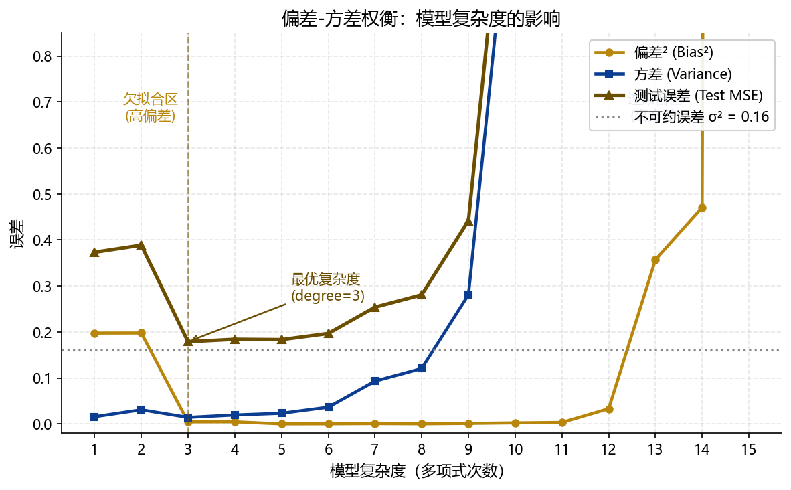
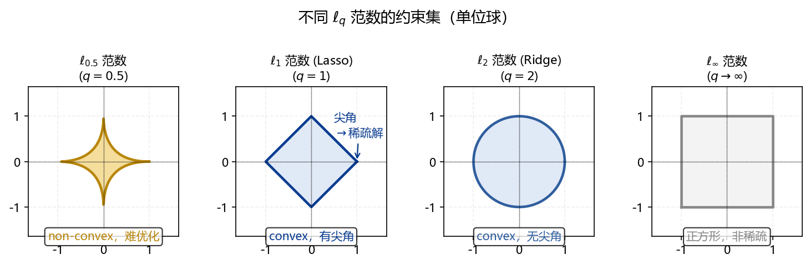
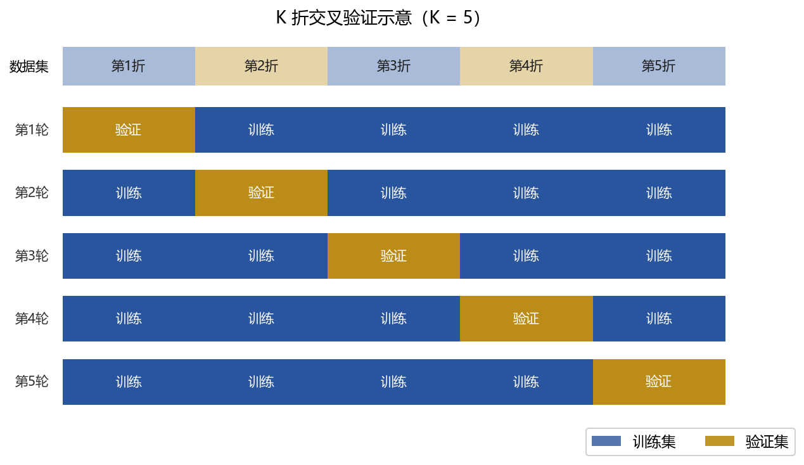

## 本章概览 {.unnumbered}

::: {.callout-note appearance="minimal"}
**学习目标**

完成本章学习后，你应该能够：

1.  区分机器学习的三种学习范式（监督、无监督、强化），并将金融中的典型任务归入对应范式
2.  解释"预测"与"因果推断"的本质区别，判断一个具体研究问题属于哪种目标
3.  推导均方误差（MSE）的偏差-方差分解，并用图形说明模型复杂度与两类误差的关系
4.  解释过拟合的成因，说明正则化如何从统一视角理解 Lasso、Ridge 和 Dropout
5.  计算并比较 ℓ₀、ℓ₁、ℓ₂、ℓ∞ 四种范数，解释为什么 ℓ₁ 是兼顾稀疏性与凸性的"甜点"
6.  描述 K 折交叉验证的完整算法步骤，说明为什么金融时序数据不能使用标准 K 折 CV
7.  从回归和分类两个场景中，选择合适的模型评估指标并解释其含义
8.  识别金融数据分析中的典型数据泄露（data leakage）情形并说明其危害

**与其他章节的关系**

-   前置知识：第 41 章（最大似然估计）§41.3–41.4；第 33 章（二元选择模型）§33.1
-   后续章节：本章所有概念（偏差-方差、交叉验证、范数、评估指标）将在 B–F 章中直接引用，不再重复推导
-   参考手册：本章相关 Python 实现见 `ml_ref_python.ipynb` 第 1–2 节
:::

------------------------------------------------------------------------

## 什么是机器学习 {#sec-A-what-is-ml}

### 从一个问题出发

一位信贷审核员每天要判断数百份贷款申请的违约风险。他的依据是申请者的年龄、收入、负债率、信用历史等信息。经过多年积累，他逐渐形成了一套"直觉"——哪些特征组合意味着高风险，哪些意味着低风险。

机器学习做的事情，本质上与这位审核员相同：**从数据中自动提取规律，并将其用于对新情况的判断**。不同之处在于，机器学习能处理数百个特征、数百万笔记录，且规律提取的过程是系统化、可复现的。

形式化地说，机器学习研究如何构建一个函数 $f$，使得对于输入 $\mathbf{x}$（特征向量），$f(\mathbf{x})$ 能够准确预测或分类输出 $y$（标签或目标变量）。这个"构建"的过程，就是从数据中**学习**。

### 三种学习范式

机器学习方法按照"学习信号"的类型，分为三种范式：

**监督学习（Supervised Learning）**：每个训练样本都有已知的标签 $y_i$。算法从 $\{(\mathbf{x}_i, y_i)\}_{i=1}^n$ 中学习输入与输出的映射关系。金融中的大多数预测任务属于此类——我们已经知道历史数据的结果，并希望用它来预测未来。当 $y$ 是连续变量时称为**回归**，当 $y$ 是类别变量时称为**分类**。

**无监督学习（Unsupervised Learning）**：训练数据只有特征 $\{\mathbf{x}_i\}_{i=1}^n$，没有标签。算法的任务是发现数据内部的结构——哪些样本彼此相似（聚类），哪些变量携带相同的信息（降维）。客户分群、资产相关性结构分析属于此类。

**强化学习（Reinforcement Learning）**：算法（"智能体"）通过与环境的交互获得奖励或惩罚信号，并学习在不同状态下选择何种行动以最大化长期奖励。算法交易策略的自动优化、投资组合的动态调整是典型应用场景。本 Part 不涉及强化学习。

### 金融中的典型任务分类

金融数据分析中的机器学习任务，按研究目标可以整理为 @tbl-A-task-taxonomy：

| 任务类型 | 目标变量  | 典型方法           | 金融应用实例                 |
|----------|-----------|--------------------|------------------------------|
| 回归     | 连续      | Lasso、RF、XGBoost | 股票收益率预测、波动率估计   |
| 分类     | 离散      | Logit、SVM、RF     | 违约预测、欺诈识别、信用评级 |
| 聚类     | 无标签    | K-means、层次聚类  | 客户分群、行业风格分类       |
| 降维     | 无标签    | PCA、因子分析      | 宏观因子提取、风险因子构建   |
| 因果推断 | 连续/离散 | DML、因果森林      | 政策效果评估、处理效应估计   |

: 金融数据分析中的机器学习任务分类 {#tbl-A-task-taxonomy}

------------------------------------------------------------------------

## 预测与因果：两种截然不同的目标 {#sec-A-prediction-vs-causal}

### 一个容易混淆的区别

"机器学习能帮我们做因果推断吗？"这是金融研究者最常问的问题之一。回答这个问题，需要先把**预测**和**因果推断**这两个目标彻底分清楚。

**预测**的目标是：给定特征 $\mathbf{x}$，尽可能准确地估计 $\mathbb{E}[y \mid \mathbf{x}]$，即 $y$ 的条件期望。我们不关心 $\mathbf{x}$ 的哪个分量在"驱动" $y$，只关心整体预测是否准确。一个模型即使完全依靠虚假相关（spurious correlation）来预测，只要样本外表现好，就是有价值的预测模型。

**因果推断**的目标是：估计"如果我改变 $x_j$，$y$ 会怎么变"。这是一个**干预**（intervention）问题，而非观测问题。仅凭预测精度无法回答这个问题——两件事同时发生，不代表其中一件导致了另一件。

用一个例子说明。一家银行发现，贷款违约率与申请者是否拥有高档手机存在强相关。这对**预测**模型有帮助（手机型号是一个有效特征），但如果据此推断"给申请者发放低端手机补贴可以降低违约率"，则是荒谬的——手机只是收入水平的代理变量，而非违约的原因。

::: callout-important
## ⚠️ 预测精度 ≠ 因果效应

高预测精度不能用来支持因果结论。一个 $R^2 = 0.95$ 的预测模型，其系数估计仍可能因为遗漏变量偏误、多重共线性或数据泄露而严重偏离真实的因果效应。

**判断规则**：如果研究问题包含"如果……会怎样"、"某政策的效果"、"X 对 Y 的影响"，那目标是因果推断，不是预测，需要使用 Chapter F 介绍的方法。
:::

### 机器学习在因果推断中的角色

这并不意味着机器学习与因果推断无关。机器学习方法在因果推断中扮演了越来越重要的**辅助角色**：

其一，当控制变量维度很高（甚至超过样本量）时，传统方法无法有效控制混淆因素，而 Lasso 等方法可以在高维空间中筛选有效的控制变量（DS-Lasso，见 Chapter F）。

其二，当真实的函数关系是非线性的，传统线性控制可能产生函数形式误设，而随机森林、XGBoost 等方法可以非参数地估计这些非线性关系，从而减少误设偏误（DML/DDML，见 Chapter F）。

**但无论使用多复杂的机器学习方法，如果存在不可观测的遗漏变量，因果估计仍然是有偏的**——这是所有方法的共同边界，机器学习没有例外。

------------------------------------------------------------------------

## 核心概念一：损失函数与经验风险 {#sec-A-loss-function}

### 从"最小化什么"出发

任何机器学习算法的核心，都是在优化一个目标函数。这个目标函数由两部分组成：衡量模型预测误差的**损失函数（Loss Function）**，以及防止过拟合的**正则化项**（将在 @sec-A-regularization 详述）。

对于最常见的线性模型 $\hat{y}_i = \mathbf{x}_i' \boldsymbol{\beta}$，损失函数的选择取决于目标变量的类型。

### 回归任务的损失函数

**均方误差（Mean Squared Error，MSE）**是最常用的回归损失函数：

$$
L_{\text{MSE}}(\boldsymbol{\beta}) = \frac{1}{n} \sum_{i=1}^{n} (y_i - \hat{y}_i)^2
$$ {#eq-A-mse-loss}

它惩罚大误差的力度比小误差强得多（因为误差被平方），对异常值敏感。在统计学习框架中，@eq-A-mse-loss 也称为**经验风险（Empirical Risk）**——"经验"是指基于观测样本计算的，而非真实总体。

当目标是得到对异常值更鲁棒的模型时，可以使用**平均绝对误差（Mean Absolute Error，MAE）**：

$$
L_{\text{MAE}}(\boldsymbol{\beta}) = \frac{1}{n} \sum_{i=1}^{n} |y_i - \hat{y}_i|
$$

与 OLS 的关系直接：最小化 $L_{\text{MSE}}$ 等价于 OLS 估计。事实上，在正态误差假设下，最小化 $L_{\text{MSE}}$ 也等价于最大化对数似然函数（参见第 41 章 §41.6.2）。

### 分类任务的损失函数

对于二分类问题（$y \in \{0, 1\}$），常用**交叉熵损失（Cross-Entropy Loss）**，它来自极大似然估计的框架：

$$
L_{\text{CE}}(\boldsymbol{\beta}) = -\frac{1}{n} \sum_{i=1}^{n} \left[ y_i \log \hat{p}_i + (1-y_i) \log(1-\hat{p}_i) \right]
$$ {#eq-A-cross-entropy}

其中 $\hat{p}_i = \sigma(\mathbf{x}_i' \boldsymbol{\beta})$ 是预测的违约概率，$\sigma(\cdot)$ 是 logistic 函数。最小化 @eq-A-cross-entropy 等价于 Logit 模型的 MLE（参见第 33 章 §33.2）。

::: callout-note
## 损失函数的统一视角

不同任务的损失函数看似各异，但都服从**经验风险最小化（Empirical Risk Minimization，ERM）**的统一框架：

$$
\hat{\boldsymbol{\beta}} = \arg\min_{\boldsymbol{\beta}} \frac{1}{n} \sum_{i=1}^{n} \ell(y_i, f(\mathbf{x}_i; \boldsymbol{\beta}))
$$

其中 $\ell(\cdot)$ 是针对具体任务选择的损失函数，$f(\cdot)$ 是模型结构。OLS、Logit、Poisson 回归都是 ERM 框架的特例，区别仅在于 $\ell$ 和 $f$ 的选取。Chapter B–D 介绍的各类机器学习方法，本质上都是对这个框架的修改或扩展。
:::

------------------------------------------------------------------------

## 核心概念二：偏差-方差权衡 {#sec-A-bias-variance}

### 预测误差从哪里来

训练好一个模型后，我们用**测试误差**来评价它在新数据上的表现：

$$
\text{Test Error} = \mathbb{E}\left[(y - \hat{f}(\mathbf{x}))^2\right]
$$ {#eq-A-test-error}

为什么会有测试误差？来源有三：

**方差（Variance）**：模型对训练数据中随机波动的敏感程度。如果换一批训练数据，模型的预测结果变化很大，就说方差高。复杂模型（如高次多项式）记住了训练样本的"噪声"，换数据后表现截然不同，方差因此很高。

**偏差（Bias）**：模型系统性地偏离真实规律的程度。如果模型结构本身就无法捕捉数据中的真实关系（比如用直线拟合一个 U 型关系），无论换多少数据都无济于事，这就是高偏差。

**不可约误差（Irreducible Error）**：数据本身固有的随机性 $\varepsilon$，即 $\text{Var}(\varepsilon)$。这部分误差无法通过改进模型来消除。

### MSE 的偏差-方差分解

可以证明，对于估计量 $\hat{f}$，测试误差可以分解为：

$$
\mathbb{E}\left[(y - \hat{f}(\mathbf{x}))^2\right]
= \underbrace{\left[\text{Bias}(\hat{f}(\mathbf{x}))\right]^2}_{\text{偏差}^2}
+ \underbrace{\text{Var}(\hat{f}(\mathbf{x}))}_{\text{方差}}
+ \underbrace{\text{Var}(\varepsilon)}_{\text{不可约误差}}
$$ {#eq-A-bias-variance-decomp}

其中偏差和方差的定义为：

$$
\text{Bias}(\hat{f}(\mathbf{x})) = \mathbb{E}[\hat{f}(\mathbf{x})] - f(\mathbf{x}), \quad
\text{Var}(\hat{f}(\mathbf{x})) = \mathbb{E}\left[\hat{f}(\mathbf{x}) - \mathbb{E}[\hat{f}(\mathbf{x})]\right]^2
$$

@eq-A-bias-variance-decomp 是机器学习中最重要的等式之一。它告诉我们：**降低偏差和降低方差往往是一对矛盾**。

::: {.callout-note collapse="true"}
## 推导：@eq-A-bias-variance-decomp 的代数证明

设真实模型为 $y = f(\mathbf{x}) + \varepsilon$，其中 $\mathbb{E}[\varepsilon] = 0$，$\text{Var}(\varepsilon) = \sigma^2$。令 $\mu = \mathbb{E}[\hat{f}(\mathbf{x})]$，则：

$$
\begin{aligned}
\mathbb{E}\left[(y - \hat{f})^2\right]
&= \mathbb{E}\left[(f + \varepsilon - \hat{f})^2\right] \\
&= \mathbb{E}\left[(f - \hat{f})^2\right] + 2\mathbb{E}\left[(f - \hat{f})\varepsilon\right] + \mathbb{E}[\varepsilon^2] \\
&= \mathbb{E}\left[(f - \hat{f})^2\right] + \sigma^2
\quad \text{（因为 }\hat{f}\text{ 与 }\varepsilon\text{ 独立）}
\end{aligned}
$$

对第一项继续展开，令 $\hat{f} = (\hat{f} - \mu) + (\mu - f) + f$：

$$
\begin{aligned}
\mathbb{E}\left[(f - \hat{f})^2\right]
&= \mathbb{E}\left[(\hat{f} - \mu)^2\right] + (\mu - f)^2
+ 2\underbrace{\mathbb{E}[(\hat{f} - \mu)](\mu - f)}_{= 0} \\
&= \text{Var}(\hat{f}) + \text{Bias}^2(\hat{f})
\end{aligned}
$$

因此 $\mathbb{E}[(y - \hat{f})^2] = \text{Bias}^2 + \text{Var} + \sigma^2$。$\blacksquare$
:::

### 权衡的直觉：模型复杂度

@fig-A-bias-variance-tradeoff 展示了偏差、方差与模型复杂度的关系：

-   **简单模型**（如线性回归）：偏差高（无法拟合非线性关系），方差低（换数据后预测稳定）
-   **复杂模型**（如高次多项式）：偏差低（能拟合任意形状），方差高（对训练数据敏感，换数据后预测剧烈变化）
-   **最优模型**处于两者之间，使测试误差最小，对应图中的"甜点区域"

{#fig-A-bias-variance-tradeoff width="85%"}

这个 U 型关系在金融中有一个直接类比：**策略回测中的曲线拟合（Curve Fitting）**。一个对历史数据过度拟合的交易策略，在训练期（样本内）表现完美，但在实盘（样本外）可能一败涂地。评价策略的标准应该是样本外表现，而非样本内表现。

### 训练集、验证集与测试集

为了在实践中估计测试误差，需要将数据集划分为三部分：

**训练集（Training Set）**：用于估计（拟合）模型参数。模型只能"看到"这部分数据。

**验证集（Validation Set）**：用于选择模型结构和超参数（如 Lasso 中的 $\lambda$）。验证集的误差指导"选哪个模型"，而不是"如何拟合模型"。

**测试集（Test Set）**：只在最终评估时使用一次，用于给出对模型真实表现的无偏估计。如果多次在测试集上评估并据此改进模型，测试集就"泄露"进了模型选择过程，其误差会低估真实的泛化误差。

::: callout-warning
## 🚫 常见错误：测试集的重复使用

测试集只能在最终确定模型后**使用一次**。如果根据测试集结果反复修改模型，测试集就变成了验证集，你需要另寻真正独立的测试数据。

这在金融研究中极为常见：研究者不断调整模型直到某个样本外时段的表现满意，这本质上是把该时段当成了验证集。论文中声称的"样本外表现"实际上已经被污染。
:::

------------------------------------------------------------------------

## 核心概念三：过拟合与正则化 {#sec-A-regularization}

### 过拟合的本质

**过拟合（Overfitting）**是指模型对训练数据拟合过好，但泛化能力差的现象。具体表现为：训练误差很低，但测试误差很高。

一个极端例子：用 $n$ 次多项式拟合 $n$ 个数据点，训练误差为零，但这条曲线在数据点之间剧烈震荡，对新数据几乎毫无预测能力。

过拟合的根本原因是**模型从训练数据中记住了噪声**，而噪声是不可泛化的。当模型参数数量接近或超过样本量时（高维数据的常态），过拟合风险急剧上升。

### 正则化：统一的解决框架

**正则化（Regularization）**是应对过拟合的通用策略：在损失函数之外，增加一个惩罚项来约束模型的复杂度：

$$
\text{目标函数} = \underbrace{L(\boldsymbol{\beta})}_{\text{损失函数}} + \lambda \underbrace{\Omega(\boldsymbol{\beta})}_{\text{正则化项}}
$$ {#eq-A-regularized-obj}

其中 $\lambda \geq 0$ 是调节参数，控制正则化的强度。$\lambda = 0$ 时退化为无约束的经验风险最小化；$\lambda \to \infty$ 时，正则化项主导，所有参数被迫收缩至零。

这个框架统一了多种看似不同的方法：

| 方法 | 正则化项 $\Omega(\boldsymbol{\beta})$ | 效果 |
|----------------|---------------------------------------|----------------|
| Lasso | $\|\boldsymbol{\beta}\|_1 = \sum_j |\beta_j|$ | 部分系数被压缩至恰好为零（稀疏解） |
| Ridge 岭回归 | $\|\boldsymbol{\beta}\|_2^2 = \sum_j \beta_j^2$ | 所有系数均匀收缩，不产生稀疏解 |
| 弹性网 | $\alpha\|\boldsymbol{\beta}\|_1 + (1-\alpha)\|\boldsymbol{\beta}\|_2^2$ | 兼顾稀疏性与共线性处理 |
| 决策树剪枝 | 叶节点数量 | 减少树的复杂度 |
| 神经网络 Dropout | 随机丢弃节点 | 等效于一种隐式正则化 |

从这个角度看，正则化的本质是**对模型复杂度收取"税"**——模型越复杂，需要付出的代价越高，因此只有当增加复杂度带来的预测精度提升足够大时，才值得"付税"。

------------------------------------------------------------------------

## 核心概念四：范数与距离 {#sec-A-norms}

### 为什么需要范数

正则化项的设计依赖于对"系数向量大小"的度量，这正是**范数（Norm）**的用途。不同的范数对"大小"的理解不同，产生截然不同的正则化效果。

### 四种常用范数

给定向量 $\boldsymbol{\beta} = (\beta_1, \beta_2, \ldots, \beta_p)'$，$\ell_q$ 范数的通用定义为：

$$
\|\boldsymbol{\beta}\|_q = \left(\sum_{j=1}^{p} |\beta_j|^q\right)^{1/q}, \quad q \geq 1
$$ {#eq-A-lq-norm}

几个特殊情形：

**ℓ₀ 范数（**$q \to 0$）：向量中非零元素的个数，$\|\boldsymbol{\beta}\|_0 = \sum_j \mathbf{1}\{\beta_j \neq 0\}$。稀疏性假设可以表示为 $\|\boldsymbol{\beta}\|_0 \ll n$。直接以 ℓ₀ 范数为惩罚项的最优子集选择（Best Subset Selection）是一个组合优化问题，计算上是 NP-hard 的。

**ℓ₁ 范数（**$q = 1$）：各元素绝对值之和，$\|\boldsymbol{\beta}\|_1 = \sum_j |\beta_j|$。又称**曼哈顿距离（Manhattan Distance）**。Lasso 以 ℓ₁ 范数为惩罚项。

**ℓ₂ 范数（**$q = 2$）：各元素平方和再开根，$\|\boldsymbol{\beta}\|_2 = \sqrt{\sum_j \beta_j^2}$。即**欧氏距离（Euclidean Distance）**。岭回归以 ℓ₂ 范数的平方为惩罚项。

**ℓ∞ 范数（**$q \to \infty$）：各元素绝对值的最大值，$\|\boldsymbol{\beta}\|_\infty = \max_j |\beta_j|$。

### 为什么 ℓ₁ 是"甜点"

@fig-A-norm-balls 展示了二维情形下不同范数对应的**单位球（Unit Ball）**——所有满足 $\|\boldsymbol{\beta}\|_q \leq 1$ 的点的集合：

{#fig-A-norm-balls width="80%"}

这个图揭示了 ℓ₁ 范数的两个关键性质的由来：

**稀疏性来自"尖角"**：Lasso（ℓ₁）的约束集是正方形，OLS 目标函数的等高椭圆在收缩过程中，**极有可能首先与正方形的顶点（坐标轴上）相切**。顶点处的特征是某些坐标为零，因此 Lasso 估计自然产生稀疏解。岭回归（ℓ₂）的约束集是圆形，没有尖角，等高椭圆几乎不可能恰好切在坐标轴上，因此不能产生严格为零的系数。

**凸性保证可解性**：$q < 1$ 的约束集有"尖角"，甚至比 ℓ₁ 更稀疏，但约束集是**非凸**的，导致优化问题存在多个局部最小值，难以求解。$q = 1$（ℓ₁）是使约束集仍为凸集的最小 $q$ 值——它恰好处于"有尖角（稀疏）"和"凸（可解）"两个约束同时成立的临界点。这正是 Lasso 被广泛采用的数学根源。

::: callout-tip
## 直觉总结：ℓ₁ 的"甜点"地位

$$
\underbrace{q < 1}_{\text{非凸，难解}} \quad \underbrace{q = 1}_{\text{有尖角 + 凸，「甜点」}} \quad \underbrace{q > 1}_{\text{凸但无尖角，不稀疏}}
$$

ℓ₁ 是唯一同时满足"约束集有尖角（能产生稀疏解）"和"约束集为凸（优化问题有全局解）"的范数。这不是巧合，而是 Lasso 在理论和实践中被广泛采用的根本原因。
:::

------------------------------------------------------------------------

## 核心概念五：模型选择与交叉验证 {#sec-A-cross-validation}

### 超参数选择问题

绝大多数机器学习方法都有一个或多个**超参数（Hyperparameter）**——这些参数不是通过最小化训练集损失函数来估计的，而是需要在训练之前指定的。Lasso 的调节参数 $\lambda$、随机森林的树的数量 $B$、SVM 的惩罚参数 $C$，都是超参数。

超参数的选择直接影响模型的偏差-方差权衡，因此需要有系统的方法来确定最优值。**交叉验证（Cross-Validation，CV）**是目前最普遍的方法。

### K 折交叉验证

**K 折交叉验证（K-Fold Cross-Validation）**的算法步骤如下：

1.  将训练数据随机等分为 $K$ 组（折），记为 $\mathcal{S}_1, \mathcal{S}_2, \ldots, \mathcal{S}_K$，每组样本量约为 $n/K$
2.  对 $k = 1, 2, \ldots, K$，依次执行：
    -   用除第 $k$ 折以外的 $K-1$ 折数据（$\mathcal{S}_{-k}$）训练模型，得到参数估计 $\hat{\boldsymbol{\beta}}_{-k}$
    -   在第 $k$ 折（验证集）上计算预测误差：$\text{MSE}_k = \frac{1}{|\mathcal{S}_k|}\sum_{i \in \mathcal{S}_k}(y_i - \mathbf{x}_i' \hat{\boldsymbol{\beta}}_{-k})^2$
3.  计算 $K$ 折的平均误差：$\text{CV}_K = \frac{1}{K}\sum_{k=1}^K \text{MSE}_k$
4.  对候选超参数集合中的每个值，重复上述步骤，选择使 $\text{CV}_K$ 最小的超参数值

通常取 $K = 5$ 或 $K = 10$。$K$ 越大，每折验证集越小，CV 估计的方差越大但偏差越小；$K$ 越小，计算越快但估计可能偏高。$K = n$（即每次只留一个观测作为验证集）称为**留一法（Leave-One-Out，LOO-CV）**，计算成本极高，通常只在样本量很小时使用。

**1-SE 规则（One Standard Error Rule）**：除了选择使 CV 误差最小的超参数外，实践中常用"1-SE 规则"——在所有 CV 误差在最小值加一倍标准误以内的超参数中，选择对应**最简单模型**（最大 $\lambda$）的那个。这样得到的模型比最优 CV 模型更精简，但预测性能不会有显著下降。

{#fig-A-kfold-cv width="85%"}

### 金融时序数据的特殊处理

标准 K 折 CV 假设样本之间相互独立，随机分组不会导致"未来信息"出现在训练集中。这个假设对截面数据（cross-sectional data）是合理的，但对**时间序列数据**则严重不成立。

::: callout-caution
## 📊 金融时序数据：禁止使用标准 K 折 CV

对于时间序列数据，随机分组会导致训练集包含验证集之后的数据（未来信息泄露到训练中），这在实践中是不可能发生的，会严重高估模型的样本外表现。

**正确做法**：使用**前向滚动验证（Walk-Forward Validation）**：

-   始终保持训练集在时间上早于验证集
-   常见方式：扩展训练窗口（expanding window）或固定长度训练窗口（rolling window）

例如，若数据覆盖 2000–2023 年，可以：用 2000–2015 年训练，2016 年验证；然后用 2000–2016 年训练，2017 年验证；以此类推直至 2022 年验证 2023 年。
:::

### Bootstrap

**Bootstrap** 是另一种重采样方法，基本思想是：将样本数据视为总体的近似，通过对样本**有放回地**重复抽取，模拟从总体中多次取样的过程。

具体步骤：从 $n$ 个观测中有放回地随机抽取 $n$ 个，得到一个"Bootstrap 样本"；重复 $B$ 次（通常 $B = 200 \sim 1000$），得到 $B$ 个估计值 $\{\hat{\theta}^{(b)}\}_{b=1}^B$；用这 $B$ 个估计值的标准差估计 $\hat{\theta}$ 的标准误，用百分位数构造置信区间。

Bootstrap 在 Part V 中的主要用途是为随机森林提供理论基础——随机森林正是通过对训练样本 Bootstrap 抽样来训练多棵决策树（见 Chapter C）。

------------------------------------------------------------------------

## 核心概念六：模型评估指标 {#sec-A-metrics}

### 回归任务的评估指标

给定真实值 $\{y_i\}$ 和预测值 $\{\hat{y}_i\}$：

**均方误差（MSE）与均方根误差（RMSE）**：

$$
\text{MSE} = \frac{1}{n}\sum_{i=1}^n (y_i - \hat{y}_i)^2, \quad
\text{RMSE} = \sqrt{\text{MSE}}
$$

RMSE 与 $y$ 的量纲相同，更便于直觉理解（"平均预测误差大约是 X 个单位"）。

**样本外** $R^2$（Out-of-Sample $R^2$，$R^2_{\text{OOS}}$）：

$$
R^2_{\text{OOS}} = 1 - \frac{\sum_{i \in \text{test}}(y_i - \hat{y}_i)^2}{\sum_{i \in \text{test}}(y_i - \bar{y}_{\text{train}})^2}
$$ {#eq-A-oos-r2}

其中 $\bar{y}_{\text{train}}$ 是训练集均值。$R^2_{\text{OOS}} > 0$ 说明模型优于简单的均值预测；$R^2_{\text{OOS}} < 0$ 说明模型甚至不如直接用均值来预测（常见于过拟合情形）。

::: callout-important
## ⚠️ 样本内 $R^2$ 不能衡量预测能力

样本内 $R^2$（训练集上计算）随模型复杂度单调递增，增加任何一个变量都不会使其下降。用样本内 $R^2$ 来比较不同复杂度的模型，必然选择最复杂的那个。

**金融预测研究的标准**：报告**样本外** $R^2$（$R^2_{\text{OOS}}$），或信息系数（IC）等基于样本外预测的指标。
:::

**平均绝对误差（MAE）**：对异常值更鲁棒，适合股票收益率等厚尾分布的预测评估。

### 分类任务的评估指标

对于二分类问题，预测结果与真实标签形成 **混淆矩阵（Confusion Matrix）**：

|                       | 预测为正（$\hat{y}=1$） | 预测为负（$\hat{y}=0$） |
|-----------------------|-------------------------|-------------------------|
| **真实为正（**$y=1$） | 真正例（TP）            | 假负例（FN）            |
| **真实为负（**$y=0$） | 假正例（FP）            | 真负例（TN）            |

由此派生出多个常用指标：

$$
\text{精确率（Precision）} = \frac{TP}{TP + FP}, \quad
\text{召回率（Recall）} = \frac{TP}{TP + FN}
$$

精确率衡量"预测为正的样本中，真正为正的比例"；召回率衡量"真正为正的样本中，被正确预测出来的比例"。两者存在权衡：提高分类阈值会提高精确率但降低召回率。**F1 分数**是两者的调和平均：

$$
F_1 = \frac{2 \cdot \text{Precision} \cdot \text{Recall}}{\text{Precision} + \text{Recall}}
$$

**AUC-ROC（Area Under the ROC Curve）**：衡量模型在所有可能分类阈值下的综合表现，取值范围 $[0.5, 1]$，越高越好（0.5 对应随机猜测）。AUC 不受类别不平衡影响，是信用风险模型评估的行业标准指标之一。

------------------------------------------------------------------------

## 金融应用中的常见陷阱 {#sec-A-pitfalls}

掌握了上述基础概念后，还需要了解机器学习在金融应用中的几类特殊风险。这些问题不是理论上的担忧，而是实证研究和量化实践中真实发生过的、导致结论严重失真的错误。

### 数据泄露

**数据泄露（Data Leakage）**是指训练集中包含了在真实预测场景下本不可能获得的信息，导致模型在测试集上的表现被虚假地夸大。

金融数据中最常见的泄露形式：

**时间泄露**：用 $t$ 时刻的特征预测 $t-1$ 时刻的结果，或特征构建中无意引入了未来信息（例如用月末收盘价计算的指标去预测月初的交易决策）。

**前瞻性偏差（Look-ahead Bias）**：财务数据的发布时间（如年报）通常滞后于数据所描述的时间（如会计年度）。若不考虑这个滞后直接使用，等于用"未来"的财务数据来"预测"过去的股价。

**目标泄露**：特征变量是目标变量的直接变换或高度相关的同期变量，例如用当期 ROE 预测当期股价（两者同时决定，并非因果）。

::: callout-warning
## 🚫 常见错误：特征工程中的时间错位

在滚动计算技术指标（如移动平均、动量）时，若使用 `pandas` 的 `rolling().mean()` 等函数，默认包含当前时刻（$t$）的数据，而预测目标通常是 $t+1$ 时刻的收益率。应使用 `shift(1)` 将特征向后移动一期，确保特征严格先于预测目标。

``` python
# 错误：当期数据参与了对当期收益率的"预测"
df['ma_20'] = df['price'].rolling(20).mean()

# 正确：特征严格早于目标变量
df['ma_20'] = df['price'].rolling(20).mean().shift(1)
```
:::

### 多重检验问题

在金融研究中，研究者往往测试了数十甚至数百个模型/因子，最后只报告表现最好的那个。这是一种隐性的多重检验：如果测试 100 个无效因子，仅凭随机性，期望就有约 5 个在 5% 显著性水平下"通过检验"。

Harvey, Liu, and Zhu (2016) 的研究显示，金融学文献中已发现的 300 多个定价因子中，许多可能是多重检验的产物，而非真实的风险溢价。应对方式包括：使用 Bonferroni 校正或 Benjamini-Hochberg 校正；在独立的时段或数据集上进行真正的样本外检验。

### 预测 ≠ 因果（再次强调）

这是金融机器学习研究中最重要的认知边界，值得再次强调。一个常见的误用场景是：研究者用 XGBoost 或随机森林建立了一个高样本外 $R^2$ 的收益率预测模型，然后根据特征重要性（Feature Importance）或 SHAP 值，声称某个因子"对收益率有显著影响"。

这个推断是不成立的。特征重要性衡量的是变量对**预测精度的贡献**，而非因果效应。一个纯粹的代理变量（如前面提到的手机型号）可能有很高的特征重要性，但对收益率没有任何因果作用。如需进行因果解读，必须使用 Chapter F 介绍的专门方法。

------------------------------------------------------------------------

## Part V 方法全景图 {#sec-A-overview}

在进入各章具体方法之前，用一张全景图展示 Part V 的整体脉络及各方法之间的关系，有助于学习过程中把握方向。

**按任务目标划分的方法谱系：**

```         
预测导向（重视泛化能力）
├── 线性方法
│   ├── Lasso（稀疏，ℓ₁ 正则）          ← Chapter B
│   ├── Ridge 岭回归（稠密，ℓ₂ 正则）    ← Chapter B
│   └── 弹性网（ℓ₁ + ℓ₂）              ← Chapter B
├── 核方法
│   └── 支持向量机（SVM）                ← Chapter D
└── 集成方法
    ├── 随机森林（Bagging + 特征随机）   ← Chapter C
    └── 梯度提升 / XGBoost               ← Chapter C

无监督（发现结构）                        ← Chapter E
├── 降维：PCA、因子分析
└── 聚类：K-means、层次聚类

因果推断导向（重视无偏性）               ← Chapter F
├── 高维控制变量筛选
│   ├── DS-Lasso（双重选择）
│   └── PO-Lasso（部分消除）
├── 非参数控制 + 交叉拟合
│   ├── DML（Lasso 第一阶段）
│   └── DDML（任意 ML 第一阶段）
├── 工具变量筛选
│   └── Lasso-IV
└── 异质性处理效应
    └── 因果森林（Causal Forest）
```

**各章之间的依赖关系：**

Chapter A（本章）为全部后续章节提供基础概念。Chapter B 和 Chapter C 相互独立，可并行学习。Chapter F 依赖 B 章（Lasso 知识）和 C 章（随机森林知识），但在方法引用时会明确交叉引用，不需要重读前章即可理解主线。Chapter D 和 Chapter E 完全独立，可在任意顺序插入。

------------------------------------------------------------------------

## 本章小结 {#sec-A-summary}

本章为 Part V 的学习搭建了概念框架。核心结论有四点：

**其一，机器学习的三种范式**——监督学习、无监督学习、强化学习——服务于不同的金融任务。金融数据分析中，监督学习（预测和分类）和无监督学习（降维和聚类）是主体，因果推断则横跨了监督学习的技术和计量经济学的推断目标。

**其二，偏差-方差权衡**是理解所有机器学习方法性能的统一框架。所有正则化方法（Lasso、Ridge、树的剪枝……）本质上都是在接受一定偏差的代价下，换取方差的降低，从而改善样本外泛化能力。

**其三，ℓ₁ 范数（Lasso）是稀疏性与凸性的交汇点**——它是唯一既能产生稀疏解，又能保证优化问题有全局解的范数，这是 Lasso 被广泛采用的数学根源。

**其四，预测与因果是两种截然不同的目标**。预测模型的高精度不能支持因果结论；金融数据中的数据泄露（时间错位、前瞻偏差）是最常见的导致结论失真的错误。需要因果推断时，必须使用 Chapter F 介绍的专门方法。

本章没有覆盖的内容：各具体方法的模型设定与估计（B–F 章）；金融时序数据的滚动窗口预测框架（Chapter B 案例）；可解释性方法 SHAP（Chapter C）；非参数函数估计（Chapter F）。

## 参考文献 {.unnumbered}

::: {#refs}
:::