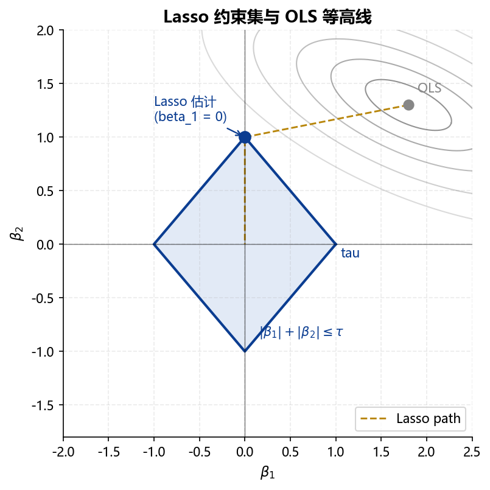
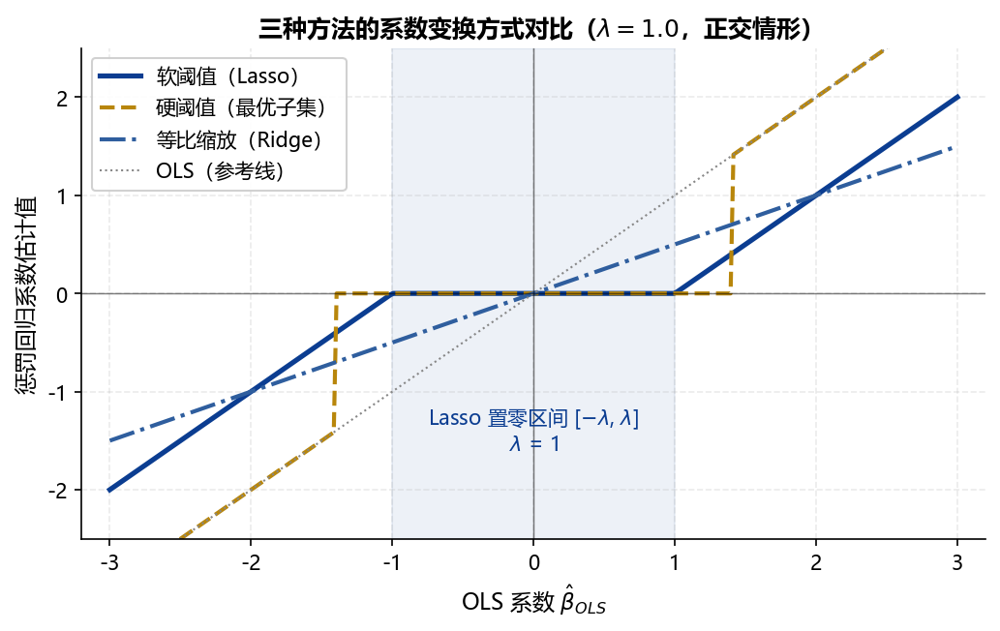
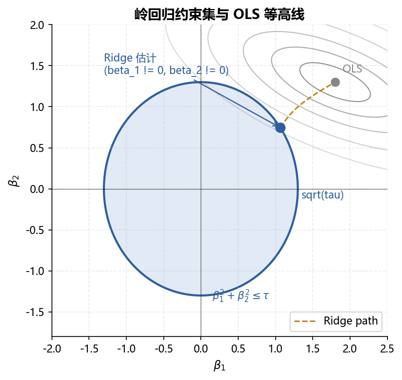
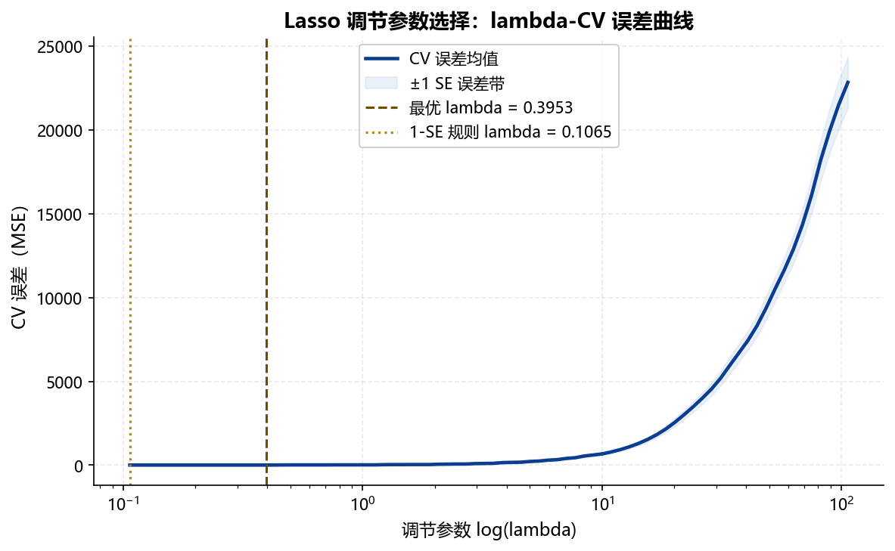
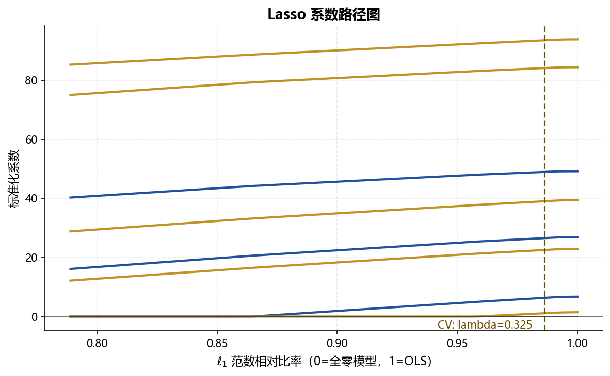
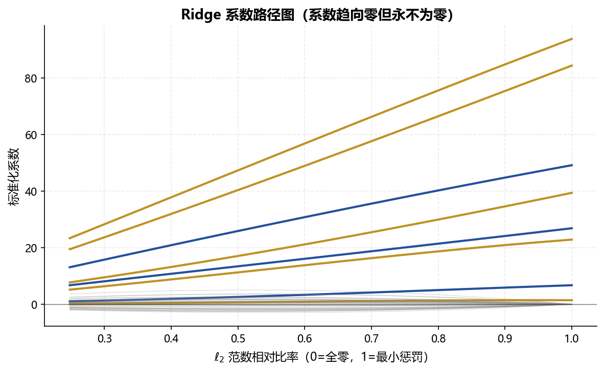

## 本章概览 {.unnumbered}

::: {.callout-note appearance="minimal"}
**学习目标**

完成本章学习后，你应该能够：

1.  解释 Lasso 回归的约束形式与拉格朗日形式，说明两者等价的条件
2.  从几何直觉出发，解释为什么 ℓ₁ 约束集能产生稀疏解（部分系数恰好为零）
3.  推导正交情形下 Lasso 和 Ridge 的解析解，并与 OLS 做比较
4.  解释软阈值算子的含义，描述坐标下降法的基本步骤
5.  推导岭回归估计量 $\hat{\mathbf{\beta}}_{\text{ridge}} = (\mathbf{X}'\mathbf{X} + \lambda \mathbf{I})^{-1}\mathbf{X}'\mathbf{y}$，说明为何能解决共线性问题
6.  写出弹性网的目标函数，说明参数 $\alpha$ 的作用和适用场景
7.  在给定研究目的（预测 vs. 模型筛选）的条件下，判断应使用 CV、BIC 还是 Plugin 方法选择调节参数 $\lambda$
8.  解读 λ-CV 误差曲线图，说明"1-SE 规则"的含义
9.  用 `sklearn` 实现 Lasso、Ridge、弹性网的估计，绘制系数路径图

**与其他章节的关系**

-   前置知识：Chapter A §A.3（损失函数与 ERM）、§A.4（偏差-方差权衡）、§A.5（正则化框架）、§A.6（范数）、§A.7（交叉验证）
-   后续章节：Chapter C（树模型）与本章独立；Chapter F（因果推断）将直接使用 Lasso 进行变量筛选（DS-Lasso、Post-Lasso、DML），建议先完成本章
-   参考手册：Python 实现见 `ml_ref_python.ipynb` 第 2 节
:::

------------------------------------------------------------------------

## 简介 {#sec-B-intro}

### 何谓 Lasso？

**Lasso** 是"Least Absolute Shrinkage and Selection Operator"的简称，由 Tibshirani（1996）提出，主要用于**预测（Prediction）**和**模型筛选（Model Selection）**。其核心思想是在传统回归分析中施加 ℓ₁ 范数约束，迫使部分系数恰好收缩为零，从而自动筛选出重要变量，得到稀疏模型。

以 Lasso 为首的一类方法统称为**惩罚回归（Penalized Regression）**，也称为**正则化回归（Regularized Regression）**。

### 为什么需要惩罚回归

传统 OLS 在两类情形下会遇到根本性困难：

**情形一：**$p > n$（变量数超过样本量）。此时 $\mathbf{X}'\mathbf{X}$ 是奇异矩阵，OLS 估计量没有唯一解。这在金融数据中并不罕见——一份企业财务数据库可能包含数百个特征变量，而可用的样本却只有几十家公司。

**情形二：**$p < n$ 但变量高度共线。此时 $\mathbf{X}'\mathbf{X}$ 虽然可逆，但接近奇异，导致 OLS 估计量的方差极大、数值上极不稳定。

惩罚回归通过对系数施加约束来应对这两类问题。约束的代价是引入偏差，但换来的是方差的显著降低，从而提升模型的样本外预测能力——这正是 Chapter A 中介绍的偏差-方差权衡在实践中的体现。

### 稀疏性假设

高维数据的惩罚回归方法依赖一个核心假设：**稀疏性假设（Sparsity Assumption）**。

**严格稀疏性**：$p$ 个变量中，真正具有非零系数的只有 $s$ 个，且 $s \ll n$：

$$
s := \sum_{j=1}^{p} \mathbf{1}\{\beta_j \neq 0\} \ll n
$$

**近似稀疏性**：部分 $\beta_j$ 系数近似为零（不一定精确等于零），且近似误差足够小。这是更宽松、更实用的假设，也是大多数理论结果成立所需的条件。

在金融数据分析中，稀疏性有直接的经济含义：虽然潜在的影响因素很多，但真正驱动资产收益率的因子只有少数几个——这与 Fama-French 三因子、五因子模型的思路一脉相承。

------------------------------------------------------------------------

## Lasso 回归 {#sec-B-lasso}

### 模型设定 {#sec-B-lasso-setup}

给定 $n$ 个观测值的样本 $\{(y_i, \mathbf{x}_i)\}_{i=1}^n$，Lasso 通过极小化如下**约束优化问题**来估计参数：

$$
\min_{\mathbf{\beta}} \left\{ \frac{1}{2n} \|\mathbf{y} - \mathbf{X}\mathbf{\beta}\|_2^2 \right\}
\quad \text{subject to} \quad \|\mathbf{\beta}\|_1 \leq \tau
$$ {#eq-B-lasso-constraint}

其中 $\tau > 0$ 是约束集的半径，控制系数向量的 ℓ₁ 范数不超过 $\tau$。等价地，将约束条件转化为拉格朗日（Lagrangian）形式，得到更便于求解的**无约束优化问题**：

$$
\min_{\mathbf{\beta}} \left\{ \frac{1}{2n} \|\mathbf{y} - \mathbf{X}\mathbf{\beta}\|_2^2 + \lambda \|\mathbf{\beta}\|_1 \right\}
$$ {#eq-B-lasso-lagrange}

其中 $\lambda \geq 0$ 称为**调节参数（Tuning Parameter）**，控制正则化强度。$\tau$ 与 $\lambda$ 之间存在一一对应关系：对于每个 $\tau$ 值，存在唯一对应的 $\lambda$ 值，使两种形式产生完全相同的解。

$\lambda$ 的边界行为： - $\lambda = 0$：约束失效，退化为 OLS - $\lambda \to \infty$：所有系数被压缩至零，模型只剩常数项

::: callout-important
## ⚠️ 使用 Lasso 前必须标准化变量

Lasso 的估计结果**依赖于变量的量纲**。若各变量尺度差异悬殊（如一个以"元"为单位、另一个以"亿元"为单位），调节参数 $\lambda$ 对不同变量的惩罚力度实际上是不均等的，导致模型选择结果失真。

**标准化操作**：对每个特征变量减去均值、除以标准差，使均值为 0、标准差为 1。同时，对 $y$ 进行去均值处理，以省去常数项的估计。标准化后得到的系数 $\hat{\mathbf{\beta}}$ 即为 Lasso 估计结果。若需恢复原始量纲，常数项的还原公式为：

$$
\hat{\beta}_0 = \bar{y} - \sum_{j=1}^{p} \bar{x}_j \hat{\beta}_j
$$

在 `sklearn` 中，`StandardScaler` 会自动完成标准化；`Lasso` 等类内置了 `normalize` 或可配合 `Pipeline` 使用，无需手动操作。
:::

### Lasso 的几何直觉 {#sec-B-lasso-geometry}

@fig-B-lasso-constraint 展示了二维情形（$p=2$）下 Lasso 的求解过程。

图中椭圆族是 OLS 目标函数（残差平方和）的**等高线**，中心点（OLS 估计）处 RSS 最小。正方形是 Lasso 的**约束集** $\{|\beta_1| + |\beta_2| \leq \tau\}$。

Lasso 求解的几何含义是：**在约束集内，找到使 RSS 最小的点**，即等高椭圆与约束集的第一个切点。

约束集是正方形，有四个**尖角**，恰好落在坐标轴上（即某个系数为零的位置）。等高椭圆在收缩过程中，极有可能最先与尖角相切——这就是 Lasso 产生**稀疏解**的几何根源。

随着 $\tau$（或等价地，$\lambda$）的变化，切点的轨迹形成**Lasso 路径（Lasso Path）**，如图中虚线所示：从 OLS 估计出发，逐步将系数压缩，直至为零。

{#fig-B-lasso-constraint width="65%"}

相比之下，岭回归的约束集是圆形，没有尖角，等高椭圆与圆的切点几乎不可能落在坐标轴上，因此岭回归不能产生零系数（不能做变量筛选）。

### 估计方法 {#sec-B-lasso-estimation}

#### 次导数与软阈值算子

@eq-B-lasso-lagrange 中，惩罚项 $\|\mathbf{\beta}\|_1 = \sum_j |\beta_j|$ 在 $\beta_j = 0$ 处不可微，无法直接用普通微积分求解。为此，引入**次导数（Subgradient）**的概念。

函数 $f(\beta) = |\beta|$ 在 $\beta \neq 0$ 处的导数为 $\text{sgn}(\beta)$；在 $\beta = 0$ 处，定义其次微分为区间 $[-1, 1]$ 中的任意值。由此，Lasso 目标函数对 $\beta_j$ 的一阶条件为：

$$
-\frac{1}{n}\mathbf{x}_j'(\mathbf{y} - \mathbf{X}\mathbf{\beta}) + \lambda \cdot \partial|\beta_j| = 0
$$

其中 $\partial|\beta_j|$ 是 $|\beta_j|$ 的次微分。若 $\mathbf{X}'\mathbf{X} = \mathbf{I}_p$（正交情形），一阶条件有解析解，称为**软阈值算子（Soft Thresholding Operator）**：

$$
\hat{\beta}_j^{\text{Lasso}} = \text{sgn}(\hat{\beta}_j^{\text{OLS}}) \cdot \left(|\hat{\beta}_j^{\text{OLS}}| - \lambda\right)_+
$$ {#eq-B-soft-threshold}

其中 $(z)_+ = \max(z, 0)$。其含义是：将 OLS 系数向零移动 $\lambda$，若绝对值小于 $\lambda$ 则直接令其为零。这就是 Lasso 产生稀疏解的代数根源。

::: {.callout-note collapse="true"}
## 数学补充：次导数的几何含义

对于函数 $f(x) = |x|$，在 $x = 0$ 处虽然不可微，但存在所有满足以下条件的斜率 $g$：

$$
f(y) \geq f(x) + g(y - x), \quad \forall y
$$

这样的 $g$ 构成的集合 $[-1, 1]$ 称为 $f$ 在 $x=0$ 处的**次微分（Subdifferential）**。次导数将经典微积分推广到了不可微函数，是求解 Lasso 等凸优化问题的理论基础。
:::

#### 坐标下降法

实际计算中，Lasso 通常用**坐标下降法（Coordinate Descent）**求解：固定所有其他系数 $\beta_k\ (k \neq j)$，只对 $\beta_j$ 进行一维优化；循环遍历所有 $j = 1, 2, \ldots, p$，直到收敛。

每次更新 $\beta_j$ 时，计算**偏残差**（控制其他变量后 $x_j$ 对 $y$ 的"净贡献"）：

$$
r_{ij} = y_i - \sum_{k \neq j} x_{ik}\hat{\beta}_k
$$

然后对一维问题应用软阈值：

$$
\hat{\beta}_j \leftarrow \text{sgn}(\hat{r}_j) \cdot \left(|\hat{r}_j| - \lambda\right)_+,
\quad \hat{r}_j = \frac{1}{n}\mathbf{x}_j'\mathbf{r}_{-j}
$$

坐标下降法每次迭代的计算量仅为 $O(np)$，效率极高，是 `sklearn` 中 Lasso 的默认求解器。

### 正交情形下的解析解对比 {#sec-B-analytic-solutions}

当 $\mathbf{X}'\mathbf{X} = \mathbf{I}_p$ 时，三种方法（最优子集、Lasso、Ridge）都有解析解，且都是 OLS 估计的简单变换，见 @tbl-B-methods-compare：

| 方法 | $q$ | 估计公式 | 变量筛选 | 连续性 |
|---------------|---------------|---------------|---------------|---------------|
| 最优子集（Best Subset） | 0 | $\hat{\beta}_j^{\text{OLS}} \cdot \mathbf{1}[|\hat{\beta}_j^{\text{OLS}}| > \sqrt{2\lambda}]$ | ✓（硬阈值） | ✗ 不连续 |
| **Lasso** | **1** | $\text{sgn}(\hat{\beta}_j^{\text{OLS}}) (|\hat{\beta}_j^{\text{OLS}}| - \lambda)_+$ | **✓（软阈值）** | **✓ 连续** |
| Ridge（岭回归） | 2 | $\hat{\beta}_j^{\text{OLS}} / (1 + \lambda)$ | ✗ 等比缩放 | ✓ 连续 |

: 正交情形下各方法估计公式对比 {#tbl-B-methods-compare}

@fig-B-soft-threshold 直观展示了三种变换的差异：软阈值（Lasso）在零处产生截断，但在两侧保持斜率为 1；硬阈值（最优子集）产生不连续的跳跃；岭回归则对所有系数做等比缩放，永远不会产生零值。

{#fig-B-soft-threshold width="80%"}

------------------------------------------------------------------------

## 岭回归 {#sec-B-ridge}

### 模型设定与估计量

岭回归（Ridge Regression，Hoerl & Kennard, 1970）采用 ℓ₂ 范数约束，其拉格朗日形式为：

$$
\min_{\mathbf{\beta}} \left\{ \frac{1}{2n} \|\mathbf{y} - \mathbf{X}\mathbf{\beta}\|_2^2 + \lambda \|\mathbf{\beta}\|_2^2 \right\}
$$ {#eq-B-ridge-lagrange}

与 Lasso 不同，ℓ₂ 惩罚项处处可微，因此 @eq-B-ridge-lagrange 有解析解。对 $\mathbf{\beta}$ 求导并令其为零，得到：

$$
\hat{\mathbf{\beta}}_{\text{ridge}} = (\mathbf{X}'\mathbf{X} + \lambda \mathbf{I}_p)^{-1} \mathbf{X}'\mathbf{y}
$$ {#eq-B-ridge-solution}

### 如何解决共线性

当 $\mathbf{X}'\mathbf{X}$ 接近奇异（高度共线性或 $p > n$）时，OLS 的 $(\mathbf{X}'\mathbf{X})^{-1}$ 会极不稳定。岭回归在对角线上加了 $\lambda \mathbf{I}_p$，使矩阵的**最小特征值从接近 0 变为至少** $\lambda$，保证矩阵满秩可逆。代价是系数估计不再无偏：

$$
\mathbb{E}[\hat{\mathbf{\beta}}_{\text{ridge}}] = (\mathbf{X}'\mathbf{X} + \lambda \mathbf{I}_p)^{-1}\mathbf{X}'\mathbf{X}\mathbf{\beta} \neq \mathbf{\beta}
$$

这是一个典型的偏差-方差权衡：$\lambda$ 越大，偏差越大，但方差越小（估计越稳定）。即使 $p > n$，岭回归也有唯一解——这是它相比 OLS 的根本优势。

单位矩阵 $\mathbf{I}_p$ 的对角线全是 1，像一条山脊（ridge），"岭回归"因此得名。

::: callout-important
## ⚠️ 岭回归不能做变量筛选

岭回归的约束集是圆形，没有尖角（见 @fig-B-ridge-constraint）。等高椭圆与圆的切点几乎不可能落在坐标轴上，因此岭回归的系数只能趋近于零，**永远不会恰好等于零**。

**使用场景**：当目标是**预测**（而非筛选变量），且变量间存在高度共线性时，岭回归通常比 Lasso 更稳定。当目标是**变量筛选**或**因果推断**时，应使用 Lasso 或弹性网。
:::

{#fig-B-ridge-constraint width="65%"}

------------------------------------------------------------------------

## 弹性网 {#sec-B-elasticnet}

### 模型设定

**弹性网（Elastic Net，Zou & Hastie, 2005）**在 ℓ₁ 和 ℓ₂ 惩罚之间做线性组合，兼顾两者的优点：

$$
\min_{\mathbf{\beta}} \left\{ \frac{1}{2n} \|\mathbf{y} - \mathbf{X}\mathbf{\beta}\|_2^2
+ \lambda \left[ \alpha \|\mathbf{\beta}\|_1 + \frac{1-\alpha}{2} \|\mathbf{\beta}\|_2^2 \right] \right\}
$$ {#eq-B-enet-lagrange}

其中混合参数 $\alpha \in [0,1]$ 控制两种惩罚的相对权重： - $\alpha = 1$：退化为 Lasso - $\alpha = 0$：退化为岭回归 - $0 < \alpha < 1$：弹性网，兼顾稀疏性与共线性处理

### 适用场景

弹性网主要适用于以下两类情形：

**其一，变量间存在高度共线性且需要变量筛选时**。纯 Lasso 在面对一组高度相关的变量时，往往随机选择其中一个，而丢弃其余相关变量，选择结果不稳定。弹性网的 ℓ₂ 惩罚会倾向于将相关变量同时选入或同时排除，使结果更稳定。

**其二，真实非零系数的个数超过样本量时**。此时 Lasso 最多选出 $n$ 个变量，而弹性网通过 ℓ₂ 惩罚可以处理更稠密的情形。

在实践中，弹性网需要通过交叉验证同时选择 $\lambda$ 和 $\alpha$ 两个超参数，计算成本高于 Lasso，通常在有明确理由使用时才优先考虑。

------------------------------------------------------------------------

## 调节参数 $\lambda$ 的选择 {#sec-B-lambda}

系数估计和变量筛选都取决于调节参数 $\lambda$。$\lambda$ 太小则正则化不足（过拟合风险）；$\lambda$ 太大则过度压缩（欠拟合）。确定最优 $\lambda^*$ 是惩罚回归中最重要的实操步骤。

### 三种方法与适用场景

主要有三类方法，**选哪种取决于研究目的**（见 @tbl-B-lambda-methods）：

| 方法 | 适用场景 | 优点 | 局限 |
|-----------------|---------------------|-----------------|-----------------|
| **交叉验证（CV）** | 样本外**预测** | 直接优化泛化误差，假设最少 | 计算耗时；小样本下不稳定 |
| **信息准则（BIC/AICc）** | 模型筛选，稀疏性较强时 | 计算快，理论性质清晰 | 假设较强（正态误差、线性模型） |
| **理论推演值（Plugin）** | 模型筛选，**因果推断**应用 | 极快，省去搜索过程 | 依赖理论假设，倾向于精简模型 |

: 三种 $\lambda$ 选择方法的对比 {#tbl-B-lambda-methods}

::: callout-tip
## 💡 $\lambda$ 选择决策树

```         
研究目的是样本外预测？
    ├─ 是 → 使用 CV（LassoCV，K=10）
    │        样本量 < 500？考虑先用 Plugin 快速测试
    └─ 否（模型筛选/因果推断）
         ├─ 需要嵌入因果推断流程？→ Plugin（DS-Lasso、DML 的标配）
         └─ 独立变量筛选？→ BIC（稀疏性强）或 Plugin（速度优先）
```
:::

### 交叉验证（CV） {#sec-B-cv}

K 折 CV 的算法已在 Chapter A（@sec-A-cross-validation）中完整介绍，此处直接使用其结论。

对于 Lasso，在候选集 $\{\lambda_1, \lambda_2, \ldots, \lambda_J\}$（通常对数均匀分布在 $[\lambda_{\min}, \lambda_{\max}]$）上逐一计算 K 折 CV 误差：

$$
\text{CV}_K(\lambda) = \frac{1}{K} \sum_{k=1}^{K} \text{MSE}_k(\lambda),
\quad \text{MSE}_k(\lambda) = \frac{1}{n_k}\sum_{i \in \mathcal{S}_k} (y_i - \mathbf{x}_i'\hat{\mathbf{\beta}}_{-k}(\lambda))^2
$$

选择使 $\text{CV}_K(\lambda)$ 最小的 $\lambda^*$。

@fig-B-cv-curve 展示了典型的 λ-CV 误差曲线：随 $\lambda$ 增大，模型从过拟合（左侧，训练误差低但验证误差高）过渡到欠拟合（右侧），最优 $\lambda^*$ 在 U 型谷底。

**1-SE 规则**：除最优 $\lambda^*$ 外，实践中常用的替代选择是：在所有 CV 误差在最小值加一倍标准误以内的候选值中，选择对应**最简单模型**（最大 $\lambda$）的那个。这样得到的模型更精简，但预测性能不会有显著下降。

{#fig-B-cv-curve width="80%"}

::: callout-caution
## 📊 金融时序数据的 CV 处理

对于时间序列数据（如月度股票收益率），**不能**使用标准的随机分组 K 折 CV——随机分组会导致未来数据出现在训练集中（前瞻偏差）。应使用**前向滚动验证（Walk-Forward Validation）**，保持训练集在时间上始终早于验证集。详见 Chapter A @sec-A-cross-validation。
:::

### 信息准则（AIC/BIC/AICc/EBIC） {#sec-B-ic}

信息准则通过在对数似然值上施加对模型复杂度的惩罚来选择 $\lambda$。在 Lasso 语境中，常用形式为：

$$
\text{AIC}(\lambda) = n \ln\hat{\sigma}^2(\lambda) + 2\cdot\text{df}(\lambda)
$$ {#eq-B-aic}

$$
\text{BIC}(\lambda) = n \ln\hat{\sigma}^2(\lambda) + \ln(n)\cdot\text{df}(\lambda)
$$ {#eq-B-bic}

其中 $\hat{\sigma}^2(\lambda) = n^{-1}\sum_{i=1}^n \hat{\varepsilon}_i^2$ 是残差方差，$\text{df}(\lambda)$ 是有效自由度，可用非零系数个数代替（Zou, Hastie & Tibshirani, 2007）。

::: {.callout-note collapse="true"}
## 深入阅读：AICc 与 EBIC

**AICc（小样本修正 AIC）**：当 $n$ 较小或 $p \gg n$ 时，标准 AIC 存在小样本偏差，应优先使用 AICc（Sugiura, 1978）：

$$\text{AIC}_c(\lambda) = n\ln\hat{\sigma}^2(\lambda) + 2\cdot\text{df}(\lambda) \cdot \frac{n}{n - \text{df}(\lambda)}$$

**EBIC（扩展 BIC）**：当 $p$ 很大时，标准 BIC 倾向于过度选入变量。Chen & Chen（2008）提出：

$$\text{EBIC}_\xi(\lambda) = n\ln\hat{\sigma}^2(\lambda) + \text{df}(\lambda)\ln(n) + 2\xi\cdot\text{df}(\lambda)\ln(p)$$

其中 $\xi \in [0,1]$ 控制附加惩罚力度，推荐设定为 $\xi = 1 - \ln(n)/\{2\ln(p)\}$。$p \gg n$ 时，EBIC 比 BIC 更保守，选出的模型更精简。

**实用建议**：BIC 用于一般情形；$n < 200$ 或 $p > n$ 时用 AICc；$p \gg n$（高维稀疏场景）时用 EBIC。
:::

### 理论推演值（Plugin） {#sec-B-plugin}

Plugin 方法通过理论推导直接给出 $\lambda$ 的值，省去搜索过程。在同方差情形下，推荐的 $\lambda$ 值为：

$$
\lambda = c \cdot \hat{\sigma} \cdot \frac{\sqrt{2\ln(2p/\gamma)}}{\sqrt{n}}
$$ {#eq-B-plugin}

其中 $c > 1$ 是安全系数（通常取 1.1），$\hat{\sigma}$ 是误差标准差的估计，$\gamma \in (0,1)$ 是置信水平参数（通常取 $0.05/\ln(n)$）。异方差情形下有相应的修正版本（Belloni & Chernozhukov, 2013）。

Plugin 方法的主要优势是速度：不需要遍历候选集，直接计算，是 DS-Lasso、PO-Lasso、DML 等因果推断方法的默认 $\lambda$ 选择方式（见 Chapter F）。

------------------------------------------------------------------------

## 系数路径图 {#sec-B-path}

**系数路径图（Coefficient Path Plot）**展示了随调节参数 $\lambda$ 变化，各变量系数的动态变化轨迹。

@fig-B-lasso-path 和 @fig-B-ridge-path 分别展示了 Lasso 和 Ridge 的系数路径：

-   **Lasso 路径**：随 $\lambda$ 增大，系数逐步被压缩至零，且**到达零的时刻各不相同**——最先降为零的变量最不重要，最后保留的变量最重要
-   **Ridge 路径**：随 $\lambda$ 增大，所有系数同步向零收缩，但**永远不会恰好为零**

**如何解读系数路径图**：

-   横轴通常用 ℓ₁ 范数的相对比率（Lasso）或 ℓ₂ 范数（Ridge）表示，方便不同 $\lambda$ 之间比较
-   纵轴为标准化系数值
-   垂直虚线标注交叉验证选出的最优 $\lambda$ 对应位置
-   在最优 $\lambda$ 处，纵轴不为零的线条即为被选入模型的变量

{#fig-B-lasso-path width="80%"}

{#fig-B-ridge-path width="80%"}

------------------------------------------------------------------------

## 扩展模型简介 {#sec-B-extensions}

### 平方根 Lasso（Sqrt-Lasso）

**平方根 Lasso（Square-Root Lasso，Belloni et al., 2011）**对目标函数做如下修改：

$$
\min_{\mathbf{\beta}} \left\{ \frac{1}{\sqrt{n}}\|\mathbf{y} - \mathbf{X}\mathbf{\beta}\|_2 + \lambda\|\mathbf{\beta}\|_1 \right\}
$$

损失函数从残差平方和改为残差的 ℓ₂ 范数（即开根号）。这个修改使得最优 $\lambda$ 的 Plugin 公式**不依赖于误差方差** $\sigma^2$——在实践中，$\sigma^2$ 未知需要估计，而 Sqrt-Lasso 通过消除这一依赖提升了稳健性。

### 自适应 Lasso（Adaptive Lasso）

**自适应 Lasso（Adaptive Lasso，Zou, 2006）**通过对不同变量施加**不等权重**的惩罚，使估计量获得 **Oracle 性质**（渐近等同于知道真实支撑集的 OLS）：

$$
\min_{\mathbf{\beta}} \left\{ \frac{1}{2n}\|\mathbf{y} - \mathbf{X}\mathbf{\beta}\|_2^2 + \lambda \sum_{j=1}^{p} w_j |\beta_j| \right\}
$$

权重 $w_j = 1/|\hat{\beta}_j^{\text{init}}|^\gamma$（通常 $\gamma = 1$ 或 $2$），其中 $\hat{\beta}_j^{\text{init}}$ 是初步估计（如 Ridge 或 OLS）。系数越小，权重越大，被惩罚得越重——这使得重要变量得以"保护"，不重要变量被更彻底地压缩。

**两步估计流程**：

1.  第一步：用 Ridge 回归（或 OLS）得到初步估计 $\hat{\mathbf{\beta}}^{\text{Ridge}}$
2.  第二步：计算权重 $w_j = 1/|\hat{\beta}_j^{\text{Ridge}}|$，用加权 Lasso 得到最终估计

### Post-Lasso（两步估计）

**Post-Lasso** 是一种简单而实用的两步估计方法：

1.  **第一步（筛选）**：用 Lasso 确定非零系数的变量集合 $\hat{\mathcal{S}} = \{j : \hat{\beta}_j^{\text{Lasso}} \neq 0\}$
2.  **第二步（估计）**：对筛选出的变量 $\hat{\mathcal{S}}$ 做普通 OLS

**优势**：Post-Lasso 消除了 Lasso 的收缩偏差。由于 Lasso 系数是有偏估计，对于被选入的变量，Post-Lasso 的 OLS 系数通常更接近真实值，预测精度也往往更高。

::: callout-important
## ⚠️ Post-Lasso 在因果推断中的局限

Post-Lasso 用于因果推断时存在一个关键局限：**Lasso 仅以** $y$ 为目标做变量筛选，可能遗漏对处理变量 $D$ 有重要影响但对 $y$ 影响较弱的控制变量。这些被遗漏的变量会引起遗漏变量偏误，导致因果效应估计有偏。

解决方案是使用 **DS-Lasso（双重选择 Lasso）**——同时对 $y$ 和 $D$ 分别做 Lasso，取两个变量集的并集作为控制变量。详见 Chapter F @sec-F-dslasso。
:::

------------------------------------------------------------------------

## Python 实操要点 {#sec-B-python}

### 核心包与常用类

``` python
from sklearn.linear_model import (
    Lasso,        # 给定 λ 的 Lasso
    LassoCV,      # 自动 CV 选 λ 的 Lasso
    Ridge,        # 给定 λ 的 Ridge
    RidgeCV,      # 自动 CV 选 λ 的 Ridge
    ElasticNet,   # 给定 λ 和 α 的弹性网
    ElasticNetCV, # 自动 CV 选参数的弹性网
)
from sklearn.preprocessing import StandardScaler
from sklearn.pipeline import Pipeline
from sklearn.model_selection import TimeSeriesSplit  # 时序 CV
```

### 标准工作流

``` python
# Step 1：标准化（Lasso 必须）
scaler = StandardScaler()
X_train_scaled = scaler.fit_transform(X_train)  # 只在训练集上 fit
X_test_scaled  = scaler.transform(X_test)        # 测试集用训练集参数

# Step 2：用 CV 自动选 λ（10 折，100 个候选值）
lasso_cv = LassoCV(cv=10, n_alphas=100, random_state=42)
lasso_cv.fit(X_train_scaled, y_train)

# Step 3：查看结果
print(f"最优 λ = {lasso_cv.alpha_:.4f}")
print(f"非零系数个数：{(lasso_cv.coef_ != 0).sum()} / {X_train.shape[1]}")

# Step 4：样本外评估
from sklearn.metrics import mean_squared_error, r2_score
y_pred = lasso_cv.predict(X_test_scaled)
print(f"测试集 MSE = {mean_squared_error(y_test, y_pred):.4f}")
print(f"测试集 R²  = {r2_score(y_test, y_pred):.4f}")
```

::: callout-tip
## 💬 提示词模板 #1：Lasso 基础回归

将以下提示词发送给 AI，可生成适用于你自己数据集的代码：

```         
背景：对高维面板数据做 Lasso 回归，目的是样本外预测。

我的数据：
- DataFrame 名称：df
- 目标变量：ret_excess（月度超额收益率，连续变量）
- 特征变量：factor_1 到 factor_30（30 个财务因子）
- 时间列：date（月度，格式 YYYY-MM）
- 股票代码列：code

请帮我完成以下任务：

1. 按时间顺序分割数据：训练集为前 80%，测试集为后 20%，
   不得随机分割（防止前瞻偏差）
2. 对特征变量进行 StandardScaler 标准化
   （只在训练集上 fit，测试集用训练集参数）
3. 用 LassoCV 拟合（cv=10，n_alphas=100，random_state=42）
4. 打印最优 λ 值、非零系数个数及对应的变量名
5. 计算并打印测试集的 MSE、RMSE 和样本外 R²
6. 与基准模型（用训练集均值预测测试集）做对比
7. 所有代码用中文注释，专业术语第一次出现时附英文
```
:::

::: callout-tip
## 💬 提示词模板 #2：CV 误差曲线图

```         
背景：我已经用 LassoCV 拟合了模型，对象名为 lasso_cv。

请帮我绘制一张专业的 λ-MSE 曲线图，要求：

1. 横轴为 log(λ)，纵轴为 CV 误差（MSE 均值）
2. 绘制误差带（均值 ± 1 个标准误，用浅色阴影）
3. 用垂直虚线标注最优 λ（MSE 最小处），标注具体 λ 值
4. 用另一条颜色不同的虚线标注"1-SE 规则"对应的 λ
5. 在图例中说明两条虚线对应的 λ 值和各自选出的非零系数个数
6. 图形风格：去掉右边框和上边框，网格线透明度 0.3
7. 图注中文，横轴标签"调节参数 log(λ)"，纵轴标签"CV 误差（MSE）"
8. 图形尺寸 8×5 英寸，dpi=150
```
:::

------------------------------------------------------------------------

## 本章小结 {#sec-B-summary}

本章介绍了以 Lasso 为核心的惩罚回归方法体系。

**核心结论一：Lasso 产生稀疏解的根源是 ℓ₁ 约束集的几何形状**。正方形约束集有尖角，OLS 等高椭圆与约束集相切时极有可能切在尖角（坐标轴上），使某个系数恰好为零。这个几何直觉与代数推导（软阈值算子）完全一致。

**核心结论二：Lasso、Ridge 和弹性网服务于不同目标**。Lasso 的优势在于变量筛选（稀疏解）；Ridge 的优势在于处理高度共线性（全局缩放，无需稀疏性假设）；弹性网兼顾二者，适用于相关变量的联合筛选。三者都有偏，都是偏差-方差权衡的产物。

**核心结论三：**$\lambda$ 的选择方法应与研究目的匹配。预测目标用 CV；模型筛选和因果推断用 Plugin 或 BIC；小样本或 $p \gg n$ 时用 AICc 或 EBIC。盲目套用 CV 可能在因果推断场景中选出过于复杂的模型。

**本章的方法边界**：上述方法均基于**线性**模型假设。当 $y$ 与 $\mathbf{x}$ 之间存在非线性关系时，Lasso 等线性惩罚回归的预测能力可能不如随机森林、XGBoost 等非线性方法（见 Chapter C）。在因果推断场景中，当控制变量与 $y$ 或 $D$ 的关系是非线性的，需要使用 DDML（见 Chapter F）。

## 参考文献 {.unnumbered}

::: {#refs}
:::