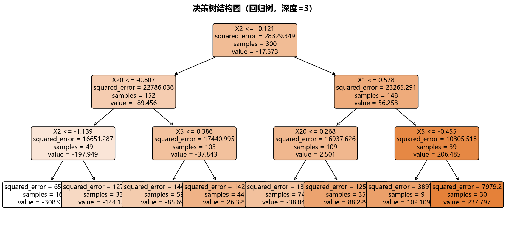
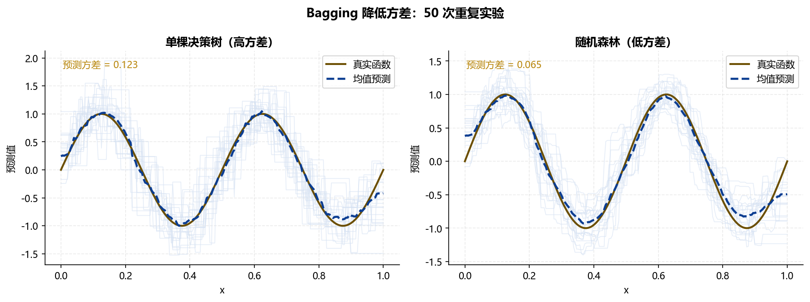
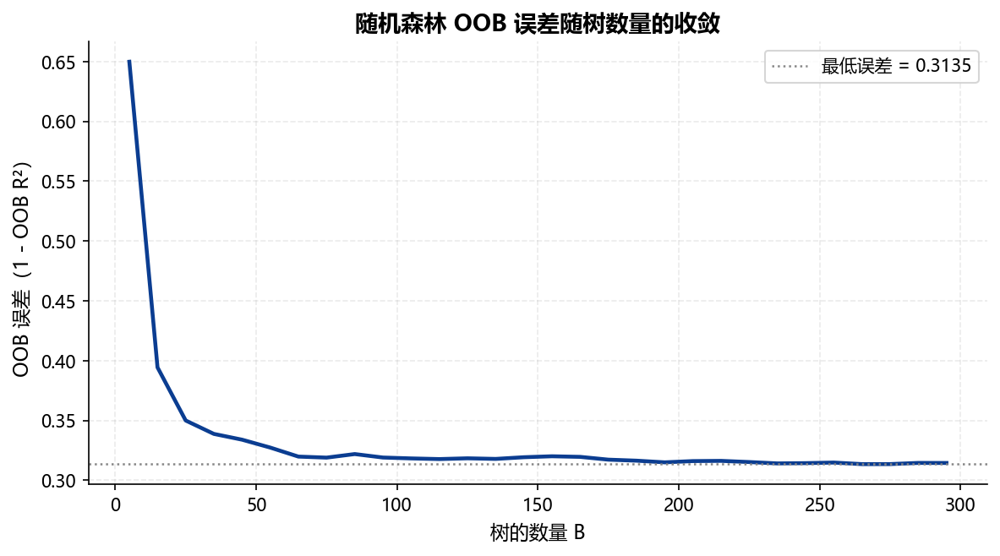
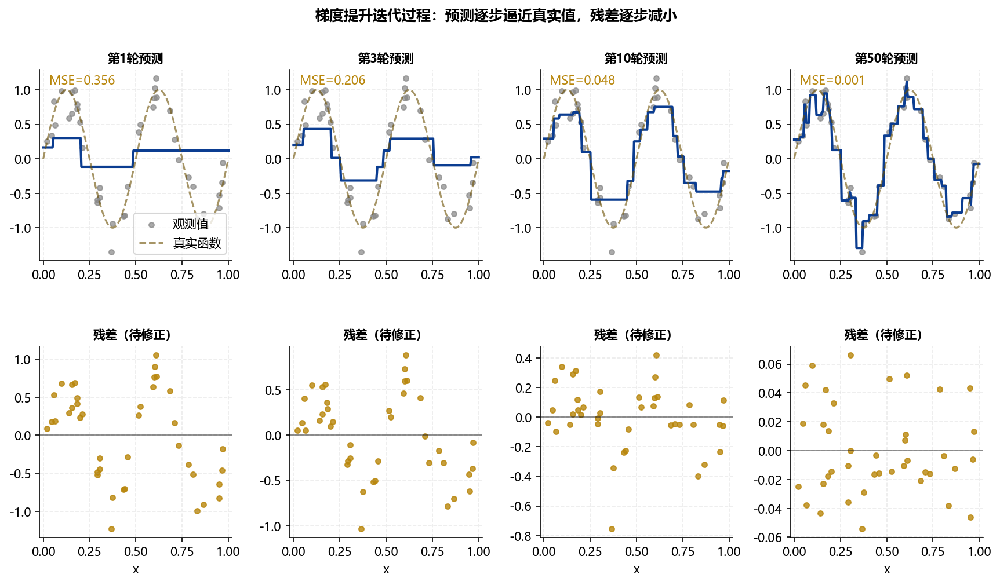
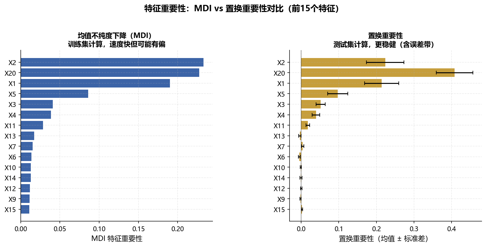
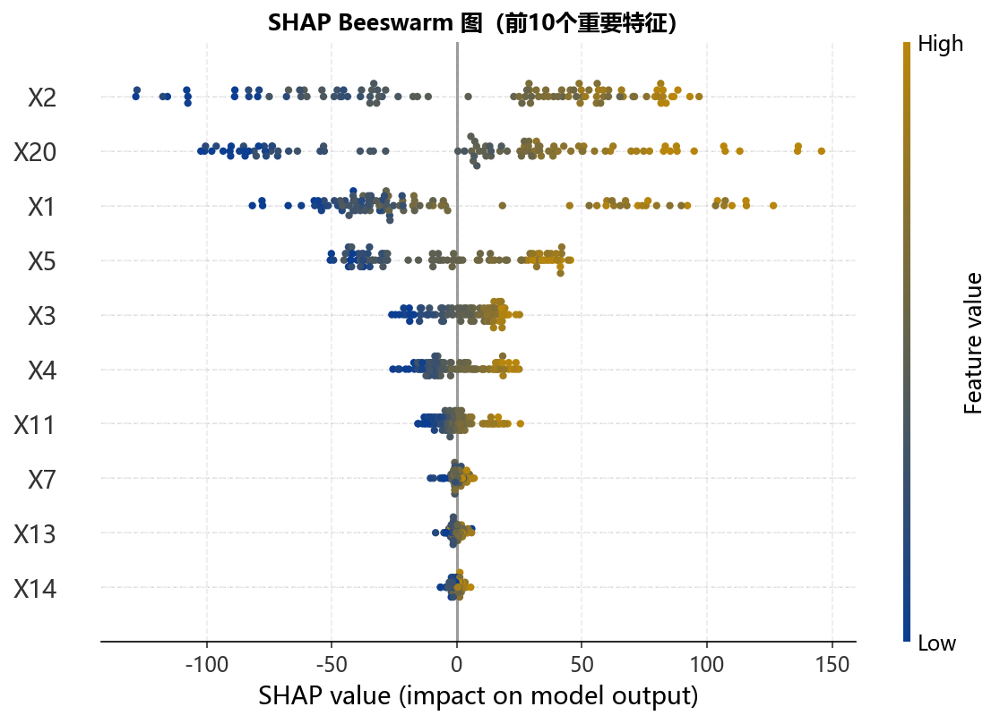
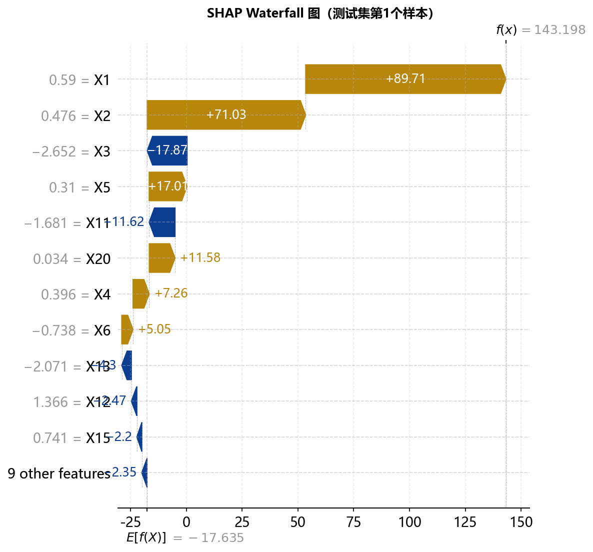
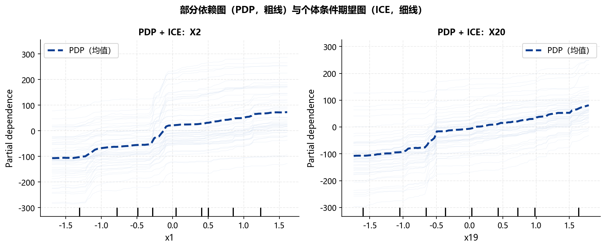

## 本章概览 {.unnumbered}

::: {.callout-note appearance="minimal"}
**学习目标**

完成本章学习后，你应该能够：

1.  解释决策树的递归二分原理，说明回归树（MSE）和分类树（基尼系数）的分裂准则
2.  描述 Bagging 和特征随机子集如何共同降低随机森林的方差，解释 OOB 误差的含义
3.  解释梯度提升的加法模型框架，说明 XGBoost 相对于标准梯度提升的两项关键改进
4.  在给定具体研究场景下，判断应选择线性模型（Lasso）还是树模型（RF/XGBoost）
5.  区分 MDI 特征重要性和置换重要性的计算原理，说明各自的偏差来源
6.  解释 SHAP 值的博弈论含义，读懂 beeswarm 图、waterfall 图和 PDP 图
7.  用 `sklearn` 和 `xgboost` 实现随机森林和 XGBoost，通过交叉验证调整超参数
8.  正确区分"特征重要性高"与"该特征对结果有因果影响"

**与其他章节的关系**

-   前置知识：Chapter A §A.4（偏差-方差权衡）、§A.5（正则化）、§A.7（交叉验证）、§A.8（评估指标）
-   与 Chapter B 的关系：本章与 Chapter B 相互独立，但案例复用了相同的数据框架以便方法对比
-   后续章节：Chapter F 的 DDML 中，随机森林可替换 Lasso 作为第一阶段估计方法（见 @sec-F-ddml）
-   参考手册：Python 实现见 `ml_ref_python.ipynb` 第 3 节
:::

------------------------------------------------------------------------

## 决策树 {#sec-C-tree}

### 递归二分的直觉

**决策树（Decision Tree）**是最直观的机器学习模型之一。它的逻辑与我们日常的"分类讨论"完全一致：给定一个样本，依次根据特征值做出一系列是/否判断，最终到达某个叶节点（Leaf Node），输出预测值。

用一个信用风险的例子来说明：要预测一位申请者是否会违约，决策树可能先问"年收入是否超过 50 万元？"——回答"是"的进入左子树，"否"的进入右子树；然后在左子树中再问"负债率是否超过 60%？"……如此递归，直到每个叶节点的样本足够纯净。

这个递归二分（Recursive Binary Splitting）的过程，数学上对应求解：

$$
\min_{j, t} \left[ \text{Loss}(\text{左子节点}) + \text{Loss}(\text{右子节点}) \right]
$$

即在所有特征 $j$ 和分裂点 $t$ 的组合中，找到使分裂后两个子节点总损失最小的那一个。

### 分裂准则 {#sec-C-split-criterion}

分裂准则因任务类型而异：

**回归树**：用节点内 MSE 衡量不纯度。节点 $\mathcal{R}$ 的损失为：

$$
\text{Loss}(\mathcal{R}) = \frac{1}{|\mathcal{R}|} \sum_{i \in \mathcal{R}} (y_i - \bar{y}_{\mathcal{R}})^2
$$

其中 $\bar{y}_{\mathcal{R}}$ 是节点内样本的均值。分裂后，左右子节点的加权 MSE 之和应小于分裂前的 MSE——差值越大，分裂带来的信息增益越高。

**分类树（基尼系数）**：节点 $\mathcal{R}$ 的基尼系数（Gini Impurity）为：

$$
\text{Gini}(\mathcal{R}) = \sum_{k=1}^{K} \hat{p}_k (1 - \hat{p}_k) = 1 - \sum_{k=1}^{K} \hat{p}_k^2
$$

其中 $\hat{p}_k$ 是节点中属于类别 $k$ 的样本比例，$K$ 是类别数。基尼系数越小，节点越纯净（所有样本属于同一类时，基尼系数为 0）。

**分类树（信息增益）**：用熵（Entropy）衡量不纯度：

$$
H(\mathcal{R}) = -\sum_{k=1}^{K} \hat{p}_k \log_2 \hat{p}_k
$$

分裂前后的熵之差称为信息增益（Information Gain）。`sklearn` 默认使用基尼系数，两者在实践中差异通常不大。

### 树的生长与剪枝 {#sec-C-pruning}

**树的生长**：从根节点开始，对每个节点递归地寻找最优分裂，直到满足停止条件：

-   节点内样本数少于 `min_samples_split`（默认 2）
-   树的深度达到 `max_depth`
-   分裂带来的不纯度下降小于阈值

若任由决策树生长至每个叶节点只有一个样本，训练误差为零，但这是典型的过拟合。

**代价复杂度剪枝（Cost-Complexity Pruning）**：对完全生长的树 $T$ 定义目标函数：

$$
R_\alpha(T) = R(T) + \alpha |T|
$$

其中 $R(T)$ 是训练误差，$|T|$ 是叶节点数，$\alpha \geq 0$ 是复杂度惩罚系数。随着 $\alpha$ 增大，越来越多的子树被剪去，树逐渐变简单。最优 $\alpha$ 通过交叉验证选择（`sklearn` 中用 `ccp_alpha` 参数控制）。

这与 Lasso 的惩罚框架完全一致：在拟合质量和模型复杂度之间找平衡点。

::: callout-note
## 决策树是理解集成方法的基础

决策树本身作为独立预测器有一个根本性缺陷：**方差极大**。稍微改变训练数据，树的结构可能发生剧烈变化。这是因为每次分裂都是贪心的局部最优，微小扰动可能导致完全不同的分裂顺序。

这个缺陷恰恰是随机森林和 XGBoost 的出发点——它们的核心贡献，正是针对决策树的高方差问题提出的两种截然不同的解决方案：**并行（Bagging）**和**串行（Boosting）**。
:::

{#fig-C-decision-tree width="90%"}

------------------------------------------------------------------------

## 随机森林 {#sec-C-rf}

### Bagging：并行降低方差

**Bagging**（Bootstrap Aggregating，Breiman, 1996）的思路极为简单：如果单棵树的方差高，那就训练很多棵树，然后取平均。关键在于，为了让各棵树之间相互独立（否则平均没有意义），每棵树都在不同的 **Bootstrap 样本**上训练——从 $n$ 个训练样本中有放回地抽取 $n$ 个，每次的样本都略有不同。

为什么平均能降低方差？设 $B$ 棵树的预测值 $\hat{f}_1, \ldots, \hat{f}_B$ 相互独立，每棵树的方差均为 $\sigma^2$，则均值的方差为 $\sigma^2/B$——随 $B$ 增大趋近于零。当然实际中各棵树不完全独立，但方差仍然显著降低。

**随机森林（Random Forest，Breiman, 2001）**在 Bagging 的基础上，增加了**特征随机子集**机制：每次分裂时，不是考虑所有 $p$ 个特征，而是随机选取 $m$ 个特征（回归通常取 $m = p/3$，分类通常取 $m = \sqrt{p}$）。

这个额外的随机化有什么用？它打破了各棵树之间的相关性。若不限制特征，所有树都倾向于在根节点选择同一个强特征，导致树之间高度相关，平均后方差降低有限。限制候选特征后，各棵树会有差异化的结构，平均效果更好。

@fig-C-bagging-variance 展示了单棵决策树和随机森林的预测波动对比——单树随训练数据的变化而剧烈波动，随机森林则稳定得多。

{#fig-C-bagging-variance width="90%"}

### Out-of-Bag 误差 {#sec-C-oob}

Bootstrap 抽样的一个附产品是**袋外样本（Out-of-Bag，OOB）**。每次 Bootstrap 抽取 $n$ 个样本时，约有 $1/e \approx 36.8\%$ 的原始样本未被抽到——这些样本对当前这棵树来说是"陌生的"，可以作为验证集使用。

对每个训练样本 $i$，只用那些没有用 $i$ 训练的树对 $i$ 做预测，将这些预测取平均，得到 OOB 预测 $\hat{y}_i^{\text{OOB}}$。所有样本的 OOB 预测误差均值即为 OOB 误差。

OOB 误差的重要性在于：它提供了**无需额外数据的泛化误差估计**，不需要单独保留验证集，也不需要运行耗时的 K 折 CV。@fig-C-rf-oob-error 显示 OOB 误差随树数量 $B$ 的收敛过程——$B$ 超过约 100 棵后，OOB 误差趋于稳定。

{#fig-C-rf-oob-error width="75%"}

### 关键超参数 {#sec-C-rf-params}

随机森林的主要超参数（`sklearn.RandomForestRegressor`）：

| 参数 | 含义 | 推荐范围 | 影响 |
|-----------------|-----------------|----------------------|-----------------|
| `n_estimators` | 树的数量 $B$ | 100–500 | 越多越稳定，但有计算成本上限 |
| `max_features` | 每次分裂候选特征数 $m$ | `'sqrt'`/`'log2'`/浮点 | 越小，树间相关性越低；太小则每棵树偏差大 |
| `max_depth` | 树的最大深度 | `None`（完全生长）或 5–20 | 限制深度可防止过拟合 |
| `min_samples_leaf` | 叶节点最少样本数 | 1–10 | 增大可平滑预测，减少噪声 |
| `oob_score` | 是否计算 OOB 误差 | `True` | 建议开启，免费的泛化误差估计 |

::: callout-tip
## 💬 提示词模板 #4：随机森林特征重要性

```         
背景：用随机森林预测连续目标变量，并分析特征重要性。

我的数据：
- X_train, y_train, X_test, y_test（已完成训练/测试分割）
- 特征名列表：feature_names（长度为 p）

请帮我：
1. 拟合 RandomForestRegressor
   （n_estimators=200, random_state=42, oob_score=True, n_jobs=-1）
2. 打印 OOB R²、测试集 MSE 和 R²
3. 计算并对比两种特征重要性：
   - MDI（基于 .feature_importances_ 属性）
   - 置换重要性（PermutationImportance，n_repeats=20）
4. 绘制前 15 个特征的双图对比条形图
   （左：MDI，右：置换重要性，含误差带）
5. 说明两种方法结果差异的原因
6. 所有代码用中文注释，random_state=42
```
:::

------------------------------------------------------------------------

## 梯度提升与 XGBoost {#sec-C-gbm}

### Boosting：串行修正偏差

与 Bagging 的"并行平均"不同，**Boosting** 采用**串行**策略：每棵新树专注于修正前面所有树的错误。直觉上，就像一个学生每次考试后，专门针对上次做错的题目加强练习。

**梯度提升（Gradient Boosting，Friedman, 2001）**将这一思想形式化为**加法模型（Additive Model）**：

$$
\hat{F}_M(\mathbf{x}) = \sum_{m=1}^{M} \eta \cdot h_m(\mathbf{x})
$$ {#eq-C-additive-model}

其中 $h_m$ 是第 $m$ 棵树，$\eta$ 是学习率（Learning Rate），控制每棵树的贡献大小。每棵新树 $h_m$ 拟合的不是原始目标 $y$，而是当前模型 $\hat{F}_{m-1}$ 的**负梯度**（Negative Gradient）——即损失函数对当前预测值的负梯度：

$$
r_i^{(m)} = -\frac{\partial L(y_i, \hat{F}_{m-1}(\mathbf{x}_i))}{\partial \hat{F}_{m-1}(\mathbf{x}_i)}
$$

当损失函数为 MSE 时，$r_i^{(m)} = y_i - \hat{F}_{m-1}(\mathbf{x}_i)$，即**残差**——所以早期的 Boosting 方法也叫残差提升。用更一般的负梯度替代残差，使梯度提升可以处理任意可微损失函数（包括分类、排序等），这是该框架的关键推广。

@fig-C-boosting-steps 展示了四步迭代的直觉：每步都在当前残差（预测偏差）最大的地方重点修正，使整体预测逐步逼近真实值。

{#fig-C-boosting-steps width="90%"}

### XGBoost 的关键改进 {#sec-C-xgboost}

**XGBoost**（eXtreme Gradient Boosting，Chen & Guestrin, 2016）在梯度提升框架上做了两项工程和理论层面的关键改进，使其成为近十年最主流的结构化数据竞赛和应用方法。

**改进一：正则化树结构**。标准梯度提升对树结构没有显式约束，XGBoost 在目标函数中直接加入对树复杂度的惩罚：

$$
\text{Obj} = \sum_{i=1}^{n} L(y_i, \hat{y}_i) + \sum_{m=1}^{M} \Omega(h_m)
$$

其中 $\Omega(h) = \gamma T + \frac{1}{2}\lambda \sum_{j=1}^{T} w_j^2$，$T$ 是叶节点数，$w_j$ 是叶节点的预测值。这与 Lasso/Ridge 的正则化思路完全一致——树越复杂（叶节点越多，预测值越极端），惩罚越重。

**改进二：近似分裂算法**。对大数据集，逐一检查所有分裂点的标准算法计算量极大。XGBoost 使用特征值的**分位数分桶（Quantile Sketch）**，只检查少数候选分裂点，大幅提速而不显著损失精度。此外还支持稀疏特征的高效处理（对缺失值自动学习最优方向）。

**主要超参数**（`xgboost.XGBRegressor`）：

| 参数               | 含义                     | 推荐搜索范围 |
|--------------------|--------------------------|--------------|
| `n_estimators`     | 树的数量                 | 100–1000     |
| `max_depth`        | 树的最大深度             | 3–8          |
| `learning_rate`    | 学习率 $\eta$            | 0.01–0.3     |
| `subsample`        | 每棵树用于训练的样本比例 | 0.6–1.0      |
| `colsample_bytree` | 每棵树的特征采样比例     | 0.6–1.0      |
| `reg_alpha`        | L1 正则化（类 Lasso）    | 0–1          |
| `reg_lambda`       | L2 正则化（类 Ridge）    | 0–10         |

::: callout-caution
## 📊 金融数据中 XGBoost 的过拟合风险

XGBoost 的表达能力极强，这在大样本数据集上是优势，在金融数据中却常常是隐患：

-   金融样本量通常有限（月度股票数据往往只有数百至数千行）
-   信噪比低（真实信号被大量噪声淹没）
-   特征与目标的关系微弱且不稳定

**实践建议**：金融数据中 XGBoost 必须配合严格的交叉验证调参，`max_depth` 通常不超过 4–5，`learning_rate` 宜小（0.01–0.05），并开启 Early Stopping（监控验证集误差提前停止）。与随机森林相比，XGBoost 对超参数更敏感，调参成本更高。
:::

**LightGBM** 是微软提出的另一个梯度提升框架，采用基于直方图的分裂算法和叶子优先（Leaf-wise）的生长策略，在大数据集上速度快于 XGBoost，精度相当，使用接口与 XGBoost 类似（`lightgbm.LGBMRegressor`）。

------------------------------------------------------------------------

## 树模型 vs 线性模型 {#sec-C-comparison}

### 各有优劣，场景决定选择

树模型和线性模型（Lasso/Ridge）服务于不同的数据结构和研究目标，@tbl-C-comparison 总结了主要对比维度：

| 维度 | 线性模型（Lasso/Ridge） | 树模型（RF/XGBoost） |
|----------------|------------------------------|--------------------------|
| **关系结构** | 假设线性，处理非线性需手动构造交叉项 | 自动捕获非线性关系和特征交互 |
| **高维稀疏** | 优势显著（Lasso 的稀疏解） | 在高维稀疏数据上通常不如 Lasso |
| **变量标准化** | **必须**标准化（惩罚项对量纲敏感） | **不需要**（树对单调变换不敏感） |
| **缺失值处理** | 需要预处理填补 | XGBoost 原生支持缺失值 |
| **计算成本** | 低（解析解或快速收敛） | 高（尤其是 XGBoost 调参） |
| **可解释性** | 系数有直接含义（线性效应） | 需借助 SHAP 等工具间接解释 |
| **因果推断** | 适合（Lasso 系数可与因果框架结合） | **不适合直接使用**（见下方 callout） |
| **样本量要求** | 较低（$n > p$ 即可） | 较高（小样本易过拟合，尤其 XGBoost） |

: 线性模型与树模型的主要对比 {#tbl-C-comparison}

**用树模型的典型场景**：目标是最大化样本外预测精度；数据中存在强非线性关系或特征交互；变量量纲差异大，标准化成本高；特征数量适中（数十到数百），样本量充足。

**用线性模型的典型场景**：目标包含因果推断；数据高维稀疏（$p$ 很大但真正有效的变量少）；需要直接解释每个变量的边际效应；样本量有限（Lasso 有理论保证，树模型过拟合风险大）。

::: callout-important
## ⚠️ 特征重要性 ≠ 因果效应

这是使用树模型时最常见的误读，必须牢记：

随机森林的 MDI 特征重要性或 XGBoost 的 Gain 特征重要性，衡量的是**该变量对提升预测精度的贡献**，而非该变量对结果的**因果效应**。

一个纯粹的代理变量（如企业所在的城市 GDP，它代理了企业规模）可能有很高的特征重要性，但对企业盈利能力没有任何因果作用。反过来，一个真正重要的因果变量，若与其他变量高度相关，其特征重要性可能被低估（因为其他变量分走了功劳）。

**规则**：若需做因果解读，必须使用 Chapter F 介绍的 DS-Lasso、DML 或因果森林等专门方法。
:::

------------------------------------------------------------------------

## 模型可解释性 {#sec-C-interpret}

随机森林和 XGBoost 是"黑箱"模型——预测精度高，但预测逻辑不像线性模型那样透明。本节介绍三类主流的可解释性工具。

### 特征重要性 {#sec-C-feature-importance}

#### 均值不纯度下降（MDI）

**MDI（Mean Decrease in Impurity）**是 `sklearn` 随机森林的默认特征重要性指标。对每棵树，计算每次以特征 $j$ 分裂时带来的不纯度下降量（加权），对所有树平均，得到特征 $j$ 的 MDI 重要性。

**MDI 的偏差**：当数据集中存在高基数类别特征（如城市名）或高度相关的特征时，MDI 会系统性地高估这些特征的重要性，即便它们的真实预测价值有限。这是 MDI 的已知局限（Strobl et al., 2007）。

#### 置换重要性（Permutation Importance）

**置换重要性（Permutation Importance）**的思路更直接：如果特征 $j$ 真的重要，把它的值随机打乱（破坏它与目标变量的关系），模型的预测误差应该显著增大。具体步骤：

1.  用训练好的模型在测试集上计算基准误差 $e_0$
2.  将特征 $j$ 的值随机排列（Permute），重新计算误差 $e_j$
3.  特征 $j$ 的置换重要性 = $e_j - e_0$

置换重要性在测试集上计算，因此直接反映泛化性能，不受训练过程偏差影响。缺点是计算较慢（每个特征需要重新推断一次），且对高度相关的特征可能低估重要性（打乱一个特征后，相关特征仍能提供类似信息）。

@fig-C-feature-importance 对比了两种方法的结果差异——它们有时会给出不同的排序，理解差异背后的原因比直接信任某一个更重要。

{#fig-C-feature-importance width="90%"}

### SHAP 值 {#sec-C-shap}

**SHAP（SHapley Additive exPlanations，Lundberg & Lee, 2017）**基于合作博弈论中的 **Shapley 值**，为每个样本的每个特征计算其对预测值的**边际贡献**。

**博弈论类比**：设想 $p$ 个特征是一个团队的 $p$ 名成员，他们合作完成了一项预测任务，得到的"奖励"是预测值。Shapley 值回答的问题是：**公平地说，每位成员应分得多少功劳？**

Shapley 值的定义涉及所有特征子集的边际贡献加权平均。对特征 $j$，其 Shapley 值为：

$$
\phi_j = \sum_{S \subseteq \mathcal{P} \setminus \{j\}} \frac{|S|!(p-|S|-1)!}{p!} \left[ f_{S \cup \{j\}}(\mathbf{x}) - f_S(\mathbf{x}) \right]
$$

其中 $S$ 是不包含特征 $j$ 的特征子集，$f_S$ 是仅使用子集 $S$ 中特征的模型预测。

SHAP 满足三个重要性质：

-   **局部准确性**：所有特征的 SHAP 值之和等于模型预测值与基准值（通常为训练集均值）之差
-   **缺失性**：对预测没有影响的特征，SHAP 值为零
-   **一致性**：若某特征在模型中的贡献增大，其 SHAP 值不减小

#### 三类 SHAP 图

**beeswarm 图（全局解释）**：将所有样本的 SHAP 值绘制在同一图上。每行代表一个特征，每个点代表一个样本，点的位置表示该样本该特征的 SHAP 值，颜色表示特征的原始值（红=高，蓝=低）。

@fig-C-shap-beeswarm 中的 beeswarm 图可以回答：哪些特征整体上对预测影响最大？特征值高/低时，对预测分别是正向还是负向影响？

{#fig-C-shap-beeswarm width="80%"}

**waterfall 图（局部解释）**：针对单个样本，展示各特征如何将预测值从基准值（$\mathbb{E}[f(X)]$）推向最终预测值。红色箭头表示正向贡献（推高预测值），蓝色表示负向贡献。

@fig-C-shap-waterfall 可以回答：对于这个具体的样本，预测结果为何如此？哪个特征贡献最大？

{#fig-C-shap-waterfall width="75%"}

::: callout-tip
## 💬 提示词模板 #4b：SHAP 可解释性分析

```         
背景：已训练好随机森林模型 rf_model，对其做 SHAP 可解释性分析。

我的数据：
- X_test：测试集特征矩阵（numpy array 或 DataFrame）
- feature_names：特征名称列表

请帮我：
1. 用 shap.TreeExplainer 计算 SHAP 值
   （explainer = shap.TreeExplainer(rf_model)）
2. 绘制 beeswarm 图（前 15 个特征，max_display=15）
3. 对测试集第 0 个样本绘制 waterfall 图
4. 绘制第 1 重要特征的 dependence plot（散点图，x轴为特征值，y轴为SHAP值）
5. 打印每个特征的平均 |SHAP| 值排名（前 10）
6. 所有图形的标题和轴标签用中文
7. 代码用中文注释
```
:::

### 部分依赖图（PDP）与个体条件期望图（ICE） {#sec-C-pdp}

**部分依赖图（Partial Dependence Plot，PDP）**展示单个特征（或两个特征的交互）对预测值的平均边际效应：

$$
\hat{f}_j(x_j) = \frac{1}{n}\sum_{i=1}^{n} \hat{f}(x_j, \mathbf{x}_{i,-j})
$$

将特征 $j$ 固定在一系列值 $x_j$ 上，对所有样本的其他特征求平均预测值，得到 $x_j$ 与预测值之间的平均关系曲线。这个曲线形状揭示了模型学到的"$x_j$ 如何影响 $y$"。

**个体条件期望图（Individual Conditional Expectation，ICE）**是 PDP 的"放大"版：不取平均，而是为每个样本单独绘制一条曲线。若不同样本的 ICE 曲线走势差异很大，说明存在特征交互效应——$x_j$ 对 $y$ 的影响因其他特征的不同而不同。

@fig-C-pdp 同时展示了 PDP（粗线）和 ICE（细线），粗线是细线的均值。

{#fig-C-pdp width="80%"}

------------------------------------------------------------------------

## Python 实操要点 {#sec-C-python}

### 核心包与工作流

``` python
# 随机森林
from sklearn.ensemble import RandomForestRegressor, RandomForestClassifier
from sklearn.inspection import PermutationImportance, partial_dependence

# XGBoost
import xgboost as xgb
from xgboost import XGBRegressor, XGBClassifier

# SHAP 可解释性
import shap

# 超参数搜索
from sklearn.model_selection import GridSearchCV, RandomizedSearchCV
```

### 随机森林完整流程

``` python
# 训练（关键：开启 oob_score 获得免费的泛化误差估计）
rf = RandomForestRegressor(
    n_estimators=200,
    max_features='sqrt',
    oob_score=True,
    random_state=42,
    n_jobs=-1          # 并行，用全部 CPU 核心
)
rf.fit(X_train, y_train)

# 评估
print(f"OOB R²  = {rf.oob_score_:.4f}")
print(f"Test R² = {rf.score(X_test, y_test):.4f}")

# SHAP 解释
explainer  = shap.TreeExplainer(rf)
shap_values = explainer.shap_values(X_test)
shap.summary_plot(shap_values, X_test, feature_names=feature_names)
```

### XGBoost 调参（含 Early Stopping）

``` python
# XGBoost 推荐配合 Early Stopping，防止过拟合
xgb_model = XGBRegressor(
    n_estimators=1000,       # 设大一点，由 early stopping 决定实际轮数
    max_depth=4,
    learning_rate=0.05,
    subsample=0.8,
    colsample_bytree=0.8,
    reg_lambda=1.0,
    random_state=42
)
xgb_model.fit(
    X_train, y_train,
    eval_set=[(X_test, y_test)],
    verbose=False            # 不打印每轮误差
)
print(f"Best iteration: {xgb_model.best_iteration}")
```

::: callout-tip
## 💬 提示词模板 #5：XGBoost 调参

```         
背景：对金融数据做 XGBoost 回归，需要通过交叉验证调整超参数。

我的数据：
- X_train, y_train（训练集，已完成时序分割）
- X_test, y_test（测试集）
- 样本量约 500，特征数约 30

请帮我：
1. 用 RandomizedSearchCV 调参（cv=5，n_iter=50，random_state=42）
   搜索空间：
   max_depth: [3, 4, 5]
   learning_rate: [0.01, 0.05, 0.1]
   n_estimators: [100, 200, 500]
   subsample: [0.6, 0.8, 1.0]
   colsample_bytree: [0.6, 0.8, 1.0]
2. 打印最优参数和对应的 CV 评分
3. 用最优参数重新拟合，计算测试集 MSE、R²
4. 绘制 XGBoost 内置特征重要性图（importance_type='gain'，前 15 个）
5. 与使用默认参数的 XGBoost 对比（说明调参的必要性）
6. 所有代码用中文注释
```
:::

------------------------------------------------------------------------

## 本章小结 {#sec-C-summary}

本章介绍了以决策树为基础、以集成方法为核心的树模型体系。

**核心结论一：集成的价值在于"化腐朽为神奇"**。单棵决策树方差极大，但通过两种截然不同的集成策略——Bagging（并行+平均，随机森林）和 Boosting（串行+修正，XGBoost）——可以将其转化为强大的预测器。两者都体现了偏差-方差权衡的不同侧重：Bagging 主攻方差，Boosting 同时降低偏差和方差。

**核心结论二：SHAP 是目前最理论完备的可解释性工具**。相比 MDI 特征重要性，SHAP 值满足公理化的公平分配性质，不受特征基数和相关性的影响，同时支持全局和局部两个层次的解释。在金融研究中，SHAP 可以回答"对于这笔具体的贷款，哪个因素导致了较高的违约预测"，而 MDI 只能回答整体上哪个特征更重要。

**核心结论三：树模型与线性模型互补而非替代**。树模型的优势在于非线性关系和特征交互的自动捕获，以及对变量标准化和缺失值的宽容性；线性模型的优势在于高维稀疏数据下的理论保证、参数的直接可解释性，以及与因果推断框架的天然结合。金融实证中，这两类方法通常作为彼此的对比基准，而非相互排斥。

**本章的方法边界**：树模型在横截面数据和面板数据上效果好；但对于需要捕捉长期时序依赖的问题（如序列预测），应考虑 LSTM 等时序模型。此外，本章所有方法均假设**条件外生性**——若存在不可观测的遗漏变量，树模型同样无法提供无偏的因果估计（见 Chapter F）。

## 参考文献 {.unnumbered}

::: {#refs}
:::