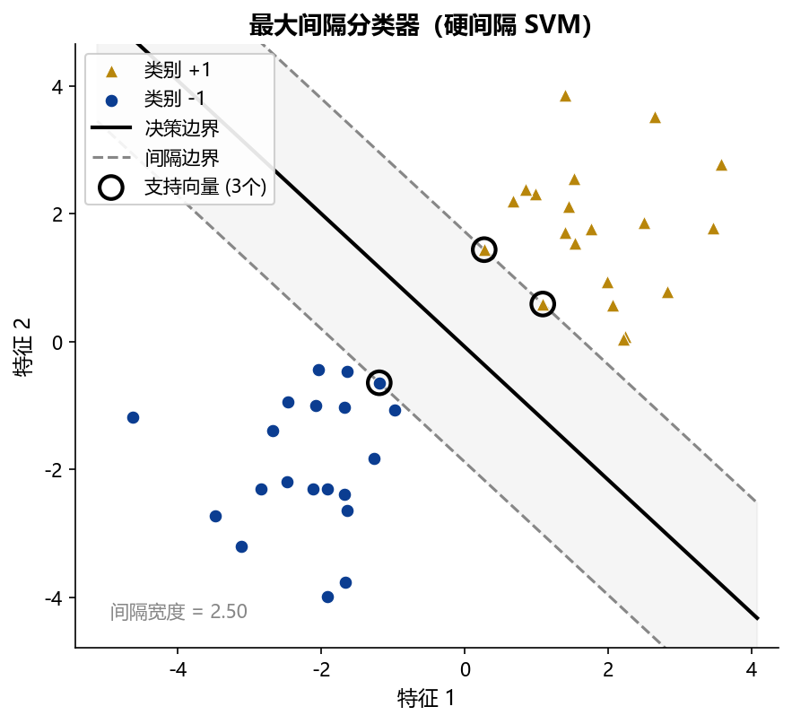
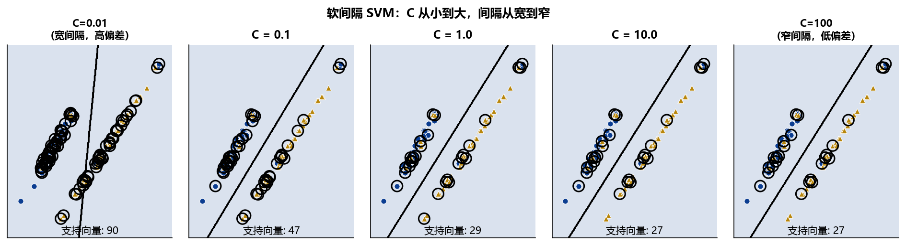
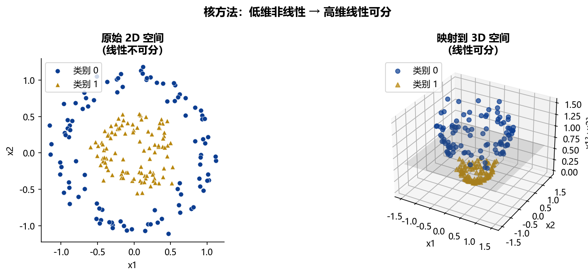
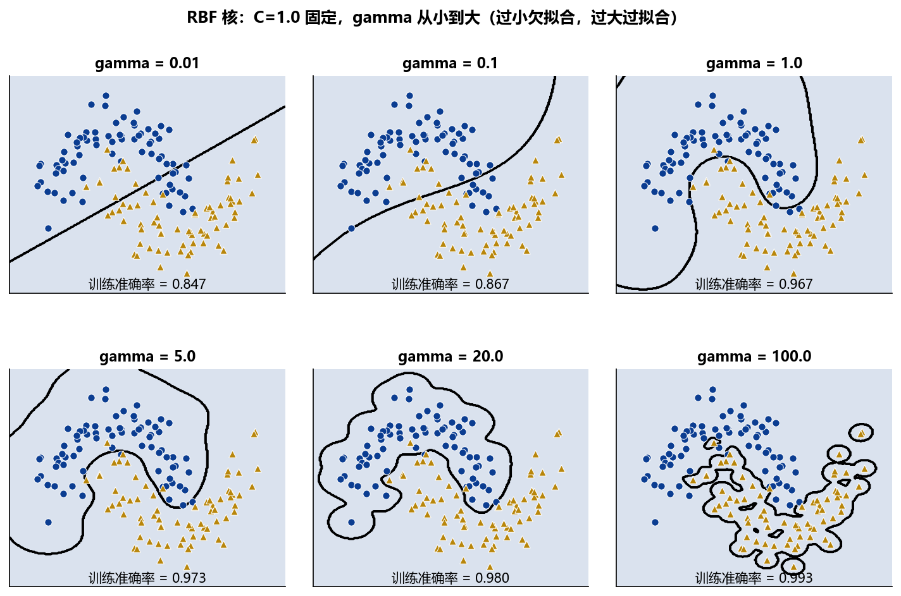

## 本章概览 {.unnumbered}

::: {.callout-note appearance="minimal"}
**学习目标**

完成本章学习后，你应该能够：

1.  用几何语言解释最大间隔分类器的目标，说明支持向量的定义
2.  解释软间隔 SVM 中惩罚参数 $C$ 的作用，将其与偏差-方差权衡联系起来
3.  描述核方法的基本思想——将低维非线性问题转化为高维线性问题——以及"核技巧"如何避免显式的高维变换
4.  说明 RBF 核中参数 $\gamma$ 的含义，解释 $\gamma$ 过大时为何导致过拟合
5.  写出 SVR（支持向量回归）的 $\varepsilon$-不敏感损失函数，将其与 Lasso/Ridge 的惩罚框架类比
6.  用网格搜索和交叉验证选择 SVM 的最优超参数 $C$ 和 $\gamma$
7.  判断 SVM 适用和不适用的金融场景

**与其他章节的关系**

-   前置知识：Chapter A §A.3（损失函数）、§A.4（偏差-方差权衡）、§A.7（交叉验证）
-   本章完全独立，不依赖 Chapter B 或 Chapter C 的内容，可在其他课程中单独使用
-   参考手册：Python 实现见 `ml_ref_python.ipynb` 第 4 节
:::

------------------------------------------------------------------------

## 最大间隔分类器 {#sec-D-hard-margin}

### 分类问题的几何直觉

考虑一个二分类问题：给定训练集 $\{(\mathbf{x}_i, y_i)\}_{i=1}^n$，其中 $y_i \in \{-1, +1\}$，目标是找到一个决策边界，将两类样本正确区分。

当数据线性可分时，分隔两类的超平面（Hyperplane）有无穷多个。哪一个最好？**支持向量机（Support Vector Machine，SVM）**的回答是：选择使两类样本**离决策边界最远**的那个——这就是**最大间隔（Maximum Margin）**的思想。

间隔越大，意味着决策边界离最近的样本越远，对噪声的容忍度越高，泛化能力越强。

### 支持向量与间隔

决策超平面可以写成 $\mathbf{w}'\mathbf{x} + b = 0$，其中 $\mathbf{w}$ 是法向量，$b$ 是偏置项。样本 $\mathbf{x}_i$ 到超平面的**有符号距离**为：

$$
d_i = \frac{y_i (\mathbf{w}'\mathbf{x}_i + b)}{\|\mathbf{w}\|_2}
$$

**间隔（Margin）**定义为所有样本到超平面距离的最小值：$\text{margin} = \min_i d_i$。

离超平面最近的那些样本点——即使间隔最小的点——称为**支持向量（Support Vectors）**。支持向量是唯一决定决策边界的样本；其余样本被移除不影响结果。这是 SVM 的一个重要特性：模型由少数关键样本决定，对"内部"样本不敏感。

@fig-D-svm-margin 展示了最大间隔分类器的几何结构：决策边界（实线）居中，两侧等距的虚线为间隔边界，落在虚线上的点即为支持向量。

{#fig-D-svm-margin width="70%"}

### 硬间隔 SVM 的优化问题

将最大化间隔写成正式的优化问题。通过对 $\mathbf{w}$ 的适当缩放，可以令支持向量满足 $y_i(\mathbf{w}'\mathbf{x}_i + b) = 1$，此时间隔为 $2/\|\mathbf{w}\|_2$。最大化间隔等价于最小化 $\|\mathbf{w}\|_2^2$：

$$
\min_{\mathbf{w}, b} \quad \frac{1}{2}\|\mathbf{w}\|_2^2
\quad \text{subject to} \quad y_i(\mathbf{w}'\mathbf{x}_i + b) \geq 1, \quad i = 1, \ldots, n
$$ {#eq-D-hard-svm}

这是一个**凸二次规划（Convex Quadratic Programming）**问题，有唯一全局最优解，可以用标准优化方法求解。

::: callout-note
## 对偶问题的直觉

@eq-D-hard-svm 的拉格朗日对偶形式中，决策函数只依赖于样本之间的**内积** $\mathbf{x}_i'\mathbf{x}_j$，而非样本本身。这个性质是核方法（@sec-D-kernel）的关键：只要能计算内积，就能在不显式构造高维特征的情况下，在高维空间中进行分类。此处不推导对偶问题，感兴趣的读者可参见 Hastie et al.（2009）第 12 章。
:::

------------------------------------------------------------------------

## 软间隔 SVM {#sec-D-soft-margin}

### 线性不可分的现实

硬间隔 SVM 要求训练数据完全线性可分——两类样本之间有一条直线（或超平面）能完美分开。这在实际金融数据中几乎从不成立：噪声、离群点和类别重叠是常态。

**软间隔 SVM**（Cortes & Vapnik, 1995）通过引入**松弛变量（Slack Variables）** $\xi_i \geq 0$ 允许部分样本"越过"间隔边界，甚至被错误分类，代价是付出相应的惩罚：

$$
\min_{\mathbf{w}, b, \mathbf{\xi}} \quad \frac{1}{2}\|\mathbf{w}\|_2^2 + C\sum_{i=1}^{n} \xi_i
\quad \text{subject to} \quad y_i(\mathbf{w}'\mathbf{x}_i + b) \geq 1 - \xi_i, \quad \xi_i \geq 0
$$ {#eq-D-soft-svm}

-   $\xi_i = 0$：样本 $i$ 在间隔边界之外或正好在边界上，分类正确
-   $0 < \xi_i \leq 1$：样本在间隔内，但分类正确
-   $\xi_i > 1$：样本被错误分类

### 惩罚参数 $C$ 的作用

$C > 0$ 是**软间隔 SVM 最重要的超参数**，控制"允许多少违规"：

-   $C$ 很大：对违规的惩罚极重，模型几乎不允许任何错误，间隔变窄——这是**低偏差、高方差**的情形，类似于复杂模型，在训练集上表现好但易过拟合
-   $C$ 很小：允许较多违规，间隔变宽，决策边界更平滑——这是**高偏差、低方差**的情形，类似于简单模型，更具泛化能力

这与 Chapter A 中介绍的偏差-方差权衡完全对应：$C$ 扮演的角色与 Lasso 中的 $1/\lambda$ 类似——$C$ 越大，正则化越弱；$C$ 越小，正则化越强。

::: callout-important
## ⚠️ $C$ 是 SVM 最关键的超参数

$C$ 对 SVM 性能的影响远大于其他超参数。在调参时，$C$ 的搜索范围应覆盖至少 4–6 个数量级（如 $10^{-3}$ 到 $10^3$），通常在对数刻度上做网格搜索。

初学者最常见的错误是只在较小范围内搜索 $C$，导致模型始终处于过拟合或欠拟合状态而浑然不知。
:::

@fig-D-soft-margin 展示了不同 $C$ 值下的决策边界变化：$C$ 越大，间隔越窄，边界越贴近训练数据（可能过拟合）；$C$ 越小，间隔越宽，边界越平滑（可能欠拟合）。

{#fig-D-soft_margin width="95%"}

------------------------------------------------------------------------

## 核方法 {#sec-D-kernel}

### 特征空间变换的思想

软间隔 SVM 在原始特征空间中寻找线性决策边界。但许多实际问题中，数据在原始空间不是线性可分的——例如，两类样本在二维平面上呈同心圆分布，任何直线都无法将其分开。

解决方案是**特征空间变换**：将原始特征 $\mathbf{x} \in \mathbb{R}^p$ 通过映射 $\phi: \mathbb{R}^p \to \mathbb{R}^d$（$d \gg p$）变换到一个更高维的特征空间，在高维空间中用线性 SVM 分类。

@fig-D-kernel-trick 直观展示了这一思想：二维平面上的非线性可分数据，经过特征变换映射到三维空间后，可以用一个线性超平面分开。

{#fig-D-kernel-trick width="85%"}

### 核函数：计算技巧

显式地构造高维特征映射然后计算内积，当 $d$ 很大时计算代价极高。**核技巧（Kernel Trick）**的关键洞察是：SVM 的对偶问题只需要高维空间中的**内积** $\phi(\mathbf{x}_i)'\phi(\mathbf{x}_j)$，而不需要 $\phi(\mathbf{x}_i)$ 本身。

**核函数（Kernel Function）** $K(\mathbf{x}_i, \mathbf{x}_j)$ 直接计算高维内积的结果，而无需显式构造 $\phi$：

$$
K(\mathbf{x}_i, \mathbf{x}_j) = \phi(\mathbf{x}_i)'\phi(\mathbf{x}_j)
$$

只要 $K$ 满足 Mercer 条件（半正定性），就存在对应的特征映射 $\phi$，且可以直接用 $K$ 替换原始内积运行 SVM——计算量仅取决于原始维度 $p$，而非高维 $d$。

::: callout-note
## Mercer 定理（一句话）

满足 Mercer 条件的对称正半定函数 $K(\mathbf{x}_i, \mathbf{x}_j)$ 都可以作为合法的核函数，对应某个（可能是无穷维的）特征空间中的内积。实践中不需要验证 Mercer 条件，直接使用下方列出的标准核函数即可。
:::

### 常用核函数

| 核函数 | 表达式 | 参数 | 适用场景 |
|------------------|------------------|------------------|-------------------|
| **线性核** | $K(\mathbf{x}_i, \mathbf{x}_j) = \mathbf{x}_i'\mathbf{x}_j$ | 无 | 线性可分，高维稀疏数据 |
| **多项式核** | $K(\mathbf{x}_i, \mathbf{x}_j) = (\gamma\mathbf{x}_i'\mathbf{x}_j + r)^d$ | $\gamma, r, d$ | 有明确的多项式交互关系 |
| **RBF 核（高斯核）** | $K(\mathbf{x}_i, \mathbf{x}_j) = \exp(-\gamma\|\mathbf{x}_i - \mathbf{x}_j\|_2^2)$ | $\gamma > 0$ | **最常用**，适合大多数非线性问题 |
| **Sigmoid 核** | $K(\mathbf{x}_i, \mathbf{x}_j) = \tanh(\gamma\mathbf{x}_i'\mathbf{x}_j + r)$ | $\gamma, r$ | 类似神经网络，不常用 |

**RBF 核的参数** $\gamma$：$\gamma$ 控制每个样本的"影响范围"。

-   $\gamma$ 很大：每个样本只影响其极近邻，决策边界高度弯曲，能完美拟合训练数据但严重过拟合
-   $\gamma$ 很小：每个样本影响范围广，决策边界平滑，趋近于线性

@fig-D-rbf-gamma 展示了 $\gamma$ 从小到大时决策边界的变化——$\gamma$ 过小欠拟合，过大过拟合，中间某个值最优。

{#fig-D-rbf-gamma width="90%"}

------------------------------------------------------------------------

## 回归 SVM（SVR） {#sec-D-svr}

### $\varepsilon$-不敏感损失函数

SVM 的思想可以推广到回归问题，得到**支持向量回归（Support Vector Regression，SVR）**。SVR 使用 $\varepsilon$-不敏感损失函数（$\varepsilon$-Insensitive Loss）：

$$
L_\varepsilon(y, \hat{y}) = \max(0, |y - \hat{y}| - \varepsilon)
$$

这个损失函数有一条"不灵敏带"：预测误差在 $[-\varepsilon, +\varepsilon]$ 范围内时，损失为零；超出这个范围才产生线性惩罚。直觉上，SVR 只关心超出 $\varepsilon$ 的误差，对小误差完全不在意。

SVR 的优化问题为：

$$
\min_{\mathbf{w}, b, \mathbf{\xi}, \mathbf{\xi}^*} \quad \frac{1}{2}\|\mathbf{w}\|_2^2 + C\sum_{i=1}^{n}(\xi_i + \xi_i^*)
$$ {#eq-D-svr}

$$
\text{subject to} \quad y_i - \mathbf{w}'\mathbf{x}_i - b \leq \varepsilon + \xi_i, \quad
\mathbf{w}'\mathbf{x}_i + b - y_i \leq \varepsilon + \xi_i^*, \quad \xi_i, \xi_i^* \geq 0
$$

其中 $\xi_i, \xi_i^*$ 分别是上下方向的松弛变量，$\varepsilon$ 控制不灵敏带的宽度，$C$ 与分类 SVM 中的含义相同。

### 与线性模型的类比

SVR 与 Lasso/Ridge 有内在联系：

-   $C \to \infty$（无惩罚）：退化为 $\varepsilon$-不灵敏损失的无约束回归，类似于 OLS 但用了不同的损失函数
-   $\varepsilon = 0$：不灵敏带消失，$C$ 的作用与 Ridge 的正则化参数类比，提供 ℓ₂ 正则化
-   **稀疏性**：$\varepsilon > 0$ 时，落在不灵敏带内的样本对模型没有影响（对应零拉格朗日乘子），**只有带外的样本才是"支持向量"**，模型由少数样本决定——这与 Lasso 的稀疏特性类似

**SVR 的主要超参数**：$C$（容忍带外误差的惩罚）、$\varepsilon$（不灵敏带宽度）、kernel 和 $\gamma$（与分类 SVM 相同）。

------------------------------------------------------------------------

## 超参数调优 {#sec-D-tuning}

### 网格搜索：$C \times \gamma$ 二维搜索

RBF 核 SVM 有两个关键超参数：$C$ 和 $\gamma$。实践中通常做**二维网格搜索（Grid Search）**，在 $C$ 和 $\gamma$ 的候选值组合上跑 K 折 CV，选择验证集误差最小的组合。

推荐的搜索范围（对数均匀分布）：

``` python
C_range     = [0.001, 0.01, 0.1, 1, 10, 100, 1000]
gamma_range = [0.0001, 0.001, 0.01, 0.1, 1, 10]
```

::: callout-warning
## 🚫 常见错误：忘记标准化

SVM（包括 SVR）对**特征尺度极度敏感**——这是 SVM 与树模型的重要区别。

原因：核函数（尤其是 RBF 核）计算的是样本之间的欧氏距离 $\|\mathbf{x}_i - \mathbf{x}_j\|_2^2$。若特征尺度差异悬殊（如一个以"元"为单位，另一个以"亿元"为单位），距离度量会被大尺度特征主导，小尺度特征几乎不起作用。

**规则**：使用 SVM 之前，**必须**用 `StandardScaler` 对所有特征进行标准化（均值为 0，标准差为 1）。与 Lasso 一样，标准化只能在训练集上 `fit`，测试集用训练集的参数 `transform`。
:::

------------------------------------------------------------------------

## SVM 在金融中的应用场景 {#sec-D-finance}

### 适用场景

SVM 在以下金融场景中有比较优势：

**高维小样本**：当特征维度 $p$ 接近或超过样本量 $n$ 时（如基因金融、高频特征工程），SVM 的正则化框架（通过 $C$ 控制）仍然有效，而树模型容易过拟合。

**非线性决策边界清晰的分类**：信用评级、违约预测中，当两类样本存在明确但非线性的分隔时，RBF 核 SVM 往往优于线性模型。

**核函数的灵活性**：若研究者对数据结构有先验知识（如金融时间序列的相似性可以用特定核函数度量），可以设计自定义核函数。

### 不适用场景

**大样本（**$n > 50{,}000$）：SVM 的训练复杂度约为 $O(n^2)$ 到 $O(n^3)$，样本量大时计算代价极高。此时应优先考虑 XGBoost 或随机森林。

**需要概率输出**：`sklearn` 的 `SVC` 默认输出的是类别标签，不是概率。若需要违约概率（而非仅二元分类），可以通过 `probability=True` 启用 Platt Scaling，但会显著增加训练时间，且校准效果不如 Logit 模型稳定。

**需要可解释性**：SVM 的决策函数由支持向量的内积决定，没有直接可解释的系数（线性核除外）。在监管要求必须解释模型决策的场景（如信贷审批），SVM 不如 Logit 或树模型+SHAP 更合适。

### 与其他方法的选择建议

| 场景                 | 推荐方法        | 原因                  |
|----------------------|-----------------|-----------------------|
| 高维稀疏，需变量筛选 | Lasso           | 稀疏解 + 因果推断兼容 |
| 非线性，样本充足     | XGBoost / RF    | 性能强，调参相对简单  |
| 高维小样本，非线性   | SVM（RBF 核）   | 正则化强，核方法优势  |
| 需要概率输出         | Logit / RF      | 原生概率估计          |
| 需要解释每个特征     | Logit / RF+SHAP | 系数或 SHAP 值        |

------------------------------------------------------------------------

## Python 实操要点 {#sec-D-python}

### 核心类

``` python
from sklearn.svm import SVC, SVR
from sklearn.preprocessing import StandardScaler
from sklearn.model_selection import GridSearchCV, train_test_split
from sklearn.pipeline import Pipeline
from sklearn.metrics import classification_report, roc_auc_score
```

### SVC 标准工作流

``` python
# 推荐用 Pipeline 把标准化和 SVM 打包，防止数据泄露
pipe = Pipeline([
    ('scaler', StandardScaler()),
    ('svm',    SVC(kernel='rbf', probability=True, random_state=42))
])

# 网格搜索（C × gamma，对数均匀分布）
param_grid = {
    'svm__C'    : [0.01, 0.1, 1, 10, 100],
    'svm__gamma': [0.001, 0.01, 0.1, 1, 'scale']
}
grid = GridSearchCV(pipe, param_grid, cv=5, scoring='roc_auc',
                    n_jobs=-1, verbose=0)
grid.fit(X_train, y_train)

print(f"最优参数：{grid.best_params_}")
print(f"CV AUC = {grid.best_score_:.4f}")
print(f"测试集 AUC = {roc_auc_score(y_test, grid.predict_proba(X_test)[:,1]):.4f}")
```

### SVR 标准工作流

``` python
pipe_svr = Pipeline([
    ('scaler', StandardScaler()),
    ('svr',    SVR(kernel='rbf'))
])

param_grid_svr = {
    'svr__C'      : [0.1, 1, 10, 100],
    'svr__gamma'  : [0.001, 0.01, 0.1, 1],
    'svr__epsilon': [0.01, 0.1, 0.5]
}
grid_svr = GridSearchCV(pipe_svr, param_grid_svr, cv=5,
                        scoring='neg_mean_squared_error', n_jobs=-1)
grid_svr.fit(X_train, y_train)
```

::: callout-tip
## 💬 提示词模板 #6：SVM 分类

```         
背景：用 SVM 做二分类（如信用违约预测），需要调参并评估。

我的数据：
- X_train, y_train（训练集，y 为 0/1 二元标签）
- X_test, y_test（测试集）
- 特征数约 20，样本量约 500

请帮我：
1. 用 Pipeline 打包 StandardScaler + SVC（kernel='rbf', probability=True）
2. 用 GridSearchCV（cv=5，scoring='roc_auc'）搜索：
   C: [0.01, 0.1, 1, 10, 100, 1000]
   gamma: [0.001, 0.01, 0.1, 1, 'scale']
3. 打印最优参数和 CV AUC
4. 计算测试集的 AUC-ROC、精确率、召回率、F1
5. 绘制 ROC 曲线（与 Logit 基准对比）
6. 绘制 C × gamma 的热力图（颜色为 CV AUC，帮助理解调参面）
7. 所有代码用中文注释，random_state=42
```
:::

::: callout-tip
## 💬 提示词模板 #7：SVR 回归

```         
背景：用 SVR 做回归预测（如股票收益率预测），需要与 Lasso 对比。

我的数据：
- X_train, y_train, X_test, y_test（连续目标变量）
- 特征已完成时序分割，未标准化

请帮我：
1. 用 Pipeline 打包 StandardScaler + SVR（kernel='rbf'）
2. 用 GridSearchCV（cv=5，scoring='neg_mse'）搜索：
   C: [0.1, 1, 10, 100]
   gamma: [0.001, 0.01, 0.1, 'scale']
   epsilon: [0.01, 0.1, 0.5]
3. 打印最优参数和测试集 MSE、样本外 R²
4. 与 LassoCV 的结果并排比较（同一测试集）
5. 打印 SVR 支持向量数量及占训练集的比例
6. 所有代码用中文注释，random_state=42
```
:::

------------------------------------------------------------------------

## 本章小结 {#sec-D-summary}

本章介绍了支持向量机的完整方法体系，从硬间隔分类器出发，逐步推广到软间隔、核方法和回归问题。

**核心结论一：最大间隔是 SVM 的设计原则**。通过最大化决策边界与最近样本（支持向量）之间的距离，SVM 天然具有较强的泛化能力。支持向量是决定模型的唯一样本，其余样本被移除不影响结果——这使 SVM 对"内部"样本的噪声不敏感。

**核心结论二：**$C$ 控制偏差-方差权衡，是最关键的超参数。$C$ 越大，间隔越窄，模型越复杂（低偏差高方差）；$C$ 越小，间隔越宽，模型越简单（高偏差低方差）。在 $C$ 的搜索范围上不能吝啬，至少覆盖 4 个数量级的对数空间。

**核心结论三：核技巧使 SVM 能处理非线性问题而无需显式高维变换**。RBF 核是最通用的选择，其参数 $\gamma$ 控制每个样本的影响范围——$\gamma$ 过大导致过拟合，过小导致欠拟合。$C$ 和 $\gamma$ 需要联合调整。

**本章的方法边界**：SVM 不适合大样本（计算瓶颈）、不适合需要概率输出的场景（需要 Platt Scaling，稳定性较差）、不适合需要直接可解释系数的场景。在金融实践中，SVM 最有价值的场景是**高维小样本的非线性分类**，这时它的正则化框架比树模型更稳定。

## 参考文献 {.unnumbered}

::: {#refs}
:::