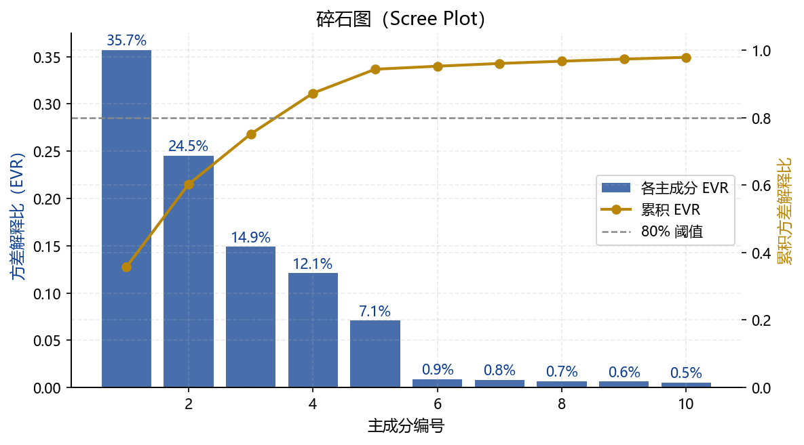
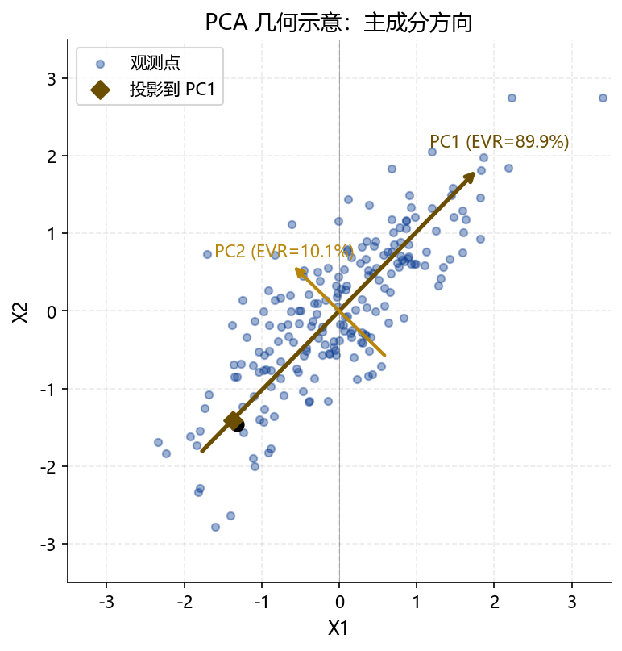
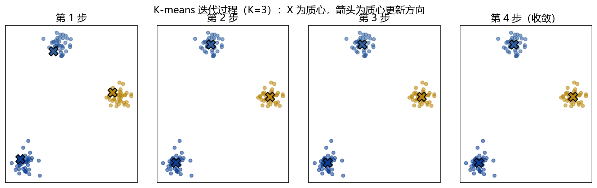
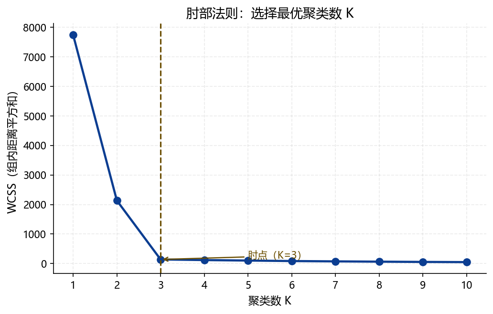
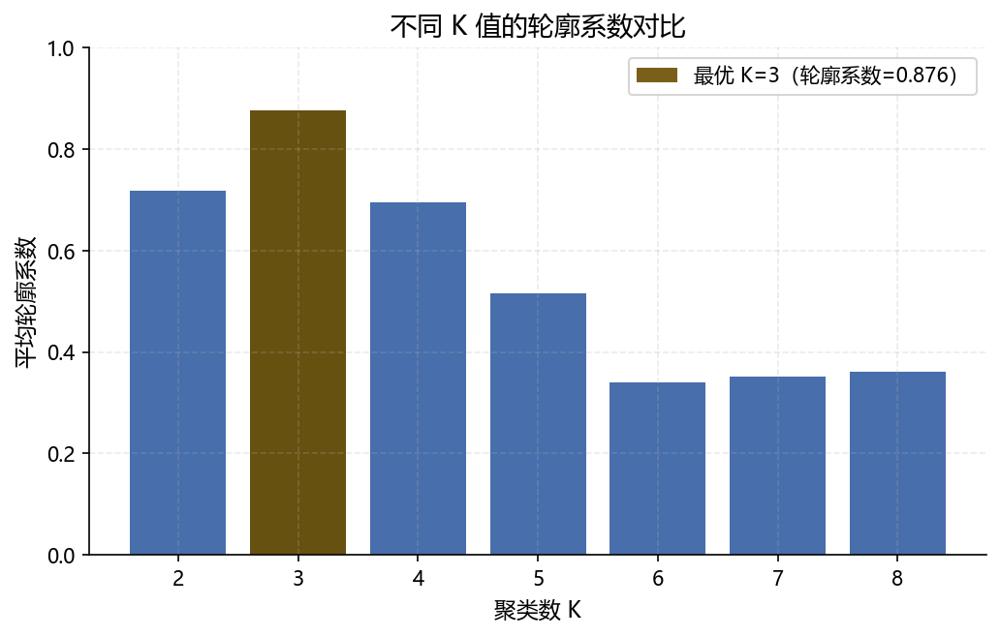
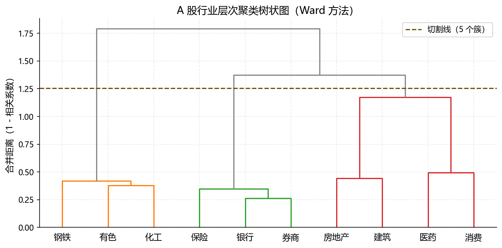
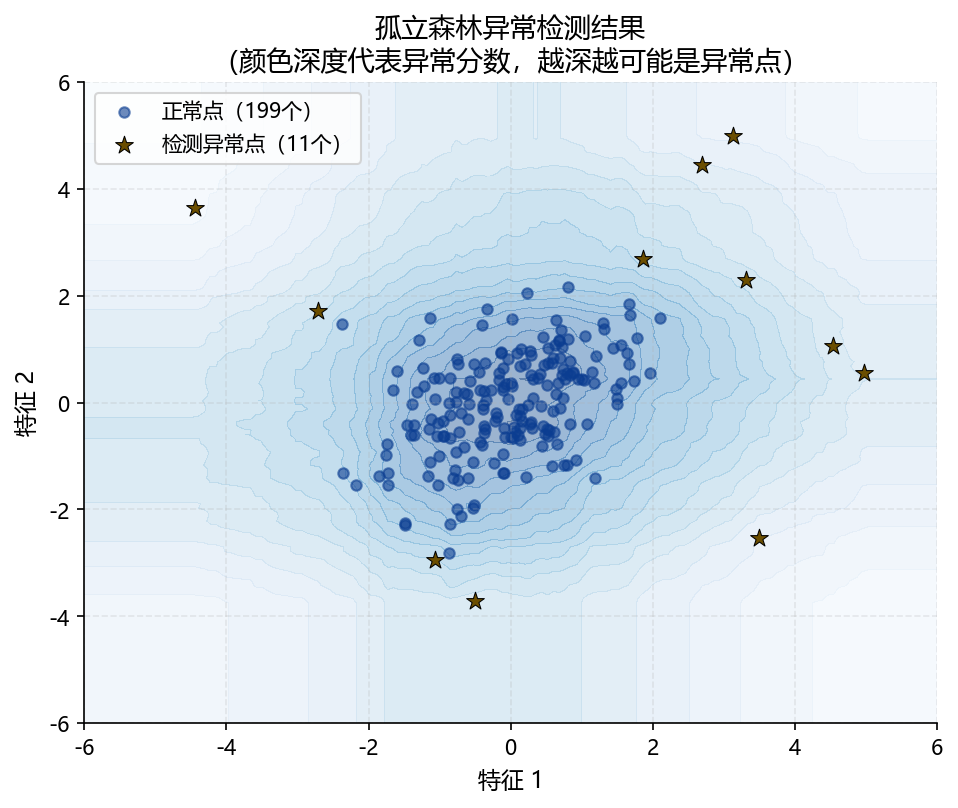

## 本章概览 {.unnumbered}

::: {.callout-note appearance="minimal"}
**学习目标**

完成本章学习后，你应该能够：

1.  说明无监督学习与监督学习的本质区别，解释为什么无监督学习结果难以客观评价
2.  解释维数灾难的含义，说明 PCA 如何通过保留最大方差方向实现降维
3.  推导 PCA 的协方差矩阵特征分解，解释方差解释比（EVR）和累积方差解释比（CEVR）的含义
4.  读懂碎石图，并用"肘点"或"累积方差达到阈值"两种方法选择主成分数量
5.  描述 K-means 算法的完整迭代步骤，说明肘部法则和轮廓系数如何帮助确定最优 K
6.  区分层次聚类的三种连接准则（单连接、完全连接、Ward），说明各自的适用场景
7.  读懂树状图（Dendrogram），从中确定合理的聚类数量
8.  解释孤立森林的随机分割原理，说明为什么异常点的平均路径长度更短
9.  用 `sklearn` 实现 PCA、K-means、层次聚类和孤立森林，正确解读各方法的输出

**与其他章节的关系**

-   前置知识：Chapter A §A.2（预测与因果）、§A.8（评估指标），以及基础线性代数（特征值、特征向量）
-   本章与 Chapter B–D 相互独立，可单独使用
-   后续章节：PCA 的因子提取思路与 Chapter F 中的高维控制变量处理有间接联系
-   参考手册：Python 实现见 `ml_ref_python.ipynb` 第 5 节
:::

------------------------------------------------------------------------

## 无监督学习的目标与挑战 {#sec-E-intro}

### 没有标签意味着什么

监督学习有明确的优化目标：最小化预测误差。无监督学习则不同——数据集 $\{\mathbf{x}_i\}_{i=1}^n$ 中没有标签 $y_i$，算法要自己发现数据的内在结构。

这带来了一个根本性的困难：**没有"正确答案"可以对照**。把 500 只股票分成 5 个行业簇，还是 8 个？第一主成分代表"市场因子"还是"规模因子"？这些问题没有客观的评分标准，结果的好坏高度依赖研究者的领域知识和问题背景。

### 金融中的典型无监督任务

无监督学习在金融领域有三类主要应用：

**降维（Dimensionality Reduction）**：将高维特征压缩为少数几个综合指标，同时保留尽可能多的信息。典型场景包括：从数十个宏观经济指标中提取少数几个主成分因子；估计资产收益率的协方差矩阵（直接估计会因维度过高而不稳定，PCA 提供了有效的低秩近似）。

**聚类（Clustering）**：发现数据中自然存在的分组结构。典型场景包括：将股票按收益率协动性分组（不依赖预定义行业标准）；识别具有相似行为模式的客户群体（用于精准营销或差异化风险定价）。

**异常检测（Anomaly Detection）**：识别与正常模式显著不同的观测。典型场景包括：信用卡欺诈识别；上市公司财务造假信号检测；市场异常波动的实时监控。

### 评估的困难

无监督学习结果的评估比监督学习困难得多：

-   聚类没有"正确标签"，轮廓系数等数学指标只能衡量簇内紧密程度，无法判断聚类结果是否有经济意义
-   PCA 能告诉你"第一主成分解释了 35% 的方差"，但不能自动告诉你这个主成分代表什么经济变量
-   异常检测的精度取决于"正常"的定义，而在金融数据中这个定义本身就是有争议的

这意味着无监督学习的结果**必须结合领域知识来解读**——数学工具提供的是候选答案，最终判断需要研究者的经济直觉。

------------------------------------------------------------------------

## 主成分分析（PCA） {#sec-E-pca}

### 降维的必要性 {#sec-E-pca-motivation}

**维数灾难（Curse of Dimensionality）**是高维数据分析的核心挑战。随着特征维度 $p$ 增加，数据点在特征空间中变得越来越"稀疏"——即便样本量 $n$ 很大，高维空间也几乎是空的。距离度量失效（高维空间中所有点到随机点的距离趋于相同），协方差矩阵估计变得不稳定（当 $p > n$ 时甚至不可逆）。

降维的目标是在损失尽可能少信息的前提下，将 $p$ 维数据压缩到 $q \ll p$ 维，消除特征之间的冗余信息（高维数据中特征往往高度相关，真正独立的"信息维度"远小于 $p$）。

**金融视角**：Fama-French 因子模型的成功背后有一个重要假设——驱动资产收益率的独立因子数量很少（3个、5个或若干个），而非与资产数量同阶。PCA 正是从数据出发自动发现这些潜在因子的工具。

### 模型设定 {#sec-E-pca-model}

给定 $n$ 个观测的 $p$ 维数据矩阵 $\mathbf{X}$（已去均值，每列均值为零），PCA 寻找一组**正交方向** $\mathbf{v}_1, \mathbf{v}_2, \ldots, \mathbf{v}_q$（单位向量，互相垂直），使得数据在这些方向上的投影方差依次最大化。

**第一主成分**：$\mathbf{v}_1 = \arg\max_{\|\mathbf{v}\|=1} \text{Var}(\mathbf{X}\mathbf{v}) = \arg\max_{\|\mathbf{v}\|=1} \mathbf{v}'\mathbf{S}\mathbf{v}$，其中 $\mathbf{S} = \frac{1}{n-1}\mathbf{X}'\mathbf{X}$ 是样本协方差矩阵。

可以证明，$\mathbf{v}_1$ 是 $\mathbf{S}$ 最大特征值 $\lambda_1$ 对应的特征向量。类似地，第 $k$ 个主成分方向 $\mathbf{v}_k$ 是 $\mathbf{S}$ 第 $k$ 大特征值 $\lambda_k$ 对应的特征向量。

**第** $k$ 个主成分得分（Principal Component Score）为：

$$
\mathbf{z}_k = \mathbf{X}\mathbf{v}_k \in \mathbb{R}^n
$$ {#eq-E-pc-score}

**方差解释比（Explained Variance Ratio，EVR）**：第 $k$ 个主成分解释的方差占总方差的比例：

$$
\text{EVR}_k = \frac{\lambda_k}{\sum_{j=1}^{p} \lambda_j}
$$ {#eq-E-evr}

@fig-E-scree-plot 展示的**碎石图（Scree Plot）**以横轴为主成分编号、纵轴为 EVR，帮助确定保留几个主成分。选择标准：寻找曲线斜率骤然变缓的"肘点"，或以累积 EVR 达到某个阈值（如 80%）为准。

{#fig-E-scree-plot width="80%"}

::: {.callout-note collapse="true"}
## 推导：PCA 与 SVD 的等价性

对数据矩阵 $\mathbf{X}$（$n \times p$，已去均值）做奇异值分解（Singular Value Decomposition，SVD）：

$$
\mathbf{X} = \mathbf{U}\mathbf{D}\mathbf{V}'
$$

其中 $\mathbf{U}$（$n \times p$）和 $\mathbf{V}$（$p \times p$）是正交矩阵，$\mathbf{D}$（$p \times p$）是对角矩阵，对角元素 $d_1 \geq d_2 \geq \ldots \geq d_p \geq 0$ 为奇异值。

协方差矩阵的特征分解与 SVD 的关系为：

$$
\mathbf{S} = \frac{1}{n-1}\mathbf{X}'\mathbf{X} = \frac{1}{n-1}\mathbf{V}\mathbf{D}^2\mathbf{V}'
$$

因此 $\mathbf{V}$ 的各列即为主成分方向，特征值 $\lambda_k = d_k^2/(n-1)$，主成分得分矩阵为 $\mathbf{Z} = \mathbf{U}\mathbf{D}$。`sklearn` 的 `PCA` 内部即通过 SVD 实现，数值稳定性优于直接对协方差矩阵做特征分解。
:::

### PCA 的几何直觉 {#sec-E-pca-geometry}

PCA 可以理解为数据的**旋转**：找到一个新的坐标系，使得第一坐标轴指向数据最"散"（方差最大）的方向，第二坐标轴指向与第一轴垂直、且数据最"散"的方向，以此类推。

@fig-E-pca-2d 展示了二维情形：原始数据有两个相关的变量，第一主成分方向（PC1）捕捉了数据的主要变化方向（大部分信息），第二主成分方向（PC2）与 PC1 垂直，捕捉剩余的变化。

{#fig-E-pca-2d width="70%"}

### PCA 与因子分析的区别

PCA 和因子分析（Factor Analysis，FA）都将高维数据压缩为少数潜在变量，但出发点不同：

-   **PCA** 是数学变换，目标是最大化保留的方差，不假设数据生成过程；主成分是原始变量的线性组合，彼此正交
-   **因子分析** 假设数据由少数**公因子**（共同因子）加**特殊因子**（误差）生成，目标是解释变量之间的相关性；允许因子旋转（如 Varimax），使因子更易解读

在金融实践中，当目标是**压缩维度用于预测**时，PCA 更常用；当目标是**解释潜在的经济驱动力**时（如 APT 模型中的系统性因子），因子分析更合适。

::: callout-important
## ⚠️ PCA 假设线性关系，对非线性结构失效

PCA 只能发现线性结构：如果数据的主要变化方向是非线性的（如流形结构），PCA 会失效。此时可以考虑 Kernel PCA（核 PCA）或 t-SNE/UMAP 等非线性降维方法（本章不展开）。

此外，PCA 对**异常值（Outliers）非常敏感**，因为方差由平方项决定，少数极端值会主导主成分方向。在金融数据中使用 PCA 前，应先处理异常观测。
:::

------------------------------------------------------------------------

## 聚类分析 {#sec-E-clustering}

### K-means 聚类 {#sec-E-kmeans}

**K-means** 是最经典的聚类算法。给定聚类数量 $K$，算法将 $n$ 个样本分配到 $K$ 个簇，使得**组内距离平方和（Within-Cluster Sum of Squares，WCSS）**最小：

$$
\min_{\{C_k\}} \sum_{k=1}^{K} \sum_{\mathbf{x}_i \in C_k} \|\mathbf{x}_i - \boldsymbol{\mu}_k\|_2^2
$$ {#eq-E-kmeans-obj}

其中 $\boldsymbol{\mu}_k$ 是第 $k$ 个簇的质心（均值向量）。

**迭代算法**：

1.  **初始化**：随机选择 $K$ 个样本作为初始质心 $\{\boldsymbol{\mu}_k^{(0)}\}$
2.  **分配步骤**：将每个样本分配给最近的质心：$c_i = \arg\min_k \|\mathbf{x}_i - \boldsymbol{\mu}_k\|_2^2$
3.  **更新步骤**：用每个簇内所有样本的均值更新质心：$\boldsymbol{\mu}_k = \frac{1}{|C_k|}\sum_{i \in C_k}\mathbf{x}_i$
4.  重复步骤 2–3，直到簇分配不再变化（收敛）

@fig-E-kmeans-steps 展示了 K-means 的四步迭代过程，可以看到质心从随机位置逐步移动到各簇的中心。

{#fig-E-kmeans_steps width="90%"}

**K-means 的局限**：

-   **球形簇假设**：K-means 本质上寻找球形（各向同性）的簇，对细长形或非凸形的簇效果差
-   **对初始值敏感**：不同的随机初始化可能导致不同的局部最优解。实践中用 `n_init=10`（重复 10 次取最优）和 `init='k-means++'`（智能初始化）缓解
-   **需要预先指定** $K$：这是 K-means 最大的实践难点，下面介绍两种选择 K 的方法

### 如何确定最优 K {#sec-E-k-selection}

**肘部法则（Elbow Method）**：对不同的 $K$ 值计算 WCSS，绘制 $K$-WCSS 曲线。WCSS 随 $K$ 增大单调递减（极端情况：$K=n$ 时每个样本一个簇，WCSS=0）。选择曲线斜率骤然变缓的"肘点"处的 $K$——在此之后增加 $K$ 带来的 WCSS 下降有限，额外的复杂度不值得。

@fig-E-elbow 展示了典型的肘部法则图，肘点在 $K=3$ 处清晰可见。

{#fig-E-elbow width="72%"}

**轮廓系数（Silhouette Score）**：对每个样本 $i$ 计算：

$$
s_i = \frac{b_i - a_i}{\max(a_i, b_i)}
$$

其中 $a_i$ 是样本 $i$ 到同簇其他样本的平均距离（簇内凝聚度），$b_i$ 是样本 $i$ 到最近邻异簇所有样本的平均距离（簇间分离度）。$s_i \in [-1, 1]$：接近 1 说明分类合理，接近 -1 说明可能被分到了错误的簇。所有样本的平均轮廓系数作为当前 $K$ 的整体评估。

@fig-E-silhouette 展示了不同 $K$ 值对应的轮廓系数，最优 $K$ 对应轮廓系数最高处。

{#fig-E-silhouette width="72%"}

::: callout-caution
## 📊 聚类评估指标不能替代领域知识

肘部法则和轮廓系数只能告诉你数学意义上"最紧凑"的分组，但无法回答分组是否有经济含义。

在 A 股行业聚类中，一个轮廓系数很高的聚类结果，可能把银行和保险分在同一簇（从收益率相关性看合理），也可能把科技龙头和传统制造业分在同一簇（因为某一时期宏观因子主导）。数学最优不等于经济最优——聚类结果必须与行业专家讨论后才能有效使用。
:::

### 层次聚类 {#sec-E-hierarchical}

**层次聚类（Hierarchical Clustering）**不需要预先指定 $K$，而是逐步合并（或分裂）样本，形成一个完整的聚类树（树状图）。

**凝聚式层次聚类（Agglomerative，bottom-up）**是最常用的形式：

1.  初始：每个样本自成一个簇（共 $n$ 个簇）
2.  每次合并距离最近的两个簇
3.  重复直到所有样本合并为一个簇
4.  将合并历史绘制成树状图（Dendrogram）

不同的**连接准则（Linkage Criterion）**定义"两个簇之间的距离"：

| 连接准则 | 簇间距离定义 | 特点 | 适用场景 |
|-----------------|----------------------|-----------------|-----------------|
| **单连接（Single）** | 两簇中最近的两个样本之间的距离 | 容易产生"链式"效应，簇形状拉长 | 发现链式结构 |
| **完全连接（Complete）** | 两簇中最远的两个样本之间的距离 | 簇形状紧凑，大小相对均匀 | 一般聚类 |
| **Ward 方法** | 合并后 WCSS 的增量最小化 | 与 K-means 目标相近，簇大小均匀 | **金融数据首选** |

@fig-E-dendrogram 展示了层次聚类的树状图：横轴为样本（或簇），纵轴为合并时的"距离"（或称不相似度）。水平切割树状图（选择一个纵轴阈值）即得到对应的聚类结果——切的位置越低，$K$ 越大；越高，$K$ 越小。

{#fig-E-dendrogram width="85%"}

------------------------------------------------------------------------

## 异常检测：孤立森林 {#sec-E-iforest}

### 随机分割的逻辑

**孤立森林（Isolation Forest，Liu et al., 2008）**用一个简洁的直觉实现异常检测：**异常点更容易被孤立**。

构建过程：随机选择一个特征，再在该特征的值域内随机选一个分割点，递归地二分数据，直到每个样本被单独"孤立"（对应树的一个叶节点）。

**关键洞察**：正常样本通常紧密聚集，需要多次分割才能被孤立（路径更长）；异常样本远离正常区域，很快就能被孤立（路径更短）。通过对大量随机树的**平均路径长度**取平均，可以为每个样本计算一个异常分数——平均路径越短，越可能是异常点。

@fig-E-isolation-forest 展示了孤立森林的检测结果：红色点为被标记为异常的样本，它们通常远离数据的主要聚集区域。

{#fig-E-isolation-forest width="72%"}

**孤立森林的优势**：无需假设数据分布；对高维数据有效；训练和预测都很快（线性复杂度）；只有一个主要超参数（`contamination`，即预期的异常点比例）。

::: callout-tip
## 💬 提示词：IsolationForest 异常检测

```         
背景：对金融数据做异常检测（如识别可疑交易或财务造假信号）。

我的数据：df，包含 n 行、p 列财务特征（均为数值型，已去除缺失值）。

请帮我：
1. 用 sklearn IsolationForest 拟合模型
   （n_estimators=200，contamination=0.05，random_state=42）
2. 为每行样本输出异常分数（score_samples 方法）
   和二元标签（predict，-1 表示异常，1 表示正常）
3. 打印检测出的异常点数量及占比
4. 对前两个主成分（PCA 降维后）绘制散点图，
   异常点用红色标注，正常点用蓝色
5. 所有代码用中文注释
```
:::

------------------------------------------------------------------------

## Python 实操要点 {#sec-E-python}

### 核心包

``` python
from sklearn.decomposition import PCA
from sklearn.cluster import KMeans, AgglomerativeClustering
from sklearn.ensemble import IsolationForest
from sklearn.preprocessing import StandardScaler
from sklearn.metrics import silhouette_score
from scipy.cluster.hierarchy import dendrogram, linkage
import matplotlib.pyplot as plt
```

### PCA 标准流程

``` python
# Step 1：标准化（PCA 对量纲敏感，必须标准化）
scaler = StandardScaler()
X_scaled = scaler.fit_transform(X)

# Step 2：拟合 PCA
pca = PCA(n_components=10)   # 先保留 10 个主成分
pca.fit(X_scaled)

# Step 3：碎石图辅助选择主成分数量
plt.figure(figsize=(8, 4))
plt.bar(range(1, 11), pca.explained_variance_ratio_, alpha=0.8, label='各主成分 EVR')
plt.plot(range(1, 11), pca.explained_variance_ratio_.cumsum(),
         'r-o', label='累积 EVR')
plt.axhline(0.8, color='gray', ls='--', label='80% 阈值')
plt.xlabel('主成分编号'); plt.ylabel('方差解释比')
plt.legend(); plt.show()

# Step 4：用选定数量的主成分变换数据
pca_final = PCA(n_components=3)
X_pca = pca_final.fit_transform(X_scaled)   # shape: (n, 3)
```

### K-means 标准流程

``` python
# 用肘部法则和轮廓系数同时辅助选 K
wcss_list, sil_list = [], []
K_range = range(2, 11)
for k in K_range:
    km = KMeans(n_clusters=k, n_init=10, random_state=42)
    labels = km.fit_predict(X_scaled)
    wcss_list.append(km.inertia_)
    sil_list.append(silhouette_score(X_scaled, labels))

# 选择轮廓系数最高的 K
best_K = K_range[sil_list.index(max(sil_list))]
print(f'最优 K = {best_K}，轮廓系数 = {max(sil_list):.4f}')

# 最终拟合
km_final = KMeans(n_clusters=best_K, n_init=10, random_state=42)
labels = km_final.fit_predict(X_scaled)
```

::: callout-tip
## 💬 提示词模板 #8：PCA 降维

```         
背景：对金融高维数据做 PCA 降维，提取主要因子。

我的数据：
- DataFrame df，p 列数值特征（可能包含宏观指标或财务因子）
- 样本量 n，特征数 p（p 可能大于 n）

请帮我：
1. 用 StandardScaler 标准化特征
2. 拟合 PCA（n_components=min(10, p)）
3. 绘制碎石图（双轴：左轴各主成分 EVR，右轴累积 EVR）
   并在累积 EVR=80% 处画水平参考线
4. 打印前5个主成分的方差解释比和累积比
5. 输出前3个主成分的因子载荷热力图（feature × PC）
   （帮助解读每个主成分对应哪些原始变量）
6. 用前 K 个主成分（K 由碎石图判断）变换数据，
   保存为 df_pca（列名 PC1, PC2, ...PCK）
7. 所有代码用中文注释
```
:::

::: callout-tip
## 💬 提示词模板 #9：K-means 聚类

```         
背景：对金融数据做 K-means 聚类，发现自然分组。

我的数据：X_scaled（已标准化的特征矩阵，shape: n×p）

请帮我：
1. 对 K=2 到 K=10，分别计算 WCSS 和轮廓系数
2. 绘制双图（左：肘部法则图，右：轮廓系数图），
   在两图中标注各自的建议 K 值
3. 用建议的 K 值重新拟合（n_init=10，random_state=42）
4. 输出每个簇的样本数量和各特征的均值（簇画像表）
5. 如果 p≥2，绘制前两个主成分空间中的聚类散点图，
   用不同颜色标注各簇，×标注质心
6. 所有代码用中文注释
```
:::

------------------------------------------------------------------------

## 本章小结 {#sec-E-summary}

本章介绍了无监督学习的三类核心方法：降维（PCA）、聚类（K-means 和层次聚类）和异常检测（孤立森林）。

**核心结论一：PCA 的本质是找数据最"散"的方向**。通过协方差矩阵的特征分解（等价于 SVD），PCA 将高维相关变量压缩为少数互相正交的主成分，每个主成分对应一个独立的"信息维度"。方差解释比和碎石图是选择主成分数量的核心工具。

**核心结论二：K-means 和层次聚类各有其适用场景**。K-means 计算高效，适合大样本和球形簇；层次聚类不需要预先指定 $K$，树状图提供了灵活的聚类数量选择，Ward 连接准则在金融聚类中通常效果最好。两者都需要肘部法则或轮廓系数来辅助确定聚类数量，且最终结果必须结合领域知识解读。

**核心结论三：孤立森林通过"路径长度"实现异常检测**，不依赖数据分布假设，对高维金融数据有很好的适用性。关键超参数 `contamination` 需要根据业务经验预先估计。

**本章的方法边界**：PCA 假设线性结构，面对非线性数据应考虑 Kernel PCA 或流形学习；K-means 假设球形簇，面对任意形状的簇应考虑 DBSCAN 或 GMM（高斯混合模型）；无监督方法的结果难以客观评价，领域知识是解读结果不可或缺的工具。

## 参考文献 {.unnumbered}

::: {#refs}
:::