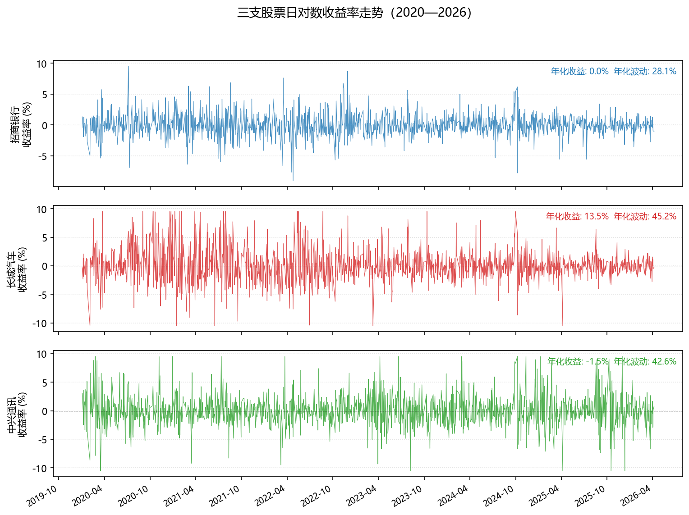
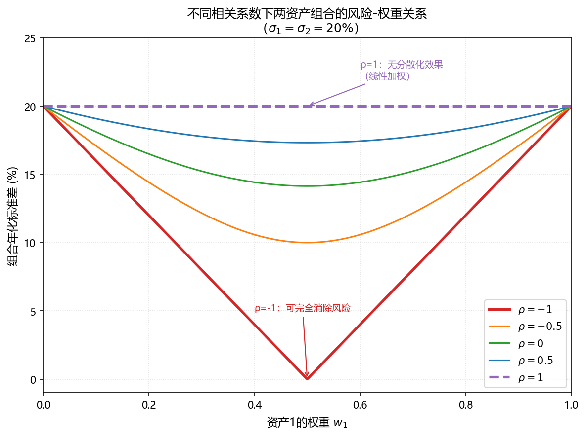
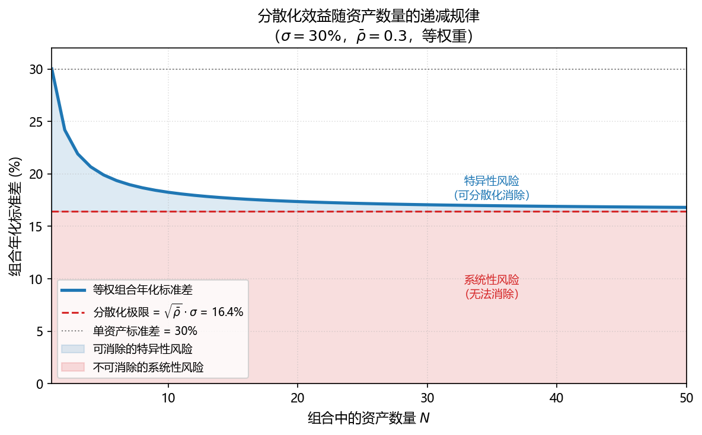
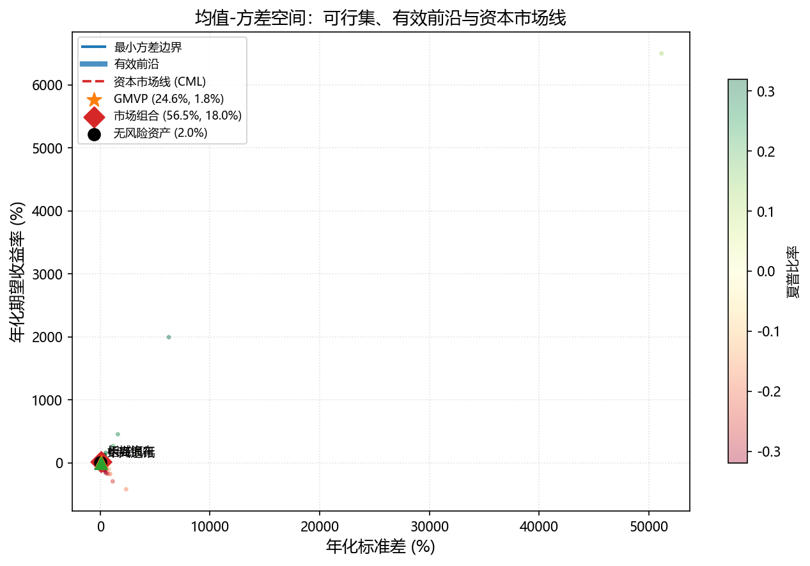
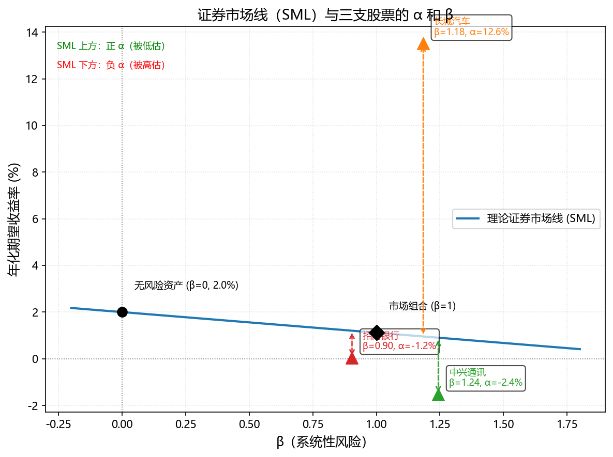
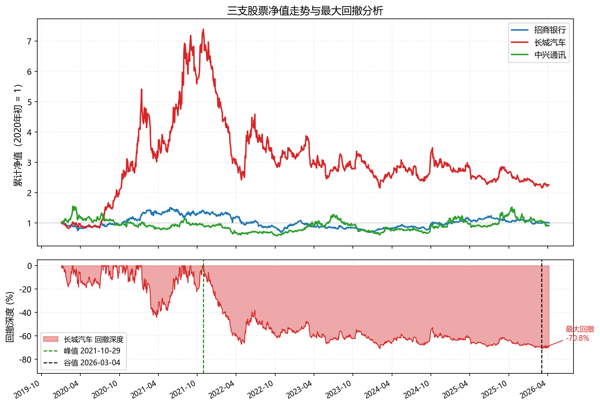

# 第一章　投资组合理论基础

> **本章目标**：建立投资组合分析的核心概念体系。在接触任何代码之前，你需要先掌握这套「语言」——用精确的数学语言描述风险与收益，理解分散化的本质，读懂有效前沿，并能解释为何市场只对系统性风险给予补偿。后续各章的策略设计与评价，都以本章为基础。

**学习目标**：完成本章后，你应能：

1. 计算并解释单资产和组合的期望收益、方差与协方差；
2. 理解分散化降低风险的数学机制及其边界；
3. 读懂均值-方差空间中的有效前沿图，并解释最优组合的选择逻辑；
4. 区分系统性风险与特异性风险，理解 $\beta$ 的经济含义；
5. 运用夏普比率、最大回撤等指标评价投资组合的综合表现。

::: {.callout-important}
### 本章配套代码
本章的核心内容是借助 [Claude code](https://claude.ai/share/e3b0fb89-5201-4682-bf10-6d37cd22d20f) 生成的。你可以在 [01_portfolio_codes.ipynb](./01_portfolio_codes.html) 中找到完整的 Python 代码实现，包括数据获取、统计量计算、图表绘制等。运行该代码后，相关图表将自动保存到 `./figs/` 目录，并在本章中正确显示。

:::


---

## 1.1　收益与风险的度量

### 1.1.1　如何衡量收益？

投资的第一个问题：我赚了多少？

最直觉的答案是**简单收益率**（simple return）：

$$
R_t = \frac{P_t - P_{t-1}}{P_{t-1}} = \frac{P_t}{P_{t-1}} - 1
$$

其中 $P_t$ 是第 $t$ 期末的价格。简单收益率的优点是直观——涨了 10%，就是 $R_t = 0.10$。

但在实际分析中，我们更常用**对数收益率**（log return，又称连续复利收益率）：

$$
r_t = \ln\left(\frac{P_t}{P_{t-1}}\right) = \ln P_t - \ln P_{t-1}
$$

为什么要用对数？考虑以下例子：

| 时期 | 价格 | 简单收益率 | 对数收益率 |
|------|------|-----------|-----------|
| 第0期 | 100 | — | — |
| 第1期 | 50  | −50% | −69.3% |
| 第2期 | 100 | +100% | +69.3% |

两期简单收益率相加为 $-50\% + 100\% = 50\%$，但价格回到了原点，实际总收益为 0。对数收益率则完美加总：$-69.3\% + 69.3\% = 0$。

对数收益率的两个关键性质：

- **时间可加性**：多期对数收益率可以直接相加，$r_{0 \to T} = \sum_{t=1}^{T} r_t$；
- **近似性**：当收益率较小时，$r_t \approx R_t$（相差不超过 0.5%），日频数据通常满足此条件。

::: {.callout-note}
### 实践中的选择

1. 日频和月频数据通常使用对数收益率，便于跨期比较和统计分析。年化收益率在对外报告时常转回简单收益率（投资者更熟悉「年化 12%」的表述）。本讲义后续若无特别说明，均使用对数收益率。
2. 对于高频数据（分钟级、秒级），由于价格变动较小，对数收益率与简单收益率几乎无差异，使用哪种都可以。
3. 在有些情况下，使用简单收益率更合适。比如：在某些特定分析中（如计算最大回撤），简单收益率可能更直观，因为它直接反映了资金的增减比例；对于某些非连续交易的资产（如房地产、私募股权），由于价格更新不频繁，简单收益率可能更合适。
4. 对于低频数据（年频），还需要考虑股票拆分、派息等因素对价格的影响，使用调整后的价格计算收益率更为准确。
:::

### 1.1.2　如何衡量风险？

金融中「风险」的操作性定义是**收益率的波动程度**，核心度量工具是方差与标准差。

对于资产 $i$，设其历史对数收益率序列为 $\{r_{i,1}, r_{i,2}, \ldots, r_{i,T}\}$，则：

**期望收益率**（样本均值）：

$$
\bar{r}_i = \frac{1}{T} \sum_{t=1}^{T} r_{i,t}
$$

**方差**（收益率的离散程度）：

$$
\sigma_i^2 = \frac{1}{T-1} \sum_{t=1}^{T} (r_{i,t} - \bar{r}_i)^2
$$

**标准差**（方差的平方根，与收益率量纲相同）：

$$
\sigma_i = \sqrt{\sigma_i^2}
$$

单资产的风险好理解，但投资组合管理的核心是**多资产之间的联动关系**，这需要协方差和相关系数。

两资产 $i$ 和 $j$ 的**协方差**：

$$
\sigma_{ij} = \frac{1}{T-1} \sum_{t=1}^{T} (r_{i,t} - \bar{r}_i)(r_{j,t} - \bar{r}_j)
$$

- $\sigma_{ij} > 0$：两资产倾向于同向波动（同涨同跌）；
- $\sigma_{ij} < 0$：两资产倾向于反向波动（一涨一跌）；
- $\sigma_{ij} = 0$：两资产波动无线性相关。

**相关系数**（协方差的标准化版本，无量纲）：

$$
\rho_{ij} = \frac{\sigma_{ij}}{\sigma_i \sigma_j}, \quad \rho_{ij} \in [-1, 1]
$$

相关系数消除了量纲的影响，更便于比较不同资产对之间的联动强度。

### 1.1.3　多资产组合的收益与风险

设投资组合由 $N$ 种资产构成，权重向量为 $\mathbf{w} = (w_1, w_2, \ldots, w_N)^\top$，满足 $\sum_{i=1}^N w_i = 1$（全投资约束，允许负值即允许卖空）。

**组合期望收益率**是各资产期望收益率的加权平均：

$$
\bar{r}_p = \mathbf{w}^\top \boldsymbol{\mu} = \sum_{i=1}^N w_i \bar{r}_i
$$

其中 $\boldsymbol{\mu} = (\bar{r}_1, \bar{r}_2, \ldots, \bar{r}_N)^\top$ 是期望收益率向量。

**组合方差**则不是简单加权平均，而是要考虑所有资产对之间的协方差：

$$
\sigma_p^2 = \mathbf{w}^\top \Sigma \mathbf{w} = \sum_{i=1}^N \sum_{j=1}^N w_i w_j \sigma_{ij}
$$

其中 $\Sigma$ 是**协方差矩阵**（$N \times N$ 的对称正定矩阵）：

$$
\Sigma = \begin{pmatrix}
\sigma_1^2 & \sigma_{12} & \cdots & \sigma_{1N} \\
\sigma_{21} & \sigma_2^2 & \cdots & \sigma_{2N} \\
\vdots & \vdots & \ddots & \vdots \\
\sigma_{N1} & \sigma_{N2} & \cdots & \sigma_N^2
\end{pmatrix}
$$

对于三资产组合（$N=3$），展开写出组合方差：

$$
\sigma_p^2 = w_1^2\sigma_1^2 + w_2^2\sigma_2^2 + w_3^2\sigma_3^2 + 2w_1 w_2 \sigma_{12} + 2w_1 w_3 \sigma_{13} + 2w_2 w_3 \sigma_{23}
$$

这个公式揭示了一个关键事实：**组合方差不仅取决于各资产自身的波动，还取决于它们之间的协方差**。这正是分散化能够降低风险的数学根源。

::: {.callout-note}
### 协方差矩阵是组合理论的核心数据结构

在整个现代投资组合理论中，协方差矩阵 $\Sigma$ 是最重要的输入。它完整描述了所有资产之间的风险联动关系。对于 $N$ 种资产，$\Sigma$ 有 $N$ 个对角元素（各资产方差）和 $\frac{N(N-1)}{2}$ 个不重复的非对角元素（协方差）。当 $N = 100$ 时，需要估计 4950 个协方差，估计误差的积累是 Markowitz 框架在实践中最大的挑战之一。
:::

### 1.1.4　数值示例：三支股票的收益与风险

下面用招商银行（600036）、长城汽车（601633）、中兴通讯（000063）三支股票的真实数据，演示上述概念的计算过程。

运行配套代码文件 `01_portfolio_codes.ipynb` 中的第一部分，将自动从 baostock 下载数据并生成以下统计量汇总表和收益率走势图。



从图中可以观察到：三支股票的收益率序列在 2020 年初（新冠疫情冲击）均出现了大幅波动，但波动幅度和恢复节奏有所不同——这正是协方差矩阵所要捕捉的信息。

典型的统计量汇总表如下（具体数值因数据时段而异）：

| 指标 | 招商银行 | 长城汽车 | 中兴通讯 |
|------|---------:|---------:|---------:|
| 年化期望收益率 | 0.05% | 13.51% | -1.53% |
| 年化标准差 | 28.13% | 45.23% | 42.62% |
| 偏度 | 0.189 | 0.452 | 0.312 |
| 峰度 | 3.128 | 2.116 | 2.478 |

>Note: 时间范围为 2020-01-01 至 2026-04-07，年化方法为：期望收益率 × 252，标准差 × √252。

<!-- ```python
         年化期望收益率   年化标准差     偏度     峰度
招商银行   0.05%  28.13%  0.189  3.128
长城汽车  13.51%  45.23%  0.452  2.116
中兴通讯  -1.53%  42.62%  0.312  2.478
``` -->


协方差矩阵（年化）和相关系数矩阵将由代码输出，请结合图表观察：相关系数的高低是否与你的直觉一致？银行股与汽车股的联动，是否弱于同属科技板块的股票之间的联动？

::: {.callout-tip}
### 提示词：计算收益率与风险统计量

```
你是一位量化分析师，请帮我完成以下任务：

数据：我有三支 A 股的日线收盘价数据（CSV 格式），列名为「日期」和「收盘价」，文件路径分别为 data/stock/stock_600036.csv、data/stock/stock_601633.csv、data/stock/stock_000063.csv。(此处也可以使用 `akshare` 或 `baostock` 等库直接获取数据，时间范围为 2020-01-01 至今)

请帮我完成如下分析：

1. 读取数据，计算每支股票的日对数收益率；
2. 计算并打印以下统计量（年化）：期望收益率、标准差、偏度、峰度；
   - 年化方法：均值 × 252，标准差 × √252；
3. 计算并打印三支股票的协方差矩阵（年化）和相关系数矩阵；
4. 绘制三支股票日对数收益率的时间序列图（三条线，同一图中），保存为 ./figs/fig_portfolio_01_returns.png；
5. 在代码中加注释，解释每一步的含义。

请使用 pandas、numpy、matplotlib，中文标签使用 matplotlib 的中文字体设置。
```
:::

---

## 1.2　分散化的数学本质

### 1.2.1　相关性才是关键

直觉告诉我们：「不要把鸡蛋放在同一个篮子里。」但分散化降低风险的效果，究竟取决于什么？

考虑最简单的两资产组合，权重为 $w$ 和 $(1-w)$：

$$
\sigma_p^2 = w^2\sigma_1^2 + (1-w)^2\sigma_2^2 + 2w(1-w)\sigma_{12}
$$

用相关系数替换协方差（$\sigma_{12} = \rho_{12}\sigma_1\sigma_2$）：

$$
\sigma_p^2 = w^2\sigma_1^2 + (1-w)^2\sigma_2^2 + 2w(1-w)\rho_{12}\sigma_1\sigma_2
$$

当 $\rho_{12} = 1$（完全正相关）时：

$$
\sigma_p = w\sigma_1 + (1-w)\sigma_2
$$

组合标准差是两资产标准差的加权平均，**没有任何分散化效果**——你把资金分散投资，和集中在一支股票的风险是一样的，因为两支股票的走势完全同步。

当 $\rho_{12} < 1$ 时，由于 $\sigma_p^2 < [w\sigma_1 + (1-w)\sigma_2]^2$，组合方差**严格小于**两资产方差的加权平均。相关性越低，分散化效果越显著。

当 $\rho_{12} = -1$（完全负相关）时，存在某个权重使组合方差为零（无风险！）：

$$
w^* = \frac{\sigma_2}{\sigma_1 + \sigma_2}
$$

下图展示了在不同相关系数下，两资产组合的标准差随权重变化的轨迹：



从图中可以清楚地看到：**相关系数越低，组合风险曲线弯曲程度越大，分散化效果越好**。当 $\rho = -1$ 时，曲线触及零点，理论上可以完全消除风险。

::: {.callout-note}
### 现实中不存在 $\rho = -1$

在实际市场中，资产之间鲜有完全负相关的情形。但相关性较低（如股票与债券之间，或不同行业之间）已足以产生可观的分散化效果。这也是「股债组合」长期以来被广泛推荐的数学依据。
:::

### 1.2.2　N 资产的分散化极限

将分析推广到 $N$ 种资产。为简化推导，假设所有资产的方差相同（均为 $\sigma^2$），且任意两资产之间的相关系数相同（均为 $\bar{\rho}$），采用等权重（$w_i = 1/N$）：

$$
\sigma_p^2 = \frac{1}{N}\sigma^2 + \frac{N-1}{N}\bar{\rho}\sigma^2 = \sigma^2\left[\frac{1}{N}(1-\bar{\rho}) + \bar{\rho}\right]
$$

当 $N \to \infty$ 时：

$$
\sigma_p^2 \xrightarrow{N \to \infty} \bar{\rho}\sigma^2
$$

**这是一个深刻的结论**：无论组合包含多少资产，风险的下限是 $\bar{\rho}\sigma^2$，而不是零。这个下限由资产间的平均相关性决定，不可通过增加资产数量消除。这正是**系统性风险**（systematic risk）的数学含义。

可以被消除的那部分风险——$\sigma^2(1-\bar{\rho})/N$——随 $N$ 增大趋向零，称为**特异性风险**（idiosyncratic risk）或非系统性风险。

下图展示了随着组合中资产数量的增加，风险的变化规律：



观察图中曲线：增加前几支股票时风险下降迅速，但超过 20-30 支后，边际效果越来越小。**分散化的边际收益是递减的**。

::: {.callout-tip}
### 提示词：绘制分散化效益图

```
请帮我用 Python 绘制以下两张图，并保存到 ./figs/ 目录：

图1（fig_portfolio_02_diversification.png）：
- 两资产组合，资产1和资产2的标准差均为 20%；
- 横轴：资产1的权重，从0到1；
- 纵轴：组合标准差（%）；
- 绘制 ρ = -1, -0.5, 0, 0.5, 1 五种情形的曲线，不同颜色，图例说明；
- 标注 ρ=1 时的直线（无分散化效果）和 ρ=-1 时的 V 形曲线（最大分散化）；
- 中文标题和坐标轴标签。

图2（fig_portfolio_03_n_assets.png）：
- 模拟场景：每支股票年化标准差 30%，平均相关系数 0.3；
- 横轴：组合中的资产数量，从 1 到 50；
- 纵轴：组合年化标准差（%）；
- 画出理论曲线，并用水平虚线标注分散化极限（√(ρ̄) × σ）；
- 在图中标注「可消除的特异性风险」和「不可消除的系统性风险」两个区域；
- 中文标题和坐标轴标签。

请使用 numpy 和 matplotlib，图形清晰、配色专业。
```
:::

### 1.2.3　分散化的实践含义

上述分析给出了几条直接可操作的投资原则：

**第一，相关性比资产数量更重要。** 持有 50 支高度相关的同行业股票，分散化效果可能远不如持有 10 支跨行业、相关性较低的股票。招募 10 支 $\rho \approx 0.8$ 的股票，组合风险仍接近单股风险的 90%。

**第二，分散化有边界。** 系统性风险（宏观经济冲击、利率变动、市场情绪）会同时影响几乎所有资产，无论如何分散都无法消除。2020 年新冠疫情冲击期间，A 股几乎所有行业同时大幅下跌，正是系统性风险集中释放的典型案例。

**第三，跨资产类别的分散化效果更显著。** 股票与债券、股票与商品、国内资产与海外资产，其相关性通常远低于股票内部的相关性，因此能提供更好的分散化效果。

---

## 1.3　均值-方差框架与有效前沿

### 1.3.1　均值-方差空间

Markowitz（1952）的天才洞见是：将投资组合的选择问题转化为一个**几何问题**。

以期望收益率 $\bar{r}_p$ 为纵轴，标准差 $\sigma_p$ 为横轴，构造**均值-方差空间**（mean-variance space）。每一个权重向量 $\mathbf{w}$ 对应空间中的一个点，代表一个特定的投资组合。

当资产数量为 2 时，改变权重 $w$（从 0 到 1），轨迹是一条曲线（见上文分散化图）。当资产数量为 $N \geq 3$ 时，改变所有权重的组合，所有可行的投资组合构成一片 **「子弹形」的区域**（feasible set，可行集），如下图所示：

<!--  -->

{width="90%"}


这片区域的**左边界**称为**最小方差边界**（minimum variance frontier）：在给定期望收益率水平下，风险（标准差）最小的组合轨迹。最小方差边界上的最低点是**全局最小方差组合**（Global Minimum Variance Portfolio，GMVP）。

### 1.3.2　有效前沿

理性的投资者不会选择可行集内部的任意组合。对于可行集中的两个组合 A 和 B：

- 若 $\bar{r}_A \geq \bar{r}_B$ 且 $\sigma_A \leq \sigma_B$（至少一个严格不等式），则称 A **均值-方差支配**（dominates）B；
- 理性投资者只会选择不被其他任何组合支配的组合。

**有效前沿**（Efficient Frontier）是最小方差边界中，期望收益率**不低于** GMVP 的部分——即边界的上半段。有效前沿上的每个点都是「不浪费」的组合：在该风险水平下，没有其他组合能提供更高的期望收益；在该收益水平下，没有其他组合能提供更低的风险。

### 1.3.3　最优组合的选择

有效前沿给出了所有「值得考虑」的组合集合。在此基础上，不同风险偏好的投资者会选择不同的点：

- **风险厌恶程度高**的投资者（如养老金）会选择有效前沿左下方的点（低收益、低风险）；
- **风险厌恶程度低**的投资者会选择有效前沿右上方的点（高收益、高风险）。

引入**无风险资产**（利率为 $r_f$，方差为零）后，投资者可以在无风险资产与任意风险组合之间进行配置。连接无风险资产点 $(0, r_f)$ 与有效前沿上某点的直线，代表两者的混合策略，其斜率为：

$$
\text{夏普比率} = \frac{\bar{r}_p - r_f}{\sigma_p}
$$

斜率最大的那条直线——即从 $(0, r_f)$ 与有效前沿**相切**的直线——称为**资本市场线**（Capital Market Line，CML）。切点对应的风险组合称为**市场组合**（market portfolio）。

**分离定理**（Separation Theorem）：在完美市场中，所有理性投资者都应持有**同样的风险资产组合**（市场组合），只通过调整无风险资产与市场组合的比例来匹配自己的风险偏好。

::: {.callout-note}
### Markowitz 框架的局限性

尽管均值-方差框架是现代组合理论的基石，但它在实践中面临几个重要挑战：

1. **参数估计误差大**：期望收益率的估计极不稳定（历史均值充满噪声），而组合权重对期望收益率的输入极度敏感，微小的估计误差可能导致权重的巨大变化；
2. **协方差矩阵估计的维度诅咒**：$N$ 种资产需要估计 $O(N^2)$ 个参数，当 $N$ 较大时，估计误差积累严重；
3. **忽略高阶矩**：方差只捕捉了分布的二阶特征，但金融收益率往往具有尖峰肥尾（高峰度）和负偏度，这在方差框架中完全被忽略。

这些局限性直接催生了因子模型（第 1.4 节）和稳健组合优化方法的发展。
:::

::: {.callout-tip}
### 提示词：绘制有效前沿

```
请帮我用 Python 绘制三资产组合的均值-方差空间图，保存为 ./figs/fig_portfolio_04_frontier.png。

数据设定：使用从 baostock 下载的招商银行（600036）、长城汽车（601633）、中兴通讯（000063）三支股票 2020-2024 年的日收益率数据，计算年化期望收益率向量 μ 和年化协方差矩阵 Σ。

绘图要求：
1. 通过蒙特卡洛模拟（随机生成至少 5000 组权重，满足 sum=1 且允许[-0.2, 1.2] 范围的权重），在均值-方差空间中画出散点图（灰色小点），展示可行集；
2. 用数值优化方法（scipy.optimize）在不同目标收益率水平下求解最小方差组合，连成最小方差边界（蓝色曲线）；
3. 标注全局最小方差组合（GMVP）位置，用红色星形标注；
4. 假设无风险利率为年化 2%，画出资本市场线（切线），标注切点（市场组合）；
5. 横轴为年化标准差（%），纵轴为年化期望收益率（%）；
6. 中文标题、坐标轴标签和图例。

请使用 numpy、scipy、matplotlib，并在代码中注释关键步骤。
```
:::

---

## 1.4　CAPM 与因子模型

### 1.4.1　资本资产定价模型（CAPM）

均值-方差框架告诉我们如何选择最优组合，但没有回答一个更基本的问题：**一项资产的预期收益率究竟应该是多少？**

Sharpe（1964）和 Lintner（1965）在 Markowitz 框架的基础上，加入市场均衡条件，推导出**资本资产定价模型**（Capital Asset Pricing Model，CAPM）：

$$
E(R_i) = R_f + \beta_i \cdot [E(R_m) - R_f]
$$

其中：

- $R_f$：无风险利率（如国债收益率）；
- $E(R_m)$：市场组合的期望收益率；
- $E(R_m) - R_f$：**市场风险溢价**（equity risk premium），承担市场风险的额外补偿；
- $\beta_i$：资产 $i$ 的**市场 β**，衡量其系统性风险。

**β 的定义与计算**：

$$
\beta_i = \frac{\text{Cov}(R_i, R_m)}{\text{Var}(R_m)} = \frac{\sigma_{im}}{\sigma_m^2}
$$

β 可以通过对资产超额收益率对市场超额收益率进行 OLS 回归得到：

$$
R_{i,t} - R_f = \alpha_i + \beta_i (R_{m,t} - R_f) + \varepsilon_{i,t}
$$

### 1.4.2　β 的经济含义

β 衡量了资产收益率对市场整体波动的敏感程度：

| β 值 | 含义 | 典型资产 |
|------|------|---------|
| $\beta > 1$ | 进攻型：市场涨 10%，该资产涨超 10% | 成长股、科技股 |
| $\beta = 1$ | 与市场同步 | 指数基金 |
| $0 < \beta < 1$ | 防御型：波动小于市场 | 公用事业、消费必需品 |
| $\beta \approx 0$ | 与市场无关 | 货币市场基金 |
| $\beta < 0$ | 反向资产：市场下跌时上涨 | 黄金（部分时期）、反向 ETF |

::: {.callout-note}
### β 与 α：量化投资的核心目标

CAPM 回归方程中的截距项 $\alpha_i$ 代表资产在控制了市场风险之后的**超额收益**（abnormal return）。

- 若 $\alpha_i = 0$：CAPM 成立，资产的收益完全由其系统性风险解释；
- 若 $\alpha_i > 0$：资产产生了超越风险补偿的额外收益，说明可能存在市场定价错误，或该资产有 CAPM 未捕捉到的优势；
- 若 $\alpha_i < 0$：资产表现不及其风险应有的补偿。

**寻找正 α**，正是量化投资策略的核心目标。后续各章介绍的所有量化策略，本质上都是在特定市场条件下系统性地捕捉 α 的方法。
:::

### 1.4.3　风险的分解

将 CAPM 回归方程代入，资产总方差可以分解为：

$$
\underbrace{\sigma_i^2}_{\text{总风险}} = \underbrace{\beta_i^2 \sigma_m^2}_{\text{系统性风险}} + \underbrace{\sigma_{\varepsilon_i}^2}_{\text{特异性风险}}
$$

- **系统性风险** $\beta_i^2 \sigma_m^2$：来自宏观经济、利率、通胀等影响所有资产的共同因素，**无法通过分散化消除**；
- **特异性风险** $\sigma_{\varepsilon_i}^2$：来自公司特有的事件（管理层变动、产品召回、财务问题等），可以通过持有足够多不相关资产**完全消除**。

因此，在均衡状态下，市场**只对系统性风险给予风险溢价**，特异性风险不应获得额外补偿（因为可以免费通过分散化消除）。这解释了为什么 CAPM 中只有 β 决定预期收益，而非总方差。

**可决系数 $R^2$** 反映了系统性风险在总风险中的比例：$R^2 = \frac{\beta_i^2 \sigma_m^2}{\sigma_i^2}$。对于分散化良好的基金，$R^2$ 通常接近 1；对于个股，$R^2$ 通常在 0.2—0.6 之间。

### 1.4.4　从 CAPM 到多因子模型

CAPM 是优雅的理论，但实证检验结果令人失望。研究者发现市场中存在若干「异象」——某些特征能系统性地预测 CAPM 无法解释的超额收益：

- **规模效应**（Size Effect）：小市值股票长期跑赢大市值股票；
- **价值效应**（Value Effect）：高账面市值比（B/M）股票长期跑赢低 B/M 股票；
- **动量效应**（Momentum Effect）：过去一段时间涨得好的股票，在未来短期内倾向于继续上涨。

Fama 和 French（1993）在 CAPM 的基础上增加了两个因子，构建了**三因子模型**：

$$
R_{i,t} - R_f = \alpha_i + \beta_i^{MKT}(R_{m,t} - R_f) + \beta_i^{SMB} \cdot SMB_t + \beta_i^{HML} \cdot HML_t + \varepsilon_{i,t}
$$

其中：

- $MKT_t = R_{m,t} - R_f$：市场因子（市场超额收益）；
- $SMB_t$（Small Minus Big）：小市值组合相对大市值组合的超额收益，捕捉规模效应；
- $HML_t$（High Minus Low）：高 B/M 组合相对低 B/M 组合的超额收益，捕捉价值效应。

多因子模型的「因子」本质是：**某类共同的、可量化的特征，能系统性地解释一组资产的超额收益**。这个思想直接催生了现代量化投资中的「因子选股」策略（详见第二章）。

::: {.callout-tip}
### 提示词：估计个股 β 并绘制证券市场线

```
请帮我完成以下量化分析任务，使用 Python：

任务背景：
- 股票数据：招商银行（600036）、长城汽车（601633）、中兴通讯（000063），2020-2024 年日收益率；
- 市场基准：使用沪深300指数（代码：sh.000300）作为市场组合，从 baostock 下载同期数据；
- 无风险利率：假设年化 2%，折算为日度 2%/252。

请完成：
1. 对每支股票进行 CAPM 回归（OLS），估计 α 和 β，打印回归结果（包括 t 值和 R²）；
2. 将三支股票在「β - 期望收益率」坐标系中标注出来；
3. 绘制理论证券市场线（SML）：过点 (0, Rf) 和 (1, E(Rm)) 的直线；
4. 标注各股票是否在 SML 上方（正 α，被低估）或下方（负 α，被高估）；
5. 保存图片为 ./figs/fig_portfolio_05_sml.png；
6. 代码中注释每个步骤的金融含义。

请使用 pandas、numpy、statsmodels（OLS 回归）、matplotlib。
```
:::

下图展示了三支股票在证券市场线（SML）上的位置：



---

## 1.5　风险度量进阶

标准差是风险度量的基础工具，但它存在一个明显的缺陷：**它对上行波动和下行波动一视同仁**——而投资者真正厌恶的只是损失，而非波动本身。本节介绍几种在实践中广泛使用的进阶风险指标。

### 1.5.1　在险价值（VaR）

**在险价值**（Value at Risk，VaR）回答一个具体问题：在给定置信水平下，未来某段时间内的**最大可能损失**是多少？

**正式定义**：在置信水平 $1 - \alpha$（如 95%）和持有期 $h$ 下，VaR 是满足以下条件的损失临界值 $L$：

$$
P(\text{损失} > \text{VaR}_{1-\alpha}) = \alpha
$$

即超过 VaR 的损失只有 $\alpha$（如 5%）的概率发生。

**直觉例子**：若某策略的日 VaR$_{95\%}$ = 2%，意味着：在 100 个交易日中，大约有 95 天的损失不超过 2%，有 5 天的损失超过 2%。

VaR 的常用估计方法：

- **历史模拟法**：用历史收益率的经验分布，取对应分位数；
- **参数法（正态假设）**：$\text{VaR}_{1-\alpha} = -(\bar{r} - z_\alpha \sigma)$，其中 $z_\alpha$ 是正态分布的 $\alpha$ 分位数（95% 置信水平对应 $z_{0.05} = 1.645$）；
- **蒙特卡洛模拟**：模拟大量情景，统计损失分布。

**VaR 的核心局限性**：VaR 只告诉你「损失不太可能超过这个值」，但完全不告诉你一旦超过之后，损失会有多大。这个「尾部盲区」在极端市场情景下非常危险。

### 1.5.2　条件在险价值（CVaR）

**条件在险价值**（Conditional Value at Risk，CVaR），又称**期望尾部损失**（Expected Shortfall，ES），解决了 VaR 的尾部盲区问题：

$$
\text{CVaR}_{1-\alpha} = E\left[\text{损失} \mid \text{损失} > \text{VaR}_{1-\alpha}\right]
$$

CVaR 是**超过 VaR 阈值的情景下，平均损失的期望值**。它完整刻画了尾部风险的严重程度。

**数值比较**：假设两个组合，日 VaR$_{95\%}$ 均为 2%：

- 组合 A：一旦超过 2% 的损失，平均亏损为 2.5%（尾部损失温和）；
- 组合 B：一旦超过 2% 的损失，平均亏损为 8%（尾部风险严重）。

VaR 无法区分这两个组合，但 CVaR 可以（A 的 CVaR$_{95\%}$ = 2.5%，B 的 CVaR$_{95\%}$ = 8%）。

::: {.callout-note}
### 监管实践中的 VaR 与 CVaR

巴塞尔协议 III（2010 年）将 CVaR（Expected Shortfall）引入银行业监管资本计算，逐步取代此前使用的 VaR。原因正是 2008 年金融危机暴露了 VaR 在极端市场环境下的严重缺陷——模型认为「不太可能发生」的损失，实际上在尾部连续发生且规模巨大。
:::

### 1.5.3　最大回撤

**最大回撤**（Maximum Drawdown，MDD）衡量投资组合或策略从历史**最高点**到随后**最低点**的最大跌幅：

$$
\text{MDD} = \max_{t \in [0,T]} \left[\frac{\text{Peak}(t) - \text{Trough}(t)}{\text{Peak}(t)}\right]
$$

其中 $\text{Peak}(t)$ 是时刻 $t$ 之前的历史最高净值，$\text{Trough}(t)$ 是此后（到 $T$）的最低净值。

最大回撤的**金融直觉**：它衡量的是投资者在最坏情形下「从山顶到山谷」的真实亏损体验。一个年化收益 15%、最大回撤 60% 的策略，在实践中几乎没有人能坚持持有到底——你需要承受账户腰斩才能等到后来的盈利。

**回撤持续时间**（Recovery Period）同样重要：回撤持续多久？从谷底恢复到前期高点需要多长时间？这些信息共同决定了策略在实践中的可持续性。

下图展示了三支股票的历史净值走势与最大回撤区间：



### 1.5.4　夏普比率与索提诺比率

**夏普比率**（Sharpe Ratio）是最广泛使用的风险调整收益指标，衡量每承担一单位**总风险**所获得的超额收益：

$$
\text{Sharpe} = \frac{\bar{r}_p - r_f}{\sigma_p}
$$

年化夏普比率 = $\frac{\text{年化超额收益}}{\text{年化标准差}}$。

**夏普比率的参考区间**：

| 夏普比率 | 评价 |
|---------|------|
| < 0 | 策略不如持有无风险资产 |
| 0—0.5 | 较差 |
| 0.5—1.0 | 一般 |
| 1.0—2.0 | 较好 |
| > 2.0 | 优秀（需警惕过拟合） |

夏普比率的局限性：分母用总波动率（包括上行波动），但理性投资者只厌恶下行损失，不厌恶超预期的收益。

**索提诺比率**（Sortino Ratio）改进了这一点，只用**下行标准差**（downside deviation）作为分母：

$$
\text{Sortino} = \frac{\bar{r}_p - r_f}{\sigma_{\text{downside}}}
$$

其中 $\sigma_{\text{downside}} = \sqrt{\frac{1}{T}\sum_{t: r_t < r_f}(r_t - r_f)^2}$，只计算低于无风险利率的那些负收益的偏差。

::: {.callout-tip}
### 提示词：计算完整的风险指标体系并绘制回撤图

```
请帮我用 Python 完成以下任务：

数据：招商银行（600036）、长城汽车（601633）、中兴通讯（000063）2020-2024 年日收益率，以及沪深300指数同期数据。

任务1：计算以下风险指标（以年化数据为基础），汇总为 DataFrame 并打印：
- 年化期望收益率
- 年化标准差
- 最大回撤（MDD）及其对应的峰值日期和谷值日期
- 历史模拟法日 VaR（95% 置信水平）
- 历史模拟法日 CVaR（95% 置信水平）
- 夏普比率（无风险利率 = 年化 2%）
- 索提诺比率（无风险利率 = 年化 2%）

任务2：绘制净值走势与最大回撤图（fig_portfolio_06_drawdown.png）：
- 子图1：三支股票的累计净值走势（以 2020 年初为基准 = 1），三条线；
- 子图2：对其中最大回撤最大的一支股票，绘制其回撤深度时序图（当前净值相对历史高点的跌幅，%)；
  - 用红色填充回撤区域；
  - 标注最大回撤的峰值和谷值时间点；
- 中文标题和坐标轴标签，布局紧凑。

请使用 pandas、numpy、matplotlib，代码中注释关键步骤的金融含义。
```
:::

### 1.5.5　指标汇总：构建「风险评价仪表盘」

将上述所有指标汇总，形成对每支股票（或策略）的全面评价：

| 指标 | 度量维度 | 越大越好？ | 主要用途 |
|------|---------|----------|---------|
| 期望收益率 | 收益 | 是 | 基本收益评价 |
| 标准差 | 总风险 | 否 | 波动程度 |
| 最大回撤 | 极端下行风险 | 否 | 抗压能力 |
| VaR（95%）| 尾部风险临界值 | 否 | 监管合规、风险限额 |
| CVaR（95%）| 尾部风险均值 | 否 | 更完整的尾部刻画 |
| 夏普比率 | 风险调整收益 | 是 | 综合绩效排名 |
| 索提诺比率 | 下行风险调整收益 | 是 | 强调下行保护 |
| β | 系统性风险敞口 | 视目标而定 | 市场风险管理 |

::: {.callout-note}
### 单一指标的局限性

在实际评价策略时，切忌只看一个指标。一个高夏普比率的策略可能有极大的最大回撤（如策略在多数时候稳定盈利，但偶发性的尾部损失极为严重）；一个低最大回撤的策略可能因为过度保守而绝对收益很低。第三章将系统介绍如何综合使用这些指标来全面评价量化策略。
:::

---

## 本章小结

本章建立了投资组合分析的完整理论框架。核心结论可以归纳为以下几条：

**关于收益与风险**：对数收益率因其时间可加性在实践中被广泛使用；风险的核心度量是方差（标准差），多资产之间的联动由协方差矩阵完整描述。

**关于分散化**：分散化降低风险的核心机制是资产间的相关性，而非资产数量。分散化存在极限——系统性风险无法通过分散化消除，其大小由资产间的平均相关性决定。

**关于有效前沿**：在均值-方差框架下，理性投资者的选择集合是有效前沿。引入无风险资产后，所有投资者都应持有同样的市场组合，只通过调整风险资产与无风险资产的比例来匹配风险偏好。

**关于风险定价**：CAPM 表明只有系统性风险（β）才获得风险补偿；特异性风险可被分散化消除，因此不获补偿。寻找正 α（超越风险补偿的超额收益）是量化投资的核心目标。Fama-French 三因子模型进一步揭示了规模和价值因素对收益的系统性解释力。

**关于风险度量**：标准差之外，VaR 和 CVaR 刻画了尾部风险的大小，最大回撤反映了策略的极端亏损体验，夏普比率和索提诺比率则将收益与风险综合为可比较的单一指标。

---

## 思考题

1. 如果两资产的相关系数 $\rho = 0$，是否意味着分散化可以完全消除风险？请用公式说明原因，并解释系统性风险与特异性风险在这种情况下的含义。

2. 一位投资者持有招商银行股票，另一位持有招商银行 + 长城汽车的等权组合。在不计算的情况下，你如何判断哪个组合的夏普比率更高？你的判断依赖于哪些假设？

3. 某私募基金过去三年的年化收益为 20%，夏普比率为 1.5，但最大回撤达到 45%。你如何向客户解释这三个数字之间的关系？你会推荐这只基金吗？

4. CAPM 的「分离定理」表明所有理性投资者应持有同样的市场组合。但现实中基金经理们持有的组合各不相同。请列举 2—3 个 CAPM 假设与现实不符的地方，说明这些差异如何导致现实偏离理论预测。

5. （扩展）Fama-French 三因子模型中的 SMB 和 HML 因子在过去 30 年的实证研究中已被充分记录。但有研究者认为，这些因子溢价在被发现并公开后已逐渐消失。请思考：为什么「被发现」的超额收益会消失？这对量化投资有什么启示？


