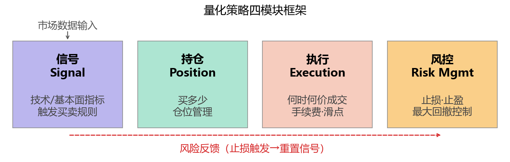
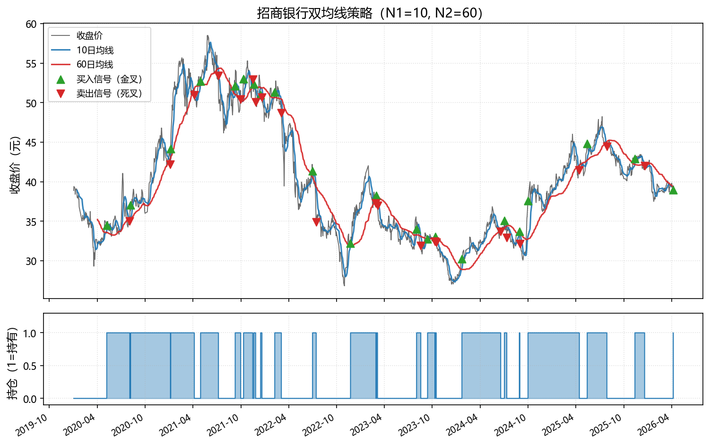
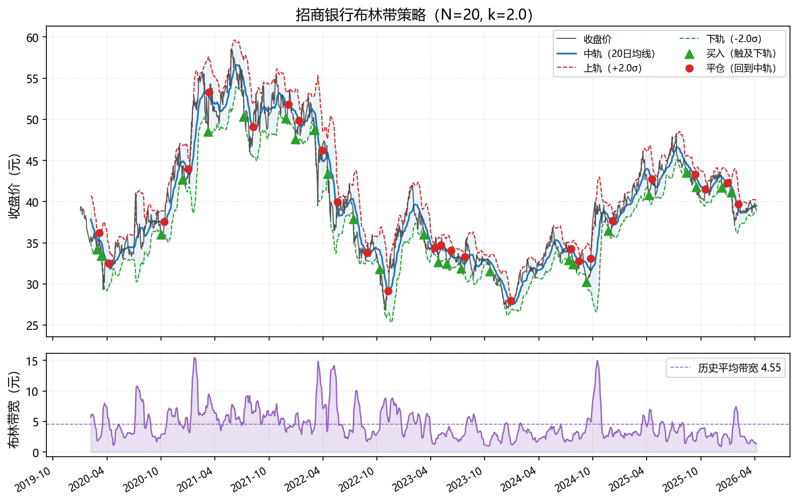
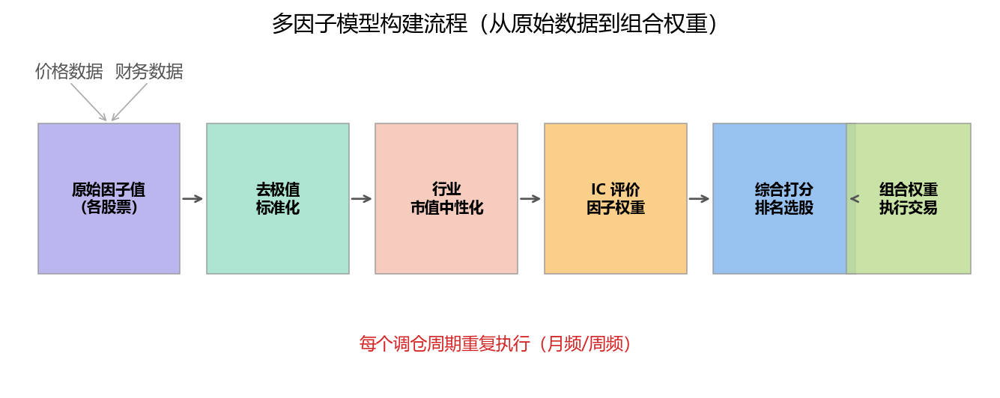
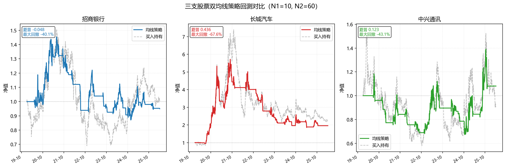

# 第二章　量化策略构建

> **本章承接**：第一章建立了描述风险与收益的语言体系，本章的任务是用这套语言设计策略——将一个金融直觉翻译成可以在历史数据上检验的规则集合。核心问题只有一个：**什么样的市场规律，可以被系统性地、重复地利用？**

**学习目标**：完成本章后，你应能：

1. 用「信号—持仓—执行—风控」四模块框架描述任意量化策略的结构；
2. 理解趋势跟踪、均值回归、因子选股三类策略的逻辑基础与适用市场环境；
3. 构建并计算基本因子（动量、价值、质量），理解 IC 评价方法；
4. 使用 AI 提示词辅助完成策略代码的生成、调试与扩展；
5. 在 backtrader 或 vectorbt 中运行一个完整的策略回测并读取基础结果。

---

## 2.1　量化策略的基本框架

### 2.1.1　从直觉到规则：量化思维的转变

传统主观投资依赖分析师的判断——看财报、调研管理层、感受市场情绪。量化投资并不否定这些判断的价值，但它要求：**将判断明确化、规则化、可重复化**。

一个「感觉这支股票要涨」的想法，本身没有任何信息量。但把它改写为「当某股票的 60 日动量排名位于全市场前 20%，且市净率低于行业中位数时，买入并持有 20 个交易日」，就变成了一个可以在历史数据上验证有效性的策略。

这个转化过程要求：

- 明确**信号**（什么条件触发操作）；
- 明确**持仓规模**（买多少）；
- 明确**执行方式**（什么时候以什么价格成交）；
- 明确**风险边界**（什么情况下止损或平仓）。

### 2.1.2　四模块框架

任何量化策略都可以分解为以下四个模块，理解这个框架是设计和诊断策略的基础：

**模块一：信号（Signal）**

信号是策略的核心——基于数据计算出的、用于触发买卖决策的指标。信号可以是：

- 技术指标（均线、[RSI](https://zh.wikipedia.org/wiki/%E7%9B%B8%E5%B0%8D%E5%BC%B7%E5%BC%B1%E6%8C%87%E6%95%B8)、[布林带](https://zh.wikipedia.org/wiki/%E5%B8%83%E6%9E%97%E5%B8%A6)）；
- 基本面因子（市盈率、ROE、营收增速）；
- 量价因子（成交量异动、换手率）；
- 宏观因子（利率差、汇率动量）。

信号本身只有「值」，需要附加一个**决策规则**才能产生买卖指令：例如「当短期均线上穿长期均线时，信号值从 -1 变为 +1，触发买入」。

**模块二：持仓（Position Sizing）**

信号告诉你买还是卖，持仓模块回答「买多少」。常见方法包括：

- 等权重（每次买入固定比例的资金，最简单）；
- 固定金额（每次买入固定金额，适合资金规模固定的账户）；
- 波动率目标（根据资产波动率反向调整仓位，波动越大仓位越小）；
- [Kelly 公式](https://zh.wikipedia.org/wiki/Kelly_criterion)（理论上最优化长期资产增长的仓位比例，实践中常用半 Kelly 以降低风险）。

**模块三：执行（Execution）**

回测中通常假设在信号出现后的「下一根 K 线开盘价」成交，以避免未来函数（look-ahead bias）。现实中执行还需考虑：

- 市价单 vs 限价单；
- 滑点（实际成交价与预期价格的偏差）；
- 交易费用（佣金 + 印花税，A 股目前双边约 0.1%—0.3%）；
- 冲击成本（大额交易对价格的影响）。

**在回测时至少要加入交易费用和滑点假设，否则策略绩效会被严重高估**，这是初学者最常犯的错误之一。

**模块四：风控（Risk Management）**

风控是策略的「安全阀」，即使信号有效，也需要明确的退出规则：

- 止损（当亏损达到某阈值时强制平仓，如单笔亏损超过 8%）；
- 止盈（当盈利达到目标时锁定收益）；
- 最大持仓限制（单只股票持仓不超过总资金的 10%）；
- 最大回撤触发（当组合回撤超过某阈值时降低整体仓位）。

下图展示了四模块在策略生命周期中的流转关系：



::: {.callout-note}
### 数据驱动 vs 主观判断：不是对立而是互补

量化方法的核心优势在于**纪律性**（规则一旦设定，不受情绪影响）和**可扩展性**（同一套逻辑可以同时监控数百只股票）。但它的局限在于**历史数据的局限性**——策略只能捕捉历史中已经存在的规律，对结构性变化（新的监管政策、技术颠覆）反应迟钝。

实践中最强的策略往往结合了两者：用金融直觉确定「值得寻找的规律方向」，用数据检验这个规律是否真实存在，再用量化工具将其系统化执行。
:::

### 2.1.3　策略分类：三种基本逻辑

市场中有成千上万的量化策略，但其背后的逻辑归根结底只有三种：

| 类型 | 核心逻辑 | 适用市场环境 |
|------|---------|------------|
| **趋势跟踪** | 价格趋势具有惯性，涨的会继续涨 | 单边行情（牛市/熊市） |
| **均值回归** | 价格偏离均值后倾向于回归 | 震荡市、低波动环境 |
| **因子选股** | 某些基本面/技术面特征系统性地预测超额收益 | 宽泛适用，依因子而异 |

理解这三种逻辑的前提，是认识到它们在某种程度上是**相互矛盾**的：趋势策略认为「涨了还会涨」，均值回归认为「涨太多了会跌回来」。市场在不同阶段交替呈现这两种特性，这正是单一策略难以在所有市场环境中持续有效的根本原因。本章后续三节分别展开这三种策略的设计逻辑。

---

## 2.2　趋势跟踪策略

### 2.2.1　趋势的存在性：动量效应

趋势跟踪策略建立在一个实证发现之上：**价格在中短期内具有惯性**。过去一段时间表现好的资产，在未来短期内倾向于继续表现好；表现差的，倾向于继续差。

这一现象称为**动量效应**（momentum effect），由 Jegadeesh 和 Titman（1993）在美国股市中首次系统记录，此后在全球主要市场（包括 A 股）均有不同程度的实证支持。

动量效应的成因至今仍有争议，主要解释包括：

- **行为金融视角**：投资者对信息反应不足（underreaction）——好消息的扩散需要时间，导致价格在信息完全消化之前持续上涨；
- **羊群效应**：机构投资者的追涨行为形成自我强化的趋势；
- **风险补偿视角**：趋势型资产在市场转折时承担了更大的风险，动量溢价是对这种风险的补偿。

::: {.callout-note}
### A 股的趋势特征

A 股市场以散户参与度高（散户交易量占比 70%+）、情绪驱动特征明显著称。研究表明 A 股的短期动量效应（1—3 个月）相对较弱，但中期趋势（3—12 个月）和行业轮动动量相对显著。与美股不同，A 股还存在较明显的「反转效应」——短期（1 个月）内涨幅最大的股票往往会在下个月出现反转。这要求在直接套用美股动量策略时保持谨慎。
:::

### 2.2.2　双均线策略

**双均线策略**是趋势跟踪策略中最经典、最广泛使用的形式，逻辑极为简单：

- **买入信号**：短期均线从下方穿越长期均线（「金叉」）；
- **卖出信号**：短期均线从上方穿越长期均线（「死叉」）。

**移动平均线的定义**：

$$
\text{MA}(N)_t = \frac{1}{N} \sum_{i=0}^{N-1} P_{t-i}
$$

即过去 $N$ 日收盘价的算术平均值。常用参数组合为：短期 5 或 10 日，长期 20 或 60 日。

**均线的经济含义**：均线平滑了价格的短期噪声，代表了市场参与者在该时间窗口内的「平均持仓成本」。当短均线上穿长均线时，近期买入者已开始盈利，市场情绪倾向于乐观，趋势可能延续。

**策略的局限性**：均线策略在震荡市中表现很差——价格在均线附近反复穿越，产生大量「假信号」（whipsaw），每次信号都带来一笔小亏损，频繁交易的手续费进一步侵蚀收益。因此，均线策略有一个隐含前提：**市场处于明显的单边趋势中**。

下图展示了某股票的双均线策略信号（以招商银行为例）：



::: {.callout-tip}
### 提示词：实现双均线策略并可视化信号

```
你是一位量化策略工程师，请帮我用 Python 实现并可视化双均线策略。

数据：使用 data/stock/stock_600036.csv（招商银行），
读取「日期」和「收盘价」两列。

任务：
1. 计算短期均线（[短期窗口，如 10 日]）和长期均线（[长期窗口，如 60 日]）；
2. 生成买卖信号：短线上穿长线 → 买入信号（signal=1），
   下穿 → 卖出信号（signal=-1），其余 → 持有（signal=0）；
3. 绘制图形，保存为 ./figs/fig_strategies_02_ma_cross.png：
   - 上子图：收盘价走势 + 两条均线，用绿色向上三角标注买入点，红色向下三角标注卖出点；
   - 下子图：持仓状态（1=持仓，0=空仓），用填充区域展示；
4. 打印策略期间内的信号数量（买入次数、卖出次数）；
5. 代码加注释，解释每步的含义。

请使用 pandas、numpy、matplotlib，时间轴格式化为「年-月」。
你可以调整参数 [短期窗口] 和 [长期窗口] 来探索不同参数组合的效果。
```
:::

### 2.2.3　动量策略

**动量策略**（momentum strategy）是趋势跟踪的另一种实现方式，直接用历史收益率作为信号，不依赖均线的平滑处理。

**经典截面动量**（cross-sectional momentum）的构建流程：

1. 在每个调仓日，计算全市场所有股票在过去 $J$ 个月的累计收益率（通常 $J=6$ 或 $12$，并跳过最近 1 个月以规避短期反转）；
2. 将股票按动量值从高到低排序，买入前 $K\%$ 的「赢家组合」，卖空后 $K\%$ 的「输家组合」（或仅做多赢家组合）；
3. 持有 $H$ 个月后调仓（通常 $H=1$ 或 $3$）。

**时序动量**（time-series momentum）则不跨资产比较，而是对单只资产判断：当该资产过去 $J$ 个月的收益为正时持有，为负时空仓（或做空）。

动量信号的另一种形式是**相对强弱指标**（RSI，Relative Strength Index），在技术分析中被广泛使用：

$$
\text{RSI}(N) = 100 - \frac{100}{1 + \frac{\text{过去}N\text{日平均上涨幅度}}{\text{过去}N\text{日平均下跌幅度}}}
$$

RSI 的取值范围是 0—100：高于 70 通常被视为「超买」（可能反转）；低于 30 被视为「超卖」（可能反弹）。注意，在强趋势行情中，RSI 可以长期维持在高位——将 RSI > 70 机械地视为卖出信号在趋势市中会造成大量错误操作。

::: {.callout-tip}
### 提示词：构建截面动量因子并排序

```
请帮我用 Python 构建截面动量因子，分析三支股票的相对动量排名。

数据：读取招商银行（600036）、长城汽车（601633）、中兴通讯（000063）
的日线收盘价数据（data/stock/ 目录下）。

任务：
1. 计算每支股票的「过去 [N] 个交易日累计对数收益率」作为动量因子值，
   N 可设为 60（约3个月）、120（约6个月），请分别计算；
2. 在每个月末，对三支股票按动量因子排序（高动量→低动量），
   打印最近 12 个月末的排名变化表格；
3. 绘制三支股票动量因子值的时序图（两个子图，分别对应 N=60 和 N=120），
   保存为 ./figs/fig_strategies_03_momentum.png；
4. 计算并打印：动量因子与下一期月度收益率的相关系数（IC），
   评价该因子的预测能力。

代码中注释说明每步的金融含义。
请使用 pandas、numpy、matplotlib。
```
:::

---

## 2.3　均值回归策略

### 2.3.1　均值回归的逻辑基础

均值回归（mean reversion）与趋势跟踪在逻辑上完全相反：它认为**价格偏离「合理中枢」之后，存在回归的内在压力**。

这个逻辑在以下几种场景中有较强的支撑：

- **统计套利视角**：如果两只股票的基本面高度相似（如同行业的两家公司），它们的价格比值理论上应该稳定在某个均值附近；当比值偏离过大时，市场会通过套利行为驱动其回归。
- **过度反应视角**（De Bondt & Thaler，1985）：投资者对信息存在过度反应，导致股价短期内偏离基本面，随后修正。这产生了「长期反转效应」——3—5 年维度上，历史输家往往跑赢历史赢家。
- **技术面视角**：价格在一定区间内震荡，突破支撑/阻力后倾向于回归区间中枢。

均值回归策略通常在**低波动、宽幅震荡的市场环境**中表现较好，在单边趋势市场中则容易产生大量亏损（「摊平」亏损头寸的操作在趋势市中是危险的）。

### 2.3.2　布林带策略

**布林带**（Bollinger Bands）是均值回归策略中最常用的技术工具，由 John Bollinger 于 1980 年代提出。它在移动均值上下各加一个标准差带宽：

$$
\text{中轨}(N)_t = \text{MA}(N)_t = \frac{1}{N}\sum_{i=0}^{N-1} P_{t-i}
$$

$$
\text{上轨}_t = \text{MA}(N)_t + k \cdot \sigma(N)_t
$$

$$
\text{下轨}_t = \text{MA}(N)_t - k \cdot \sigma(N)_t
$$

其中 $\sigma(N)_t$ 是过去 $N$ 日收盘价的滚动标准差，$k$ 通常取 2（即上下各 2 个标准差）。若收益率服从正态分布，理论上约 95% 的价格将落在上下轨之间。

**均值回归交易逻辑**：

- 价格触及下轨（偏离均值超过 2 个标准差）→ 超卖，**买入**；
- 价格回归中轨 → **平仓**；
- 价格触及上轨 → 超买，可做空（在 A 股多采用「只做多」版本：价格高于上轨时空仓等待）。

布林带的带宽（上轨与下轨的距离）本身也是信息：带宽收窄意味着近期波动率下降，市场处于「蓄势」状态，往往预示着一次较大的方向性突破即将到来；带宽扩张意味着波动加剧，趋势行情正在展开——此时布林带均值回归策略应降低仓位。

下图展示了布林带在招商银行股价上的应用：



::: {.callout-tip}
### 提示词：实现布林带策略并可视化

```
请帮我用 Python 实现布林带均值回归策略并绘图。

数据：使用 data/stock/stock_600036.csv（招商银行）的收盘价。

任务：
1. 计算布林带三条线：
   - 中轨 = [N] 日移动平均（默认 N=20）；
   - 上轨 = 中轨 + [k] × N 日滚动标准差（默认 k=2）；
   - 下轨 = 中轨 - [k] × N 日滚动标准差；
2. 生成交易信号（仅做多版本）：
   - 价格下穿下轨 → 买入（signal=1）；
   - 价格回到中轨以上 → 平仓（signal=0）；
   - 价格高于上轨 → 空仓等待（signal=0）；
3. 绘图，保存为 ./figs/fig_strategies_04_bollinger.png：
   - 上子图：收盘价 + 三条布林带，用色块填充带内区域（低透明度），
     标注买入和平仓信号点；
   - 下子图：布林带宽度随时间的变化（上轨-下轨），
     用虚线标注历史平均带宽；
4. 代码加注释，参数 [N] 和 [k] 使用变量，便于调整。
```
:::

### 2.3.3　配对交易策略

**配对交易**（pairs trading）是均值回归思想的更精细应用：找到两支价格走势高度相关的股票，在它们的价差偏离历史均值时进行「买一空一」的套利操作。

**策略逻辑**：

设股票 A 和 B 的对数价格分别为 $\ln P_A$ 和 $\ln P_B$，如果两者存在**协整关系**（cointegration），则存在一个稳定的线性组合：

$$
S_t = \ln P_{A,t} - \beta \cdot \ln P_{B,t} \sim \text{平稳序列}
$$

其中 $\beta$ 是协整系数，$S_t$ 称为「价差」（spread）。$S_t$ 是平稳的意味着它会持续回归到某个均值，这就是套利的基础。

**交易规则**：

- 计算价差的滚动均值 $\bar{S}$ 和标准差 $\sigma_S$；
- 当 $S_t > \bar{S} + 2\sigma_S$ 时：A 相对 B 偏贵，**卖 A 买 B**；
- 当 $S_t < \bar{S} - 2\sigma_S$ 时：A 相对 B 偏便宜，**买 A 卖 B**；
- 当 $S_t$ 回归到 $\bar{S}$ 附近时**平仓**。

配对交易的吸引力在于：它是市场中性的（多空对冲，对大盘涨跌不敏感），理论上可以在牛熊市中均获得收益。但其挑战也很突出：如何筛选真正具有稳定协整关系的股票对？协整关系是否会在样本外失效（结构性变化）？

::: {.callout-tip}
### 提示词：配对交易——协整检验与价差计算

```
请帮我用 Python 实现配对交易策略的前置分析步骤。

数据：使用招商银行（600036）和中兴通讯（000063）的收盘价
（可替换为你认为行业相近的两支股票）。

任务：
1. 协整检验：使用 statsmodels 的 coint() 函数检验两支股票是否存在协整关系，
   打印检验统计量和 p 值，解释结论（p < 0.05 表示协整关系显著）；
2. 估计协整系数 β：用 OLS 回归 ln(P_A) 对 ln(P_B)，
   打印 β 和 R²；
3. 计算价差序列：spread = ln(P_A) - β × ln(P_B)；
4. 绘图，保存为 ./figs/fig_strategies_05_pairs.png：
   - 子图1：两支股票的对数价格走势（双轴，左轴 A，右轴 B）；
   - 子图2：价差序列，标注 ±1σ 和 ±2σ 水平线，用颜色区分超买/超卖区域；
5. 生成基本交易信号（|spread| > 2σ 时触发，回归均值时平仓），
   统计信号触发次数；
6. 注释中解释协整的经济含义。

请使用 pandas、numpy、statsmodels、matplotlib。
```
:::

::: {.callout-note}
### 配对交易在 A 股的实际挑战

A 股市场存在涨跌停制度（±10%，ST 股 ±5%），当配对股票之一出现连续涨跌停时，另一腿的对冲仓位无法及时调整，可能造成大额损失。此外，A 股个股期权和股票融券的可及性较有限，做空成本较高，制约了配对交易的完全实施。实践中更常见的是仅做多其中一腿（买入被低估的股票），而非完整的多空对冲结构。
:::

---

## 2.4　因子选股策略

### 2.4.1　因子的定义与分类

第一章末节提到，Fama-French 三因子模型发现规模（SMB）和价值（HML）可以系统性地解释超额收益。这个发现开启了因子投资（factor investing）的时代。

**因子**的操作性定义：一种基于股票特征计算的量化指标，能够系统性地、跨期稳定地预测股票相对于基准的超额收益。

常见因子分类：

| 因子类别 | 代表指标 | 经济逻辑 |
|---------|---------|---------|
| **价值因子** | P/E、P/B、EV/EBITDA | 低估值股票被市场低估，存在价值回归空间 |
| **质量因子** | ROE、ROA、毛利率、负债率 | 高质量公司盈利持续性强，溢价合理 |
| **动量因子** | 过去 6/12 月收益率 | 趋势惯性，见 §2.2 |
| **低波动因子** | 历史波动率、Beta | 低波动股票的风险调整收益往往优于高波动股票 |
| **规模因子** | 市值 | 小市值股票历史上存在超额收益（流动性溢价） |
| **成长因子** | 营收/利润增速 | 高增速公司未来盈利能力强 |

::: {.callout-note}
### 因子有效性的周期性

因子并非在任何市场环境下均有效。价值因子在 2010—2020 年间经历了漫长的「失效期」（成长股大幅跑赢价值股）；低波动因子在极端波动市场中往往表现最好；动量因子在趋势明显时有效，在均值回归市场中容易亏损。这要求因子投资者具备跨周期的耐心，或通过多因子组合分散单一因子的风险。
:::

### 2.4.2　价值因子：以 P/B 为例

**市净率**（Price-to-Book ratio，P/B）是最经典的价值因子：

$$
\text{P/B} = \frac{\text{每股市价}}{\text{每股净资产}} = \frac{\text{总市值}}{\text{股东权益账面价值}}
$$

价值投资逻辑：P/B 低的股票意味着市场给公司的估值低于其账面价值，可能存在低估机会。但需要注意：P/B 低有时反映真实的低估（股价被市场忽视），有时反映基本面恶化（公司前景不好，市场合理定低价）。**机械使用 P/B 低作为买入信号并不稳健，需要与质量因子结合过滤。**

**价值因子的构建与使用**：

在截面因子策略中，通常不直接比较 P/B 的绝对值，而是：

1. 在可比的股票池（如同行业）内对 P/B 进行**排名**；
2. 将排名转化为分位数（0—1 之间），便于跨行业比较；
3. 对因子值进行**标准化**（去极值 + 中性化行业影响），以减少行业配置效应对因子有效性的干扰。

::: {.callout-tip}
### 提示词：计算价值因子并绘制分布图

```
请帮我用 Python 计算并分析价值因子（以市净率 P/B 为代理变量）。

数据说明：
- 假设我有一个包含 [股票代码、行业、总市值、净资产] 的 DataFrame，
  你可以用 akshare 或 tushare 获取 A 股某截面日期（如最近一个季报披露日）
  的财务数据；
- 如果数据获取有困难，请用模拟数据（50 只股票，5 个行业，
  随机生成市值和净资产）演示完整流程。

任务：
1. 计算 P/B = 总市值 / 净资产，剔除负净资产的股票；
2. 对 P/B 进行去极值处理（Winsorize，上下各 5% 截断）；
3. 在行业内对 P/B 进行标准化：z-score = (P/B - 行业均值) / 行业标准差；
4. 对标准化后的因子值（行业中性化 P/B）进行分组（分为 5 组，第 1 组最低），
   计算各组的平均原始 P/B；
5. 绘制图形，保存为 ./figs/fig_strategies_06_value_factor.png：
   - 子图1：P/B 原始分布直方图（对数坐标），标注中位数；
   - 子图2：行业中性化后各分组的平均 P/B 柱状图；
6. 代码加注释，解释「行业中性化」的必要性。
```
:::

### 2.4.3　质量因子：ROE 与盈利能力

**净资产收益率**（Return on Equity，ROE）是衡量公司盈利质量最核心的指标之一：

$$
\text{ROE} = \frac{\text{净利润}}{\text{股东权益}} = \frac{\text{净利润}}{\text{总资产} - \text{总负债}}
$$

ROE 衡量公司用股东的钱创造了多少利润——ROE = 15% 意味着投入 100 元资本，一年能赚回 15 元。巴菲特长期寻找 ROE 持续高于 15% 的公司，背后的逻辑正是「持续高 ROE 意味着公司具有可持续的竞争优势（护城河）」。

**Du Pont 分解**将 ROE 拆解为三个维度：

$$
\text{ROE} = \underbrace{\frac{\text{净利润}}{\text{营业收入}}}_{\text{净利润率}} \times \underbrace{\frac{\text{营业收入}}{\text{总资产}}}_{\text{资产周转率}} \times \underbrace{\frac{\text{总资产}}{\text{股东权益}}}_{\text{财务杠杆}}
$$

这个分解揭示了 ROE 改善的来源：是利润率提升（产品定价能力）、资产效率提升（运营管理改善），还是加杠杆（财务风险上升）？三种驱动力的投资含义截然不同。

在因子选股中，通常使用**近四个季度的滚动 ROE**（TTM ROE），以平滑季节性波动，并过滤掉因一次性事项造成的 ROE 异常。

### 2.4.4　低波动因子

**低波动因子**（low volatility factor）基于一个反直觉的发现：**在许多市场中，历史波动率较低的股票，其风险调整收益长期优于高波动股票**。这与标准金融理论（高风险应获得高收益）相悖，因此也称为「低波动异象」。

可能的解释：

- 机构投资者因为基准约束而追逐高波动股票（需要跑赢基准，倾向于持有高 Beta 股票），导致高波动股票被高估；
- 散户投资者的「彩票偏好」——倾向于购买小概率大涨的高波动股票，推高其价格。

在实践中，低波动因子通常用以下指标之一：

- 过去 $N$ 日的历史年化标准差（$N = 60$ 或 $252$）；
- 历史 Beta（相对于市场指数）。

::: {.callout-tip}
### 提示词：构建多因子打分表

```
请帮我用 Python 对三支股票构建简单的多因子打分体系。

数据：使用招商银行（600036）、长城汽车（601633）、中兴通讯（000063）
2020—2024 年的日线数据，以及需要的财务数据（可用模拟值代替）。

任务：
1. 计算以下因子（均在每个月末截面上计算）：
   - 动量因子：过去 120 个交易日累计对数收益率；
   - 低波动因子：过去 60 个交易日年化标准差（取负值，使低波动对应高分）；
   - 价值因子：假设三支股票的 P/B 分别为 [0.8, 2.1, 1.4]（可替换为真实值），
     P/B 越低打分越高；
2. 对每个因子进行 Min-Max 标准化（0—1），使得因子值可比；
3. 计算等权综合得分 = (动量分 + 低波动分 + 价值分) / 3；
4. 绘图，保存为 ./figs/fig_strategies_07_multifactor.png：
   - 每个月末三支股票的综合得分雷达图（或热力图），展示因子得分的动态变化；
5. 打印最近 6 个月末的因子得分明细表格；
6. 注释中解释等权合成的优缺点，以及 IC 加权的思路（留作扩展）。
```
:::

---

## 2.5　多因子模型与组合构建

### 2.5.1　从单因子到多因子

单因子策略的弱点是显而易见的：任何单一因子都有失效的周期。价值因子在成长股主导的市场中长期跑输；动量因子在急速反转的市场中产生巨额损失；低波动因子在极端风险偏好上行时被抛弃。

**多因子模型**的核心思想：将多个捕捉不同市场规律的因子组合在一起，通过分散化降低单因子失效带来的风险，同时保留各因子各自的超额收益来源。

这与第一章组合理论中的分散化逻辑完全一致，只是对象从「资产」变成了「因子」。

### 2.5.2　因子有效性评价：IC 与 ICIR

在将因子纳入多因子模型之前，必须评估其有效性。最常用的评价指标是**信息系数**（Information Coefficient，IC）。

**IC 的定义**：某因子值与未来一期收益率之间的截面相关系数（Spearman 秩相关或 Pearson 相关）：

$$
\text{IC}_t = \text{Corr}(\text{因子值}_t,\ R_{t \to t+1})
$$

其中 $R_{t \to t+1}$ 是下一期的截面收益率排名或实际收益率。

**IC 的解读**：

- $|\text{IC}| > 0.05$：因子有一定的预测能力；
- $|\text{IC}| > 0.1$：因子预测能力显著（在实际策略中已经相当有价值）；
- IC 序列的均值 $\overline{\text{IC}} > 0$：因子方向正确（正值代表高因子值对应高收益）；
- IC 序列的符号一致性（正 IC 的比例 > 50%）：因子稳定性的衡量。

**ICIR**（IC Information Ratio）是 IC 序列均值与标准差之比，类似于因子层面的夏普比率：

$$
\text{ICIR} = \frac{\overline{\text{IC}}}{\sigma_{\text{IC}}}
$$

ICIR > 0.5 通常被认为是一个有实用价值的因子。

### 2.5.3　组合构建方法

筛选出有效因子后，需要将它们合成一个实际可交易的组合。主要方法有：

**方法一：等权打分法**

对每个因子分别计算标准化分数（z-score），然后等权加总得到综合得分，选取综合得分最高的 $N$ 只股票等权买入。这是最简单、最透明、也是最广泛使用的方法。

$$
\text{综合得分}_i = \frac{1}{K}\sum_{k=1}^{K} z_{i,k}
$$

其中 $K$ 是因子数量，$z_{i,k}$ 是股票 $i$ 在第 $k$ 个因子上的标准化分数。

**方法二：IC 加权法**

用各因子的历史 IC 均值作为权重，使预测能力更强的因子获得更高的权重：

$$
\text{综合得分}_i = \sum_{k=1}^{K} \overline{\text{IC}}_k \cdot z_{i,k}
$$

**方法三：均值-方差优化**

回到第一章的框架，将「综合打分最高」转化为「预期 Alpha 最高」输入，再用协方差矩阵约束组合风险，求解最优权重。这在专业机构中被广泛使用，但对因子收益率的预测精度要求很高，参数估计误差问题同样存在。

下图展示了从因子值到最终持仓权重的完整流程：



::: {.callout-tip}
### 提示词：计算因子 IC 并绘制 IC 时序图

```
请帮我用 Python 计算动量因子的 IC 并评价其有效性。

数据：使用招商银行（600036）、长城汽车（601633）、中兴通讯（000063）
的日线数据（data/stock/ 目录）。

任务：
1. 在每个月末，计算每支股票「过去 60 个交易日累计对数收益率」作为动量因子；
2. 计算下一个月的实际对数收益率（即因子的预测目标）；
3. 在每个月末，计算三支股票的因子值与下月实际收益率之间的
   Pearson 相关系数，得到 IC 时序；
4. 计算并打印：IC 均值、IC 标准差、ICIR、正 IC 月份占比；
5. 绘图，保存为 ./figs/fig_strategies_09_ic.png：
   - 子图1：IC 时序柱状图，正值绿色，负值红色，叠加 IC 均值水平线；
   - 子图2：IC 的累积值（cumsum），用于直观判断因子有效性的稳定性；
6. 给出一句话的因子有效性评价结论。

注：三支股票构成的截面太小，IC 计算结果可能噪声很大，
这是正常的。请在代码注释中说明实际应用中通常需要 50 只以上股票
才能得到稳健的 IC 估计。
```
:::

---

## 2.6　AI 辅助编程：提示词设计体系

### 2.6.1　核心设计理念

本节解决一个实际问题：作为一位金融专业背景但编程经验有限的分析师，如何高效地借助 AI 完成量化策略的代码实现？

答案是：**将金融思维放在前面，技术实现放在后面**。好的提示词不是「帮我写一段 Python 代码」，而是「帮我用 Python 实现这个金融逻辑」。区别在于：你先把金融逻辑想清楚，再让 AI 负责语法。

一个高质量的量化分析提示词应包含以下要素：

| 要素 | 说明 | 例子 |
|------|------|------|
| **角色设定** | 告诉 AI 以什么视角回答 | 「你是一位量化策略工程师」 |
| **数据描述** | 数据来源、格式、字段名 | 「CSV 文件，列名为「日期」和「收盘价」」 |
| **策略逻辑** | 用金融语言描述，不用代码 | 「当短期均线上穿长期均线时买入」 |
| **输出要求** | 图形、打印、文件路径 | 「保存为 ./figs/xxx.png，图形标注买卖点」 |
| **扩展空间** | 留出可调参数 | 「参数 [N] 和 [k] 用变量，便于调整」 |
| **注释要求** | 确保代码可读 | 「代码中加注释，解释每步的金融含义」 |

### 2.6.2　通用回测框架提示词模板

以下是一个可以复用于多数策略的通用模板，将 `[ ]` 内的占位符替换为你的具体策略内容：

::: {.callout-tip}
### 提示词：通用策略回测框架（vectorbt 版）

```
你是一位量化策略工程师，请帮我用 Python 实现完整的策略回测。

【数据】
- 股票：[股票名称和代码]，数据路径：data/stock/stock_[代码].csv
- 字段：「日期」（索引）、「收盘价」
- 时间范围：[开始日期] 至 [结束日期]

【策略逻辑】
[用金融语言描述策略，例如：
 当过去 20 日收盘价均线高于过去 60 日收盘价均线时，持有多头仓位；
 否则清仓。每个交易日收盘时执行信号判断，次日开盘价成交。]

【回测设置】
- 初始资金：100 万元
- 单次建仓：全仓（或固定 [X%] 仓位）
- 交易费用：双边 0.2%（含佣金和印花税）
- 不允许卖空

【输出要求】
1. 使用 vectorbt 库完成回测；
2. 打印以下指标：年化收益率、年化波动率、最大回撤、夏普比率、
   总交易次数、胜率；
3. 与同期沪深300指数（作为基准）进行比较，打印超额收益；
4. 绘制并保存 ./figs/fig_strategies_[编号]_[策略名].png：
   - 子图1：策略净值 vs 基准净值走势对比；
   - 子图2：每笔交易的盈亏分布直方图；
5. 代码加注释，参数用变量定义，放在代码开头统一管理。

【扩展方向】（供你自己探索，不需要现在实现）
- 可以修改 [参数1] 和 [参数2] 来调整策略；
- 可以增加 [扩展逻辑，如止损条件] 来改进策略；
- 可以替换股票代码，观察策略在不同标的上的适用性。
```
:::

::: {.callout-tip}
### 提示词：通用策略回测框架（backtrader 版）

```
你是一位量化策略工程师，请帮我用 backtrader 框架实现完整的策略回测。

【数据】
- 股票：[股票名称和代码]，CSV 文件路径：data/stock/stock_[代码].csv
- 字段：日期、开盘价、最高价、最低价、收盘价、成交量
- 时间范围：[开始日期] 至 [结束日期]

【策略逻辑】
[用金融语言描述策略，例如：
 计算 10 日和 60 日简单移动平均线。
 当 10 日均线从下方穿越 60 日均线时，以开盘价买入全仓；
 当 10 日均线从上方穿越 60 日均线时，以开盘价卖出全仓。]

【回测设置】
- 初始资金：1,000,000 元
- 交易费用：每次成交金额的 0.2%
- 滑点：每股 0.01 元
- 不允许卖空

【输出要求】
1. 实现 backtrader 的 Strategy 子类，在 next() 方法中实现信号逻辑；
2. 运行回测，打印最终组合价值和总收益率；
3. 使用 backtrader 内置的 SharpeRatio、DrawDown、TradeAnalyzer
   分析器打印完整绩效报告；
4. 绘制 backtrader 自带的净值图，保存为
   ./figs/fig_strategies_[编号]_bt_[策略名].png；
5. 代码结构清晰，Strategy 类、参数设置、Cerebro 配置分段注释。
```
:::

### 2.6.3　调试与扩展的提示词

代码生成后，常见的后续需求有两类：调试报错和改进策略。以下是对应的提示词思路。

::: {.callout-tip}
### 提示词：代码调试

```
我在运行以下量化分析代码时遇到了报错，请帮我诊断并修复：

【报错信息】
[粘贴完整的错误信息，包括 Traceback]

【相关代码片段】
[粘贴出错的代码段，附上上下文]

【数据情况说明】
- 数据来源：baostock，A 股日线数据
- 日期列的格式：[例如「2023-01-05」字符串格式]
- 数据行数：约 [X] 行，[开始日期] 至 [结束日期]

请：
1. 解释报错的原因（用金融分析师能理解的语言，少用技术术语）；
2. 给出修复后的完整代码；
3. 说明是否有可能影响策略逻辑的潜在问题（如数据对齐、未来函数等）。
```
:::

::: {.callout-tip}
### 提示词：策略改进与参数敏感性分析

```
我有一个已经可以运行的 [策略名称] 策略，想探索其参数敏感性。

【当前策略参数】
[例如：短期均线 N1=10，长期均线 N2=60]

【当前回测结果】
[粘贴或描述当前的夏普比率、最大回撤等指标]

请帮我：
1. 构建参数网格（Parameter Grid），对以下参数进行遍历测试：
   - N1 范围：[5, 10, 15, 20]
   - N2 范围：[30, 60, 90, 120]
   共 4×4 = 16 个参数组合；
2. 对每个参数组合运行回测（使用 vectorbt 的向量化回测提高速度），
   记录夏普比率和最大回撤；
3. 绘制热力图（Heatmap），保存为 ./figs/fig_strategies_10_heatmap.png：
   - 横轴 N1，纵轴 N2，颜色代表夏普比率；
   - 另一张热力图代表最大回撤（绝对值）；
4. 标注最优参数组合，并在注释中警告：
   「参数优化存在过拟合风险，最优参数在样本外可能失效。」

请使用 vectorbt 和 seaborn/matplotlib。
```
:::

---

## 2.7　回测框架入门与综合案例

### 2.7.1　工具选择：vectorbt vs backtrader

本课程主要使用两种回测工具，它们各有适用场景：

| 维度 | vectorbt | backtrader |
|------|---------|-----------|
| 核心方式 | 向量化计算（Pandas/NumPy） | 事件驱动（逐 bar 迭代） |
| 速度 | 极快（参数扫描首选） | 较慢，但逻辑更接近实盘 |
| 上手难度 | 较低（类似 Pandas 操作风格） | 中等（需理解 Strategy 类结构） |
| 适合场景 | 快速验证、参数扫描、因子测试 | 复杂执行逻辑、多标的联动 |
| 安装 | `pip install vectorbt` | `pip install backtrader` |

对于本课程的学习目标（理解策略逻辑、快速验证想法），**优先推荐 vectorbt**——它的代码量少，与 Pandas 风格接近，适合没有系统编程训练的金融专业学生。当需要模拟更复杂的交易逻辑时，再切换到 backtrader。

### 2.7.2　vectorbt 核心概念速览

vectorbt 的核心思路是：将策略的「入场信号」和「出场信号」表示为布尔型 Series，然后一次性计算所有时间点的绩效，避免了低效的 Python 循环。

最基本的用法：

```python
import vectorbt as vbt
import pandas as pd
import numpy as np

# 读取价格数据
price = pd.read_csv('data/stock/stock_600036.csv',
                    index_col='日期', parse_dates=True)['收盘价']

# 计算均线
ma_short = price.rolling(10).mean()
ma_long  = price.rolling(60).mean()

# 生成买卖信号（布尔型）
entries = (ma_short > ma_long) & (ma_short.shift(1) <= ma_long.shift(1))  # 金叉
exits   = (ma_short < ma_long) & (ma_short.shift(1) >= ma_long.shift(1))  # 死叉

# 运行回测
portfolio = vbt.Portfolio.from_signals(
    price,
    entries,
    exits,
    init_cash=1_000_000,
    fees=0.002,      # 双边 0.2%
    slippage=0.001,  # 0.1% 滑点
)

# 查看绩效
print(portfolio.stats())
portfolio.plot().show()
```

核心对象是 `vbt.Portfolio`，其 `.stats()` 方法一键输出包含夏普比率、最大回撤、胜率在内的完整绩效表。

### 2.7.3　综合案例：三支股票的双均线策略对比

下面用三支股票（招商银行、长城汽车、中兴通讯）演示完整的策略构建、回测、评价流程。运行配套代码 `02_strategies_codes.ipynb` 中的综合案例部分，将自动生成以下图表：



该图展示了同一套双均线策略（短期 10 日、长期 60 日）应用于三支不同股票时的净值表现差异。观察重点：

- 相同的策略参数，在不同标的上表现差异很大，说明策略有效性高度依赖标的选择；
- 策略净值与股票本身净值的对比，揭示了均线过滤对回撤控制的贡献；
- 交易频率（信号触发次数）的差异，反映了不同股票趋势特征的不同。

::: {.callout-tip}
### 提示词：三支股票双均线策略完整回测

```
请帮我用 vectorbt 完成三支 A 股股票的双均线策略完整回测与对比分析。

【数据】
- 招商银行（600036）、长城汽车（601633）、中兴通讯（000063）
- 数据路径：data/stock/stock_[代码].csv，字段「日期」和「收盘价」
- 回测区间：2020-01-01 至最新日期

【策略参数】
- 短期均线：N1 = 10 日
- 长期均线：N2 = 60 日
- 信号：金叉（N1 上穿 N2）→ 买入；死叉（N1 下穿 N2）→ 卖出
- 初始资金：100 万元，手续费 0.2%，滑点 0.1%

【分析要求】
1. 对三支股票分别运行回测，汇总以下指标到一个 DataFrame：
   年化收益率、年化波动率、最大回撤、夏普比率、
   总交易次数、胜率、盈亏比；
2. 同时计算三支股票的买入持有（Buy and Hold）基准指标，与策略对比；
3. 绘图，保存为 ./figs/fig_strategies_11_bt_comparison.png：
   - 子图1：三支股票策略净值 vs 买入持有净值（共6条线，分组展示）；
   - 子图2：三支股票策略绩效雷达图（年化收益、夏普、1-最大回撤三维）；
4. 打印完整对比表格，结论性评价哪支股票最适合该策略。

请在代码中统一定义参数变量，方便学生修改探索。
```
:::

### 2.7.4　常见回测陷阱与规避

完成第一个可以运行的回测之后，需要特别警惕以下几类会让回测结果「虚高」的常见问题：

**陷阱一：未来函数（Look-ahead Bias）**

最常见的错误。例如，在当天用「当日收盘价」计算信号，然后在「当日收盘价」成交。但实际上当日收盘价在收盘时才确定，无法在收盘前用来做决策。

**规避方法**：信号计算用 $t$ 日数据，成交设定在 $t+1$ 日开盘价。在 vectorbt 中，默认行为已经是「当期信号、下期成交」，但需要检查信号计算中是否错误使用了 `shift(0)` 而应用 `shift(1)`。

**陷阱二：手续费未计入**

不加入交易费用的回测，对于高频交易策略会导致绩效严重虚高。A 股双边手续费（佣金+印花税）约为 0.15%—0.3%，对于月均换手 10 次以上的策略，年化手续费成本可达 15%—30%。

**规避方法**：始终在回测中设置 `fees=0.002`（双边 0.2% 是合理的保守估计）。

**陷阱三：幸存者偏差（Survivorship Bias）**

如果你的股票池只包含「现在还在上市的股票」，那么已经退市（通常是因为业绩很差）的股票就被自动排除了，导致回测的整体收益率被高估。

**规避方法**：使用包含历史成分股的完整数据（包含已退市股票）。初学阶段可以先关注有限的几只股票，避免这个问题。

**陷阱四：参数过拟合（Overfitting）**

通过大量参数搜索找到一组「最优参数」，但这组参数在样本内过度拟合历史数据，在样本外（未来数据）几乎不可能重现。

**规避方法**：将数据严格分为训练集（in-sample）和测试集（out-of-sample），只在训练集上优化参数，在测试集上验证，且测试集结果才是有效的策略评价依据。第三章将详细介绍回测方法论。

::: {.callout-note}
### 回测结果好，不等于策略好

一个「回测夏普 3.0」的策略不值得兴奋，因为它可能是通过在历史数据上反复调参实现的。真正有价值的策略评价标准是：在完全未见过的样本外数据上，策略是否仍然能保持合理的正收益？这个问题的回答方法，是第三章的核心内容。
:::

---

## 本章小结

本章从四模块框架出发，系统介绍了量化策略构建的三条主要路径及其 AI 辅助实现方式：

**关于框架**：任何策略都可以分解为信号、持仓、执行、风控四个模块。在动手写代码之前，先用金融语言把四个模块想清楚，是避免逻辑错误的关键。

**关于趋势跟踪**：双均线和动量策略利用价格惯性，在趋势市中表现优秀，在震荡市中容易产生频繁的假信号。适用性高度依赖市场环境的判断。

**关于均值回归**：布林带和配对交易利用价格对均值的偏离与回归，在低波动震荡市中有优势。A 股的制度特征（涨跌停、融券限制）对这类策略有较大影响。

**关于因子选股**：价值、质量、动量、低波动四类因子各有经济逻辑，IC 和 ICIR 是评价因子有效性的核心指标。多因子合成通过分散化提高策略的稳健性。

**关于 AI 辅助编程**：好的提示词遵循「角色—数据—逻辑—输出—扩展」的结构，核心是先把金融逻辑表达清楚，再让 AI 负责代码实现。提示词中留出参数空间，鼓励探索。

**关于回测陷阱**：未来函数、手续费遗漏、幸存者偏差、参数过拟合是初学者最常见的四类错误，第三章将提供系统的回测方法论来应对这些问题。

---

## 思考题

1. 双均线策略和布林带策略，哪一个更适合在 A 股的牛市中使用？哪一个更适合震荡市？请从策略逻辑出发分析，并说明你认为 2020 年至今 A 股的市场特征更接近哪种环境。

2. 某策略在过去 5 年的回测中夏普比率为 2.5，但将参数稍微调整后夏普比率就下降到 0.8。请解释这种现象说明了什么问题，应该如何判断这个策略是否真的有效？

3. 假设你发现招商银行和某国有大行的股价存在协整关系，并打算实施配对交易策略。请列出在实际执行时（而非回测时）你需要额外考虑的至少三个因素，并说明它们如何影响策略的可行性。

4. 价值因子（低 P/B）和动量因子（高过去收益率）在逻辑上似乎相互矛盾——一个认为低价格意味着机会，另一个认为上涨趋势意味着机会。那么，将这两个因子合成在一个多因子模型中，在什么情况下能够产生「1+1>2」的效果？什么情况下会相互抵消？

5. （扩展）请用本章介绍的提示词框架，自己设计一个「你认为有金融逻辑支撑」的量化策略（不必局限于本章介绍的类型），写出完整的策略描述（用金融语言，不用写代码），并说明你打算用哪些指标评价它的有效性。
