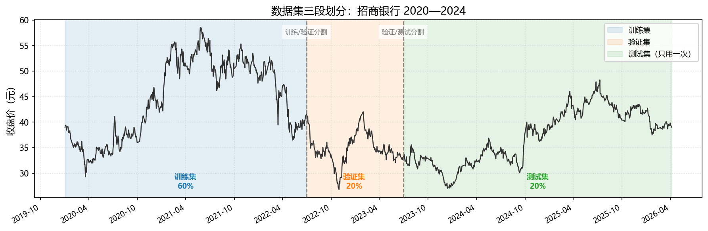
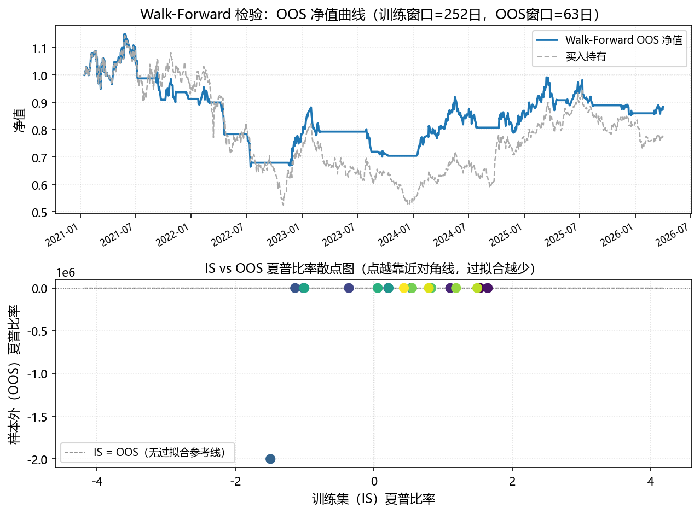
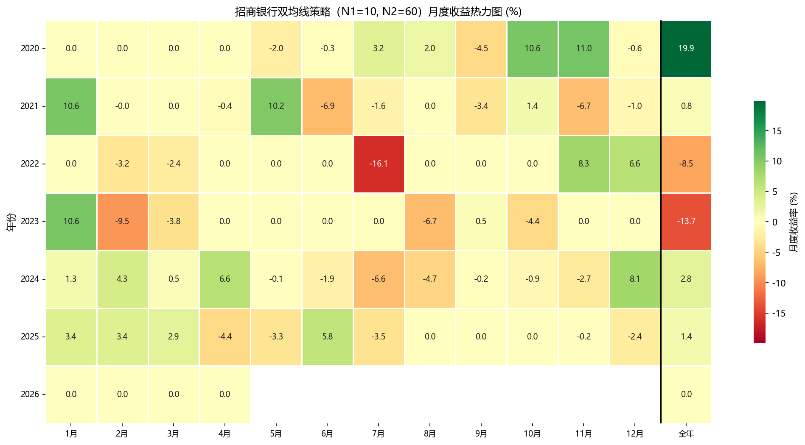
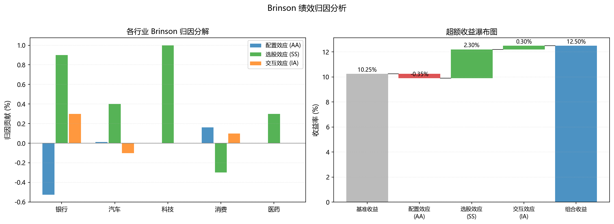
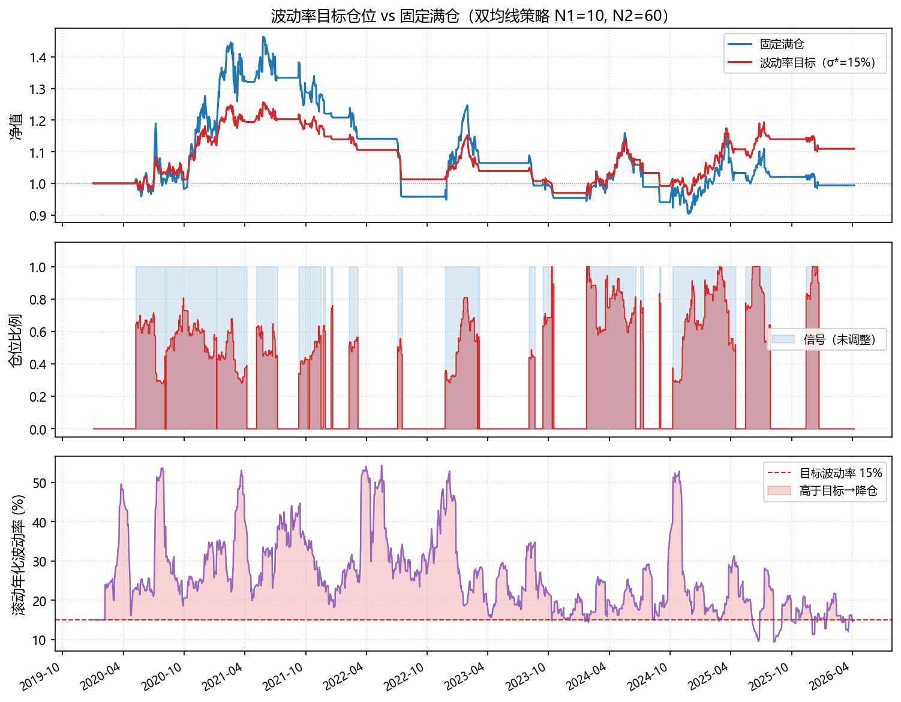
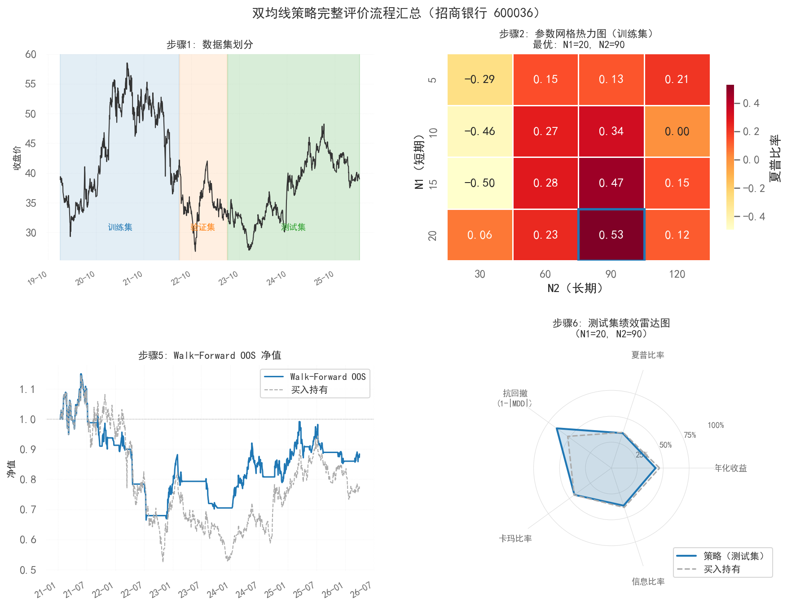

# 第三章　策略评价与风险管理

> **本章承接**：第二章教会了如何构建策略并运行回测。但「回测好看」和「策略有效」是两回事。本章的核心任务是建立一套**批判性评价框架**——识别回测中的虚假繁荣，从多个维度客观度量策略的真实质量，并用系统性的风险管理手段保护策略在实盘中的生存能力。

**学习目标**：完成本章后，你应能：

1. 正确划分训练集、验证集和测试集，理解 Walk-forward 检验的原理与必要性；
2. 综合运用收益、风险、风险调整收益、相对基准四类指标对策略进行全面评价；
3. 使用 Brinson 模型对组合超额收益进行归因，区分选股贡献与配置贡献；
4. 理解 Kelly 公式和波动率目标两种仓位管理方法，并能在回测中实现动态止损；
5. 使用 quantstats 生成并读懂策略的完整「体检报告」。

---

## 3.1　回测方法论：从样本内到样本外

### 3.1.1　为什么漂亮的回测不可信？

加入你使用 2020-2024 年的数据，反复调整双均线的短期窗口（5、10、15、20）和长期窗口（30、60、90、120），共 16 个参数组合，以便找出夏普比率最高的那组。那么，你几乎必然能找到一组参数，使回测夏普比率超过 2.0。

但这个结果有意义吗？几乎没有。原因很简单：**你在用历史数据选参数**。那 16 个组合中，只有一个在这段历史上「碰巧」最优——它适配的是已经发生的历史，而不是未来会发生的市场。这就是**过拟合**（overfitting），也叫「曲线拟合」或「数据窥探偏差」（data snooping bias）。

过拟合的本质：模型的复杂度超过了数据所能支持的范围，导致模型「记住」了历史噪声而非真实规律。对于量化策略来说，参数越多、调参次数越多，过拟合的风险就越高。

**判断是否过拟合的核心准则**：策略的绩效必须在**从未被用于参数选择的数据**上加以验证。

### 3.1.2　数据集的三段划分

标准的机器学习实践将数据分为三段，量化回测同样遵循这一逻辑：

$$
\underbrace{\text{全部历史数据}}_{\text{总样本}} = \underbrace{\text{训练集}}_{\substack{\text{策略逻辑设计} \\ \text{参数初步选择}}} + \underbrace{\text{验证集}}_{\substack{\text{参数微调} \\ \text{策略筛选}}} + \underbrace{\text{测试集}}_{\substack{\text{最终评价} \\ \text{只用一次！}}}
$$

**训练集**（In-Sample，IS）：用于设计策略逻辑、计算因子、选择大致参数范围。可以反复使用。

**验证集**（Validation Set）：用于在若干候选参数组合中进行选择。每次修改策略逻辑后重新验证，但使用次数应尽量少。

**测试集**（Out-of-Sample，OOS）：**只能使用一次**——在策略完全确定（不再修改任何参数）后，在测试集上运行一次，其结果才是对策略真实有效性的可信评价。一旦你根据测试集结果修改了策略，它就变成了新的验证集，必须再找新的测试集。

常见的划分比例：60%—70% 训练，15%—20% 验证，15%—20% 测试。对于时间序列数据，**三段必须按时间顺序排列**（训练集最早，测试集最近），绝对不能随机打乱——否则就引入了未来函数。

下图展示了一个具体的时间轴划分示例：



::: {.callout-note}
### 「只用一次」的测试集是有价值的承诺

在学术研究和机构量化实践中，测试集（样本外数据）的神圣性是策略评价诚信的基础。如果你反复用测试集调参，相当于把它变成了验证集，而你实际上对策略在真正未来数据上的表现一无所知。

一个实用建议：在开始回测之前，**先确定测试集的时间范围并「锁定」它**（写下来，不看那段数据），直到策略完全确定后才解锁查看结果。这个自我约束在实践中非常有价值。
:::

### 3.1.3　Walk-Forward 检验

固定的三段划分有一个局限：测试集只有一段，如果那段时间恰好是特殊市场环境（如 2020 年极端疫情冲击），结论可能失真。

**Walk-Forward 检验**（滚动样本外检验）提供了更稳健的解决方案：将参数优化和样本外测试的过程在时间轴上**滚动执行**多次，每次只向前滑动一段窗口。

具体步骤：

1. 用第 1—$T_1$ 段数据训练，在第 $T_1$—$T_2$ 段评价（第一个 OOS 窗口）；
2. 滑动窗口：用第 2—$T_1+1$ 段数据训练，在第 $T_1+1$—$T_2+1$ 段评价；
3. 重复上述过程，直到覆盖全部历史数据；
4. 将所有 OOS 窗口的绩效拼接成一条完整的「样本外净值曲线」。

这条拼接出的净值曲线，每一段都是真正的样本外结果，因此比单一的固定测试集更具代表性，也能反映策略在不同市场环境下的稳定性。

下图展示了 Walk-Forward 检验的滚动窗口示意：



::: {.callout-tip}
### 提示词：实现 Walk-Forward 检验框架

```
请帮我用 Python 实现双均线策略的 Walk-Forward 检验。

数据：招商银行（600036）2020—2024 年日线收盘价，
路径：data/stock/stock_600036.csv。

参数设置：
- 训练窗口：[252] 个交易日（约1年）
- 样本外窗口：[63] 个交易日（约3个月）
- 候选参数网格：
  N1（短期均线）：[5, 10, 15, 20]
  N2（长期均线）：[30, 60, 90, 120]

Walk-Forward 流程：
1. 在每个训练窗口内，对所有参数组合运行回测，
   选择夏普比率最高的参数组合；
2. 用该参数组合在紧随其后的样本外窗口运行策略，记录净值；
3. 滚动向前，重复上述过程；
4. 将所有样本外窗口的净值拼接为完整的 OOS 净值曲线。

输出要求：
1. 打印每次滚动的最优参数和训练集夏普 vs 样本外夏普，
   观察两者是否一致（不一致说明过拟合）；
2. 绘图，保存为 ./figs/fig_eval_02_walkforward.png：
   - 子图1：Walk-Forward OOS 净值曲线 vs 买入持有；
   - 子图2：每次滚动选出的最优 N1、N2 参数变化（散点图），
     观察参数是否稳定；
3. 计算并打印 OOS 净值曲线的完整绩效指标。

请使用 pandas、numpy、matplotlib，代码加注释。
```
:::

### 3.1.4　过拟合的识别与防范

以下几个信号强烈提示策略存在过拟合：

**信号一：IS 绩效远优于 OOS 绩效**

如果训练集夏普比率为 2.5，但样本外夏普比率只有 0.3，说明策略在历史数据上过度拟合了噪声。合理的比例是 OOS 绩效约为 IS 绩效的 50%—70%，下降过多则需要警惕。

**信号二：参数在 Walk-Forward 中剧烈变动**

如果每次滚动选出的最优参数都不一样（一次选 N1=5、N2=30，下次选 N1=20、N2=120），说明策略对参数极度敏感，没有一个稳健的「最优区域」。真正有效的策略，其最优参数应该在某个范围内相对稳定。

**信号三：策略逻辑有太多特殊规则**

每多加一个「在某种特定情况下的特殊处理」，都相当于增加了一个参数，过拟合风险随之上升。如果你需要 20 个 `if` 语句才能让策略「好看」，这不是一个好策略，而是一段过拟合的历史记录。

**信号四：手续费敏感性极高**

好的策略在合理手续费范围内（0.1%—0.3%）绩效应该相对稳定。如果将手续费从 0.1% 提高到 0.2% 就导致策略从盈利变为亏损，说明策略依赖极高频率的微小收益，实际执行中几乎不可能盈利。

::: {.callout-note}
### 多重比较问题（Multiple Comparisons Problem）

如果你测试了 100 个策略参数组合，即使所有策略都完全无效（纯随机），仅凭统计规律，也大约有 5 个会在 95% 置信水平上通过显著性检验。这就是多重比较问题。

Bonferroni 修正提供了一个简单的应对方法：如果你测试了 $M$ 个假设，将显著性阈值从 $\alpha$ 调整为 $\alpha / M$。例如测试了 100 个参数组合，单个组合需要在 $p < 0.0005$（而非 $p < 0.05$）水平上显著，才值得认真对待。

更实用的做法是：策略选择主要依赖经济逻辑而非统计显著性——先问「为什么这个策略应该有效」，再用数据验证，而不是在大量参数中「挖掘」最好看的那个。
:::

---

## 3.2　绩效评价指标体系

第一章已经介绍了基础风险指标（夏普比率、最大回撤、VaR 等）。本节在此基础上，将评价指标组织成一个**系统性框架**，并补充实践中重要的相对基准指标。

### 3.2.1　四个评价维度

完整的策略评价需要覆盖四个维度，缺一不可：

**维度一：绝对收益**

| 指标 | 公式 | 说明 |
|------|------|------|
| 年化收益率（CAGR） | $(V_T/V_0)^{252/T} - 1$ | 以复利方式表达的年均增长率 |
| 区间总收益率 | $V_T/V_0 - 1$ | 整个回测期间的累计收益 |
| 月度收益率分布 | 各月收益率的均值/中位数/标准差 | 收益的时间一致性 |

**维度二：风险**

| 指标 | 说明 |
|------|------|
| 年化波动率 | $\sigma \times \sqrt{252}$，衡量总体波动幅度 |
| 最大回撤（MDD） | 从峰值到谷值的最大跌幅，衡量极端亏损体验 |
| 回撤持续时间 | 从峰值开始到完全恢复所需的时间 |
| 月度负收益频率 | 亏损月份占总月份的比例，反映策略的「舒适度」 |
| CVaR（95%） | 极端亏损场景下的平均损失 |

**维度三：风险调整收益**

| 指标 | 公式 | 说明 |
|------|------|------|
| 夏普比率 | $(R_p - R_f)/\sigma_p$ | 每单位总风险的超额收益 |
| 索提诺比率 | $(R_p - R_f)/\sigma_{\text{downside}}$ | 每单位下行风险的超额收益 |
| 卡玛比率（Calmar） | $R_p / |\text{MDD}|$ | 年化收益与最大回撤之比，直觉性强 |
| 欧米伽比率（Omega） | $\int_\tau^\infty [1-F(r)]dr \Big/ \int_{-\infty}^\tau F(r)dr$ | 高于阈值 $\tau$ 的收益概率加权之比 |

::: {.callout-note}
### 卡玛比率的直觉

卡玛比率 = 年化收益率 / 最大回撤（绝对值）。如果年化收益 15%，最大回撤 30%，则卡玛比率 = 0.5。对于管理客户资金的基金经理，最大回撤是客户投诉和赎回的直接触发因素——因此卡玛比率比夏普比率更贴近实际管理压力。经验上，卡玛比率 > 0.5 的策略在实践中是可接受的，> 1.0 是优秀的。
:::

**维度四：相对基准**

| 指标 | 公式 | 说明 |
|------|------|------|
| 超额收益（Alpha） | $R_p - R_b$（$R_b$ 为基准收益） | 相对基准的绝对超额 |
| 信息比率（IR） | $\overline{R_p - R_b} \,/\, \sigma_{R_p - R_b}$ | 单位主动风险的超额收益，类似主动管理版夏普比率 |
| 跟踪误差（TE） | $\sigma_{R_p - R_b}$ | 策略收益率与基准收益率之差的标准差，衡量偏离基准的程度 |
| 上下行捕获率 | 牛市/熊市中策略相对基准的涨跌幅比值 | 分析策略在不同市场环境下的行为 |
| 贝塔（$\beta$） | $\text{Cov}(R_p, R_b)/\text{Var}(R_b)$ | 相对基准的系统性风险敞口 |

**信息比率**（IR）在专业机构中的地位类似于夏普比率在个人投资者中的地位——它是基金经理「创造 Alpha 的能力」的核心度量指标。IR > 0.5 是机构认可的合格水准，IR > 1.0 是优秀的主动管理者。

### 3.2.2　月度收益热力图：直觉性展示

除了汇总指标，将策略按年份和月份展示的**月度收益热力图**是最直观的绩效呈现工具——哪些年份的哪些月份表现好、哪些时期持续亏损，一眼可见。

下图展示了三支股票双均线策略的月度收益热力图：



::: {.callout-tip}
### 提示词：生成完整绩效指标表与月度热力图

```
请帮我用 Python 计算策略的完整绩效指标并绘制月度收益热力图。

数据：传入一条净值序列（pandas Series，日期索引），
或者从 data/stock/stock_600036.csv 的收盘价出发，
先用 10/60 日双均线策略生成净值序列。
同时需要沪深300指数（data/stock/index_000300.csv）作为基准。

任务1：计算以下全部指标，汇总打印：
- 绝对收益：年化 CAGR、区间总收益、月度收益均值和标准差；
- 风险：年化波动率、最大回撤、最大回撤持续天数、负收益月份占比、
  日 CVaR（95%）；
- 风险调整：夏普比率、索提诺比率、卡玛比率；
- 相对基准（沪深300）：年化超额收益、信息比率、跟踪误差、Beta、
  上行捕获率、下行捕获率。

任务2：绘图，保存为 ./figs/fig_eval_03_monthly_heatmap.png：
- 将策略净值转为月度收益率，
  以年份为行、月份（1—12）为列，绘制热力图；
- 颜色编码：正收益绿色，负收益红色，色阶对称于零点；
- 每个格子内标注月度收益率数值（如 3.2%）；
- 最右侧额外一列显示该年全年收益率。

请使用 pandas、numpy、seaborn/matplotlib。
```
:::

---

## 3.3　绩效归因分析

### 3.3.1　归因的目的：知道收益从哪里来

假设策略今年跑赢沪深300指数 8%，这 8% 的超额收益从哪里来？是因为你选对了行业（重仓了今年表现好的行业）？还是在行业内选对了个股？还是仅仅因为你持有了更多的市场风险（高 Beta）？

弄清楚超额收益的来源，不仅是对自己策略的诚实评价，也直接指向改进方向：如果超额收益完全来自高 Beta，那么它不值得为此支付主动管理费——买指数 ETF 加杠杆效果一样，还省了手续费。

### 3.3.2　Brinson 归因模型

**Brinson 模型**（Brinson、Hood 和 Beebower，1986）是机构资产管理中最经典的绩效归因框架，将组合相对基准的超额收益分解为三个来源：

设组合在行业 $i$ 的权重为 $w_i^p$，基准在行业 $i$ 的权重为 $w_i^b$；组合行业 $i$ 内的收益率为 $r_i^p$，基准行业 $i$ 内的收益率为 $r_i^b$；基准总收益率为 $R^b = \sum_i w_i^b r_i^b$。

$$
\underbrace{R^p - R^b}_{\text{总超额收益}} = \underbrace{\sum_i (w_i^p - w_i^b) r_i^b}_{\text{配置效应（AA）}} + \underbrace{\sum_i w_i^b (r_i^p - r_i^b)}_{\text{选股效应（SS）}} + \underbrace{\sum_i (w_i^p - w_i^b)(r_i^p - r_i^b)}_{\text{交互效应（IA）}}
$$

**配置效应（Asset Allocation，AA）**：衡量行业权重偏离基准所贡献的超额收益。在某行业超配（$w_i^p > w_i^b$），且该行业收益高于基准均值（$r_i^b > R^b$）时，配置效应为正。这反映了「押对了赛道」的贡献。

**选股效应（Stock Selection，SS）**：衡量在各行业内部选股优于基准的贡献。在某行业内，组合持有的个股收益高于该行业基准收益（$r_i^p > r_i^b$）时，选股效应为正。这反映了「在赛道内选对了马」的贡献。

**交互效应（Interaction，IA）**：同时超配且选股优秀时产生的协同效应，在实践中通常并入选股效应或单独报告。

下图展示了 Brinson 归因在三行业组合上的数值示例：



::: {.callout-tip}
### 提示词：计算 Brinson 归因并绘制瀑布图

```
请帮我用 Python 实现 Brinson 绩效归因分析。

数据：使用以下模拟数据（可替换为真实数据）：
- 三个行业：银行（权重组合40%/基准30%，组合收益8%/基准收益5%），
  科技（权重组合35%/基准40%，组合收益15%/基准收益12%），
  消费（权重组合25%/基准30%，组合收益3%/基准收益4%）；
- 如果有真实数据，格式为：DataFrame，列名为
  [行业, 组合权重, 基准权重, 组合收益率, 基准收益率]。

任务：
1. 计算各行业的配置效应（AA）、选股效应（SS）、交互效应（IA）；
2. 计算组合总收益、基准总收益、总超额收益，
   验证：总超额 = ΣAA + ΣSS + ΣIA；
3. 打印归因汇总表格（行=行业，列=AA/SS/IA/合计）；
4. 绘图，保存为 ./figs/fig_eval_04_brinson.png：
   - 左图：各行业 AA/SS/IA 的分组柱状图；
   - 右图：瀑布图，展示从基准收益到组合收益的各归因贡献；
5. 代码加注释，解释 Brinson 模型中每个效应的经济含义。

请使用 pandas、numpy、matplotlib。
```
:::

### 3.3.3　因子归因：Alpha 从哪里来

Brinson 模型回答「配置 vs 选股」的问题，**因子归因**进一步回答：组合的超额收益，有多少是已知风险因子（市场、规模、价值、动量等）的暴露带来的，有多少是真正的「纯 Alpha」？

用多因子回归实现因子归因：

$$
R_{p,t} - R_{f,t} = \alpha + \beta_{\text{MKT}} \cdot \text{MKT}_t + \beta_{\text{SMB}} \cdot \text{SMB}_t + \beta_{\text{HML}} \cdot \text{HML}_t + \beta_{\text{MOM}} \cdot \text{MOM}_t + \varepsilon_t
$$

其中：

- $\alpha$（截距）：无法被已知因子解释的超额收益，即「纯 Alpha」；
- $\beta_{\text{MKT}}$：市场风险敞口（若 $>1$，策略在牛市受益，熊市受损）；
- $\beta_{\text{SMB}}$：规模因子敞口（正值说明偏向小市值股票）；
- $\beta_{\text{HML}}$：价值因子敞口（正值说明偏向低估值股票）；
- $\beta_{\text{MOM}}$：动量因子敞口。

**归因的实际意义**：如果策略的「超额收益」全部由 $\beta_{\text{MKT}} > 1$ 解释，说明策略本质上是在加杠杆持有市场——这不是真正的 Alpha，用 ETF 加杠杆可以完全复制，不值得为此付出额外的交易成本。只有在控制了所有已知因子暴露后，剩余的 $\alpha$ 才代表策略真正的超额能力。

::: {.callout-tip}
### 提示词：多因子归因回归

```
请帮我用 Python 对策略进行多因子归因分析。

数据：
- 策略日度收益率序列（从净值序列计算）；
- 沪深300作为市场因子代理（data/stock/index_000300.csv）；
- 无风险利率：年化 2%（折算日度）；
- 规模因子 SMB、价值因子 HML：
  可从 CSMAR 或其他来源获取，若无，
  请用以下简化方法构建代理变量：
  SMB = 中证1000日收益率 - 沪深300日收益率（小市值 - 大市值）；
  HML = [可说明该字段缺失，先用两因子模型演示]。

任务：
1. 至少运行两个模型：
   单因子 CAPM（只有市场因子）和
   三因子（市场 + SMB + 你能获取的第三个因子）；
2. 用 statsmodels OLS 回归，打印完整结果
   （系数、t 值、p 值、R²、调整 R²）；
3. 计算因子暴露对收益的贡献：
   各 β × 因子年化均值 = 该因子贡献的年化收益；
4. 打印归因汇总表：
   [因子名称 | β | t值 | 年化因子收益 | 对组合的贡献]；
5. 绘制残差 α 的时序图，保存为 ./figs/fig_eval_05_factor_attr.png：
   - 策略累计收益 vs 因子解释部分的累计收益 vs 纯 Alpha 累计；
6. 代码加注释，解释 Alpha 分解的经济含义。
```
:::

---

## 3.4　风险管理：仓位与止损

### 3.4.1　仓位管理的核心问题

第二章将持仓规模作为策略框架的四模块之一简要介绍，本节深入展开。仓位管理回答的问题是：**给定一个交易信号，应该用多大比例的资金参与？**

这个问题比选股和择时更容易被忽视，但对策略的长期生存至关重要。即使一个信号的期望收益为正，错误的仓位管理也能导致破产：仓位太小，即使信号有效，收益也微乎其微；仓位太大，几次连续亏损就能让账户元气大伤，甚至清零。

### 3.4.2　Kelly 公式

**Kelly 公式**由信息论学家 Kelly（1956）提出，给出了在已知胜率和盈亏比的情况下，使**长期资产增长率最大化**的理论最优仓位：

$$
f^* = \frac{p \cdot b - q}{b} = \frac{p(b+1) - 1}{b}
$$

其中：

- $p$：单次交易获利的概率（胜率）；
- $q = 1 - p$：单次交易亏损的概率；
- $b$：盈亏比（平均盈利金额 / 平均亏损金额）；
- $f^*$：应投入的资金比例（0—1之间）。

**数值示例**：若策略历史胜率 $p = 0.55$，盈亏比 $b = 1.5$（平均每次盈利 1.5 元，亏损 1 元），则：

$$
f^* = \frac{0.55 \times 1.5 - 0.45}{1.5} = \frac{0.825 - 0.45}{1.5} = 0.25
$$

Kelly 公式建议仓位为 25%。

**半 Kelly 的实践**：全 Kelly 仓位在实践中过于激进——它最大化长期期望增长率，但会导致极大的短期波动，心理上难以承受。实际操作中通常使用**半 Kelly**（$f = f^*/2$），牺牲一部分长期收益以换取显著降低的波动率，投资者更容易坚持执行。

::: {.callout-note}
### Kelly 公式的局限性

Kelly 公式要求精确的胜率和盈亏比输入——但这两个参数本身都是从历史数据估计的，存在误差。胜率估计偏高或盈亏比估计偏高，都会导致 Kelly 公式建议的仓位被高估，实际承担了超出预期的风险。

此外，Kelly 公式假设每次交易相互独立，但股票市场的收益率存在序列相关性（趋势/反转），违背了这一假设。在实践中，Kelly 公式更适合作为仓位的「上限参考」，而非严格执行的规则。
:::

### 3.4.3　波动率目标仓位

**波动率目标**（volatility targeting）是机构投资者广泛使用的仓位管理框架：设定组合的目标年化波动率 $\sigma^*$，动态调整仓位使组合的实际波动率始终维持在目标附近。

$$
f_t = \frac{\sigma^*}{\hat{\sigma}_t}
$$

其中 $\hat{\sigma}_t$ 是在时刻 $t$ 对资产波动率的实时估计（通常用过去 20—60 日的滚动标准差年化），$f_t$ 是对应的仓位比例（通常设上限为 1，不加杠杆）。

**机制**：当市场波动率上升（如急跌期间），$\hat{\sigma}_t$ 增大，$f_t$ 自动降低——相当于「市场越危险，仓位越轻」；当市场平静，$\hat{\sigma}_t$ 降低，$f_t$ 上升至满仓。这产生了一种**自动的逆向风险管理**，不需要人为判断「现在是否应该降仓」。

下图展示了波动率目标仓位在三支股票上的动态变化：



::: {.callout-tip}
### 提示词：实现波动率目标仓位并与固定仓位对比

```
请帮我用 Python 实现波动率目标仓位策略，并与固定满仓对比。

数据：使用招商银行（600036）2020—2024 年日线收盘价。

策略说明：
- 基础策略：10/60 日双均线，金叉时持有，死叉时空仓；
- 版本1：固定满仓（信号为1时全仓买入）；
- 版本2：波动率目标仓位，目标年化波动率 σ* = [15%]；
  仓位 f_t = min(σ* / σ̂_t, 1.0)，其中 σ̂_t 为过去 20 日
  年化标准差（ × √252）；
  信号为 0（空仓）时，f_t = 0，不受波动率调整影响。

输出要求：
1. 分别计算两个版本的日度组合收益率：
   版本1：signal × 资产日收益率
   版本2：signal × f_t × 资产日收益率
2. 绘图，保存为 ./figs/fig_eval_06_vol_target.png：
   - 子图1：两版本净值曲线对比；
   - 子图2：波动率目标版本的动态仓位 f_t 随时间变化（填充区域）；
   - 子图3：滚动20日年化波动率 σ̂_t（用于理解仓位变化原因）；
3. 打印两版本的绩效对比表格（年化收益、波动率、夏普、最大回撤）；
4. 注释说明波动率目标仓位降低回撤的机制。
```
:::

### 3.4.4　止损规则的设计

止损（stop-loss）是在亏损达到预设阈值时强制平仓，防止小亏损滚雪球成大亏损的风险控制机制。止损规则的设计需要平衡两个矛盾的需求：

- **止损太严**（阈值太小）：噪声交易被频繁止损，手续费增加，也可能在价格短暂回撤后很快回升时被迫出局；
- **止损太松**（阈值太大）：保护作用有限，真正的趋势性下跌无法及时阻断。

常见的止损类型：

**固定百分比止损**：从建仓价格下跌超过 $X\%$ 时止损。简单直接，但对所有波动率水平的股票一视同仁（高波动股票和低波动股票适合的止损幅度不同）。

**波动率自适应止损**（ATR 止损）：止损幅度 = $k \times \text{ATR}(N)$，其中 ATR（Average True Range，平均真实波幅）是衡量近期价格波动幅度的指标。这种方法为高波动股票设置更宽的止损，为低波动股票设置更窄的止损，更合理。

$$
\text{ATR}(N)_t = \frac{1}{N}\sum_{i=0}^{N-1} \text{TR}_{t-i}
$$

$$
\text{TR}_t = \max(H_t - L_t,\ |H_t - C_{t-1}|,\ |L_t - C_{t-1}|)
$$

其中 $H_t$、$L_t$、$C_t$ 分别为当日最高价、最低价、收盘价。

**追踪止损**（Trailing Stop-Loss）：止损价格随价格上涨而上移，锁定已有盈利。例如「从最高点回撤超过 15% 时止损」。这种方法在趋势策略中非常实用——让利润奔跑，但在趋势反转时自动退出。

::: {.callout-tip}
### 提示词：在回测中加入追踪止损

```
请帮我在已有的双均线策略回测中加入追踪止损规则。

数据：招商银行（600036）收盘价。

当前策略：10/60 日双均线，金叉买入，死叉卖出。

追踪止损逻辑（叠加在均线信号之上）：
- 持仓期间，追踪记录「持仓后的最高价格」；
- 若当前价格相对最高价回落超过 [trail_pct=10%]，触发止损平仓；
- 止损平仓后，重新等待下一个金叉信号才能买入；
- 止损优先于均线信号（即：即使均线仍然多头，触发止损也平仓）。

输出要求：
1. 实现上述追踪止损逻辑（事件驱动循环或向量化均可）；
2. 对比三个版本：
   - 版本A：原始均线策略（无止损）；
   - 版本B：均线策略 + 追踪止损（trail_pct=10%）；
   - 版本C：均线策略 + 追踪止损（trail_pct=15%）；
3. 打印三个版本的绩效对比表格；
4. 绘图，保存为 ./figs/fig_eval_07_trailing_stop.png：
   - 价格走势 + 持仓区间（不同颜色区分三个版本的止损触发点）；
5. 注释中分析追踪止损对最大回撤和年化收益的权衡关系。

参数 trail_pct 用变量定义在代码顶部，便于修改探索。
```
:::

### 3.4.5　组合层面的风控

前述止损均针对单只股票。当策略持有多只股票时，还需要在**组合层面**设置风控规则：

**最大单只持仓上限**：单只股票的仓位不超过总资金的一定比例（如 10%—20%），防止某只股票的黑天鹅事件造成过大损失。

**最大整体回撤触发**：当组合净值相对历史最高点的回撤超过某阈值（如 15%）时，整体降仓至 50% 或完全清仓，等待市场企稳后再逐步恢复。这种「熔断机制」能在系统性风险释放时保护本金。

**行业/因子暴露限制**：防止单一行业或因子的过度集中（如银行股占比不超过 40%，Beta 不超过 1.2）。这在多因子组合中尤为重要，防止「看似分散化实则高度集中」的风险。

---

## 3.5　自动化报告：quantstats

### 3.5.1　工具介绍

`quantstats` 是一个专门为量化策略分析设计的 Python 库，能够一键生成涵盖本章所有绩效指标的完整 HTML 报告，内容包括：净值走势、月度热力图、滚动指标、回撤分析、风险分布等数十张图表。

安装方式：`pip install quantstats`

核心用法极为简洁：

```python
import quantstats as qs

# 将净值序列转为收益率序列
returns = qs.utils.to_returns(nav_series)

# 生成完整 HTML 报告
qs.reports.html(returns, benchmark='SPY',  # benchmark 可替换为沪深300
                output='strategy_report.html',
                title='双均线策略评估报告')

# 或者直接打印关键指标
qs.reports.metrics(returns, mode='full')
```

### 3.5.2　报告的核心模块解读

quantstats 报告主要包含以下模块，理解每个模块的含义比生成报告更重要：

**模块一：绩效概览**

报告顶部的汇总表，包含本章介绍的所有指标（夏普、索提诺、卡玛、最大回撤等）。重点关注：策略的所有指标是否**均优于基准**？还是只在某个维度上超出？单一指标优秀但其他指标很差的策略，通常有隐患。

**模块二：月度收益热力图**

与 §3.2 介绍的相同。关注是否存在连续亏损的月份，以及亏损是否集中在特定市场环境（如 2022 年全年熊市）中。

**模块三：滚动指标**

滚动夏普比率、滚动波动率的时序图。一个好的策略，其滚动夏普比率应该相对稳定，不应出现长期为负的区间。如果滚动夏普只在 2020—2021 牛市中表现好，其余时间均为负，这个策略不值得部署。

**模块四：回撤深度表**

列出历史上最大的 5—10 次回撤，包括每次回撤的峰值日期、谷值日期、幅度和恢复天数。关注两点：最大单次回撤是否在可接受范围内？以及恢复时间是否过长（超过 1 年的恢复期对投资者心理压力极大）。

**模块五：收益率分布**

收益率的直方图和 Q-Q 图，展示是否存在尖峰肥尾（超额峰度为正）和负偏度（亏损尾部更重）。这直接影响 VaR 和 CVaR 的准确性——若分布偏离正态，基于正态假设的风险度量会低估真实风险。

::: {.callout-tip}
### 提示词：生成 quantstats 完整策略报告

```
请帮我用 Python 生成双均线策略的 quantstats 完整评估报告。

数据：招商银行（600036）双均线策略（N1=10, N2=60）的日度净值序列，
从 data/stock/stock_600036.csv 出发构建。
基准：沪深300指数，从 data/stock/index_000300.csv 读取。

任务：
1. 生成策略日度收益率序列和基准日度收益率序列；
2. 使用 quantstats 完成以下操作：
   a. 打印完整绩效指标表（qs.reports.metrics）；
   b. 生成 HTML 报告，保存为 ./strategy_report.html，
      标题设为「招商银行双均线策略评估报告」；
   c. 单独绘制并保存以下图表到 ./figs/：
      - 滚动夏普比率图（qs.plots.rolling_sharpe）→ fig_eval_08_rolling_sharpe.png；
      - 月度收益热力图（qs.plots.monthly_heatmap）→ fig_eval_03_monthly_heatmap.png；
      - 回撤深度图（qs.plots.drawdowns_periods）→ fig_eval_09_drawdowns.png；
3. 打印 Top 5 最大回撤的明细（起止日期、幅度、恢复天数）；
4. 代码中加注释，说明每个 quantstats 函数的含义。

注：quantstats 的 benchmark 参数可以接受 pandas Series，
直接传入沪深300收益率即可，不需要 ticker 字符串。
```
:::

::: {.callout-tip}
### 提示词：用 AI 解读策略评估报告

```
以下是我的量化策略（招商银行双均线策略，N1=10, N2=60，2020—2024年）
的绩效报告摘要：

[粘贴 quantstats 输出的指标表，或者手动填写关键数值，例如：]
年化收益率：12.3%
年化波动率：18.5%
最大回撤：-28.4%（2021-12-15 至 2022-10-31，持续318天）
夏普比率：0.56
卡玛比率：0.43
信息比率（vs沪深300）：0.21
Beta：0.62

请帮我：
1. 对这个策略做一个全面的「医生体检式」评价：
   - 它的优点是什么（哪些指标表现好）？
   - 它的主要风险和弱点是什么？
   - 与标准参考区间相比（夏普>1为良好，最大回撤<20%为可接受），
     这个策略处于什么水平？
2. 根据指标，推断策略可能在哪类市场环境中失效？
3. 提出 2—3 个具体的改进方向，每个方向说明改进的逻辑和预期效果。
4. 用一句话向非专业人士解释这个策略的风险收益特征。
```
:::

---

## 3.6　综合案例：第二章策略的完整评价

本节将第二章的双均线策略通过完整评价流程走一遍，演示从「回测结果」到「有据可查的策略评价报告」的全过程。运行配套代码 `03_evaluation_codes.ipynb` 的综合案例部分，将依次生成以下图表：

**步骤一：数据集划分**

将 2020—2024 年的数据按 6:2:2 比例划分为训练集（2020.01—2022.06）、验证集（2022.07—2023.06）、测试集（2023.07—2024.末）。

**步骤二：训练集参数优化**

在训练集上对 16 个参数组合（N1 = 5/10/15/20，N2 = 30/60/90/120）进行回测，选出夏普比率最高的参数组合。

**步骤三：验证集确认**

用选出的参数在验证集上验证，检查 IS 绩效与 OOS 绩效的差距是否合理。

**步骤四：测试集最终评价**

用最终确定的参数在测试集（此前从未使用）上运行，其结果才是对策略真实有效性的诚实度量。

**步骤五：Walk-Forward 检验**

在完整时间序列上运行 Walk-Forward 检验，生成拼接的样本外净值曲线。

**步骤六：全套绩效报告**

对测试集净值曲线计算全套绩效指标、Brinson 归因（简化版）、月度热力图，并用 quantstats 生成完整报告。

下图展示了完整评价流程的汇总结果：



::: {.callout-tip}
### 提示词：完整策略评价流程（综合案例）

```
请帮我用 Python 对双均线策略进行完整的、符合规范的策略评价。

数据：招商银行（600036）、沪深300指数，2020—2024年。

请按以下流程依次实现：

【第一步：数据划分】
将全样本按时间顺序划分为：
- 训练集：2020-01-01 至 2022-06-30（约60%）
- 验证集：2022-07-01 至 2023-06-30（约20%）
- 测试集：2023-07-01 至数据末尾（约20%）

【第二步：参数优化（仅在训练集）】
对以下参数网格遍历：N1 ∈ [5,10,15,20]，N2 ∈ [30,60,90,120]
选出训练集夏普比率最高的参数组合（N1*, N2*）。

【第三步：验证集确认】
用（N1*, N2*）在验证集上回测，
打印训练集夏普 vs 验证集夏普，判断过拟合程度。

【第四步：测试集最终评价（只运行一次）】
用（N1*, N2*）在测试集上回测，
计算并打印完整绩效指标表格（至少包含年化收益、波动率、最大回撤、
夏普、卡玛、信息比率）。

【第五步：Walk-Forward 检验】
训练窗口=252日，样本外窗口=63日，滚动执行 Walk-Forward，
拼接样本外净值曲线，打印完整绩效。

【第六步：汇总图表】
绘图，保存为 ./figs/fig_eval_10_full_evaluation.png：
- 子图1：训练/验证/测试集划分时间轴（色块标注三段）及全样本净值；
- 子图2：参数网格热力图（夏普比率，训练集），标注最优参数；
- 子图3：Walk-Forward OOS 净值 vs 买入持有；
- 子图4：测试集绩效雷达图（年化收益、夏普、1-MDD、卡玛四维度）；

请代码结构清晰，参数全部定义在顶部，注释详细。
```
:::

---

## 本章小结

本章建立了量化策略评价的完整方法论体系：

**关于回测方法论**：样本内/样本外的严格划分是策略评价诚信的基础，测试集只能使用一次。Walk-Forward 检验通过滚动执行提供了更稳健的样本外评价，同时能识别策略在不同市场环境中的稳定性。过拟合的典型信号包括 IS/OOS 绩效差异悬殊、参数变动剧烈、手续费敏感性过高。

**关于绩效评价**：四个维度（绝对收益、风险、风险调整收益、相对基准）构成完整的评价框架，任何单维度的优秀都不足以说明策略整体有效。信息比率是机构评价主动管理能力的核心指标。月度热力图是最直观的绩效展现工具。

**关于归因分析**：Brinson 模型将超额收益分解为配置效应和选股效应，回答「赚在哪里」的问题。多因子归因进一步剥离已知风险因子的贡献，真正的 Alpha 是控制因子暴露后的残余超额收益。

**关于风险管理**：Kelly 公式提供理论最优仓位的上限参考，实践中常用半 Kelly。波动率目标仓位通过动态调整实现「市场越危险仓位越轻」的自动风控。追踪止损在趋势策略中能有效保护盈利，但止损幅度的设定需要平衡噪声交易和真实风险。

**关于自动化报告**：quantstats 一键生成完整分析报告，节省大量手工计算时间；但读懂报告比生成报告更重要——理解每个指标的含义和合理参考区间，是评价策略质量的真正能力。

---

## 思考题

1. 某策略在 2015—2019 年的训练集上夏普比率为 2.1，但在 2020—2024 年的测试集上夏普比率仅为 0.4。请列举至少三种可能的解释（不全是过拟合），并说明如何区分这些情况。

2. 甲策略年化收益 20%、夏普 0.8、最大回撤 35%；乙策略年化收益 12%、夏普 1.2、最大回撤 15%。假设你是一名基金经理，需要向不同类型的客户推荐：哪类客户适合甲？哪类适合乙？判断的依据是什么？

3. 对你在第二章设计的某个策略进行 Brinson 归因分析（可以使用模拟数据）。假设超额收益的 80% 来自配置效应、20% 来自选股效应，这说明了什么？你会如何改进这个策略？

4. Kelly 公式建议当胜率为 0.55、盈亏比为 1.5 时，最优仓位为 25%。但若胜率的实际估计存在 ±5% 的误差（即真实胜率可能在 0.50—0.60 之间），最优仓位的范围是多少？这对实际应用有何启示？

5. （扩展）请选择第二章中任意一个你实现过回测的策略，按照本章介绍的完整评价流程（数据集划分 → 参数优化 → Walk-Forward → 归因 → quantstats 报告）走一遍，写出你的评价结论，并给出至少一个有金融逻辑支撑的改进方向。
