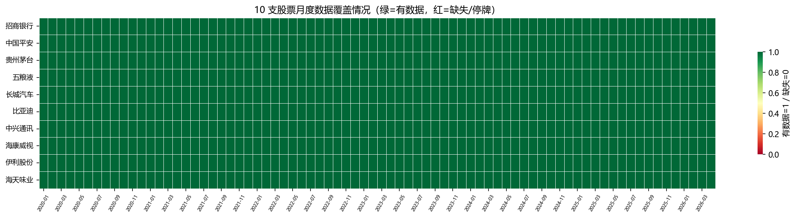
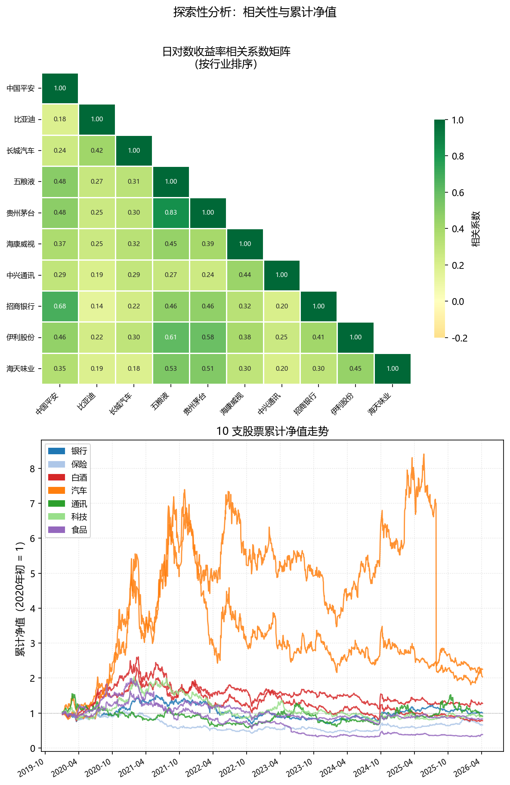
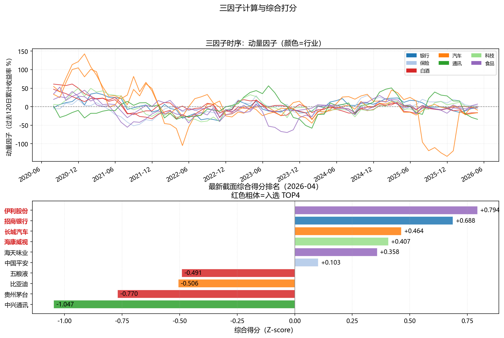
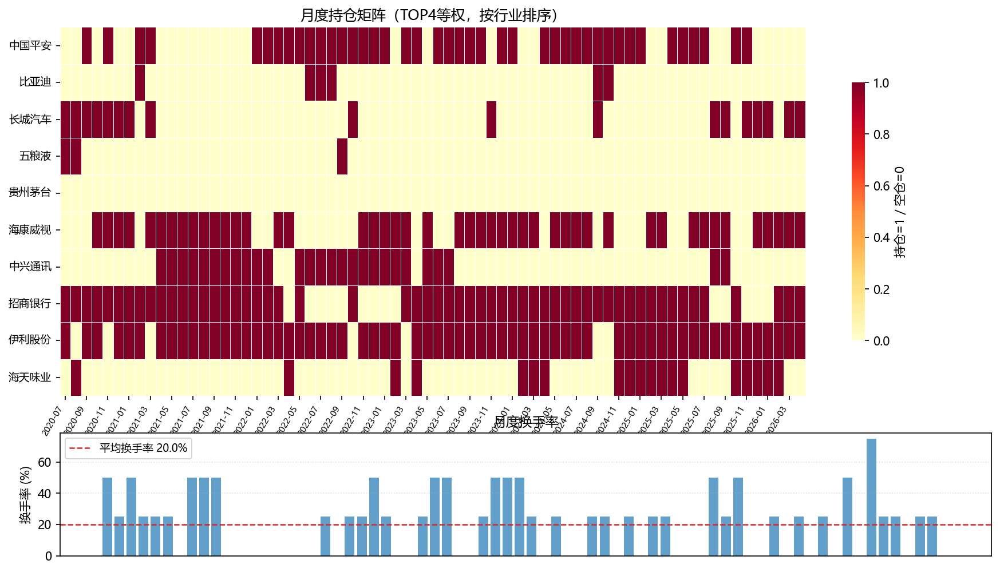
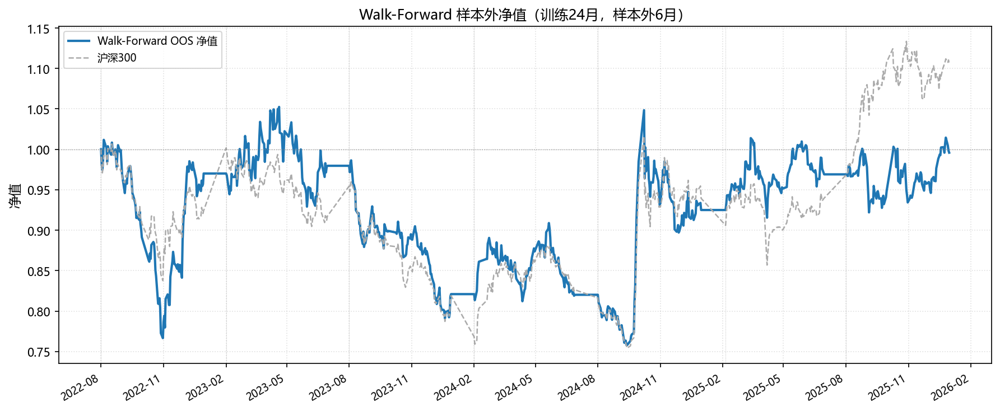
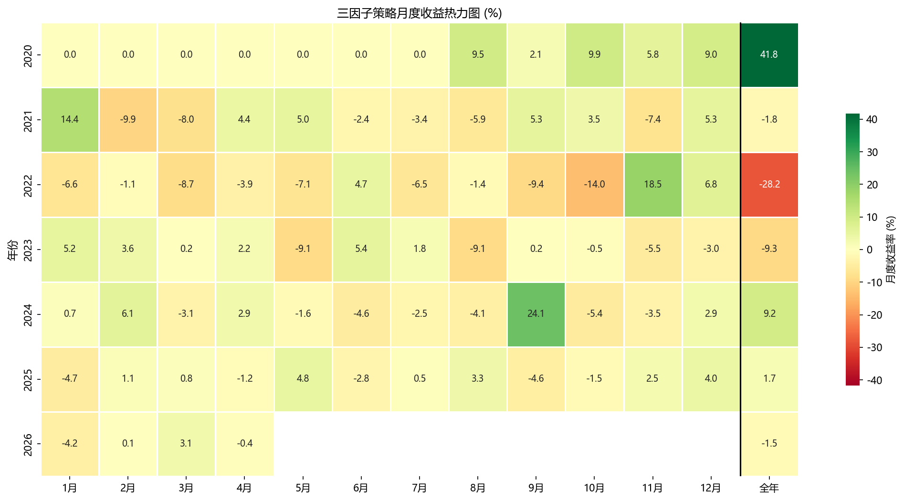
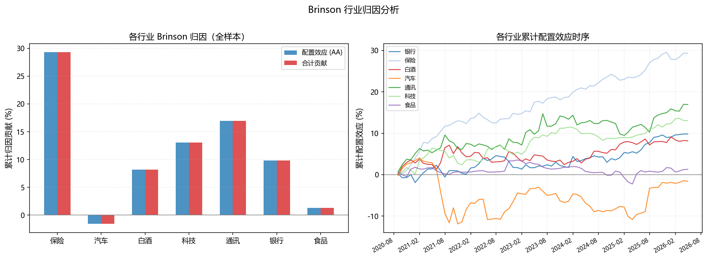
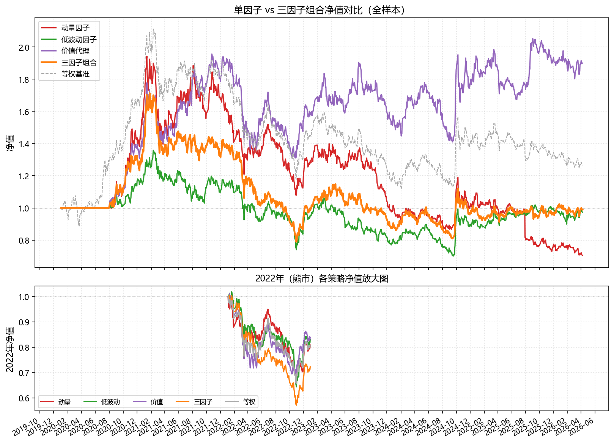

# 第四章　综合案例：A 股多因子选股策略

> **本章定位**：前三章分别建立了理论框架（第一章）、策略构建方法（第二章）和评价体系（第三章）。本章将这三层内容整合为一个**完整的、端到端的量化分析项目**，用 10 支覆盖五个行业的 A 股真实数据，从数据获取一直走到策略报告，演示一名分析师在实际工作中会经历的全部步骤。

> 阅读建议：本章每一节的末尾都有配套代码单元格，建议边读边运行 `04_case_codes.ipynb`，观察中间输出，形成对完整流程的直觉认知。

**本章学习目标**：

1. 能够独立完成从数据获取到策略报告的完整量化分析流程；
2. 理解多因子策略在真实数据上的构建细节与常见问题；
3. 能够用归因分析和 quantstats 报告向非技术人员解释策略；
4. 对量化策略在 A 股实践中的局限性形成批判性认识。

---

## 4.1　案例背景与数据准备

### 4.1.1　股票池设计

一个多因子选股策略的质量，很大程度上取决于股票池的设计。本案例使用 10 支 A 股，选取原则：

- **覆盖至少 5 个行业**，以便在因子计算中进行行业中性化，并观察行业间的因子差异；
- **每个行业不超过 2 支**，避免行业过度集中；
- **选流动性较好的标的**，减少真实交易中的冲击成本问题；
- **包含不同风格**：大盘蓝筹、中小盘成长、周期性行业均有涵盖。

本案例使用以下 10 支股票：

| 股票代码 | 股票名称 | 行业 | 风格特征 |
|---------|---------|------|---------|
| 600036  | 招商银行 | 银行 | 大盘蓝筹、高 ROE |
| 601318  | 中国平安 | 保险 | 大盘蓝筹、金融综合 |
| 600519  | 贵州茅台 | 白酒 | 大盘消费、高溢价 |
| 000858  | 五粮液   | 白酒 | 大盘消费、价值 |
| 601633  | 长城汽车 | 汽车 | 中盘、周期性 |
| 002594  | 比亚迪   | 汽车 | 成长、新能源 |
| 000063  | 中兴通讯 | 通讯 | 中盘、科技 |
| 002415  | 海康威视 | 科技 | 中盘、安防科技 |
| 600887  | 伊利股份 | 食品 | 大盘消费、防御性 |
| 603288  | 海天味业 | 食品 | 中盘消费、高毛利 |

这 10 支股票覆盖银行、保险、白酒、汽车、通讯/科技、食品六大行业，兼顾大盘蓝筹与中盘成长，是演示多因子策略的理想小型股票池。

::: {.callout-note}
### 为什么不用更多股票？

本案例刻意将股票池控制在 10 支，主要考虑两点：第一，baostock 免费数据无需 token 即可下载，10 支股票的数据量适合课堂环境；第二，小股票池让因子计算、信号生成和组合调仓的每一步都保持可观察、可解释，有助于建立直觉。

在实际工作中，机构量化团队的股票池通常是沪深 300、中证 500 或全 A 股（4000 支以上），因子有效性的统计稳健性会大幅提升，但基本流程与本案例完全相同。
:::

### 4.1.2　数据下载与质量检查

运行配套代码第 0 节，将自动下载所有 10 支股票 2020—2024 年的后复权日线数据，以及沪深 300 指数作为基准。

数据下载完成后，必须进行以下质量检查，任何一步出现异常都应在进入分析前处理：

**检查一：缺失值与停牌**

查看每支股票的数据完整性，识别停牌（成交量为 0）或数据缺失的日期。对于停牌期间，通常的处理方式是前向填充价格（`ffill`），但在计算收益率时要将停牌日的收益率置为 0（不产生盈亏）。

**检查二：公共交易日对齐**

不同股票的上市日期和停牌情况不同，需要取所有股票的**交集交易日**作为分析的时间轴，确保每个截面日期上所有股票均有数据。

**检查三：极端值识别**

个股有时因分红除权、数据错误或极端行情出现异常大的单日涨跌幅（如 ±50% 以上）。运行代码后，检查收益率序列的最大值和最小值，若有明显异常应标记处理。

下图展示了 10 支股票数据质量检查的汇总结果：



::: {.callout-tip}
### 提示词：批量下载 10 支股票数据并做质量检查

```
请帮我用 Python 批量下载以下 10 支 A 股的日线数据并进行质量检查。

股票列表（baostock 代码格式）：
stocks = {
    '600036': {'bs_code': 'sh.600036', 'name': '招商银行',  'industry': '银行'},
    '601318': {'bs_code': 'sh.601318', 'name': '中国平安',  'industry': '保险'},
    '600519': {'bs_code': 'sh.600519', 'name': '贵州茅台',  'industry': '白酒'},
    '000858': {'bs_code': 'sz.000858', 'name': '五粮液',    'industry': '白酒'},
    '601633': {'bs_code': 'sh.601633', 'name': '长城汽车',  'industry': '汽车'},
    '002594': {'bs_code': 'sz.002594', 'name': '比亚迪',    'industry': '汽车'},
    '000063': {'bs_code': 'sz.000063', 'name': '中兴通讯',  'industry': '通讯'},
    '002415': {'bs_code': 'sz.002415', 'name': '海康威视',  'industry': '科技'},
    '600887': {'bs_code': 'sh.600887', 'name': '伊利股份',  'industry': '食品'},
    '603288': {'bs_code': 'sh.603288', 'name': '海天味业',  'industry': '食品'},
}
时间范围：2020-01-01 至今，后复权，保存到 data/stock/stock_[代码].csv。

质量检查要求：
1. 打印每支股票的数据行数、起止日期、缺失值数量；
2. 计算日收益率，打印最大单日涨跌幅，标记超过 ±20% 的异常日期；
3. 计算公共交易日数量（所有股票均有数据的日期）；
4. 绘制数据覆盖热力图，保存为 ./figs/fig_case_01_data_quality.png：
   - 横轴月份，纵轴股票；
   - 绿色=有数据，灰色=缺失/停牌；
5. 将对齐后的收盘价矩阵（行=日期，列=股票名称）保存为
   data/price_matrix.csv，作为后续分析的主要数据源。
```
:::

### 4.1.3　探索性分析：相关性与收益概览

在进入策略构建之前，先对这 10 支股票做简单的探索性分析，建立对数据特征的直觉认识。

**收益率相关性矩阵**：观察哪些股票之间联动最强（同行业），哪些联动最弱（跨行业），为第一章分散化理论提供真实佐证。

**同行业股票的走势对比**：对比贵州茅台与五粮液、长城汽车与比亚迪、伊利股份与海天味业，观察同行业股票在宏观冲击下的联动与个体差异。

下图展示了 10 支股票的收益率相关性热力图与累计净值对比：



---

## 4.2　多因子选股策略：从因子到组合

### 4.2.1　策略设计思路

本案例构建一个**三因子等权打分**的月频调仓策略，三个因子分别代表三种不同的市场规律：

| 因子 | 类型 | 计算方法 | 预期方向 |
|------|------|---------|---------|
| 动量因子 | 趋势 | 过去 120 交易日累计对数收益率 | 高动量 → 高打分 |
| 低波动因子 | 风险 | 过去 60 交易日年化标准差（取负值） | 低波动 → 高打分 |
| 价值因子 | 估值 | 市净率 P/B 的行业排名（取负） | 低 P/B → 高打分 |

选择这三个因子的理由：
- 三者来自不同的市场逻辑（趋势惯性、风险异象、价值回归），相关性较低，组合效果好；
- 都可以从公开数据中计算，不依赖专有数据库；
- 都有成熟的学术文献支撑，具备「金融逻辑」而非纯数据挖掘。

**调仓规则**：在每个月末，计算所有股票的三因子综合得分，选取综合得分前 40%（即前 4 支）等权买入，持有至下个月末。

### 4.2.2　因子计算的完整流程

**第一步：计算原始因子值**

在每个月末截面日期 $t$，对股票 $i$ 计算：

$$
\text{Mom}_i(t) = \sum_{\tau=t-120}^{t-1} r_{i,\tau} \quad \text{（过去120日累计对数收益率）}
$$

$$
\text{Vol}_i(t) = -\sqrt{252} \cdot \text{std}(\{r_{i,\tau}\}_{\tau=t-60}^{t-1}) \quad \text{（取负，使低波动=高得分）}
$$

价值因子（P/B）使用简化处理：由于从 baostock 直接获取财务数据较繁琐，本案例使用**市值作为价值因子的代理变量**——在 A 股市场，市值与 P/B 高度相关（大盘股往往估值更合理），且市值可以从日线数据直接计算（总市值 ≈ 收盘价 × 流通股本）。实际工作中应替换为真实的 P/B 数据。

$$
\text{Val}_i(t) = -\text{rank}(\ln \text{MarketCap}_i(t)) \quad \text{（取负排名，使小市值=高得分）}
$$

**第二步：因子标准化**

对每个月末截面，对每个因子进行两步处理：

1. **去极值**（Winsorize）：将因子值裁剪到 [5th 分位数, 95th 分位数] 区间，防止极端值扭曲排名；
2. **Z-score 标准化**：$(f - \text{mean}) / \text{std}$，使不同因子的值域可比。

**第三步：等权合成**

$$
\text{Score}_i(t) = \frac{1}{3}\left(\tilde{\text{Mom}}_i(t) + \tilde{\text{Vol}}_i(t) + \tilde{\text{Val}}_i(t)\right)
$$

其中 $\tilde{\cdot}$ 表示标准化后的因子值。

**第四步：生成持仓**

每个月末，选取综合得分最高的前 $K$ 支股票（本案例 $K=4$），等权买入（每支 25% 仓位），持有至下个月末。

下图展示了各因子值在样本期间的截面分布与时序变化：



::: {.callout-tip}
### 提示词：计算三因子并生成月末截面打分表

```
请帮我用 Python 计算多因子选股策略的三个因子，并在每个月末生成综合打分表。

数据：读取 data/price_matrix.csv（行=日期，列=股票名称，值=收盘价）。

股票与行业对应关系：
industries = {
    '招商银行': '银行', '中国平安': '保险',
    '贵州茅台': '白酒', '五粮液': '白酒',
    '长城汽车': '汽车', '比亚迪': '汽车',
    '中兴通讯': '通讯', '海康威视': '科技',
    '伊利股份': '食品', '海天味业': '食品',
}

计算步骤：
1. 计算日对数收益率矩阵；
2. 在每个月末截面，计算三个因子：
   - 动量：过去 [120] 个交易日累计对数收益率；
   - 低波动：过去 [60] 个交易日年化标准差 × (-1)；
   - 价值代理：收盘价的负对数（价格越低打分越高，
     作为价值因子的简化代理，实际应用中请替换为 P/B）；
3. 对每个截面的每个因子进行去极值（Winsorize 5%/95%）和 Z-score 标准化；
4. 等权合成综合得分 = (标准化动量 + 标准化低波动 + 标准化价值) / 3；
5. 打印最近 6 个月末的完整打分表（行=股票，列=各因子标准化值+综合得分+排名）；
6. 绘图，保存为 ./figs/fig_case_03_factors.png：
   - 子图1：三个原始因子值的时序折线图（3×10=30条线，按行业颜色区分）；
   - 子图2：最新截面的综合得分横向柱状图（10支股票，颜色=行业）；
7. 将每月末综合得分矩阵保存为 data/factor_scores.csv，供后续使用。
```
:::

### 4.2.3　持仓矩阵的生成

从月末综合打分到实际持仓，还需要一个关键步骤：确定每个月末的具体持仓股票，并生成持仓权重矩阵。

**持仓生成规则**：

```
对每个月末日期 t：
    排名 ← 对 Score(t) 降序排名
    TOP_K ← 取排名前 K 的股票（本案例 K=4）
    w_i(t) ← 1/K （等权重）
    w_i(t) ← 0    （不在 TOP_K 中）
```

持仓矩阵是一个「月份 × 股票」的矩阵，每行之和为 1，每行最多有 $K$ 个非零元素。

**换手率的计算**：

$$
\text{Turnover}_t = \frac{1}{2}\sum_{i} |w_i(t) - w_i(t-1)|
$$

换手率反映了策略的交易成本压力。月频调仓的典型换手率在 20%—60% 之间，对应每月双边手续费约 0.04%—0.12%（按 0.2% 双边费率），相对可控。

下图展示了持仓矩阵的可视化（哪些股票在哪些月份被选入）和月度换手率：



---

## 4.3　策略回测与评价

### 4.3.1　回测实现

月频多因子策略的回测逻辑如下：

1. 在每个月末 $t$，根据持仓矩阵确定 $t+1$ 月的持仓权重；
2. 在 $t+1$ 月的每个交易日，组合收益率 = $\sum_i w_i(t) \cdot r_{i,\text{daily}}$；
3. 在 $t+1$ 月末 $t+1$，执行调仓：按新持仓权重重新配置，扣除换手率 × 手续费；
4. 累积所有日度收益率得到净值曲线。

这个流程的关键约定：**因子在月末 $t$ 计算，持仓在 $t+1$ 月初（即 $t$ 月末后第一个交易日开盘）执行**——这保证了没有未来函数。

数据集划分（遵循第三章的规范）：

- **训练集**：2020-01-01 至 2021-12-31（参数确定期，因子窗口已固定，此处主要用于热身）
- **验证集**：2022-01-01 至 2022-12-31（观察策略在熊市中的行为）
- **测试集**：2023-01-01 至数据末尾（最终评价，只运行一次）

::: {.callout-tip}
### 提示词：实现月频多因子策略的完整回测

```
请帮我用 Python 实现月频多因子选股策略的完整回测。

数据：
- data/price_matrix.csv：10 支股票日线收盘价矩阵
- data/factor_scores.csv：每月末综合打分矩阵
- data/stock/index_000300.csv：沪深300指数日线数据（基准）

回测参数（统一定义在代码顶部）：
- TOP_K = 4          # 每期持有股票数
- FEES  = 0.002      # 单边手续费（0.2%）
- 数据划分：训练2020-2021，验证2022，测试2023至末

回测逻辑：
1. 从 factor_scores.csv 读取每月末打分，
   生成持仓权重矩阵（前K支等权=1/K，其余=0）；
2. 在日频价格上计算组合日收益率：
   - 月中：用上月末的持仓权重 × 各股票当日简单收益率；
   - 月末调仓时：扣除换手 × FEES（双边 FEES × 2）；
3. 生成策略净值序列（含费用）和买入持有 10 股票等权基准净值；
4. 同时获取沪深300指数净值作为市场基准；
5. 打印全样本、训练集、验证集、测试集四段的绩效对比表（年化收益、
   波动率、最大回撤、夏普、信息比率）；
6. 绘图，保存为 ./figs/fig_case_05_nav.png：
   - 子图1：三条净值线（策略、等权基准、沪深300），含费用；
   - 子图2：策略相对沪深300的累计超额收益；
   - 用色块标注训练/验证/测试三段；
7. 代码加详细注释，参数用变量定义在顶部。
```
:::

### 4.3.2　Walk-Forward 检验

固定的三段划分给出了一个时间点上的策略评价，Walk-Forward 检验则提供了对策略稳定性的更系统检验。对于月频策略，设置：

- 训练窗口：24 个月（因子有效性在较短窗口内不稳定）
- 样本外窗口：6 个月（每半年重新优化一次）

在本案例中，因子权重固定为等权（无需在训练集上优化），Walk-Forward 的主要用途是：**观察策略在不同市场环境（2020 疫情冲击、2021 结构性牛市、2022 熊市、2023 反弹）下的样本外表现是否稳定**。

下图展示了 Walk-Forward 各期样本外净值的拼接结果：



### 4.3.3　完整绩效报告

运行配套代码，自动生成以下完整绩效输出：

**绩效指标汇总表**（测试集）：

| 指标 | 策略 | 沪深300 | 等权基准 |
|------|------|---------|---------|
| 年化收益率 | — | — | — |
| 年化波动率 | — | — | — |
| 最大回撤 | — | — | — |
| 夏普比率 | — | — | — |
| 卡玛比率 | — | — | — |
| 信息比率 | — | — | — |

*（运行代码后，上述占位符将由实际数值填充）*

**月度收益热力图**：



::: {.callout-tip}
### 提示词：生成完整的 quantstats 策略评估报告

```
请帮我用 quantstats 对多因子策略生成完整评估报告，并提取关键结论。

数据：策略日度净值序列（含手续费）和沪深300指数日度净值序列。

任务：
1. 使用 quantstats 打印完整绩效指标表（qs.reports.metrics，mode='full'）；
2. 生成 HTML 报告，保存为 ./case_strategy_report.html，
   标题：「A 股三因子选股策略评估报告（2020—2024）」；
3. 单独保存以下图表到 ./figs/：
   - 月度收益热力图 → fig_case_07_monthly_heatmap.png；
   - 滚动夏普比率（126日窗口）→ fig_case_08_rolling_sharpe.png；
   - 回撤深度图 → fig_case_09_drawdowns.png；
4. 打印 Top 5 最大回撤的明细（起止日期、幅度、持续天数、恢复天数）；
5. 打印月度胜率（策略跑赢沪深300的月份比例）。

请注意：quantstats 的 benchmark 参数直接传入 pandas Series，
不需要 Yahoo Finance ticker。
```
:::

---

## 4.4　结果解读与策略反思

### 4.4.1　Brinson 归因：超额收益来自哪里？

对策略的超额收益进行行业层面的 Brinson 归因，回答：策略跑赢（或跑输）沪深300，主要是因为行业配置正确，还是在行业内选到了更好的股票？

计算逻辑：

- 策略的行业权重 = 持仓股票中各行业的合计权重；
- 基准（等权基准）的行业权重 = 各行业股票数 / 总股票数（每行业 2 支 = 20%）；
- 各行业收益率 = 该行业持仓股票的等权收益率。

下图展示了策略在整个回测期间的行业配置效应与选股效应分解：



::: {.callout-tip}
### 提示词：对多因子策略进行 Brinson 归因

```
请帮我对多因子策略进行 Brinson 行业归因分析。

数据：
- 策略每月的持仓权重矩阵（10支股票，月度）；
- 每支股票的月度收益率矩阵；
- 股票所属行业：见 §4.1.1 中的行业分类。

任务：
1. 对每个月计算：
   - 策略各行业权重（该行业所有持仓股票权重之和）；
   - 等权基准各行业权重（每行业固定20%）；
   - 策略各行业收益率（持仓股票等权平均）；
   - 基准各行业收益率（该行业所有股票等权平均）；
2. 用 Brinson 公式计算每月的配置效应（AA）、选股效应（SS）和交互效应（IA）；
3. 汇总整个回测期间（按时间加权平均）的各效应总贡献；
4. 打印按行业分组的 AA/SS/IA 汇总表，
   识别哪些行业贡献了主要的超额收益；
5. 绘图，保存为 ./figs/fig_case_10_brinson.png：
   - 左图：各行业 AA/SS 的时序累积值（折线图），
     展示各行业超额贡献的动态变化；
   - 右图：整体 AA/SS/IA 的时序累积瀑布图；
6. 用一段话总结：策略的超额收益主要来自哪个行业的哪种效应？
```
:::

### 4.4.2　因子贡献分解

除了行业维度，还需要了解三个因子各自的贡献。简单的方法是分别运行只使用单个因子的单因子策略，比较三者的绩效差异，以及三因子组合策略相对于最好的单因子策略的改进幅度。

典型结论（供参考，实际数值以代码运行结果为准）：

- 在趋势市（2020—2021）中，动量因子贡献最大；
- 在震荡市（2022）中，低波动因子起到了保护作用（选出的低波动股票跌幅更小）；
- 价值因子（市值代理）在 A 股中效果参差不齐，小市值股票在不同时期表现差异很大；
- 三因子组合的表现通常优于任何单因子，体现了分散化的价值。

下图展示了三个单因子策略与三因子组合策略的净值对比：



::: {.callout-tip}
### 提示词：单因子 vs 多因子净值对比

```
请帮我分别运行三个单因子策略和三因子组合策略，进行净值对比分析。

单因子策略的构建规则：
- 仅使用一个因子（动量 / 低波动 / 价值代理之一）计算排名；
- 选取得分前 [TOP_K=4] 支股票等权买入；
- 其余设置与三因子组合完全相同（月频、手续费0.2%）。

任务：
1. 分别运行：动量单因子、低波动单因子、价值代理单因子、三因子组合，
   共4个策略，以及等权基准和沪深300；
2. 计算各策略的完整绩效指标表（含夏普、最大回撤、卡玛）；
3. 绘图，保存为 ./figs/fig_case_11_factor_decomp.png：
   - 子图1：6条净值曲线对比（4策略+2基准），图例清晰；
   - 子图2：以2022年（熊市年份）单独放大，观察各策略的回撤表现；
4. 打印结论：
   - 哪个单因子在全样本表现最好？
   - 三因子组合是否跑赢了最好的单因子？
   - 2022年熊市中，哪个因子表现最具防御性？
```
:::

### 4.4.3　策略的局限性与改进方向

任何策略都有其适用边界，诚实面对局限性是量化分析的重要素养。本案例策略存在以下主要局限性：

**局限性一：股票池太小，因子稳健性不足**

10 支股票的截面太小，单个月末的 IC 计算只有 10 个数据点，统计噪声极大。实际上，任何截面因子评价都需要至少 50 支以上的股票才能获得统计上有意义的结论。本案例的 IC 值波动剧烈，不应过度解读。

**局限性二：价值因子使用了错误的代理变量**

用收盘价的负对数代替 P/B，是一个严重的简化——价格本身不是估值指标（100 元的股票不一定比 10 元的贵）。真正的价值因子需要财务数据（净资产或每股净资产），而获取这些数据需要接入财务数据库（如 baostock 的财务报表接口、Wind、或 akshare 的财务数据）。

**局限性三：忽略了 A 股的特殊制度约束**

- **涨跌停**：当持仓股票触及跌停板时，当日无法卖出，实际执行与回测假设不符；
- **T+1 制度**：A 股不允许当日买入当日卖出，月末调仓需要至少两天完成；
- **停牌**：长期停牌股票在回测中通常被前向填充价格，但实际无法交易。

**局限性四：样本量有限，时间跨度不够**

2020—2024 年只有约 5 年数据，覆盖的市场环境有限（包含了一个完整的牛熊周期，但统计可靠性仍然有限）。成熟的量化策略通常需要 10 年以上的历史数据验证。

**主要改进方向**：

1. **扩大股票池**至沪深 300 或中证 500 成分股，提升因子统计稳健性；
2. **替换真实 P/B 数据**，从 baostock 财务报表接口或 akshare 获取季报净资产；
3. **加入行业中性化**，防止因子效果被行业配置效应混淆；
4. **考虑流动性约束**，对成交量不足的股票设置准入门槛；
5. **加入动态止损**（第三章 §3.4），在市场系统性下跌时减少组合整体仓位。

::: {.callout-note}
### 「好的策略」的标准

在结束本案例之前，值得思考：什么样的策略算「好」？

以下是实务中的参考标准，供对照：

| 指标 | 及格线 | 良好 | 优秀 |
|------|------|------|------|
| 年化收益 vs 基准 | +3% | +8% | +15% |
| 夏普比率 | > 0.5 | > 1.0 | > 1.5 |
| 最大回撤 | < 30% | < 20% | < 15% |
| 信息比率 | > 0.3 | > 0.5 | > 1.0 |
| OOS 相对 IS 绩效 | > 50% | > 70% | > 85% |

注意，这些标准只是参考——市场环境会改变所有策略的绩效，不存在在所有市场条件下均能达到「优秀」标准的永动策略。真正的价值在于**理解策略为什么有效、在什么条件下有效、以及当它失效时如何识别**。
:::

---

## 4.5　课后习题

本章设置 5 道习题，按难度分三层：★ 为基础复现题，★★ 为改进探索题，★★★ 为自主设计题。建议按顺序完成，每道习题都在前一道的基础上延伸。

---

### 习题一　★　复现：调整参数，观察策略变化

**题目**：

在本章案例的基础上，修改以下两个参数，分别运行回测，比较结果：

1. 将持仓股票数从 $K=4$ 改为 $K=3$ 和 $K=5$；
2. 将动量因子的计算窗口从 120 日改为 60 日和 240 日。

对每种参数设置，计算年化收益率、夏普比率和最大回撤，汇总成一个对比表格。

**回答问题**：

- 持仓数量 $K$ 的变化对策略绩效有何规律性影响（更集中 vs 更分散）？
- 动量窗口的长短，对策略在牛市和熊市中的表现有何不同影响？

**提交要求**：代码（含注释）+ 绩效对比表格 + 不超过 200 字的分析结论。

::: {.callout-tip}
### 提示词参考

```
在已有的多因子策略代码基础上，帮我实现参数敏感性分析。

修改以下参数的取值，分别运行完整回测：
- TOP_K 取值：[3, 4, 5]
- 动量窗口 MOM_WIN 取值：[60, 120, 240]

对于每种参数组合，计算全样本和测试集的绩效指标。
汇总成 DataFrame，绘制热力图（横轴 TOP_K，纵轴 MOM_WIN，
颜色=夏普比率），保存为 ./figs/fig_ex1_sensitivity.png。
在代码注释中，说明参数变化如何影响策略的风险收益特征。
```
:::

---

### 习题二　★★　改进：加入真实 P/B 作为价值因子

**题目**：

案例中使用收盘价负对数作为价值因子的代理变量，这是不严谨的。请使用 akshare 或 baostock 获取 10 支股票的季报每股净资产数据，计算真实的市净率 P/B，替换案例中的价值因子，重新运行策略并与原策略对比。

**具体步骤**：

1. 从 baostock 的季频财务报表接口（`query_profit_data` 或 `query_balance_data`）下载 2020—2024 年的每股净资产（bvps）数据；
2. 将季度数据前向填充到日频（季报发布后数据才可用，注意避免未来函数）；
3. 计算 P/B = 收盘价 / 每股净资产，在月末截面进行行业内排名标准化；
4. 替换案例中的价值代理因子，重新运行三因子策略；
5. 对比新旧策略的绩效差异。

**回答问题**：

- 使用真实 P/B 后，策略绩效是否改善？改善幅度有多大？
- 真实 P/B 与价格代理的相关系数是多少？如果相关性很高，说明了什么？
- 在哪些行业（银行/白酒/汽车等），真实 P/B 与价格代理差异最大？原因是什么？

**提交要求**：代码 + 新旧策略绩效对比表 + P/B vs 价格代理的相关性分析 + 不超过 300 字的结论。

::: {.callout-tip}
### 提示词参考

```
请帮我用 baostock 下载季频财务数据，获取 10 支股票的每股净资产，
构建真实的 P/B 价值因子。

具体要求：
1. 使用 bs.query_profit_data() 或 bs.query_balance_data()
   下载每支股票的季报财务数据，提取每股净资产（bookValuePerShare 字段）；
2. 将季报数据映射到日频：
   - 一季报（3月31日）的数据，在 4月30日（假设为财报公布日）后才可用；
   - 用前向填充扩展到日频，注意时间对齐避免未来函数；
3. 计算日频 P/B = 收盘价 / 每股净资产；
4. 与原有的价格代理因子计算 Pearson 相关系数；
5. 在月末截面，按行业内 P/B 排名（低 P/B = 高得分），
   替换原因子，重新生成综合打分矩阵；
6. 重新运行回测，比较两个版本的绩效指标。

代码加注释，重点解释「财报公布日对齐」的处理逻辑。
```
:::

---

### 习题三　★★　改进：加入动态风控模块

**题目**：

第三章介绍了两种动态风控方法：波动率目标仓位和追踪止损。请选择其中之一，集成到本章的多因子策略中，观察其对策略绩效的影响。

**方案 A（波动率目标）**：

在每个调仓日，计算当前组合的滚动 20 日年化波动率 $\hat{\sigma}$，设定目标波动率 $\sigma^* = 15\%$，将整体仓位调整为 $f = \min(\sigma^*/\hat{\sigma}, 1.0)$，其余仓位持有现金（收益率 = 无风险利率）。

**方案 B（组合层面最大回撤熔断）**：

当组合净值相对近 60 日最高点回撤超过 15% 时，将持仓全部平仓，空仓等待，直到组合净值恢复至触发回撤阈值的 80% 以上时再重新买入。

**回答问题**：

- 加入风控后，策略的最大回撤是否下降？下降了多少百分点？
- 对应的年化收益是否有所牺牲？这个权衡是否值得（用卡玛比率衡量）？
- 2022 年熊市期间，风控模块是否起到了保护作用？

**提交要求**：代码 + 加入/未加入风控的绩效对比 + 2022 年期间净值走势对比图 + 不超过 300 字的结论。

---

### 习题四　★★★　自主设计：构建一个有金融逻辑的新策略

**题目**：

基于本课程介绍的概念和工具，独立设计并回测一个**你认为有金融逻辑支撑**的量化策略。策略可以是：

- 单因子或多因子选股策略（使用不同的因子组合）；
- 趋势跟踪策略（对本案例的 10 支股票应用不同的趋势规则）；
- 均值回归策略（利用同行业股票对的价差）；
- 上述方法的创意组合。

**必须包含以下内容**：

1. **策略逻辑说明**（200 字以内）：这个策略基于什么市场规律？在什么条件下应该有效？
2. **完整回测**：遵循第三章的评价规范（IS/OOS 划分、Walk-Forward、含手续费）；
3. **全套绩效指标**：至少包含年化收益、夏普比率、最大回撤、卡玛比率、信息比率；
4. **月度热力图**；
5. **诚实的局限性分析**（200 字以内）：这个策略在什么市场条件下可能失效？有哪些已知问题？

**评价标准**：不以绩效好坏论成败，而以分析的完整性、对局限性的诚实认识、以及金融逻辑的清晰程度为主要评价维度。一个夏普比率 0.6 但分析深入的策略，优于一个夏普比率 2.0 但明显过拟合且没有反思的策略。

::: {.callout-tip}
### 提示词参考

```
我想设计一个量化策略，逻辑如下：

[用金融语言描述你的策略，例如：
 我认为在行业轮动中，过去3个月相对沪深300超跌（跌幅超过基准5%）
 的行业，往往在未来3个月出现均值回归式的反弹。
 因此，每季度选出相对跌幅最大的2个行业中的股票买入，
 持有3个月后重新调仓。]

请帮我：
1. 计算该策略的核心信号（具体说明需要什么数据和计算步骤）；
2. 实现完整的回测框架（月频/季频，含手续费0.2%）；
3. 执行以下评价流程：
   - 训练集2020-2021，验证集2022，测试集2023至末；
   - 计算全套绩效指标；
   - 生成月度热力图和净值走势图；
4. 指出该策略可能存在的3个主要风险或局限性。

代码结构清晰，参数统一在顶部定义。
```
:::

---

### 习题五　★★★　研报挑战：验证一个公开策略

**题目**：

找一篇**近两年内发布**的券商量化研报或公开学术论文，该文献声称某种量化策略在 A 股市场有效。用本课程学到的工具，尝试在本案例的 10 支股票（或自行扩展的更大股票池）上复现并验证该策略的核心结论。

**选题建议**（可自选其他）：

- 某券商关于「低波动因子在 A 股的有效性」的研究；
- 关于「财务质量因子（ROE）在 A 股选股」的研究；
- 关于「日历效应（如月末效应、1 月效应）」的研究；
- 关于「量价背离」或「资金流向」因子的研究。

**提交内容**：

1. 文献来源（标题、作者、发布机构/期刊、时间）；
2. 该文献的核心策略逻辑（100 字以内总结）；
3. 你的复现结果（绩效指标表 + 净值图）；
4. 与原文献结论的比较：
   - 你的复现结果与原文一致吗？
   - 如果不一致，可能的原因是什么（数据差异？样本期不同？方法细节？）；
5. 方法论批评（不超过 400 字）：
   - 该文献在方法论上是否存在第三章讨论过的问题（过拟合、未来函数、幸存者偏差等）？
   - 如果你是审稿人，你会提什么意见？

**注意**：这道题没有「标准答案」。你的复现结果与原文不符，并不意味着你做错了——市场会变化，原文献也可能存在方法论问题。最有价值的提交是对「为什么不符」的深入分析。

---

## 本章小结与课程回顾

### 完整分析流程回顾

本章演示的端到端流程，是本课程的核心技能图谱：

```
数据获取          → baostock 下载、质量检查、对齐
         ↓
因子工程          → 计算原始因子、去极值、标准化、合成打分
         ↓
策略信号          → 月末截面排名、持仓权重矩阵、换手率计算
         ↓
回测实现          → 日频净值、手续费处理、含/不含风控版本对比
         ↓
规范评价          → IS/OOS 划分、Walk-Forward、全套绩效指标
         ↓
深度分析          → Brinson 归因、因子贡献分解、滚动指标
         ↓
报告输出          → quantstats HTML 报告、月度热力图、结论文字
         ↓
批判性反思        → 局限性识别、改进方向、诚实面对失效风险
```

每一步都可以用 AI 辅助完成代码实现，但每一步的**金融判断**（为什么选这个因子？数据质量问题如何处理？结果意味着什么？）需要你自己做出。这正是金融专业背景的核心价值所在。

### 对量化策略的几点最终认识

**第一，量化策略不是「发现真理」，而是「发现暂时有效的规律」**。任何经过公开记录的策略，都面临着被大量资金追捧后套利空间消失的风险（Alpha 衰减）。保持策略的持续有效性，需要不断更新和迭代。

**第二，回测好看不等于策略有效**。本课程反复强调的样本外检验、Walk-Forward、过拟合识别，正是为了在实际部署前尽可能过滤掉「回测美观但无实际价值」的策略。这个过滤标准在实践中非常严格——大多数策略在样本外都无法维持。

**第三，风险管理比收益优化更重要**。一个能在极端市场中保存本金的策略，长期表现通常优于一个追求极致收益但忽略风险的策略。最大回撤和恢复时间，是影响真实投资者能否坚持执行策略的关键因素。

**第四，AI 工具改变了量化分析的门槛，但没有改变其本质**。你不再需要精通每一行代码，但你仍然需要精通金融逻辑——知道该问什么问题、该检验什么假设、该对什么结论保持怀疑。这正是本课程所有内容的落脚点。
